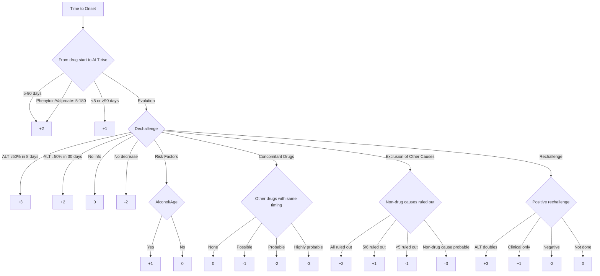
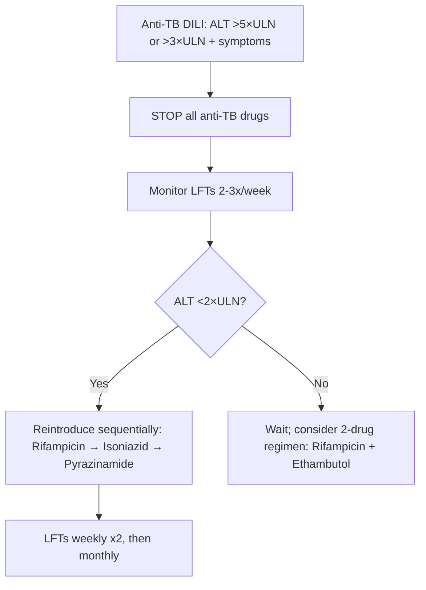
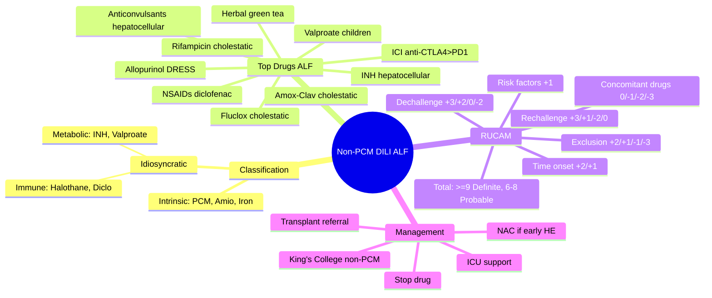

## 1. Learning Objectives
- [ ] Identify drugs causing ALF (non-paracetamol)
- [ ] Apply RUCAM for causality assessment
- [ ] Differentiate intrinsic vs idiosyncratic DILI
- [ ] Know management principles including transplantation criteria
- [ ] Recognize FCPS/MRCP high-yield drug associations

---

## 2. Classification

### Intrinsic (Predictable, Dose-Dependent)
| Drug | Mechanism | Risk Factors |
|------|-----------|--------------|
| **Paracetamol** | NAPQI accumulation | Alcohol, fasting, CYP inducers |
| **Amiodarone** | Phospholipidosis | High dose, long duration |
| **Methotrexate** | Folate antagonist | Renal impairment, high dose |
| **Iron** | Oxidative damage | Acute overdose |

> Note: Paracetamol covered separately

### Idiosyncratic (Unpredictable, Not Dose-Dependent)
| Type | Examples | Features |
|------|----------|----------|
| **Immune-mediated** | Halothane (historical), Diclofenab, Phenytoin | Autoantibodies, eosinophilia, short latency on rechallenge |
| **Metabolic** | Isoniazid, Valproate, Diclofenac | Genetic susceptibility (NAT2, HLA) |

---

## 3. Top Drugs Causing ALF (Non-Paracetamol)

| Drug | Pattern | Latency | FCPS/MRCP Clues |
|------|---------|---------|-----------------|
| **Anti-TB: Isoniazid** | Hepatocellular | 2-12 weeks | **Most common cause of DILI-ALF in TB endemic areas**; NAT2 slow acetylators |
| **Anti-TB: Rifampicin** | Cholestatic | 2-8 weeks | Often with isoniazid; orange secretions |
| **Antibiotics: Amoxicillin-Clavulanate** | Cholestatic/Mixed | 1-6 weeks | **Commonest antibiotic DILI-ALF in West**; elderly, male |
| **Antibiotics: Flucloxacillin** | Cholestatic | 2-4 weeks | >55 years, male, >14 days use |
| **Anticonvulsants: Phenytoin, Carbamazepine, Valproate** | Hepatocellular | 2-8 weeks | Valproate: children <3y, polytherapy, metabolic disorders |
| **NSAIDs: Diclofenac** | Hepatocellular/Mixed | 1-4 weeks | Higher risk than other NSAIDs |
| **Herbal/Alternative** | Variable | Variable | Green tea extract, Herbalife, Ayurvedic (heavy metals) |
| **Immune Checkpoint Inhibitors** | Hepatocellular | 6-14 weeks | Anti-CTLA4 > anti-PD1; colitis co-exists |
| **Allopurinol** | Hypersensitivity/Hepatocellular | 2-6 weeks | DRESS syndrome: rash, eosinophilia, fever, renal |
| **Statins** | Hepatocellular | Weeks-months | Rare ALF; usually asymptomatic ALT rise |

---

## 4. RUCAM (Roussel Uclaf Causality Assessment Method)



### Simplified RUCAM Scoring

| Score | Causality |
|-------|-----------|
| **≥9** | Highly probable |
| **6-8** | Probable |
| **3-5** | Possible |
| **1-2** | Unlikely |
| **≤0** | Excluded |

---

## 5. Specific High-Yield DILI-ALF Syndromes

### Anti-TB Drug-Induced Liver Injury
- **Incidence**: 5-30% asymptomatic ALT rise; 1-5% symptomatic; <1% ALF
- **Isoniazid**: Hepatocellular, NAT2 slow acetylators, alcohol, age >35
- **Rifampicin**: Cholestatic, often with isoniazid
- **Pyrazinamide**: Most hepatotoxic (historically)

**Management Algorithm:**


### Amoxicillin-Clavulanate DILI
- **Demographic**: Male >55 years
- **Latency**: 1-6 weeks (can occur AFTER stopping)
- **Pattern**: Cholestatic (ALP ↑↑), prolonged course (months)
- **Prognosis**: Usually recovers; 10% chronicity; rare ALF

### Valproate Hepatotoxicity
- **High risk**: Children <3 years, polytherapy, metabolic disorders (Alpers syndrome = POLG mutation)
- **Mechanism**: Mitochondrial toxicity
- **Monitor**: LFTs baseline, then 1-3 monthly

### Immune Checkpoint Inhibitor (ICI) Hepatitis
- **Anti-CTLA-4 (ipilimumab)**: Higher incidence (5-10%) vs anti-PD-1 (1-3%)
- **Combination**: 15-30% hepatitis
- **Onset**: 6-14 weeks
- **Management**: Hold ICI; Grade 2+: prednisolone 1mg/kg; Grade 3/4: IV methylpred 2mg/kg + infliximab if steroid-refractory

---

## 6. Management of DILI-ALF

```mermaid
flowchart TD
    A[Suspect DILI-ALF] --> B[Immediate: STOP Suspect Drug(s)]
    B --> C[ICU Supportive Care]
    C --> D[RUCAM Assessment]
    C --> E[Exclude Alternative Causes: Viral, Autoimmune, Wilson, Vascular]
    E --> F{Transplant Criteria Met?}
    F -->|King's College Non-PCM| G[Urgent Transplant Referral]
    F -->|Not yet| H[Continue Supportive Care + NAC?]
    H --> I{Improving?}
    I -->|Yes| J[Monitor to Recovery]
    I -->|No| G
    B --> K[N-Acetylcysteine: Benefit uncertain in non-PCM but reasonable]
```

**NAC in Non-Paracetamol ALF**: RCT (ALFSG) showed improved transplant-free survival in early HE (Grade 1-2); routine use recommended by AASLD/EASL.

---

## 7. FCPS/MRCP High-Yield Summary

| Drug | Pattern | Key Feature |
|------|---------|-------------|
| Isoniazid | Hepatocellular | NAT2 slow acetylator; #1 DILI-ALF in TB areas |
| Rifampicin | Cholestatic | Orange secretions; with INH |
| Amoxicillin-Clavulanate | Cholestatic | Male >55y; can occur post-course |
| Flucloxacillin | Cholestatic | >14 days, >55y, male |
| Phenytoin/Carbamazepine | Hepatocellular | Aromatic anticonvulsants; HLA association |
| Valproate | Hepatocellular | Children <3y, POLG mutation (Alpers) |
| Diclofenac | Hepatocellular | Higher risk than other NSAIDs |
| ICI (ipilimumab) | Hepatocellular | Colitis co-exists; steroids first line |
| Allopurinol | Hypersensitivity | DRESS: rash, eosinophilia, fever, renal |
| Herbal (green tea, kava) | Variable | Ask specifically — patients don't volunteer |

---

## 8. Viva Questions

1. **Classify DILI: intrinsic vs idiosyncratic. Give examples.**
2. **What is RUCAM? How is it scored?**
3. **Which anti-TB drug is most hepatotoxic?**
4. **How do you manage anti-TB DILI with ALT >5×ULN?**
5. **Describe amoxicillin-clavulanate DILI: demographic, pattern, latency.**
6. **What is the risk of valproate hepatotoxicity in children?**
7. **How does ICI hepatitis differ by agent (CTLA-4 vs PD-1)?**
8. **What is DRESS syndrome? Which drugs cause it?**
9. **Does NAC help in non-paracetamol ALF?**
10. **List 5 drugs causing cholestatic DILI.**

---

## 9. Confusions & Mnemonics

| Confusion | Clarification |
|-----------|---------------|
| INH vs Rifampicin pattern | INH = hepatocellular; Rifampicin = cholestatic |
| Amox-clav vs flucloxacillin | Both cholestatic; Amox-clav: male >55, post-course; Fluclox: >14 days use |
| Valproate in adults vs children | Children <3y + polytherapy = HIGH risk; adults = rare |
| NAC in non-PCM ALF | Not for ALL — benefit in early HE (Grade 1-2) transplant-free survival |
| DILI vs AIH | AIH: IgG↑, autoantibodies+, responds to steroids; DILI: drug temporal relationship, RUCAM |

---

## 10. Mind Map



---

## 11. One-Page Revision Card

| Drug | Pattern | Latency | High-Risk Group | Key Feature |
|------|---------|---------|-----------------|-------------|
| Isoniazid | Hepatocellular | 2-12 wks | NAT2 slow acetylators, alcohol, >35y | #1 DILI-ALF in TB areas |
| Rifampicin | Cholestatic | 2-8 wks | With INH | Orange body fluids |
| Amox-Clav | Cholestatic | 1-6 wks | Male >55y | Can occur AFTER stopping |
| Flucloxacillin | Cholestatic | 2-4 wks | >55y, male, >14 days | |
| Valproate | Hepatocellular | 2-8 wks | Children <3y, polytherapy, POLG | Mitochondrial toxicity |
| ICI (ipi) | Hepatocellular | 6-14 wks | Combo > single | Colitis co-exists |

---

## 12. Spaced Repetition Tracker

| Day | 1 | 3 | 7 | 15 | 30 |
|-----|---|---|---|----|----|
| RUCAM scoring | ☐ | ☐ | ☐ | ☐ | ☐ |
| Anti-TB DILI management | ☐ | ☐ | ☐ | ☐ | ☐ |
| Amox-clav vs Fluclox | ☐ | ☐ | ☐ | ☐ | ☐ |
| Valproate risk factors | ☐ | ☐ | ☐ | ☐ | ☐ |
| ICI hepatitis grades | ☐ | ☐ | ☐ | ☐ | ☐ |

---

## 13. Self-Test Scorecard

| Question | My Answer | Correct? |
|----------|-----------|----------|
| RUCAM components |  |  |
| INH vs Rifampicin pattern |  |  |
| Anti-TB DILI reintroduction |  |  |
| Valproate high-risk group |  |  |
| NAC in non-PCM ALF evidence |  |  |

---

## 14. Local Navigation

- [[Drug-Induced Liver Injury/Diagnosis (RUCAM, exclusion)|DILI Diagnosis & RUCAM]]
- [[Drug-Induced Liver Injury/Management and rechallenge|DILI Management]]
- [[Acute Liver Failure/Definition and Aetiology|ALF Definition]]
- [[Acute Liver Failure/King's College Criteria|King's College Criteria]]
- [[Acute Liver Failure/Paracetamol-induced hepatotoxicity|Paracetamol ALF]]
---

> Auto-generated study sections for "Acute Liver Failure" — Ch 23: Hepatology.

## Flashcards (1 generated)

- Q: What is the definition of Acute Liver Failure?
  A: | Drug | Pattern | Latency | FCPS/MRCP Clues |

## MCQs (1 generated)

1. **Which of the following best describes Acute Liver Failure?**
   A. **| Drug | Pattern | Latency | FCPS/MRCP Clues |**
   B. An unrelated condition not matching the clinical picture of Acute Liver Failure
   C. A complication seen late in the disease course of Acute Liver Failure
   D. A condition that mimics Acute Liver Failure but has a different underlying cause

## SBA Questions (1 generated)

1. A patient with suspected Acute Liver Failure presents with: Paracetamol — NAPQI accumulation; Methotrexate — Folate antagonist; Iron — Oxidative damage. What is the most likely diagnosis?
   A. **Acute Liver Failure**
   B. A condition that mimics Acute Liver Failure but is not the same entity
   C. A complication of Acute Liver Failure rather than the primary diagnosis
   D. An unrelated condition in the same clinical category as Acute Liver Failure

## PasTest Scenario SBAs (Clinical Vignettes)

> **Auto-generated PasTest/Mediscope-style scenario SBAs** grounded in the authored source. Each scenario tests a real clinical fact (triad, specific sign, contraindication, trial, first-line Rx) extracted from the topic. *Source: Ch 23: Hepatology — Non-paracetamol drug-induced liver injury*

**Q1.** What is the most appropriate first-line therapy for Non-paracetamol drug-induced liver injury?

  - **A.** NAC in Non-Paracetamol ALF
  - **B.** An advanced/surgical therapy reserved for refractory disease
  - **C.** Symptomatic treatment only, no disease-modifying therapy
  - **D.** Empiric broad-spectrum therapy without specific indication

  > **Answer: A** — NAC in Non-Paracetamol ALF
  >
  > *Source:* **NAC in Non-Paracetamol ALF**: RCT (ALFSG) showed improved transplant-free survival in early HE (Grade 1-2); routine use recommended by AASLD/EASL.

---

