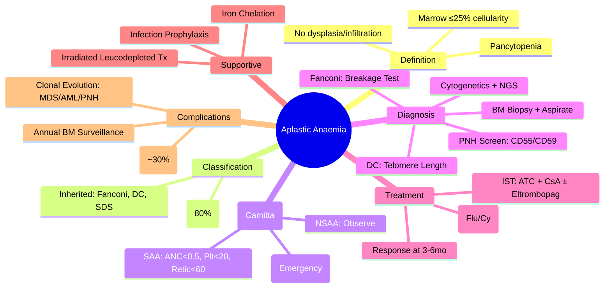

# Aplastic Anaemia (AA)

> [!info] **Davidson Ch 25 Alignment**: Bone Marrow Failure Syndromes → Aplastic Anaemia
> **FCPS/MRCP Focus**: Diagnosis (exclude mimics), severity classification (Camitta), IST vs HSCT decision, supportive care

---

## 🎯 Learning Objectives

- [ ] Define aplastic anaemia: pancytopenia + hypocellular marrow (≤25% cellularity) without abnormal cells
- [ ] Classify: Acquired (immune-mediated) vs Inherited (Fanconi, Dyskeratosis congenita, etc.)
- [ ] Apply **Camitta severity criteria** (SAA, VSAA, NSAA) for prognosis and treatment selection
- [ ] Differentiate from MDS, PNH, hypoplastic MDS, nutritional deficiencies, infiltrative disorders
- [ ] Outline first-line treatment: **IST (ATC + CsA)** vs **HSCT** – age/severity/donor-based algorithm
- [ ] Manage supportive care: transfusions (irradiated, leucodepleted), infections, iron overload
- [ ] Monitor for clonal evolution: MDS, AML, PNH
- [ ] Understand eltrombopag role (add-on to IST, refractory AA)

---

## 📖 Definition & Classification

| Category | Aetiology | Key Features |
|----------|-----------|--------------|
| **Acquired (Immune-mediated)** | **Idiopathic (80%)**, Drugs (chloramphenicol, gold, carbamazepine), Viruses (Hepatitis, EBV, HIV, Parvovirus), Toxins (benzene), Pregnancy, Autoimmune (SLE) | T-cell mediated stem cell destruction; **responsive to IST** |
| **Inherited** | **Fanconi Anaemia** (FA pathway genes), **Dyskeratosis Congenita** (DKC1, TERC, TERT), **Shwachman-Diamond** (SBDS), **Cartilage-hair hypoplasia** (RMRP) | Physical stigmata, family history, young onset, **chromosomal breakage test (Fanconi)** |

> [!tip] **FCPS/MRCP**: **Acquired AA is immune-mediated** – T-cells destroy stem cells → responsive to IST. **Inherited = chromosomal breakage (Fanconi) or telomere defects (DC)**.

---

## ⚙️ Pathophysiology

```mermaid
flowchart TD
    A[Trigger: Drug, Virus, Idiopathic] --> B[Antigen Exposure on HSC]
    B --> C[Activated Cytotoxic T-cells (Th1/Th17)]
    C --> D[IFN-γ, TNF-α Release]
    D --> E[Fas/FasL Apoptosis Pathway]
    D --> F[TRAIL/DR5 Pathway]
    D --> G[Perforin/Granzyme]
    E & F & G --> H[HSC Apoptosis & Cell Cycle Arrest]
    H --> I[Empty Marrow → Pancytopenia]
    I --> J[Oligoclonal HSC Survival]
    J --> K[Clonal Evolution Risk: PNH, MDS, AML]
```

**Key: Immune-mediated destruction of CD34+ stem cells by activated T-cells → cytokines (IFN-γ, TNF-α) → apoptosis**

---

## 🔬 Diagnostic Workup

### Essential Criteria (All Required)
1. **Pancytopenia** (2 of 3): Hb <10, Neutrophils <1.5, Platelets <50
2. **Hypocellular marrow** ≤25% cellularity (or 25-50% with <30% residual haematopoiesis)
3. **No abnormal infiltrates / fibrosis / dysplasia** (exclude MDS, leukaemia)

```mermaid
flowchart TD
    A[Pancytopenia] --> B[Peripheral Blood Film]
    B --> C{Macrocytosis?}
    C --> D[Bone Marrow Biopsy + Aspirate]
    D --> E{Cellularity ≤25%?}
    E -->|Yes| F[Diagnosis: Aplastic Anaemia]
    E -->|No (25-50%)| G[Check: <30% haematopoiesis?]
    G -->|Yes| F
    G -->|No| H[Consider: Hypoplastic MDS, PNH, Infiltration]
    F --> I[Severity: Camitta Criteria]
    I --> J[PNH Screen: Flow Cytometry CD55/CD59]
    F --> K[Chromosomal Breakage: Fanconi?]
    F --> L[Telomere Length: Dyskeratosis?]
    F --> M[Cytogenetics + NGS Panel]
```

### Camitta Severity Classification

| Severity | Neutrophils (×10⁹/L) | Platelets (×10⁹/L) | Reticulocytes (×10⁹/L) | Management |
|----------|----------------------|-------------------|------------------------|------------|
| **NSAA** (Non-Severe) | >1.5 | >50 | >60 | Supportive, observe, treat trigger |
| **SAA** (Severe) | **<0.5** | **<20** | **<60** | **IST or HSCT** |
| **VSAA** (Very Severe) | **<0.2** | **<20** | **<60** | **Urgent HSCT if young/matched donor**; IST if no donor |

> [!warning] **VSAA = Medical Emergency** – High early mortality from sepsis/bleeding

### Key Investigations

| Test | Purpose |
|------|---------|
| **BM Biopsy** | Cellularity, exclude MDS/leukaemia/fibrosis, iron stores |
| **Flow Cytometry (PNH screen)** | CD55/CD59 (GPI-anchored) on granulocytes/monocytes/RBCs – **detect PNH clone** |
| **Chromosomal Breakage (DEB/MMC)** | **Fanconi Anaemia** diagnosis (gold standard) |
| **Telomere Length (Flow-FISH)** | **Dyskeratosis Congenita** (short telomeres) |
| **Cytogenetics (Karyotype + FISH)** | Baseline for clonal evolution monitoring |
| **NGS Panel** | Somatic mutations (ASXL1, DNMT3A, BCOR, PIGA) – predict evolution |
| **HLA Typing** | For HSCT donor search |
| **Viral Serology** | Hepatitis A/B/C/E, HIV, EBV, CMV, Parvovirus B19 |

---

## 🩺 Clinical Features

| Lineage | Manifestations |
|---------|----------------|
| **Anaemia** | Fatigue, dyspnoea, pallor, tachycardia; **macrocytic** (stress erythropoiesis) |
| **Neutropenia** | **Sepsis risk** (Gram-negative, fungal); fever = emergency; oral ulcers, perianal sepsis |
| **Thrombocytopenia** | Petechiae, ecchymoses, mucosal bleeding, **intracranial haemorrhage risk** |
| **Inherited Syndromes** | Fanconi: café-au-lait, thumb/radial anomalies, short stature, microcephaly, renal; DC: nail dystrophy, leukoplakia, reticulate hyperpigmentation |

---

## 💊 Management Algorithm

```mermaid
flowchart TD
    A[Newly Diagnosed AA] --> B{Severity}
    B -->|NSAA| C[Supportive Care<br/>Treat Trigger<br/>Monitor]
    B -->|SAA/VSAA| D{Age ≤40 & Matched Sibling Donor?}
    D -->|Yes| E[**Allogeneic HSCT**<br/>1st line]
    D -->|No| F[**IST: ATC + CsA**<br/>+ Eltrombopag]
    E --> G[Response at 6mo]
    F --> G
    G -->|CR/PR| H[Continue CsA taper<br/>Monitor Relapse]
    G -->|No Response (NR)| I[Add Eltrombopag if not used<br/>Or 2nd IST (ATC+Csa+Eltrombo)<br/>Or Mismatch/Unrelated HSCT]
    H --> J[Long-term: Clonal Evolution Surveillance]
    I --> J
```

### First-Line Treatment Options

| Scenario | **Preferred** | Alternative |
|----------|---------------|-------------|
| **Age ≤40, Matched Sibling Donor** | **Allogeneic HSCT** (MAC regimen: Cy + Flu ± TBI) | IST if donor unavailable/refused |
| **Age >40 OR No Matched Donor** | **IST: ATC + CsA** | Add **Eltrombopag** (↑ response rate) |
| **VSAA, any age, donor available** | **Urgent HSCT** | IST if HSCT delayed >4-6 weeks |
| **Children <16** | **HSCT preferred** (better outcomes) | IST if no donor |

### Immunosuppressive Therapy (IST) Regimen

| Drug | Dose | Duration | Key Monitoring |
|------|------|----------|----------------|
| **Rabbit ATC** (Thymoglobulin) | 3.5 mg/kg/day IV × 4 days (total 14 mg/kg) | Single course | **Serum sickness** (fevers, rash, arthralgia d7-14), infection, cytokine release |
| **Horse ATC** (ATGAM) | 40 mg/kg/day IV × 4 days | Single course | Less serum sickness, less potent |
| **Cyclosporine A (CsA)** | 5-6 mg/kg/day PO divided BD | **Minimum 6 months**, taper over 6-12mo if response | **Trough level 150-250 ng/mL**, renal function, BP, Mg, K, tremor, hirsutism |
| **Eltrombopag** (Add-on) | 150 mg/day PO (100 mg if East Asian) | Start Day 1 of IST, continue 6mo | LFT, cataracts, marrow fibrosis (long-term) |

> [!tip] **FCPS/MRCP**: **IST = ATC + CsA ± Eltrombopag**. Response at 3-6 months. **CsA trough 150-250 ng/mL**. Relapse in ~30% after stopping CsA.

### Response Criteria (at 6 months)

| Response | Criteria |
|----------|----------|
| **Complete (CR)** | Hb ≥12, Neutrophils ≥1.0, Platelets ≥100 |
| **Partial (PR)** | Improvement but not CR; transfusion independence |
| **No Response (NR)** | Fails PR criteria |

---

## 🌱 Allogeneic HSCT in AA

| Factor | Recommendation |
|--------|----------------|
| **Best Donor** | HLA-matched sibling (MRD) |
| **Conditioning** | **Non-MAC preferred**: Flu + Cy ± low-dose TBI (reduces GVHD, preserves fertility) |
| **GVHD Prophylaxis** | CsA + MMF ± Sirolimus; ATG in conditioning |
| **Age Limit** | Traditionally ≤40; expanding with reduced-intensity |
| **Outcomes** | **<20y**: 90% OS; **20-40y**: 80% OS; **>40y**: 60-70% OS |
| **Complications** | GVHD (acute/chronic), infertility, secondary malignancies, iron overload |

---

## 🩸 Supportive Care

| Aspect | Management |
|--------|------------|
| **RBC Transfusion** | Threshold Hb <7-8 (symptomatic); **Irradiated + Leucodepleted** (prevent TA-GVHD, alloimmunization); Avoid CMV+ if seronegative |
| **Platelet Transfusion** | Threshold <10 (prophylactic); <20 (fever/sepsis); <50 (active bleed/procedure); **Irradiated, HLA-matched if refractory** |
| **Infection Prophylaxis** | **Ciprofloxacin** (neutropenic prophylaxis), **Posaconazole/Voriconazole** (mould-active if prolonged neutropenia), **Aciclovir** (HSV/VZV), **Co-trimoxazole** (PCP) |
| **Growth Factors** | **G-CSF** (controversial in AA – may stimulate clones); not routine |
| **Iron Chelation** | If ferritin >1000 or >20 RBC units: **Deferasirox** (monitor renal) |
| **Vaccinations** | Post-HSCT: re-immunisation schedule; IST: inactivated vaccines safe |

---

## ⚠️ Complications & Clonal Evolution

| Complication | Incidence | Management |
|--------------|-----------|------------|
| **Relapse (post-IST)** | ~30% at 5 years | 2nd IST (ATC+CsA+Eltrombopag) or HSCT |
| **Clonal Evolution** | 10-15% at 10y | **Annual BM + cytogenetics + NGS** |
| **PNH Clone** | ~10-20% at dx | Monitor clone size; if symptomatic → eculizumab |
| **MDS/AML** | ~10-15% at 10y | Early detection → HSCT if fit |
| **Iron Overload** | Chronic transfusion | Chelation if ferritin >1000 |
| **Infertility** | HSCT (MAC) | Fertility preservation pre-HSCT |

> [!warning] **Surveillance**: **Annual BM biopsy + karyotype + NGS panel** for early MDS/AML detection

---

## 🔄 Differential Diagnosis

| Condition | Distinguishing Features |
|-----------|------------------------|
| **Hypoplastic MDS** | **Dysplasia** ≥10% in ≥1 lineage, cytogenetic abnormalities, may have ↑blasts |
| **PNH** | **Haemolysis** (LDH↑, haptoglobin↓, Hburia), thrombosis, **CD55/CD59 negative clone** |
| **Fanconi Anaemia** | Congenital anomalies, **chromosomal breakage +ve**, young age, family history |
| **Dyskeratosis Congenita** | Mucocutaneous triad, **short telomeres**, young onset |
| **B12/Folate Deficiency** | **Megaloblastic** marrow (hypercellular), macrocytosis, low B12/folate, neurologic signs |
| **Infiltration (Lymphoma, Metastatic)** | **Focal/paratrabecular** infiltration on biopsy, lymphoma markers |
| **Viral Suppression** | Parvovirus (pure red cell aplasia), HIV, Hepatitis – usually transient |

---

## 💡 FCPS/MRCP High-Yield Summary

| Topic | Key Point |
|-------|-----------|
| **Definition** | Pancytopenia + **Hypocellular marrow ≤25%** + no abnormal cells |
| **Severity** | **SAA**: ANC<0.5, Plt<20, Retic<60; **VSAA**: ANC<0.2 |
| **Aetiology** | **Acquired (immune-mediated) 80%**; Inherited (Fanconi, DC) |
| **PNH Screen** | **Flow cytometry CD55/CD59** – mandatory at diagnosis |
| **Fanconi Test** | **Chromosomal breakage (DEB/MMC)** – gold standard |
| **First-line: Age ≤40 + MSD** | **HSCT** (Flu/Cy ± TBI) |
| **First-line: Age >40 or No MSD** | **IST: Rabbit ATC + CsA ± Eltrombopag** |
| **CsA Target** | **Trough 150-250 ng/mL** |
| **Response** | Assess at **3-6 months**; CR = Hb≥12, ANC≥1, Plt≥100 |
| **Relapse** | ~30% → 2nd IST or HSCT |
| **Clonal Evolution** | **Annual BM + cytogenetics + NGS** (MDS/AML/PNH) |
| **Transfusion** | **Irradiated + Leucodepleted**; CMV-safe if negative |
| **Eltrombopag** | Add to IST ↑ response rate; monitor LFT, cataracts |

---

## ❓ Viva Questions

1. **What are the diagnostic criteria for aplastic anaemia?**
   - Pancytopenia (2/3 lineages) + **BM hypocellularity ≤25%** + no dysplasia/infiltration

2. **How do you classify severity (Camitta criteria)?**
   - SAA: ANC<0.5, Plt<20, Retic<60; VSAA: ANC<0.2; NSAA: doesn't meet SAA

3. **What is the first-line treatment for a 30-year-old with SAA and a matched sibling donor?**
   - **Allogeneic HSCT** (preferred <40 with MSD)

4. **Describe the IST regimen for AA.**
   - **Rabbit ATC 3.5 mg/kg/day × 4 days + CsA 5-6 mg/kg/day (trough 150-250) ± Eltrombopag 150 mg/day**

5. **When do you assess response to IST?**
   - **3-6 months**; CR = Hb≥12, ANC≥1, Plt≥100; PR = transfusion independence

6. **What is the relapse rate after IST and how is it managed?**
   - ~30% at 5 years; **2nd IST (ATC+CsA+Eltrombopag) or HSCT**

7. **What screening is mandatory at diagnosis of AA?**
   - **PNH screen (CD55/CD59 flow)**; **Chromosomal breakage (Fanconi)** if young/family hx; **Telomere length (DC)** if stigmata

8. **Why must transfusions be irradiated and leucodepleted in AA?**
   - Irradiated: prevent **TA-GVHD** (immunocompromised); Leucodepleted: reduce **alloimmunization** & CMV risk

9. **How do you monitor for clonal evolution?**
   - **Annual BM biopsy + karyotype + NGS panel** (ASXL1, DNMT3A, BCOR, PIGA mutations)

10. **Differentiate hypoplastic MDS from AA.**
    - **MDS: Dysplasia ≥10%, cytogenetic abnormalities, ↑blasts**; AA: no dysplasia, normal karyotype (usually)

---

## 🧠 Confusions & Mnemonics

| Confusion | Clarification |
|-----------|---------------|
| **AA vs Hypoplastic MDS** | **Dysplasia = MDS**; AA = empty marrow without dysplasia |
| **AA vs PNH** | **PNH = haemolysis + thrombosis + CD55/CD59-**; AA = pancytopenia without haemolysis (unless PNH clone) |
| **Rabbit vs Horse ATC** | **Rabbit = more potent, more serum sickness**; Horse = less potent, less serum sickness |
| **IST vs HSCT age cutoff** | **<40 with MSD = HSCT**; >40 or no MSD = IST |
| **Eltrombopag in AA** | **Add-on to IST** (not monotherapy); ↑ response; monitor LFT |

| Mnemonic | Meaning |
|----------|---------|
| **"AA = Empty Marrow ≤25%"** | Diagnostic cellularity threshold |
| **"SAA = ANC <0.5, Plt <20, Retic <60"** | Camitta severe criteria |
| **"VSAA = Very Scary: ANC <0.2"** | Very severe = medical emergency |
| **"IST = ATC + CsA (trough 150-250)"** | Immunosuppressive therapy regimen |
| **"HSCT <40 + MSD"** | Transplant first-line criteria |
| **"PNH Screen = CD55/CD59 Flow"** | Mandatory at diagnosis |
| **"Fanconi = Breakage Test"** | Chromosomal breakage with DEB/MMC |

---

## 🗺️ Mind Map



---

## 📋 One-Page Revision Card

| **APLASTIC ANAEMIA – FCPS/MRCP REVISION CARD** |
|-------------------------------------------------|
| **Definition**: Pancytopenia + **BM ≤25% cellularity** + no abnormal cells |
| **Camitta**: SAA (ANC<0.5, Plt<20, Retic<60); VSAA (ANC<0.2); NSAA |
| **Aetiology**: Acquired immune 80%; Inherited (Fanconi, DC) |
| **Diagnosis**: BM biopsy, **PNH screen (CD55/CD59)**, Fanconi breakage, Telomere length, Cytogenetics/NGS |
| **Treatment**: **<40 + MSD = HSCT**; **>40 or No MSD = IST (ATC+CsA±Eltrombopag)** |
| **IST**: Rabbit ATC 3.5mg/kg×4d + CsA 5-6mg/kg (trough **150-250**) ± Eltrombopag 150mg |
| **Response**: 3-6mo; CR = Hb≥12, ANC≥1, Plt≥100 |
| **Relapse**: 30% → 2nd IST or HSCT |
| **Clonal Evolution**: Annual BM + Karyotype + NGS (MDS/AML/PNH) |
| **Transfusion**: **Irradiated + Leucodepleted + CMV-safe** |
| **PNH Clone**: ~10-20% at dx; monitor size |

---

## 📅 Spaced Repetition Tracker

| Review | Date | Score (1-5) | Next Review |
|--------|------|-------------|-------------|
| Day 1 | 2025-06-15 | | 2025-06-16 |
| Day 3 | | | |
| Day 7 | | | |
| Day 15 | | | |
| Day 30 | | | |

---

## 🎯 Must Know / Should Know / Nice to Know

| Level | Content |
|-------|---------|
| **Must Know** | Definition, Camitta criteria, IST vs HSCT algorithm, ATC+CsA regimen, CsA trough, response criteria, PNH screen, Fanconi breakage test, irradiated/leucodepleted transfusion, clonal evolution surveillance |
| **Should Know** | Eltrombopag role, Rabbit vs Horse ATC, VSAA urgency, inherited syndromes (Fanconi, DC), relapse management, infection prophylaxis, iron chelation thresholds |
| **Nice to Know** | NGS mutation panel details (ASXL1, DNMT3A, BCOR, PIGA), conditioning regimens for HSCT, fertility preservation, detailed GVHD prophylaxis, pregnancy in AA |

---

## ✅ Self-Test Scorecard

| Section | Score (0-10) | Notes |
|---------|--------------|-------|
| Definition & Classification | | |
| Severity & Camitta Criteria | | |
| Diagnostic Workup | | |
| IST vs HSCT Algorithm | | |
| IST Regimen & Monitoring | | |
| HSCT Details | | |
| Supportive Care | | |
| Clonal Evolution Surveillance | | |
| Viva Questions | | |

---

## 🔗 Local Navigation

- **Previous**: [[Sickle Cell Disease]]
- **Next**: [[Acute Myeloid Leukaemia (AML)]]
- **Section Hub**: [[Anaemia and Red Cell Disorders]]
- **MOC**: [[Hematology MOC]]
- **Template**: [[../Templates/Hematology Topic Template]]

---

*Generated for FCPS/MRCP exam preparation. Based on Davidson Medicine 24th Ed Chapter 25.*