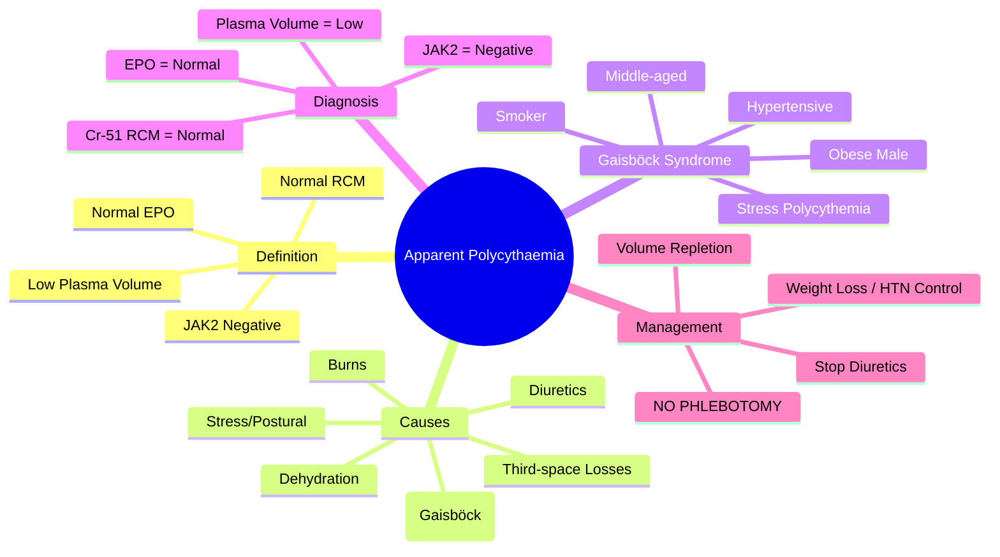

# Apparent (Relative) Polycythaemia

> [!info] **Davidson Ch 25 Alignment**: Anaemia and Red Cell Disorders → Polycythaemia → Apparent/Relative Polycythaemia
> **FCPS/MRCP Focus**: Gaisböck syndrome, dehydration, diuretics, obesity, distinction from true polycythaemia, red cell mass measurement, management

---

## 🎯 Learning Objectives

- [ ] Define **Apparent Polycythaemia**: **Normal Red Cell Mass**, **Reduced Plasma Volume** → **Spurious elevation** of Hb/Hct
- [ ] Distinguish from **True Polycythaemia** (PV, Secondary): **Normal Red Cell Mass**, **Normal EPO**
- [ ] Identify **Causes**: Dehydration, Diuretics, Obesity (Gaisböck Syndrome), Burns, Third-space losses, Stress
- [ ] Diagnose: **Red Cell Mass Measurement** (Cr-51), **Plasma Volume**, **Normal EPO**, **U&E/Creatinine**
- [ ] Manage: **Volume Repletion** (Oral/IV fluids), **Treat Underlying Cause**, **Stop Diuretets if possible**

---

## 📖 Definition & Mechanism

| Feature | Apparent Polycythaemia | True Polycythaemia |
|---------|------------------------|-------------------|
| **Red Cell Mass** | **Normal** | **Increased** |
| **Plasma Volume** | **Decreased** | Normal/Increased |
| **EPO Level** | **Normal** | Low (PV) / High (Secondary) |
| **Hb/Hct** | **Elevated** (Spurious) | Elevated (True) |
| **Mechanism** | **Haemoconcentration** (Plasma loss) | True erythrocytosis |

> [!tip] **Apparent Polycythaemia = Normal RCM + Low Plasma Volume = Normal EPO**. **True Polycythaemia = Increased RCM + Abnormal EPO**.

---

## 📖 Causes & Classification

| Category | Causes | Mechanism |
|----------|--------|-----------|
| **Fluid Loss** | **Dehydration** (Vomiting, Diarrhoea, Poor intake), **Diuretics** (Loop, Thiazide), **Burns**, **Excessive Sweating** | **Volume Depletion** |
| **Redistribution** | **Third-space losses** (Ascites, Peritonitis, Pancreatitis, Bowel obstruction) | **Plasma Sequestration** |
| **Obesity (Gaisböck Syndrome)** | **White males, Middle-aged, Obese, Hypertensive, Smokers** | **Apparent ↓ Plasma Volume** (mechanism unclear: ?renin-angiotensin, ?sympathetic) |
| **Stress/Postural** | **Acute stress**, **Exercise**, **Postural change** (Supine to standing) | **Transient plasma shift** |
| **Drug-induced** | **Diuretics**, **ACE inhibitors** (rare), **Diabetic ketoacidosis** (osmotic diuresis) | **Diuresis/Volume loss** |

---

## 📖 Gaisböck Syndrome (Stress Polycythemia)

| Feature | Details |
|---------|---------|
| **Definition** | **Apparent Polycythaemia in Obese, Hypertensive, Middle-aged White Males** |
| **Synonyms** | **Stress Polycythemia**, **Pseudo-Polycythaemia**, **Gaisböck Syndrome** |
| **Demographics** | **Male, 40-60 years, Obese (BMI >30), Hypertensive, Smoker, Stressed** |
| **Pathophysiology** | **Unknown**: ?Sympathetic overactivity, ?Renin-angiotensin, ?Plasma volume ↓ due to adipose tissue compression |
| **Associated** | **Metabolic Syndrome** (Diabetes, Hyperlipidaemia), **Coronary Artery Disease**, **Gout** (Uric acid ↑) |
| **Lab** | **Hb/Hct ↑**, **Normal RCM**, **Plasma Volume ↓**, **Normal EPO** |

> [!warning] **Gaisböck = Obesity + Hypertension + Apparent Polycythaemia + Normal RCM**. **NOT true erythrocytosis**. **Phlebotomy HARMFUL** (causes iron deficiency).

---

## 🔬 Diagnostic Workup

```mermaid
flowchart TD
    A[Elevated Hb/Hct] --> B[**CBC + Film**]
    B --> C{**Normocytic? No dysplastic features?**}
    C --> D[**JAK2 V617F / Exon 12**]
    D --> E{**JAK2 Positive?**}
    E -->|Yes| F[**Polycythaemia Vera**]
    E -->|No| G[**Serum EPO Level**]
    G --> H{**EPO Elevated?**}
    H -->|Yes| I[**Secondary Polycythaemia**]
    H -->|No| J[**Apparent Polycythaemia Likely**]
    J --> K[**Red Cell Mass (Cr-51) + Plasma Volume**]
    K --> L{**RCM Normal + Plasma Volume Low?**}
    L -->|Yes| M[**Apparent Polycythaemia Confirmed**]
    L -->|No| N[**Reconsider: Secondary / PV**]
```

### Key Investigations

| Test | Apparent Polycythaemia | True Polycythaemia |
|------|------------------------|-------------------|
| **Red Cell Mass (Cr-51)** | **Normal** | **Increased** |
| **Plasma Volume** | **Decreased** | Normal/Increased |
| **Total Blood Volume** | Normal/Decreased | Increased |
| **EPO Level** | **Normal** | Low (PV) / High (Secondary) |
| **JAK2 V617F** | **Negative** | Positive (PV) |
| **U&E/Creatinine** | **↑ Urea/Creatinine** (if dehydrated) | Normal |
| **Uric Acid** | **Often ↑** (Gaisböck) | Variable |

---

## 💊 Management

### General Principles

| Intervention | Details |
|--------------|---------|
| **Volume Repletion** | **Oral/IV Fluids** (0.9% Saline, Hartmann's) → **Corrects Haemoconcentration** |
| **Treat Underlying Cause** | **Stop Diuretics** (if possible), **Treat Dehydration**, **Manage Obesity/HTN** |
| **Avoid Phlebotomy** | **CONTRAINDICATED** → Causes **Iron Deficiency** (RCM normal, removing RBCs → Anaemia) |
| **Obesity Management** | **Weight Loss**, **Exercise**, **Diet**, **HTN Control** → May resolve Apparent Polycythaemia |
| **Diuretic Review** | **Switch/Reduce** if possible; **Monitor Renal Function** |

### Specific Scenarios

| Scenario | Management |
|----------|------------|
| **Dehydration** | **Oral/IV Fluids** (Saline/Hartmann's) → Hb/Hct normalise in hours |
| **Diuretic-induced** | **Hold/Reduce Diuretic**; **Volume Repletion**; **Monitor Renal Function** |
| **Burns** | **Aggressive Fluid Resuscitation** (Parkland Formula) |
| **Gaisböck Syndrome** | **Weight Loss**, **HTN Control**, **Exercise**, **Smoking Cessation** |
| **Third-space Losses** | **Treat Underlying** (Ascites drainage, Pancreatitis management) + **IV Fluids** |

---

## 🔄 Differential Diagnosis

| Condition | JAK2 | EPO | RCM | Plasma Volume | Key Feature |
|-----------|------|-----|-----|---------------|-------------|
| **Apparent Polycythaemia** | Neg | Normal | **Normal** | **Low** | **Haemoconcentration** |
| **Polycythaemia Vera** | **Pos** | Low | High | Normal/High | JAK2+, Low EPO |
| **Secondary Polycythaemia** | Neg | **High** | High | Normal | Hypoxia / EPO-secreting tumour |
| **Dehydration** | Neg | Normal | Normal | **Low** | Transient, Urea↑ |
| **Obesity/Gaisböck** | Neg | Normal | Normal | Low | Obese, Hypertensive, Male |

---

## 💡 FCPS/MRCP High-Yield Summary

| Topic | Key Point |
|-------|-----------|
| **Definition** | **Normal Red Cell Mass + Low Plasma Volume = Apparent Polycythaemia** |
| **EPO** | **Normal** (vs Low in PV, High in Secondary) |
| **JAK2** | **Negative** (vs Positive in PV) |
| **Main Causes** | **Dehydration, Diuretics, Obesity (Gaisböck), Burns, Third-space losses** |
| **Gaisböck Syndrome** | **Obese, Male, Hypertensive, Smoker** → Apparent Polycythemia |
| **Diagnosis** | **RCM Normal + Plasma Volume Low + EPO Normal + JAK2 Neg** |
| **Key Test** | **Red Cell Mass (Cr-51) + Plasma Volume** (Gold Standard) |
| **Management** | **Volume Repletion (IV Fluids)**; **Stop Diuretics**; **Treat Obesity/HTN**; **NO Phlebotomy** |
| **Phlebotomy** | **CONTRAINDICATED** → Causes Iron Deficiency |

---

## ❓ Viva Questions

1. **How do you distinguish Apparent Polycythaemia from Polycythaemia Vera?**
   - **Apparent: JAK2 Neg, EPO Normal, RCM Normal, Plasma Volume Low**; **PV: JAK2 Pos, EPO Low, RCM High**

2. **What is Gaisböck Syndrome and who does it affect?**
   - **Apparent Polycythaemia in Obese, Hypertensive, Middle-aged White Males** (Stress Polycythemia)

3. **Why is Phlebotomy contraindicated in Apparent Polycythaemia?**
   - **Normal Red Cell Mass** → Removing RBCs causes **Iron Deficiency Anaemia**

4. **What is the diagnostic test for Apparent Polycythaemia?**
   - **Red Cell Mass (Cr-51) + Plasma Volume measurement** → **Normal RCM + Low Plasma Volume**

5. **What are the main causes of Apparent Polycythaemia?**
   - **Dehydration, Diuretics, Obesity (Gaisböck), Burns, Third-space losses**

5. **How does Diuretic use cause Apparent Polycythaemia?**
   - **Volume Depletion** → **Reduced Plasma Volume** → Relative increase in Hb/Hct

6. **What is Gaisböck Syndrome and how is it managed?**
   - **Obese, Male, Hypertensive, Smoker with Apparent Polycythemia**; **Weight Loss, HTN Control, Smoking Cessation, NO Phlebotomy**

6. **What is the Red Cell Mass in Apparent Polycythaemia vs Polycythaemia Vera?**
   - **Apparent: Normal**; **PV: Increased**

7. **Why is JAK2 testing important in a patient with elevated Hb?**
   - **JAK2 Positive = Polycythaemia Vera**; **JAK2 Negative + EPO High = Secondary**; **JAK2 Negative + EPO Normal = Apparent**

8. **How do you confirm the diagnosis of Apparent Polycythaemia?**
   - **Cr-51 Red Cell Mass (Normal) + Plasma Volume (Low) + Normal EPO + JAK2 Negative**

9. **Can Apparent Polycythaemia coexist with true Polycythemia?**
   - **Yes** - Obese patient with PV can have both; **RCM increased + Plasma volume decreased** = Mixed picture

10. **What is the treatment for Diuretic-induced Apparent Polycythaemia?**
    - **Hold/Reduce Diuretic**, **Volume Repletion**, **Monitor Renal Function**

---

## 🧠 Confusions & Mnemonics

| Confusion | Clarification |
|-----------|---------------|
| **Apparent vs PV** | **Apparent = JAK2 Neg, EPO Normal, RCM Normal**; **PV = JAK2 Pos, EPO Low, RCM High** |
| **Apparent vs Secondary** | **Apparent = EPO Normal, RCM Normal**; **Secondary = EPO High, RCM High** |
| **Apparent vs Dehydration** | **Dehydration = Acute, Urea↑, Reverses with Fluids**; **Apparent = Chronic (Obesity/Diuretics)** |
| **Gaisböck vs PV** | **Gaisböck = JAK2 Neg, RCM Normal**; **PV = JAK2 Pos, RCM High** |
| **Phlebotomy** | **CONTRAINDICATED** in Apparent (causes Iron Deficiency) |

| Mnemonic | Meaning |
|----------|---------|
| **"Apparent = Fake = Normal RCM"** | Core concept |
| **"Gaisböck = Big Guy + High BP + Fake High Hb"** | Gaisböck syndrome |
| **"NO Phlebotomy in Apparent = Iron Def"** | Management |
| **"RCM Normal = Apparent; RCM High = True"** | Diagnostic key |
| **"JAK2 Neg + EPO Normal = Apparent"** | Diagnostic formula |
| **"Diuretic = Volume Down = Hb Up = Fake"** | Diuretic cause |

---

## 🗺️ Mind Map



---

## 📋 One-Page Revision Card

| **APPARENT POLYCYTHAEMIA – FCPS/MRCP REVISION CARD** |
|--------------------------------------------------------|
| **Definition**: **Normal RCM + Low Plasma Volume = Spurious Hb/Hct Elevation** |
| **EPO**: **Normal** (vs PV=Low, Secondary=High) |
| **JAK2**: **Negative** (vs PV=Positive) |
| **Causes**: **Dehydration, Diuretics, Obesity (Gaisböck), Burns, Third-space** |
| **Gaisböck**: **Obese Male + Hypertension + Smoker + Apparent Polycythaemia** |
| **Diagnosis**: **RCM Normal (Cr-51) + Plasma Volume Low + EPO Normal + JAK2 Neg** |
| **Management**: **IV Fluids, Stop Diuretics, Weight Loss, HTN Control** |
| **NO PHLEBOTOMY** → Causes **Iron Deficiency** |
| **Differential**: **PV (JAK2+, RCM↑)**, **Secondary (EPO↑, RCM↑)**, **Dehydration (Acute, Urea↑)** |

---

## 📅 Spaced Repetition Tracker

| Review | Date | Score (1-5) | Next Review |
|--------|------|-------------|-------------|
| Day 1 | 2025-06-17 | | 2025-06-18 |
| Day 3 | | | |
| Day 7 | | | |
| Day 15 | | | |
| Day 30 | | | |

---

## 🎯 Must Know / Should Know / Nice to Know

| Level | Content |
|-------|---------|
| **Must Know** | Definition (Normal RCM, Low Plasma Volume), JAK2 Neg/Normal EPO, Causes (Dehydration, Diuretics, Gaisböck), Gaisböck syndrome features, Diagnosis (Normal RCM + Low PV), Management (IV Fluids, NO Phlebotomy), Differentiation from PV/Secondary |
| **Should Know** | Red cell mass measurement technique (Cr-51), Plasma volume measurement, Gaisböck pathophysiology, Volume depletion vs true erythrocytosis, Diuretic-induced mechanism, Phlebotomy harm in apparent polycythaemia, Coexistence with true polycythaemia |
| **Nice to Know** | Historical aspects (Gaisböck 1952), Stress polycythemia pathophysiology, Sympathetic overactivity role, Renin-angiotensin in Gaisböck, Cost-effectiveness of RCM measurement, Quality of life in apparent polycythaemia, Long-term outcomes of Gaisböck patients, Paediatric apparent polycythaemia |

---

## ✅ Self-Test Scorecard

| Section | Score (0-10) | Notes |
|---------|--------------|-------|
| Definition & Mechanism | | |
| Gaisböck Syndrome | | |
| Diagnostic Workup | | |
| Management | | |
| Differential Diagnosis | | |
| Viva Questions | | |

---

## 🔗 Local Navigation

- **Previous**: [[Secondary Polycythaemia]]
- **Next**: [[Cutaneous T-cell Lymphoma]]
- **Section Hub**: [[Anaemia and Red Cell Disorders]]
- **MOC**: [[Hematology MOC]]
- **Template**: [[../Templates/Hematology Topic Template]]

---

*Generated for FCPS/MRCP exam preparation. Based on Davidson Medicine 24th Ed Chapter 25.*
---

> Auto-generated study sections for "Hematology" — Ch 24: Haematology & Transfusion Medicine.

## Flashcards (14 generated)

- Q: What is the definition of Hematology?
  A: Apparent Polycythaemia in Obese, Hypertensive, Middle-aged White Males
- Q: What is Synonyms of Hematology?
  A: Stress Polycythemia, Pseudo-Polycythaemia, Gaisböck Syndrome
- Q: What is Demographics of Hematology?
  A: Male, 40-60 years, Obese (BMI >30), Hypertensive, Smoker, Stressed
- Q: What is the pathogenesis of Hematology?
  A: Unknown: ?Sympathetic overactivity, ?Renin-angiotensin, ?Plasma volume ↓ due to adipose tissue compression
- Q: What is Associated of Hematology?
  A: Metabolic Syndrome (Diabetes, Hyperlipidaemia), Coronary Artery Disease, Gout (Uric acid ↑)
- Q: What is Lab of Hematology?
  A: Hb/Hct ↑, Normal RCM, Plasma Volume ↓, Normal EPO
- Q: What is the definition of Hematology?
  A: Normal Red Cell Mass + Low Plasma Volume = Apparent Polycythaemia
- Q: What is EPO of Hematology?
  A: Normal (vs Low in PV, High in Secondary)
- Q: What is JAK2 of Hematology?
  A: Negative (vs Positive in PV)
- Q: What causes Hematology?
  A: Dehydration, Diuretics, Obesity (Gaisböck), Burns, Third-space losses
- Q: What is Gaisböck Syndrome of Hematology?
  A: Obese, Male, Hypertensive, Smoker → Apparent Polycythemia
- Q: What is the investigation of choice for Hematology?
  A: RCM Normal + Plasma Volume Low + EPO Normal + JAK2 Neg
- Q: How is Hematology managed?
  A: Volume Repletion (IV Fluids); Stop Diuretics; Treat Obesity/HTN; NO Phlebotomy
- Q: What is Phlebotomy of Hematology?
  A: CONTRAINDICATED → Causes Iron Deficiency

## MCQs (1 generated)

1. **Which of the following best describes Hematology?**
   A. **[!info] Davidson Ch 25 Alignment: Anaemia and Red Cell Disorders → Polycythaemia → Apparent/Relative Polycythaemia**
   B. An unrelated condition not matching the clinical picture of Hematology
   C. A complication seen late in the disease course of Hematology
   D. A condition that mimics Hematology but has a different underlying cause

## SBA Questions (1 generated)

1. A patient with suspected Hematology presents with: Feature — Apparent Polycythaemia; Red Cell Mass — Normal; Plasma Volume — Decreased. What is the most likely diagnosis?
   A. **Hematology**
   B. A condition that mimics Hematology but is not the same entity
   C. A complication of Hematology rather than the primary diagnosis
   D. An unrelated condition in the same clinical category as Hematology

