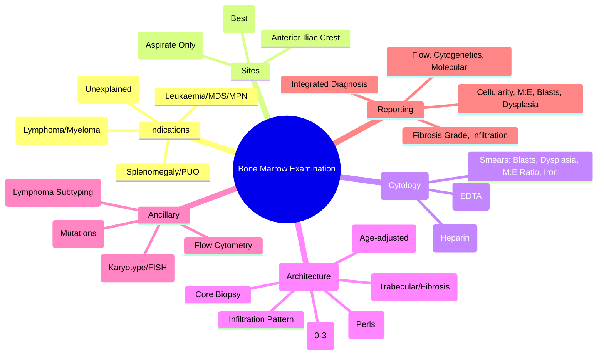

# Bone Marrow Examination (Aspiration & Trephine Biopsy)

> [!info] **Davidson Ch 25 Alignment**: Haematology Investigations → Bone Marrow Examination
> **FCPS/MRCP Focus**: Indications, technique (aspirate vs trephine), reporting (cellularity, M:E ratio, iron stores), flow cytometry, cytogenetics, complications

---

## 🎯 Learning Objectives

- [ ] Define **Indications** for Bone Marrow Aspiration (BMA) and Trephine Biopsy (BMT)
- [ ] Perform **Technique**: Posterior Iliac Crest (preferred), Anterior Iliac Crest, Sternum (aspirate only)
- [ ] Interpret **Aspirate Smears**: Cellularity, M:E Ratio, Differential Count, Dysplasia, Infiltration
- [ ] Interpret **Trephine Biopsy**: Cellularity, Architecture, Fibrosis, Infiltration Pattern, Iron Stores
- [ ] Apply **Ancillary Studies**: Flow Cytometry, Cytogenetics (Karyotype/FISH), Molecular (NGS), Immunohistochemistry
- [ ] Recognise **Complications**: Pain, Bleeding, Infection, Nerve Injury
- [ ] Interpret **Report**: Cellularity %, M:E Ratio, Iron Stores, Dysplasia, Infiltration %

---

## 📖 Indications

| Category | Specific Indications |
|----------|---------------------|
| **Cytopenias** | Unexplained Anaemia, Neutropenia, Thrombocytopenia, Pancytopenia |
| **Staging** | Lymphoma (HL, NHL), Myeloma, CLL, Metastatic Solid Tumours |
| **Diagnosis** | **Leukaemia** (AML, ALL, CML, CMML), **MDS**, **MPN** (PV, ET, PMF), **Multiple Myeloma** |
| **Unexplained** | **Leucoerythroblastic Film**, Unexplained Splenomegaly, **PUO** (Fever of Unknown Origin) |
| **Monitoring** | **Post-treatment** (Remission assessment, MRD), **Post-HSCT** (Engraftment, Chimerism) |
| **Iron Stores** | **Assess Iron** (Ferritin unreliable in inflammation) |

> [!warning] **Contraindications**: **Severe Bleeding Diathesis** (Plt <20, Coagulopathy), **Skin Infection** at site, **Patient Refusal**. **Relative**: Severe Thrombocytopenia (Plt <20) → Give Platelets first.

---

## 🔬 Technique

### Site Selection

| Site | Aspiration | Trephine | Notes |
|------|------------|----------|-------|
| **Posterior Iliac Crest** | **Preferred** | **Preferred** | **Best cellularity**, Safest, Adults & Children |
| **Anterior Iliac Crest** | Alternative | Alternative | If posterior not accessible |
| **Sternum** | **Aspiration Only** | **Contraindicated** | **Risk of Cardiac/Pulmonary Injury**, Adults only |
| **Tibia** | Infants <18 months | Not suitable | Proximal tibia |

### Procedure

| Step | Aspiration | Trephine |
|------|------------|----------|
| **Anesthesia** | **Local (1% Lidocaine)** + **IV Sedation/Midazolam** | Same + Deeper infiltration |
| **Needle** | **Jamshidi / Islam** (13-16G) | **Jamshidi Trephine** (11-13G) |
| **Technique** | **Periosteum** → **Marrow Space** → **Syringe Aspiration** (5-10 mL) | **Rotary Cutting** → **Core Sample** (1-2 cm) |
| **Samples** | **Smears** (Immediate, Air-dried), **EDTA tube** (Flow, Cytogenetics), **Heparin** (Culture) | **Formalin** (Histology), **RPMI** (Flow/Cytogenetics) |
| **Volume** | **0.2-0.5 mL** marrow for smears | **1-2 cm Core** |

---

## 📊 Interpretation

### Aspirate Smears (Morphology)

| Parameter | Normal | Abnormal Findings |
|-----------|--------|-------------------|
| **Cellularity** | **Normocellular** (40-70%) | **Hypocellular** (<20% = Aplastic Anaemia), **Hypercellular** (>80% = Leukaemia, MPN) |
| **M:E Ratio** | **1.5-3:1** (Myeloid:Erythroid) | **Reversed (<1:1)** = Erythroid Hyperplasia (Haemolysis, B12/Folate Def), **Increased** = Myeloid Hyperplasia (Infection, Leukaemia) |
| **Differential Count** | **Blasts <5%**, Lymphocytes <20%, Plasma Cells <5% | **Blasts ≥20%** = Acute Leukaemia; **Blasts 10-19%** = MDS-EB; **Plasma Cells ≥10%** = Myeloma |
| **Dysplasia** | **Absent** | **≥10% in ≥1 Lineage** = MDS |
| **Infiltration** | **Absent** | **Lymphoma**, **Metastatic Carcinoma**, **Myelofibrosis** |
| **Storage Iron** | **Present** (Grade 1-4) | **Absent** = Iron Deficiency; **Increased** = Haemosiderosis, Transfusion, Sideroblastic |

### Trephine Biopsy (Architecture)

| Parameter | Normal | Abnormal Findings |
|-----------|--------|-------------------|
| **Cellularity** | **40-70%** (Age-adjusted) | **Hypocellular** (<20%), **Hypercellular** |
| **Architecture** | **Trabecular**, **Fat spaces** | **Fibrosis** (MF: Reticulin/Collagen), **Necrosis**, **Osteosclerosis** |
| **Erythroid/Meghakaryocytic Clusters** | Present | **Abnormal localisation**, **Naked Megakaryocytes** (MF) |
| **Infiltration Pattern** | **None** | **Nodular** (Follicular Lymphoma), **Diffuse** (DLBCL, Leukaemia), **Paratrabecular** (Low-grade Lymphoma) |
| **Fibrosis Grade** | **Grade 0** | **Grade 1-3** (MF: Grade 2-3 = Overt) |
| **Iron Stores (Perls' Prussian Blue)** | **Grade 1-3** | **Grade 0** = Iron Deficiency; **Grade 3-4** = Iron Overload |

---

## 🔬 Ancillary Studies

| Study | Sample | Indication |
|-------|--------|------------|
| **Flow Cytometry** | **EDTA Aspirate** | **Leukaemia Immunophenotyping** (AML/ALL/CLL/MPAL), **MRD**, **PNH (CD55/CD59)**, **CLL/SLL** |
| **Cytogenetics (Karyotype)** | **Heparin Aspirate** | **Leukaemia** (t(8;21), t(15;17), t(9;22), inv(16), -5, -7), **MDS**, **MPN** |
| **FISH** | **Heparin Aspirate** | **Rapid Detection**: BCR-ABL1, PML-RARA, KMT2A-r, 17p-, 5q- |
| **Molecular (NGS/PCR)** | **EDTA/Heparin Aspirate** | **Mutation Panel** (FLT3, NPM1, CEBPA, TP53, ASXL1, SF3B1, JAK2, CALR, MPL) |
| **Immunohistochemistry** | **Trephine (Formalin)** | **Lymphoma Subtyping** (CD20, CD3, CD30, Cyclin D1, ALK, PAX5, BCL2, BCL6, MUM1) |

---

## ⚠️ Complications

| Complication | Frequency | Management |
|--------------|-----------|------------|
| **Pain** | Common (Brief) | Local Anaesthetic, Sedation, Analgesia |
| **Bleeding** | <1% (Significant) | Pressure, Transfusion if severe |
| **Infection** | Rare | Antibiotics if cellulitis |
| **Nerve Injury** | Very Rare (Posterior Iliac) | Neurology Referral |
| **Fracture** | Very Rare (Osteoporosis) | Orthopaedics |
| **Sample Inadequacy** | 1-5% | Repeat Procedure |

> [!warning] **Post-Procedure**: **Pressure Dressing 10-15 min**, **Lie Flat 30 min**, **Monitor Vitals**, **Avoid Strenuous Activity 24h**. **Bleeding Risk**: Platelets <20 → Transfuse first.

---

## 📋 Reporting Template (Key Elements)

| Section | Required Elements |
|---------|-------------------|
| **Clinical Details** | Indication, Site, Adequacy of Sample |
| **Aspirate** | Cellularity %, M:E Ratio, Differential (Blasts, Dysplasia), Iron Stores |
| **Trephine** | Cellularity %, Architecture, Fibrosis Grade, Iron Stores, Infiltration |
| **Flow Cytometry** | Immunophenotype, % Blasts/Abnormal Cells, MRD |
| **Cytogenetics/FISH** | Karyotype, Specific Abnormalities |
| **Molecular** | Mutation Panel Results (VAF) |
| **Diagnosis** | Integrated Conclusion (WHO Classification) |
| **Recommendations** | Further Tests, Treatment Suggestions |

---

## 💡 FCPS/MRCP High-Yield Summary

| Topic | Key Point |
|-------|-----------|
| **Indications** | Unexplained Cytopenias, Staging (Lymphoma/Myeloma), Leukaemia/MDS/MPN/MF, Unexplained Splenomegaly/PUO |
| **Site** | **Posterior Iliac Crest** (Preferred), **Sternum (Aspirate Only)** |
| **Aspirate vs Trephine** | **Aspirate = Cytology (Blasts, Dysplasia)**; **Trephine = Architecture (Fibrosis, Infiltration Pattern, Iron)** |
| **Cellularity** | **Age-adjusted**: Child >70%, Adult 40-70%, Elderly <40% |
| **M:E Ratio** | **Normal 1.5-3:1**; Reversed = Erythroid Hyperplasia; Increased = Myeloid Proliferation |
| **Blasts** | **<5% Normal**; **≥20% = Acute Leukaemia**; **10-19% = MDS-EB** |
| **Fibrosis** | **Grade 0-3** (Reticulin); **Grade 2-3 = Overt MF** |
| **Iron Stores** | **Perls' Prussian Blue**; Grade 0-4 |
| **Flow Cytometry** | **Essential for Leukaemia/Lymphoma/CLL/PNH/MRD** |
| **Cytogenetics** | **Essential for AML/ALL/MDS/MPN** (Prognosis, Therapy) |

---

## ❓ Viva Questions

1. **What are the indications for Bone Marrow Examination?**
   - Unexplained cytopenias, Staging (Lymphoma/Myeloma), Diagnosis (Leukaemia/MDS/MPN), Unexplained Splenomegaly/PUO

2. **What is the difference between Aspirate and Trephine?**
   - **Aspirate = Cytology (Blasts, Dysplasia, M:E Ratio, Iron)**; **Trephine = Architecture (Fibrosis, Infiltration Pattern, Cellularity, Iron Stores)**

3. **What is the normal M:E Ratio and when is it reversed?**
   - **Normal 1.5-3:1**; **Reversed (<1:1) = Erythroid Hyperplasia** (Haemolysis, B12/Folate Def, Blood Loss); **Increased = Myeloid Hyperplasia** (Infection, Leukaemia)

4. **What blast percentage defines Acute Leukaemia?**
   - **≥20% Blasts** in BM or PB (WHO); **10-19% = MDS-EB**

5. **How do you assess Iron Stores on Bone Marrow?**
   - **Perls' Prussian Blue Stain** on Trephine; **Grade 0-4** (0 = Absent, 4 = Marked Overload)

5. **What is the grading of Bone Marrow Fibrosis?**
   - **Grade 0 (Normal)**, **Grade 1 (Loose Reticulin)**, **Grade 2 (Dense Reticulin, Collagen Foci)**, **Grade 3 (Collagenised, Osteosclerosis)**

6. **Why is Trephine Biopsy essential for Myelofibrosis diagnosis?**
   - **Fibrosis not seen on Aspirate**; **Dry Tap**; **Grade 2-3 Fibrosis = Overt MF**

6. **What is the difference between Aspirate and Trephine Iron Staining?**
   - **Aspirate = Smear (Less Reliable)**; **Trephine = Perls' Stain on Core (Gold Standard for Iron Stores)**

7. **When do you use Flow Cytometry vs Cytogenetics?**
   - **Flow = Immunophenotype (Leukaemia/Lymphoma/PNH/MRD)**; **Cytogenetics = Karyotype/FISH (Prognosis, Specific Translocations)**

8. **What are the complications of Bone Marrow Biopsy?**
   - **Pain, Bleeding, Infection, Nerve Injury**. **Contraindicated if Plt <20/Coagulopathy**

9. **How do you interpret a Dry Tap?**
   - **Fibrosis (Myelofibrosis)**, **Packed Marrow (Leukaemia)**, **Osteosclerosis** → **Trephine Mandatory**

10. **What is the normal Bone Marrow Cellularity by age?**
    - **Child >70%**, **Adult 40-70%**, **Elderly <40%** (Age-adjusted)

---

## 🧠 Confusions & Mnemonics

| Confusion | Clarification |
|-----------|---------------|
| **Aspirate vs Trephine** | **Aspirate = Cells (Cytology)**; **Trephine = Tissue (Architecture)** |
| **Dry Tap** | **Fibrosis (MF) / Packed Marrow (Leukaemia)** → **Do Trephine** |
| **M:E Ratio Reversed** | **<1:1 = Erythroid Hyperplasia** (Haemolysis, B12/Folate Def) |
| **Blast %** | **<5% Normal; 10-19% MDS-EB; ≥20% Acute Leukaemia** |
| **Fibrosis Grade** | **0-1 = Early/Pre-MF**; **2-3 = Overt MF** |
| **Iron Stores** | **Trephine Perls' = Gold Standard**; Aspirate Smear Unreliable |

| Mnemonic | Meaning |
|----------|---------|
| **"Aspirate = Cells, Trephine = Tissue"** | Core difference |
| **"M:E = Myeloid:Erythroid = 3:1 Normal"** | Normal ratio |
| **"Blasts ≥20 = Acute Leukaemia"** | Diagnostic threshold |
| **"Fibrosis 2-3 = Overt MF"** | MF diagnosis |
| **"Dry Tap = Do Trephine"** | Procedure |
| **"Perls' = Iron Stores = Trephine"** | Iron assessment |

---

## 🗺️ Mind Map

---

## 📋 One-Page Revision Card

| **BONE MARROW EXAMINATION – FCPS/MRCP REVISION CARD** |
|--------------------------------------------------------|
| **Indications**: Cytopenias, Staging, Leukaemia/MDS/MPN, Splenomegaly/PUO |
| **Sites**: **Posterior Iliac Crest (Best)**, Sternum (Aspirate Only) |
| **Aspirate**: **Cytology** (Blasts, Dysplasia, M:E Ratio, Iron, Flow, Cytogenetics) |
| **Trephine**: **Architecture** (Cellularity, Fibrosis, Infiltration, Iron Stores) |
| **Cellularity**: Age-adjusted (Child >70%, Adult 40-70%, Elderly <40%) |
| **M:E Ratio**: **Normal 1.5-3:1**; Reversed (<1) = Erythroid Hyperplasia |
| **Blasts**: **<5% Normal**, **10-19% = MDS-EB**, **≥20% = Acute Leukaemia** |
| **Fibrosis Grade**: 0-1 (Early), **2-3 (Overt MF)** |
| **Iron Stores**: **Perls' on Trephine** (Grade 0-4) |
| **Dry Tap**: Fibrosis (MF) / Packed Marrow → **Do Trephine** |
| **Essential Ancillary**: Flow (Leukaemia/Lymphoma), Cytogenetics (AML/MDS), Molecular |

---

## 📅 Spaced Repetition Tracker

| Review | Date | Score (1-5) | Next Review |
|--------|------|-------------|-------------|
| Day 1 | 2025-06-17 | | 2025-06-18 |
| Day 3 | | | |
| Day 7 | | | |
| Day 15 | | | |
| Day 30 | | | |

---

## 🎯 Must Know / Should Know / Nice to Know

| Level | Content |
|-------|---------|
| **Must Know** | Indications, Sites, Aspirate vs Trephine difference, Normal M:E ratio, Blast thresholds (<5%, 10-19%, ≥20%), Fibrosis grading (0-3), Dry tap = trephine, Iron stores on trephine (Perls'), Flow/Cytogenetics indications |
| **Should Know** | Age-adjusted cellularity, Aspirate vs trephine iron staining reliability, Flow cytometry panels (AML/ALL/CLL/PNH/MPAL), Cytogenetics report interpretation, Trephine infiltration patterns (nodular/diffuse/paratrabecular), Dry tap causes, Post-procedure care, Complication rates |
| **Nice to Know** | Sternum aspiration technique (adults only), Paediatric sites (Tibia), Anterior vs posterior iliac crest, Local anaesthetic toxicity (Lignocaine max dose), Consent process, Image-guided biopsy (CT/US), Liquid biopsy vs BM biopsy, PET-CT correlation with BM findings, Cost-effectiveness of ancillary studies, Paediatric BM norms |

---

## ✅ Self-Test Scorecard

| Section | Score (0-10) | Notes |
|---------|--------------|-------|
| Indications & Sites | | |
| Aspirate vs Trephine | | |
| Cellularity & M:E Ratio | | |
| Blast Count & Classification | | |
| Fibrosis Grading | | |
| Iron Stores Assessment | | |
| Ancillary Studies (Flow, Cytogenetics, Molecular) | | |
| Complications & Dry Tap | | |
| Viva Questions | | |

---

## 🔗 Local Navigation

- **Previous**: [[Foetal & Neonatal Transfusion HDFN]]
- **Next**: [[Flow Cytometry in Haematology]]
- **Section Hub**: [[Investigations]] / [[Haematological Malignancies]]
- **MOC**: [[Hematology MOC]]
- **Template**: [[../Templates/Hematology Topic Template]]

---

*Generated for FCPS/MRCP exam preparation. Based on Davidson Medicine 24th Ed Chapter 25.*
---

> Auto-generated study sections for "Hematology" — Ch 24: Haematology & Transfusion Medicine.

## Flashcards (11 generated)

- Q: What is the definition of Hematology?
  A: # Bone Marrow Examination (Aspiration & Trephine Biopsy)
- Q: What is Hematology indicated for?
  A: Unexplained Cytopenias, Staging (Lymphoma/Myeloma), Leukaemia/MDS/MPN/MF, Unexplained Splenomegaly/PUO
- Q: What is Site of Hematology?
  A: Posterior Iliac Crest (Preferred), Sternum (Aspirate Only)
- Q: What is Aspirate vs Trephine of Hematology?
  A: Aspirate = Cytology (Blasts, Dysplasia); Trephine = Architecture (Fibrosis, Infiltration Pattern, Iron)
- Q: What is Cellularity of Hematology?
  A: Age-adjusted: Child >70%, Adult 40-70%, Elderly <40%
- Q: What is M:E Ratio of Hematology?
  A: Normal 1.5-3:1; Reversed = Erythroid Hyperplasia; Increased = Myeloid Proliferation
- Q: What is Blasts of Hematology?
  A: <5% Normal; ≥20% = Acute Leukaemia; 10-19% = MDS-EB
- Q: What is Fibrosis of Hematology?
  A: Grade 0-3 (Reticulin); Grade 2-3 = Overt MF
- Q: What is Iron Stores of Hematology?
  A: Perls' Prussian Blue; Grade 0-4
- Q: What is Flow Cytometry of Hematology?
  A: Essential for Leukaemia/Lymphoma/CLL/PNH/MRD
- Q: What is Cytogenetics of Hematology?
  A: Essential for AML/ALL/MDS/MPN (Prognosis, Therapy)

## MCQs (1 generated)

1. **Which of the following best describes Hematology?**
   A. **# Bone Marrow Examination (Aspiration & Trephine Biopsy)**
   B. An unrelated condition not matching the clinical picture of Hematology
   C. A complication seen late in the disease course of Hematology
   D. A condition that mimics Hematology but has a different underlying cause

