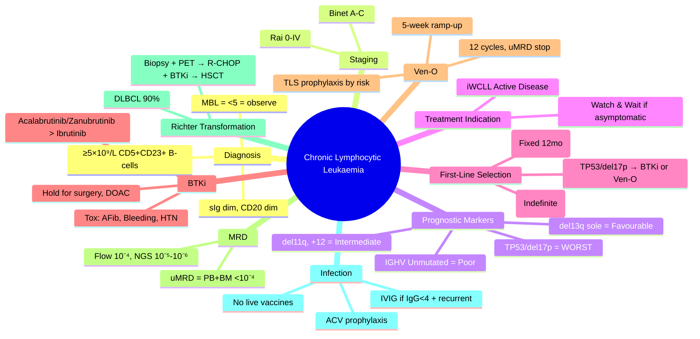

# Chronic Lymphocytic Leukaemia (CLL)

> [!info] **Davidson Ch 25 Alignment**: Haematological Malignancies → Chronic Leukaemias → CLL
> **FCPS/MRCP Focus**: Rai/Binet staging, prognostic markers (TP53, IGHV, del17p), BTK/BCL2 inhibitors, Richter transformation, infection prophylaxis

---

## 🎯 Learning Objectives

- [ ] Define CLL: **≥5×10⁹/L monoclonal B-cells** (CD5+, CD19+, CD23+, sIg dim, CD20 dim, CD10-, FMC7-) sustained ≥3 months
- [ ] Distinguish **CLL vs MBL** (Monoclonal B-cell Lymphocytosis: <5×10⁹/L, no lymphadenopathy/organomegaly)
- [ ] Stage using **Rai** (0-IV) and **Binet** (A-C) systems
- [ ] Apply **prognostic markers**: **TP53/del17p**, **IGHV mutational status**, **del11q**, **+12**, **del13q**
- [ ] Define **treatment indication** (iWCLL criteria): Active disease symptoms/signs + cytopenias
- [ ] Select **first-line therapy**: **BTKi (Ibrutinib/Acalabrutinib/Zanubrutinib)** vs **BCL2i (Venetoclax + Obinutuzumab)** based on age/comorbidities/TP53
- [ ] Manage **BTKi toxicities**: Atrial fibrillation, bleeding, hypertension, diarrhoea, arthralgia
- [ ] Manage **Venetoclax TLS risk**: Ramp-up, prophylaxis, monitoring
- [ ] Recognise **Richter Transformation**: Aggressive lymphoma (usually DLBCL) – biopsy, PET-CT, treat as DLBCL
- [ ] Monitor **MRD** (Flow/NGS) for fixed-duration Ven+Obi regimen
- [ ] Manage **infection risk**: Hypogammaglobulinaemia → IVIG, prophylaxis, vaccinations

---

## 📖 Definition & Diagnostic Criteria

### iWCLL Diagnostic Criteria (All Required)

| Criterion | Requirement |
|-----------|-------------|
| **Absolute Lymphocyte Count** | **≥5×10⁹/L** monoclonal B-cells (sustained ≥3 months) |
| **Immunophenotype** | **CD5+, CD19+, CD23+, sIg dim, CD20 dim, CD10-, FMC7-, Cyclin D1-** |
| **Clonality** | Light chain restriction (κ or λ) |
| **Morphology** | Mature small lymphocytes ± smudge cells ± prolymphocytes (<55%) |

### CLL vs MBL vs SLL

| Entity | ALC | Lymphadenopathy/Organomegaly | Treatment Indication |
|--------|-----|------------------------------|---------------------|
| **MBL** | **<5×10⁹/L** | None | **Observation only** |
| **CLL** | **≥5×10⁹/L** | May be present | **iWCLL active disease criteria** |
| **SLL** | **<5×10⁹/L** | **Yes (nodes/spleen)** | Same as CLL (same disease) |

> [!tip] **FCPS/MRCP**: **CLL = ≥5×10⁹/L CD5+CD23+ B-cells**. **MBL = <5×10⁹/L, no nodes = observe**. **SLL = nodal disease with <5×10⁹/L = same as CLL**. **CD5+CD23+ = CLL; CD5+CD23- = MCL (Cyclin D1+)**.

---

## ⚙️ Pathophysiology

```mermaid
flowchart TD
    A[Antigen Stimulation (BCR)] --> B[Constitutive BCR Signalling]
    B --> C[PI3K/AKT/mTOR, SYK, BTK Pathways]
    C --> D[Survival & Proliferation]
    D --> E[Microenvironment: Lymph Node, Marrow]
    E --> F[CXCR4/CXCL12, VLA-4/VCAM-1 Adhesion]
    F --> G[Proliferation Centres → Lymphadenopathy]
    G --> H[Genomic Instability]
    H --> I[Driver Mutations: TP53, ATM, NOTCH1, SF3B1, BIRC3]
    I --> J[Clonal Evolution → Richter Transformation]
```

---

## 🔬 Staging Systems

### Rai Staging (USA)

| Stage | Criteria | Risk | Median Survival |
|-------|----------|------|-----------------|
| **0** | Lymphocytosis only (>5×10⁹/L) | Low | >10 years |
| **I** | Stage 0 + **Lymphadenopathy** | Intermediate | ~7-9 years |
| **II** | Stage I + **Splenomegaly and/or Hepatomegaly** | Intermediate | ~5-7 years |
| **III** | Stage 0-II + **Anaemia (Hb <11 g/dL)** | High | ~2-3 years |
| **IV** | Stage 0-III + **Thrombocytopenia (Plt <100×10⁹/L)** | High | ~1-2 years |

### Binet Staging (Europe)

| Stage | Criteria | Risk | Median Survival |
|-------|----------|------|-----------------|
| **A** | Hb ≥10, Plt ≥100, **<3 lymphoid areas** involved | Low | >10 years |
| **B** | Hb ≥10, Plt ≥100, **≥3 lymphoid areas** involved | Intermediate | ~5-7 years |
| **C** | **Hb <10 or Plt <100** (any lymphoid areas) | High | ~2-3 years |

**Lymphoid Areas (Binet)**: Cervical, Axillary, Inguinal (uni/bilateral = 1 each), Spleen, Liver = 6 total

---

## 📊 Prognostic Markers (Critical for Treatment Selection)

| Marker | Category | Significance | Testing |
|--------|----------|--------------|---------|
| **del17p / TP53 mutation** | **Poorest prognosis** | Chemo-refractory; **BTKi/BCL2i preferred**; Shorter PFS | **FISH (del17p) + NGS (TP53)** mandatory pre-treatment |
| **IGHV Unmutated (UM-IGHV)** | Poor prognosis | Shorter TTFT, PFS; **Continuous BTKi preferred** over fixed-duration Ven | **NGS (IGHV sequencing)** – <98% germline = unmutated |
| **del11q (ATM)** | Intermediate/Poor | DNA repair defect; **BTKi effective** | FISH |
| **del13q (sole)** | **Favourable** | Long TTFT, good response | FISH |
| **+12 (trisomy 12)** | Intermediate | Associated with NOTCH1 mutations | FISH |
| **NOTCH1 mutation** | Poor | Associated with Richter transformation risk | NGS |
| **SF3B1 mutation** | Intermediate | Splicing factor; may predict BTKi resistance | NGS |
| **BIRC3 mutation** | Poor | NF-κB pathway; Richter risk | NGS |
| **Complex Karyotype (≥3 abn)** | **Poor** | Genomic instability | Karyotype |

> [!warning] **TP53/del17p = Mandatory before ANY treatment**. **Determines BTKi vs BCL2i choice**.

---

## 💊 Treatment Indications (iWCLL Active Disease Criteria)

**Treat if ANY of the following:**
1. **Symptomatic** lymphadenopathy/splenomegaly
2. **B-symptoms**: Fever >38°C ×2wks, Night sweats, Weight loss >10%
3. **Progressive cytopenias**: Hb <10 (marrow failure), Plt <100 (marrow failure)
4. **Progressive lymphocytosis**: Doubling time <6 months (or >50% increase in 2mo)
5. **Autoimmune complications** (AIHA/ITP) unresponsive to steroids
6. **Massive/progressive splenomegaly**

> [!tip] **Asymptomatic early stage (Rai 0-I, Binet A) = OBSERVE ("Watch & Wait")**. **No benefit to early treatment** (CLL8, CLL12 trials).

---

## 💊 First-Line Therapy Selection Algorithm

```mermaid
flowchart TD
    A[CLL Requiring Treatment] --> B{TP53/del17p?}
    B -->|Yes| C[**BTKi (Ibrutinib/Acalabrutinib/Zanubrutinib) INDEFINITE**<br/>OR **Venetoclax + Obinutuzumab (fixed 12-14mo)**]
    B -->|No| D{Age/Comorbidities/CGA}
    D -->|Fit, <65, IGHV Mutated| E[**Venetoclax + Obinutuzumab (Fixed 12mo)**<br/>MRD-guided stop if uMRD]
    D -->|Unfit, >65, IGHV Unmutated, Comorbidities| F[**BTKi (Acalabrutinib/Zanubrutinib preferred)**<br/>INDEFINITE until progression/toxicity]
    D -->|Any| G[**Ibrutinib** if no access to 2G BTKi<br/>AFib/Bleeding risk higher]
```

### Key Regimens

| Regimen | Type | Duration | Key Trials | Best For |
|---------|------|----------|------------|----------|
| **Ibrutinib** | BTKi (1G) | Indefinite | RESONATE, ALLIANCE | Standard if 2G unavailable |
| **Acalabrutinib** | BTKi (2G) | Indefinite | ELEVATE-TN, ASCEND | **Preferred over Ibrutinib** (less AFib, bleeding) |
| **Zanubrutinib** | BTKi (2G) | Indefinite | SEQUOIA, ALPINE | **Preferred** (less AFib, once daily, China-approved) |
| **Venetoclax + Obinutuzumab (Ven-O)** | BCL2i + anti-CD20 | **Fixed 12 cycles** (1yr) | CLL14 | **Fit, IGHV mutated, desire fixed duration** |
| **Venetoclax + Rituximab (Ven-R)** | BCL2i + anti-CD20 | Fixed 24 cycles (2yr) | MURANO (R/R) | Relapsed/refractory |

> [!tip] **FCPS/MRCP**: **TP53/del17p → BTKi indefinite OR Ven-O fixed**. **IGHV mutated → Ven-O preferred (fixed duration, high uMRD)**. **IGHV unmutated/Unfit → BTKi indefinite**. **Acalabrutinib/Zanubrutinib > Ibrutinib (safety)**.

---

## ⚠️ BTK Inhibitor Toxicities & Management

| Toxicity | Incidence (Ibrutinib) | Management |
|----------|----------------------|------------|
| **Atrial Fibrillation** | 10-15% (↑ with age, HTN) | **Hold BTKi**; Rate/rhythm control; **DOAC** (avoid warfarin); Restart at same/reduced dose if CHA₂DS₂-VASc ≥2 |
| **Bleeding** (bruising, epistaxis, GI) | 30-50% (major 3-5%) | **Hold 3-7d pre-surgery**; Avoid antiplatelets/anticoagulants if possible; Monitor |
| **Hypertension** | 20-30% (new/worsening) | ACEi/ARB/CCB; Monitor BP q visit |
| **Diarrhoea** | 30-40% | Loperamide; Hydration; Dose hold if severe |
| **Arthralgia/Myalgia** | 20-30% | NSAIDs (caution with bleeding), physiotherapy |
| **Infections** (pneumonia, HSV/VZV) | ↑ risk | **ACV prophylaxis** if prior HSV; PJP prophylaxis if steroids/chemos; IVIG if IgG<4 + recurrent infx |
| **Secondary Cancers** | Skin (NMSC) ↑ | Dermatology surveillance |

> [!warning] **Ibrutinib + Warfarin = CONTRAINDICATED** (interaction). **Use DOAC**. **Hold BTKi 3-7d before surgery**.

---

## 💊 Venetoclax + Obinutuzumab (Ven-O) – Fixed Duration

### TLS Risk Stratification & Ramp-Up

| Tumour Burden | Risk | Ramp-Up Schedule (Venetoclax) |
|---------------|------|-------------------------------|
| **ALC <25×10⁹/L, Nodes <5cm** | Low | 20→50→100→200→400mg (weekly) |
| **ALC ≥25 or Nodes 5-10cm** | Medium | 20→50→100→200→400mg (weekly) + **Hydration + Allopurinol** |
| **ALC ≥25 & Nodes ≥10cm or bulky** | High | **Inpatient**; 20→50→100→200→400mg (weekly) + **IV Hydration + Rasburicase** |

### Monitoring During Ramp-Up
- **TLS Labs**: K, PO₄, Ca, Uric acid, Creatinine **q6-8h × 24-48h after each dose escalation**
- **Observe for 6h after first dose** of each new level

### Cycles
- **Cycle 1**: Obinutuzumab 100mg (day 1), 900mg (day 2), 1000mg (day 8, 15) + Venetoclax ramp-up
- **Cycles 2-6**: Obinutuzumab 1000mg day 1 + Venetoclax 400mg daily
- **Cycles 7-12**: Venetoclax 400mg daily (no Obinutuzumab)
- **Total 12 cycles (1 year)** → **Stop if uMRD (MRD <10⁻⁴ in blood & marrow)**

---

## 🔬 MRD Monitoring (Ven-O Fixed Duration)

| Timepoint | Sample | Method | Action |
|-----------|--------|--------|--------|
| **End of Cycle 3 (3mo)** | PB | Flow (10⁻⁴) | Early response |
| **End of Cycle 6 (6mo)** | PB + BM | Flow + NGS (10⁻⁵) | Deep response assessment |
| **End of Cycle 12 (12mo)** | PB + BM | **Flow (10⁻⁴) + NGS (10⁻⁵-10⁻⁶)** | **uMRD = Stop treatment** |
| **Post-Treatment** | PB q3mo × 2yr, then q6mo | Flow/NGS | **Molecular relapse → Re-treat with Ven-O or BTKi** |

> [!tip] **uMRD (undetectable MRD) = MRD <10⁻⁴ in BOTH blood AND marrow**. **NGS 10⁻⁵-10⁻⁶ for confirmatory**.

---

## 💥 Richter Transformation

| Feature | Details |
|---------|---------|
| **Incidence** | 5-10% lifetime risk; **NOTCH1, TP53, MYC, CDKN2A** mutations |
| **Clinical** | Rapidly enlarging nodes, B-symptoms, ↑LDH, ↑Ca, extranodal sites |
| **Pathology** | **DLBCL (90%)**, Hodgkin-like (5-10%), other |
| **Diagnosis** | **Excisional node biopsy + PET-CT** |
| **Treatment** | **R-CHOP (or DA-EPOCH-R)** + **BTKi continuation** → **Allo-HSCT in CR1** if fit |
| **Prognosis** | Poor (median OS ~1-2 years); TP53 mutated = worse |

---

## 🛡️ Infection Prophylaxis & Vaccinations

| Issue | Management |
|-------|------------|
| **Hypogammaglobulinaemia** (IgG <4 g/L + recurrent infections) | **IVIG 400-500 mg/kg monthly** (target trough >5-6) |
| **PJP Prophylaxis** | **Co-trimoxazole** if on steroids/chemo/venetoclax ramp-up/hypogammaglobulinaemia |
| **HSV/VZV Prophylaxis** | **Aciclovir 400mg BD** (especially on BTKi/venetoclax) |
| **Vaccinations** | **Inactivated only** (Flu, COVID, Pneumococcal PCV20/PPSV23, HepB, Shingrix) – **NO LIVE VACCINES** |
| **COVID-19** | **Pre-exposure prophylaxis (Pemivibart)** if severe hypogammaglobulinaemia; additional vaccine doses |

---

## 🔄 Differential Diagnosis

| Condition | Distinguishing Features |
|-----------|------------------------|
| **Mantle Cell Lymphoma (MCL)** | **CD5+, CD23-, Cyclin D1+, t(11;14), SOX11+**; FMC7+ |
| **Marginal Zone Lymphoma (MZL)** | **CD5-, CD23+**, CD10-, DBA44+; often splenic/gal |
| **Follicular Lymphoma (FL)** | **CD5-, CD10+, BCL2+, t(14;18)**; CD23 variable |
| **Hairy Cell Leukaemia (HCL)** | **CD5-, CD25+, CD103+, CD123+, BRAF V600E**, TRAP+ |
| **Prolymphocytic Leukaemia (PLL)** | **>55% prolymphocytes**; B-PLL: CD5-, CD23-; T-PLL: CD4+/CD8+ |
| **MBL** | **<5×10⁹/L**, no lymphadenopathy – observe |

---

## 💡 FCPS/MRCP High-Yield Summary

| Topic | Key Point |
|-------|-----------|
| **Diagnosis** | **≥5×10⁹/L CD5+CD19+CD23+ sIg dim CD20 dim** B-cells ≥3 months |
| **CLL vs MBL** | **MBL = <5×10⁹/L, no nodes, observe**; CLL = ≥5×10⁹/L + iWCLL criteria for treatment |
| **Staging** | **Rai (0-IV)** or **Binet (A-C)**; Binet C = Hb<10 or Plt<100 |
| **Prognostic Markers** | **TP53/del17p (WORST)**; **IGHV unmutated (poor)**; del13q sole = favourable |
| **Treatment Indication** | **iWCLL active disease** (symptoms, cytopenias, rapid doubling, B-symptoms) |
| **TP53/del17p** | **BTKi indefinite OR Ven-O fixed** (NO chemoimmunotherapy) |
| **IGHV Mutated** | **Ven-O fixed 12mo preferred** (high uMRD rate) |
| **IGHV Unmutated/Unfit** | **BTKi indefinite (Acalabrutinib/Zanubrutinib preferred)** |
| **BTKi Toxicities** | **AFib, Bleeding, HTN** – Hold for surgery, DOAC not warfarin |
| **Ven-O TLS** | **Ramp-up 5-week + Allopurinol/Rasburicase per risk** |
| **MRD Stop Rule** | **uMRD (<10⁻⁴ in blood+marrow) at 12mo → Stop** |
| **Richter** | **DLBCL (90%)** → Excisional biopsy + PET → R-CHOP + BTKi → Allo-HSCT |
| **Infection** | **IVIG if IgG<4 + recurrent infx**; No live vaccines; ACV prophylaxis |

---

## ❓ Viva Questions

1. **What are the diagnostic immunophenotypic markers of CLL?**
   - **CD5+, CD19+, CD23+, sIg dim, CD20 dim, CD10-, FMC7-, Cyclin D1-**

2. **How do you differentiate CLL from Mantle Cell Lymphoma?**
   - **MCL: CD5+, CD23-, Cyclin D1+, t(11;14), FMC7+**; CLL: CD23+, Cyclin D1-, FMC7-

3. **What are the iWCLL treatment indications (active disease criteria)?**
   - Symptomatic nodes/spleen, B-symptoms, Hb<10/Plt<100 (marrow), lymphocyte doubling <6mo, autoimmune cytopenias refractory, massive splenomegaly

4. **Which prognostic markers must be tested before first-line treatment?**
   - **TP53 mutation (NGS) and del17p (FISH) – MANDATORY**; IGHV mutational status, FISH panel (del11q, del13q, +12)

5. **How does TP53/del17p status affect first-line treatment choice?**
   - **Chemoimmunotherapy contraindicated**; Use **BTKi indefinite OR Venetoclax + Obinutuzumab fixed duration**

6. **What is the preferred first-line for a fit 60-year-old with IGHV mutated CLL?**
   - **Venetoclax + Obinutuzumab (fixed 12 months)** – high uMRD rate, finite duration

7. **Describe the Venetoclax ramp-up schedule and TLS prophylaxis.**
   - 20→50→100→200→400mg weekly ×5 weeks; **Low: Allopurinol; Medium: Allopurinol+hydration; High: Inpatient+Rasburicase+IV hydration**

8. **What are the major toxicities of Ibrutinib and how do you manage Atrial Fibrillation?**
   - AFib 10-15%, bleeding, HTN, diarrhoea, infections; **Hold BTKi, rate/rhythm control, DOAC (NOT warfarin), restart if CHA₂DS₂-VASc≥2**

9. **When do you stop fixed-duration Venetoclax + Obinutuzumab?**
   - **After 12 cycles (1 year) IF uMRD (<10⁻⁴ in BOTH blood AND marrow by flow/NGS)**

10. **What is Richter Transformation and how is it managed?**
    - Transformation to aggressive lymphoma (usually DLBCL); **Excisional biopsy + PET-CT → R-CHOP + BTKi → Allo-HSCT in CR1**

---

## 🧠 Confusions & Mnemonics

| Confusion | Clarification |
|-----------|---------------|
| **CLL vs MCL** | **CLL = CD23+, Cyclin D1-**; **MCL = CD23-, Cyclin D1+, t(11;14)** |
| **CLL vs MBL** | **MBL = <5×10⁹/L, no nodes, observe** |
| **IGHV Mutated vs Unmutated** | **Mutated = better prognosis, Ven-O fixed duration**; **Unmutated = BTKi indefinite** |
| **BTKi Indefinite vs Ven-O Fixed** | **TP53/del17p → BTKi OR Ven-O**; **IGHV mut → Ven-O**; **IGHV unmut/unfit → BTKi** |
| **Ibrutinib vs Acalabrutinib/Zanubrutinib** | **2G BTKi = less AFib, less bleeding, better safety** |
| **uMRD Definition** | **<10⁻⁴ in BOTH peripheral blood AND bone marrow** |

| Mnemonic | Meaning |
|----------|---------|
| **"CLL = CD5, CD23, dim CD20"** | Immunophenotype |
| **"MCL = Cyclin D1 Positive"** | MCL marker |
| **"TP53 = Terrible Prognosis → No Chemo"** | TP53 mandates novel agents |
| **"IGHV Mut = Ven-O Fixed (Good)"** | Mutated IGHV → fixed duration |
| **"AFib = Hold BTKi, DOAC"** | Ibrutinib AFib management |
| **"Ven-O = 5-week Ramp, 12 Cycles, uMRD Stop"** | Venetoclax regimen |
| **"Richter = DLBCL → Biopsy + R-CHOP + HSCT"** | Richter transformation |

---

## 🗺️ Mind Map



---

## 📋 One-Page Revision Card

| **CLL – FCPS/MRCP REVISION CARD** |
|-----------------------------------|
| **Diagnosis**: **≥5×10⁹/L CD5+ CD23+ sIg dim CD20 dim** B-cells |
| **CLL vs MBL**: MBL = <5×10⁹/L, no nodes → **Observe** |
| **Staging**: Rai 0-IV / Binet A-C (Binet C = Hb<10 or Plt<100) |
| **Prognostic**: **TP53/del17p (MANDATORY)** = worst; IGHV Unmut = poor; del13q sole = good |
| **Treat if**: iWCLL active (symptoms, cytopenias, doubling<6mo, B-sx, AIHA/ITP) |
| **TP53/del17p** → **BTKi indefinite OR Ven-O (NO chemo)** |
| **IGHV Mutated** → **Ven-O Fixed 12mo** (uMRD stop) |
| **IGHV Unmut/Unfit** → **BTKi Indefinite (Acalabrutinib/Zanubrutinib)** |
| **BTKi Tox**: **AFib, Bleeding, HTN** – Hold surgery, **DOAC not warfarin** |
| **Ven-O**: 5-wk ramp (20→400mg), TLS prophylaxis, **12 cycles, uMRD stop** |
| **uMRD** = **<10⁻⁴ in PB + BM (Flow/NGS)** |
| **Richter** = DLBCL (90%) → **Biopsy + PET → R-CHOP + BTKi → Allo-HSCT** |
| **Infection**: **IVIG if IgG<4 + recurrent**; No live vaccines; ACV prophylaxis |

---

## 📅 Spaced Repetition Tracker

| Review | Date | Score (1-5) | Next Review |
|--------|------|-------------|-------------|
| Day 1 | 2025-06-15 | | 2025-06-16 |
| Day 3 | | | |
| Day 7 | | | |
| Day 15 | | | |
| Day 30 | | | |

---

## 🎯 Must Know / Should Know / Nice to Know

| Level | Content |
|-------|---------|
| **Must Know** | Diagnostic immunophenotype, CLL vs MBL vs SLL, Rai/Binet staging, TP53/del17p mandatory testing, IGHV significance, iWCLL treatment indications, BTKi vs Ven-O selection by TP53/IGHV, BTKi toxicities (AFib, bleeding), Ven-O ramp-up/TLS, uMRD stop rule, Richter transformation, IVIG/infection prophylaxis |
| **Should Know** | FISH panel details (del11q, +12, del13q roles), NOTCH1/SF3B1/BIRC3 mutations, acalabrutinib vs zanubrutinib vs ibrutinib differences, MRD monitoring schedule post-Ven-O, BTKi drug interactions (CYP3A4), warfarin contraindication with ibrutinib, SLL management same as CLL, pwCLL (prolymphocytoid), CLL-IPI score |
| **Nice to Know** | BTK C481S resistance mutation, BCL2 resistance mutations, LOXO-305 (pirtobrutinib) for BTKi-relapsed, fixed-duration Ven-R in R/R (MURANO), CAR-T in CLL, bispecific antibodies (glofitamab, epcoritamab), minimal residual disease assays standardisation, CLL14/CLL15/SEQUOIA/ELEVATE-TN trial details |

---

## ✅ Self-Test Scorecard

| Section | Score (0-10) | Notes |
|---------|--------------|-------|
| Diagnosis & Differential | | |
| Staging (Rai/Binet) | | |
| Prognostic Markers | | |
| Treatment Indications | | |
| First-Line Selection Algorithm | | |
| BTKi Toxicities & Management | | |
| Venetoclax + Obinutuzumab Protocol | | |
| MRD & Fixed-Duration Stop Rules | | |
| Richter Transformation | | |
| Infection Prophylaxis | | |
| Viva Questions | | |

---

## 🔗 Local Navigation

- **Previous**: [[Chronic Myeloid Leukaemia (CML)]]
- **Next**: [[Multiple Myeloma]]
- **Section Hub**: [[Haematological Malignancies]]
- **MOC**: [[Hematology MOC]]
- **Template**: [[../Templates/Hematology Topic Template]]

---

*Generated for FCPS/MRCP exam preparation. Based on Davidson Medicine 24th Ed Chapter 25.*