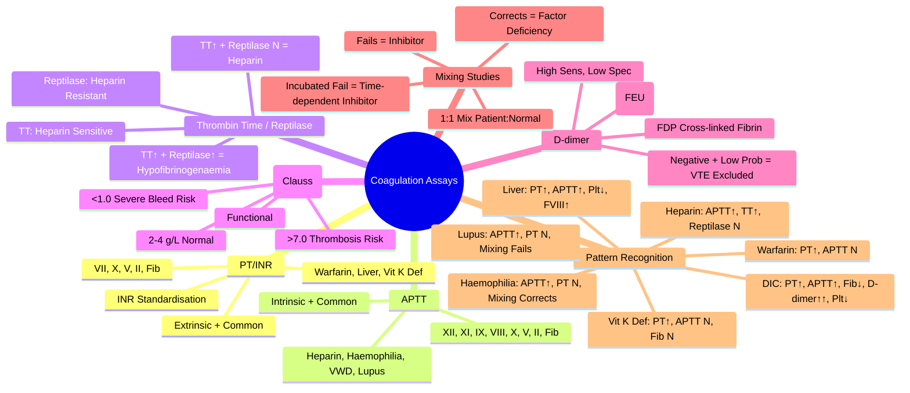

# Coagulation Assays

> [!info] **Davidson Ch 25 Alignment**: Haematology Investigations → Coagulation Assays
> **FCPS/MRCP Focus**: PT/INR, APTT, Thrombin Time, Fibrinogen, D-dimer, Mixing Studies, Interpretation Algorithms

---

## 🎯 Learning Objectives

- [ ] Perform **PT/INR**: Principle, Indications, Interpretation (Warfarin, Liver, Vit K, DIC)
- [ ] Perform **APTT**: Principle, Indications, Interpretation (Heparin, Haemophilia, VWD, Lupus, DIC)
- [ ] Perform **Thrombin Time (TT) & Reptilase Time**: Principle, Heparin detection, Fibrinogen abnormalities
- [ ] Perform **Fibrinogen Assay (Clauss)**: Principle, Dysfibrinogenaemia, Hypofibrinogenaemia
- [ ] Perform **D-dimer**: Principle, Sensitivity/Specificity, VTE/PE/DIC exclusion
- [ ] Apply **Mixing Studies**: 1:1 Mix, Immediate/Incubated, Interpretation (Factor Deficiency vs Inhibitor)
- [ ] Interpret **Coagulation Screen**: Pattern Recognition (Warfarin, Heparin, Liver, DIC, Vit K Def, Haemophilia)

---

## 📖 Coagulation Cascade & Tests

```mermaid
flowchart TD
    A[Tissue Factor (Extrinsic)] --> B[Factor VII] --> C[Factor X] --> D[Thrombin]
    E[Contact Activation (Intrinsic)] --> F[Factor XII] --> G[Factor XI] --> H[Factor IX] --> I[Factor VIII] --> C
    D --> J[Fibrinogen → Fibrin]
    J --> K[Factor XIII → Cross-linking]
    
    L[Coagulation Tests] --> M1[**PT/INR** → Extrinsic + Common (VII, X, V, II, Fibrinogen)]
    L --> M2[**APTT** → Intrinsic + Common (XII, XI, IX, VIII, X, V, II, Fibrinogen)]
    L --> M3[**TT** → Thrombin → Fibrin (Final Common)]
    L --> M3b[**Reptilase Time** → Thrombin-like → Fibrin (Heparin Insensitive)]
    L --> M4[**Fibrinogen (Clauss)** → Functional Fibrinogen]
    L --> M5[**D-dimer** → Fibrin Degradation Product]
    L --> M6[**Mixing Studies** → Factor Deficiency vs Inhibitor]
```

---

## 📖 Individual Assays

### 1. Prothrombin Time (PT) / INR

| Aspect | Details |
|--------|---------|
| **Principle** | **Extrinsic + Common Pathway** → Tissue Factor → Factor VII → X → II → Fibrin |
| **Reagents** | **Tissue Factor (Thromboplastin) + Calcium** |
| **Measures** | Factors **VII, X, V, II, Fibrinogen** |
| **Normal** | **11-13 seconds** (Lab-specific) |
| **INR** | **Standardised**: `(Patient PT / Mean Normal PT)^ISI` |

| INR Target | Indication |
|------------|------------|
| **2.0-3.0** | **Standard** (VTE, AF, DVT/PE, Mechanical Valve Mitral) |
| **2.5-3.5** | **High Thrombotic Risk** (Mechanical Aortic Valve + Risk Factors, Recurrent VTE) |
| **3.0-4.0** | **Mechanical Mitral Valve**, **Antiphospholipid Syndrome (Arterial/Recurrent)** |

### 2. Activated Partial Thromboplastin Time (APTT)

| Aspect | Details |
|--------|---------|
| **Principle** | **Intrinsic + Common Pathway** → Contact Activation → XII → XI → IX → VIII → X → II → Fibrin |
| **Reagents** | **Contact Activator (Kaolin/Ellagic Acid) + Phospholipid + Calcium** |
| **Measures** | Factors **XII, XI, IX, VIII, X, V, II, Fibrinogen** |
| **Normal** | **25-35 seconds** (Lab-specific) |
| **Ratio** | **Patient APTT / Control APTT** (Normal <1.2) |

| APTT Ratio | Indication |
|------------|------------|
| **1.5-2.5** | **Therapeutic UFH** (Target varies by indication) |
| **2.0-3.0** | **Therapeutic UFH** (High Risk: Mechanical Valve, VTE) |

### 3. Thrombin Time (TT) & Reptilase Time

| Test | Principle | Heparin Sensitive | Normal |
|------|-----------|-------------------|--------|
| **Thrombin Time (TT)** | **Thrombin → Fibrinogen → Fibrin** | **Yes (Highly Sensitive)** | **14-19 sec** |
| **Reptilase Time** | **Reptilase (Snake Venom) → Fibrin** | **No (Heparin Resistant)** | **15-20 sec** |

| Pattern | Interpretation |
|---------|----------------|
| **TT ↑, Reptilase Normal** | **Heparin Contamination / Therapeutic Heparin** |
| **TT ↑, Reptilase ↑** | **Hypofibrinogenaemia / Dysfibrinogenaemia / FDPs** |

### 4. Fibrinogen Assay (Clauss Method)

| Aspect | Details |
|--------|---------|
| **Principle** | **Functional Fibrinogen** → Thrombin + Ca²⁺ → Clotting Time ∝ 1/Fibrinogen |
| **Normal** | **2.0-4.0 g/L** (200-400 mg/dL) |
| **Calibration** | **Standard Curve** (Serial Dilutions of Reference Plasma) |

| Fibrinogen Level | Clinical Significance |
|------------------|----------------------|
| **<1.0 g/L** | **Severe Hypofibrinogenaemia** → Bleeding Risk, DIC, Liver Failure |
| **1.0-1.5 g/L** | **Moderate Hypofibrinogenaemia** → Treat if Bleeding/Procedure |
| **1.5-2.0 g/L** | **Mild Hypofibrinogenaemia** | 
| **>4.0 g/L** | **Acute Phase Reactant** (Inflammation, Pregnancy) |
| **>7.0 g/L** | **Hyperfibrinogenaemia** → Thrombosis Risk |

> [!warning] **Clauss = Functional Fibrinogen**. **Immunological Fibrinogen** (Immunoassay) measures antigen level (Normal in Dysfibrinogenaemia).

### 5. D-dimer

| Aspect | Details |
|--------|---------|
| **Principle** | **Fibrin Degradation Product** (Cross-linked Fibrin Degradation) |
| **Sensitivity** | **High (>95%)** for VTE/PE/DIC |
| **Specificity** | **Low** (Elevated in Pregnancy, Surgery, Trauma, Infection, Cancer, Age) |
| **Age-adjusted Cutoff** | **Age × 10 µg/L (FEU)** for Age >50 |
| **Units** | **FEU (Fibrinogen Equivalent Units)** or **DDU (D-dimer Units)**; **1 DDU ≈ 2 FEU** |

| Clinical Use | Threshold |
|--------------|-----------|
| **VTE/PE Exclusion** | **Negative + Low/Moderate Pre-test Probability** = VTE Excluded |
| **DIC** | **Markedly Elevated** (>10x ULN) |
| **Monitoring** | **Trend** in DIC/Thrombolysis |

### 6. Mixing Studies (1:1 Mix)

| Principle | Patient Plasma (1) + Normal Pooled Plasma (1) → Incubate 37°C → Repeat PT/APTT |
|----------|--------------------------------------------------------------------------------|

| Result | Interpretation |
|--------|----------------|
| **Corrects (Normalises)** | **Factor Deficiency** (Factors diluted but functional) |
| **Fails to Correct (Immediate)** | **Inhibitor** (Lupus Anticoagulant, Heparin, Direct Inhibitor) |
| **Corrects Immediately, Fails After Incubation (37°C, 1-2h)** | **Time-dependent Inhibitor** (Weak Lupus, Factor VIII Inhibitor) |

| Pattern | Interpretation |
|---------|----------------|
| **PT Corrects, APTT Corrects** | **Common Pathway Factor Deficiency** (X, V, II, Fibrinogen) |
| **PT Normal, APTT Corrects** | **Intrinsic Pathway Factor Deficiency** (VIII, IX, XI, XII) |
| **PT Corrects, APTT Fails** | **Intrinsic Pathway Inhibitor** (Lupus, Heparin, Factor VIII Inhibitor) |
| **PT Fails, APTT Normal** | **Extrinsic Pathway Factor Deficiency** (VII) |

---

## 🔬 Reference Ranges (Typical Adult)

| Test | Normal Range | Critical/Alert Values |
|------|--------------|----------------------|
| **PT** | 11-13 sec | INR >5.0 (Warfarin Overdose) |
| **INR** | 0.9-1.1 | >5.0 (Major Bleed Risk) |
| **APTT** | 25-35 sec | >100 sec (Heparin/DIC) |
| **APTT Ratio** | 0.8-1.2 | >3.0 (Heparin/Strong Inhibitor) |
| **Thrombin Time** | 14-19 sec | >30 sec (Heparin/Hypofibrinogenaemia) |
| **Reptilase Time** | 15-20 sec | >25 sec (Hypofibrinogenaemia) |
| **Fibrinogen (Clauss)** | 2.0-4.0 g/L | <1.0 g/L (Severe Bleeding Risk) |
| **D-dimer (FEU)** | <500 ng/mL | >2000 ng/mL (VTE/DIC) |
| **D-dimer Age-adjusted** | Age × 10 ng/mL | — |

---

## 💡 FCPS/MRCP High-Yield Summary

| Topic | Key Point |
|-------|-----------|
| **PT/INR** | **Extrinsic + Common** (VII, X, V, II, Fib) → **Warfarin, Liver, Vit K Def** |
| **APTT** | **Intrinsic + Common** (XII, XI, IX, VIII, X, V, II, Fib) → **Heparin, Haemophilia, VWD, Lupus** |
| **TT vs Reptilase** | **TT ↑ + Reptilase Normal = Heparin**; **Both ↑ = Hypofibrinogenaemia/Dysfibrinogenaemia** |
| **Fibrinogen (Clauss)** | **Functional**; **<1.0 = Severe Bleeding Risk**; **>7 = Thrombosis Risk** |
| **D-dimer** | **High Sens, Low Spec**; **Age-adjusted Cutoff (Age×10)**; **Negative = VTE Excluded (Low Prob)** |
| **Mixing Study** | **Corrects = Factor Deficiency**; **No Correct = Inhibitor**; **Incubated Fail = Time-dependent Inhibitor** |
| **Warfarin** | **PT/INR ↑, APTT Normal/↑, Fib Normal** |
| **Heparin** | **APTT ↑, TT ↑, Reptilase Normal** |
| **Liver Disease** | **PT↑, APTT↑, Fib Normal/↓, Plt↓, Factor VIII↑** |
| **DIC** | **PT↑, APTT↑, Fib↓, D-dimer↑↑, Plt↓, Schistocytes** |
| **Vit K Def** | **PT↑, APTT Normal (Early), Fib Normal, PIVKA-II↑** |
| **Haemophilia** | **APTT↑, PT Normal, TT Normal, Mixing Corrects** |
| **Factor VII Def** | **PT↑, APTT Normal** |

---

## ❓ Viva Questions

1. **What does PT measure and what is the normal range?**
   - **Extrinsic + Common Pathway** (Factors VII, X, V, II, Fibrinogen); **Normal 11-13 sec, INR 0.9-1.1**

2. **What does APTT measure and what is the normal range?**
   - **Intrinsic + Common Pathway** (Factors XII, XI, IX, VIII, X, V, II, Fibrinogen); **Normal 25-35 sec**

3. **How do you interpret a prolonged APTT with normal PT?**
   - **Intrinsic Pathway Issue**: Haemophilia A/B, VWD, Heparin, Lupus Anticoagulant, Factor XI/XII Deficiency

4. **What is the difference between Thrombin Time and Reptilase Time?**
   - **TT: Thrombin → Heparin Sensitive**; **Reptilase: Snake Venom → Heparin Resistant**

5. **How do you differentiate Heparin effect from Hypofibrinogenaemia?**
   - **TT ↑, Reptilase Normal = Heparin**; **TT ↑, Reptilase ↑ = Hypofibrinogenaemia/Dysfibrinogenaemia**

5. **What is the significance of D-dimer in VTE diagnosis?**
   - **High Sensitivity, Low Specificity**; **Negative + Low Probability = VTE Excluded**; **Age-adjusted Cutoff (Age×10 µg/L FEU)**

6. **What is the Mixing Study and how do you interpret it?**
   - **1:1 Patient:Normal Plasma → PT/APTT**; **Corrects = Factor Deficiency**; **Fails = Inhibitor**; **Incubated Fail = Time-dependent Inhibitor**

6. **How do you differentiate Warfarin from Liver Disease on coagulation screen?**
   - **Warfarin: PT/INR↑, APTT Normal/↑, Fibrinogen Normal**; **Liver: PT↑, APTT↑, Plt↓, Fib↓/Normal, Factor VIII↑**

7. **What is the DIC coagulation profile?**
   - **PT↑, APTT↑, Fibrinogen↓, D-dimer↑↑, Platelets↓, Schistocytes**

7. **What is the Age-adjusted D-dimer Cutoff and when is it used?**
   - **Age × 10 µg/L (FEU) for Age >50**; Used in **Low/Moderate Probability** VTE/PE to **Increase Specificity**

8. **What is the difference between Clauss Fibrinogen and Immunological Fibrinogen?**
   - **Clauss = Functional (Activity)**; **Immunological = Antigenic Level** (Normal in Dysfibrinogenaemia)

9. **What is the normal Fibrinogen level and when is replacement indicated?**
   - **2.0-4.0 g/L**; **Replace if <1.0 (Bleeding/Procedure), <1.5-2.0 (Obstetrics/Trauma)**

10. **How do you interpret a prolonged TT with normal Reptilase Time?**
    - **Heparin Contamination or Therapeutic Heparin** (TT Heparin-sensitive, Reptilase heparin-resistant)

---

## 🧠 Confusions & Mnemonics

| Confusion | Clarification |
|-----------|---------------|
| **PT vs APTT** | **PT = Extrinsic (VII)**; **APTT = Intrinsic (VIII, IX, XI, XII)** |
| **TT vs Reptilase** | **TT = Heparin Sensitive**; **Reptilase = Heparin Resistant** |
| **Fibrinogen: Clauss vs Immuno** | **Clauss = Functional (Activity)**; **Immunological = Antigen Level** |
| **D-dimer in Pregnancy** | **Physiologically Elevated** → Not useful for VTE exclusion in 3rd Trimester |
| **D-dimer Age-adjusted** | **Age >50: Age × 10 (FEU)**; Increases Specificity |
| **Mixing Study** | **Corrects = Factor Deficiency**; **Fails = Inhibitor**; **Incubated Fail = Time-dependent Inhibitor** |

| Mnemonic | Meaning |
|----------|---------|
| **"PT = Prothrombin = Extrinsic = VII"** | PT pathway |
| **"APTT = Activated Partial = Intrinsic = VIII, IX, XI, XII"** | APTT pathway |
| **"TT = Thrombin = Heparin Sensitive"** | TT sensitivity |
| **"Reptilase = Reptile = Heparin Resistant"** | Reptilase |
| **"D-dimer = Exclude VTE (if Low Prob + Neg)"** | VTE exclusion |
| **"Mixing: Corrects = Factor Def; Fails = Inhibitor"** | Mixing study |
| **"Liver = PT/APTT↑, Plt↓, Fib↓, FVIII↑"** | Liver disease coagulopathy |
| **"Warfarin = PT/INR↑, APTT Normal"** | Warfarin pattern |

---

## 🗺️ Mind Map



---

## 📋 One-Page Revision Card

| **COAGULATION ASSAYS – FCPS/MRCP REVISION CARD** |
|---------------------------------------------------|
| **PT/INR**: Extrinsic (VII, X, V, II, Fib) → Warfarin, Liver, Vit K Def |
| **APTT**: Intrinsic (XII, XI, IX, VIII, X, V, II, Fib) → Heparin, Haemophilia, VWD, Lupus |
| **TT**: Thrombin → Heparin Sensitive; **Reptilase**: Snake Venom → Heparin Resistant |
| **Fibrinogen (Clauss)**: Functional, 2-4 g/L, <1.0 = Bleed Risk, >7 = Thrombosis Risk |
| **D-dimer**: FDP, High Sens/Low Spec, Age-adjusted (Age×10 FEU) |
| **Mixing Study**: 1:1 Mix → Corrects = Factor Def, Fails = Inhibitor, Incubated Fail = Time-dep Inhibitor |
| **Patterns**: Warfarin (PT↑), Heparin (APTT↑, TT↑, Rep N), Liver (PT↑, APTT↑, Plt↓, FVIII↑), DIC (PT↑, APTT↑, Fib↓, D-dimer↑↑, Plt↓) |
| **D-dimer**: Neg + Low Prob = VTE Excluded; Age-adj Cutoff = Age×10 FEU |

---

## 📅 Spaced Repetition Tracker

| Review | Date | Score (1-5) | Next Review |
|--------|------|-------------|-------------|
| Day 1 | 2025-06-17 | | 2025-06-18 |
| Day 3 | | | |
| Day 7 | | | |
| Day 15 | | | |
| Day 30 | | | |

---

## 🎯 Must Know / Should Know / Nice to Know

| Level | Content |
|-------|---------|
| **Must Know** | PT/APTT pathways, TT vs Reptilase, Fibrinogen Clauss, D-dimer interpretation, Mixing study interpretation, Coagulation patterns (Warfarin, Heparin, Liver, DIC, Vit K Def, Haemophilia, Lupus), D-dimer age-adjusted cutoff, INR targets |
| **Should Know** | Reptilase mechanism, Clauss vs Immunological fibrinogen, D-dimer in pregnancy/cancer/elderly, Mixing study incubation protocol, Heparin monitoring (APTT vs Anti-Xa), Factor assays overview, Thrombin generation assay, Coagulation factor half-lives |
| **Nice to Know** | Thrombin generation assay (TGA), Rotational thromboelastometry (ROTEM) parameters, Viscoelastic testing vs standard coagulation, Global coagulation assays, Point-of-care coagulation testing, Fibrinogen concentrate vs cryoprecipitate, Recombinant factor VIIa monitoring, Anticoagulant drug monitoring (DOACs - specific assays), Pharmacogenomics of coagulation factors, AI in coagulation interpretation |

---

## ✅ Self-Test Scorecard

| Section | Score (0-10) | Notes |
|---------|--------------|-------|
| PT/INR & APTT Principles | | |
| TT vs Reptilase | | |
| Fibrinogen Assay | | |
| D-dimer Interpretation | | |
| Mixing Studies | | |
| Pattern Recognition | | |
| Viva Questions | | |

---

## 🔗 Local Navigation

- **Previous**: [[Cytogenetics & Molecular Diagnostics]]
- **Next**: [[Warfarin Management]]
- **Section Hub**: [[Investigations]] / [[Bleeding and Thrombotic Disorders]]
- **MOC**: [[Hematology MOC]]
- **Template**: [[../Templates/Hematology Topic Template]]

---

*Generated for FCPS/MRCP exam preparation. Based on Davidson Medicine 24th Ed Chapter 25.*
---

> Auto-generated study sections for "Hematology" — Ch 24: Haematology & Transfusion Medicine.

## Flashcards (14 generated)

- Q: What is the definition of Hematology?
  A: [!info] Davidson Ch 25 Alignment: Haematology Investigations → Coagulation Assays
- Q: What is PT/INR of Hematology?
  A: Extrinsic + Common (VII, X, V, II, Fib) → Warfarin, Liver, Vit K Def
- Q: What is APTT of Hematology?
  A: Intrinsic + Common (XII, XI, IX, VIII, X, V, II, Fib) → Heparin, Haemophilia, VWD, Lupus
- Q: What is TT vs Reptilase of Hematology?
  A: TT ↑ + Reptilase Normal = Heparin; Both ↑ = Hypofibrinogenaemia/Dysfibrinogenaemia
- Q: What is Fibrinogen (Clauss) of Hematology?
  A: Functional; <1.0 = Severe Bleeding Risk; >7 = Thrombosis Risk
- Q: What is D-dimer of Hematology?
  A: High Sens, Low Spec; Age-adjusted Cutoff (Age×10); Negative = VTE Excluded (Low Prob)
- Q: What is Mixing Study of Hematology?
  A: Corrects = Factor Deficiency; No Correct = Inhibitor; Incubated Fail = Time-dependent Inhibitor
- Q: What is Warfarin of Hematology?
  A: PT/INR ↑, APTT Normal/↑, Fib Normal
- Q: What is Heparin of Hematology?
  A: APTT ↑, TT ↑, Reptilase Normal
- Q: What is Liver Disease of Hematology?
  A: PT↑, APTT↑, Fib Normal/↓, Plt↓, Factor VIII↑
- Q: What is DIC of Hematology?
  A: PT↑, APTT↑, Fib↓, D-dimer↑↑, Plt↓, Schistocytes
- Q: What is Vit K Def of Hematology?
  A: PT↑, APTT Normal (Early), Fib Normal, PIVKA-II↑
- Q: What is Haemophilia of Hematology?
  A: APTT↑, PT Normal, TT Normal, Mixing Corrects
- Q: What is Factor VII Def of Hematology?
  A: PT↑, APTT Normal

## MCQs (1 generated)

1. **Which of the following best describes Hematology?**
   A. **[!info] Davidson Ch 25 Alignment: Haematology Investigations → Coagulation Assays**
   B. An unrelated condition not matching the clinical picture of Hematology
   C. A complication seen late in the disease course of Hematology
   D. A condition that mimics Hematology but has a different underlying cause

## PasTest Scenario SBAs (Clinical Vignettes)

> **Auto-generated PasTest/Mediscope-style scenario SBAs** grounded in the authored source. Each scenario tests a real clinical fact (triad, specific sign, contraindication, trial, first-line Rx) extracted from the topic. *Source: Ch 24: Haematology — Coagulation Assays*

**Q1.** Which of the following features is most specific or characteristic of Coagulation Assays?

  - **A.** D-dimer Age-adjusted
  - **B.** A feature common to many acute inflammatory conditions
  - **C.** A non-specific sign that does not localise the diagnosis
  - **D.** An investigation finding rather than a clinical feature

  > **Answer: A** — D-dimer Age-adjusted
  >
  > *Source:* r in Pregnancy** | **Physiologically Elevated** → Not useful for VTE exclusion in 3rd Trimester |
| **D-dimer Age-adjusted** | **Age >50: Age × 10 (FEU)**; Increases Specificity |
| **Mixing Study** |

