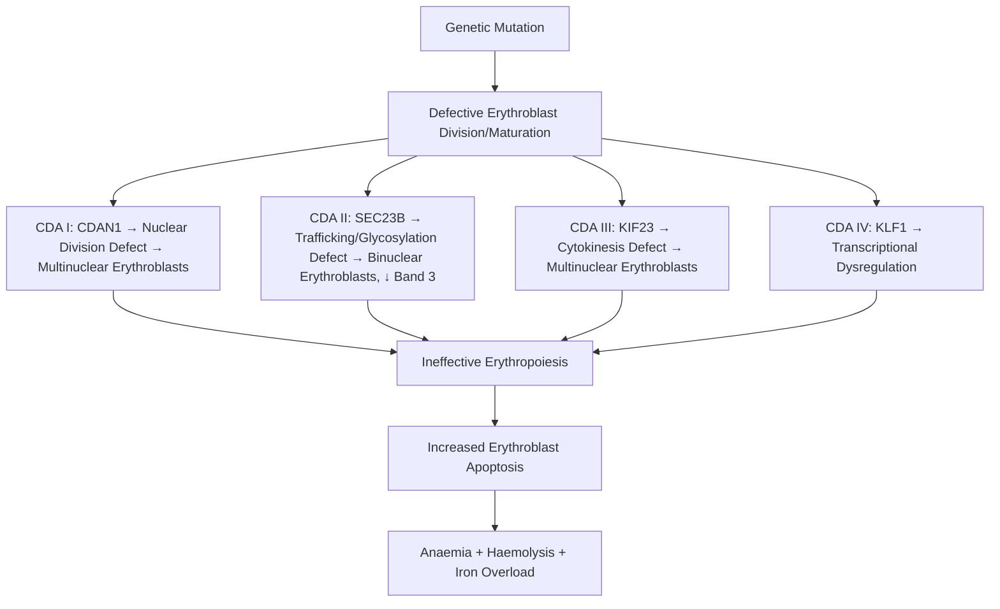

# Congenital Dyserythropoietic Anaemia (CDA)

> [!info] **Davidson Ch 25 Alignment**: Anaemia and Red Cell Disorders → Congenital Dyserythropoietic Anaemia
> **FCPS/MRCP Focus**: CDA Types I/II/III, Morphology (Binuclear erythroblasts), Genetics (SEC23B, KIF23, KLF1), Iron overload, Splenectomy

---

## 🎯 Learning Objectives

- [ ] Define **Congenital Dyserythropoietic Anaemia (CDA)**: **Inherited anaemias** with **ineffective erythropoiesis**, **morphological abnormalities** in erythroblasts
- [ ] Classify **CDA Types I, II, III**: Morphology, Genetics, Clinical features
- [ ] Recognise **Key Morphology**: **Binuclear erythroblasts** (CDA II), **Multinuclear erythroblasts** (CDA I/III)
- [ ] Apply **Genetics**: **CDA I (CDAN1/C15orf41)**, **CDA II (SEC23B)**, **CDA III (KIF23)**, **CDA IV (KLF1)**
- [ ] Manage: **Folic acid**, **Transfusions if severe**, **Iron chelation** (if iron overload), **Splenectomy** (CDA II), **Allogeneic HSCT** (severe)
- [ ] Differentiate from: **Thalassaemia, Sickle Cell, Hereditary Spherocytosis, MDS**

---

## 📖 Definition & Classification

| Type | Synonym | Key Morphology | Gene | Inheritance |
|------|---------|----------------|------|-------------|
| **CDA I** | **Megaloblastic CDA** | **Multinuclear erythroblasts** (≥3 nuclei), Internuclear chromatin bridges | **CDAN1** (C15orf41) | Autosomal Recessive |
| **CDA II** | **HEMPAS** (Hereditary Erythroblast Multinuclearity with Positive Acidified Serum test) | **Binuclear erythroblasts** (30-50%), **Glycosylation defect** | **SEC23B** | Autosomal Recessive |
| **CDA III** | **Erythroblast Multinuclearity** | **Multinuclear erythroblasts** (up to 12 nuclei), Giant erythroblasts | **KIF23** | Autosomal Dominant |
| **CDA IV** | **KLF1-related** | **Normal/Minimal dyserythropoiesis**, **No binuclear cells** | **KLF1** | Autosomal Dominant |

> [!tip] **CDA = Ineffective erythropoiesis + Morphological abnormalities**. **CDA II = Binuclear erythroblasts (HEMPAS)**. **CDA I/III = Multinuclear erythroblasts**. **SEC23B = CDA II**, **CDAN1 = CDA I**.

---

## ⚙️ Pathophysiology



---

## 🔬 Diagnostic Workup

```mermaid
flowchart TD
    A[Congenital Anaemia + Family History + Dyserythropoiesis] --> B[**CBC + Film**]
    B --> C{**Dyserythropoietic Features?**}
    C -->|Yes| D[**Bone Marrow Aspirate**]
    D --> E{**Key Morphology**}
    E -->|**Binuclear Erythroblasts (30-50%)**| F[**CDA II Suspected**]
    E -->|**Multinuclear Erythroblasts (≥3 nuclei)**| G[**CDA I / III Suspected**]
    F --> H[**SEC23B Sequencing**]
    G --> H
    H --> I[**Genetic Confirmation**]
    I --> J[**Serum Test: Acidified Serum Lysis (HEMPAS)**]
    J -->|Positive| K[**CDA II Confirmed**]
    J -->|Negative| L[**CDA I/III/IV**]
```

### Key Investigations

| Test | CDA I | CDA II (HEMPAS) | CDA III | CDA IV |
|------|-------|-----------------|---------|--------|
| **Binuclear Erythroblasts** | Rare | **30-50% (Hallmark)** | Rare | None |
| **Multinuclear Erythroblasts (≥3 nuclei)** | **Common** | Rare | **Common (Up to 12 nuclei)** | None |
| **Acidified Serum Test (HEMPAS)** | Negative | **Positive** | Negative | Negative |
| **Electron Microscopy** | **Nuclear membrane folds** | **Membrane abnormalities** | Normal | Normal |
| **Genetics** | **CDAN1 (C15orf41)** | **SEC23B** | **KIF23** | **KLF1** |
| **Inheritance** | AR | **AR** | AD | AD |

---

## 🩺 Clinical Features

| Feature | CDA I | CDA II | CDA III | CDA IV |
|---------|-------|--------|---------|--------|
| **Age at Presentation** | **Childhood/Adolescence** | **Childhood/Young Adult** | **Adulthood** | **Variable** |
| **Anaemia Severity** | **Moderate-Severe** | **Mild-Moderate** | **Mild** | **Mild** |
| **Jaundice** | Common | Common | Mild | Mild |
| **Splenomegaly** | Common | **Common** | Mild | Mild |
| **Gallstones** | Common | **Common** | Uncommon | Uncommon |
| **Iron Overload** | **Severe (Early)** | **Moderate-Severe** | Mild | Absent |
| **Skeletal Abnormalities** | **Common** (Scapulae, Digits) | Rare | Rare | None |

> [!warning] **Iron Overload** is a major complication in **CDA I and II** (due to ineffective erythropoiesis + transfusions) → **Requires Chelation**.

---

## 🔬 Key Diagnostic Tests

### CDA II (HEMPAS) - Most Common

| Test | Finding |
|------|---------|
| **Binuclear Erythroblasts** | **30-50%** on BM film |
| **Acidified Serum Lysis Test (HEMPAS)** | **Positive** (Lysis of own RBCs in acidified serum) |
| **SDS-PAGE** | **Band 3 deficiency** (Reduced), **Increased Polypeptides** |
| **SEC23B Sequencing** | **Confirmatory** |

### Acidified Serum Test (Ham's Test for CDA II - HEMPAS)

| Principle | RBCs from CDA II patients **Lyze in Acidified Serum** (pH 6.5-7.0) due to **Abnormal Band 3** |
|-----------|--------------------------------------------------------------------------------------------------|
| **Mechanism** | **Defective Band 3 Glycosylation** → **Exposure of Cryptic Antigen** → Complement activation in low pH |
| **Specificity** | **Positive in CDA II only** (Negative in CDA I, III, IV, PNH) |

---

## 💊 Management

| Intervention | CDA I | CDA II | CDA III | CDA IV |
|--------------|-------|--------|---------|--------|
| **Folic Acid** | **5 mg daily** (All types) | | | |
| **Transfusions** | If **Hb <70-80 g/L** / Symptomatic | Intermittent | Rarely needed | Rarely needed |
| **Iron Chelation** | **Early/Severe** (Ferritin >1000, LIC >7) | **Moderate-Severe** (Ferritin >1000) | Mild | Not needed |
| **Splenectomy** | **Controversial** (Limited benefit) | **Beneficial** (↑ Hb, ↓ transfusion) | Not indicated | Not indicated |
| **Allogeneic HSCT** | **Severe, Transfusion-dependent** | **Severe, Transfusion-dependent** | Rarely needed | Not indicated |
| **Interferon-α** | **Experimental** | **Sometimes used** | No | No |

---

## 🔄 Differential Diagnosis

| Condition | Differentiating Features |
|-----------|-------------------------|
| **Thalassaemia** | **Microcytic**, Target cells, **Normal BM maturation** (no dyserythropoiesis) |
| **Sickle Cell Disease** | **Sickle cells**, **HbS on HPLC**, **No dyserythropoiesis** |
| **Hereditary Spherocytosis** | **Spherocytes**, **EMA↓/OFT↑**, **No binuclear/multinuclear erythroblasts** |
| **MDS** | **Dysplasia ≥10% in ≥1 lineage**, **Cytogenetic abnormalities**, **Older age** |
| **PNH** | **Flow CD55/CD59-**, **Haemoglobinuria**, **No dyserythropoiesis** |

---

## 💡 FCPS/MRCP High-Yield Summary

| Topic | Key Point |
|-------|-----------|
| **CDA Definition** | **Inherited** + **Ineffective erythropoiesis** + **Dyserythropoiesis** |
| **CDA II (HEMPAS)** | **Most common**; **Binuclear erythroblasts (30-50%)**, **Acidified serum test +ve**, **SEC23B**, **Band 3↓** |
| **CDA I** | **Multinuclear erythroblasts (≥3 nuclei)**, **Negative HEMPAS**, **CDAN1**, **Skeletal abnormalities** |
| **CDA III** | **Multinuclear (up to 12 nuclei)**, **KIF23**, **AD inheritance**, Adult onset |
| **CDA IV** | **KLF1 mutation**, **No binuclear/multinuclear cells**, **AD** |
| **Iron Overload** | **Major complication** (CDA I/II) → **Chelation (Deferasirox/Deferiprone/Deferoxamine)** |
| **Splenectomy** | **Beneficial in CDA II** (↑ Hb, ↓ transfusions) |
| **Acidified Serum Test (HEMPAS)** | **Positive = CDA II** (Specific) |

---

## ❓ Viva Questions

1. **What is the hallmark morphological feature of CDA II (HEMPAS)?**
   - **Binuclear erythroblasts (30-50%)** on bone marrow aspirate

2. **What is the Acidified Serum Lysis Test (HEMPAS) and when is it positive?**
   - **Patient's RBCs lyse in acidified serum (pH 6.5-7.0)**; **Positive only in CDA II** (Specific)

3. **How does CDA II differ from CDA I morphologically?**
   - **CDA II: Binuclear erythroblasts (30-50%)**; **CDA I: Multinuclear erythroblasts (≥3 nuclei)**

3. **What is the molecular basis of CDA II (HEMPAS)?**
   - **SEC23B mutation** → Defective glycosylation/trafficking → **Band 3 deficiency**

4. **Why does iron overload occur in CDA and how is it managed?**
   - **Ineffective erythropoiesis + Transfusions** → Iron overload → **Chelation (Deferasirox/Deferiprone/Deferoxamine)**

5. **Is Splenectomy beneficial in CDA?**
   - **CDA II: Yes** (↑ Hb, ↓ transfusion need); **CDA I: Controversial**; **CDA III/IV: Not indicated**

6. **What is the Acidified Serum Test (HEMPAS) and what does it detect?**
   - **Patient's RBCs incubated in acidified serum (pH 6.5-7.0)** → **Lysis = Positive for CDA II** (Band 3 defect)

7. **What genetic mutations cause CDA I, II, III, and IV?**
   - **CDA I: CDAN1/C15orf41**; **CDA II: SEC23B**; **CDA III: KIF23**; **CDA IV: KLF1**

7. **How does CDA differ from Thalassaemia?**
   - **CDA: Dyserythropoiesis (Binuclear/Multinuclear erythroblasts), Normal/High MCV**; **Thalassaemia: Microcytic, Target cells, No dyserythropoiesis**

8. **What is the inheritance pattern of each CDA type?**
   - **CDA I: AR**, **CDA II: AR**, **CDA III: AD**, **CDA IV: AD**

9. **What is the role of Interferon-α in CDA?**
   - Sometimes used in **CDA I** (Experimental), **CDA II** (Sometimes), **Not in III/IV**

10. **How do you diagnose CDA IV?**
    - **KLF1 mutation**, **No binuclear/multinuclear erythroblasts**, **AD inheritance**, Mild anaemia

---

## 🧠 Confusions & Mnemonics

| Confusion | Clarification |
|-----------|---------------|
| **CDA I vs CDA II** | **CDA I = Multinuclear (≥3 nuclei)**; **CDA II = Binuclear (30-50%)** |
| **HEMPAS Test** | **Positive = CDA II only**; **Negative = CDA I, III, IV, PNH** |
| **SEC23B vs CDAN1** | **SEC23B = CDA II**; **CDAN1 = CDA I** |
| **Iron Overload** | **CDA I/II = Severe**; **CDA III = Mild**; **CDA IV = None** |
| **Splenectomy** | **Beneficial in CDA II**; **Controversial in CDA I** |

| Mnemonic | Meaning |
|----------|---------|
| **"CDA II = Binuclear = 2 Nuclei = SEC23B"** | CDA II hallmarks |
| **"CDA I = Multi-Nuclear = 3+ Nuclei = CDAN1"** | CDA I hallmarks |
| **"CDA III = Many Nuclei (12) = KIF23"** | CDA III hallmarks |
| **"CDA IV = KLF1 = No Dyserythropoiesis"** | CDA IV unique |
| **"HEMPAS = CDA II Only = Acidified Serum Lysis"** | Specific test |
| **"SEC23B = CDA II = Band 3 Defect"** | Molecular mechanism |

---

## 🗺️ Mind Map

```mermaid
mindmap
  root((Congenital Dyserythropoietic Anaemia))
    CDA I
      CDAN1/C15orf41 (AR)
      Multinuclear Erythroblasts (≥3)
      HEMPAS Negative
      Skeletal Abnormalities
      Severe Iron Overload
    CDA II (HEMPAS) - Most Common
      SEC23B (AR)
      Binuclear Erythroblasts (30-50%)
      HEMPAS Positive (Acidified Serum Lysis)
      Band 3 Deficiency (SDS-PAGE)
      Splenectomy Beneficial
      Moderate-Severe Iron Overload
    CDA III
      KIF23 (AD)
      Multinuclear (Up to 12 nuclei)
      Adult Onset
      Mild Iron Overload
    CDA IV
      KLF1 (AD)
      Minimal Dyserythropoiesis
      No Binuclear/Multinuclear
      No Iron Overload
    Diagnosis
      BM: Binuclear/Multinuclear
      HEMPAS Test
      Genetic Sequencing
    Management
      Folic Acid
      Transfusions
      Iron Chelation (I/II)
      Splenectomy (II)
      HSCT (Severe)
```

---

## 📋 One-Page Revision Card

| **CONGENITAL DYSERYTHROPOIETIC ANAEMIA (CDA) – FCPS/MRCP REVISION CARD** |
|----------------------------------------------------------------------------|
| **CDA I**: **CDAN1 (AR)**, **Multinuclear (≥3 nuclei)**, **HEMPAS -ve**, Skeletal abn, Severe Fe overload |
| **CDA II (HEMPAS)**: **SEC23B (AR)**, **Binuclear (30-50%)**, **HEMPAS +ve** (Acidified serum lysis), Band 3↓, Splenectomy helps |
| **CDA III**: **KIF23 (AD)**, **Multinuclear (Up to 12 nuclei)**, Adult onset, Mild Fe overload |
| **CDA IV**: **KLF1 (AD)**, Minimal dyserythropoiesis, No binuclear/multinuclear, No Fe overload |
| **HEMPAS Test**: **Acidified serum lysis +ve = CDA II ONLY** |
| **Iron Overload**: **CDA I/II Severe → Chelation (Deferasirox/DFP/DFO)** |
| **Splenectomy**: **CDA II Beneficial**; **CDA I Controversial** |

---

## 📅 Spaced Repetition Tracker

| Review | Date | Score (1-5) | Next Review |
|--------|------|-------------|-------------|
| Day 1 | 2025-06-17 | | 2025-06-18 |
| Day 3 | | | |
| Day 7 | | | |
| Day 15 | | | |
| Day 30 | | | |

---

## 🎯 Must Know / Should Know / Nice to Know

| Level | Content |
|-------|---------|
| **Must Know** | CDA types (I/II/III/IV), Binuclear vs Multinuclear erythroblasts, HEMPAS test (CDA II specific), Genetics (SEC23B, CDAN1, KIF23, KLF1), Iron overload in I/II, Splenectomy in CDA II, HEMPAS test interpretation |
| **Should Know** | CDA I skeletal abnormalities, CDA III adult onset, CDA IV minimal dyserythropoiesis, Acidified serum test mechanism (Band 3 defect), SEC23B trafficking/glycosylation defect, KIF23 cytokinesis defect, KLF1 transcription factor, Interferon-α use in CDA I/II, HSCT indications, Genetic counselling |
| **Nice to Know** | CDAN1 protein function, SEC23B COPII vesicle trafficking, KIF23 mitotic kinesin, KLF1 erythroid transcription factor network, Ultrastructural findings (nuclear membrane folds in CDA I), Acidified serum lysis complement pathway, CDA IV association with Hereditary Persistence of Foetal Haemoglobin (HPFH), Prenatal diagnosis, Gene therapy prospects, International CDA registry data |

---

## ✅ Self-Test Scorecard

| Section | Score (0-10) | Notes |
|---------|--------------|-------|
| CDA Types & Morphology | | |
| HEMPAS Test | | |
| Genetics | | |
| Iron Overload & Chelation | | |
| Splenectomy Indications | | |
| Differential Diagnosis | | |
| Viva Questions | | |

---

## 🔗 Local Navigation

- **Previous**: [[Endocrine Anaemia]]
- **Next**: [[Hypermetabolism]]
- **Section Hub**: [[Anaemia and Red Cell Disorders]]
- **MOC**: [[Hematology MOC]]
- **Template**: [[../Templates/Hematology Topic Template]]

---

*Generated for FCPS/MRCP exam preparation. Based on Davidson Medicine 24th Ed Chapter 25.*
---

> Auto-generated study sections for "Hematology" — Ch 24: Haematology & Transfusion Medicine.

## Flashcards (11 generated)

- Q: What is Binuclear Erythroblasts of Hematology?
  A: 30-50% on BM film
- Q: What is the investigation of choice for Hematology?
  A: Positive (Lysis of own RBCs in acidified serum)
- Q: What is SDS-PAGE of Hematology?
  A: Band 3 deficiency (Reduced), Increased Polypeptides
- Q: What is the definition of Hematology?
  A: Inherited + Ineffective erythropoiesis + Dyserythropoiesis
- Q: What is CDA II (HEMPAS) of Hematology?
  A: Most common; Binuclear erythroblasts (30-50%), Acidified serum test +ve, SEC23B, Band 3↓
- Q: What is CDA I of Hematology?
  A: Multinuclear erythroblasts (≥3 nuclei), Negative HEMPAS, CDAN1, Skeletal abnormalities
- Q: What is CDA III of Hematology?
  A: Multinuclear (up to 12 nuclei), KIF23, AD inheritance, Adult onset
- Q: What is CDA IV of Hematology?
  A: KLF1 mutation, No binuclear/multinuclear cells, AD
- Q: What is Iron Overload of Hematology?
  A: Major complication (CDA I/II) → Chelation (Deferasirox/Deferiprone/Deferoxamine)
- Q: What is Splenectomy of Hematology?
  A: Beneficial in CDA II (↑ Hb, ↓ transfusions)
- Q: What is the investigation of choice for Hematology?
  A: Positive = CDA II (Specific)

## MCQs (1 generated)

1. **Which of the following best describes Hematology?**
   A. **[!info] Davidson Ch 25 Alignment: Anaemia and Red Cell Disorders → Congenital Dyserythropoietic Anaemia**
   B. An unrelated condition not matching the clinical picture of Hematology
   C. A complication seen late in the disease course of Hematology
   D. A condition that mimics Hematology but has a different underlying cause

## SBA Questions (1 generated)

1. A patient with suspected Hematology presents with: CDA I — Megaloblastic CDA; CDA II — HEMPAS (Hereditary Erythroblast Multinuclearity with Positive Acidified Serum test); CDA III — Erythroblast Multinuclearity. What is the most likely diagnosis?
   A. **Hematology**
   B. A condition that mimics Hematology but is not the same entity
   C. A complication of Hematology rather than the primary diagnosis
   D. An unrelated condition in the same clinical category as Hematology

## PasTest Scenario SBAs (Clinical Vignettes)

> **Auto-generated PasTest/Mediscope-style scenario SBAs** grounded in the authored source. Each scenario tests a real clinical fact (triad, specific sign, contraindication, trial, first-line Rx) extracted from the topic. *Source: Ch 24: Haematology — Congenital Dyserythropoietic Anaemia*

**Q1.** Which of the following features is most specific or characteristic of Congenital Dyserythropoietic Anaemia?

  - **A.** "CDA II = Binuclear = 2 Nuclei = SEC23B"
  - **B.** A feature common to many acute inflammatory conditions
  - **C.** A non-specific sign that does not localise the diagnosis
  - **D.** An investigation finding rather than a clinical feature

  > **Answer: A** — "CDA II = Binuclear = 2 Nuclei = SEC23B"
  >
  > *Source:* neficial in CDA II**; **Controversial in CDA I** |

| Mnemonic | Meaning |
|----------|---------|
| **"CDA II = Binuclear = 2 Nuclei = SEC23B"** | CDA II hallmarks |
| **"CDA I = Multi-Nuclear = 3+ Nu

