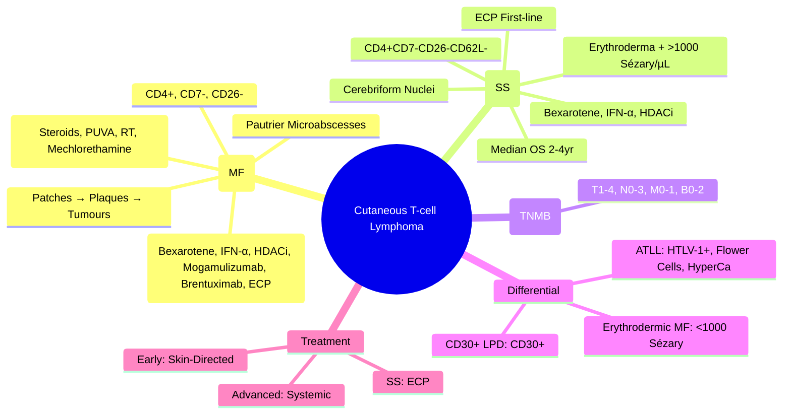

# Cutaneous T-cell Lymphoma (Mycosis Fungoides & Sézary Syndrome)

> [!info] **Davidson Ch 25 Alignment**: Haematological Malignancies → Lymphomas → Cutaneous T-cell Lymphoma
> **FCPS/MRCP Focus**: Mycosis fungoides (MF), Sézary syndrome (SS), TNMB staging, skin-directed vs systemic therapy, prognosis, HTLV-1 association

---

## 🎯 Learning Objectives

- [ ] Define **Cutaneous T-cell Lymphoma (CTCL)**: **Primary cutaneous T-cell lymphoma** with epidermotropism
- [ ] Distinguish **Mycosis Fungoides (MF)** vs **Sézary Syndrome (SS)**: **MF = Skin-limited patches/plaques**; **SS = Erythroderma + Leukaemic phase (>1000 Sézary cells/µL)**
- [ ] Apply **TNMB Staging** (IASLC/ISCL/EORTC): T (skin), N (nodes), M (visceral), B (blood)
- [ ] Manage **Early MF (IA-IIA)**: **Skin-directed** (Topical steroids, PUVA, Radiotherapy, Mechlorethamine)
- [ ] Manage **Advanced MF/SS (IIB-IV)**: **Systemic therapy** (Retinoids, Interferon-α, HDAC inhibitors, PDT, Mogamulizumab, Brentuximab)
- [ ] Recognise **Sézary Syndrome**: **Erythroderma + Lymphadenopathy + >1000 Sézary cells/µL (CD4+CD7-CD26-)**
- [ ] Understand **Prognosis**: Early MF = Normal life expectancy; SS = Median OS 2-4 years

---

## 📖 Definition & Classification

| Entity | Definition | Key Features |
|--------|------------|--------------|
| **Mycosis Fungoides (MF)** | **Most common CTCL** (~60%); **Epidermotropic** CD4+ T-cells; **Patches → Plaques → Tumours** | Slow progression, Skin-limited early |
| **Sézary Syndrome (SS)** | **Leukaemic variant**; **Erythroderma** + **Sézary cells >1000/µL** (CD4+CD7-CD26-) | Aggressive, Blood involvement |
| **Primary Cutaneous CD30+ LPD** | **LyP (Lymphomatoid Papulosis)** + **pcALCL** | CD30+, Good prognosis |

> [!tip] **MF = Patches/Plaques/Tumours (Skin-limited early)**; **SS = Erythroderma + Blood involvement (>1000 Sézary/µL)**. **Sézary cells = CD4+CD7-CD26-**.

---

## ⚙️ Pathophysiology

```mermaid
flowchart TD
    A[CD4+ T-cell Clone] --> B[Cutaneous Homing (CCR4, CLA)]
    B --> C[Epidermotropism (MF) / Blood Circulation (SS)]
    C --> D1[MF: Patches → Plaques → Tumours]
    C --> D2[SS: Erythroderma + Blood Involvement]
    D1 & D2 --> E[Loss of CD7 / CD26 / CD62L]
    E --> F[Immune Evasion / ↓ Tumour Surveillance]
```

---

## 🔬 Diagnostic Workup

```mermaid
flowchart TD
    A[Chronic Rash/Erythroderma + Lymphadenopathy] --> B[**Skin Biopsy (Punch/Incisional)**]
    B --> C[**Histology: Epidermotropism, Pautrier Microabscesses, Cerebriform Nuclei**]
    C --> D[**IHC: CD3+, CD4+, CD45RO+, CD7-, CD26- (MF/SS)**]
    D --> E[**Blood: Sézary Count (Flow: CD4+CD7-CD26-)**]
    E --> F{**Sézary >1000/µL?**}
    F -->|Yes| G[**Sézary Syndrome**]
    F -->|No| H[**Mycosis Fungoides**]
    G & H --> I[**Staging: TNMB**]
    I --> J1[**CT Chest/Abd/Pelvis**]
    J1 --> J2[**CT/PET-CT**]
    J2 --> J3[**BM Biopsy** (if Stage ≥IIB)]
    J3 --> J4[**TCR Gene Rearrangement (PCR)**]
```

### Essential Investigations

| Test | MF | SS |
|------|-----|-----|
| **Skin Biopsy** | **Epidermotropism, Pautrier microabscesses, Cerebriform nuclei** | Similar (often less epidermotropism) |
| **IHC** | **CD3+, CD4+, CD45RO+, CD7-, CD26-, CD30- (usually)** | **CD3+, CD4+, CD7-, CD26-, CD30- (variable)** |
| **Sézary Count (Flow)** | **<1000/µL** | **>1000/µL (CD4+CD7-CD26-)** |
| **CXCR3/CCR4** | CCR4+ (Skin homing) | CCR4+ |
| **TCR Rearrangement** | Clonal (PCR) | Clonal (Same clone as skin) |
| **Lymph Node Biopsy** | If ≥1.5cm (Dermatopathic vs Involved) | Often involved |
| **BM Biopsy** | Stage IIB+ | Usually involved |
| **HTLV-1 Serology** | Negative (usually) | **Positive in ATLL** (Differential) |

---

## 📊 TNMB Staging (IASLC/ISCL/EORTC)

| Category | Stage | Criteria |
|----------|-------|----------|
| **T (Skin)** | T1 | Patches/Plagues <10% BSA |
| | T2 | Patches/Plagues ≥10% BSA |
| | T3 | Tumours (≥1cm) |
| | T4 | Erythroderma |
| **N (Nodes)** | N0 | No lymphadenopathy |
| | N1 | Dermatopathic changes |
| | N2 | Lymphomatous involvement |
| | N3 | Lymphomatous + Masses |
| **M (Visceral)** | M0 | No visceral involvement |
| | M1 | Visceral involvement |
| **B (Blood)** | B0 | <5% Sézary cells |
| | B1 | 5-100/µL (Low) |
| | B2 | >1000/µL (Sézary Syndrome) |

### Stage Grouping

| Stage | TNMB | Median Survival |
|-------|------|-----------------|
| **IA** | T1, N0, M0, B0 | **Normal** |
| **IB** | T2, N0, M0, B0 | **Normal** |
| **IIA** | T1-2, N1, M0, B0 | ~15-20 years |
| **IIB** | T3, N0-1, M0, B0 | ~5-10 years |
| **III** | T4, N0-1, M0, B0-1 | Erythroderma |
| **IVA1** | T1-4, N0-2, M0, B2 | **Sézary Syndrome** (~3-5 years) |
| **IVA2** | T1-4, N3, M0, B0-2 | ~2-4 years |
| **IVB** | Any T, Any N, M1, Any B | **<2 years** |

---

## 💊 Management

### Early Stage (IA-IIA) - **Skin-Directed Therapy**

| Modality | Indication | Details |
|----------|------------|---------|
| **Topical Corticosteroids** | **T1-T2 (Patches/Plagues)** | **Potent/Ultrapotent** (Clobetasol), **Taper to maintenance** |
| **Phototherapy (PUVA/Narrowband UVB)** | **T1-T2 (Widespread)** | **2-3x/week**, **Clears ~70-80%**, Maintenance |
| **Topical Mechlorethamine (Nitrogen Mustard)** | **T1-T2** | **0.01-0.02% gel**, Daily → Taper, **Carcinogenic risk** |
| **Radiotherapy (Localised/Total Skin Electron Beam)** | **T1-T3 (Localised/TST)** | **TSEB: 12-36 Gy**, Excellent local control |
| **Topical Bexarotene (Retinoid)** | T1-T2 | 1% gel, Daily, **Skin irritation** common |

### Advanced Stage (IIB-IV) - **Systemic Therapy**

| Agent | Indication | Key Points |
|-------|------------|------------|
| **Oral Bexarotene (Retinoid)** | IIB-IV | **300 mg/m²/day**, **Lipids/Thyroid monitoring**, **Triglycerides ↑, Hypothyroidism** |
| **Interferon-α** | IIB-IV | **3-5 MU SC 3x/week**, **Flu-like, Depression, Cytopenias** |
| **HDAC Inhibitors (Vorinostat, Romidepsin)** | Relapsed/Refractory | **Oral/IV**, **Fatigue, Nausea, Thrombocytopenia**, **QTc prolongation (Romidepsin)** |
| **Mogamulizumab (Anti-CCR4)** | Relapsed/Refractory (SS/MF) | **Anti-CCR4 mAb**, **1mg/kg IV q1-2wk**, **Rash, Infusion reactions**, **Autoimmune** |
| **Brentuximab Vedotin** | CD30+ MF/SS | **Anti-CD30 ADC**, **1.8mg/kg IV q3wk**, **Peripheral neuropathy** |
| **Extracorporeal Photopheresis (ECP)** | **SS / Erythrodermic MF** | **Leukapheresis + 8-MOP + UVA**, **2 days q2-4wk**, **First-line for SS** |
| **Allogeneic HSCT** | Young, Fit, Refractory | **Only potentially curative** |

---

## 🩺 Sézary Syndrome Specifics

| Feature | Details |
|---------|---------|
| **Diagnosis** | **Erythroderma + Lymphadenopathy + Sézary cells >1000/µL** (CD4+CD7-CD26-) |
| **Sézary Cells** | **Cerebriform nuclei**, **CD4+CD7-CD26-CD62L-** |
| **Erythroderma** | **>80% BSA**, Pruritus, Ectropion, Palmoplantar keratoderma, Lymphadenopathy |
| **First-line** | **ECP (Extracorporeal Photopheresis)** + **Retinoids/Interferon** |
| **Prognosis** | **Median OS 2-4 years** (worse than MF) |

---

## 🔄 Differential Diagnosis

| Condition | Key Differentiators |
|-----------|-------------------|
| **Sézary vs ATLL** | **ATLL: HTLV-1+, Flower cells, Hypercalcaemia, Lytic lesions**; **SS: HTLV-1-, Cerebriform, No hypercalcaemia** |
| **Sézary vs Erythrodermic MF** | **SS: Sézary cells >1000/µL + Erythroderma**; **MF: <1000, May have erythroderma (T4)** |
| **MF vs Eczema/Psoriasis** | **Biopsy: Epidermotropism, Pautrier microabscesses, Cerebriform nuclei, Clonal TCR** |
| **MF vs Parapsoriasis** | **Parapsoriasis: No atypia, No clonality, Benign course** |
| **SS vs Erythrodermic CTCL** | **SS = Erythroderma + >1000 Sézary/µL** (Specific leukaemic phase) |
| **CD30+ LPD (LyP/pcALCL)** | **CD30+, CD30+ large cells**, **Self-regressing (LyP)** |

---

## 💡 FCPS/MRCP High-Yield Summary

| Topic | Key Point |
|-------|-----------|
| **MF vs SS** | **MF = Patches/Plaques/Tumours (<1000 Sézary)**; **SS = Erythroderma + >1000 Sézary/µL** |
| **Sézary Cells** | **CD4+CD7-CD26-CD62L-**, Cerebriform nuclei |
| **Staging** | **TNMB**: T1-4 (Skin), N0-3 (Nodes), M0-1 (Visceral), B0-2 (Blood) |
| **Early MF (IA-IIA)** | **Skin-directed**: Topical steroids, PUVA, Radiotherapy, Mechlorethamine |
| **Advanced (IIB-IV)** | **Systemic**: Bexarotene, IFN-α, HDAC inhibitors, Mogamulizumab, Brentuximab, ECP |
| **Sézary Syndrome** | **Erythroderma + >1000 Sézary/µL**, **ECP first-line**, Median OS 2-4yr |
| **Prognosis** | **Early MF = Normal life expectancy**; **SS = 2-4 years** |
| **Key IHC** | **CD4+, CD7-, CD26- (Sézary/MF)**, **CD30- (MF), CD30+ (ALCL/pcALCL)** |

---

## ❓ Viva Questions

1. **What is the difference between Mycosis Fungoides and Sézary Syndrome?**
   - **MF**: Patches/Plques/Tumours, **Sézary cells <1000/µL**; **SS**: **Erythroderma + >1000 Sézary/µL**, Leukaemic phase

2. **What are Sézary cells and their immunophenotype?**
   - **Cerebriform nuclei**, **CD4+CD7-CD26-CD62L-**

3. **What is the TNMB staging for CTCL?**
   - **T1-4 (Skin), N0-3 (Nodes), M0-1 (Visceral), B0-2 (Blood Sézary count)**

4. **What is the first-line treatment for early stage Mycosis Fungoides (IA-IIA)?**
   - **Skin-directed therapy**: **Topical steroids, PUVA, Radiotherapy, Topical Mechlorethamine**

5. **What is the standard first-line treatment for Sézary Syndrome?**
   - **Extracorporeal Photopheresis (ECP)** + **Retinoids/Interferon-α**

6. **What is the immunophenotype of Sézary cells?**
   - **CD4+CD7-CD26-CD62L-**, Cerebriform nuclei

7. **How does Sézary Syndrome differ from ATLL?**
   - **ATLL: HTLV-1+, Flower cells, Hypercalcaemia, Lytic lesions**; **SS: HTLV-1-, Cerebriform, No Hypercalcaemia**

7. **What is the prognosis of Stage IA Mycosis Fungoides vs Sézary Syndrome?**
   - **Stage IA MF: Normal life expectancy**; **Sézary Syndrome: Median OS 2-4 years**

8. **What is the role of Extracorporeal Photopheresis (ECP) in CTCL?**
   - **First-line for Sézary Syndrome**, Erythrodermic MF; **Mechanism: Immunomodulation, apoptosis of malignant T-cells**

8. **What is the difference between MF and Parapsoriasis?**
   - **MF: Atypia, Pautrier microabscesses, Cerebriform nuclei, Clonal TCR**; **Parapsoriasis: No atypia, Benign, No clonality**

9. **What is the role of Mogamulizumab in CTCL?**
   - **Anti-CCR4 antibody**, Relapsed/Refractory MF/SS, **Rash, Infusion reactions, Autoimmune**

10. **How is Erythrodermic MF (T4) staged and treated?**
    - **Stage III-IVA1**; **Systemic therapy** (Retinoids, IFN-α, ECP, Bexarotene)

---

## 🧠 Confusions & Mnemonics

| Confusion | Clarification |
|-----------|---------------|
| **MF vs SS** | **MF = Patches/Plaques/Tumours, Sézary <1000**; **SS = Erythroderma, Sézary >1000** |
| **MF vs Parapsoriasis** | **MF: Atypia, Pautrier microabscesses, Clonal TCR**; **Parapsoriasis: No atypia, No clonality** |
| **SS vs Erythrodermic MF (T4)** | **SS = >1000 Sézary/µL + Erythroderma**; **T4 MF = Erythroderma, <1000 Sézary** |
| **SS vs ATLL** | **ATLL = HTLV-1+, Flower cells, Hypercalcaemia**; **SS = HTLV-1-, Cerebriform, No HyperCa** |
| **PCALCL vs LyP vs MF** | **ALCL: CD30+, ALK+/-**; **LyP: CD30+, Self-regressing**; **MF: CD30-, Epidermotropic** |

| Mnemonic | Meaning |
|----------|---------|
| **"MF = Mycosis Fungoides = Patches→Plaques→Tumours"** | MF progression |
| **"SS = Sézary = Erythroderma + >1000 Sézary"** | SS definition |
| **"Sézary = CD4, CD7-, CD26-, CD62L-"** | Immunophenotype |
| **"ECP = First-line SS"** | Treatment |
| **"TNMB = T(Skin) N(Node) M(Visceral) B(Blood)"** | Staging |
| **"Early MF = Skin-directed; Advanced = Systemic"** | Treatment paradigm |

---

## 🗺️ Mind Map



---

## 📋 One-Page Revision Card

| **CUTANEOUS T-CELL LYMPHOMA – FCPS/MRCP REVISION CARD** |
|----------------------------------------------------------|
| **MF**: **Patches→Plaques→Tumours**, Sézary <1000/µL |
| **SS**: **Erythroderma + >1000 Sézary/µL** (CD4+CD7-CD26-CD62L-) |
| **Staging TNMB**: T(Skin)1-4, N(Nodes)0-3, M(Visceral)0-1, B(Blood)0-2 |
| **Early IA-IIA**: **Skin-Directed** (Topical Steroids, PUVA, RT, Mechlorethamine) |
| **Advanced IIB-IV**: **Systemic** (Bexarotene, IFN-α, HDACi, Mogamulizumab, Brentuximab, ECP) |
| **SS First-line**: **ECP** (Extracorporeal Photopheresis) |
| **Prognosis**: MF IA-IIA = Normal life expectancy; SS = 2-4yr median OS |
| **IHC**: CD4+, CD7-, CD26- (MF/SS); CD30- (MF), CD30+ (ALCL) |
| **Differential**: ATLL (HTLV-1+, Flower cells, HyperCa), Parapsoriasis (No atypia) |

---

## 📅 Spaced Repetition Tracker

| Review | Date | Score (1-5) | Next Review |
|--------|------|-------------|-------------|
| Day 1 | 2025-06-17 | | 2025-06-18 |
| Day 3 | | | |
| Day 7 | | | |
| Day 15 | | | |
| Day 30 | | | |

---

## 🎯 Must Know / Should Know / Nice to Know

| Level | Content |
|-------|---------|
| **Must Know** | MF vs SS definition, Sézary cell immunophenotype (CD4+CD7-CD26-), TNMB staging, Early MF = skin-directed, SS = ECP first-line, MF/SS prognosis difference, MF/SS immunophenotype (CD4+, CD7-, CD26-), ATLL differentiation |
| **Should Know** | TNMB staging details, Skin-directed therapy options (PUVA, Mechlorethamine, RT), Systemic agents (Bexarotene, IFN-α, HDACi, Mogamulizumab, Brentuximab), ECP mechanism, Ceritinib in CTCL, ATLL vs SS, Erythrodermic MF vs SS distinction, Prognostic factors (Large cell transformation, LDH, B2M) |
| **Nice to Know** | TCR Vβ repertoire analysis, KIR3DL2 as Sézary marker, CCR4 as therapeutic target (Mogamulizumab), FCRL3 as Sézary marker, Gene expression profiling (GERP), CAR-T in CTCL, Photodynamic therapy, Radiotherapy techniques (TSEB, Tomotherapy), Cost-effectiveness, CAR-T in CTCL, Novel agents (Lacutamab, Ipatasertib), Clinical trial landscape |

---

## ✅ Self-Test Scorecard

| Section | Score (0-10) | Notes |
|---------|--------------|-------|
| MF vs SS Differentiation | | |
| Staging (TNMB) | | |
| Early Stage Treatment | | |
| Advanced Stage Treatment | | |
| Sézary Syndrome Specifics | | |
| Differential Diagnosis | | |
| Viva Questions | | |

---

## 🔗 Local Navigation

- **Previous**: [[Apparent Polycythaemia]]
- **Next**: [[Hypermetabolism]]
- **Section Hub**: [[Haematological Malignancies]] / [[Skin Lymphoma]]
- **MOC**: [[Hematology MOC]]
- **Template**: [[../Templates/Hematology Topic Template]]

---

*Generated for FCPS/MRCP exam preparation. Based on Davidson Medicine 24th Ed Chapter 25.*
---

> Auto-generated study sections for "Hematology" — Ch 24: Haematology & Transfusion Medicine.

## Flashcards (19 generated)

- Q: What is the definition of Hematology?
  A: # Cutaneous T-cell Lymphoma (Mycosis Fungoides & Sézary Syndrome)
- Q: What is the investigation of choice for Hematology?
  A: Erythroderma + Lymphadenopathy + Sézary cells >1000/µL (CD4+CD7-CD26-)
- Q: What is Sézary Cells of Hematology?
  A: Cerebriform nuclei, CD4+CD7-CD26-CD62L-
- Q: What is Erythroderma of Hematology?
  A: >80% BSA, Pruritus, Ectropion, Palmoplantar keratoderma, Lymphadenopathy
- Q: What is the first-line treatment for Hematology?
  A: ECP (Extracorporeal Photopheresis) + Retinoids/Interferon
- Q: What is the prognosis of Hematology?
  A: Median OS 2-4 years (worse than MF)
- Q: What is the investigation of choice for Hematology?
  A: Erythroderma + Lymphadenopathy + Sézary cells >1000/µL (CD4+CD7-CD26-)
- Q: What is Sézary Cells of Hematology?
  A: Cerebriform nuclei, CD4+CD7-CD26-CD62L-
- Q: What is Erythroderma of Hematology?
  A: >80% BSA, Pruritus, Ectropion, Palmoplantar keratoderma, Lymphadenopathy
- Q: What is the first-line treatment for Hematology?
  A: ECP (Extracorporeal Photopheresis) + Retinoids/Interferon
- Q: What is the prognosis of Hematology?
  A: Median OS 2-4 years (worse than MF)
- Q: What is MF vs SS of Hematology?
  A: MF = Patches/Plaques/Tumours (<1000 Sézary); SS = Erythroderma + >1000 Sézary/µL
- Q: What is Sézary Cells of Hematology?
  A: CD4+CD7-CD26-CD62L-, Cerebriform nuclei
- Q: What is Staging of Hematology?
  A: TNMB: T1-4 (Skin), N0-3 (Nodes), M0-1 (Visceral), B0-2 (Blood)
- Q: What is Early MF (IA-IIA) of Hematology?
  A: Skin-directed: Topical steroids, PUVA, Radiotherapy, Mechlorethamine
- Q: What is Advanced (IIB-IV) of Hematology?
  A: Systemic: Bexarotene, IFN-α, HDAC inhibitors, Mogamulizumab, Brentuximab, ECP
- Q: What is Sézary Syndrome of Hematology?
  A: Erythroderma + >1000 Sézary/µL, ECP first-line, Median OS 2-4yr
- Q: What is the prognosis of Hematology?
  A: Early MF = Normal life expectancy; SS = 2-4 years
- Q: What is Key IHC of Hematology?
  A: CD4+, CD7-, CD26- (Sézary/MF), CD30- (MF), CD30+ (ALCL/pcALCL)

## MCQs (1 generated)

1. **Which of the following best describes Hematology?**
   A. **# Cutaneous T-cell Lymphoma (Mycosis Fungoides & Sézary Syndrome)**
   B. An unrelated condition not matching the clinical picture of Hematology
   C. A complication seen late in the disease course of Hematology
   D. A condition that mimics Hematology but has a different underlying cause

## SBA Questions (1 generated)

1. A patient with suspected Hematology presents with: Mycosis Fungoides (MF) — Most common CTCL (~60%); Epidermotropic CD4+ T-cells; Patches → Plaques → Tumours; Sézary Syndrome (SS) — Leukaemic variant; Erythroderma + Sézary cells >1000/µL (CD4+CD7-CD26-); Primary Cutaneous CD30+ LPD — LyP (Lymphomatoid Papulosis) + pcALCL. What is the most likely diagnosis?
   A. **Hematology**
   B. A condition that mimics Hematology but is not the same entity
   C. A complication of Hematology rather than the primary diagnosis
   D. An unrelated condition in the same clinical category as Hematology

## PasTest Scenario SBAs (Clinical Vignettes)

> **Auto-generated PasTest/Mediscope-style scenario SBAs** grounded in the authored source. Each scenario tests a real clinical fact (triad, specific sign, contraindication, trial, first-line Rx) extracted from the topic. *Source: Ch 24: Haematology — Cutaneous T-cell Lymphoma*

**Q1.** Which of the following features is most specific or characteristic of Cutaneous T-cell Lymphoma?

  - **A.** SS vs Erythrodermic CTCL
  - **B.** A feature common to many acute inflammatory conditions
  - **C.** A non-specific sign that does not localise the diagnosis
  - **D.** An investigation finding rather than a clinical feature

  > **Answer: A** — SS vs Erythrodermic CTCL
  >
  > *Source:* l TCR** |
| **MF vs Parapsoriasis** | **Parapsoriasis: No atypia, No clonality, Benign course** |
| **SS vs Erythrodermic CTCL** | **SS = Erythroderma + >1000 Sézary/µL** (Specific leukaemic phase) |


**Q2.** What is the most appropriate first-line therapy for Cutaneous T-cell Lymphoma?

  - **A.** Extracorporeal Photopheresis + SS / Erythrodermic MF + Leukapheresis
  - **B.** An advanced/surgical therapy reserved for refractory disease
  - **C.** Symptomatic treatment only, no disease-modifying therapy
  - **D.** Empiric broad-spectrum therapy without specific indication

  > **Answer: A** — Extracorporeal Photopheresis + SS / Erythrodermic MF + Leukapheresis
  >
  > *Source:* **Extracorporeal Photopheresis (ECP)**   **SS / Erythrodermic MF**   **Leukapheresis + 8-MOP + UVA**, **2 days q2-4wk**, **First-line for SS**

