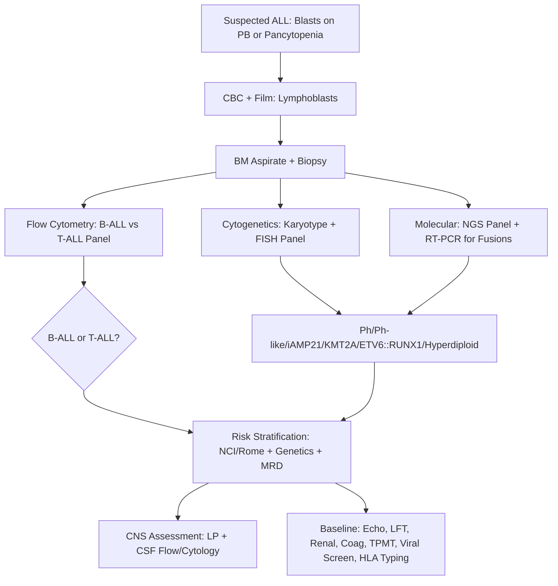
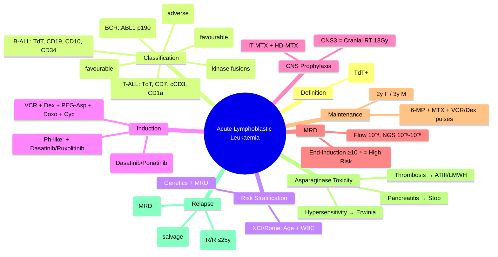

# Acute Lymphoblastic Leukaemia (ALL)

> [!info] **Davidson Ch 25 Alignment**: Haematological Malignancies → Acute Leukaemias → ALL
> **FCPS/MRCP Focus**: B-ALL vs T-ALL immunophenotype, Ph+ ALL management, risk stratification (NCI/Rome), CNS prophylaxis, blinatumomab/inotuzumab/CAR-T

---

## 🎯 Learning Objectives

- [ ] Define ALL: ≥20% lymphoblasts in BM (or defining genetic abnormalities)
- [ ] Classify per WHO 2022/ICC: B-ALL (Ph+, Ph-like, iAMP21, DUX4, ZNF384, MEF2D) vs T-ALL
- [ ] Apply **NCI/Rome risk stratification** (Standard vs High vs Very High)
- [ ] Diagnose: CBC, BM aspirate/biopsy, flow cytometry (TdT, CD19, CD10, CD20, CD34, CD3, CD7, CD1a), cytogenetics (karyotype, FISH), NGS panel
- [ ] Manage **induction**: UKALL/COG protocols (Vincristine, Dexamethasone, L-asparaginase, Doxorubicin, Cyclophosphamide)
- [ ] Manage **Ph+ ALL**: TKI (Dasatinib/Ponatinib) + Chemo → HSCT
- [ ] CNS prophylaxis: **Intrathecal MTX/Ara-C ± Cranial Irradiation** (high risk)
- [ ] Consolidation/Interim maintenance/Delayed intensification/Maintenance (2-3 years)
- [ ] Role of **Blinatumomab** (CD19/CD3 BiTE), **Inotuzumab** (CD22 ADC), **CAR-T** (tisagenlecleucel) in MRD+/relapsed
- [ ] Monitor **MRD**: Flow (10⁻⁴), NGS (Ig/TCR clonotype, 10⁻⁵-10⁻⁶)
- [ ] Understand Asparaginase hypersensitivity, thrombosis, pancreatitis management

---

## 📖 Definition & Classification

### WHO 2022 / ICC Classification

| Category | Subtypes | Key Features |
|----------|----------|--------------|
| **B-ALL** | **Ph+ (BCR::ABL1)** | t(9;22), poor prognosis historically, TKI changed outcomes |
| | **Ph-like (BCR-ABL1-like)** | Similar expression to Ph+, kinase-activating fusions (CRLF2, ABL1, ABL2, JAK2, EPOR) – **TKI targetable** |
| | **iAMP21** | Intra-chromosomal amp of chr21 – high risk |
| | **KMT2A-rearranged** | t(4;11), t(11;19) – infant ALL, poor prognosis |
| | **ETV6::RUNX1** | t(12;21) – **favourable**, 25% paediatric B-ALL |
| | **Hyperdiploidy** | 51-65 chromosomes – **favourable** |
| | **Hypodiploidy** | <44 chromosomes – adverse |
| | **DUX4, ZNF384, MEF2D, NUTM1-rearranged** | Emerging entities |
| **T-ALL** | TAL1, TLX1, TLX3, HOXA, LMO2 rearrangements | **NOTCH1/FBXW7 mutations** common; distinct protocol |

> [!tip] **FCPS/MRCP**: **B-ALL = TdT+, CD19+, CD10+, CD34+**; **T-ALL = TdT+, CD7+, CD3+ (cytoplasmic), CD1a+ (cortical)**. **Ph+ and Ph-like = TKI + chemo → HSCT**. **ETV6::RUNX1 & Hyperdiploidy = favourable**.

---

## ⚙️ Pathophysiology

```mermaid
flowchart TD
    A[Lymphoid Progenitor Mutations] --> B[Class I: Proliferation/Survival]
    A --> C[Class II: Differentiation Block]
    B & C --> D[Leukaemic Stem Cell]
    B --> E[BCR::ABL1 (Ph+), RAS, JAK2, CRLF2, IL7R]
    C --> F[ETV6::RUNX1, TCF3::PBX1, PAX5, IKZF1, KMT2A-r]
    D --> G[Clonal Expansion → ≥20% Blasts]
    G --> H[Marrow Failure + Extramedullary (CNS, Testes, Nodes)]
```

---

## 🔬 Diagnostic Workup



### Flow Cytometry – Key Markers

| Lineage | Positive Markers | Negative/Variable |
|---------|------------------|-------------------|
| **B-ALL** | **TdT+, CD19+, CD10+, CD34+, CD22+, CD79a+, HLA-DR+** | CD20 (variable, ~50%), CD13/CD33 (myeloid markers ~20%) |
| **T-ALL** | **TdT+, CD7+, cCD3+, CD2+, CD5+, CD1a+ (cortical)** | CD19-, CD10-, MPO- |
| **Early Pre-B** | TdT+, CD19+, CD10-, CD34+, HLA-DR+ | |
| **Pro-B** | TdT+, CD19+, CD10-, CD34-, CD38+, HLA-DR+ | |

### Essential Genetic Panel

| Test | Target | Method |
|------|--------|--------|
| **BCR::ABL1 (p190)** | Ph+ ALL | RT-PCR (quantitative), FISH |
| **KMT2A (11q23)** | Infant ALL, t(4;11) etc. | FISH, RT-PCR |
| **ETV6::RUNX1** | t(12;21) – favourable | FISH, RT-PCR |
| **Hyperdiploidy** | 51-65 chromosomes | Karyotype, SNP array |
| **iAMP21** | chr21 amplification | FISH (RUNX1 probe) |
| **Ph-like panel** | CRLF2, ABL1/2, JAK2, EPOR fusions | RNA-seq, targeted NGS |
| **IKZF1 deletion** | Poor prognosis marker | MLPA, NGS |
| **NOTCH1/FBXW7** | T-ALL mutations | NGS |

---

## 📊 Risk Stratification (NCI/Rome + Modified by Genetics/MRD)

### NCI/Rome Clinical Risk (Age & WBC)

| Risk Group | Age | WBC (×10⁹/L) |
|------------|-----|--------------|
| **Standard Risk (SR)** | 1-9.99 years | <50 |
| **High Risk (HR)** | ≥10 years | OR ≥50 |

### Integrated Risk (Genetics + Early Response)

| Final Risk | Criteria |
|------------|----------|
| **Low/Standard** | SR clinical + **Favourable genetics** (ETV6::RUNX1, Hyperdiploidy) + **Day 15/29 MRD negative** |
| **Intermediate** | HR clinical OR Unfavourable genetics OR **MRD positive at end-induction** |
| **High/Very High** | **Ph+ / Ph-like / iAMP21 / KMT2A-r / Hypodiploidy** OR **MRD >10⁻³ at end-induction** OR **Induction failure** |

> [!warning] **MRD is the strongest prognostic factor**: End-induction MRD ≥10⁻³ = Very High Risk

---

## 💊 Management – Paediatric-Inspired Protocols (UKALL/COG/EORTC)

### Induction (4-5 weeks) – Goal: CR + MRD negative

| Drug | Dose/Schedule | Key Toxicity |
|------|---------------|--------------|
| **Vincristine** | 1.5 mg/m² (max 2mg) weekly × 4 | Neuropathy, ileus, SIADH |
| **Dexamethasone** | 6-10 mg/m²/day days 1-14, 15-21 | Hyperglycaemia, mood, osteonecrosis, infection |
| **L-Asparaginase** | **PEG-Asp 2500 IU/m²** days 3, 10, 17 (or Erwinia if allergic) | **Hypersensitivity, thrombosis, pancreatitis, coagulopathy** |
| **Doxorubicin** | 25-30 mg/m² days 1, 2, 3 (or 1, 8, 15) | Cardiotoxicity, mucositis |
| **Cyclophosphamide** | 1 g/m² day 15 (or day 29) | Haemorrhagic cystitis (mesna), infertility |
| **Intrathecal MTX** | Age-based (6-15mg) days 1, 8, 15, 22 | Neurotoxicity |

> [!tip] **FCPS/MRCP**: **Dexamethasone preferred over Prednisolone** (better CNS penetration). **PEG-Asparaginase** standard; monitor **fibrinogen, triglycerides, pancreatic enzymes**. **TPMT genotyping** before 6-MP.

### Ph+ ALL (BCR::ABL1) – Specific Protocol
1. **Induction**: Multi-agent chemo + **TKI (Dasatinib 60-100mg/day OR Ponatinib 30-45mg/day)**
2. **Consolidation**: Chemo + TKI
3. **Allo-HSCT in CR1** (preferred if donor) – TKI continued peri-transplant
4. **Post-HSCT**: TKI maintenance (Dasatinib/Ponatinib)

### Ph-like ALL
- **TKI + Chemo** if ABL-class fusion (ABL1/2, PDGFR, etc.) → **Dasatinib**
- **Ruxolitinib** if JAK-STAT pathway (CRLF2/JAK2/EPOR)
- **HSCT in CR1** if MRD+ or high risk

### T-ALL
- **NELL-1/COG/UKALL protocols**: Higher dose methotrexate, nelarabine (relapsed)
- **NOTCH1/FBXW7 mut** = favourable in some protocols
- **CNS prophylaxis critical** (higher CNS relapse risk)

---

## 🧠 CNS Prophylaxis

| Risk Group | Prophylaxis |
|------------|-------------|
| **Standard Risk** | **Intrathecal MTX** × 4-6 during induction/consolidation + **High-dose MTX** (consolidation) |
| **High Risk** | IT MTX + **High-dose MTX** + **Cranial Irradiation (12-18Gy)** (controversial, decreasing use) |
| **CNS2 (WBC<5 but blasts+)** | Intensified IT (biweekly × 6) + HD-MTX ± Cranial RT |
| **CNS3 (WBC≥5 or clinical)** | **Cranial RT (18-24Gy)** + Intensified IT + HD-MTX ± Spinal RT |

> [!warning] **CNS3 = cranial irradiation** (historically 24Gy, now 18Gy). **CNS2 = intensified IT without RT** if possible.

---

## 🔬 MRD Monitoring – Critical for Risk Stratification

| Timepoint | Method | Threshold | Action |
|-----------|--------|-----------|--------|
| **Day 15 (Early)** | Flow (10⁻⁴) | >10⁻³ (UKALL) | Intensify |
| **Day 29 (End-Induction)** | **Flow (10⁻⁴) + NGS (10⁻⁵-10⁻⁶)** | **<10⁻⁴ = MRD negative** | Standard risk |
| | | **≥10⁻⁴ = MRD positive** | High risk → HSCT consideration |
| **Post-Consolidation** | NGS preferred | **≥10⁻⁴** | Pre-HSCT intervention (blinatumomab) |
| **Post-HSCT** | q3mo × 2yr | Rising/positive | Pre-emptive DLI/blinatumomab |

### MRD Methods
- **Flow**: LAIP (Leukaemia-Associated Immunophenotype) or Different-from-Normal – sensitivity 10⁻⁴
- **NGS (Ig/TCR clonotype)**: Patient-specific primers – **sensitivity 10⁻⁵-10⁻⁶ (gold standard)**
- **RT-qPCR**: Fusion transcripts (ETV6::RUNX1, BCR::ABL1) – sensitivity 10⁻⁴-10⁻⁵

---

## 💊 Consolidation / Maintenance (Total 2-3 years)

| Phase | Duration | Key Components |
|-------|----------|----------------|
| **Consolidation** | 2-3 cycles | HD-MTX (5 g/m²), 6-MP, Ara-C, Vincristine, Dex |
| **Interim Maintenance** | 8-9 weeks | MTX (weekly), 6-MP, Vincristine, IT MTX |
| **Delayed Intensification** | 8 weeks | Re-induction style: VCR, Dex, PEG-Asp, Doxo, Cyc, Ara-C, 6-MP, IT |
| **Maintenance** | **2 years (girls) / 3 years (boys) from CR** | **Daily 6-MP + Weekly MTX + Monthly VCR/Dex pulses + IT MTX q12wk** |

> [!tip] **FCPS/MRCP**: **Maintenance = 6-MP daily + MTX weekly + VCR/Dex monthly pulses**. **TPMT genotype** guides 6-MP dose. **Duration: 2y girls, 3y boys** (testicular relapse risk).

---

## ⚠️ Key Complications & Specific Management

| Complication | Management |
|--------------|------------|
| **Asparaginase Hypersensitivity** | Switch to **Erwinia asparaginase** (25,000 IU/m² MWF × 6-9 doses) or **pegcrisaspase** |
| **Thrombosis (Asparaginase-related)** | ATIII replacement if <80%; **LMWH prophylaxis** in high risk; therapeutic anticoagulation if thrombosis |
| **Pancreatitis** | **Stop asparaginase**; supportive; may reintroduce Erwinia after resolution |
| **Osteonecrosis (AVN)** | Bisphosphonates, analgesic, orthopaedic referral; **risk: Dex, age>10, female** |
| **Hyperglycaemia** | Insulin sliding scale; monitor during Dex pulses |
| **TLS** | Allopurinol/rasburicase, hydration (as per AML) |
| **Veno-occlusive Disease (VOD/SOS)** | Defibrotide prophylaxis in high-risk HSCT |

---

## 🌱 Relapsed/Refractory ALL – Modern Immunotherapy

| Agent | Mechanism | Indication | Key Points |
|-------|-----------|------------|------------|
| **Blinatumomab** | CD19/CD3 BiTE (T-cell engager) | **MRD+ (≥10⁻⁴), Relapsed/Refractory B-ALL** | **IVCI 28d cycles**, step-dosing (9→28µg/d), **neurotoxicity (ICANS), CRS**, dexamethasone premed |
| **Inotuzumab Ozogamicin** | Anti-CD22 ADC (calicheamicin) | **Relapsed/Refractory B-ALL**, salvage | **Fractionated dosing** (0.8/0.5/0.5 mg/m²), **VOD/SOS risk**, myelosuppression |
| **Tisagenlecleucel (CAR-T)** | CD19 CAR-T | **R/R B-ALL ≤25y, ≥2 lines** | **ELIANA trial**, CRS (tocilizumab), neurotoxicity, B-cell aplasia → IVIG |
| **TKI (Dasatinib/Ponatinib)** | BCR-ABL1 inhibitor | **Ph+ ALL**, Ph-like (ABL-class) | Combined with chemo; post-HSCT maintenance |
| **Nelarabine** | Purine analogue | **T-ALL relapse** | Neurotoxicity (peripheral/central) |

> [!tip] **FCPS/MRCP**: **Blinatumomab = MRD+ B-ALL bridge to HSCT**. **Inotuzumab = salvage, watch VOD**. **CAR-T = R/R ≤25y**. **TKI + chemo = Ph+ ALL → HSCT CR1**.

---

## 🔄 Differential Diagnosis

| Condition | Distinguishing Features |
|-----------|------------------------|
| **AML** | **MPO+, CD117+, CD13/33+, TdT- (usually)**; Auer rods |
| **Lymphoblastic Lymphoma** | **Mass lesion ± BM <25% blasts**; same immunophenotype/genetics as ALL; treated as ALL |
| **Burkitt Lymphoma/Leukaemia** | **sIgM+, CD10+, BCL2-, MYC translocation (t(8;14))**, mature B-cells, **Ki-67 100%** |
| **Mature B-ALL (L3)** | **FAL morphology, sIg+, MYC-r** – actually Burkitt; treated with BL protocols |
| **ETV6::RUNX1 ALL** | Favourable, older child, low WBC, hyperdiploid often co-exists |

---

## 💡 FCPS/MRCP High-Yield Summary

| Topic | Key Point |
|-------|-----------|
| **ALL Definition** | ≥20% lymphoblasts (TdT+) in BM |
| **B-ALL Immunophenotype** | **TdT+, CD19+, CD10+, CD34+, HLA-DR+** |
| **T-ALL Immunophenotype** | **TdT+, CD7+, cCD3+, CD1a+ (cortical)** |
| **Ph+ ALL** | **BCR::ABL1 p190**; **TKI (Dasatinib/Ponatinib) + Chemo → HSCT CR1** |
| **Ph-like ALL** | ABL-class → **Dasatinib**; JAK-STAT → **Ruxolitinib** |
| **Favourable Genetics** | **ETV6::RUNX1 (t(12;21)), Hyperdiploidy (51-65 chr)** |
| **Adverse Genetics** | **Ph+, Ph-like, iAMP21, KMT2A-r, Hypodiploidy (<44), IKZF1 del** |
| **Risk Stratification** | **NCI/Rome (Age/WBC) + Genetics + MRD** |
| **MRD** | **Flow 10⁻⁴, NGS 10⁻⁵-10⁻⁶** – strongest prognostic factor |
| **CNS Prophylaxis** | **IT MTX + HD-MTX**; **CNS3 = Cranial RT (18Gy)** |
| **Maintenance** | **6-MP daily + MTX weekly + VCR/Dex monthly × 2y (F) / 3y (M)** |
| **Asparaginase Toxicity** | Hypersensitivity → **Erwinia**; Thrombosis → **ATIII/LMWH**; Pancreatitis → **Stop** |
| **Relapsed B-ALL** | **Blinatumomab (MRD+)** / **Inotuzumab (salvage)** / **CAR-T (R/R ≤25y)** |

---

## ❓ Viva Questions

1. **What is the immunophenotype of B-ALL vs T-ALL?**
   - B-ALL: **TdT+, CD19+, CD10+, CD34+, HLA-DR+**; T-ALL: **TdT+, CD7+, cCD3+, CD1a+, CD5+**

2. **How is Ph+ ALL managed differently from Ph-negative ALL?**
   - **TKI (Dasatinib/Ponatinib) + Chemo induction → Allo-HSCT in CR1 ± TKI maintenance**

3. **What is Ph-like ALL and how is it treated?**
   - BCR-ABL1-like expression without BCR::ABL1; kinase fusions (CRLF2, ABL1/2, JAK2) → **TKI (Dasatinib) if ABL-class, Ruxolitinib if JAK-STAT** + chemo

4. **What are the favourable and adverse genetic features in ALL?**
   - Favourable: **ETV6::RUNX1, Hyperdiploidy**; Adverse: **Ph+, Ph-like, iAMP21, KMT2A-r, Hypodiploidy, IKZF1 del**

5. **Describe NCI/Rome risk stratification.**
   - Standard Risk: Age 1-9.99y AND WBC<50; High Risk: Age≥10y OR WBC≥50

6. **When is cranial irradiation indicated in ALL?**
   - **CNS3 (WBC≥5/µL in CSF or clinical CNS disease)** – 18Gy; CNS2 = intensified IT without RT (preferred)

7. **What is the maintenance regimen duration for ALL?**
   - **6-MP daily + MTX weekly + VCR/Dex monthly pulses**; **2 years girls, 3 years boys**

8. **How do you monitor MRD in ALL and what is the significant threshold?**
   - **Flow (10⁻⁴) and NGS (Ig/TCR, 10⁻⁵-10⁻⁶)**; **End-induction MRD ≥10⁻⁴ = positive = high risk**

9. **What are the major toxicities of L-asparaginase and their management?**
   - **Hypersensitivity → Erwinia/Pegcrisaspase**; **Thrombosis → ATIII replacement + LMWH**; **Pancreatitis → Stop asparaginase**

10. **What is the role of blinatumomab in ALL?**
    - **CD19/CD3 BiTE**; indicated for **MRD+ B-ALL (≥10⁻⁴) and R/R B-ALL**; bridge to HSCT; neurotoxicity (ICANS/CRS)

---

## 🧠 Confusions & Mnemonics

| Confusion | Clarification |
|-----------|---------------|
| **ALL vs AML flow** | **ALL = TdT+**; **AML = MPO+** |
| **Ph+ vs Ph-like** | Ph+ = BCR::ABL1; Ph-like = similar signature, other kinase fusions (targetable) |
| **ETV6::RUNX1 vs BCR::ABL1** | ETV6::RUNX1 = **favourable**; BCR::ABL1 = **adverse (without TKI)** |
| **CNS2 vs CNS3** | CNS2: WBC<5 with blasts → **IT intensification**; CNS3: WBC≥5 → **Cranial RT** |
| **Maintenance duration** | **Girls 2 years, Boys 3 years** (testicular sanctuary site) |

| Mnemonic | Meaning |
|----------|---------|
| **"ALL = TdT+, AML = MPO+"** | Lineage-defining markers |
| **"Ph+ = TKI + HSCT"** | Ph+ ALL management |
| **"ETV6 = Excellent Prognosis"** | t(12;21) favourable |
| **"iAMP21 = Awful Prognosis"** | Adverse genetics |
| **"MRD = Strongest Prognosis"** | End-induction MRD guides risk |
| **"CNS3 = Cranium (RT)"** | Cranial irradiation for CNS3 |
| **"Maintenance: 2F, 3M"** | Duration by sex |

---

## 🗺️ Mind Map



---

## 📋 One-Page Revision Card

| **ALL – FCPS/MRCP REVISION CARD** |
|-----------------------------------|
| **B-ALL**: TdT+, CD19+, CD10+, CD34+, HLA-DR+ |
| **T-ALL**: TdT+, CD7+, cCD3+, CD1a+, CD5+ |
| **Ph+**: BCR::ABL1 p190 → **TKI (Dasatinib/Ponatinib) + Chemo → HSCT CR1** |
| **Ph-like**: Kinase fusions → ABL-class = Dasatinib; JAK-STAT = Ruxolitinib |
| **Favourable**: **ETV6::RUNX1 (t12;21), Hyperdiploidy (51-65 chr)** |
| **Adverse**: Ph+, Ph-like, iAMP21, KMT2A-r, Hypodiploidy (<44), IKZF1 del |
| **Risk**: NCI/Rome (Age/WBC) + Genetics + **MRD (strongest)** |
| **Induction**: VCR + Dex + PEG-Asp + Doxo + Cyc (+ TKI if Ph+) |
| **CNS**: IT MTX + HD-MTX; **CNS3 = RT 18Gy** |
| **MRD**: Flow 10⁻⁴, NGS 10⁻⁵; **≥10⁻⁴ at end-induction = High Risk** |
| **Maintenance**: 6-MP daily + MTX weekly + VCR/Dex monthly **2y F / 3y M** |
| **Asp Toxicity**: Hypersensitivity→Erwinia; Thrombosis→ATIII/LMWH; Pancreatitis→Stop |
| **Relapse**: Blinatumomab (MRD+), Inotuzumab (salvage), CAR-T (R/R ≤25y) |

---

## 📅 Spaced Repetition Tracker

| Review | Date | Score (1-5) | Next Review |
|--------|------|-------------|-------------|
| Day 1 | 2025-06-15 | | 2025-06-16 |
| Day 3 | | | |
| Day 7 | | | |
| Day 15 | | | |
| Day 30 | | | |

---

## 🎯 Must Know / Should Know / Nice to Know

| Level | Content |
|-------|---------|
| **Must Know** | B/T-ALL immunophenotype, Ph+ ALL management (TKI+HSCT), Ph-like concept, favourable/adverse genetics, NCI/Rome risk, MRD methods/thresholds, CNS prophylaxis, maintenance regimen, asparaginase toxicities, blinatumomab/inotuzumab/CAR-T indications |
| **Should Know** | Induction drug doses/schedule, HD-MTX protocols, ETV6::RUNX1 biology, IKZF1 deletion significance, TPMT testing, VOD prophylaxis, nelarabine for T-ALL, BAAL protocol differences (adult vs paediatric) |
| **Nice to Know** | Detailed Ph-like fusion partners, NGS MRD primer design, CAR-T manufacturing, DLI post-HSCT, tyrosine kinase inhibitor resistance mechanisms, international protocol variations (UKALL, COG, EORTC, BAAL) |

---

## ✅ Self-Test Scorecard

| Section | Score (0-10) | Notes |
|---------|--------------|-------|
| Classification & Immunophenotype | | |
| Risk Stratification | | |
| Ph+ & Ph-like Management | | |
| Induction & CNS Prophylaxis | | |
| MRD Monitoring | | |
| Maintenance & Duration | | |
| Asparaginase Toxicities | | |
| Relapsed/Refractory Therapy | | |
| Viva Questions | | |

---

## 🔗 Local Navigation

- **Previous**: [[Acute Myeloid Leukaemia (AML)]]
- **Next**: [[Acute Promyelocytic Leukaemia (APML)]]
- **Section Hub**: [[Haematological Malignancies]]
- **MOC**: [[Hematology MOC]]
- **Template**: [[../Templates/Hematology Topic Template]]

---

*Generated for FCPS/MRCP exam preparation. Based on Davidson Medicine 24th Ed Chapter 25.*
---

> Auto-generated study sections for "Hematology" — Ch 24: Haematology & Transfusion Medicine.

## Flashcards (25 generated)

- Q: What is Asparaginase Hypersensitivity of Hematology?
  A: Switch to Erwinia asparaginase (25,000 IU/m² MWF × 6-9 doses) or pegcrisaspase
- Q: What is Thrombosis (Asparaginase-related) of Hematology?
  A: ATIII replacement if <80%; LMWH prophylaxis in high risk; therapeutic anticoagulation if thrombosis
- Q: What is Pancreatitis of Hematology?
  A: Stop asparaginase; supportive; may reintroduce Erwinia after resolution
- Q: What is Osteonecrosis (AVN) of Hematology?
  A: Bisphosphonates, analgesic, orthopaedic referral; risk: Dex, age>10, female
- Q: What is Hyperglycaemia of Hematology?
  A: Insulin sliding scale; monitor during Dex pulses
- Q: What is TLS of Hematology?
  A: Allopurinol/rasburicase, hydration (as per AML)
- Q: What is Veno-occlusive Disease (VOD/SOS) of Hematology?
  A: Defibrotide prophylaxis in high-risk HSCT
- Q: What is Asparaginase Hypersensitivity of Hematology?
  A: Switch to Erwinia asparaginase (25,000 IU/m² MWF × 6-9 doses) or pegcrisaspase
- Q: What is Thrombosis (Asparaginase-related) of Hematology?
  A: ATIII replacement if <80%; LMWH prophylaxis in high risk; therapeutic anticoagulation if thrombosis
- Q: What is Pancreatitis of Hematology?
  A: Stop asparaginase; supportive; may reintroduce Erwinia after resolution
- Q: What is Osteonecrosis (AVN) of Hematology?
  A: Bisphosphonates, analgesic, orthopaedic referral; risk: Dex, age>10, female
- Q: What is Hyperglycaemia of Hematology?
  A: Insulin sliding scale; monitor during Dex pulses
- Q: What is TLS of Hematology?
  A: Allopurinol/rasburicase, hydration (as per AML)
- Q: What is Veno-occlusive Disease (VOD/SOS) of Hematology?
  A: Defibrotide prophylaxis in high-risk HSCT
- Q: What is the definition of Hematology?
  A: ≥20% lymphoblasts (TdT+) in BM
- Q: How is Hematology classified?
  A: TdT+, CD19+, CD10+, CD34+, HLA-DR+
- Q: What is Ph+ ALL of Hematology?
  A: BCR::ABL1 p190; TKI (Dasatinib/Ponatinib) + Chemo → HSCT CR1
- Q: What is Ph-like ALL of Hematology?
  A: ABL-class → Dasatinib; JAK-STAT → Ruxolitinib
- Q: What is Favourable Genetics of Hematology?
  A: ETV6::RUNX1 (t(12;21)), Hyperdiploidy (51-65 chr)
- Q: What are the side effects of Hematology?
  A: Ph+, Ph-like, iAMP21, KMT2A-r, Hypodiploidy (<44), IKZF1 del
- Q: What is Risk Stratification of Hematology?
  A: NCI/Rome (Age/WBC) + Genetics + MRD
- Q: What is MRD of Hematology?
  A: Flow 10⁻⁴, NGS 10⁻⁵-10⁻⁶ – strongest prognostic factor
- Q: What is CNS Prophylaxis of Hematology?
  A: IT MTX + HD-MTX; CNS3 = Cranial RT (18Gy)
- Q: What is Maintenance of Hematology?
  A: 6-MP daily + MTX weekly + VCR/Dex monthly × 2y (F) / 3y (M)
- Q: What is Relapsed B-ALL of Hematology?
  A: Blinatumomab (MRD+) / Inotuzumab (salvage) / CAR-T (R/R ≤25y)

## MCQs (1 generated)

1. **Which of the following best describes Hematology?**
   A. **[!info] Davidson Ch 25 Alignment: Haematological Malignancies → Acute Leukaemias → ALL**
   B. An unrelated condition not matching the clinical picture of Hematology
   C. A complication seen late in the disease course of Hematology
   D. A condition that mimics Hematology but has a different underlying cause

## SBA Questions (1 generated)

1. A patient with suspected Hematology presents with: B-ALL — Ph+ (BCR::ABL1);  — DUX4, ZNF384, MEF2D, NUTM1-rearranged; T-ALL — TAL1, TLX1, TLX3, HOXA, LMO2 rearrangements. What is the most likely diagnosis?
   A. **Hematology**
   B. A condition that mimics Hematology but is not the same entity
   C. A complication of Hematology rather than the primary diagnosis
   D. An unrelated condition in the same clinical category as Hematology

## PasTest Scenario SBAs (Clinical Vignettes)

> **Auto-generated PasTest/Mediscope-style scenario SBAs** grounded in the authored source. Each scenario tests a real clinical fact (triad, specific sign, contraindication, trial, first-line Rx) extracted from the topic. *Source: Ch 24: Haematology — Acute Lymphoblastic Leukaemia (ALL)*

**Q1.** What is the most appropriate first-line therapy for Acute Lymphoblastic Leukaemia (ALL)?

  - **A.** Allo-HSCT in CR1
  - **B.** An advanced/surgical therapy reserved for refractory disease
  - **C.** Symptomatic treatment only, no disease-modifying therapy
  - **D.** Empiric broad-spectrum therapy without specific indication

  > **Answer: A** — Allo-HSCT in CR1
  >
  > *Source:* **Allo-HSCT in CR1** (preferred if donor) – TKI continued peri-transplant
4.

