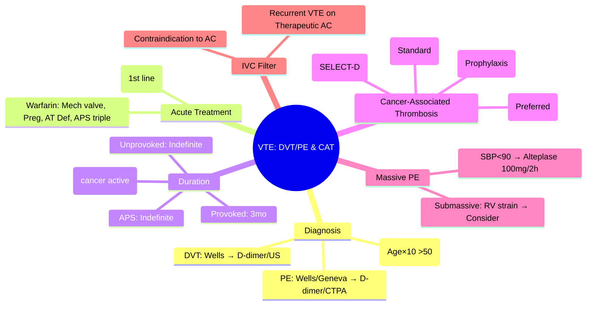

# DVT/PE & Cancer-Associated Thrombosis (CAT)

> [!info] **Davidson Ch 25 Alignment**: Bleeding and Thrombotic Disorders → Venous Thromboembolism
> **FCPS/MRCP Focus**: Wells/PE/Geneva scores, D-dimer rule-out, DOACs first-line VTE, CAT: LMWH preferred (CLOT, SELECT-D, CARAVAGGIO), duration, IVC filter, massive PE thrombolysis

---

## 🎯 Learning Objectives

- [ ] Apply **Clinical Probability Scores**: **Wells DVT**, **Wells PE**, **Geneva PE** for pre-test probability
- [ ] Use **D-dimer** with **age-adjusted cut-off** (Age × 10 μg/L if >50) to rule out low-probability VTE
- [ ] Diagnose: **Compression US** (DVT), **CTPA** (PE), **V/Q Scan** (renal/contrast allergy)
- [ ] Treat **VTE**: **DOACs first-line** (Rivaroxaban/Apixaban); **Warfarin** if mechanical valves/pregnancy/AT def
- [ ] Manage **Cancer-Associated Thrombosis (CAT)**: **LMWH preferred** (CLOT trial) – **DOACs non-inferior but ↑ bleeding in GI/GU** (SELECT-D, CARAVAGGIO)
- [ ] Determine **Duration**: Provoked (3mo), Unprovoked (indefinite), CAT (indefinite while cancer active)
- [ ] Manage **Massive PE**: **Thrombolysis** (Alteplase 100mg IV) if haemodynamically unstable; **Surgical embolectomy** if contraindicated
- [ ] **IVC Filter** indications: Contraindication to anticoagulation, recurrent VTE on therapeutic anticoagulation

---

## 📖 VTE Diagnosis – Clinical Probability Scores

### Wells DVT Score

| Feature | Points |
|---------|--------|
| Active cancer (treatment ≤6mo/palliative) | 1 |
| Paralysis/paresis/immobilisation >3d | 1 |
| Recently bedridden >3d / surgery ≤4wks | 1 |
| Localised tenderness along deep veins | 1 |
| Entire leg swollen | 1 |
| Calf swelling >3cm (vs asymptomatic) | 1 |
| Pitting oedema (symptomatic leg) | 1 |
| Collateral superficial veins | 1 |
| Alternative diagnosis as likely or greater | **-2** |

| Score | Probability | Action |
|-------|-------------|--------|
| **≤0** | Low (~5%) | **D-dimer** (if neg → DVT excluded) |
| **1-2** | Moderate (~17%) | **D-dimer** (if neg → excluded) / **US** |
| **≥3** | High (~75%) | **Direct to US** (D-dimer not useful) |

### Wells PE Score

| Feature | Points |
|---------|--------|
| Clinical signs of DVT | 3 |
| PE #1 diagnosis / equally likely | 3 |
| HR >100 | 1.5 |
| Immobilisation >3d / surgery ≤4wks | 1.5 |
| Previous DVT/PE | 1.5 |
| Haemoptysis | 1 |
| Cancer (treatment ≤6mo/palliative) | 1 |

| Score (Traditional) | Probability | Simplified (PE likely/unlikely) |
|---------------------|-------------|----------------------------------|
| **>6** | High | **PE Likely (>4)** |
| **2-6** | Moderate | |
| **<2** | Low | **PE Unlikely (≤4)** |

### Geneva PE Score (Revised)

| Feature | Points |
|---------|--------|
| Age >65 | 1 |
| Previous DVT/PE | 2 |
| Surgery/Immobilisation ≤1mo | 2 |
| Active cancer | 2 |
| Unilateral leg pain | 3 |
| Haemoptysis | 2 |
| HR 75-94 / ≥95 | 3 / 5 |
| Pain on leg palpation | 4 |

**Low 0-3, Intermediate 4-10, High ≥11**

---

## 🔬 D-dimer & Imaging

### D-dimer Strategy

| Pre-test Probability | D-dimer Cut-off | Action if Negative |
|----------------------|-----------------|---------------------|
| **Low/Unlikely** | **Age-adjusted** (Age × 10 μg/L if >50) | **VTE Excluded** |
| **Moderate/Intermediate** | Standard (500 μg/L) | **VTE Excluded** |
| **High/Likely** | **NOT useful** | **Direct to Imaging** |

> [!tip] **Age-adjusted D-dimer**: **Age × 10 μg/L** for patients >50 years (increases specificity, maintains sensitivity)

### Imaging

| Condition | First-line | Alternative |
|-----------|------------|-------------|
| **DVT** | **Compression US** (proximal veins) | Repeat US in 1 week if initial neg + high prob |
| **PE** | **CTPA** | **V/Q Scan** (renal failure, contrast allergy, pregnancy) |
| **Pregnancy** | **Compression US** (if DVT symptoms) → **V/Q or CTPA** (low dose) | |

---

## 💊 VTE Treatment

### Acute Phase (First 5-21 days)

| Drug | Regimen |
|------|---------|
| **Rivaroxaban** | **15 mg BD × 21 days** → 20 mg OD |
| **Apixaban** | **10 mg BD × 7 days** → 5 mg BD |
| **Dabigatran** | **Heparin/LMWH 5d overlap** → 150 mg BD |
| **Edoxaban** | **Heparin/LMWH 5d overlap** → 60 mg OD |
| **Warfarin** | **LMWH overlap ≥5d + INR 2-3** |

> [!tip] **DOACs = First-line for VTE** (no monitoring, fixed dose, less bleeding than warfarin). **Warfarin if**: Mechanical valves, Pregnancy, AT Deficiency, APS (triple positive), Severe renal failure (CrCl <15-30).

### Duration of Anticoagulation

| Scenario | Duration |
|----------|----------|
| **Provoked VTE** (surgery, trauma, immobilisation, OCP, pregnancy) | **3 months** |
| **Unprovoked VTE** | **Indefinite** (if bleeding risk low; reassess annually) |
| **Cancer-Associated (CAT)** | **Indefinite while cancer active** |
| **Antiphospholipid Syndrome** | **Indefinite** (INR 3-4 if arterial/triple positive) |
| **Recurrent VTE** | **Indefinite** |
| **Protein C/S/AT Deficiency** | **Indefinite** (if unprovoked) |

---

## 🦠 Cancer-Associated Thrombosis (CAT)

### Epidemiology & Risk

| Factor | VTE Risk |
|--------|----------|
| **Cancer Type** | **Pancreas, Brain, Stomach, Lung, Ovary, Kidney, Lymphoma** > Breast, Prostate |
| **Stage** | **Metastatic > Localised** |
| **Treatment** | **Chemotherapy, Surgery, Hormonal (Tamoxifen), Anti-angiogenic (Bevacizumab), Immunotherapy** |
| **Biomarkers** | **D-dimer ↑, Platelets ↑, Leukocytosis, Low albumin, High CRP** |

### Khorana Score (Risk Stratification for Prophylaxis)

| Variable | Points |
|----------|--------|
| **Site**: Pancreas/Stomach | 2 |
| **Site**: Lung/Lymphoma/Gynae/Bladder/Testis | 1 |
| **Pre-chemo Platelets ≥350** | 1 |
| **Hb <10 g/dL or ESA use** | 1 |
| **Pre-chemo Leukocytes >11** | 1 |
| **BMI ≥35** | 1 |

| Score | Risk | Prophylaxis |
|-------|------|-------------|
| **0** | Low | None |
| **1-2** | Intermediate | Consider (outpatient chemo) |
| **≥3** | High | **Prophylactic LMWH/DOAC** (AVERT, CASSINI trials) |

### Treatment of Established CAT

| Agent | Evidence | Preferred In |
|-------|----------|--------------|
| **LMWH (Dalteparin/Tinzaparin/Enoxaparin)** | **CLOT Trial** (Dalteparin vs Warfarin: ↓ recurrent VTE, no ↑ bleed) | **Historical gold standard** |
| **Rivaroxaban (15mg BD×21d→20mg OD)** | **SELECT-D** (Non-inferior for VTE, ↑ major bleed in GI/GU) | **Non-GI/GU cancers** |
| **Apixaban (10mg BD×7d→5mg BD)** | **CARAVAGGIO** (Non-inferior, **less bleeding** than LMWH) | **All cancers (preferred DOAC)** |
| **Edoxaban** | **Hokusai-Cancer** (Non-inferior, ↑ bleeding) | Alternative |

> [!tip] **FCPS/MRCP**: **LMWH = Historical standard (CLOT)**. **DOACs non-inferior**: **Apixaban preferred (CARAVAGGIO - less bleed)**; **Avoid DOACs in GI/GU cancers** (↑ bleed). **Duration = Indefinite while cancer active**.

### Special Considerations in CAT

| Issue | Management |
|-------|------------|
| **Thrombocytopenia (Plt <50)** | **Dose-reduce LMWH** (50% if 25-50; hold if <25); **DOACs avoid if <50** |
| **Renal Impairment** | **LMWH dose-adjust**; **DOACs dose-adjust/avoid if CrCl <15-30** |
| **GI/GU Cancers** | **LMWH preferred** (DOACs ↑ major bleed) |
| **Brain Tumours** | **LMWH** (DOACs ↑ intracranial bleed risk) |
| **Recurrent VTE on LMWH** | **Increase LMWH 20-25%** or **Switch to DOAC** |
| **Recurrent VTE on DOAC** | **Switch to LMWH** |

---

## 💡 Massive PE & IVC Filter

### Massive PE Definition & Treatment

| Definition | **Haemodynamic instability**: SBP <90 mmHg or drop >40 mmHg for >15 min, **NOT due to other causes** |
|------------|----------------------------------------------------------------------------------------------------------|
| **Thrombolysis** | **Alteplase 100 mg IV over 2 hours** (or 10mg bolus + 90mg over 90min) |
| **Indications** | **Massive PE** (hemodynamic instability) |
| **Contraindications** | Active bleed, recent surgery/stroke, intracranial pathology, aortic dissection |
| **Alternative** | **Surgical embolectomy** / **Catheter-directed thrombolysis** / **Mechanical thrombectomy** |
| **Submassive PE** | RV dysfunction + Troponin/BNP ↑ → **Consider thrombolysis** (PEITHO trial: ↓ haemodynamic collapse, ↑ bleed) |

### IVC Filter Indications

| Indication | Details |
|------------|---------|
| **Contraindication to Anticoagulation** | Active bleed, recent neurosurgery, high bleed risk |
| **Recurrent VTE on Therapeutic Anticoagulation** | Confirmed adherence + therapeutic levels |
| **Massive PE with Contraindication to Thrombolysis** | Bridge to anticoagulation |
| **NOT for** | Primary prophylaxis, routine CAT, transient risk factors |

> [!warning] **IVC Filter = Temporary** (prefer retrievable); **Complications**: Filter thrombosis, migration, perforation, IVC occlusion, DVT recurrence ↑

---

## 🔄 Differential Diagnosis

| Condition | Distinguishing Features |
|-----------|------------------------|
| **Cellulitis/Erysipelas** | Unilateral leg swelling + erythema + warmth + fever; **US negative** |
| **Baker's Cyst Rupture** | Calf swelling, crescent sign on US; **US shows cyst, no DVT** |
| **Superficial Thrombophlebitis** | Palpable cord, erythema along superficial vein; **US confirms** |
| **Muscle Haematoma/Tear** | Trauma history, localised pain; **US shows haematoma** |
| **Lymphoedema** | Chronic, non-pitting, no acute onset; **Lymphoscintigraphy** |
| **Pneumonia/Heart Failure (Dyspnoea)** | **CXR, BNP, Echo**; **CTPA if PE suspected** |

---

## 💡 FCPS/MRCP High-Yield Summary

| Topic | Key Point |
|-------|-----------|
| **DVT Probability** | **Wells Score**: Low/Moderate → D-dimer; High → US |
| **PE Probability** | **Wells/Geneva**: Unlikely → D-dimer; Likely → CTPA |
| **D-dimer** | **Age-adjusted** (Age × 10 if >50) for Low/Moderate prob |
| **First-line VTE Treatment** | **DOACs** (Rivaroxaban/Apixaban) – no LMWH overlap needed |
| **Warfarin Indications** | Mechanical valves, Pregnancy, AT Def, APS triple positive, CrCl <15-30 |
| **Duration** | Provoked 3mo; **Unprovoked/CAT/APS = Indefinite** |
| **CAT Treatment** | **LMWH standard (CLOT)**; **Apixaban preferred DOAC (CARAVAGGIO)**; Avoid DOACs in GI/GU (SELECT-D) |
| **CAT Duration** | **Indefinite while cancer active** |
| **Massive PE** | **Alteplase 100mg IV 2h** (haemodynamic instability) |
| **IVC Filter** | Anticoagulation contraindicated OR Recurrent VTE on therapeutic AC |

---

## ❓ Viva Questions

1. **What is the Wells DVT score and how does it guide imaging?**
   - ≤0 Low → D-dimer (if neg exclude); 1-2 Moderate → D-dimer/US; ≥3 High → Direct US

2. **How does age-adjusted D-dimer improve VTE exclusion?**
   - **Cut-off = Age × 10 μg/L (if >50)** – increases specificity without losing sensitivity

3. **What are the first-line treatments for acute VTE and their dosing?**
   - **Rivaroxaban 15mg BD×21d→20mg OD**; **Apixaban 10mg BD×7d→5mg BD**; (No heparin overlap needed)

4. **When is warfarin preferred over DOACs for VTE?**
   - Mechanical valves, Pregnancy, AT Deficiency, APS triple positive, Severe renal impairment (CrCl <15-30)

5. **What is the recommended duration for provoked vs unprovoked VTE?**
   - **Provoked: 3 months**; **Unprovoked: Indefinite** (if bleed risk low)

6. **What is the standard treatment for Cancer-Associated Thrombosis (CAT)?**
   - **LMWH (CLOT trial)**; **DOACs non-inferior**: **Apixaban preferred (CARAVAGGIO)**; **Avoid DOACs in GI/GU cancers** (↑ bleed)

7. **How long should anticoagulation continue in CAT?**
   - **Indefinite while cancer active**

8. **What is the definition and treatment of Massive PE?**
   - **Haemodynamic instability** (SBP<90); **Alteplase 100mg IV over 2h**

9. **When is an IVC filter indicated?**
   - **Contraindication to anticoagulation** OR **Recurrent VTE on therapeutic anticoagulation**

10. **Differentiate the bleeding risk of DOACs vs LMWH in GI/GU cancers.**
    - **SELECT-D**: Rivaroxaban ↑ major bleed in GI/GU; **CARAVAGGIO**: Apixaban similar bleed to LMWH (preferred if DOAC needed)

---

## 🧠 Confusions & Mnemonics

| Confusion | Clarification |
|-----------|---------------|
| **Wells DVT vs PE** | **DVT: Alternative diagnosis -2**; **PE: PE #1 diagnosis +3** |
| **D-dimer Cutoffs** | **Standard 500**; **Age-adjusted = Age×10 (if >50)** |
| **DOACs in CAT** | **Apixaban preferred (CARAVAGGIO)**; **Avoid in GI/GU (SELECT-D)** |
| **Duration: Provoked vs Unprovoked** | **Provoked = 3mo**; **Unprovoked/CAT = Indefinite** |
| **Massive vs Submassive PE** | **Massive = Haemodynamic instability → Thrombolysis**; **Submassive = RV strain → Consider** |

| Mnemonic | Meaning |
|----------|---------|
| **"Wells DVT: Alt Dx = -2"** | Wells DVT scoring |
| **"D-dimer: Age×10 if >50"** | Age-adjusted cut-off |
| **"DOACs = 1st Line VTE"** | First-line treatment |
| **"CAT = LMWH (CLOT) / Apixaban (CARAVAGGIO)"** | Cancer thrombosis |
| **"Indefinite = Unprovoked + CAT + APS"** | Duration rules |
| **"Massive PE = SBP<90 = Alteplase 100mg"** | Massive PE treatment |
| **"IVC Filter = No AC or Recurrent on AC"** | IVC filter indications |

---

## 🗺️ Mind Map

---

## 📋 One-Page Revision Card

| **VTE & CAT – FCPS/MRCP REVISION CARD** |
|------------------------------------------|
| **DVT Dx**: Wells ≤0 Low → D-dimer; 1-2 Mod → D-dimer/US; ≥3 High → US |
| **PE Dx**: Wells/Geneva Unlikely → D-dimer; Likely → CTPA |
| **D-dimer**: **Age-adjusted = Age×10 (if >50)** |
| **Rx**: **DOACs 1st line** (Riva 15mg BD×21d→20mg; Apixa 10mg BD×7d→5mg) |
| **Warfarin**: Mech valve, Preg, AT Def, APS triple, CrCl<15 |
| **Duration**: **Provoked 3mo; Unprovoked/CAT/APS Indefinite** |
| **CAT**: **LMWH (CLOT)**; **Apixaban (CARAVAGGIO)**; **No DOAC in GI/GU** |
| **Massive PE**: **SBP<90 → Alteplase 100mg/2h** |
| **IVC Filter**: Contraindication to AC / Recurrent VTE on AC |

---

## 📅 Spaced Repetition Tracker

| Review | Date | Score (1-5) | Next Review |
|--------|------|-------------|-------------|
| Day 1 | 2025-06-16 | | 2025-06-17 |
| Day 3 | | | |
| Day 7 | | | |
| Day 15 | | | |
| Day 30 | | | |

---

## 🎯 Must Know / Should Know / Nice to Know

| Level | Content |
|-------|---------|
| **Must Know** | Wells scores (DVT/PE), age-adjusted D-dimer, DOACs first-line (dosing), warfarin indications, duration rules (3mo provoked, indefinite unprovoked/CAT), CAT: LMWH/Apixaban, avoid DOAC GI/GU, massive PE thrombolysis, IVC filter indications |
| **Should Know** | Geneva score, V/Q scan indications, extended prophylaxis (avert/cassini), Khorana score details, CARAVAGGIO/SELECT-D/Hokusai-Cancer trial details, submassive PE management (PEITHO), catheter-directed therapy, IVC filter complications, VTE in pregnancy (LMWH throughout), recurrent VTE management |
| **Nice to Know** | Age-adjusted D-dimer validation studies (ADJUST-PE), DOAC reversal agents (andexanet, idarucizumab), LMWH monitoring (anti-Xa), cancer-specific VTE risks (pancreas/brain highest), biomarkers (D-dimer, P-selectin, microparticles), VTE risk scores in hospitalised medically ill (IMPROVE, Padua), cost-effectiveness, paediatric VTE, unusual site thrombosis (splanchnic, cerebral sinus) |

---

## ✅ Self-Test Scorecard

| Section | Score (0-10) | Notes |
|---------|--------------|-------|
| Clinical Probability Scores | | |
| D-dimer & Imaging | | |
| DOAC Dosing & Warfarin Indications | | |
| Duration Rules | | |
| CAT Management | | |
| Massive PE & IVC Filter | | |
| Viva Questions | | |

---

## 🔗 Local Navigation

- **Previous**: [[Factor V Leiden & Thrombophilia]]
- **Next**: [[MGUS]]
- **Section Hub**: [[Bleeding and Thrombotic Disorders]]
- **MOC**: [[Hematology MOC]]
- **Template**: [[../Templates/Hematology Topic Template]]

---

*Generated for FCPS/MRCP exam preparation. Based on Davidson Medicine 24th Ed Chapter 25.*
---

> Auto-generated study sections for "Hematology" — Ch 24: Haematology & Transfusion Medicine.

## Flashcards (27 generated)

- Q: What is the definition of Hematology?
  A: [!info] Davidson Ch 25 Alignment: Bleeding and Thrombotic Disorders → Venous Thromboembolism
- Q: What is Rivaroxaban of Hematology?
  A: 15 mg BD × 21 days → 20 mg OD
- Q: What is Apixaban of Hematology?
  A: 10 mg BD × 7 days → 5 mg BD
- Q: What is Dabigatran of Hematology?
  A: Heparin/LMWH 5d overlap → 150 mg BD
- Q: What is Edoxaban of Hematology?
  A: Heparin/LMWH 5d overlap → 60 mg OD
- Q: What is Warfarin of Hematology?
  A: LMWH overlap ≥5d + INR 2-3
- Q: What is Hematology indicated for?
  A: Active bleed, recent neurosurgery, high bleed risk
- Q: What is Recurrent VTE on Therapeutic Anticoagulation of Hematology?
  A: Confirmed adherence + therapeutic levels
- Q: What is NOT for of Hematology?
  A: Primary prophylaxis, routine CAT, transient risk factors
- Q: What is Rivaroxaban of Hematology?
  A: 15 mg BD × 21 days → 20 mg OD
- Q: What is Apixaban of Hematology?
  A: 10 mg BD × 7 days → 5 mg BD
- Q: What is Dabigatran of Hematology?
  A: Heparin/LMWH 5d overlap → 150 mg BD
- Q: What is Edoxaban of Hematology?
  A: Heparin/LMWH 5d overlap → 60 mg OD
- Q: What is Warfarin of Hematology?
  A: LMWH overlap ≥5d + INR 2-3
- Q: What is Hematology indicated for?
  A: Active bleed, recent neurosurgery, high bleed risk
- Q: What is Recurrent VTE on Therapeutic Anticoagulation of Hematology?
  A: Confirmed adherence + therapeutic levels
- Q: What is NOT for of Hematology?
  A: Primary prophylaxis, routine CAT, transient risk factors
- Q: What is DVT Probability of Hematology?
  A: Wells Score: Low/Moderate → D-dimer; High → US
- Q: What is PE Probability of Hematology?
  A: Wells/Geneva: Unlikely → D-dimer; Likely → CTPA
- Q: What is D-dimer of Hematology?
  A: Age-adjusted (Age × 10 if >50) for Low/Moderate prob
- Q: What is the first-line treatment for Hematology?
  A: DOACs (Rivaroxaban/Apixaban) – no LMWH overlap needed
- Q: What is Hematology indicated for?
  A: Mechanical valves, Pregnancy, AT Def, APS triple positive, CrCl <15-30
- Q: What is Duration of Hematology?
  A: Provoked 3mo; Unprovoked/CAT/APS = Indefinite
- Q: How is Hematology managed?
  A: LMWH standard (CLOT); Apixaban preferred DOAC (CARAVAGGIO); Avoid DOACs in GI/GU (SELECT-D)
- Q: What is CAT Duration of Hematology?
  A: Indefinite while cancer active
- Q: What is Massive PE of Hematology?
  A: Alteplase 100mg IV 2h (haemodynamic instability)
- Q: What is IVC Filter of Hematology?
  A: Anticoagulation contraindicated OR Recurrent VTE on therapeutic AC

## MCQs (1 generated)

1. **Which of the following best describes Hematology?**
   A. **[!info] Davidson Ch 25 Alignment: Bleeding and Thrombotic Disorders → Venous Thromboembolism**
   B. An unrelated condition not matching the clinical picture of Hematology
   C. A complication seen late in the disease course of Hematology
   D. A condition that mimics Hematology but has a different underlying cause

## SBA Questions (1 generated)

1. A patient with suspected Hematology presents with: Active cancer (treatment ≤6mo/palliative) — 1; Paralysis/paresis/immobilisation >3d — 1; Recently bedridden >3d / surgery ≤4wks — 1. What is the most likely diagnosis?
   A. **Hematology**
   B. A condition that mimics Hematology but is not the same entity
   C. A complication of Hematology rather than the primary diagnosis
   D. An unrelated condition in the same clinical category as Hematology

## PasTest Scenario SBAs (Clinical Vignettes)

> **Auto-generated PasTest/Mediscope-style scenario SBAs** grounded in the authored source. Each scenario tests a real clinical fact (triad, specific sign, contraindication, trial, first-line Rx) extracted from the topic. *Source: Ch 24: Haematology — DVT PE & Cancer-associated Thrombosis*

**Q1.** Which landmark clinical trial provided evidence relevant to the management of DVT PE & Cancer-associated Thrombosis (specifically: CAT

| Agent | Evidence | Preferred In |
|-------|----------|--------------|
| **LMWH (Dalteparin/Tinzaparin/Enoxaparin))?

  - **A.** CASSINI trial
  - **B.** A different but related trial in the same area
  - **C.** A guideline (not a trial) addressing the same question
  - **D.** An observational/cohort study addressing similar outcomes

  > **Answer: A** — CASSINI trial
  >
  > *Source:* | Intermediate | Consider (outpatient chemo) |
| **≥3** | High | **Prophylactic LMWH/DOAC** (AVERT, CASSINI trials) |

### Treatment of Established CAT

| Agent | Evidence | Preferred In |
|-------|--

**Q2.** What is the most appropriate first-line therapy for DVT PE & Cancer-associated Thrombosis?

  - **A.** Warfarin + LMWH overlap ≥5d + INR + DOACs = First-line for VTE
  - **B.** An advanced/surgical therapy reserved for refractory disease
  - **C.** Symptomatic treatment only, no disease-modifying therapy
  - **D.** Empiric broad-spectrum therapy without specific indication

  > **Answer: A** — Warfarin + LMWH overlap ≥5d + INR + DOACs = First-line for VTE
  >
  > *Source:* **Warfarin**   **LMWH overlap ≥5d + INR 2-3**  

> [!tip] **DOACs = First-line for VTE** (no monitoring, fixed dose, less bleeding than warfarin).

