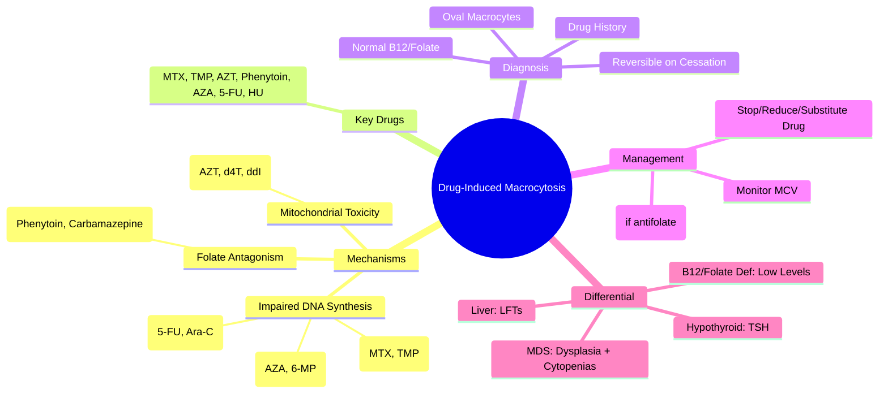

# Drug-Induced Macrocytosis

> [!info] **Davidson Ch 25 Alignment**: Anaemia and Red Cell Disorders → Macrocytic Anaemia → Drug-Induced
> **FCPS/MRCP Focus**: Common culprit drugs, mechanisms (DNA synthesis vs RNA), differentiation from B12/Folate deficiency, reversibility

---

## 🎯 Learning Objectives

- [ ] Identify **Common Drugs** causing macrocytosis: **Antimetabolites**, **Antiretrovirals**, **Anticonvulsants**, **Immunosuppressants**
- [ ] Explain **Mechanisms**: **Impaired DNA synthesis** (thymidylate synthase inhibition) vs **Altered lipid membrane**
- [ ] Differentiate from **B12/Folate Deficiency**: **Normal B12/Folate levels**, **No neurological features**, **Reversible on drug cessation**
- [ ] Apply **Diagnostic Approach**: Drug history → Exclude B12/Folate → Check MCV trend → Trial drug withdrawal
- [ ] Manage: **Dose reduction**, **Drug substitution**, **Folate supplementation** (if antifolate), **Monitor MCV**

---

## 📖 Common Culprit Drugs

| Drug Class | Specific Drugs | Mechanism |
|------------|----------------|-----------|
| **Antimetabolites (Antifolates)** | **Methotrexate**, **Trimethoprim**, **Pyrimethamine**, **Sulfasalazine**, **Pentamidine** | **DHFR inhibition** → ↓ Tetrahydrofolate → Impaired DNA synthesis |
| **Purine Analogues** | **Azathioprine**, **6-Mercaptopurine**, **Cladribine**, **Fludarabine** | Inhibit purine synthesis → Impaired DNA synthesis |
| **Pyrimidine Analogues** | **5-Fluorouracil**, **Cytarabine**, **Gemcitabine** | Inhibit thymidylate synthase / DNA polymerase |
| **Antiretrovirals (NRTIs)** | **Zidovudine (AZT)**, **Stavudine**, **Didanosine**, **Abacavir** | **Inhibit mitochondrial DNA polymerase γ** → Mitochondrial toxicity |
| **Anticonvulsants** | **Phenytoin**, **Carbamazepine**, **Valproate**, **Phenobarbital** | **Folate antagonism**, **Enzyme induction** → ↑ Folate catabolism |
| **Immunosuppressants** | **Mycophenolate mofetil**, **Leflunomide**, **Sirolimus** | Inhibit IMPDH / mTOR → Impaired lymphocyte proliferation |
| **Alcohol** | Chronic ethanol | **Direct toxicity** + **Folate deficiency** + **Liver disease** |
| **Other** | **Hydroxyurea**, **Omeprazole** (long-term), **Colchicine** | Various (DNA synthesis inhibition, B12 malabsorption) |

---

## ⚙️ Mechanisms of Drug-Induced Macrocytosis

```mermaid
flowchart TD
    A[Drug Exposure] --> B{Mechanism}
    B -->|Antifolates / Purine Analogues / Pyrimidine Analogues| C[**Impaired DNA Synthesis**]
    C --> D[↓ Thymidylate Synthesis]
    D --> E[↓ dTMP → ↓ DNA Replication]
    E --> F[Nuclear-Cytoplasmic Asynchrony]
    F --> G[Macrocytosis (Oval Macrocytes)]
    
    B -->|NRTIs| H[**Mitochondrial Toxicity**]
    H --> I[Inhibit DNA Polymerase γ]
    I --> J[↓ mtDNA Replication]
    J --> K[Mitochondrial Dysfunction]
    K --> L[Macrocytosis + Lactic Acidosis]
    
    B -->|Anticonvulsants| M[**Folate Antagonism / Enzyme Induction**]
    M --> N[↓ Folate Levels]
    N --> O[Functional Folate Deficiency]
```

---

## 🔬 Diagnostic Workup

```mermaid
flowchart TD
    A[Macrocytosis (MCV >100 fL)] --> B[**Detailed Drug History** (Prescription + OTC + Alcohol)]
    B --> C{**Known Macrocytosis Drug?**}
    C -->|Yes| D[**Check MCV Trend** (Pre-drug baseline if available)]
    C -->|No| E[**Standard Macrocytosis Workup**]
    D --> F[**Serum B12, Folate, RBC Folate**]
    F --> G{**Normal B12/Folate?**}
    G -->|Yes| H[**Drug-Induced Macrocytosis Likely**]
    G -->|No| I[**Treat B12/Folate Deficiency**]
    H --> J[**Trial Drug Cessation / Dose Reduction**]
    J --> K{**MCV Normalises in 2-3 months?**}
    K -->|Yes| L[**Confirmed Drug-Induced**]
    K -->|No| M[**Re-evaluate for Other Causes**]
```

### Key Laboratory Features

| Parameter | Drug-Induced | B12/Folate Deficiency |
|-----------|--------------|----------------------|
| **MCV** | ↑ (95-115 fL) | ↑↑ (often >115 fL) |
| **Blood Film** | **Oval macrocytes**, ± Hypersegmented neutrophils | **Oval macrocytes**, **Hypersegmented neutrophils** (≥6 lobes) |
| **B12/Folate** | **Normal** | **Low** |
| **Reticulocytes** | Normal/↓ | ↓ |
| **LDH/Bilirubin** | Normal | ↑ (ineffective erythropoiesis) |
| **RBC Volume** | ↓/Normal | ↓ |
| **Reversibility** | **Yes (2-3 months off drug)** | **Yes (with replacement)** |

---

## 💊 Management

### General Principles

| Step | Action |
|------|--------|
| **1. Identify Culprit** | Review **all medications** (prescribed, OTC, supplements, alcohol) |
| **2. Assess Necessity** | Can drug be **stopped, reduced, or substituted**? |
| **3. Folate Supplementation** | **Folic acid 5 mg daily** if on antifolates (MTX, TMP) |
| **4. Monitor** | **MCV q3mo** until normalisation |
| **4. Re-evaluate** | If persistent → **Re-consider other causes** |

### Drug-Specific Management

| Drug | Management |
|------|------------|
| **Methotrexate** | **Folic acid 5-10 mg weekly** (24-48h post-MTX); Consider dose reduction |
| **Trimethoprim/Sulfonamides** | **Folic acid 5 mg daily**; Alternative antibiotics if possible |
| **AZT/NRTIs** | **Switch to non-NRTI regimen** if severe; Monitor lactate |
| **Phenytoin/Carbamazepine** | **Folic acid 5 mg daily**; Consider newer AEDs (Levetiracetam, Lamotrigine) |
| **Azathioprine/6-MP** | Monitor MCV; Dose reduction if severe; Folic acid supplementation |
| **Hydroxyurea** | Expected macrocytosis (therapeutic marker); No folate needed |
| **Alcohol** | **Abstinence** + **Thiamine/B-complex** + **Folate** |

---

## 🔄 Differential Diagnosis

| Condition | MCV | B12/Folate | Key Differentiator |
|-----------|-----|------------|-------------------|
| **Drug-Induced** | ↑ | **Normal** | **Drug history**, Reversible on cessation |
| **B12 Deficiency** | ↑↑ | **Low B12** | Neurological signs, Low B12, ↑ MMA/Hcy |
| **Folate Deficiency** | ↑↑ | **Low Folate** | Dietary/absorption issues, Low RBC folate |
| **MDS** | ↑↑ | Normal | **Dysplasia**, Cytopenias, Cytogenetics |
| **Liver Disease** | ↑ | Normal | **Liver enzymes**, Clinical signs |
| **Hypothyroidism** | ↑ | Normal | **TSH ↑**, Clinical features |
| **Reticulocytosis** | ↑ | Normal | **Reticulocyte count ↑↑** |

---

## 💡 FCPS/MRCP High-Yield Summary

| Topic | Key Point |
|-------|-----------|
| **Common Drugs** | **MTX, TMP-SMX, AZT, Phenytoin, Azathioprine, 5-FU, Hydroxyurea** |
| **Mechanism** | **Impaired DNA synthesis** (Antifolates, Purine/Pyrimidine analogues) OR **Mitochondrial toxicity** (NRTIs) |
| **Blood Film** | **Oval macrocytes**, **Hypersegmented neutrophils** (if folate antagonism) |
| **B12/Folate** | **Normal** (distinguishes from nutritional deficiency) |
| **Reversibility** | **MCV normalises in 2-3 months** after drug cessation |
| **Management** | **Stop/reduce/substitute drug**; **Folic acid 5mg daily** if antifolate |
| **Folic Acid** | **5mg daily** with MTX/TMP; **5-10mg weekly** post-MTX dose |
| **MCV Trend** | **Baseline MCV helpful**; ↑ MCV correlates with drug duration/dose |

---

## ❓ Viva Questions

1. **Which drugs commonly cause macrocytosis and what are their mechanisms?**
   - **Antifolates (MTX, TMP)**: DHFR inhibition → ↓ THF
   - **Purine analogues (AZA, 6-MP)**: Impaired purine synthesis
   - **Pyrimidine analogues (5-FU, Ara-C)**: Thymidylate synthase inhibition
   - **NRTIs (AZT)**: Mitochondrial DNA polymerase γ inhibition
   - **Anticonvulsants**: Folate antagonism + enzyme induction

2. **How do you differentiate drug-induced macrocytosis from B12/folate deficiency?**
   - **Drug-induced: Normal B12/Folate, drug history, reversible**
   - **B12/Folate deficiency: Low B12/Folate, neurological signs (B12), hypersegmented neutrophils**

3. **What is the role of folic acid supplementation in methotrexate-induced macrocytosis?**
   - **Folic acid 5-10mg weekly** (24-48h post-MTX dose) reduces toxicity without compromising efficacy

4. **Which antiretrovirals cause macrocytosis and why?**
   - **NRTIs (AZT, Stavudine, Didanosine)** → Inhibit mitochondrial DNA polymerase γ → Mitochondrial toxicity

5. **How long does it take for MCV to normalise after stopping the offending drug?**
   - **2-3 months** (RBC lifespan ~120 days)

6. **Does hydroxyurea cause macrocytosis and is it harmful?**
   - **Yes, expected** (therapeutic marker of adequacy); Not harmful, no folate needed

7. **What is the management of macrocytosis due to anticonvulsants?**
   - **Folic acid 5mg daily**; Consider switching to newer AEDs (Levetiracetam, Lamotrigine)

8. **Can macrocytosis be the only manifestation of MDS?**
   - Yes, but **dysplasia on blood film/BM**, **cytopenias**, **cytogenetics** should be sought

9. **Does oral contraceptive pill cause macrocytosis?**
   - **Mild macrocytosis** can occur (oestrogen effect); Usually MCV 100-105 fL, benign

10. **When should you suspect drug-induced macrocytosis vs primary haematological disorder?**
    - **Drug history + Normal B12/Folate + No other cytopenias + Reversibility on drug cessation**

---

## 🧠 Confusions & Mnemonics

| Confusion | Clarification |
|-----------|---------------|
| **Drug vs B12/Folate** | **Drug = Normal B12/Folate**; **Deficiency = Low B12/Folate** |
| **Drug vs MDS** | **Drug = Reversible, Single lineage (usually)**; **MDS = Dysplasia, Cytopenias, Cytogenetics** |
| **Macrocytosis = Anaemia?** | **Not always** - Many drugs cause macrocytosis **without anaemia** |
| **MTX Macrocytosis** | **Expected** - Marker of therapeutic effect; **Folate prevents without reducing efficacy** |
| **AZT Macrocytosis** | **Mitochondrial toxicity** - Can cause lactic acidosis, myopathy |

| Mnemonic | Meaning |
|----------|---------|
| **"MATT-HAZ" = MTX, Azathioprine, TMP, Tretinoin, Hydroxyurea, AZT, Zidovudine** | Drug culprits |
| **"DNA Drugs = Macrocytosis"** | Impaired DNA synthesis |
| **"Normal B12/Folate = Think Drugs"** | Exclusion diagnosis |
| **"Reversible in 3 Months"** | Drug-induced |
| **"Folate with MTX = Safety"** | Folic acid supplementation |

---

## 🗺️ Mind Map



---

## 📋 One-Page Revision Card

| **DRUG-INDUCED MACROCYTOSIS – FCPS/MRCP REVISION CARD** |
|----------------------------------------------------------|
| **Drugs**: MTX, TMP, AZT, Phenytoin, AZA, 5-FU, HU, NRTIs |
| **Mechanism**: **Impaired DNA synthesis** (Antifolates, Analogues) OR **Mitochondrial toxicity** (NRTIs) |
| **Labs**: **MCV ↑, Normal B12/Folate**, Oval macrocytes, Hypersegmented neutrophils |
| **Reversibility**: **MCV normalises in 2-3 months** off drug |
| **Management**: **Stop/Reduce/Substitute drug**; **Folic acid 5mg daily** (if antifolate) |
| **MTX**: **Folic acid 5-10mg weekly** (24-48h post-dose) |
| **AZT**: Switch to non-NRTI if severe |
| **Differential**: B12/Folate deficiency (Low levels), MDS (Dysplasia), Liver (LFTs) |

---

## 📅 Spaced Repetition Tracker

| Review | Date | Score (1-5) | Next Review |
|--------|------|-------------|-------------|
| Day 1 | 2025-06-17 | | 2025-06-18 |
| Day 3 | | | |
| Day 7 | | | |
| Day 15 | | | |
| Day 30 | | | |

---

## 🎯 Must Know / Should Know / Nice to Know

| Level | Content |
|-------|---------|
| **Must Know** | Common drugs (MTX, TMP, AZT, Phenytoin, AZA, NRTIs), Mechanisms (DNA synthesis vs mitochondrial), Normal B12/Folate, Reversibility, Folate supplementation with antifolates, Differential from B12/folate deficiency/MDS |
| **Should Know** | Specific drug management (MTX folate timing, AZT switch), Hydroxyurea macrocytosis as therapeutic marker, Anticonvulsant folate antagonism, NRTI mitochondrial toxicity, MCV monitoring timeline, Alcohol + drug synergy |
| **Nice to Know** | Molecular mechanisms (DHFR inhibition, TS inhibition, Pol γ inhibition), Pharmacogenomics (MTHFR, TPMT), Drug interactions (TMP-SMX + MTX), Rare drugs (pyrimethamine, pentamidine), Paediatric considerations, Cost-effectiveness of folate prophylaxis |

---

## ✅ Self-Test Scorecard

| Section | Score (0-10) | Notes |
|---------|--------------|-------|
| Drug List & Mechanisms | | |
| Diagnostic Differentiation | | |
| Management Strategies | | |
| Drug-Specific Protocols | | |
| Viva Questions | | |

---

## 🔗 Local Navigation

- **Previous**: [[Lead Poisoning]]
- **Next**: [[Liver Disease & Alcohol Macrocytosis]]
- **Section Hub**: [[Anaemia and Red Cell Disorders]]
- **MOC**: [[Hematology MOC]]
- **Template**: [[../Templates/Hematology Topic Template]]

---

*Generated for FCPS/MRCP exam preparation. Based on Davidson Medicine 24th Ed Chapter 25.*
---

> Auto-generated study sections for "Hematology" — Ch 24: Haematology & Transfusion Medicine.

## Flashcards (23 generated)

- Q: What is the definition of Hematology?
  A: [!info] Davidson Ch 25 Alignment: Anaemia and Red Cell Disorders → Macrocytic Anaemia → Drug-Induced
- Q: What is Methotrexate of Hematology?
  A: Folic acid 5-10 mg weekly (24-48h post-MTX); Consider dose reduction
- Q: What is Trimethoprim/Sulfonamides of Hematology?
  A: Folic acid 5 mg daily; Alternative antibiotics if possible
- Q: What is AZT/NRTIs of Hematology?
  A: Switch to non-NRTI regimen if severe; Monitor lactate
- Q: What is Phenytoin/Carbamazepine of Hematology?
  A: Folic acid 5 mg daily; Consider newer AEDs (Levetiracetam, Lamotrigine)
- Q: What is Azathioprine/6-MP of Hematology?
  A: Monitor MCV; Dose reduction if severe; Folic acid supplementation
- Q: What is Hydroxyurea of Hematology?
  A: Expected macrocytosis (therapeutic marker); No folate needed
- Q: What is Alcohol of Hematology?
  A: Abstinence + Thiamine/B-complex + Folate
- Q: What is Methotrexate of Hematology?
  A: Folic acid 5-10 mg weekly (24-48h post-MTX); Consider dose reduction
- Q: What is Trimethoprim/Sulfonamides of Hematology?
  A: Folic acid 5 mg daily; Alternative antibiotics if possible
- Q: What is AZT/NRTIs of Hematology?
  A: Switch to non-NRTI regimen if severe; Monitor lactate
- Q: What is Phenytoin/Carbamazepine of Hematology?
  A: Folic acid 5 mg daily; Consider newer AEDs (Levetiracetam, Lamotrigine)
- Q: What is Azathioprine/6-MP of Hematology?
  A: Monitor MCV; Dose reduction if severe; Folic acid supplementation
- Q: What is Hydroxyurea of Hematology?
  A: Expected macrocytosis (therapeutic marker); No folate needed
- Q: What is Alcohol of Hematology?
  A: Abstinence + Thiamine/B-complex + Folate
- Q: What is Common Drugs of Hematology?
  A: MTX, TMP-SMX, AZT, Phenytoin, Azathioprine, 5-FU, Hydroxyurea
- Q: What is the mechanism of Hematology?
  A: Impaired DNA synthesis (Antifolates, Purine/Pyrimidine analogues) OR Mitochondrial toxicity (NRTIs)
- Q: What is Blood Film of Hematology?
  A: Oval macrocytes, Hypersegmented neutrophils (if folate antagonism)
- Q: What is B12/Folate of Hematology?
  A: Normal (distinguishes from nutritional deficiency)
- Q: What is Reversibility of Hematology?
  A: MCV normalises in 2-3 months after drug cessation
- Q: How is Hematology managed?
  A: Stop/reduce/substitute drug; Folic acid 5mg daily if antifolate
- Q: What is Folic Acid of Hematology?
  A: 5mg daily with MTX/TMP; 5-10mg weekly post-MTX dose
- Q: What is MCV Trend of Hematology?
  A: Baseline MCV helpful; ↑ MCV correlates with drug duration/dose

## MCQs (1 generated)

1. **Which of the following best describes Hematology?**
   A. **[!info] Davidson Ch 25 Alignment: Anaemia and Red Cell Disorders → Macrocytic Anaemia → Drug-Induced**
   B. An unrelated condition not matching the clinical picture of Hematology
   C. A complication seen late in the disease course of Hematology
   D. A condition that mimics Hematology but has a different underlying cause

## SBA Questions (1 generated)

1. A patient with suspected Hematology presents with: MCV — ↑ (95-115 fL); Blood Film — Oval macrocytes, ± Hypersegmented neutrophils; RBC Volume — ↓/Normal. What is the most likely diagnosis?
   A. **Hematology**
   B. A condition that mimics Hematology but is not the same entity
   C. A complication of Hematology rather than the primary diagnosis
   D. An unrelated condition in the same clinical category as Hematology

