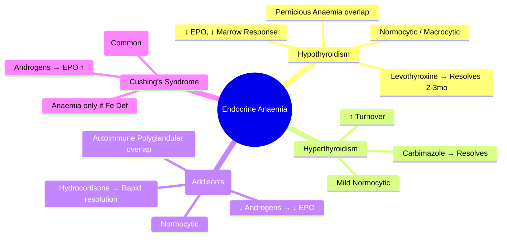

# Endocrine Anaemia

> [!info] **Davidson Ch 25 Alignment**: Anaemia and Red Cell Disorders → Endocrine Anaemia
> **FCPS/MRCP Focus**: Hypothyroidism, Hyperthyroidism, Adrenal insufficiency, Cushing's syndrome, mechanisms of anaemia in endocrine disorders, management

---

## 🎯 Learning Objectives

- [ ] Define **Endocrine Anaemia**: Anaemia secondary to endocrine dysfunction
- [ ] Identify **Hypothyroidism**: Normocytic/Normochromic or Macrocytic, ↓ EPO, ↓ Erythropoiesis
- [ ] Identify **Hyperthyroidism**: Usually mild normocytic, Increased turnover
- [ ] Identify **Adrenal Insufficiency**: Normocytic, ↓ EPO, Autoimmune overlap
- [ ] Identify **Cushing's Syndrome**: Often Polycythaemia, but can have anaemia
- [ ] Diagnose: **TFT, Cortisol, ACTH, Synacthen test**, Anaemia workup
- [ ] Manage: **Treat underlying endocrine disorder**, Anaemia resolves with treatment

---

## 📖 Pathophysiology

```mermaid
flowchart TD
    A[Endocrine Disorder] --> B[Effect on Erythropoiesis]
    B --> C1[Hypothyroidism: ↓ EPO production, ↓ Erythroid progenitor responsiveness]
    B --> C2[Hyperthyroidism: ↑ Turnover, ↑ EPO but ineffective]
    B --> C3[Adrenal Insufficiency: ↓ Androgens, ↓ EPO, Autoimmune overlap]
    B --> C4[Cushing's: ↑ Erythropoiesis → Polycythaemia (usually)]
    C1 & C2 & C3 & C4 --> D[Endocrine Anaemia]
```

---

## 📖 Clinical Types

### 1. Hypothyroidism (Myxoedema)

| Feature | Details |
|---------|---------|
| **Anaemia Type** | **Normocytic/Normochromic** (most common) or **Macrocytic** |
| **Mechanism** | **↓ EPO production** (renal), **↓ Erythroid marrow responsiveness**, ↓ O₂ demand |
| **Associated** | **Pernicious Anaemia** (Autoimmune overlap), Iron deficiency (menorrhagia), B12/Folate malabsorption |
| **Lab** | **TSH ↑↑, T4 ↓**, Hb ↓, MCV normal/↑, Reticulocytes ↓ |
| **Treatment** | **Levothyroxine** → Anaemia resolves in 2-3 months |

### 2. Hyperthyroidism (Thyrotoxicosis)

| Feature | Details |
|---------|---------|
| **Anaemia Type** | Usually **Mild Normocytic** |
| **Mechanism** | ↑ RBC turnover, ↑ EPO but ineffective erythropoiesis, ↑ Plasma volume |
| **Associated** | **Autoimmune** (Graves), **Pernicious Anaemia** risk |
| **Lab** | **TSH ↓↓, T3/T4 ↑↑**, Mild Hb ↓ |
| **Treatment** | **Antithyroid drugs** → Anaemia resolves |

### 3. Adrenal Insufficiency (Addison's Disease)

| Feature | Details |
|---------|---------|
| **Anaemia Type** | **Normocytic Normochromic** |
| **Mechanism** | **↓ Androgens** → ↓ EPO stimulation, ↓ Erythropoiesis; Autoimmune overlap (Pernicious Anaemia) |
| **Associated** | **Autoimmune Polyglandular Syndrome**, **Pernicious Anaemia**, Hypoglycaemia |
| **Lab** | **Cortisol ↓, ACTH ↑↑**, Na⁺ ↓, K⁺ ↑, Hb ↓ |
| **Treatment** | **Hydrocortisone + Fludrocortisone** → Anaemia resolves rapidly |

### 4. Cushing's Syndrome

| Feature | Details |
|---------|---------|
| **Erythrocyte Status** | **Polycythaemia** (More common than anaemia) |
| **Mechanism** | **Androgen excess** → ↑ EPO, ↑ Erythropoiesis |
| **Anaemia if present** | If **Simultaneous Iron deficiency** or **Coexisting Hypothyroidism** |

---

## 🔬 Diagnostic Workup

```mermaid
flowchart TD
    A[Unexplained Anaemia] --> B[**CBC + Film**]
    B --> C{**Normocytic / Macrocytic?**}
    C --> D[**Endocrine Screen**]
    D --> E1[**TSH, Free T4** (Thyroid)]
    D --> E2[**Cortisol 9am, ACTH** (Adrenal)]
    D --> E3[**Synacthen Test** if Cortisol low]
    D --> E4[**Androgens** (Testosterone, DHEA-S) if Cushing's]
    E1 & E2 & E3 & E4 --> F[**Treat Underlying Endocrine Disorder**]
    F --> G[**Recheck Hb at 2-3 months**]
```

### Essential Investigations

| Test | Hypothyroidism | Hyperthyroidism | Adrenal Insufficiency | Cushing's |
|------|----------------|-----------------|----------------------|-----------|
| **TSH** | **↑↑** | **↓↓** | Normal | Normal/↓ |
| **Free T4** | **↓** | **↑** | Normal | Normal |
| **Cortisol (9am)** | Normal | Normal | **↓** | **↑** |
| **ACTH** | Normal | Normal | **↑↑** (Primary) | **↓** (Pituitary) |
| **Synacthen Test** | - | - | **Suboptimal rise** | - |
| **Testosterone/DHEA-S** | - | - | Low (if adrenal) | **↑** |

---

## 💊 Management

| Disorder | Primary Treatment | Anaemia Resolution |
|----------|-------------------|-------------------|
| **Hypothyroidism** | **Levothyroxine** (1.6 µg/kg/day) | **2-3 months** (Full resolution) |
| **Hyperthyroidism** | **Carbimazole/Propylthiouracil** / Radioiodine | **Weeks** (with euthyroidism) |
| **Adrenal Insufficiency** | **Hydrocortisone 15-20mg/day** + **Fludrocortisone** | **Days-Weeks** |
| **Cushing's (Anaemia rare)** | **Treat cause** (Surgery, Metyrapone) | **Treat associated Iron deficiency** |

---

## 🔄 Differential Diagnosis

| Condition | Anaemia Type | Key Differentiator |
|-----------|--------------|-------------------|
| **Iron Deficiency** | Microcytic | Low Ferritin, High TIBC |
| **B12/Folate Deficiency** | **Macrocytic** | Low B12/Folate, Neurological (B12) |
| **Anaemia of Chronic Disease** | Normocytic | High Ferritin, Low TSAT, High CRP |
| **Renal Anaemia** | Normocytic | Low EPO, CKD |
| **Endocrine** | **Normocytic/Macrocytic** | **Abnormal TFT/Cortisol/ACTH** |

---

## 💡 FCPS/MRCP High-Yield Summary

| Topic | Key Point |
|-------|-----------|
| **Hypothyroidism** | **Normocytic/Macrocytic**, ↓ EPO, ↓ Marrow response; **Levothyroxine** → resolves in 2-3mo |
| **Hyperthyroidism** | Mild Normocytic; ↑ Turnover; **Carbimazole** |
| **Adrenal Insufficiency** | **Normocytic**; ↓ Androgens → ↓ EPO; **Hydrocortisone** |
| **Cushing's** | **Polycythaemia** (common); Anaemia only if Fe deficiency |
| **Autoimmune Overlap** | **Pernicious Anaemia** (B12) in Hypothyroid/Adrenal |
| **Mechanism** | **EPO ↓** or **Marrow unresponsiveness** |
| **Investigations** | **TSH, T4, Cortisol, ACTH, Synacthen** |
| **Treatment** | **Treat Endocrine Disorder** → Anaemia resolves |

---

## ❓ Viva Questions

1. **What type of anaemia is seen in Hypothyroidism?**
   - **Normocytic/Normochromic** (most common) or **Macrocytic**

2. **What is the mechanism of anaemia in Hypothyroidism?**
   - **Decreased EPO production** and **decreased erythroid marrow responsiveness**

3. **What is the characteristic haematological finding in Cushing's Syndrome?**
   - **Polycythaemia** (due to androgen excess stimulating erythropoiesis)

4. **How does Adrenal Insufficiency cause anaemia?**
   - **Decreased androgens** → **Decreased EPO production** and **decreased erythropoiesis**

5. **What is the typical anaemia in Hyperthyroidism?**
   - **Mild Normocytic anaemia** (increased turnover, increased plasma volume)

6. **What tests would you order for a patient with unexplained normocytic anaemia?**
   - **TSH, Free T4, Cortisol (9am), ACTH, Synacthen test** (plus standard anaemia workup)

7. **How long does it take for anaemia to resolve after starting Levothyroxine?**
   - **2-3 months**

8. **What autoimmune condition is associated with both Hypothyroidism and Pernicious Anaemia?**
   - **Autoimmune Polyglandular Syndrome Type 2** (or Type 3)

9. **Can Adrenal Insufficiency cause macrocytic anaemia?**
   - Usually **Normocytic**, but can be **Macrocytic** if coexisting B12 deficiency (Autoimmune Polyglandular Syndrome)

10. **What is the mechanism of Polycythaemia in Cushing's Syndrome?**
    - **Androgen excess** → **Increased EPO production** and **stimulated erythropoiesis**

---

## 🧠 Confusions & Mnemonics

| Confusion | Clarification |
|-----------|---------------|
| **Hypothyroid vs Iron Deficiency** | **Hypothyroid = Normocytic/Macrocytic, TSH↑**; **Iron Def = Microcytic, Ferritin↓** |
| **Adrenal Insufficiency vs Iron Def** | **Adrenal = Normocytic, Cortisol↓**; **Iron Def = Microcytic, Ferritin↓** |
| **Cushing's = Polycythaemia** | **Cushing's = Polycythaemia** (Androgen → EPO ↑); Anaemia rare |
| **Hypothyroid = Macrocytic** | **Can be Macrocytic** (if coexisting B12/folate) or **Normocytic** |
| **Adrenal Insufficiency + Pernicious Anaemia** | **Autoimmune Polyglandular Syndrome Type 2** (Addison's + Thyroid + Pernicious) |

| Mnemonic | Meaning |
|----------|---------|
| **"Hypo = Slow EPO = Normo/Macro"** | Hypothyroidism anaemia |
| **"Hyper = Fast Turnover = Normo"** | Hyperthyroidism anaemia |
| **"Addison's = Low Androgens = Low EPO = Normo"** | Adrenal insufficiency |
| **"Cushing = Androgens Up = Polycythaemia"** | Cushing's erythrocytosis |
| **"Treat Endocrine = Cure Anaemia"** | Management principle |

---

## 🗺️ Mind Map



---

## 📋 One-Page Revision Card

| **ENDOCRINE ANAEMIA – FCPS/MRCP REVISION CARD** |
|--------------------------------------------------|
| **Hypothyroidism**: **Normocytic/Macrocytic**, TSH↑, T4↓, ↓EPO; **Levothyroxine** 2-3mo |
| **Hyperthyroidism**: Mild Normocytic, ↑Turnover; **Carbimazole** |
| **Adrenal Insufficiency**: **Normocytic**, ↓Androgens → ↓EPO; **Hydrocortisone** |
| **Cushing's**: **Polycythaemia** (Androgens→EPO↑); Anaemia = Fe Def |
| **Workup**: **TSH, T4, Cortisol(9am), ACTH, Synacthen** |
| **Autoimmune Overlap**: Pernicious Anaemia (B12) in Hypothyroid/Addison's |
| **Treat Endocrine → Anaemia Resolves** |

---

## 📅 Spaced Repetition Tracker

| Review | Date | Score (1-5) | Next Review |
|--------|------|-------------|-------------|
| Day 1 | 2025-06-17 | | 2025-06-18 |
| Day 3 | | | |
| Day 7 | | | |
| Day 15 | | | |
| Day 30 | | | |

---

## 🎯 Must Know / Should Know / Nice to Know

| Level | Content |
|-------|---------|
| **Must Know** | Hypothyroid (Normo/Macro, Levothyroxine 2-3mo), Hyperthyroid (Normocytic, Carbimazole), Adrenal Insufficiency (Normocytic, Hydrocortisone), Cushing's = Polycythaemia, Autoimmune overlap with Pernicious Anaemia, Workup (TSH, Cortisol, ACTH, Synacthen) |
| **Should Know** | Mechanism of reduced EPO in hypothyroid/adrenal, Time to resolution for each, Autoimmune Polyglandular Syndrome types, Macrocytic anaemia in hypothyroid (when B12/folate coexist), Cortisol/ACTH interpretation, Synacthen test interpretation |
| **Nice to Know** | Detailed erythropoietin kinetics in endocrine disorders, Erythropoietin levels in thyroid disease, Adrenal androgen physiology, Polycythaemia rubra vera vs secondary polycythaemia in Cushing's, Erythropoietin resistance in hypothyroidism, Haematological manifestations of rare endocrine disorders (Acromegaly, Phaeochromocytoma) |

---

## ✅ Self-Test Scorecard

| Section | Score (0-10) | Notes |
|---------|--------------|-------|
| Hypothyroidism Anaemia | | |
| Hyperthyroidism Anaemia | | |
| Adrenal Insufficiency Anaemia | | |
| Cushing's Polycythaemia | | |
| Diagnostic Workup | | |
| Viva Questions | | |

---

## 🔗 Local Navigation

- **Previous**: [[Non-immune Haemolytic Anaemia]]
- **Next**: [[Secondary Polycythaemia]]
- **Section Hub**: [[Anaemia and Red Cell Disorders]]
- **MOC**: [[Hematology MOC]]
- **Template**: [[../Templates/Hematology Topic Template]]

---

*Generated for FCPS/MRCP exam preparation. Based on Davidson Medicine 24th Ed Chapter 25.*
---

> Auto-generated study sections for "Hematology" — Ch 24: Haematology & Transfusion Medicine.

## Flashcards (33 generated)

- Q: What is the definition of Hematology?
  A: [!info] Davidson Ch 25 Alignment: Anaemia and Red Cell Disorders → Endocrine Anaemia
- Q: How is Hematology classified?
  A: Normocytic/Normochromic (most common) or Macrocytic
- Q: What is the mechanism of Hematology?
  A: ↓ EPO production (renal), ↓ Erythroid marrow responsiveness, ↓ O₂ demand
- Q: What is Associated of Hematology?
  A: Pernicious Anaemia (Autoimmune overlap), Iron deficiency (menorrhagia), B12/Folate malabsorption
- Q: What is Lab of Hematology?
  A: TSH ↑↑, T4 ↓, Hb ↓, MCV normal/↑, Reticulocytes ↓
- Q: How is Hematology managed?
  A: Levothyroxine → Anaemia resolves in 2-3 months
- Q: How is Hematology classified?
  A: Usually Mild Normocytic
- Q: What is the mechanism of Hematology?
  A: ↑ RBC turnover, ↑ EPO but ineffective erythropoiesis, ↑ Plasma volume
- Q: What is Associated of Hematology?
  A: Autoimmune (Graves), Pernicious Anaemia risk
- Q: What is Lab of Hematology?
  A: TSH ↓↓, T3/T4 ↑↑, Mild Hb ↓
- Q: How is Hematology managed?
  A: Antithyroid drugs → Anaemia resolves
- Q: What is Erythrocyte Status of Hematology?
  A: Polycythaemia (More common than anaemia)
- Q: What is the mechanism of Hematology?
  A: Androgen excess → ↑ EPO, ↑ Erythropoiesis
- Q: What is Anaemia if present of Hematology?
  A: If Simultaneous Iron deficiency or Coexisting Hypothyroidism
- Q: How is Hematology classified?
  A: Normocytic/Normochromic (most common) or Macrocytic
- Q: What is the mechanism of Hematology?
  A: ↓ EPO production (renal), ↓ Erythroid marrow responsiveness, ↓ O₂ demand
- Q: What is Associated of Hematology?
  A: Pernicious Anaemia (Autoimmune overlap), Iron deficiency (menorrhagia), B12/Folate malabsorption
- Q: What is Lab of Hematology?
  A: TSH ↑↑, T4 ↓, Hb ↓, MCV normal/↑, Reticulocytes ↓
- Q: How is Hematology classified?
  A: Usually Mild Normocytic
- Q: What is the mechanism of Hematology?
  A: ↑ RBC turnover, ↑ EPO but ineffective erythropoiesis, ↑ Plasma volume
- Q: What is Associated of Hematology?
  A: Autoimmune (Graves), Pernicious Anaemia risk
- Q: What is Lab of Hematology?
  A: TSH ↓↓, T3/T4 ↑↑, Mild Hb ↓
- Q: What is Erythrocyte Status of Hematology?
  A: Polycythaemia (More common than anaemia)
- Q: What is the mechanism of Hematology?
  A: Androgen excess → ↑ EPO, ↑ Erythropoiesis
- Q: What is Anaemia if present of Hematology?
  A: If Simultaneous Iron deficiency or Coexisting Hypothyroidism
- Q: What is Hypothyroidism of Hematology?
  A: Normocytic/Macrocytic, ↓ EPO, ↓ Marrow response; Levothyroxine → resolves in 2-3mo
- Q: What is Hyperthyroidism of Hematology?
  A: Mild Normocytic; ↑ Turnover; Carbimazole
- Q: What is Adrenal Insufficiency of Hematology?
  A: Normocytic; ↓ Androgens → ↓ EPO; Hydrocortisone
- Q: What is Cushing's of Hematology?
  A: Polycythaemia (common); Anaemia only if Fe deficiency
- Q: What is Autoimmune Overlap of Hematology?
  A: Pernicious Anaemia (B12) in Hypothyroid/Adrenal
- Q: What is the mechanism of Hematology?
  A: EPO ↓ or Marrow unresponsiveness
- Q: What is the investigation of choice for Hematology?
  A: TSH, T4, Cortisol, ACTH, Synacthen
- Q: How is Hematology managed?
  A: Treat Endocrine Disorder → Anaemia resolves

## MCQs (1 generated)

1. **Which of the following best describes Hematology?**
   A. **[!info] Davidson Ch 25 Alignment: Anaemia and Red Cell Disorders → Endocrine Anaemia**
   B. An unrelated condition not matching the clinical picture of Hematology
   C. A complication seen late in the disease course of Hematology
   D. A condition that mimics Hematology but has a different underlying cause

## SBA Questions (1 generated)

1. A patient with suspected Hematology presents with: Anaemia Type — Normocytic/Normochromic (most common) or Macrocytic; Mechanism — ↓ EPO production (renal), ↓ Erythroid marrow responsiveness, ↓ O₂ demand; Associated — Pernicious Anaemia (Autoimmune overlap), Iron deficiency (menorrhagia), B12/Folate malabsorption. What is the most likely diagnosis?
   A. **Hematology**
   B. A condition that mimics Hematology but is not the same entity
   C. A complication of Hematology rather than the primary diagnosis
   D. An unrelated condition in the same clinical category as Hematology

## PasTest Scenario SBAs (Clinical Vignettes)

> **Auto-generated PasTest/Mediscope-style scenario SBAs** grounded in the authored source. Each scenario tests a real clinical fact (triad, specific sign, contraindication, trial, first-line Rx) extracted from the topic. *Source: Ch 24: Haematology — Endocrine Anaemia*

**Q1.** What is the most appropriate first-line therapy for Endocrine Anaemia?

  - **A.** Hyperthyroidism + Carbimazole/Propylthiouracil + Weeks
  - **B.** An advanced/surgical therapy reserved for refractory disease
  - **C.** Symptomatic treatment only, no disease-modifying therapy
  - **D.** Empiric broad-spectrum therapy without specific indication

  > **Answer: A** — Hyperthyroidism + Carbimazole/Propylthiouracil + Weeks
  >
  > *Source:* **Hyperthyroidism**   **Carbimazole/Propylthiouracil** / Radioiodine   **Weeks** (with euthyroidism)

