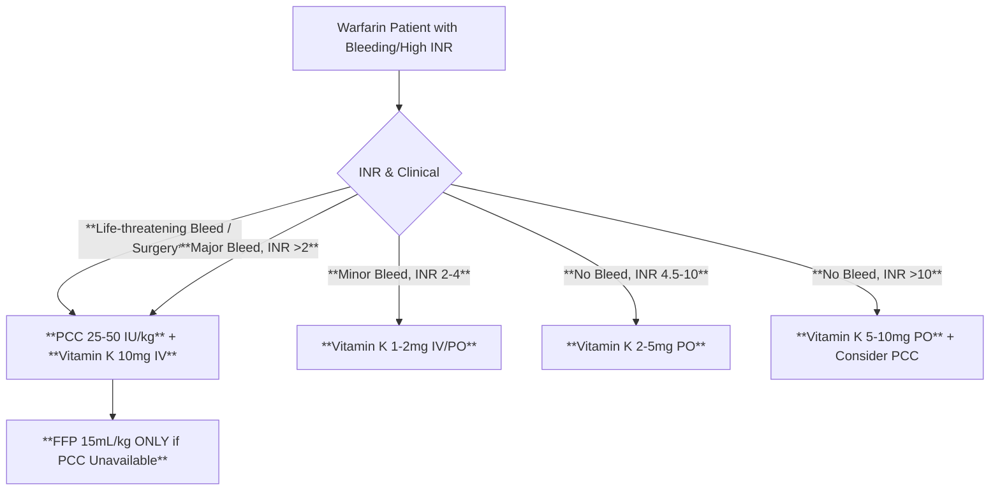
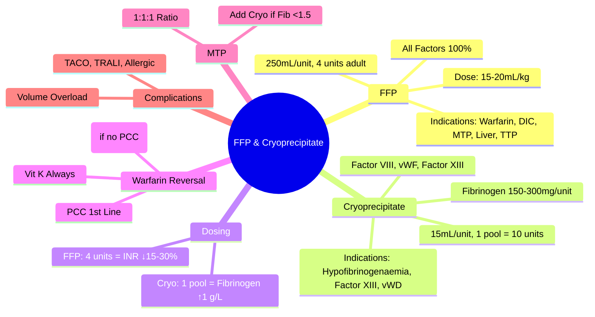

# Fresh Frozen Plasma (FFP) & Cryoprecipitate

> [!info] **Davidson Ch 25 Alignment**: Transfusion Medicine → Blood Products → FFP & Cryoprecipitate
> **FCPS/MRCP Focus**: Indications, dosing, factor content, MTP ratios, DIC, liver disease, warfarin reversal

---

## 🎯 Learning Objectives

- [ ] Define **FFP**: Plasma frozen within 8 hours of collection, contains all coagulation factors
- [ ] Define **Cryoprecipitate**: Precipitate from thawed FFP, enriched for Fibrinogen, Factor VIII, vWF, Factor XIII
- [ ] Apply **Indications**: Warfarin reversal, DIC, liver disease, massive transfusion, TTP (plasma exchange)
- [ ] Calculate **Dosing**: FFP 15-20 mL/kg (4 units adult), Cryo 1 unit/10 kg (or 2 pools adult)
- [ ] Apply **MTP Ratios**: 1:1:1 (RBC:FFP:Platelets) or 1:1:2 depending on protocol
- [ ] Know **Contraindications/Complications**: Volume overload (TACO), TRALI, allergic reactions, pathogen transmission

---

## 📖 Fresh Frozen Plasma (FFP)

### Definition & Composition

| Component | Content per Unit (~250-300 mL) |
|-----------|--------------------------------|
| **Volume** | 200-300 mL |
| **All Coagulation Factors** | **100% levels** (Factors II, V, VII, VIII, IX, X, XI, XII) |
| **Fibrinogen** | ~400-800 mg/unit |
| **Antithrombin, Protein C/S** | Present |
| **vWF** | Present |
| **Albumin, Immunoglobulins** | Present |
| **Storage** | **-18°C or colder**, shelf life **12 months** (up to 36 months at -65°C) |
| **Thawing** | **30-60 min at 37°C**; Use within **24h** if kept at 4°C, **4h** at room temp |

> [!tip] **FFP = ALL Factors at 100%**. **Cryoprecipitate = Concentrated Fibrinogen, Factor VIII, vWF, Factor XIII**.

---

## 📖 Cryoprecipitate

### Definition & Composition

| Component | Content per Unit (~15-20 mL) |
|-----------|------------------------------|
| **Fibrinogen** | **150-300 mg/unit** (High concentration) |
| **Factor VIII** | **80-150 IU/unit** |
| **vWF** | **100-150 IU/unit** |
| **Factor XIII** | **60-120 IU/unit** |
| **Fibronectin** | Present |
| **Storage** | **-18°C or colder**, shelf life **12 months** |
| **Post-thaw** | Use within **4 hours** (or 6h if pooled in closed system) |

> [!tip] **1 Unit Cryo ≈ 15-20 mL**. **Adult dose = 10 units (1 pool) or 2 pools (20 units)**. **Fibrinogen target >1.5 g/L**.

---

## 💊 Indications

### FFP Indications

| Category | Specific Indications | Evidence Strength |
|----------|---------------------|-------------------|
| **Warfarin Reversal** | **INR >1.5 with bleeding** OR **INR >5 without bleeding** (urgent surgery) | Strong |
| **DIC** | **Bleeding + PT/APTT >1.5x + Fibrinogen <1.5** | Moderate |
| **Massive Transfusion** | **1:1:1 Ratio** (MTP), Coagulopathy prevention | Strong (PROPPR) |
| **Liver Disease** | **Bleeding + Coagulopathy** (PT >1.5x) | Moderate |
| **TTP** | **Plasma Exchange** (FFP replacement) | Strong |
| **Hereditary Factor Deficiencies** | Factor V, XI, XIII (if concentrate unavailable) | Weak |
| **Immediate Warfarin Reversal** | **PCC preferred**; FFP if PCC unavailable | FFP = 2nd line |

> [!warning] **FFP NOT INDICATED**: Volume expansion, Nutritional support, Asymptomatic prolonged PT/APTT without bleeding, IM/IV vitamin K anticoagulation reversal.

### Cryoprecipitate Indications

| Indication | Target | Dose |
|------------|--------|------|
| **Hypofibrinogenaemia** | **Fibrinogen <1.5 g/L** (bleeding) / **<2.0 g/L** (obstetrics/surgery) | **1 unit/10 kg** (Adult: 1 pool = 10 units) |
| **DIC with Bleeding** | Fibrinogen <1.5 g/L | 1 pool (10 units) |
| **Massive Transfusion** | Fibrinogen <1.5-2.0 g/L | 1-2 pools per MTP pack |
| **Factor XIII Deficiency** | Prophylaxis/bleeding | 1 unit/10 kg q4-6 weeks |
| **vWD (Type 3/Severe 2A/2B/2M)** | If vWF concentrate unavailable | 1-2 pools |
| **Congenital Fibrinogen Deficiency** | Target >1.0 g/L | 1 unit/10 kg |

---

## 💊 Dosing & Administration

### FFP Dosing

| Patient | Dose | Expected Effect |
|---------|------|-----------------|
| **Adult** | **4 units (15-20 mL/kg)** | **INR correction ~15-30% per 4 units**; Factor levels ↑ ~20% |
| **Paediatric** | **10-15 mL/kg** | Similar |
| **Massive Transfusion** | **1:1:1 Ratio** (RBC:FFP:Platelets) | Goal: Prevent coagulopathy |

### Cryoprecipitate Dosing

| Patient | Dose | Expected Fibrinogen Rise |
|---------|------|--------------------------|
| **Adult** | **1 pool = 10 units** (or 2 pools = 20 units) | **~50-100 mg/dL per pool** |
| **Paediatric** | **1 unit/10 kg** | ~10-20 mg/dL per unit/10kg |
| **Dosing Formula** | **Dose (units) = (Target - Current) × Weight (kg) / 1.5** | Per unit raises ~15 mg/dL in 70kg |

> [!tip] **Adult: 1 pool (10 units) cryo ≈ fibrinogen ↑ ~1 g/L**. **Target fibrinogen >1.5 g/L (bleeding), >2.0 g/L (obstetrics/major surgery)**.

---

## ⚠️ Complications & Contraindications

### FFP Complications

| Complication | Risk | Management |
|--------------|------|------------|
| **TACO** | **Common (~1-5%)** | Slow infusion, Diuretics, Monitor fluid balance |
| **TRALI** | **~1 in 5,000** | Male-only plasma reduces risk |
| **Allergic/Anaphylactic** | **~1-3%** | Antihistamines, Steroids, Adrenaline if severe |
| **Infection** | **Very low (NAT screened)** | Standard screening |
| **Volume Overload** | High volume | Monitor CVP/JVP, Diuretics |

### Cryoprecipitate Complications

| Complication | Risk | Management |
|--------------|------|------------|
| **Allergic/Anaphylactic** | Low | Antihistamines, Steroids, Adrenaline |
| **TRALI** | Very low | Male-only donors |
| **Volume Overload** | Low (small volume) | Monitor |
| **Fibrinogen Overcorrection** | If overdosed | Monitor fibrinogen, avoid thrombosis |

### Contraindications

| Product | Contraindications |
|---------|-------------------|
| **FFP** | **Volume overload (TACO risk)**, Known severe allergy, Jehovah's Witness (unless court order) |
| **Cryoprecipitate** | **Fibrinogen normal/no bleeding**, Known severe allergy |

---

## 🔄 Special Considerations

### Warfarin Reversal Algorithm

> [!warning] **PCC = First-line for urgent warfarin reversal**. **FFP = 2nd line only if PCC unavailable**. **Vitamin K always co-administered**.

### MTP Ratios

| Protocol | RBC : FFP : Platelets | Evidence |
|----------|----------------------|----------|
| **1:1:1** | **1:1:1** (PROPPR trial) | ↑ Haemostasis, ↓ Exsanguination death at 24h |
| **1:1:2** | 1:1:2 (PROMMTT) | Similar mortality, more plasma in 1:1:1 |
| **Goal-directed** | TEG/ROTEM guided | Individualised, ↓ Transfusion |

> [!tip] **1:1:1 = Standard for massive haemorrhage**. **Cryoprecipitate added if fibrinogen <1.5 g/L**.

---

## 💡 FCPS/MRCP High-Yield Summary

| Topic | Key Point |
|-------|-----------|
| **FFP Composition** | **All factors at 100%**, ~250mL, Fibrinogen ~400-800mg |
| **Cryoprecipitate Composition** | **High Fibrinogen (150-300mg)**, Factor VIII, vWF, Factor XIII |
| **FFP Dose** | **4 units (15-20 mL/kg)** adult; **INR ↑ ~15-30% per 4 units** |
| **Cryo Dose** | **1 pool (10 units) / adult**; **Fibrinogen ↑ ~1 g/L per pool** |
| **FFP Indications** | **Warfarin reversal (if no PCC)**, **DIC**, **MTP 1:1:1**, **Liver disease bleeding**, **TTP (plasma exchange)** |
| **Cryo Indications** | **Fibrinogen <1.5 (bleeding)**, **<2.0 (obstetrics/surgery)**, **Factor XIII def**, **vWD if no concentrate** |
| **Warfarin Reversal** | **PCC 1st line**; **FFP ONLY if PCC unavailable**; **Vitamin K always** |
| **MTP Ratio** | **1:1:1 (RBC:FFP:Plts)**; Add cryo if fibrinogen <1.5 |
| **Complications** | **TACO, TRALI, Allergic, Volume overload** |

---

## ❓ Viva Questions

1. **What is the composition of FFP and what is the standard adult dose?**
   - **All coagulation factors at 100%**, ~250mL/unit, **Standard dose = 4 units (15-20 mL/kg)**

2. **What is the composition of Cryoprecipitate and what is the standard adult dose?**
   - **High Fibrinogen (150-300mg), Factor VIII, vWF, Factor XIII**; **Adult dose = 1 pool (10 units)**

3. **What are the indications for FFP transfusion?**
   - **Warfarin reversal (if PCC unavailable)**, **DIC with bleeding**, **Massive transfusion (1:1:1)**, **Liver disease with bleeding**, **TTP (plasma exchange)**

4. **What is the target fibrinogen level for cryoprecipitate transfusion?**
   - **<1.5 g/L (active bleeding)**; **<2.0 g/L (obstetrics/major surgery)**; **Target >1.5-2.0 g/L**

5. **What is the first-line treatment for urgent warfarin reversal?**
   - **Prothrombin Complex Concentrate (PCC) + Vitamin K**; **FFP ONLY if PCC unavailable**

6. **How many units of FFP are in a standard MTP pack (1:1:1 ratio)?**
   - **4-6 units FFP** per pack (with 4-6 RBC + 1 apheresis platelet unit)

7. **What are the complications of FFP transfusion?**
   - **TACO (common), TRALI, Allergic/Anaphylactic, Volume overload, Infection (rare)**

8. **How much does 1 pool of cryoprecipitate raise fibrinogen?**
   - **~1 g/L (50-100 mg/dL)** in a 70 kg adult

9. **When is cryoprecipitate indicated in obstetrics?**
   - **Fibrinogen <2.0 g/L** (PPH, placental abruption, amniotic fluid embolism)

10. **Differentiate FFP vs Cryoprecipitate indications.**
    - **FFP = All factors, Warfarin reversal, DIC, MTP**; **Cryo = Targeted fibrinogen/Factor VIII/vWF/XIII replacement**

---

## 🧠 Confusions & Mnemonics

| Confusion | Clarification |
|-----------|---------------|
| **FFP vs Cryo for Fibrinogen** | **Cryo = Concentrated Fibrinogen (10x FFP)**; Use Cryo for hypofibrinogenaemia |
| **FFP vs PCC for Warfarin** | **PCC = 1st line (fast, low volume, factors II,VII,IX,X)**; **FFP = 2nd line (all factors, high volume)** |
| **FFP vs Cryo Volume** | **FFP = ~250mL/unit**; **Cryo = ~15mL/unit (10 units = ~150mL)** |
| **Cryo for Factor VIII** | **Only if recombinant/vWf concentrate unavailable**; Cryo = 2nd line |
| **FFP Dose** | **4 units = Std adult**; **Not weight-based in MTP (1:1:1)** |

| Mnemonic | Meaning |
|----------|---------|
| **"FFP = Four Factors (All) = Four Units Std"** | FFP dose |
| **"Cryo = Cryo-Fibrinogen Concentrate"** | Cryo purpose |
| **"PCC First, FFP Second"** | Warfarin reversal |
| **"1:1:1 = Balanced Resuscitation"** | MTP ratio |
| **"Cryo = 1 Pool = 10 Units = 1 g/L Fibrinogen Rise"** | Cryo dose effect |
| **"Fibrinogen <1.5 = Cryo Time"** | Cryo threshold |

---

## 🗺️ Mind Map

---

## 📋 One-Page Revision Card

| **FFP & CRYOPRECIPITATE – FCPS/MRCP REVISION CARD** |
|------------------------------------------------------|
| **FFP**: All Factors 100%, 250mL, **4 units (15-20mL/kg)** adult |
| **Cryo**: **Fibrinogen 150-300mg**, Factor VIII, vWF, XIII, **1 pool = 10 units** |
| **FFP Indications**: Warfarin (2nd to PCC), DIC, **MTP 1:1:1**, Liver bleed, TTP |
| **Cryo Indications**: **Fibrinogen <1.5 (bleed)**, **<2.0 (OB/surgery)**, Factor XIII, vWD |
| **Warfarin**: **PCC 1st + Vit K**, FFP only if PCC unavailable |
| **MTP**: **1:1:1 RBC:FFP:Plts**, Add Cryo if Fib <1.5 |
| **Targets**: Fibrinogen **>1.5 (bleed)**, **>2.0 (OB/surgery)** |
| **Cryo Dose**: **1 pool = Fibrinogen ↑1 g/L** |
| **Complications**: TACO, TRALI, Allergic, Volume Overload |

---

## 📅 Spaced Repetition Tracker

| Review | Date | Score (1-5) | Next Review |
|--------|------|-------------|-------------|
| Day 1 | 2025-06-17 | | 2025-06-18 |
| Day 3 | | | |
| Day 7 | | | |
| Day 15 | | | |
| Day 30 | | | |

---

## 🎯 Must Know / Should Know / Nice to Know

| Level | Content |
|-------|---------|
| **Must Know** | FFP/Cryo composition & dosing, FFP vs Cryo indications, PCC 1st line for warfarin, MTP 1:1:1 ratio, fibrinogen targets, cryo dose calculation, complications (TACO/TRALI) |
| **Should Know** | FFP volume per unit, cryo volume per unit, INR correction per FFP unit, warfarin reversal algorithm, TEG/ROTEM guided cryo, pathogen reduction, male-only plasma for TRALI prevention, paediatric dosing |
| **Nice to Know** | PCC vs FFP cost-effectiveness, fibrinogen concentrate vs cryo, lyophilized plasma, cold-stored plasma, TACO prediction scores, TRALI pathophysiology (2-hit hypothesis), plasma volume kinetics, FFP in specific factor deficiencies (V, XI, XIII), cryo for vWD type 2N/2M/1 |

---

## ✅ Self-Test Scorecard

| Section | Score (0-10) | Notes |
|---------|--------------|-------|
| FFP Composition & Dosing | | |
| Cryoprecipitate Composition & Dosing | | |
| Indications (FFP vs Cryo) | | |
| Warfarin Reversal Algorithm | | |
| MTP Ratios & Cryo in MTP | | |
| Complications | | |
| Viva Questions | | |

---

## 🔗 Local Navigation

- **Previous**: [[Red Cell Transfusion]]
- **Next**: [[ABO/Rh Compatibility & Crossmatch]]
- **Section Hub**: [[Transfusion Medicine]]
- **MOC**: [[Hematology MOC]]
- **Template**: [[../Templates/Hematology Topic Template]]

---

*Generated for FCPS/MRCP exam preparation. Based on Davidson Medicine 24th Ed Chapter 25.*
---

> Auto-generated study sections for "Hematology" — Ch 24: Haematology & Transfusion Medicine.

## Flashcards (8 generated)

- Q: What is the definition of Hematology?
  A: [!info] Davidson Ch 25 Alignment: Transfusion Medicine → Blood Products → FFP & Cryoprecipitate
- Q: What is FFP Composition of Hematology?
  A: All factors at 100%, ~250mL, Fibrinogen ~400-800mg
- Q: What is Cryoprecipitate Composition of Hematology?
  A: High Fibrinogen (150-300mg), Factor VIII, vWF, Factor XIII
- Q: What is the dose of Hematology?
  A: 4 units (15-20 mL/kg) adult; INR ↑ ~15-30% per 4 units
- Q: What is Hematology indicated for?
  A: Warfarin reversal (if no PCC), DIC, MTP 1:1:1, Liver disease bleeding, TTP (plasma exchange)
- Q: What is Warfarin Reversal of Hematology?
  A: PCC 1st line; FFP ONLY if PCC unavailable; Vitamin K always
- Q: What is MTP Ratio of Hematology?
  A: 1:1:1 (RBC:FFP:Plts); Add cryo if fibrinogen <1.5
- Q: What are the complications of Hematology?
  A: TACO, TRALI, Allergic, Volume overload

## MCQs (1 generated)

1. **Which of the following best describes Hematology?**
   A. **[!info] Davidson Ch 25 Alignment: Transfusion Medicine → Blood Products → FFP & Cryoprecipitate**
   B. An unrelated condition not matching the clinical picture of Hematology
   C. A complication seen late in the disease course of Hematology
   D. A condition that mimics Hematology but has a different underlying cause

