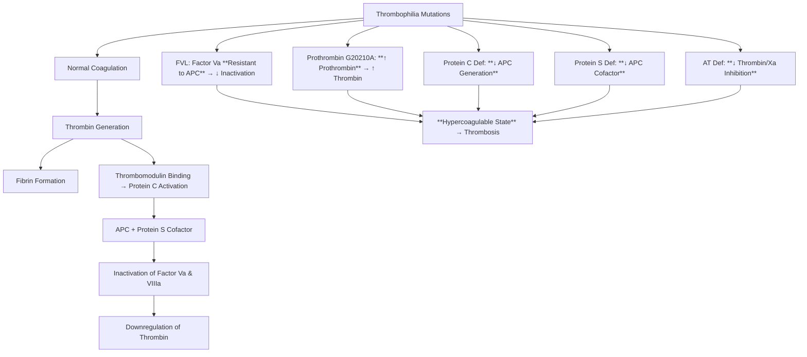
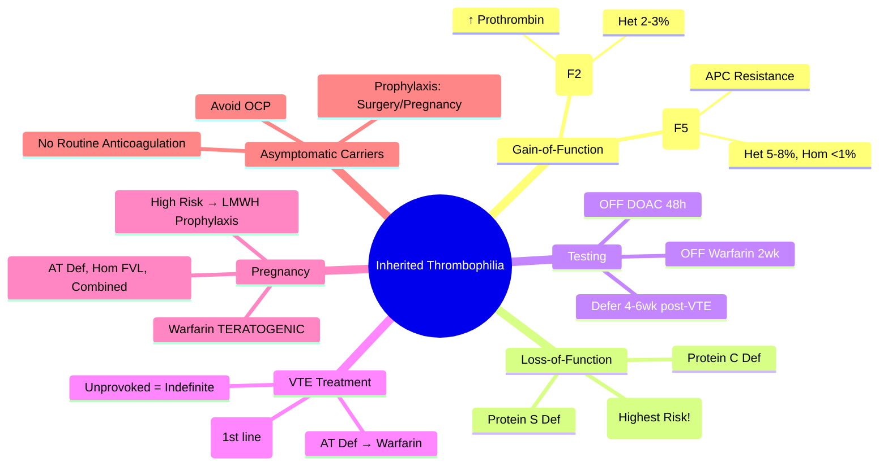

# Factor V Leiden & Inherited Thrombophilia

> [!info] **Davidson Ch 25 Alignment**: Bleeding and Thrombotic Disorders → Thrombophilia → Inherited Thrombophilias
> **FCPS/MRCP Focus**: Factor V Leiden, Prothrombin G20210A, Protein C/S/AT deficiency, testing timing (off anticoagulation), warfarin vs DOACs, duration, pregnancy management, family screening

---

## 🎯 Learning Objectives

- [ ] Classify **Inherited Thrombophilias**: Factor V Leiden, Prothrombin G20210A (Gain-of-function), Protein C, Protein S, Antithrombin Deficiency (Loss-of-function)
- [ ] Apply **testing principles**: **OFF anticoagulation** (warfarin affects Protein C/S/AT; DOACs affect LA/AT); **Avoid acute thrombosis/inflammation** (acute phase reactants)
- [ ] Interpret **Factor V Leiden**: APC Resistance assay → Genetic confirmation (heterozygous vs homozygous)
- [ ] Risk stratification: **Homozygous > Heterozygous**; **Combined defects** = multiplicative risk
- [ ] Manage **VTE in Thrombophilia**: **DOACs preferred** (except AT deficiency); **Warfarin if mechanical valves/pregnancy/AT def**; **Duration** based on provoked vs unprovoked
- [ ] Manage **Asymptomatic Carriers**: No routine anticoagulation; **Prophylaxis** for high-risk situations (surgery, pregnancy, OCP)
- [ ] Pregnancy management: **LMWH prophylaxis** for high-risk defects (AT def, homozygous FVL, combined)

---

## 📖 Classification & Molecular Basis

| Thrombophilia | Gene | Mechanism | Inheritance | Prevalence (Caucasian) |
|---------------|------|-----------|-------------|------------------------|
| **Factor V Leiden (FVL)** | **F5** (c.1691G>A) | **Activated Protein C (APC) Resistance** – Factor Va resists degradation | AD | **5-8% het, <1% hom** |
| **Prothrombin G20210A** | **F2** (c.*97G>A) | **↑ Prothrombin levels** → ↑ Thrombin generation | AD | **2-3% het** |
| **Protein C Deficiency** | **PROC** | ↓ Inactivation of Va/VIIa | AD | **0.2-0.5%** |
| **Protein S Deficiency** | **PROS1** | ↓ Cofactor for APC | AD | **0.2-0.5%** |
| **Antithrombin (AT) Deficiency** | **SERPINC1** | ↓ Thrombin/Factor Xa inhibition | AD | **0.02-0.2%** (most severe) |

> [!tip] **FCPS/MRCP**: **FVL = Most common inherited thrombophilia**. **AT Deficiency = Highest thrombotic risk**. **Test OFF anticoagulation**. **DOACs preferred for VTE treatment** (except AT def). **Pregnancy = LMWH prophylaxis for high-risk**.

---

## ⚙️ Pathophysiology



---

## 🔬 Diagnostic Workup & Testing Principles

### When to Test
- **Unprovoked VTE** (especially <50 years)
- **Recurrent VTE**
- **VTE at unusual sites** (cerebral sinus, portal, hepatic, renal veins)
- **Family history** of VTE/thrombophilia
- **Pregnancy complications** (recurrent loss, severe PE, placental abruption)
- **Neonatal purpura fulminans** (homozygous Protein C/S/AT def)

### Testing Timing – **CRITICAL**

| Anticoagulant | Effect on Tests | When to Test |
|---------------|-----------------|--------------|
| **Warfarin** | **↓ Protein C, ↓ Protein S, ↑ AT (acute phase)** | **≥2 weeks OFF warfarin** (or test before starting) |
| **DOACs** | **False + LA, ↓ AT (rivaroxaban/apixaban), ↑ PT/APTT** | **≥48h OFF DOAC** (or test before starting) |
| **Heparin/LMWH** | **↓ AT (heparin cofactor)** | **OFF heparin** (or use heparin-insensitive AT assay) |
| **Acute Thrombosis/Inflammation** | **↑ Factor VIII, ↓ Protein S (acute phase), ↑ Fibrinogen** | **Defer 4-6 weeks** post-acute event |

### Testing Algorithm

```mermaid
flowchart TD
    A[Indication for Thrombophilia Screen] --> B[**OFF Anticoagulation ≥2wk (Warfarin) / ≥48h (DOAC)**]
    B --> C[**Baseline: CBC, PT, APTT, Fibrinogen, D-dimer**]
    C --> D[**Screening Tests**]
    D --> E1[**APC Resistance Assay** (screen for FVL)]
    D --> E2[**Functional Protein C, S, AT** (chromogenic)]
    D --> E3[**Prothrombin G20210A** (genetic)]
    E1 --> F1[**If APC-R positive → F5 Genetic Test** (Het vs Hom)]
    E2 --> F2[**If Low → Genetic Confirmation**]
    F1 & F2 --> G[**Interpret in Clinical Context**]
```

### Test Interpretation

| Test | Normal | Abnormal | Next Step |
|------|--------|----------|-----------|
| **APC Resistance Ratio** | >2.0-2.1 | **<1.5-1.8** (suggests FVL) | **F5 Genetic (c.1691G>A)** |
| **Protein C Activity** | 70-140% | **<60-70%** | **PROC Genetic** |
| **Protein S Free Activity** | 60-130% | **<50-60%** | **PROS1 Genetic** |
| **Antithrombin Activity** | 80-120% | **<70-80%** | **SERPINC1 Genetic** |
| **Prothrombin G20210A** | Wild-type | **Heterozygous / Homozygous** | Direct genetic test |

---

## 🩺 Risk Stratification

| Defect | Heterozygous VTE Risk (Annual) | Homozygous/Combined Risk |
|--------|-------------------------------|--------------------------|
| **Factor V Leiden** | **3-7x** (Het) | **50-80x** (Hom) |
| **Prothrombin G20210A** | **2-3x** (Het) | Rare (Hom) |
| **Protein C Deficiency** | **5-10x** | **Severe (Neonatal purpura fulminans)** |
| **Protein S Deficiency** | **5-10x** | **Severe** |
| **Antithrombin Deficiency** | **10-20x** (Highest) | **Lethal/Neonatal thrombosis** |

**Combined Defects** (e.g., FVL + Protein S def) = **Multiplicative risk** (e.g., 50-100x)

---

## 💊 Management

### VTE Treatment in Thrombophilia

| Scenario | Preferred Anticoagulant | Duration |
|----------|------------------------|----------|
| **Provoked VTE** (surgery, trauma, OCP) | **DOAC** (Rivaroxaban/Apixaban) | **3 months** |
| **Unprovoked VTE** | **DOAC** (Rivaroxaban/Apixaban) | **Indefinite** (if bleed risk low) |
| **Antithrombin Deficiency** | **Warfarin** (DOACs less reliable) | **Indefinite** |
| **Recurrent VTE** | **DOAC** (or Warfarin) | **Indefinite** |
| **Pregnancy/Postpartum** | **Therapeutic LMWH** (Enoxaparin 1mg/kg BD) | **Throughout pregnancy + 6wks PP** |

> [!tip] **DOACs are first-line for VTE in most thrombophilias** (except AT deficiency where warfarin preferred). **Indefinite anticoagulation for unprovoked VTE** (thrombophilia or not).

### Asymptomatic Carriers (No VTE History)

| Situation | Management |
|-----------|------------|
| **Routine** | **NO anticoagulation**; Counsel on VTE symptoms, avoid OCP (estrogen), smoking |
| **Surgery** | **Prophylactic LMWH** (per protocol) |
| **Pregnancy** | **Prophylactic LMWH** (antenatal ± 6wks PP) if **High-risk**: AT def, Hom FVL, Combined defects, Prior VTE |
| **OCP/HRT** | **Avoid estrogen** (use progesterone-only/non-hormonal) |
| **Long-haul Travel** | **Compression stockings**, hydration, mobilise |

---

## 🤰 Pregnancy Management

| Thrombophilia | Antepartum | Postpartum (6 weeks) |
|---------------|------------|----------------------|
| **Factor V Leiden (Het)** | Surveillance (no LMWH) unless additional risk | **Prophylactic LMWH 6wks** |
| **Factor V Leiden (Hom)** | **Prophylactic LMWH** | **Prophylactic LMWH 6wks** |
| **Prothrombin G20210A (Het)** | Surveillance unless additional risk | **Prophylactic LMWH 6wks** |
| **Protein C/S Deficiency** | **Prophylactic LMWH** | **Prophylactic LMWH 6wks** |
| **Antithrombin Deficiency** | **Therapeutic LMWH** (or Prophylactic + AT concentrate) | **Therapeutic LMWH 6wks** |
| **Combined Defects** | **Therapeutic LMWH** | **Therapeutic LMWH 6wks** |
| **Prior VTE** | **Therapeutic LMWH** | **Therapeutic LMWH 6wks** |

> [!warning] **Warfarin TERATOGENIC** (Category X) – **Contraindicated in pregnancy** (weeks 6-12). **LMWH only**.

---

## 🔄 Differential Diagnosis

| Condition | Distinguishing Features |
|-----------|------------------------|
| **Antiphospholipid Syndrome** | **Acquired aPL** (LA, aCL, anti-β2GPI); **INR 3-4**; **DOACs contraindicated in triple positive** |
| **HIT** | **Heparin 5-14d, PF4/heparin Ab+**, thrombosis; **HIT = 4Ts + PF4 Ab** |
| **Malignancy** | **Provoked VTE**; Cancer screening if unprovoked >40yo |
| **Inflammatory/Nephrotic** | **Acquired Protein S loss** (nephrotic); **↑ Factor VIII** (inflammation) |
| **PCOS/Obesity/OCP** | **Provoked risk factors**; OCP = estrogen component |

---

## 💡 FCPS/MRCP High-Yield Summary

| Topic | Key Point |
|-------|-----------|
| **Most Common** | **Factor V Leiden (FVL)** – 5-8% het in Caucasians |
| **Highest Risk** | **Antithrombin Deficiency** (10-20x risk) |
| **Testing Timing** | **OFF Warfarin ≥2wk**; **OFF DOAC ≥48h**; **Defer 4-6wk post-VTE** |
| **FVL Diagnosis** | **APC Resistance Ratio low → F5 Genetic** (Het vs Hom) |
| **VTE Treatment** | **DOACs first-line** (except AT def → Warfarin) |
| **Duration** | **Provoked = 3mo**; **Unprovoked = Indefinite** |
| **AT Deficiency** | **Warfarin preferred** (DOACs less evidence) |
| **Pregnancy** | **LMWH prophylaxis** for high-risk (AT def, Hom FVL, Combined, Prior VTE) |
| **Asymptomatic Carriers** | **No routine anticoagulation**; **Avoid OCP, Prophylaxis for surgery/pregnancy** |
| **Family Screening** | **Cascade testing** if proband has high-risk defect |

---

## ❓ Viva Questions

1. **What is the most common inherited thrombophilia?**
   - **Factor V Leiden** (heterozygous 5-8% in Caucasians)

2. **When should thrombophilia testing be performed?**
   - **OFF warfarin ≥2 weeks, OFF DOACs ≥48 hours**, defer 4-6 weeks after acute VTE/inflammation

3. **How do you diagnose Factor V Leiden?**
   - **APC Resistance Assay (screen) → F5 Genetic Test (c.1691G>A) confirmation** (Het vs Hom)

4. **Which inherited thrombophilia carries the highest thrombotic risk?**
   - **Antithrombin Deficiency** (10-20x relative risk; severe neonatal thrombosis if homozygous)

5. **What is the preferred anticoagulant for VTE in Antithrombin Deficiency?**
   - **Warfarin** (DOACs less reliable due to AT-independent mechanism)

6. **How long should anticoagulation continue for a first unprovoked VTE in a patient with Factor V Leiden?**
   - **Indefinite** (same as unprovoked VTE without thrombophilia – bleeding risk permitting)

7. **What is the management of an asymptomatic heterozygous Factor V Leiden carrier during pregnancy?**
   - **Antepartum surveillance** (no routine LMWH); **Postpartum prophylactic LMWH 6 weeks**

8. **Why is warfarin preferred over DOACs in Antithrombin Deficiency?**
   - **DOACs (especially anti-Xa) require AT for activity**; Warfarin works via Vitamin K antagonism (AT-independent)

9. **When should cascade family screening be offered?**
   - **Proband has high-risk defect** (AT deficiency, homozygous FVL, combined defects, homozygous Prothrombin)

10. **Differentiate Factor V Leiden from Prothrombin G20210A.**
    - **FVL: APC Resistance, F5 gene, 5-8% het**; **Prothrombin G20210A: ↑ Prothrombin level, F2 gene, 2-3% het**

---

## 🧠 Confusions & Mnemonics

| Confusion | Clarification |
|-----------|---------------|
| **FVL vs Prothrombin G20210A** | **FVL = APC Resistance (F5)**; **Prothrombin = ↑ Prothrombin level (F2)** |
| **Testing on Warfarin** | **Warfarin ↓ Protein C/S** → false deficiency; **Test OFF warfarin ≥2wk** |
| **DOACs in AT Deficiency** | **DOACs need AT** → less effective; **Warfarin preferred** |
| **Provoked vs Unprovoked VTE** | **Provoked = 3mo**; **Unprovoked = Indefinite** (regardless of thrombophilia) |
| **Asymptomatic Carrier** | **NO anticoagulation**; Prophylaxis only for surgery/pregnancy |

| Mnemonic | Meaning |
|----------|---------|
| **"FVL = APC Resistance = Factor 5"** | Most common |
| **"AT Def = Highest Risk = Warfarin"** | Antithrombin |
| **"Test OFF Warfarin (2wk), OFF DOAC (48h)"** | Timing |
| **"Unprovoked = Indefinite"** | Duration |
| **"Pregnancy = LMWH Prophylaxis (High Risk)"** | Pregnancy |
| **"No Anticoagulation for Asymptomatic"** | Carrier management |

---

## 🗺️ Mind Map



---

## 📋 One-Page Revision Card

| **INHERITED THROMBOPHILIA – FCPS/MRCP REVISION CARD** |
|--------------------------------------------------------|
| **FVL**: **Most common** (5-8% het); **APC Resistance → F5 Genetic** |
| **Prothrombin G20210A**: ↑ Prothrombin; F2 gene; 2-3% het |
| **Protein C/S Def**: Loss-of-function; ↑ thrombosis risk |
| **AT Def**: **HIGHEST RISK** (10-20x); **Warfarin preferred** |
| **Testing**: **OFF Warfarin 2wk, OFF DOAC 48h, Defer 4-6wk post-VTE** |
| **VTE Rx**: **DOACs 1st line** (except AT Def → Warfarin) |
| **Duration**: **Provoked 3mo; Unprovoked Indefinite** |
| **Pregnancy**: **LMWH Prophylaxis** (AT Def, Hom FVL, Combined, Prior VTE) |
| **Asymptomatic**: **NO Anticoagulation**; Avoid OCP; Prophylaxis for surgery |
| **Warfarin**: **TERATOGENIC** – NO in pregnancy |

---

## 📅 Spaced Repetition Tracker

| Review | Date | Score (1-5) | Next Review |
|--------|------|-------------|-------------|
| Day 1 | 2025-06-16 | | 2025-06-17 |
| Day 3 | | | |
| Day 7 | | | |
| Day 15 | | | |
| Day 30 | | | |

---

## 🎯 Must Know / Should Know / Nice to Know

| Level | Content |
|-------|---------|
| **Must Know** | FVL most common, AT def highest risk, testing timing (off warfarin/DOAC), APC resistance screen for FVL, DOACs first-line except AT def, warfarin in AT def, indefinite for unprovoked, LMWH in pregnancy for high-risk, asymptomatic carriers no anticoagulation |
| **Should Know** | Protein C/S deficiency types (Type I/II/III), homozygous FVL/Prothrombin risks, combined defects multiplicative, neonatal purpura fulminans (Protein C/S/AT hom), warfarin skin necrosis in PC/PS/AT def, DOAC mechanism AT-dependence, family cascade testing, OCP contraindicated in carriers |
| **Nice to Know** | Detailed PROC/PROS1/SERPINC1 mutation types, APC resistance assay methodology (aPTT-based vs chromogenic), Protein S free vs total, AT heparin cofactor vs chromogenic assays, direct thrombin inhibitors in AT def, rivaroxaban vs apixaban in thrombophilia, cost-effectiveness of screening, thrombophilia in paediatrics, genetic counselling |

---

## ✅ Self-Test Scorecard

| Section | Score (0-10) | Notes |
|---------|--------------|-------|
| Classification & Mechanisms | | |
| Testing Principles & Timing | | |
| Risk Stratification | | |
| VTE Treatment Selection | | |
| Duration of Anticoagulation | | |
| Pregnancy Management | | |
| Asymptomatic Carrier Management | | |
| Viva Questions | | |

---

## 🔗 Local Navigation

- **Previous**: [[Antiphospholipid Syndrome]]
- **Next**: [[DVT/PE & Cancer-associated Thrombosis]]
- **Section Hub**: [[Bleeding and Thrombotic Disorders]]
- **MOC**: [[Hematology MOC]]
- **Template**: [[../Templates/Hematology Topic Template]]

---

*Generated for FCPS/MRCP exam preparation. Based on Davidson Medicine 24th Ed Chapter 25.*
---

> Auto-generated study sections for "Hematology" — Ch 24: Haematology & Transfusion Medicine.

## Flashcards (10 generated)

- Q: What is the definition of Hematology?
  A: [!info] Davidson Ch 25 Alignment: Bleeding and Thrombotic Disorders → Thrombophilia → Inherited Thrombophilias
- Q: What is Most Common of Hematology?
  A: Factor V Leiden (FVL) – 5-8% het in Caucasians
- Q: What is Highest Risk of Hematology?
  A: Antithrombin Deficiency (10-20x risk)
- Q: What is the investigation of choice for Hematology?
  A: OFF Warfarin ≥2wk; OFF DOAC ≥48h; Defer 4-6wk post-VTE
- Q: How is Hematology managed?
  A: DOACs first-line (except AT def → Warfarin)
- Q: What is Duration of Hematology?
  A: Provoked = 3mo; Unprovoked = Indefinite
- Q: What is AT Deficiency of Hematology?
  A: Warfarin preferred (DOACs less evidence)
- Q: What is Pregnancy of Hematology?
  A: LMWH prophylaxis for high-risk (AT def, Hom FVL, Combined, Prior VTE)
- Q: What are the clinical features of Hematology?
  A: No routine anticoagulation; Avoid OCP, Prophylaxis for surgery/pregnancy
- Q: What is Family Screening of Hematology?
  A: Cascade testing if proband has high-risk defect

## MCQs (1 generated)

1. **Which of the following best describes Hematology?**
   A. **[!info] Davidson Ch 25 Alignment: Bleeding and Thrombotic Disorders → Thrombophilia → Inherited Thrombophilias**
   B. An unrelated condition not matching the clinical picture of Hematology
   C. A complication seen late in the disease course of Hematology
   D. A condition that mimics Hematology but has a different underlying cause

## SBA Questions (1 generated)

1. A patient with suspected Hematology presents with: Factor V Leiden (FVL) — F5 (c.1691G>A); Prothrombin G20210A — F2 (c.97G>A); Protein C Deficiency — PROC. What is the most likely diagnosis?
   A. **Hematology**
   B. A condition that mimics Hematology but is not the same entity
   C. A complication of Hematology rather than the primary diagnosis
   D. An unrelated condition in the same clinical category as Hematology

## PasTest Scenario SBAs (Clinical Vignettes)

> **Auto-generated PasTest/Mediscope-style scenario SBAs** grounded in the authored source. Each scenario tests a real clinical fact (triad, specific sign, contraindication, trial, first-line Rx) extracted from the topic. *Source: Ch 24: Haematology — Factor V Leiden & Thrombophilia*

**Q1.** What is the most appropriate first-line therapy for Factor V Leiden & Thrombophilia?

  - **A.** Pregnancy/Postpartum + Therapeutic LMWH + Throughout pregnancy
  - **B.** An advanced/surgical therapy reserved for refractory disease
  - **C.** Symptomatic treatment only, no disease-modifying therapy
  - **D.** Empiric broad-spectrum therapy without specific indication

  > **Answer: A** — Pregnancy/Postpartum + Therapeutic LMWH + Throughout pregnancy
  >
  > *Source:* **Pregnancy/Postpartum**   **Therapeutic LMWH** (Enoxaparin 1mg/kg BD)   **Throughout pregnancy + 6wks PP**  

> [!tip] **DOACs are first-line for VTE in most thrombophilias** (except AT deficiency wh

