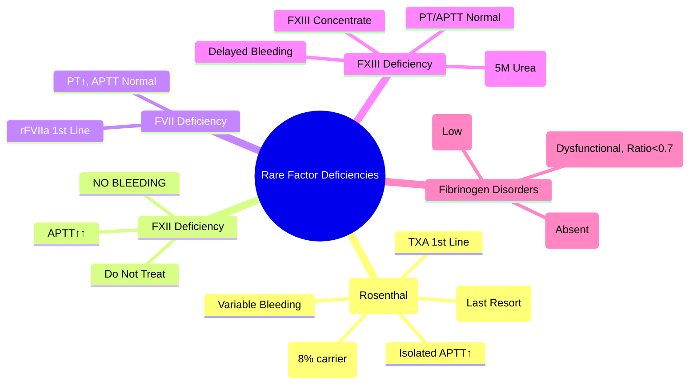

# Factor XI Deficiency & Rare Factor Deficiencies

> [!info] **Davidson Ch 25 Alignment**: Bleeding and Thrombotic Disorders → Coagulation Disorders → Rare Factor Deficiencies
> **FCPS/MRCP Focus**: Factor XI deficiency (Rosenthal syndrome), Factor XII, VII, XIII, Fibrinogen disorders, fibrinogen abnormalities, testing, management

---

## 🎯 Learning Objectives

- [ ] Define **Factor XI Deficiency (Rosenthal Syndrome)**: Autosomal recessive/incomplete dominant, variable bleeding, Ashkenazi Jewish predisposition
- [ ] Diagnose: **Isolated prolonged APTT, Normal PT**, Factor XI activity, Genetic testing
- [ ] Manage: **Tranexamic acid, FFP, rFVIIa**; **Avoid rFVIIa if possible** (thrombosis risk)
- [ ] Identify **Other Rare Deficiencies**: Factor VII, XIII, Fibrinogen (afibrinogenaemia/hypofibrinogenaemia/dysfibrinogenaemia), Factor XII
- [ ] Differentiate from: **Heparin, Lupus anticoagulant, DIC, Liver disease, VWD**

---

## 📖 Factor XI Deficiency (Rosenthal Syndrome)

### Epidemiology & Genetics

| Feature | Details |
|---------|---------|
| **Inheritance** | **Autosomal Recessive** (homozygous) / **Incomplete Dominant** (heterozygous bleeding) |
| **Prevalence** | **1 in 1,000,000** (general); **~8% carrier** in **Ashkenazi Jews** |
| **Gene** | **F11** (Chromosome 4) |
| **Bleeding Phenotype** | **Variable** - Not correlated with FXI level; Some severe, some asymptomatic |

### Pathophysiology

```mermaid
flowchart TD
    A[Factor XI Deficiency] --> B[Impaired Contact Activation]
    B --> C[↓ Factor IX Activation]
    C --> D[↓ Tenase Complex (IXa-VIIIa)]
    D --> E[↓ Thrombin Generation]
    E --> F[↓ Fibrin Formation]
    F --> G[Bleeding Tendency]
    
    H[Factor XI Role] --> I[Activated by FXIIa, Thrombin]
    I --> J[Activates FIX → FIXa]
```

### Clinical Features

| Feature | Details |
|---------|---------|
| **Bleeding Type** | **Mucosal** (epistaxis, menorrhagia, GI), **Post-surgical/traumatic** (delayed, often 24-48h) |
| **Spontaneous** | **Rare** (unlike Haemophilia) |
| **Joint/Muscle Bleeds** | **Uncommon** (unlike Haemophilia A/B) |
| **Pregnancy/Childbirth** | **High risk** of postpartum haemorrhage |
| **Dental Extraction** | **High risk** of delayed bleeding |

> [!tip] **Factor XI Deficiency = "Rosenthal Syndrome" = Isolated prolonged APTT + Normal PT + Variable mucosal/surgical bleeding**. **NOT spontaneous joint bleeds**. **Ashkenazi Jewish predisposition**.

---

## 🔬 Diagnostic Workup

```mermaid
flowchart TD
    A[Prolonged APTT + Normal PT] --> B[**Mixing Study**]
    B --> C{**Corrects?**}
    C -->|Yes| D[**Factor Deficiency Likely**]
    C -->|No| E[**Inhibitor (Lupus Anticoagulant, Heparin)**]
    D --> F[**Individual Factor Assays**]
    F --> G{**Factor XI Low**}
    G -->|Yes| H[**Factor XI Deficiency**]
    G -->|No| I[**Other Factor Deficiency (XII, PK, HK)**]
    H --> J[**FXI Activity Level**]
    J --> K[**Genetic Testing (F11)**]
```

### Key Investigations

| Test | Factor XI Deficiency | Other Deficiencies |
|------|---------------------|-------------------|
| **APTT** | **Prolonged** | Prolonged (XII, PK, HK) |
| **PT** | **Normal** | Normal (VII, X, V, II, Fibrinogen) |
| **Thrombin Time** | **Normal** | Normal (unless Fibrinogen) |
| **FXI Activity** | **Low (<15-20% = severe)** | Specific factor low |
| **FXI Antigen** | Low (Type I) / Normal (Type II) | Differentiate Type I/II |
| **Genetic Testing** | F11 mutations | Gene-specific |

### FXI Activity & Bleeding Correlation

| FXI Level | Classification | Bleeding Risk |
|-----------|----------------|---------------|
| **<1-15%** | **Severe** | Moderate (mucosal, post-surgical) |
| **15-30%** | **Partial** | Mild (often asymptomatic) |
| **30-50%** | **Mild/Carrier** | Usually asymptomatic |
| **>50%** | **Normal** | None |

> [!warning] **Bleeding phenotype DOES NOT correlate well with FXI level** - Some severe deficiency patients asymptomatic, some mild deficiency have significant bleeding.

---

## 💊 Management

### Bleeding Episodes / Prophylaxis

| Situation | Management |
|-----------|------------|
| **Minor Bleeding** (epistaxis, menorrhagia) | **Tranexamic Acid** (oral/IV/topical) - **First-line** |
| **Major Bleeding / Surgery** | **Tranexamic Acid + FFP** (15-20 mL/kg) |
| **Major Surgery / Life-threatening** | **rFVIIa** (if FFP insufficient) - **Caution: Thrombosis risk** |
| **Dental Extraction** | **Tranexamic Acid mouthwash** (10% 15mL q6h × 2-5d) + **Oral TXA** |
| **Childbirth** | **Tranexamic Acid 1g IV** + **FFP** if bleeding |

### Product Comparison

| Product | Factor XI Content | Advantage | Disadvantage |
|---------|-------------------|-----------|--------------|
| **FFP** | ~1 IU/mL (100%) | Available, all factors | **Volume overload**, TACO, TRALI |
| **Tranexamic Acid** | N/A (antifibrinolytic) | **Oral/IV, Safe, No transfusion risk** | Does not replace FXI |
| **rFVIIa** | N/A (bypasses FXI) | **Rapid, small volume** | **Thrombosis risk**, Expensive |

> [!warning] **Avoid rFVIIa if possible** in FXI deficiency - **High thrombosis risk** due to bypassing natural regulation. **FFP + TXA preferred**.

---

## 🦠 Other Rare Factor Deficiencies

### Factor VII Deficiency

| Feature | Details |
|---------|---------|
| **Inheritance** | Autosomal Recessive |
| **Frequency** | ~1 in 500,000 |
| **Lab** | **Prolonged PT, Normal APTT**, ↓ FVII activity |
| **Clinical** | Variable: Mucosal, CNS, Joint bleeds (severe), Post-surgical |
| **Treatment** | **rFVIIa** (first-line), **PCC**, **FFP** |
| **Neonatal** | **Intracranial haemorrhage** risk (if severe) |

### Factor XIII Deficiency

| Feature | Details |
|---------|---------|
| **Inheritance** | Autosomal Recessive |
| **Frequency** | ~1 in 2-5 million |
| **Lab** | **Normal PT/APTT/TT**, **Clot solubility test (5M urea) POSITIVE**, ↓ FXIII activity |
| **Clinical** | **Delayed bleeding** (24-48h post-trauma/surgery), **Umbilical stump bleeding**, Poor wound healing, **Intracranial haemorrhage** |
| **Treatment** | **FXIII Concentrate** 10-20 U/kg monthly prophylaxis; **Cryoprecipitate** (FXIII source) |
| **Screening** | **Clot solubility in 5M urea** (fails to dissolve = FXIII deficiency) |

### Fibrinogen Disorders

| Type | Definition | Clinical |
|------|------------|----------|
| **Afibrinogenaemia** | **Absent fibrinogen** (<0.1 g/L) | Severe bleeding (umbilical, CNS, joints) |
| **Hypofibrinogenaemia** | **Low fibrinogen** (0.1-1.5 g/L) | Variable bleeding |
| **Dysfibrinogenaemia** | **Normal level, dysfunctional** | Bleeding **OR** Thrombosis (paradoxical) |
| **Dyshypofibrinogenaemia** | **Low + dysfunctional** | Combined |

| Test | Afibrinogenaemia | Hypofibrinogenaemia | Dysfibrinogenaemia |
|------|------------------|---------------------|-------------------|
| **Fibrinogen (Clauss)** | **<0.1 g/L** | **<1.5 g/L** | Normal/Low |
| **PT/APTT/TT** | **All prolonged** | **Prolonged** | **Prolonged (esp. TT)** |
| **Functional/Antigen Ratio** | N/A | ~1 | **<0.7** |

### Factor XII Deficiency (Hageman Factor)

| Feature | Details |
|---------|---------|
| **Lab** | **Markedly prolonged APTT**, Normal PT, TT |
| **Clinical** | **NO BLEEDING** (paradoxical) |
| **Significance** | **Thrombosis risk?** (controversial) |
| **Management** | **NO treatment needed**; Distinguish from heparin/lupus anticoagulant |

---

## 🔄 Differential Diagnosis

| Condition | APTT | PT | Key Differentiator |
|-----------|------|----|-------------------|
| **FXI Deficiency** | ↑ | Normal | Isolated APTT↑, FXI low |
| **FXII Deficiency** | ↑↑ | Normal | **No bleeding**, FXII low |
| **FVII Deficiency** | Normal | ↑ | Isolated PT↑, FVII low |
| **FXIII Deficiency** | Normal | Normal | **Normal APTT/PT**, Solubility test + |
| **Fibrinogen Disorders** | ↑ | ↑ | Fibrinogen low/abnormal |
| **VWD** | ↑/Normal | Normal | VWF:Ag/Activity low |
| **Heparin** | ↑ | Normal | Heparin assay, Anti-Xa |
| **Lupus Anticoagulant** | ↑ | Normal | **No bleeding**, Mixing study no correction |

---

## 💡 FCPS/MRCP High-Yield Summary

| Topic | Key Point |
|-------|-----------|
| **FXI Deficiency** | **Isolated APTT↑**, Normal PT, **Variable bleeding** (mucosal, post-surgical) |
| **Rosenthal Syndrome** | **FXI Deficiency in Ashkenazi Jews** (8% carrier) |
| **Bleeding ≠ FXI Level** | **No correlation** - severe deficiency can be asymptomatic |
| **Treatment** | **Tranexamic Acid 1st line**, **FFP for major/surgery**, **rFVIIa last resort (thrombosis risk)** |
| **FXII Deficiency** | **Prolonged APTT, NO BLEEDING** - Do NOT treat |
| **FXIII Deficiency** | **Normal PT/APTT**, **Clot solubility 5M urea POSITIVE**, Delayed bleeding |
| **Fibrinogen Disorders** | **Afibrinogenaemia (absent), Hypofibrinogenaemia (low), Dysfibrinogenaemia (dysfunctional)** |
| **FVII Deficiency** | **Isolated PT↑**, rFVIIa first-line |
| **Fibrinogen: Functional/Antigen <0.7** | **Dysfibrinogenaemia** |

---

## ❓ Viva Questions

1. **What is the coagulation profile in Factor XI deficiency?**
   - **Isolated prolonged APTT**, Normal PT, Normal TT, Thrombin time normal

2. **Why is Factor XI deficiency called Rosenthal syndrome?**
   - Named after **Rosenthal** who described it in **Ashkenazi Jewish families** (high carrier frequency ~8%)

3. **Does bleeding severity correlate with FXI level?**
   - **NO** - Poor correlation; Some severe deficiency patients asymptomatic, some mild deficiency bleed significantly

4. **What is the first-line treatment for bleeding in FXI deficiency?**
   - **Tranexamic Acid** (oral/IV/topical) - Antifibrinolytic, safe, no transfusion risk

5. **When do you use rFVIIa in FXI deficiency?**
   - **Last resort** for life-threatening bleeding unresponsive to FFP + TXA; **Thrombosis risk high**

5. **How do you diagnose Factor XIII deficiency?**
   - **Normal PT, APTT, TT**; **Clot solubility in 5M urea POSITIVE** (fails to dissolve); **FXIII activity low**

6. **What is the difference between afibrinogenaemia and dysfibrinogenaemia?**
   - **Afibrinogenaemia: Absent fibrinogen (<0.1)**; **Dysfibrinogenaemia: Normal level but dysfunctional (Functional/Antigen <0.7)**

6. **Does Factor XII deficiency cause bleeding?**
   - **NO** - Despite markedly prolonged APTT, **NO clinical bleeding**; Thrombosis risk debated

7. **What is the coagulation profile in Factor VII deficiency?**
   - **Prolonged PT**, **Normal APTT**, Normal TT, Low FVII activity

7. **How do you distinguish FXI deficiency from Lupus Anticoagulant?**
   - **FXI Def: Mixing study corrects, FXI low, Bleeding history**; **LA: Mixing study no correction, No bleeding, Thrombosis risk**

8. **What is the clot solubility test and when is it positive?**
   - **5M urea test**; **Positive in FXIII deficiency** (clot fails to dissolve in 24h) - confirms diagnosis

---

## 🧠 Confusions & Mnemonics

| Confusion | Clarification |
|-----------|---------------|
| **FXI Def vs FXII Def** | **FXI = Bleeding**, **FXII = No Bleeding** (despite prolonged APTT) |
| **FXI Def vs VWD** | **FXI: Isolated APTT↑, Normal vWF**; **VWD: APTT↑/Normal, Low vWF:Ag/Activity** |
| **FXI Def vs Heparin** | **Heparin: Anti-Xa +, Heparin assay +, No FXI deficiency** |
| **FXIII Def vs Fibrinogen** | **FXIII: PT/APTT Normal, Solubility test +**; **Fibrinogen: TT↑, PT/APTT↑, Fibrinogen low** |
| **FVII vs FXI** | **FVII: PT↑, APTT Normal**; **FXI: APTT↑, PT Normal** |

| Mnemonic | Meaning |
|----------|---------|
| **"FXI = Rosenthal = Ashkenazi Jews"** | Epidemiology |
| **"FXII = No Bleed = Prolonged APTT"** | FXII paradox |
| **"FXIII = Solubility Test = Delayed Bleed"** | FXIII diagnosis |
| **"FVII = PT Only"** | Isolated PT prolongation |
| **"Fibrinogen Ratio <0.7 = Dysfibrinogen"** | Dysfibrinogenaemia |
| **"rFVIIa = Last Resort = Thrombosis Risk"** | FXI treatment caution |

---

## 🗺️ Mind Map



---

## 📋 One-Page Revision Card

| **RARE FACTOR DEFICIENCIES – FCPS/MRCP REVISION CARD** |
|---------------------------------------------------------|
| **FXI (Rosenthal)**: **Isolated APTT↑**, Ashkenazi Jews, Variable bleed, **TXA 1st**, FFP/rFVIIa |
| **FXII**: **APTT↑↑, NO BLEED**, Do not treat |
| **FVII**: **PT↑, APTT Normal**, **rFVIIa** 1st line |
| **FXIII**: **PT/APTT Normal**, **Clot Solubility 5M Urea +**, Delayed bleed, **FXIII Concentrate** |
| **Fibrinogen**: **Afibrinogen (Absent)**, **Hypofibrinogen (Low)**, **Dysfibrinogen (Ratio<0.7)** |
| **FVIII/FIX**: Haemophilia A/B |
| **VWF**: VWD |
| **Differentiation**: FXI (Isolated APTT↑, Bleed) vs FXII (APTT↑, NO Bleed) vs LA (APTT↑, No Bleed, No Correct) |

---

## 📅 Spaced Repetition Tracker

| Review | Date | Score (1-5) | Next Review |
|--------|------|-------------|-------------|
| Day 1 | 2025-06-17 | | 2025-06-18 |
| Day 3 | | | |
| Day 7 | | | |
| Day 15 | | | |
| Day 30 | | | |

---

## 🎯 Must Know / Should Know / Nice to Know

| Level | Content |
|-------|---------|
| **Must Know** | FXI deficiency (isolated APTT↑, TXA 1st line, Rosenthal), FXII deficiency (no bleed despite APTT↑), FXIII deficiency (normal PT/APTT, solubility test), FVII deficiency (PT↑ only), fibrinogen disorders classification, rFVIIa use/cautions |
| **Should Know** | FXI bleeding phenotype variability, FXI treatment algorithms (surgery, dental, childbirth), FXIII solubility test methodology, fibrinogen disorder subtypes (afibrinogenaemia/hypo/dys), dysfibrinogenaemia paradoxical thrombosis, rFVIIa thrombosis risk in FXI def, PCC vs FFP in rare deficiencies |
| **Nice to Know** | F11/F12/F7/F13/FGA-FGG genes, homozygous vs heterozygous phenotypes, pregnancy management in rare deficiencies, neonatal intracranial haemorrhage (FVII, FXIII), factor concentrate availability, recombinant vs plasma-derived products, cost-effectiveness, gene therapy prospects, registries (Rare Bleeding Disorders Database) |

---

## ✅ Self-Test Scorecard

| Section | Score (0-10) | Notes |
|---------|--------------|-------|
| FXI Deficiency (Rosenthal) | | |
| FXII Deficiency (No Bleed) | | |
| FXIII Deficiency (Solubility Test) | | |
| FVII Deficiency | | |
| Fibrinogen Disorders | | |
| Differential Diagnosis | | |
| Viva Questions | | |

---

## 🔗 Local Navigation

- **Previous**: [[Vitamin K Deficiency]]
- **Next**: [[Hyperhomocysteinaemia]]
- **Section Hub**: [[Bleeding and Thrombotic Disorders]]
- **MOC**: [[Hematology MOC]]
- **Template**: [[../Templates/Hematology Topic Template]]

---

*Generated for FCPS/MRCP exam preparation. Based on Davidson Medicine 24th Ed Chapter 25.*
---

> Auto-generated study sections for "Hematology" — Ch 24: Haematology & Transfusion Medicine.

## Flashcards (26 generated)

- Q: What is the definition of Hematology?
  A: # Factor XI Deficiency & Rare Factor Deficiencies
- Q: What is Inheritance of Hematology?
  A: Autosomal Recessive (homozygous) / Incomplete Dominant (heterozygous bleeding)
- Q: What is the epidemiology of Hematology?
  A: 1 in 1,000,000 (general); ~8% carrier in Ashkenazi Jews
- Q: What is Gene of Hematology?
  A: F11 (Chromosome 4)
- Q: How is Hematology classified?
  A: Variable - Not correlated with FXI level; Some severe, some asymptomatic
- Q: How is Hematology classified?
  A: Mucosal (epistaxis, menorrhagia, GI), Post-surgical/traumatic (delayed, often 24-48h)
- Q: What is Spontaneous of Hematology?
  A: Rare (unlike Haemophilia)
- Q: What is Joint/Muscle Bleeds of Hematology?
  A: Uncommon (unlike Haemophilia A/B)
- Q: What is Pregnancy/Childbirth of Hematology?
  A: High risk of postpartum haemorrhage
- Q: What is Dental Extraction of Hematology?
  A: High risk of delayed bleeding
- Q: What is Lab of Hematology?
  A: Markedly prolonged APTT, Normal PT, TT
- Q: What is Clinical of Hematology?
  A: NO BLEEDING (paradoxical)
- Q: What is Significance of Hematology?
  A: Thrombosis risk? (controversial)
- Q: How is Hematology managed?
  A: NO treatment needed; Distinguish from heparin/lupus anticoagulant
- Q: What is Inheritance of Hematology?
  A: Autosomal Recessive (homozygous) / Incomplete Dominant (heterozygous bleeding)
- Q: What is the epidemiology of Hematology?
  A: 1 in 1,000,000 (general); ~8% carrier in Ashkenazi Jews
- Q: What is Gene of Hematology?
  A: F11 (Chromosome 4)
- Q: How is Hematology classified?
  A: Mucosal (epistaxis, menorrhagia, GI), Post-surgical/traumatic (delayed, often 24-48h)
- Q: What is Spontaneous of Hematology?
  A: Rare (unlike Haemophilia)
- Q: What is Joint/Muscle Bleeds of Hematology?
  A: Uncommon (unlike Haemophilia A/B)
- Q: What is Pregnancy/Childbirth of Hematology?
  A: High risk of postpartum haemorrhage
- Q: What is Dental Extraction of Hematology?
  A: High risk of delayed bleeding
- Q: What is Lab of Hematology?
  A: Markedly prolonged APTT, Normal PT, TT
- Q: What is Clinical of Hematology?
  A: NO BLEEDING (paradoxical)
- Q: What is Significance of Hematology?
  A: Thrombosis risk? (controversial)
- Q: How is Hematology managed?
  A: NO treatment needed; Distinguish from heparin/lupus anticoagulant

## MCQs (1 generated)

1. **Which of the following best describes Hematology?**
   A. **# Factor XI Deficiency & Rare Factor Deficiencies**
   B. An unrelated condition not matching the clinical picture of Hematology
   C. A complication seen late in the disease course of Hematology
   D. A condition that mimics Hematology but has a different underlying cause

## SBA Questions (1 generated)

1. A patient with suspected Hematology presents with: Bleeding Type — Mucosal (epistaxis, menorrhagia, GI), Post-surgical/traumatic (delayed, often 24-48h); Spontaneous — Rare (unlike Haemophilia); Joint/Muscle Bleeds — Uncommon (unlike Haemophilia A/B). What is the most likely diagnosis?
   A. **Hematology**
   B. A condition that mimics Hematology but is not the same entity
   C. A complication of Hematology rather than the primary diagnosis
   D. An unrelated condition in the same clinical category as Hematology

## PasTest Scenario SBAs (Clinical Vignettes)

> **Auto-generated PasTest/Mediscope-style scenario SBAs** grounded in the authored source. Each scenario tests a real clinical fact (triad, specific sign, contraindication, trial, first-line Rx) extracted from the topic. *Source: Ch 24: Haematology — Factor XI Deficiency & Rare Factor Deficiencies*

**Q1.** What is the most appropriate first-line therapy for Factor XI Deficiency & Rare Factor Deficiencies?

  - **A.** Minor Bleeding + Tranexamic Acid
  - **B.** An advanced/surgical therapy reserved for refractory disease
  - **C.** Symptomatic treatment only, no disease-modifying therapy
  - **D.** Empiric broad-spectrum therapy without specific indication

  > **Answer: A** — Minor Bleeding + Tranexamic Acid
  >
  > *Source:* **Minor Bleeding** (epistaxis, menorrhagia)   **Tranexamic Acid** (oral/IV/topical) - **First-line**

