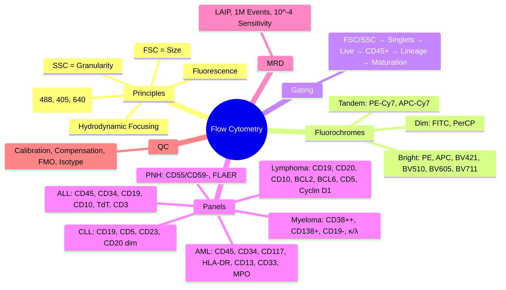

# Flow Cytometry in Haematology

> [!info] **Davidson Ch 25 Alignment**: Haematology Investigations → Flow Cytometry
> **FCPS/MRCP Focus**: Principles, Fluorochromes, Gating Strategy, Panels (AML, ALL, CLL, PNH, Lymphoma), MRD, Interpretation

---

## 🎯 Learning Objectives

- [ ] Understand **Principles**: Light Scatter (FSC/SSC), Fluorescence, Hydrodynamic Focusing
- [ ] Apply **Gating Strategy**: FSC/SSC → Singlets → Viability → Lineage → Maturation
- [ ] Select **Fluorochromes**: FITC, PE, PerCP, APC, BV421, BV510, BV605, BV711, APC-Cy7
- [ ] Design **Panels**: AML, ALL, CLL, Lymphoma, PNH, Plasma Cell, MRD
- [ ] Interpret **Results**: Maturation Patterns, Aberrant Immunophenotypes, MRD
- [ ] Apply **QC**: Calibration, Compensation, Isotype/FMO Controls

---

## 📖 Principles

```mermaid
flowchart TD
    A[Cells in Suspension] --> B[Hydrodynamic Focusing → Single File]
    B --> C[Laser Interrogation (488nm, 405nm, 640nm)]
    C --> D1[**Forward Scatter (FSC)** = Cell Size]
    C --> D2[**Side Scatter (SSC)** = Granularity/Complexity]
    C --> D3[**Fluorescence** (Fluorochrome Excitation/Emission)]
    D1 & D2 & D3 --> E[Electronic Signal → Digital Data]
    E --> F[**Data Analysis**: Gating, Compensation, Visualization]
```

### Light Scatter

| Parameter | Measures | Typical Pattern |
|-----------|----------|-----------------|
| **FSC (Forward Scatter)** | **Cell Size** | Lymphocytes < Monocytes < Granulocytes |
| **SSC (Side Scatter)** | **Granularity/Internal Complexity** | Lymphocytes (Low) < Monocytes < Granulocytes (High) |

---

## 🔬 Fluorochromes & Panels

### Common Fluorochromes (Laser: 488nm Blue, 405nm Violet, 640nm Red)

| Fluorochrome | Laser | Emission Max | Brightness | Typical Use |
|--------------|-------|--------------|------------|-------------|
| **FITC** | 488nm | 519 nm | Medium | CD45, CD34, HLA-DR |
| **PE** | 488nm | 578 nm | **Bright** | CD38, CD117, CD138, Lambda |
| **PerCP/PerCP-Cy5.5** | 488nm | 675/695 nm | Medium | CD45, CD3, CD19 |
| **APC** | 640nm | 660 nm | **Bright** | CD19, CD56, CD11c, Kappa |
| **BV421** | 405nm | 421 nm | **Very Bright** | CD38, CD45, CD10 |
| **BV510** | 405nm | 510 nm | **Very Bright** | CD34, CD117 |
| **BV605** | 405nm | 605 nm | **Very Bright** | CD38, CD56 |
| **BV711** | 405nm | 711 nm | **Very Bright** | CD45, CD3 |
| **APC-Cy7** | 640nm | 785 nm | Bright | CD45, CD3, CD19 |

> [!tip] **Panel Design**: **Bright fluorochromes (PE, APC, BV421)** for **Low-density antigens** (CD34, CD117, CD38); **Dim fluorochromes (FITC, PerCP)** for **High-density antigens** (CD45, CD3, CD19).

---

## 🔬 Gating Strategy (Standardised)

```mermaid
flowchart TD
    A[All Events] --> B[**FSC vs SSC** → Lymphocyte/Monocyte/Granulocyte Gates]
    B --> C[**FSC-A vs FSC-H** → **Singlets** (Exclude Doublets)]
    C --> D[**Viability Dye** (7-AAD/PI/DAPI) → **Live Cells**]
    D --> E[**Lineage Gate** (CD45+ vs CD45-)]
    E --> F{**Lineage**}
    F -->|**Lymphoid**| G[**CD19+ (B-cell)**, **CD3+ (T-cell)**, **CD56+ (NK)**]
    F -->|**Myeloid**| H[**CD13/CD33+**, **CD117**, **CD11b**, **CD14**, **CD64**]
    F -->|**Precursor**| I[**CD34+**, **HLA-DR**, **TdT**, **CD117**, **MPO**]
    G & H & I --> J[**Maturation Analysis** (Aberrant vs Normal)]
    J --> K[**MRD Quantification** (if applicable)]
```

### Standard Gating Hierarchy

| Level | Gate | Purpose |
|-------|------|---------|
| **1** | **FSC-A vs SSC-A** | Major Populations (Lymphs, Monos, Grans) |
| **2** | **FSC-A vs FSC-H** | **Singlets** (Remove Doublets/Clumps) |
| **3** | **Viability Dye** | **Live Cells** (Exclude Dead) |
| **4** | **CD45 vs SSC** | **Leucocytes (CD45+)** vs Debris/Non-haem |
| **5** | **Lineage Markers** | **B (CD19)**, **T (CD3)**, **NK (CD56)**, **Myeloid (CD13/33)** |
| **6** | **Maturation Markers** | **CD34, CD38, CD10, CD20, CD38, CD117, MPO, TdT, CD7, CD5, CD2** |

---

## 🔬 Standard Diagnostic Panels

### 1. AML Panel (Minimum 8-Colour)

| Tube | Markers | Purpose |
|------|---------|---------|
| **1** | CD45, CD34, HLA-DR, CD117, CD13, CD33, MPO, CD11b | **Myeloid Blast Identification, Maturation, Lineage** |
| **2** | CD45, CD34, CD117, CD11b, CD14, CD64, CD11c, CD15 | **Monocytic Differentiation** |
| **3** | CD45, CD34, CD117, CD19, CD10, CD20, CD22, TdT | **Exclude B-lineage (MPAL)** |
| **4** | CD45, CD34, CD117, CD7, CD2, CD5, CD3, CD1a | **Exclude T-lineage (MPAL/ETP-ALL)** |
| **5** | CD45, CD34, CD117, CD56, CD7, CD2, CD3, CD1a | **NK/NK-T Lineage** |

### 2. ALL Panel

| Tube | Markers | Purpose |
|------|---------|---------|
| **B-ALL** | CD45, CD34, CD19, CD10, CD20, CD22, CD38, TdT, CD3, CD7 | **B-lineage, Maturation, Exclude T-lineage** |
| **T-ALL** | CD45, CD34, CD1a, CD2, CD3, CD5, CD7, CD8, CD4, TdT, CD10 | **T-lineage, Cortical/Pre-T/Pre-B** |

### 3. CLL Panel

| Markers | Purpose |
|---------|---------|
| CD45, CD19, CD5, CD23, CD20, CD10, FMC7, CD38, CD49d, CD200, ZAP-70 | **Diagnosis, Prognosis (CD38, CD49d, ZAP-70)** |

### 4. PNH Panel

| Markers | Purpose |
|---------|---------|
| **CD45, CD55, CD59, FLAER, CD15, CD24, CD66b, CD14, CD45** | **GPI-anchor deficiency** (CD55/CD59-), **Granulocytes > RBCs** |

### 5. Plasma Cell / Myeloma

| Markers | Purpose |
|---------|---------|
| CD45, CD38, CD138, CD19, CD45, CD56, CD27, CD81, CD117, κ, λ | **Clonality (κ/λ restriction)**, Aberrant markers (CD56+, CD117+, CD19-) |

### 6. Lymphoma (Lymph Node/BM)

| Subtype | Key Markers |
|---------|-------------|
| **DLBCL** | CD45, CD19, CD20, CD10, BCL6, BCL2, MUM1, CD10, Ki-67 |
| **Follicular** | CD45, CD19, CD20, CD10, BCL2, BCL6, CD23, Ki-67 |
| **MCL** | CD45, CD19, CD20, CD5, CD23-, Cyclin D1, SOX11, CD10-, FMC7+ |
| **MZL** | CD45, CD19, CD20, CD5-, CD10-, CD23-, DBA44+, BCL2+ |
| **BL** | CD45, CD19, CD20, CD10+, BCL6+, BCL2-, Ki-67 100%, MYC+ |
| **PTCL** | CD45, CD3, CD4, CD8, CD7, CD2, CD5, CD30, ALK |
| **ALCL** | CD45, CD30+, ALK+/-, EMA+, CD4+, CD3- |

---

## ⚠️ Common Pitfalls & Troubleshooting

| Issue | Cause | Solution |
|-------|-------|----------|
| **Spectral Overlap** | Fluorochrome emission spillover | **Compensation Matrix** (Single-stained controls) |
| **Non-specific Binding** | Fc receptor binding | **Fc Block (Human IgG)**, **Isotype Controls** |
| **Autofluorescence** | High in monocytes, eosinophils | **Use BV fluorochromes**, **Longer wavelength** |
| **Dead Cells** | Non-specific binding | **Viability Dye (7-AAD/PI/DAPI)** gate |
| **Doublets** | Cell clumps | **FSC-A vs FSC-H/Width** |
| **Low Viability** | Old sample, Poor storage | **Process <24h**, **RPMI + 10% FBS** |
| **Antigen Loss** | Enzymatic treatment, Fixation | **Stain Fresh**, **Avoid Enzymes** |

---

## 🎯 MRD (Minimal Residual Disease) by Flow

| Parameter | Standard |
|-----------|----------|
| **Sensitivity** | **10⁻⁴ to 10⁻⁵** (1 in 10,000 to 100,000) |
| **Cells Acquired** | **≥1,000,000 events** (≥500,000 target cells) |
| **Controls** | **Normal BM**, **FMO**, **Isotype** |
| **Blast Gate** | **CD34+CD38+**, **CD34+CD38- (LSC)**, **CD34+CD117+** |
| **Reporting** | **% Blasts of Total Nucleated Cells**, **% Blasts of CD34+** |

---

## 💡 FCPS/MRCP High-Yield Summary

| Topic | Key Point |
|-------|-----------|
| **Principles** | **FSC = Size, SSC = Granularity**, Fluorescence = Antigen Density |
| **Fluorochromes** | **PE/APC/BV = Bright** for Low-density antigens (CD34, CD117); **FITC/PerCP** for High-density (CD45, CD3) |
| **Gating** | **FSC/SSC → Singlets → Live → CD45+ → Lineage → Maturation** |
| **AML Panel** | **CD45, CD34, CD117, HLA-DR, CD13, CD33, MPO, CD11b** (+ CD19/CD3 for MPAL) |
| **ALL Panel** | **CD45, CD34, CD19, CD10, TdT, CD3, CD7** |
| **CLL** | **CD5+, CD23+, CD20 dim, sIg dim, CD10-, FMC7-, CD38/ZAP-70 prognostic** |
| **PNH** | **CD55/CD59- (GPI-anchor)**, **FLAER**, Granulocytes > RBCs |
| **MPAL** | **Both Myeloid (MPO+) AND Lymphoid (CD19+/CD3+) criteria** |
| **MRD** | **Sensitivity 10⁻⁴ - 10⁻⁵**, **≥1M events**, LAIP (Leukaemia-Associated Immunophenotype) |
| **QC** | **Daily Calibration, Compensation, Isotype/FMO Controls** |

---

## ❓ Viva Questions

1. **What is the principle of flow cytometry?**
   - **Hydrodynamic focusing** → Single cell stream → **Laser interrogation** → **FSC (Size), SSC (Granularity), Fluorescence (Antigen)** → Electronic detection

2. **What is the principle of compensation?**
   - **Spectral overlap correction**: Fluorochrome emission spills into adjacent detectors → **Compensation matrix** subtracts spillover using **single-stained controls**

3. **How do you design an AML flow cytometry panel?**
   - **Backbone**: CD45, CD34, HLA-DR, CD117, CD13, CD33, MPO, CD11b; **Add CD19, CD10, CD3, CD7** to exclude MPAL

3. **What is the difference between FSC and SSC?**
   - **FSC = Cell Size**; **SSC = Internal Complexity/Granularity**

4. **How do you identify PNH cells by flow cytometry?**
   - **CD55/CD59 negative** (GPI-anchor deficiency) on **Granulocytes and RBCs**; **FLAER negative**; **Granulocytes more sensitive than RBCs**

5. **What is MRD by flow cytometry and what sensitivity can it achieve?**
   - **Leukaemia-Associated Immunophenotype (LAIP) tracking**; **Sensitivity 10⁻⁴ to 10⁻⁵** (1 in 10,000-100,000)

6. **How do you distinguish CLL from Mantle Cell Lymphoma by flow?**
   - **CLL: CD5+, CD23+, CD20 dim, sIg dim, FMC7-, Cyclin D1-**; **MCL: CD5+, CD23-, CD20 bright, FMC7+, Cyclin D1+, SOX11+**

7. **What are the key markers for Plasmablast/Plasma Cell identification?**
   - **CD38++**, **CD138+**, **CD19-**, **CD45-**, **CD56+/-**, **CD19-**, **κ/λ restriction**

7. **What is the difference between FITC and PE fluorochromes?**
   - **PE = Brighter** (Higher quantum yield) → **Use for Low-density antigens** (CD34, CD117, CD38); **FITC = Dimmer** → **High-density antigens** (CD45, CD3, CD19)

8. **How do you identify doublets in flow cytometry?**
   - **FSC-A vs FSC-H (or FSC-W)** plot → **Singlets fall on diagonal**, **Doublets deviate**

9. **What is FLAER and its role in PNH diagnosis?**
   - **FLAER = Fluorescent AERolysin**; Binds GPI-anchor; **FLAER-negative = GPI-deficient = PNH**; More sensitive than CD55/CD59

10. **How do you detect MRD in B-ALL by flow cytometry?**
    - **LAIP**: **CD34+CD10+CD38+CD19+** (or patient-specific); **≥1M events**, **Sensitivity 10⁻⁴**; **Different from normal B-cell precursors (CD34+CD38+CD10+CD19+)**

---

## 🧠 Confusions & Mnemonics

| Confusion | Clarification |
|-----------|---------------|
| **FSC vs SSC** | **FSC = Size**, **SSC = Granularity/Complexity** |
| **Compensation vs Gating** | **Comp = Spectral Overlap Correction**; **Gating = Population Selection** |
| **FMO vs Isotype** | **FMO = Full Panel Minus One (Staining Control)**; **Isotype = Non-specific Binding Control** |
| **MRD Sensitivity** | **Flow = 10⁻⁴-10⁻⁵**; **PCR = 10⁻⁵-10⁻⁶** |
| **PNH Granulocytes vs RBCs** | **Granulocytes > RBCs** (RBCs may have residual GPI, Transfused RBCs) |
| **MPAL vs MPAL-like** | **MPAL = BOTH Lineage Criteria Met**; **MPAL-like = Partial** |

| Mnemonic | Meaning |
|----------|---------|
| **"FSC = Size, SSC = Squishiness (Granularity)"** | Scatter |
| **"PE/APC = Bright = Low Density Antigens"** | Fluorochrome Selection |
| **"CD34 = Stem, CD117 = Myeloid Progenitor, MPO = Myeloid Maturation"** | AML Maturation |
| **"PNH = CD55/CD59- = GPI Anchor Loss"** | PNH Diagnosis |
| **"MRD = LAIP + 1M Events = 10^-4/10^-5"** | MRD |
| **"Singlets = FSC-A vs FSC-H Diagonal"** | Doublet Exclusion |

---

## 🗺️ Mind Map



---

## 📋 One-Page Revision Card

| **FLOW CYTOMETRY – FCPS/MRCP REVISION CARD** |
|----------------------------------------------|
| **Principles**: FSC=Size, SSC=Granularity, Fluorescence=Antigen Density |
| **Fluorochromes**: **Bright (PE, APC, BV) = Low Density (CD34, CD117)**; **Dim (FITC, PerCP) = High Density (CD45, CD3)** |
| **Gating**: FSC/SSC → Singlets (FSC-A vs H) → Live → CD45+ → Lineage → Maturation |
| **AML Panel**: CD45, CD34, CD117, HLA-DR, CD13, CD33, MPO, CD11b (+ CD19/CD3 for MPAL) |
| **ALL Panel**: CD45, CD34, CD19, CD10, TdT, CD3, CD7 |
| **CLL**: CD5+, CD23+, CD20 dim, sIg dim, FMC7-, Cyclin D1- |
| **PNH**: CD55/CD59- (GPI-), FLAER-, Granulocytes > RBCs |
| **MPAL**: Both Myeloid (MPO+) AND Lymphoid (CD19+/CD3+) Criteria |
| **MRD**: LAIP, ≥1M Events, Sensitivity 10⁻⁴-10⁻⁵ |
| **Compensation**: Single-stained Controls → Matrix |

---

## 📅 Spaced Repetition Tracker

| Review | Date | Score (1-5) | Next Review |
|--------|------|-------------|-------------|
| Day 1 | 2025-06-17 | | 2025-06-18 |
| Day 3 | | | |
| Day 7 | | | |
| Day 15 | | | |
| Day 30 | | | |

---

## 🎯 Must Know / Should Know / Nice to Know

| Level | Content |
|-------|---------|
| **Must Know** | FSC=Size, SSC=Granularity, Fluorochrome brightness hierarchy, Gating hierarchy (FSC/SSC→Singlets→Live→CD45→Lineage→Maturation), AML/ALL/CLL/PNH panels, MRD sensitivity (10⁻⁴-10⁻⁵), Compensation with single-stained controls, PNH CD55/CD59-, CLL immunophenotype |
| **Should Know** | ADC compensation math, Fluorochrome spillover matrix, Panel design principles, FMO vs Isotype controls, MRD LAIP definition, MRD sensitivity vs PCR, PNH granulocytes vs RBCs, MPAL definition (WHO), CLL prognostic markers (CD38, ZAP-70, CD49d), MPAL lineage criteria, Spectral overlap management, Viability dyes (7-AAD vs DAPI vs PI) |
| **Nice to Know** | Spectral cytometry (full spectrum), Mass cytometry (CyTOF), Imaging flow cytometry, Cell sorting principles, High-dimensional analysis (t-SNE, UMAP, FlowSOM), Spectral unmixing, Index sorting, Single-cell RNA-seq + CITE-seq, Barcoding, Microfluidic flow, Clinical trial endpoints (MRD negativity), Regulatory requirements (FDA/EMA), Quantitative flow (ABC beads), Antibody titration curves, Lot-to-lot variability, EuroFlow standardization |

---

## ✅ Self-Test Scorecard

| Section | Score (0-10) | Notes |
|---------|--------------|-------|
| Principles & Fluorochromes | | |
| Gating Strategy | | |
| Panel Design (AML, ALL, CLL, PNH) | | |
| MRD by Flow | | |
| QC (Compensation, FMO, Isotype) | | |
| Viva Questions | | |

---

## 🔗 Local Navigation

- **Previous**: [[Bone Marrow Examination]]
- **Next**: [[Cytogenetics in Haematology]]
- **Section Hub**: [[Investigations]]
- **MOC**: [[Hematology MOC]]
- **Template**: [[../Templates/Hematology Topic Template]]

---

*Generated for FCPS/MRCP exam preparation. Based on Davidson Medicine 24th Ed Chapter 25.*
---

> Auto-generated study sections for "Hematology" — Ch 24: Haematology & Transfusion Medicine.

## Flashcards (21 generated)

- Q: What is the definition of Hematology?
  A: [!info] Davidson Ch 25 Alignment: Haematology Investigations → Flow Cytometry
- Q: What is Sensitivity of Hematology?
  A: 10⁻⁴ to 10⁻⁵ (1 in 10,000 to 100,000)
- Q: What is Cells Acquired of Hematology?
  A: ≥1,000,000 events (≥500,000 target cells)
- Q: What is Controls of Hematology?
  A: Normal BM, FMO, Isotype
- Q: What is Blast Gate of Hematology?
  A: CD34+CD38+, CD34+CD38- (LSC), CD34+CD117+
- Q: What is Reporting of Hematology?
  A: % Blasts of Total Nucleated Cells, % Blasts of CD34+
- Q: What is Sensitivity of Hematology?
  A: 10⁻⁴ to 10⁻⁵ (1 in 10,000 to 100,000)
- Q: What is Cells Acquired of Hematology?
  A: ≥1,000,000 events (≥500,000 target cells)
- Q: What is Controls of Hematology?
  A: Normal BM, FMO, Isotype
- Q: What is Blast Gate of Hematology?
  A: CD34+CD38+, CD34+CD38- (LSC), CD34+CD117+
- Q: What is Reporting of Hematology?
  A: % Blasts of Total Nucleated Cells, % Blasts of CD34+
- Q: What is Principles of Hematology?
  A: FSC = Size, SSC = Granularity, Fluorescence = Antigen Density
- Q: What is Fluorochromes of Hematology?
  A: PE/APC/BV = Bright for Low-density antigens (CD34, CD117); FITC/PerCP for High-density (CD45, CD3)
- Q: What is Gating of Hematology?
  A: FSC/SSC → Singlets → Live → CD45+ → Lineage → Maturation
- Q: What is AML Panel of Hematology?
  A: CD45, CD34, CD117, HLA-DR, CD13, CD33, MPO, CD11b (+ CD19/CD3 for MPAL)
- Q: What is ALL Panel of Hematology?
  A: CD45, CD34, CD19, CD10, TdT, CD3, CD7
- Q: What is CLL of Hematology?
  A: CD5+, CD23+, CD20 dim, sIg dim, CD10-, FMC7-, CD38/ZAP-70 prognostic
- Q: What is PNH of Hematology?
  A: CD55/CD59- (GPI-anchor), FLAER, Granulocytes > RBCs
- Q: What is MPAL of Hematology?
  A: Both Myeloid (MPO+) AND Lymphoid (CD19+/CD3+) criteria
- Q: What is MRD of Hematology?
  A: Sensitivity 10⁻⁴ - 10⁻⁵, ≥1M events, LAIP (Leukaemia-Associated Immunophenotype)
- Q: What is QC of Hematology?
  A: Daily Calibration, Compensation, Isotype/FMO Controls

## MCQs (1 generated)

1. **Which of the following best describes Hematology?**
   A. **[!info] Davidson Ch 25 Alignment: Haematology Investigations → Flow Cytometry**
   B. An unrelated condition not matching the clinical picture of Hematology
   C. A complication seen late in the disease course of Hematology
   D. A condition that mimics Hematology but has a different underlying cause

