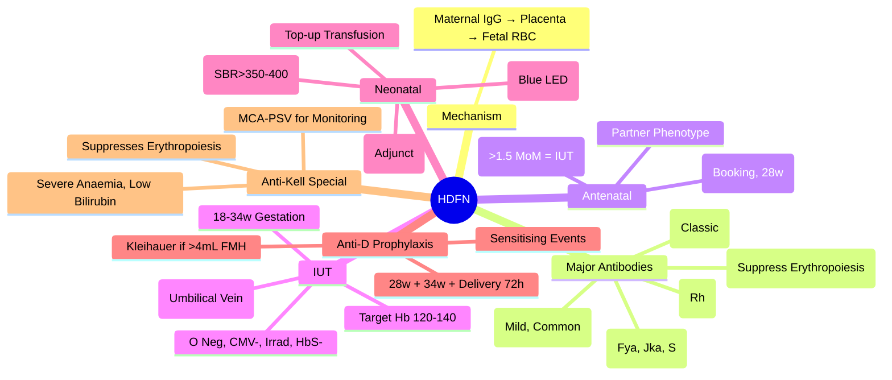

# Foetal & Neonatal Transfusion / Haemolytic Disease of Fetus and Newborn (HDFN)

> [!info] **Davidson Ch 25 Alignment**: Transfusion Medicine → Neonatal/Paediatric Transfusion / HDFN
> **FCPS/MRCP Focus**: Anti-D, ABO incompatibility, Intrauterine transfusion (IUT), Phototherapy, Exchange transfusion, Anti-D prophylaxis, Cord blood management

---

## 🎯 Learning Objectives

- [ ] Define **HDFN**: **Maternal alloantibody** (IgG) → **Crosses placenta** → **Fetal RBC destruction** → **Anaemia, Hydrops, Kernicterus**
- [ ] Identify **Main Causes**: **Anti-D (RhD)**, **Anti-c, Anti-E, Anti-Kell**, **ABO Incompatibility**
- [ ] Apply **Anti-D Prophylaxis**: **Routine 28w + 34w**, **Post-delivery (72h)**, **Sensitising events**
- [ ] Manage **Anaemic Fetus**: **Intrauterine Transfusion (IUT)** - **Intravascular (IVT)** preferred
- [ ] Manage **Neonate**: **Phototherapy**, **Exchange Transfusion**, **IVIG**, **Tin Mesoporphyrin**
- [ ] Prevent **Kernicterus**: **Bilirubin thresholds**, **Phototherapy**, **Exchange Transfusion**
- [ ] Manage **Kell Sensitisation**: **Suppressed erythropoiesis** → Anaemia without hyperbilirubinaemia

---

## 📖 Definition & Aetiology

```mermaid
flowchart TD
    A[Maternal Sensitisation] --> B[IgG Alloantibody Crosses Placenta]
    B --> C[Fetal RBC Destruction]
    C --> D1[Fetal Anaemia → Hydrops Fetalis]
    C --> D2[Bilirubin ↑ → Kernicterus]
    C --> D3[Extramedullary Haematopoiesis → Hepatosplenomegaly]
    
    E[Causes] --> F1[Anti-D (RhD) - Most Common Historically]
    E --> F2[Anti-c, Anti-E (Rh System)]
    E --> F3[Anti-Kell (K) - Suppressed Erythropoiesis]
    E --> F4[ABO Incompatibility (Anti-A/B) - Mild, Early]
    E --> F5[Other: Anti-Fya, Anti-Jka, Anti-S, Anti-M]
```

### Major Alloantibodies

| Antibody | Frequency | Severity | Key Feature |
|----------|-----------|----------|-------------|
| **Anti-D (RhD)** | **Most common severe** | Moderate-Severe | Classic HDFN |
| **Anti-c / Anti-E** | Common | Moderate | Delayed onset |
| **Anti-K (Kell)** | **Increasing** | **Severe Anaemia** | **Suppresses Fetal Erythropoiesis** → **Low Bilirubin** |
| **ABO Incompatibility** | **Most Common Overall** | **Usually Mild** | **Anti-A/B IgG**, Term babies, **First pregnancy possible** |
| **Others (Fyᵃ, Jkᵃ, S, M)** | Rare | Variable | |

> [!tip] **Anti-Kell = Most Dangerous** (Suppresses erythropoiesis → Severe anaemia without hyperbilirubinaemia). **ABO = Most Common but Mild**. **Anti-D = Classic Severe HDFN (Preventable with Anti-D Ig)**.

---

## 🔬 Diagnostic Workup

### Antenatal

```mermaid
flowchart TD
    A[Booking Bloods: Group & Antibody Screen] --> B{**Antibody Positive?**}
    B -->|Yes| C[**Antibody Identification + Titre**]
    C --> D[**Partner Phenotype**]
    D --> E{**Partner Antigen Positive?**}
    E -->|Yes| F[**Fetal Monitoring: MCA-PSV Dopplers**]
    F --> G{**MCA-PSV >1.5 MoM?**}
    G -->|Yes| H[**Intrauterine Transfusion (IUT)**]
    G -->|No| I[**Serial MCA-PSV q1-2wks**]
    E -->|No| J[**Low Risk - Observe**]
    B -->|No| K[**Repeat Antibody Screen at 28w**]
```

### Key Antenatal Investigations

| Test | Purpose |
|------|---------|
| **Maternal Group & Antibody Screen** | **Booking + 28 weeks** |
| **Antibody Identification + Titre** | **Identify specificity & level** |
| **MCA-PSV Doppler** | **Non-invasive** detection of fetal anaemia (**>1.5 MoM = Anaemic**) |
| **Amniotic Fluid ΔOD450** | **Historical** (Liley chart), Replaced by MCA-PSV |
| **Fetal Blood Sampling (Cordocentesis)** | **Confirm anaemia** before IUT (Hb, Group, Direct Coombs) |
| **Amniocentesis (ΔOD450)** | If MCA-PSV unavailable |

---

## 💊 Intrauterine Transfusion (IUT)

### Technique

| Aspect | Details |
|--------|---------|
| **Route** | **Intravascular (IVT)** (Umbilical vein) - **Preferred** |
| **Alternative** | Intraperitoneal (IPT) - Used if IVT not feasible |
| **Donor Blood** | **O Negative, CMV-, Irradiated**, **HbS Negative**, **Hb 70-80 g/L**, **<5 days old** |
| **Volume** | **40-50 mL/kg estimated fetal weight** |
| **Target Fetal Hb** | **120-140 g/L** (Post-transfusion) |
| **Repeat Interval** | **Every 2-4 weeks** until 34-36 weeks |
| **Gestation** | **18-34 weeks** (After 34w → Delivery preferred) |

### Complications

| Complication | Rate | Management |
|--------------|------|------------|
| **Fetal Loss** | **1-2% per procedure** | Experienced operator, Ultrasound guidance |
| **Preterm Labour** | ~5% | Tocolysis |
| **Fetal Bradycardia** | Transient | Monitoring |
| **Chorioamnionitis** | Rare | Antibiotics |
| **Alloimmunisation of Fetus** | Rare | Monitor |

---

## 👶 Neonatal Management

### Phototherapy

| Indication | Threshold (Based on Gestation/Age) |
|------------|-------------------------------------|
| **Term (>37w)** | **>200-250 µmol/L** (≥Day 2) |
| **Preterm <37w** | **Lower thresholds** (e.g., <100 µmol/L at 28w) |
| **ABO HDFN** | **Lower threshold** (Faster rise) |

| Parameter | Details |
|-----------|---------|
| **Light Source** | **Blue LED (460-490 nm)** |
| **Irradiance** | **>30 µW/cm²/nm** |
| **Duration** | **Continuous** (except feeds) |
| **Monitoring** | **SBR q4-6h** (Bilirubin) |
| **Complications** | Dehydration, Rash, Bronze baby syndrome, Retinal damage (eye shields) |

### Exchange Transfusion

| Indication | Threshold |
|------------|-----------|
| **Failure of Phototherapy** | **SBR rising despite intensive PT** |
| **Imminent Kernicterus** | **SBR >350-400 µmol/L** (Term) |
| **Rapidly Rising SBR** | **>8.5 µmol/L/hr** |
| **Signs of Kernicterus** | Hypotonia, High-pitched cry, Seizures |

| Parameter | Details |
|-----------|---------|
| **Volume** | **160 mL/kg** (2x blood volume) |
| **Product** | **Crossmatched, CMV-, Irradiated, HbS-, <7 days old** |
| **Technique** | **Isovolaemic, Push-pull** (5-10 mL aliquots) |
| **Target SBR** | **<50% of pre-exchange level** |

### IVIG

| Indication | Dose |
|------------|------|
| **Severe Immune Haemolysis** (Anti-D, Anti-Kell) | **0.5-1 g/kg IV** (Adjunct to PT/ET) |
| **Mechanism** | **Blocks Fc receptors** on macrophages → ↓ Haemolysis |

---

## 🛡️ Anti-D Prophylaxis (Routine & Post-Event)

| Timing | Dose | Route |
|--------|------|-------|
| **Routine Antenatal** | **500 IU (100 µg)** | **IM at 28 weeks + 34 weeks** |
| **Post-Delivery** | **500 IU (100 µg)** | **IM within 72 hours** |
| **Sensitising Events** | **500 IU** per event | **IM within 72 hours** |

### Sensitising Events Requiring Anti-D

| Event | Timing |
|-------|--------|
| **Delivery** | Within 72 hours |
| **Miscarriage/Termination** | >12 weeks gestation |
| **Ectopic Pregnancy** | At diagnosis |
| **Invasive Procedures** | Amniocentesis, CVS, Cordocentesis, External cephalic version |
| **Trauma/Abdo Injury** | At event |
| **Antepartum Haemorrhage** | At event |
| **Fetal Death/Stillbirth** | At diagnosis |

> [!warning] **Anti-D must be given within 72 hours** (Earlier is better). **Dose: 500 IU (100 µg) IM**. **Kleihauer Test** if >4000 mL FMH suspected.

---

## 🩸 Neonatal Anaemia from HDFN

### Management

| Scenario | Management |
|----------|------------|
| **Mild Anaemia** | **Observation**, **Follic Acid**, **Iron** (after 2 months) |
| **Moderate/Severe Anaemia** (Hb <100 g/L) | **Top-up Transfusion** (10-15 mL/kg, O-Neg, CMV-, Irradiated, HbS-) |
| **Severe Hydrops/Ascites** | **Urgent Delivery** + **IUT** if <34w |
| **Late Anaemia** (3-12 weeks) | **Transfusion** if Hb <80-100 + Symptoms |

---

## 🔬 Anti-Kell HDFN Special Features

| Feature | Anti-Kell HDFN |
|---------|----------------|
| **Mechanism** | **Anti-Kell binds K-precursor cells** → **Suppressed Erythropoiesis** |
| **Key Feature** | **Severe Anaemia** WITHOUT **Marked Hyperbilirubinaemia** |
| **MCA-PSV** | **Elevated** (Anaemia detected) |
| **Bilirubin** | **Normal/Low** (Despite severe anaemia) |
| **Management** | **IUT** (Hb target), **Top-up postnatal** |
| **Risk** | **Kell+ve fetus** → **Severe suppression of erythropoiesis** |

---

## 🔄 Differential Diagnosis

| Condition | Differentiating Features |
|-----------|-------------------------|
| **ABO HDFN** | **Term, Anti-A/B IgG**, Mild, Direct Coombs weak, First pregnancy possible |
| **Rh HDFN** | **Anti-D/c/E**, Severe, Hydrops, **Anti-D prophylaxis prevents** |
| **Kell HDFN** | **Severe Anaemia, Low Bilirubin**, Suppressed erythropoiesis |
| **Physiological Jaundice** | **Day 3-5**, Peak <250 µmol/L, No anaemia, No haemolysis |
| **Breast Milk Jaundice** | **Prolonged (>2wks)**, Breastfed, Normal weight gain |
| **G6PD Deficiency** | **Heinz bodies, Bite cells**, Crisis after oxidant |
| **Sepsis** | **CRP↑, WBC↑/↓, Culture +ve** |

---

## 💡 FCPS/MRCP High-Yield Summary

| Topic | Key Point |
|-------|-----------|
| **HDFN Mechanism** | **Maternal IgG Alloantibody → Fetal RBC Destruction** |
| **Most Severe** | **Anti-Kell** (Suppresses erythropoiesis → Severe anaemia, Low bilirubin) |
| **Most Common Severe** | **Anti-D** (Historically) |
| **Most Common Overall** | **ABO Incompatibility** (Mild, Term, First pregnancy possible) |
| **Prevention** | **Anti-D 500 IU IM at 28w + 34w + Post-delivery 72h** |
| **Sensitising Events** | **Delivery, Miscarriage>12w, Invasive Procedures, Trauma, APH** |
| **Fetal Monitoring** | **MCA-PSV Doppler** (>1.5 MoM = Anaemic) |
| **IUT** | **Intravascular (IVT)**, **O-Neg, CMV-, Irradiated**, Hb 120-140 post-transfusion |
| **Neonatal** | **Phototherapy** (Blue light), **Exchange Transfusion** (SBR >350-400), **IVIG** |
| **Kernicterus** | **Prevented by** Phototherapy/Exchange at correct thresholds |
| **Anti-D Prophylaxis** | **28w + 34w + Post-delivery 72h** + **Sensitising Events** |

---

## ❓ Viva Questions

1. **What is the mechanism of HDFN?**
   - **Maternal IgG alloantibody crosses placenta** → **Binds fetal RBC antigens** → **Haemolysis** → Anaemia, Hydrops, Kernicterus

2. **Why is Anti-Kell HDFN particularly dangerous?**
   - **Anti-Kell binds Kell+ erythroid precursors** → **Suppresses erythropoiesis** → **Severe Anaemia + Low Bilirubin** (Not detectable by jaundice monitoring)

3. **What is the role of MCA-PSV Doppler in HDFN?**
   - **Non-invasive detection of fetal anaemia**; **>1.5 MoM = Anaemic** → Indicates need for IUT

4. **What is the standard Anti-D prophylaxis regimen?**
   - **500 IU IM at 28 weeks + 34 weeks + Post-delivery (within 72 hours)** + **After sensitising events**

5. **When is Intrauterine Transfusion (IUT) indicated?**
   - **MCA-PSV >1.5 MoM** (Fetal anaemia) **before 34 weeks** gestation

6. **What are the indications for Exchange Transfusion in neonatal jaundice?**
   - **SBR >350-400 µmol/L (Term)**, **Rapid rise >8.5 µmol/L/hr**, **Failed Phototherapy**, **Signs of Kernicterus**

7. **What is the mechanism of ABO HDFN and why is it usually mild?**
   - **Maternal Anti-A/B IgG** crosses placenta; **Fetal RBCs have less A/B antigen**; **Usually mild**, occurs in **first pregnancy**

8. **How does Anti-Kell differ from Anti-D HDFN?**
   - **Anti-Kell: Suppresses erythropoiesis → Severe anaemia, Low bilirubin**; **Anti-D: Haemolysis → Anaemia + Jaundice + Hydrops**

9. **What is the routine Anti-D prophylaxis schedule?**
   - **28 weeks IM + 34 weeks IM + Post-delivery (within 72h) + After sensitising events**

10. **What are the indications for post-delivery Anti-D?**
    - **RhD negative mother + RhD positive baby**; **Within 72 hours of delivery**; **Kleihauer Test if FMH >4 mL suspected**

---

## 🧠 Confusions & Mnemonics

| Confusion | Clarification |
|-----------|---------------|
| **Anti-D vs Anti-Kell** | **Anti-D = Haemolysis → Jaundice/Hydrops**; **Anti-Kell = Suppressed Erythropoiesis → Severe Anaemia, Low Bilirubin** |
| **ABO vs Rh HDFN** | **ABO = Mild, Term, First Preg, Direct Coombs Weak**; **Rh = Severe, Hydrops, Preventable** |
| **IUT vs IPT** | **IVT = Intravascular (Umbilical Vein) = Preferred**; **IPT = Intraperitoneal (Rare)** |
| **Phototherapy vs Exchange** | **PT = Bilirubin <Threshold**; **Exchange = SBR >350-400, Rapid Rise, Kernicterus Signs** |
| **Anti-D Timing** | **28w + 34w + Post-partum 72h + Sensitising Events** |

| Mnemonic | Meaning |
|----------|---------|
| **"Anti-Kell = Kills Erythropoiesis = Severe Anaemia + Low Bilirubin"** | Anti-Kell |
| **"MCA-PSV >1.5 MoM = IUT Time"** | Fetal anaemia monitoring |
| **"Anti-D = 28 + 34 + Delivery + Events"** | Prophylaxis schedule |
| **"Kernicterus = Prevent = PT/Exchange at Thresholds"** | Prevention |
| **"ABO HDFN = Mild, Term, First Preg"** | ABO features |
| **"Kell = No Jaundice = Silent Killer"** | Kell features |

---

## 🗺️ Mind Map



---

## 📋 One-Page Revision Card

| **FOETAL & NEONATAL TRANSFUSION / HDFN – FCPS/MRCP REVISION CARD** |
|----------------------------------------------------------------------|
| **Mechanism**: Maternal IgG → Placental Transfer → Fetal RBC Destruction |
| **Anti-Kell**: **Suppresses Erythropoiesis** → Severe Anaemia, **Low Bilirubin** |
| **Anti-D Prophylaxis**: **28w + 34w + Delivery 72h + Sensitising Events** (500 IU IM) |
| **MCA-PSV**: **>1.5 MoM = IUT Indicated** |
| **IUT**: **IVT (Umbilical Vein)**, O Neg/CMV-/Irrad/HbS-, **Target Hb 120-140** |
| **Neonatal**: **Phototherapy** (Blue LED), **Exchange Tx** (SBR>350-400), **IVIG** |
| **Anti-Kell**: **Suppresses Erythropoiesis** → Severe Anaemia, **Low Bilirubin** |
| **ABO HDFN**: Mild, Term, **Direct Coombs Weak**, **First Preg Possible** |
| **Kernicterus Prevention**: PT/Exchange at Thresholds |
| **Sensitising Events**: Delivery, Miscarriage>12w, Amnio/CVS, Trauma, APH |

---

## 📅 Spaced Repetition Tracker

| Review | Date | Score (1-5) | Next Review |
|--------|------|-------------|-------------|
| Day 1 | 2025-06-17 | | 2025-06-18 |
| Day 3 | | | |
| Day 7 | | | |
| Day 15 | | | |
| Day 30 | | | |

---

## 🎯 Must Know / Should Know / Nice to Know

| Level | Content |
|-------|---------|
| **Must Know** | HDFN mechanism, Anti-D prophylaxis schedule, Anti-Kell unique features (suppressed erythropoiesis), MCA-PSV for fetal monitoring, IUT indications & technique, Phototherapy/Exchange thresholds, Kernicterus prevention, Sensitising events, Neonatal management |
| **Should Know** | ABO vs Rh HDFN differences, MCA-PSV physics, IUT technique details (IVT vs IPT), Exchange transfusion technique, Kleihauer test interpretation, IVIG dose in HDFN, Tin mesoporphyrin for kernicterus prevention, Long-term outcomes after IUT, ABO HDFN management |
| **Nice to Know** | Fetal blood sampling techniques, Cord blood bilirubin interpretation, Non-invasive prenatal testing (NIPT) for fetal RhD genotyping, Fetal cardiac function in hydrops, Anti-D pharmacokinetics, Pharmacological alternatives to Anti-D, Novel therapies (FcRn inhibitors), International Anti-D prophylaxis variations |

---

## ✅ Self-Test Scorecard

| Section | Score (0-10) | Notes |
|---------|--------------|-------|
| HDFN Mechanism & Antibodies | | |
| Anti-D Prophylaxis | | |
| Fetal Monitoring (MCA-PSV) | | |
| IUT Technique & Indications | | |
| Neonatal Management | | |
| Anti-Kell Specifics | | |
| Viva Questions | | |

---

## 🔗 Local Navigation

- **Previous**: [[Neonatal Transfusion]]
- **Next**: [[Blood Group Antigens]]
- **Section Hub**: [[Transfusion Medicine]]
- **MOC**: [[Hematology MOC]]
- **Template**: [[../Templates/Hematology Topic Template]]

---

*Generated for FCPS/MRCP exam preparation. Based on Davidson Medicine 24th Ed Chapter 25.*