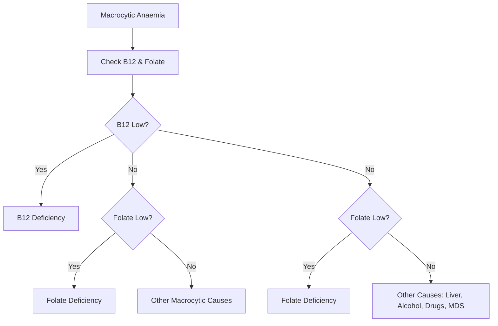

# Folate Deficiency Anaemia

## Learning Objectives
- [ ] Diagnose folate deficiency using serum/red cell folate and homocysteine
- [ ] Differentiate from B12 deficiency (key: NO neurological signs)
- [ ] Identify high-risk groups (pregnancy, alcoholism, malabsorption)
- [ ] Apply folic acid replacement and monitoring
- [ ] Identify FCPS/MRCP high-yield distinctions from B12 deficiency

---

## Definition & Epidemiology

| Feature | Detail |
|---------|--------|
| **Definition** | Megaloblastic anaemia due to impaired DNA synthesis from folate deficiency |
| **Prevalence** | Common in pregnancy, alcoholism, malnutrition, malabsorption |
| **Daily Requirement** | **400 µg/day** (600 µg in pregnancy, 500 µg lactation) |
| **Body Stores** | **5-10 mg** (4-6 months supply) — shorter than B12 |
| **Absorption** | **Proximal Jejunum** (pH dependent, carrier-mediated) |

---

## Aetiology: The "3 Ms" (Malabsorption, Malnutrition, Medication)

| Category | Causes |
|--------|--------|
| **Increased Demand** | **Pregnancy** (600 µg/day), Haemolytic Anaemia, Exfoliative Dermatitis, Haemodialysis |
| **Inadequate Intake** | **Alcoholism**, Elderly, Anorexia, Fad Diets, Goat's Milk (Infants) |
| **Malabsorption** | Coeliac Disease, Tropical Sprue, Short Bowel, Jejunal Resection |
| **Drugs** | **Methotrexate** (DHFR Inhibitor), **Phenytoin**, **Phenobarbital**, **Trimethoprim**, **Sulfasalazine**, **Triamterene**, **Pyrimethamine** |
| **Increased Loss** | Haemodialysis, Peritoneal Dialysis |

> **FCPS/MRCP**: **Pregnancy = Most Common Cause** (Increased Demand + Haemodilution); **Methotrexate = Key Antifolate Drug**.

---

## Clinical Features

| System | Features |
|--------|----------|
| **Haematological** | Identical to B12: Macrocytic Anaemia (MCV >100), Hypersegmented Neutrophils, Macro-ovalocytes |
| **Neurological** | **ABSENT** (No SCD, No Peripheral Neuropathy, No Optic Atrophy) |
| **GI** | Glossitis, Angular Stomatitis, Diarrhoea, Anorexia |
| **Pregnancy** | Neural Tube Defects (NTDs), Preterm Birth, Low Birth Weight |

> **FCPS/MRCP**: **MAJOR DIFFERENCE FROM B12: NO NEUROLOGICAL SIGNS** — No SCD, No Peripheral Neuropathy, No Optic Atrophy.

---

## B12 vs Folate Deficiency: The Critical Differences

```mermaid
flowchart TD
    A[Megaloblastic Anaemia] --> B{Neurological Signs?}
    B -->|YES (SCD, Peripheral Neuropathy, Optic Atrophy)| A[B12 Deficiency]
    B -->|NO| B{Folate Levels}
    B -->|Low Folate| C[Folate Deficiency]
    B -->|Normal Folate| D[Consider B12 Deficiency with Normal MMA?]
```

### Comparison Table

| Feature | **B12 Deficiency** | **Folate Deficiency** |
|---------|-------------------|----------------------|
| **MCV** | >100 (often >110) | >100 (often 100-110) |
| **Neurological Signs** | **YES (SCD)** — Posterior/Lateral Columns | **ABSENT** |
| **Serum B12** | Low (<150-200 pg/mL) | Normal |
| **Serum Folate** | Normal/High | **Low (<3 ng/mL / 7 nmol/L)** |
| **RBC Folate** | Normal | **Low (<140 ng/mL / 317 nmol/L)** |
| **MMA** | **Elevated** | **Normal** |
| **Homocysteine** | **Elevated** | **Elevated** |
| **Neurology** | **SCD (Posterior + Lateral Columns)** | **ABSENT** |
| **Peripheral Neuropathy** | Common | Absent |
| **Optic Atrophy** | Possible | Absent |
| **Pregnancy Risk** | Not specific | **High** (NTDs, Preterm, LBW) |

> **FCPS/MRCP**: **KEY DIFFERENTIATOR = Neurological Signs (SCD) = B12 ONLY**. MMA Elevated = B12 Only.

---

## Aetiology: Common Causes

| Category | Specific Causes |
|--------|-----------------|
| **Increased Demand** | **Pregnancy (600 µg/day)**, Haemolysis, Exfoliative Dermatitis, Haemodialysis |
| **Inadequate Intake** | **Alcoholism**, Elderly, Poor Diet, Goat's Milk (Infants) |
| **Malabsorption** | Coeliac Disease, Tropical Sprue, Jejunal Resection, Short Bowel |
| **Drugs (Antifolates)** | **Methotrexate**, **Phenytoin**, **Phenobarbital**, **Trimethoprim**, **Sulfasalazine**, **Pyrimethamine** |
| **Increased Loss** | Haemodialysis, Haemolytic Anaemia |

---

## Diagnostic Approach



### Key Investigations

| Test | Folate Deficiency | B12 Deficiency |
|------|-------------------|----------------|
| **Serum Folate** | **<3 ng/mL (7 nmol/L)** | Normal |
| **RBC Folate** | **<140 ng/mL (317 nmol/L)** | Normal |
| **Serum B12** | Normal | **Low (<150-200 pg/mL)** |
| **MMA** | **Normal** | **Elevated** |
| **Homocysteine** | **Elevated** | **Elevated** |
| **Neurological Signs** | **Absent** | **Present (SCD)** |

> **FCPS/MRCP**: **RBC Folate > Serum Folate** — RBC Folate reflects longer-term stores (less affected by recent diet).

---

## Folate vs B12 Deficiency: The Critical Differences

| Feature | **Folate Deficiency** | **B12 Deficiency** |
|---------|---------------------|---------------------|
| **Neurological Signs** | **ABSENT** | **PRESENT (SCD)** |
| **Serum Folate** | **Low (<3 ng/mL)** | Normal |
| **RBC Folate** | **Low (<140 ng/mL)** | Normal |
| **Serum B12** | Normal | **Low (<150-200 pg/mL)** |
| **MMA** | **Normal** | **Elevated** |
| **Homocysteine** | **Elevated** | **Elevated** |
| **Neurology** | **Absent** | **SCD (Posterior + Lateral Columns)** |
| **Pregnancy** | **High Risk (NTDs)** | Lower Risk |
| **Drug Cause** | **Methotrexate** (DHFR Inhibitor) | **Metformin, PPI** |

> **FCPS/MRCP**: **KEY EXAM DIFFERENTIATOR = Neurological Signs (SCD = B12 ONLY)**.

---

## Diagnostic Algorithm

```mermaid
flowchart TD
    A[Macrocytic Anaemia (MCV >100)] --> B[Check B12 & Folate]
    B --> C{B12 Low?}
    C -->|Yes| D[B12 Deficiency]
    C -->|No| E{Folate Low?}
    E -->|Yes| F[Folate Deficiency]
    E -->|No| G[Other Causes: Alcohol, Liver, MDS, Hypothyroid, Drugs]
    B -->|Borderline| H[Check MMA & Homocysteine]
    H --> I{MMA Elevated?}
    I -->|Yes| J[B12 Deficiency]
    I -->|No| K[Folate Deficiency if Folate Low]
```

---

## Folic Acid Supplementation

### Treatment
| Scenario | Dose | Duration |
|---------|------|----------|
| **Deficiency** | **5 mg Daily** | **4 Months** (or until cause corrected) |
| **Pregnancy Prevention** | **400 µg Daily** | Pre-conception → 12 Weeks Gestation |
| **High-Risk Pregnancy** (Previous NTD) | **5 mg Daily** | Pre-conception → 12 Weeks |
| **Methotrexate Use** | **5 mg Weekly** (24h After MTX) | Duration of MTX Therapy |

### Monitoring
| Parameter | Timeline | Target |
|---------|----------|--------|
| **Reticulocytosis** | Days 3-5 | Peak Day 7-10 |
| **Hb Rise** | **≥20 g/L by Week 3** | Hb Normalisation 6-8 Weeks |
| **MCV Normalisation** | 8-12 Weeks | MCV <100 fL |
| **Serum/RBC Folate** | 4 Weeks | Normalisation |

---

## Special Situations

### Pregnancy
| Aspect | Detail |
|--------|--------|
| **Requirement** | **600 µg/day** (Diet + Supplement) |
| **Supplement** | **400 µg Daily** (Pre-conception → 12 Weeks) |
| **High Risk** (Previous NTD) | **5 mg Daily** (Pre-conception → 12 Weeks) |
| **Lactation** | **500 µg/day** |

### Methotrexate (Antifolate)
| Aspect | Detail |
|-------|--------|
| **Mechanism** | **DHFR Inhibitor** → Blocks Tetrahydrofolate Synthesis |
| **Rescue** | **Folinic Acid (Leucovorin)** — 24h Post-MTX |
| **Folic Acid** | **5 mg Weekly** (24h Post-MTX) — Prevents Toxicity |

### Alcoholism
| Feature | Detail |
|--------|--------|
| **Mechanism** | Poor Intake + Malabsorption + Hepatic Storage ↓ |
| **MCV** | Often >105 (Alcohol Direct Toxicity + Folate Def) |
| **Management** | Thiamine + Folate + Alcohol Cessation |

---

## FCPS/MRCP High-Yield Summary

| Concept | Key Points |
|---------|------------|
| **Key Differentiator** | **Neurological Signs = B12 ONLY**; Folate = NO Neuro |
| **MMA** | **Normal in Folate Def** (↑ in B12 Def) |
| **Homocysteine** | **Elevated in BOTH** |
| **RBC Folate vs Serum** | **RBC Folate > Serum** (Long-term Store) |
| **Pregnancy** | **400 µg Pre-conception → 12 Weeks**; High Risk = **5mg** |
| **Methotrexate Rescue** | **Leucovorin (Folinic Acid)** 24h Post-MTX |
| **Drug Causes** | **Methotrexate, Phenytoin, Trimethoprim, Sulfasalazine** |
| **Pregnancy Complications** | **NTDs, Preterm, LBW** — Prevented by Pre-conception Folate |

---

## Viva Questions

1. **How do you differentiate Folate from B12 Deficiency?**
2. **Why does Folate Deficiency NOT cause neurological signs?**
3. **What is the role of MMA and Homocysteine in differentiation?**
3. **What is the Folic Acid dose in Pregnancy? When to start?**
4. **What is Leucovorin Rescue? When is it used?**
4. **Which Drugs Cause Folate Deficiency?**
5. **Why is Folate Important in Pregnancy?**
5. **How do you Monitor Response to Folic Acid?**
6. **What is the Serum vs RBC Folate Difference?**
6. **Why is Folate Safe in Pregnancy but B12 Requires Caution?**
7. **What is the Role of Folinic Acid in Methotrexate Therapy?**
8. **How do Alcohol and Folate Deficiency Interact?**

---

## Confusions & Mnemonics

| Confusion | Clarification |
|-----------|---------------|
| B12 vs Folate Neuro | **B12 = SCD (Posterior + Lateral Columns)**; **Folate = NO Neuro** |
| MMA vs Homocysteine | **MMA ↑ = B12 ONLY**; **Homocysteine ↑ = BOTH** |
| Serum vs RBC Folate | **RBC Folate = Long-term Store**; Serum = Recent Intake |
| Folate in Pregnancy | **400 µg Pre-conception → 12 Weeks**; High Risk = **5mg** |
| Methotrexate Toxicity | **DHFR Inhibitor** → **Leucovorin Rescue (24h Post-MTX)** |
| Alcohol + Folate | **Alcohol → Malabsorption + Hepatic Storage ↓ + Direct Toxicity** |
| Megaloblastic Anaemia | **Both Cause**; Differentiate by **Neurology + MMA** |
| RBC vs Serum Folate | **RBC = Long-term Store**; More Reliable |

---

## Mind Map

```mermaid
mindmap
  root((Folate Deficiency))
    Aetiology
      Increased Demand: Pregnancy, Haemolysis, Dialysis
      Inadequate Intake: Alcohol, Elderly, Poor Diet
      Malabsorption: Coeliac, Sprue, Short Bowel
      Drugs: Methotrexate, Phenytoin, Trimethoprim, Sulfasalazine
    Clinical
      Macrocytic Anaemia (MCV >100)
      NO Neurological Signs
      Glossitis, Diarrhoea
      Pregnancy: NTDs, Preterm, LBW
    Diagnosis
      Serum Folate <3 ng/mL
      RBC Folate <140 ng/mL
      B12 Normal
      MMA Normal, Homocysteine ↑
    Differentiation from B12
      NO Neurological Signs
      MMA Normal
      Homocysteine ↑ (Both)
    Treatment
      Folic Acid 5mg Daily × 4 Months
      Pregnancy: 400µg (Preconception) → 5mg if High Risk
      MTX Rescue: Leucovorin 24h Post-MTX
    Pregnancy
      400µg Preconception → 12 Weeks
      High Risk (Prev NTD): 5mg Daily
```

---

## One-Page Revision Card

| **Folate Deficiency** | **Key Features** |
|-----------------------|------------------|
| **MCV** | >100 fL (Macrocytic) |
| **Neurology** | **ABSENT** (No SCD) |
| **Serum Folate** | <3 ng/mL (7 nmol/L) |
| **RBC Folate** | <140 ng/mL (317 nmol/L) |
| **B12** | Normal |
| **MMA** | **Normal** |
| **Homocysteine** | **Elevated** |
| **B12** | Normal |

| **Folate vs B12** | **Folate** | **B12** |
|-------------------|-----------|---------|
| **Neurology** | **Absent** | **SCD (Posterior + Lateral)** |
| **MMA** | Normal | **Elevated** |
| **Homocysteine** | ↑ | ↑ |
| **Pregnancy Risk** | **NTDs, Preterm, LBW** | Lower |

| **Treatment** | **Dose** | **Duration** |
|---------------|----------|--------------|
| Deficiency | 5 mg Daily | 4 Months |
| Pregnancy (Low Risk) | 400 µg Daily | Pre-conception → 12 Weeks |
| Pregnancy (High Risk) | 5 mg Daily | Pre-conception → 12 Weeks |
| Methotrexate Rescue | Leucovorin 24h Post-MTX | Per Cycle |

| **Drug Causes** | |
|-----------------|--|
| Methotrexate (DHFR Inhibitor) | |
| Phenytoin/Phenobarbital | |
| Trimethoprim/Sulfasalazine/Pyrimethamine | |

---

## Spaced Repetition Tracker

| Day | 1 | 3 | 7 | 15 | 30 |
|-----|---|---|---|----|----|
| B12 vs Folate Neuro | ☐ | ☐ | ☐ | ☐ | ☐ |
| MMA vs Homocysteine | ☐ | ☐ | ☐ | ☐ | ☐ |
| Pregnancy Folic Acid Dose | ☐ | ☐ | ☐ | ☐ | ☐ |
| Serum vs RBC Folate | ☐ | ☐ | ☐ | ☐ | ☐ |
| MTX Rescue | ☐ | ☐ | ☐ | ☐ | ☐ |

---

## Self-Test Scorecard

| Question | My Answer | Correct? |
|----------|-----------|----------|
| B12 vs Folate Neurology |  |  |
| MMA Result in Folate Def |  |  |
| Folic Acid Dose Pregnancy |  |  |
| RBC vs Serum Folate |  |  |
| MTX Rescue Drug |  |  |

---

## Local Navigation

- [[Anaemia and Red Cell Disorders/Macrocytic Anaemia|Macrocytic Anaemia Overview]]
- [[Anaemia and Red Cell Disorders/Vitamin B12 Deficiency Anaemia|B12 Deficiency]]
- [[Anaemia and Red Cell Disorders/Megaloblastic Anaemia|Megaloblastic Anaemia Overview]]
- [[Obstetrics/Neural Tube Defects|NTD Prevention]]
---

> Auto-generated study sections for "Hematology" — Ch 24: Haematology & Transfusion Medicine.

## Flashcards (27 generated)

- Q: What is the definition of Hematology?
  A: Megaloblastic anaemia due to impaired DNA synthesis from folate deficiency
- Q: What is the epidemiology of Hematology?
  A: Common in pregnancy, alcoholism, malnutrition, malabsorption
- Q: What is Daily Requirement of Hematology?
  A: 400 µg/day (600 µg in pregnancy, 500 µg lactation)
- Q: What is Body Stores of Hematology?
  A: 5-10 mg (4-6 months supply) — shorter than B12
- Q: What is Absorption of Hematology?
  A: Proximal Jejunum (pH dependent, carrier-mediated)
- Q: What is the mechanism of Hematology?
  A: DHFR Inhibitor → Blocks Tetrahydrofolate Synthesis
- Q: What is Rescue of Hematology?
  A: Folinic Acid (Leucovorin) — 24h Post-MTX
- Q: What is Folic Acid of Hematology?
  A: 5 mg Weekly (24h Post-MTX) — Prevents Toxicity
- Q: What is the mechanism of Hematology?
  A: Poor Intake + Malabsorption + Hepatic Storage ↓
- Q: What is MCV of Hematology?
  A: Often >105 (Alcohol Direct Toxicity + Folate Def)
- Q: How is Hematology managed?
  A: Thiamine + Folate + Alcohol Cessation
- Q: What is Requirement of Hematology?
  A: 600 µg/day (Diet + Supplement)
- Q: What is Supplement of Hematology?
  A: 400 µg Daily (Pre-conception → 12 Weeks)
- Q: What is High Risk (Previous NTD) of Hematology?
  A: 5 mg Daily (Pre-conception → 12 Weeks)
- Q: What is the mechanism of Hematology?
  A: DHFR Inhibitor → Blocks Tetrahydrofolate Synthesis
- Q: What is Rescue of Hematology?
  A: Folinic Acid (Leucovorin) — 24h Post-MTX
- Q: What is the mechanism of Hematology?
  A: Poor Intake + Malabsorption + Hepatic Storage ↓
- Q: What is MCV of Hematology?
  A: Often >105 (Alcohol Direct Toxicity + Folate Def)
- Q: How is Hematology managed?
  A: Thiamine + Folate + Alcohol Cessation
- Q: What is Key Differentiator of Hematology?
  A: Neurological Signs = B12 ONLY; Folate = NO Neuro
- Q: What is MMA of Hematology?
  A: Normal in Folate Def (↑ in B12 Def)
- Q: What is Homocysteine of Hematology?
  A: Elevated in BOTH
- Q: What is RBC Folate vs Serum of Hematology?
  A: RBC Folate > Serum (Long-term Store)
- Q: What is Pregnancy of Hematology?
  A: 400 µg Pre-conception → 12 Weeks; High Risk = 5mg
- Q: What is Methotrexate Rescue of Hematology?
  A: Leucovorin (Folinic Acid) 24h Post-MTX
- Q: What causes Hematology?
  A: Methotrexate, Phenytoin, Trimethoprim, Sulfasalazine
- Q: What are the complications of Hematology?
  A: NTDs, Preterm, LBW — Prevented by Pre-conception Folate

## MCQs (1 generated)

1. **Which of the following best describes Hematology?**
   A. **## Aetiology: The "3 Ms" (Malabsorption, Malnutrition, Medication)**
   B. An unrelated condition not matching the clinical picture of Hematology
   C. A complication seen late in the disease course of Hematology
   D. A condition that mimics Hematology but has a different underlying cause

## SBA Questions (1 generated)

1. A patient with suspected Hematology presents with: Definition — Megaloblastic anaemia due to impaired DNA synthesis from folate deficiency; Prevalence — Common in pregnancy, alcoholism, malnutrition, malabsorption; Daily Requirement — 400 µg/day (600 µg in pregnancy, 500 µg lactation). What is the most likely diagnosis?
   A. **Hematology**
   B. A condition that mimics Hematology but is not the same entity
   C. A complication of Hematology rather than the primary diagnosis
   D. An unrelated condition in the same clinical category as Hematology

