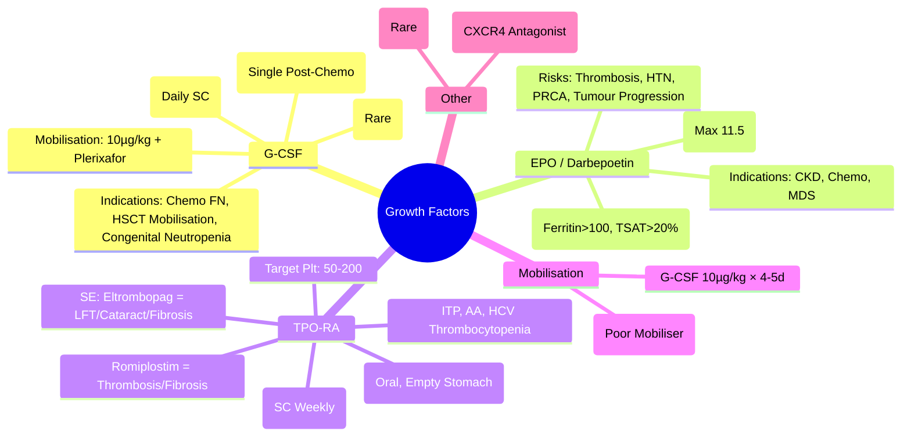

# G-CSF & Growth Factors

> [!info] **Davidson Ch 25 Alignment**: Supportive Care in Haematology → Growth Factors
> **FCPS/MRCP Focus**: G-CSF (Filgrastim/Pegfilgrastim), Erythropoietin (EPO), Thrombopoietin Receptor Agonists (Eltrombopag/Romiplostim), indications, dosing, monitoring, side effects

---

## 🎯 Learning Objectives

- [ ] **G-CSF (Filgrastim/Pegfilgrastim)**: Indications (Chemotherapy-induced neutropenia, HSCT mobilisation, Congenital neutropenia, AA), Dosing, Monitoring (CBC), Side Effects (Bone pain, Splenic rupture)
- [ ] **Erythropoietin (EPO / Darbepoetin)**: Indications (CKD Anaemia, Chemo-induced Anaemia, MDS, Prematurity), Dosing, Target Hb (10-11 g/dL), Risks (Thrombosis, Hypertension, Pure Red Cell Aplasia)
- [ ] **Thrombopoietin Receptor Agonists (Eltrombopag/Romiplostim)**: Indications (ITP, AA, Hepatitis C Thrombocytopenia), Dosing, Monitoring (Platelets, LFT, Fibrosis), Side Effects
- [ ] **Other Growth Factors**: GM-CSF, IL-3, IL-11 (Historical/Investigational)

---

## 📖 Granulocyte Colony-Stimulating Factor (G-CSF)

### Products

| Agent | Type | Half-Life | Dosing Frequency |
|-------|------|-----------|------------------|
| **Filgrastim** | **Recombinant Human G-CSF** (Non-PEGylated) | 3-4 hours | **Daily SC** |
| **Pegfilgrastim** | **PEGylated Filgrastim** | 15-80 hours | **Single SC per Cycle** (24-72h post-chemo) |
| **Biosimilars** | Available for Both | Similar | Same |

### Indications

| Indication | Dose & Duration |
|------------|-----------------|
| **Primary Prophylaxis (Febrile Neutropenia Risk >20%)** | **Pegfilgrastim 6mg SC once per cycle** (Day 2-3 post-chemo) OR **Filgrastim 5 µg/kg/day SC** from Day 2 until ANC >10×10⁹/L |
| **Secondary Prophylaxis (Prior FN)** | Same as Primary |
| **Stem Cell Mobilisation (Autologous HSCT)** | **Filgrastim 10 µg/kg/day SC** × 4-5 days ± **Plerixafor** (If Poor Mobiliser) |
| **Stem Cell Mobilisation (Allogeneic Donor)** | **Filgrastim 10 µg/kg/day SC** × 4-5 days |
| **Congenital Neutropenia (Kostmann)** | **Filgrastim 5-10 µg/kg/day SC Long-term** |
| **Aplastic Anaemia** | **Not Routine** (May Stimulate Clones); Consider If Severe Infection |

### Key Monitoring & Side Effects

| Parameter | Frequency | Action |
|-----------|-----------|--------|
| **CBC (ANC)** | **Daily** during mobilisation; **q1-2wk** during prophylaxis | **Target ANC >1.0-2.0**; Hold if ANC >50-70 (Pegfilgrastim) |
| **Bone Pain** | Common (70-80%) | **Paracetamol, NSAIDs, Loratadine (Antihistamine)** |
| **Splenic Rupture** | Rare (<0.1%) | **Left Upper Quadrant Pain, Hypotension** → **Emergency Splenectomy** |
| **Capillary Leak Syndrome** | Rare | **Hypotension, Oedema, Haemoconcentration** → Stop G-CSF |
| **Leukocytosis** | Common | Adjust Dose if WBC >50-100 |

> [!tip] **Pegfilgrastim = Single Dose per Cycle (Convenient)**; **Filgrastim = Daily Until ANC Recovery**. **Bone Pain = Most Common SE**. **Splenic Rupture = Rare but Fatal**.

---

## 🩸 Erythropoietin (EPO) & Darbepoetin

### Products

| Agent | Type | Half-Life | Dosing Frequency |
|-------|------|-----------|------------------|
| **Epoetin Alfa/Beta** | Recombinant Human EPO | 4-13 hours (IV) | **1-3x Weekly SC/IV** |
| **Darbepoetin Alfa** | **Hyperglycosylated EPO** (Long-acting) | **21-25 hours** | **Weekly to Monthly SC** |
| **Methoxy PEG-Epoetin Beta** | **PEGylated EPO** | ~130 hours | **Monthly SC** |

### Indications & Target Hb

| Indication | Target Hb | Max Hb |
|------------|-----------|--------|
| **CKD Anaemia (Dialysis/Non-Dialysis)** | **10-11 g/dL** | **≤11.5 g/dL** (Avoid >11.5 – ↑ Stroke/Thrombosis/CV Death) |
| **Chemotherapy-Induced Anaemia** | **10-12 g/dL** | **≤12 g/dL** |
| **MDS (Lower Risk)** | **10-11 g/dL** | **≤11.5 g/dL** |
| **Prematurity (Anaemia of Prematurity)** | **10-12 g/dL** | Individualised |

> [!warning] **ESA Risks**: **Thrombosis (VTE/Arterial)**, **Hypertension**, **Pure Red Cell Aplasia (Anti-EPO Antibodies – Rare, Epoetin)**, **Tumour Progression (Chemo Setting)**. **Iron Repletion First** (Ferritin >100, TSAT >20%).

### Dosing & Monitoring

| Parameter | CKD (Dialysis) | CKD (Non-Dialysis) | Chemo-Induced |
|-----------|----------------|-------------------|---------------|
| **Epoetin Start** | 50-100 IU/kg IV 1-3x/wk | 50-100 IU/kg SC 1-3x/wk | 150 IU/kg SC 3x/wk OR 40,000 IU SC weekly |
| **Darbepoetin Start** | 0.45 µg/kg IV q2wk | 0.45 µg/kg SC q2-4wk | 2.25 µg/kg SC q2wk OR 500 µg SC q3wk |
| **Monitor** | **Hb q2wk (Titration)**, **BP, Iron (Ferritin/TSAT q1-3mo), Reticulocytes** | | |
| **Dose Adjust** | **Hb Rise >1 g/dL in 2wk → ↓ 25%**; **Hb >11.5 → Hold** | | |

---

## 🩸 Thrombopoietin Receptor Agonists (TPO-RA)

### Products

| Agent | Type | Route | Half-Life | Dosing |
|-------|------|-------|-----------|--------|
| **Eltrombopag** | **Small Molecule TPO-RA** | **Oral** | 20-30 hours | **Once Daily** (Empty Stomach) |
| **Romiplostim** | **Fc-Peptide Fusion Protein** | **SC** | 3-5 days | **Weekly SC** |
| **Avatrombopag** | **Small Molecule TPO-RA** | **Oral** | ~20 hours | **Once Daily** |

### Indications

| Condition | Eltrombopag | Romiplostim |
|-----------|-------------|-------------|
| **ITP (Refractory)** | **First-line 2nd Line** (50mg OD) | **First-line 2nd Line** (1-10 µg/kg SC weekly) |
| **Aplastic Anaemia (Add-on)** | **150 mg OD (100mg if Asian)** with IST | Not Standard |
| **Hepatitis C Thrombocytopenia** | **Effective** | Not Indicated |
| **MDS (Thrombocytopenia)** | Investigational | Not Standard |

### Key Monitoring & Side Effects

| Parameter | Eltrombopag | Romiplostim |
|-----------|-------------|-------------|
| **Platelets** | **Weekly** until stable, then **Monthly** | **Weekly** until stable, then **Monthly** |
| **Target Platelet** | **50-200 ×10⁹/L** | **50-200 ×10⁹/L** |
| **LFT** | **Monthly** (Hepatotoxicity) | Not Routine |
| **Ophthalmology** | **Baseline + Annual** (Cataract Risk) | Not Required |
| **Bone Marrow Fibrosis** | **Long-term Risk** | Long-term Risk |
| **Key Side Effects** | **Hepatotoxicity, Cataract, Thrombosis, Bone Marrow Fibrosis** | **Thrombosis, Headache, Bone Pain, Fibrosis** |

> [!warning] **Eltrombopag: Take Empty Stomach (2h before/4h after Food/Ca/Mg/Al)**. **Dose Reduce in Hepatic Impairment (Child-Pugh B/C: 25mg OD)**. **Asian/Elderly: 25mg OD Start**.

---

## 🧪 Other Growth Factors (Overview)

| Agent | Status | Notes |
|-------|--------|-------|
| **GM-CSF (Sargramostim)** | Approved (AML Post-Chemo, HSCT Mobilisation) | Less Used Than G-CSF; More Side Effects (Fever, Capillary Leak) |
| **IL-3, IL-6, IL-11** | Investigational / Historical | Not Standard Clinical Use |
| **Plerixafor (CXCR4 Antagonist)** | **Stem Cell Mobilisation** (with G-CSF) | **240 µg/kg SC**; Used if Poor Mobiliser on G-CSF Alone |

---

## 💡 FCPS/MRCP High-Yield Summary

| Topic | Key Point |
|-------|-----------|
| **G-CSF (Filgrastim)** | **Daily SC**; **Pegfilgrastim = Single Dose/Cycle**; **Indications**: Chemo FN Prophylaxis, HSCT Mobilisation, Congenital Neutropenia |
| **Pegfilgrastim Timing** | **24-72h POST Chemo** (NOT same day) |
| **G-CSF Side Effects** | **Bone Pain** (Loratadine helps), **Splenic Rupture** (Rare, LUQ Pain → Emergency) |
| **EPO/Darbepoetin** | **Target Hb 10-11 g/dL**; **Max 11.5 g/dL**; **Iron First (Ferritin >100, TSAT >20%)** |
| **ESA Risks** | **Thrombosis, HTN, PRCA (Anti-EPO Ab), Tumour Progression** |
| **TPO-RA (Eltrombopag/Romiplostim)** | **ITP 2nd Line, AA Add-on, HCV Thrombocytopenia**; **Target Plt 50-200** |
| **Eltrombopag** | **Oral, Empty Stomach**, **LFT Monthly, Cataract Annual, Fibrosis Risk** |
| **Romiplostim** | **SC Weekly**, **No Food Restriction**, **No LFT Monitoring**, **Fibrosis Risk** |
| **Plerixafor** | **CXCR4 Antagonist** + G-CSF for **Poor Mobilisers** |

---

## ❓ Viva Questions

1. **What is the difference between Filgrastim and Pegfilgrastim?**
   - **Filgrastim = Daily SC**; **Pegfilgrastim = PEGylated, Single Dose/Cycle (24-72h Post-Chemo)**

2. **When do you give Pegfilgrastim in relation to chemotherapy?**
   - **24-72 Hours AFTER Chemotherapy Completion** (NOT same day)

3. **What are the indications for Erythropoietin in CKD?**
   - **Anaemia (Hb <10 g/dL)**, **Iron Replete (Ferritin >100, TSAT >20%)**, **Target Hb 10-11 g/dL**, **Max 11.5 g/dL**

4. **What are the major risks of ESA therapy?**
   - **Thrombosis (VTE/Arterial)**, **Hypertension**, **Pure Red Cell Aplasia (Anti-EPO Ab)**, **Tumour Progression**

5. **How do you monitor Eltrombopag therapy?**
   - **Platelets Weekly → Monthly**; **LFT Monthly** (Hepatotoxicity); **Ophthalmology Annual** (Cataract); **Target Platelets 50-200**

6. **What is the key dietary restriction for Eltrombopag?**
   - **Take on Empty Stomach: 2h Before or 4h After Food/Calcium/Magnesium/Aluminium**

7. **What is the role of Plerixafor in stem cell mobilisation?**
   - **CXCR4 Antagonist**; **Used with G-CSF for Poor Mobilisers**; **240 µg/kg SC Once Daily** (Up to 4 Doses)

8. **What are the main side effects of G-CSF?**
   - **Bone Pain (70-80%)**, **Splenic Rupture (Rare, LUQ Pain → Emergency)**, **Leukocytosis**, **Capillary Leak (Rare)**

9. **Differentiate Darbepoetin from Epoetin.**
   - **Darbepoetin = Hyperglycosylated, Longer Half-Life (21-25h vs 4-13h), Less Frequent Dosing (Weekly/Monthly vs 1-3x Weekly)**

10. **What is the target platelet count for TPO-RA therapy?**
    - **50-200 ×10⁹/L** (Avoid >200 – Thrombosis Risk)

---

## 🧠 Confusions & Mnemonics

| Confusion | Clarification |
|-----------|---------------|
| **G-CSF vs GM-CSF** | **G-CSF = Neutrophil Specific**; **GM-CSF = Multi-lineage (More Side Effects)** |
| **Filgrastim vs Pegfilgrastim** | **Pegfilgrastim = Single Dose Post-Chemo**; **Filgrastim = Daily Until ANC Recovery** |
| **EPO vs Darbepoetin** | **Darbepoetin = Longer Half-Life, Less Frequent Dosing** |
| **Eltrombopag vs Romiplostim** | **Eltrombopag = Oral, Empty Stomach, LFT Monitor**; **Romiplostim = SC Weekly, No Food Restriction** |
| **ESA Target Hb** | **CKD = 10-11, Max 11.5**; **Chemo = 10-12, Max 12** |
| **TPO-RA Target** | **Plt 50-200**; Avoid >200 (Thrombosis) |

| Mnemonic | Meaning |
|----------|---------|
| **"Pegfilgrastim = Post-Chemo (24-72h)"** | Timing |
| **"G-CSF = Bone Pain = Loratadine"** | Side Effect |
| **"ESA = Iron First, Hb 10-11, Max 11.5"** | ESA Protocol |
| **"Eltrombopag = Empty Stomach, LFT Monthly"** | Eltrombopag |
| **"Romiplostim = SC Weekly, No Food Issues"** | Romiplostim |
| **"Plerixafor = Poor Mobiliser + G-CSF"** | Mobilisation |
| **"G-CSF = Splenic Rupture (Rare, LUQ Pain)"** | Emergency |

---

## 🗺️ Mind Map

---

## 📋 One-Page Revision Card

| **G-CSF & GROWTH FACTORS – FCPS/MRCP REVISION CARD** |
|--------------------------------------------------------|
| **G-CSF**: Filgrastim (Daily), Pegfilgrastim (Single 24-72h Post-Chemo) |
| **Indications**: Chemo FN Prophylaxis, HSCT Mobilisation, Congenital Neutropenia |
| **SE**: **Bone Pain (Loratadine)**, **Splenic Rupture (LUQ Pain = Emergency)** |
| **EPO/Darbepoetin**: **Iron First (Ferritin>100, TSAT>20%)**, Target **Hb 10-11, Max 11.5** |
| **ESA Risks**: **Thrombosis, HTN, PRCA, Tumour Progression** |
| **TPO-RA**: **Eltrombopag (Oral, Empty Stomach, LFT Monthly, Cataract Annual)**; **Romiplostim (SC Weekly)** |
| **Target Plt**: **50-200**; **Eltrombopag: LFT Monthly, Cataract Annual** |
| **Plerixafor**: **CXCR4 Antagonist**, Poor Mobiliser + G-CSF |
| **G-CSF SE**: **Bone Pain (Loratadine)**, **Splenic Rupture (LUQ Pain = Emergency)** |

---

## 📅 Spaced Repetition Tracker

| Review | Date | Score (1-5) | Next Review |
|--------|------|-------------|-------------|
| Day 1 | 2025-06-16 | | 2025-06-17 |
| Day 3 | | | |
| Day 7 | | | |
| Day 15 | | | |
| Day 30 | | | |

---

## 🎯 Must Know / Should Know / Nice to Know

| Level | Content |
|-------|---------|
| **Must Know** | G-CSF types (Filgrastim vs Pegfilgrastim), Pegfilgrastim timing (24-72h post-chemo), FN prophylaxis indications, HSCT mobilisation (G-CSF + Plerixafor), EPO/Darbepoetin indications & Hb targets, ESA risks (thrombosis, HTN, PRCA), Iron repletion before ESA, TPO-RA (Eltrombopag vs Romiplostim) indications, Eltrombopag empty stomach/LFT monitoring, target platelet count 50-200, Plerixafor for poor mobilisers, G-CSF side effects (bone pain, splenic rupture) |
| **Should Know** | Filgrastim vs pegfilgrastim pharmacokinetics, G-CSF in aplastic anaemia (controversial), Darbepoetin vs epoetin dosing, ESA in MDS (lower risk), PRCA from anti-EPO antibodies, TPO-RA in AA (add-on to IST), TPO-RA in HCV thrombocytopenia, romiplostim dosing by weight, pegfilgrastim in paediatrics, biosimilar interchangeability, G-CSF in radiation exposure (ARS), long-term cancer risk with G-CSF/ESA/TPO-RA |
| **Nice to Know** | G-CSF receptor signalling (JAK/STAT), pegfilgrastim pegylation chemistry, darbepoetin hyperglycosylation mechanism, eltrombopag mechanism (TPO receptor transmembrane domain binding), romiplostim Fc-peptide fusion design, plerixafor CXCR4 antagonism mechanism, GM-CSF specific indications (AML consolidation, autologous HSCT mobilisation alternative), growth factor use in gene therapy mobilisation, neonatal G-CSF, cost-effectiveness analyses, global access disparities |

---

## ✅ Self-Test Scorecard

| Section | Score (0-10) | Notes |
|---------|--------------|-------|
| G-CSF (Filgrastim/Pegfilgrastim) | | |
| EPO/Darbepoetin | | |
| TPO-RA (Eltrombopag/Romiplostim) | | |
| Mobilisation & Plerixafor | | |
| Monitoring & Side Effects | | |
| Viva Questions | | |

---

## 🔗 Local Navigation

- **Previous**: [[Iron Chelation Therapy]]
- **Next**: [[Allogeneic SCT & GVHD]]
- **Section Hub**: [[Supportive Care in Haematology]]
- **MOC**: [[Hematology MOC]]
- **Template**: [[../Templates/Hematology Topic Template]]

---

*Generated for FCPS/MRCP exam preparation. Based on Davidson Medicine 24th Ed Chapter 25.*
---

> Auto-generated study sections for "Hematology" — Ch 24: Haematology & Transfusion Medicine.

## Flashcards (21 generated)

- Q: What is the definition of Hematology?
  A: [!info] Davidson Ch 25 Alignment: Supportive Care in Haematology → Growth Factors
- Q: What is Primary Prophylaxis (Febrile Neutropenia Risk >20%) of Hematology?
  A: Pegfilgrastim 6mg SC once per cycle (Day 2-3 post-chemo) OR Filgrastim 5 µg/kg/day SC from Day 2 until ANC >10×10⁹/L
- Q: What is Secondary Prophylaxis (Prior FN) of Hematology?
  A: Same as Primary
- Q: What is Stem Cell Mobilisation (Autologous HSCT) of Hematology?
  A: Filgrastim 10 µg/kg/day SC × 4-5 days ± Plerixafor (If Poor Mobiliser)
- Q: What is Stem Cell Mobilisation (Allogeneic Donor) of Hematology?
  A: Filgrastim 10 µg/kg/day SC × 4-5 days
- Q: What is Congenital Neutropenia (Kostmann) of Hematology?
  A: Filgrastim 5-10 µg/kg/day SC Long-term
- Q: What is Aplastic Anaemia of Hematology?
  A: Not Routine (May Stimulate Clones); Consider If Severe Infection
- Q: What is Primary Prophylaxis (Febrile Neutropenia Risk >20%) of Hematology?
  A: Pegfilgrastim 6mg SC once per cycle (Day 2-3 post-chemo) OR Filgrastim 5 µg/kg/day SC from Day 2 until ANC >10×10⁹/L
- Q: What is Secondary Prophylaxis (Prior FN) of Hematology?
  A: Same as Primary
- Q: What is Stem Cell Mobilisation (Autologous HSCT) of Hematology?
  A: Filgrastim 10 µg/kg/day SC × 4-5 days ± Plerixafor (If Poor Mobiliser)
- Q: What is Stem Cell Mobilisation (Allogeneic Donor) of Hematology?
  A: Filgrastim 10 µg/kg/day SC × 4-5 days
- Q: What is Congenital Neutropenia (Kostmann) of Hematology?
  A: Filgrastim 5-10 µg/kg/day SC Long-term
- Q: What is G-CSF (Filgrastim) of Hematology?
  A: Daily SC; Pegfilgrastim = Single Dose/Cycle; Indications: Chemo FN Prophylaxis, HSCT Mobilisation, Congenital Neutropenia
- Q: What is Pegfilgrastim Timing of Hematology?
  A: 24-72h POST Chemo (NOT same day)
- Q: What are the side effects of Hematology?
  A: Bone Pain (Loratadine helps), Splenic Rupture (Rare, LUQ Pain → Emergency)
- Q: What is EPO/Darbepoetin of Hematology?
  A: Target Hb 10-11 g/dL; Max 11.5 g/dL; Iron First (Ferritin >100, TSAT >20%)
- Q: What is ESA Risks of Hematology?
  A: Thrombosis, HTN, PRCA (Anti-EPO Ab), Tumour Progression
- Q: What is TPO-RA (Eltrombopag/Romiplostim) of Hematology?
  A: ITP 2nd Line, AA Add-on, HCV Thrombocytopenia; Target Plt 50-200
- Q: What is Eltrombopag of Hematology?
  A: Oral, Empty Stomach, LFT Monthly, Cataract Annual, Fibrosis Risk
- Q: What is Romiplostim of Hematology?
  A: SC Weekly, No Food Restriction, No LFT Monitoring, Fibrosis Risk
- Q: What is Plerixafor of Hematology?
  A: CXCR4 Antagonist + G-CSF for Poor Mobilisers

## MCQs (1 generated)

1. **Which of the following best describes Hematology?**
   A. **[!info] Davidson Ch 25 Alignment: Supportive Care in Haematology → Growth Factors**
   B. An unrelated condition not matching the clinical picture of Hematology
   C. A complication seen late in the disease course of Hematology
   D. A condition that mimics Hematology but has a different underlying cause

## SBA Questions (1 generated)

1. A patient with suspected Hematology presents with: CBC (ANC) — Daily during mobilisation; q1-2wk during prophylaxis; Bone Pain — Common (70-80%); Splenic Rupture — Rare (<0.1%). What is the most likely diagnosis?
   A. **Hematology**
   B. A condition that mimics Hematology but is not the same entity
   C. A complication of Hematology rather than the primary diagnosis
   D. An unrelated condition in the same clinical category as Hematology

