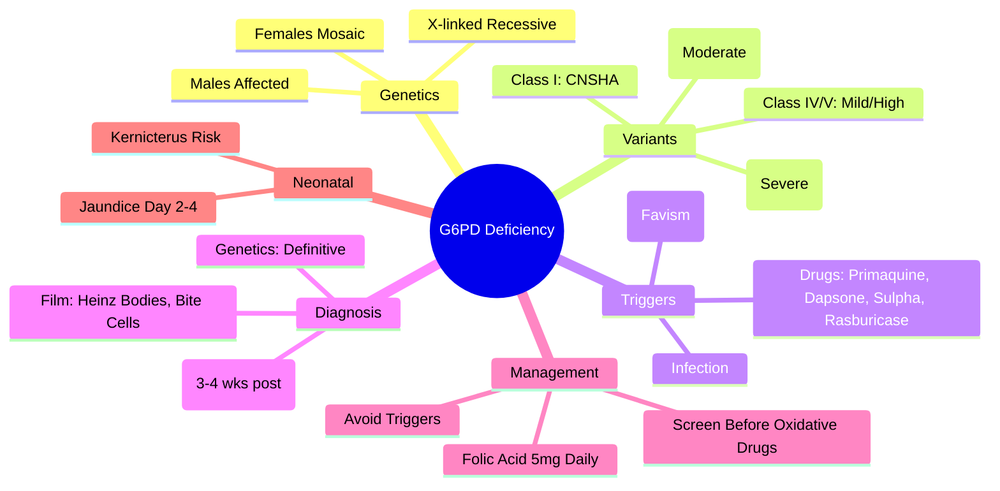

# G6PD Deficiency

> [!info] **Davidson Ch 25 Alignment**: Haemolytic Anaemias → G6PD Deficiency
> **FCPS/MRCP Focus**: X-linked, oxidative stress triggers, Heinz bodies, bite cells, quantitative vs qualitative testing, primaquine/dapsone contraindication

---

## 🎯 Learning Objectives

- [ ] Define G6PD deficiency: **X-linked recessive** enzymopathy → impaired NADPH production → redox failure → haemolysis
- [ ] Classify variants: **Class I (severe/CNS)**, **Class II (severe/Mediterranean)**, **Class III (moderate/African A-)**, **Class IV (mild)**, **Class V (high activity)**
- [ ] Identify **oxidative triggers**: Drugs (primaquine, dapsone, sulphonamides, rasburicase), Infection, **Fava beans (favism)**
- [ ] Diagnose: **Heinz bodies**, **Bite cells**, **G6PD quantitative assay** (not during acute haemolysis), **Molecular genetics**
- [ ] Manage: **Avoid triggers**, **supportive care**, **screening** before oxidative drugs
- [ ] Understand **neonatal jaundice** risk and **congenital non-spherocytic haemolytic anaemia (CNSHA)**

---

## 📖 Definition & Classification (WHO)

| Class | Enzyme Activity | Clinical Severity | Common Variants |
|-------|-----------------|-------------------|-----------------|
| **I** | <10% | **CNSHA** (chronic, severe, neurological) | Rare |
| **II** | <10% | **Severe** (Mediterranean, Asian) | **Mediterranean**, Canton, Orissa |
| **III** | 10-60% | **Moderate** (African A-) | **A- (African)**, A+ (normal) |
| **IV** | 60-100% | **Mild / Asymptomatic** | Rare |
| **V** | >100% | **High activity** | Beneficial? |

> [!tip] **FCPS/MRCP**: **G6PD = X-linked recessive** (males affected, females carriers/mosaic). **Mediterranean (Class II) = severe**; **African A- (Class III) = moderate**. **Test AFTER acute episode resolves** (retics have normal G6PD → false negative).

---

## ⚙️ Pathophysiology

```mermaid
flowchart TD
    A[G6PD Deficiency] --> B[Impaired Pentose Phosphate Pathway]
    B --> C[↓ NADPH Production]
    C --> D[↓ Reduced Glutathione (GSH)]
    D --> E[Inability to Detoxify H₂O₂ / Oxidants]
    E --> F[Protein Oxidation & Denaturation]
    F --> G[Heinz Bodies (Denatured Hb)]
    G --> H[Splenic Pitting → Bite Cells]
    H --> I[Intravascular + Extravascular Haemolysis]
    
    J[Oxidative Triggers] --> I
    J --> K1[Drugs: Primaquine, Dapsone, Sulpha, Rasburicase]
    J --> K2[Fava Beans: Favism]
    J --> K3[Infection / Sepsis]
    J --> K4[Mothballs (Naphthalene)]
```

---

## 🔬 Diagnostic Workup

```mermaid
flowchart TD
    A[Episodic Haemolysis + Trigger History] --> B[CBC + Film]
    B --> C{**Heinz Bodies** (Supravital stain) + **Bite Cells**}
    C --> D[**G6PD Quantitative Assay** (Spectrophotometric/FL)]
    D --> E{Timing}
    E -->|During Acute Haemolysis| F[**FALSE NORMAL** (Young retics have normal G6PD)]
    E -->|3-4 Weeks Post-Episode| G[**TRUE RESULT**]
    F --> H[Repeat After Recovery]
    G --> I[Molecular Genetics: G6PD Gene Sequencing]
    I --> J[Variant Classification (I-V)]
```

### Key Investigations

| Test | Finding | Timing |
|------|---------|--------|
| **Blood Film** | **Heinz bodies** (methyl violet/brilliant cresyl blue), **Bite cells** (blister cells), **Irregularly contracted cells** | Acute episode |
| **G6PD Quantitative** | **Low activity** (Class I-III) | **3-4 weeks post-episode** |
| **G6PD Qualitative (Fluorescent Spot)** | **No fluorescence** | Rapid screening |
| **Molecular Genetics** | **G6PD gene mutation** (c.563C>T Mediterranean, c.202G>A African A-) | Definitive |
| **Methaemoglobin Reduction Test** | **Positive** (older screening) | Historical |

---

## 🩺 Clinical Features

| Scenario | Presentation |
|----------|--------------|
| **Drug-induced (Primaquine/Dapsone)** | 2-3 days post-exposure: **Haemoglobinuria**, jaundice, back pain, anaemia |
| **Favism (Fava beans)** | **Children**, acute severe haemolysis, **abdominal pain**, vomiting, **haemoglobinuria** |
| **Neonatal Jaundice** | **Day 2-4**, severe unconjugated hyperbilirubinaemia, **kernicterus risk** (esp. Mediterranean) |
| **CNSHA (Class I)** | **Chronic haemolytic anaemia** from birth, splenomegaly, **neurological deficits** |
| **Infection-induced** | Sepsis, pneumonia → oxidative stress → haemolysis |

---

## 💊 Management

### Acute Haemolytic Episode
| Action | Details |
|--------|---------|
| **Stop Oxidative Drug** | Immediately |
| **Supportive Care** | **Hydration**, **Alkalinisation** (IV bicarbonate) to prevent renal tubular damage |
| **Transfusion** | If Hb <7 g/dL or symptomatic; **Avoid oxidative blood** (wash if needed) |
| **Folic Acid** | **5 mg daily** (chronic increased erythropoiesis) |
| **Avoid** | IV Vitamin C, Methylene blue (oxidants) |

### Chronic Management
| Aspect | Recommendation |
|--------|----------------|
| **Trigger Avoidance** | **Drug list** (see below); **No fava beans**; Mothballs |
| **Folic Acid** | 5 mg daily lifelong |
| **Screening** | **Before primaquine/dapsone/rasburicase/sulphonamides** in endemic populations |
| **Neonatal** | **Phototherapy**, exchange transfusion if severe; **Screen at birth** in high-prevalence areas |

---

## ⚠️ Drugs CONTRAINDICATED / Use with Caution in G6PD Deficiency

| **Contraindicated (High Risk)** | **Use with Caution / Monitor** | **Generally Safe** |
|--------------------------------|--------------------------------|-------------------|
| **Primaquine** | Aspirin (high dose) | Paracetamol |
| **Dapsone** | Chloroquine | Most antibiotics (non-sulpha) |
| **Rasburicase** | Quinolones | Most antimalarials (except primaquine) |
| **Sulphonamides** (cotrimoxazole, sulphasalazine) | Vitamin C (high dose IV) | |
| **Methylene Blue** | Naphthalene (mothballs) | |
| **Pegloticase** | | |
| **Tafenoquine** | | |

> [!warning] **Rasburicase = CONTRAINDICATED in G6PD** (causes severe haemolysis/methaemoglobinaemia). **Screen before giving in high-prevalence populations**.

---

## 🔄 Differential Diagnosis

| Condition | Distinguishing Features |
|-----------|------------------------|
| **PNH** | **DAT negative, Flow CD55/CD59-**, chronic intravascular haemolysis, thrombosis |
| **AIHA** | **DAT POSITIVE**, spherocytes, reticulocytosis |
| **Hereditary Spherocytosis** | **Spherocytes, DAT negative, EMA↓, OFT↑, splenomegaly, family history** |
| **Unstable Haemoglobin** | **Heinz bodies**, **Isopropanol stability test +**, family history |
| **TTP/HUS** | **Schistocytes, Thrombocytopenia, Normal G6PD** |
| **Wilson Disease** | **Coombs-negative haemolysis**, low ceruloplasmin, K-F rings |

---

## 💡 FCPS/MRCP High-Yield Summary

| Topic | Key Point |
|-------|-----------|
| **Inheritance** | **X-linked recessive** (males affected, females mosaic) |
| **Variants** | **Mediterranean (Class II, severe)**, **African A- (Class III, moderate)** |
| **Triggers** | **Primaquine, Dapsone, Sulphonamides, Rasburicase, Fava beans, Infection** |
| **Blood Film** | **Heinz bodies** (supravital), **Bite cells** (blister cells) |
| **G6PD Assay Timing** | **FALSE NORMAL during acute episode** (retics normal); test **3-4 weeks later** |
| **Neonatal Jaundice** | **Kernicterus risk** (esp. Mediterranean); screen high-prevalence populations |
| **Rasburicase** | **CONTRAINDICATED** in G6PD deficiency |
| **Screening** | **Before oxidative drugs** (primaquine, dapsone, rasburicase) |
| **Folic Acid** | **5 mg daily** |

---

## ❓ Viva Questions

1. **What is the inheritance pattern of G6PD deficiency?**
   - **X-linked recessive** – males affected; females carriers (mosaic due to lyonization)

2. **Why can G6PD quantitative assay be falsely normal during acute haemolysis?**
   - **Young reticulocytes have normal G6PD activity** → dilutes the deficient older RBCs

3. **When should G6PD testing be performed?**
   - **3-4 weeks after acute haemolytic episode resolves**

4. **What are the classic blood film findings in G6PD deficiency?**
   - **Heinz bodies** (supravital stain) and **Bite cells** (blister cells)

5. **Which antimalarial is contraindicated in G6PD deficiency?**
   - **Primaquine** (and tafenoquine) – causes oxidative haemolysis

6. **What is Favism?**
   - **Acute haemolysis triggered by fava bean ingestion** (vicine/convicine); common in children

7. **Why is Rasburicase contraindicated in G6PD deficiency?**
   - Generates **H₂O₂** during uric acid oxidation → severe oxidative haemolysis & methaemoglobinaemia

8. **Differentiate Mediterranean vs African A- variants.**
   - **Mediterranean (Class II): <10% activity, severe**; **African A- (Class III): 10-60%, moderate, self-limiting**

9. **How does G6PD deficiency present in neonates?**
   - **Severe unconjugated hyperbilirubinaemia (Day 2-4)**, kernicterus risk; screen in high-prevalence areas

10. **What is the management of acute haemolytic episode?**
    - **Stop oxidative drug**, hydration, alkalinisation, transfusion if needed, folic acid 5mg daily

---

## 🧠 Confusions & Mnemonics

| Confusion | Clarification |
|-----------|---------------|
| **G6PD vs PNH** | **G6PD: Heinz bodies, bite cells, trigger-based**; **PNH: CD55/CD59-, chronic, thrombosis, DAT-** |
| **G6PD vs AIHA** | **G6PD: DAT negative**; **AIHA: DAT positive** |
| **G6PD vs Unstable Hb** | Both have Heinz bodies; **G6PD: enzyme assay low**; **Unstable Hb: isopropanol test +,.Normal G6PD** |
| **Testing Timing** | **FALSE NORMAL in acute phase**; wait 3-4 weeks for true result |
| **Rasburicase** | **ABSOLUTE CONTRAINDICATION** in G6PD |

| Mnemonic | Meaning |
|----------|---------|
| **"G6PD = X-linked"** | Inheritance |
| **"PD = Primaquine, Dapsone (Drugs)"** | Major triggers |
| **"Favism = Fava Beans"** | Food trigger |
| **"Rasburicase = NO in G6PD"** | Contraindicated |
| **"Heinz + Bite = G6PD Film"** | Blood film |
| **"Test Late = True Rate"** | Timing of assay |

---

## 🗺️ Mind Map



---

## 📋 One-Page Revision Card

| **G6PD DEFICIENCY – FCPS/MRCP REVISION CARD** |
|------------------------------------------------|
| **Inheritance**: **X-linked recessive** |
| **Variants**: **Mediterranean (Class II, severe)**; **African A- (Class III, moderate)** |
| **Triggers**: **Primaquine, Dapsone, Sulphonamides, Rasburicase, Fava Beans, Infection** |
| **Film**: **Heinz bodies** (supravital), **Bite cells** (blister) |
| **Assay Timing**: **FALSE NORMAL in acute phase** → Test **3-4 weeks later** |
| **Rasburicase**: **CONTRAINDICATED** |
| **Neonatal**: Severe jaundice Day 2-4, **kernicterus risk** (Mediterranean) |
| **Screening**: Before primaquine/dapsone/rasburicase in endemic areas |
| **Management**: Stop trigger, hydration, alkalinisation, folic acid 5mg daily |
| **Favism**: Acute haemolysis from fava beans (children) |

---

## 📅 Spaced Repetition Tracker

| Review | Date | Score (1-5) | Next Review |
|--------|------|-------------|-------------|
| Day 1 | 2025-06-16 | | 2025-06-17 |
| Day 3 | | | |
| Day 7 | | | |
| Day 15 | | | |
| Day 30 | | | |

---

## 🎯 Must Know / Should Know / Nice to Know

| Level | Content |
|-------|---------|
| **Must Know** | X-linked inheritance, variants (Mediterranean/African), triggers, Heinz bodies/bite cells, assay timing (false normal acute), rasburicase contraindication, favism, neonatal jaundice, screening before oxidative drugs |
| **Should Know** | WHO classification I-V, molecular variants (c.563C>T, c.202G>A), methylene blue contraindication, fluorescent spot test, methylene blue reduction test, primaquine radical cure for vivax/ovale malaria |
| **Nice to Know** | Detailed pentose phosphate pathway biochemistry, G6PD gene structure (13kb, 13 exons), lyonization in females, population genetics (malaria protection), tafenoquine specifics, pegloticase contraindication |

---

## ✅ Self-Test Scorecard

| Section | Score (0-10) | Notes |
|---------|--------------|-------|
| Genetics & Variants | | |
| Triggers & Clinical Features | | |
| Diagnostic Workup & Timing | | |
| Management | | |
| Neonatal & Screening | | |
| Viva Questions | | |

---

## 🔗 Local Navigation

- **Previous**: [[Hereditary Spherocytosis]]
- **Next**: [[PNH]]
- **Section Hub**: [[Anaemia and Red Cell Disorders]]
- **MOC**: [[Hematology MOC]]
- **Template**: [[../Templates/Hematology Topic Template]]

---

*Generated for FCPS/MRCP exam preparation. Based on Davidson Medicine 24th Ed Chapter 25.*
---

> Auto-generated study sections for "Hematology" — Ch 24: Haematology & Transfusion Medicine.

## Flashcards (18 generated)

- Q: What is the definition of Hematology?
  A: [!info] Davidson Ch 25 Alignment: Haemolytic Anaemias → G6PD Deficiency
- Q: What is Trigger Avoidance of Hematology?
  A: Drug list (see below); No fava beans; Mothballs
- Q: What is Folic Acid of Hematology?
  A: 5 mg daily lifelong
- Q: What is Screening of Hematology?
  A: Before primaquine/dapsone/rasburicase/sulphonamides in endemic populations
- Q: What is Neonatal of Hematology?
  A: Phototherapy, exchange transfusion if severe; Screen at birth in high-prevalence areas
- Q: What is Trigger Avoidance of Hematology?
  A: Drug list (see below); No fava beans; Mothballs
- Q: What is Folic Acid of Hematology?
  A: 5 mg daily lifelong
- Q: What is Screening of Hematology?
  A: Before primaquine/dapsone/rasburicase/sulphonamides in endemic populations
- Q: What is Neonatal of Hematology?
  A: Phototherapy, exchange transfusion if severe; Screen at birth in high-prevalence areas
- Q: What is Inheritance of Hematology?
  A: X-linked recessive (males affected, females mosaic)
- Q: What is Variants of Hematology?
  A: Mediterranean (Class II, severe), African A- (Class III, moderate)
- Q: What is Triggers of Hematology?
  A: Primaquine, Dapsone, Sulphonamides, Rasburicase, Fava beans, Infection
- Q: What is Blood Film of Hematology?
  A: Heinz bodies (supravital), Bite cells (blister cells)
- Q: What is G6PD Assay Timing of Hematology?
  A: FALSE NORMAL during acute episode (retics normal); test 3-4 weeks later
- Q: What is Neonatal Jaundice of Hematology?
  A: Kernicterus risk (esp. Mediterranean); screen high-prevalence populations
- Q: What is Rasburicase of Hematology?
  A: CONTRAINDICATED in G6PD deficiency
- Q: What is Screening of Hematology?
  A: Before oxidative drugs (primaquine, dapsone, rasburicase)
- Q: What is Folic Acid of Hematology?
  A: 5 mg daily

## MCQs (1 generated)

1. **Which of the following best describes Hematology?**
   A. **[!info] Davidson Ch 25 Alignment: Haemolytic Anaemias → G6PD Deficiency**
   B. An unrelated condition not matching the clinical picture of Hematology
   C. A complication seen late in the disease course of Hematology
   D. A condition that mimics Hematology but has a different underlying cause

## SBA Questions (1 generated)

1. A patient with suspected Hematology presents with: Class — Enzyme Activity; [!tip] FCPS/MRCP: G6PD = X-linked recessive (males affected, females carriers/mosaic). Mediterranean (Class II) = severe; African A- (Class III) = moderate. Test AFTER acute episode resolves (retics have normal G6PD → false negative).. What is the most likely diagnosis?
   A. **Hematology**
   B. A condition that mimics Hematology but is not the same entity
   C. A complication of Hematology rather than the primary diagnosis
   D. An unrelated condition in the same clinical category as Hematology

## PasTest Scenario SBAs (Clinical Vignettes)

> **Auto-generated PasTest/Mediscope-style scenario SBAs** grounded in the authored source. Each scenario tests a real clinical fact (triad, specific sign, contraindication, trial, first-line Rx) extracted from the topic. *Source: Ch 24: Haematology — G6PD Deficiency*

**Q1.** What is the most appropriate first-line therapy for G6PD Deficiency?

  - **A.** Screening
  - **B.** An advanced/surgical therapy reserved for refractory disease
  - **C.** Symptomatic treatment only, no disease-modifying therapy
  - **D.** Empiric broad-spectrum therapy without specific indication

  > **Answer: A** — Screening
  >
  > *Source:* **Screening**   **Before primaquine/dapsone/rasburicase/sulphonamides** in endemic populations

