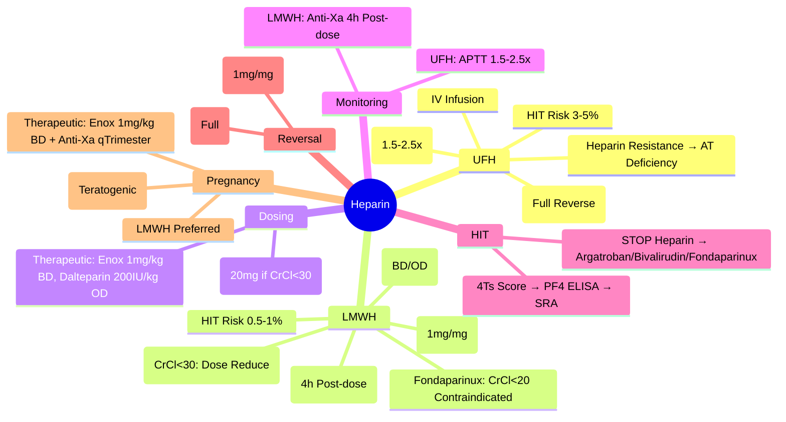

# Heparin Management (UFH & LMWH)

> [!info] **Davidson Ch 25 Alignment**: Bleeding and Thrombotic Disorders → Anticoagulation → Heparin
> **FCPS/MRCP Focus**: UFH vs LMWH, Dosing (Prophylactic/Therapeutic), Monitoring (APTT/Anti-Xa), HIT, Reversal (Protamine), Renal Adjustment, Obstetric Use, Bridging

---

## 🎯 Learning Objectives

- [ ] Distinguish **UFH vs LMWH**: Pharmacokinetics, Monitoring, Reversal, Indications
- [ ] Apply **Therapeutic Dosing**: UFH (IV Infusion, APTT-guided), LMWH (Weight-based SC, Anti-Xa-guided)
- [ ] Apply **Prophylactic Dosing**: Medical/Surgical Patients, Renal Adjustment, Obesity
- [ ] Monitor **UFH**: APTT (Target 1.5-2.5x Control), Heparin Assay (Anti-Xa)
- [ ] Monitor **LMWH**: Anti-Xa Level (Peak 4h Post-dose), Renal Adjustment
- [ ] Recognise & Manage **HIT**: 4Ts, PF4/ELISA, SRA, Alternative Anticoagulation
- [ ] Reverse **Heparin**: Protamine Sulfate (Dose Calculation)
- [ ] Manage **Obstetrics**: LMWH Preferred, Dosing, Monitoring, Anti-D
- [ ] Manage **Bridging**: Warfarin to LMWH/UFH, Peri-procedural

---

## 📖 UFH vs LMWH Comparison

| Feature | **Unfractionated Heparin (UFH)** | **Low Molecular Weight Heparin (LMWH)** |
|---------|----------------------------------|----------------------------------------|
| **Source** | Porcine Intestinal Mucosa | Depolymerised UFH |
| **Molecular Weight** | **5,000-30,000 Da** (Mean ~15,000) | **2,000-8,000 Da** (Mean ~4,500) |
| **Bioavailability** | **IV Only** (SC Unpredictable) | **SC ~90%** |
| **Half-life** | **60-90 min** (Dose-dependent) | **3-5 hours** (Longer) |
| **Clearance** | **Reticuloendothelial** (Saturable) | **Renal** (Primary) |
| **Monitoring** | **APTT** (Target 1.5-2.5x Control) / Anti-Xa | **Anti-Xa Level** (Peak 4h Post-dose) |
| **Reversal** | **Protamine 1mg/100U** (Full Reversal) | **Protamine 1mg/1mg** (Partial ~60-75%) |
| **HIT Risk** | **Higher** (~3-5%) | **Lower** (~0.5-1%) |
| **Osteoporosis** | **Higher** (Long-term) | **Lower** |
| **Dose** | **Weight-based IV Infusion** (IU/kg) | **Weight-based SC** (mg/kg) |
| **Renal Adjustment** | **No** (Hepatic/RE Clearance) | **Yes** (Renal Clearance) |
| **Cost** | Lower | Higher |

---

## 💊 Dosing Regimens

### Unfractionated Heparin (UFH) - IV Infusion

| Indication | Bolus | Infusion | Target |
|------------|-------|----------|--------|
| **Acute VTE / PE / ACS** | **80 IU/kg** (Max 5000 IU) | **18 IU/kg/h** (Start) | **APTT 1.5-2.5x Control** |
| **ACS / PCI** | **60-70 IU/kg** (Max 5000 IU) | **12-15 IU/kg/h** | **ACT 250-300 sec** (PCI) |
| **Acute Coronary Syndrome** | **60 IU/kg** (Max 4000) | **12 IU/kg/h** | **APTT 1.5-2.5x** |
| **Cardiac Surgery / ECMO** | **300-400 IU/kg** | **100-400 IU/kg/h** | **ACT 400-600 sec** |

### LMWH Therapeutic Dosing (Treatment Dose)

| Agent | Dose (SC) | Frequency | Indications |
|-------|-----------|-----------|-------------|
| **Enoxaparin** | **1 mg/kg** | **BD** (12-hourly) | **VTE Treatment, ACS, Bridging** |
| **Dalteparin** | **200 IU/kg** | **OD** (or 100 IU/kg BD) | **VTE Treatment, Cancer-Associated Thrombosis** |
| **Tinzaparin** | **175 IU/kg** | **OD** | **VTE Treatment** |
| **Fondaparinux** | **7.5 mg** (Weight-based: <50kg=5mg, 50-100kg=7.5mg, >100kg=10mg) | **OD** | **VTE Treatment, Prophylaxis** |

### LMWH Prophylactic Dosing

| Agent | Standard Dose (SC) | Renal Impairment (CrCl <30) | Obesity (BMI >30 / Weight >100kg) |
|-------|-------------------|-----------------------------|-----------------------------------|
| **Enoxaparin** | **40 mg OD** | **20 mg OD** (or 40mg OD if Anti-Xa Monitored) | **40 mg BD** (or Weight-based 0.5mg/kg BD) |
| **Dalteparin** | **5000 IU OD** | **2500 IU OD** | **5000 IU BD** (or 75 IU/kg) |
| **Tinzaparin** | **3500-4500 IU OD** | **Reduced Dose** | **Weight-based** |
| **Fondaparinux** | **2.5 mg OD** | **Contraindicated if CrCl <20** | **Standard** |

> [!tip] **Renal Impairment (CrCl <30)**: **Enoxaparin 20mg OD** (or Anti-Xa guided); **Fondaparinux Contraindicated if CrCl <20**.

---

## 🔬 Monitoring

### UFH Monitoring

| Test | Target | Frequency |
|------|--------|-----------|
| **APTT** | **1.5-2.5 x Control** (Therapeutic) | **6 Hourly** until Stable 2 Consecutive → **Daily** |
| **Anti-Xa (Heparin Assay)** | **0.3-0.7 IU/mL** | If APTT Unreliable / Heparin Resistance |

| APTT Ratio | Action |
|------------|--------|
| **<1.5** | **Increase Infusion Rate** |
| **1.5-2.5** | **Therapeutic** |
| **2.5-3.0** | **Slightly High - Consider Decrease** |
| **>3.0** | **Stop Infusion 1-2h**, Recheck, Restart Lower |

> [!warning] **Heparin Resistance**: APTT Subtherapeutic Despite High Dose → **Check Anti-Xa**, **Antithrombin Deficiency?** → **Give AT Concentrate / Switch to LMWH**.

### LMWH Monitoring (Anti-Xa)

| Indication | Target Anti-Xa (IU/mL) | Timing |
|------------|------------------------|--------|
| **Therapeutic (BD)** | **0.6-1.0** | **4 Hours Post-dose** |
| **Therapeutic (OD)** | **1.0-2.0** | **4 Hours Post-dose** |
| **Prophylactic** | **0.2-0.4** | **4 Hours Post-dose** |
| **Pregnancy (Therapeutic)** | **0.6-1.0** (BD) / **1.0-2.0** (OD) | **4h Post-dose** |
| **Renal Impairment / Obesity** | **Monitor Anti-Xa** | Adjust Dose to Target |

> [!tip] **LMWH Monitoring**: **Anti-Xa at 4h Post-dose** (Peak). **Not APTT** (Unreliable for LMWH).

---

## ⚠️ Heparin-Induced Thrombocytopenia (HIT)

*See **HIT.md** for Complete Details*

| Feature | UFH | LMWH |
|---------|-----|------|
| **Incidence** | **3-5%** | **0.5-1%** |
| **Onset** | **Days 5-14** | **Days 5-14** |
| **Mechanism** | **Anti-PF4/Heparin IgG** | **Cross-reactivity** |
| **Diagnosis** | **4Ts Score** → **PF4/Heparin ELISA** → **SRA** |
| **Management** | **STOP HEPARIN** → **Argatroban/Bivalirudin/Fondaparinux** |

---

## 💊 Reversal

### Protamine Sulfate (UFH Reversal)

| Situation | Dose |
|-----------|------|
| **UFH Given <30 min** | **1 mg Protamine per 100 Units Heparin** |
| **UFH Given 30-60 min** | **0.75 mg per 100 Units** |
| **UFH Given 1-2 hours** | **0.5 mg per 100 Units** |
| **UFH Given >2 hours** | **0.25-0.375 mg per 100 Units** |
| **Max Dose** | **50 mg** (Slow IV over 10 min) |

> [!warning] **Protamine Hypersensitivity** (Fish Allergy, Prior Vasectomy, NPH Insulin) → **Desensitization / Alternative Reversal** (rFVIIa, PCC).

### LMWH Reversal

| Agent | Dose |
|-------|------|
| **Protamine** | **1 mg Protamine per 1 mg Enoxaparin** (If <8h); **0.5mg/mg** (If 8-12h) |
| **Max Dose** | **50 mg** |
| **Efficacy** | **~60-75% Reversal** (Anti-Xa Activity) |

> [!warning] **Protamine only partially reverses LMWH** (~60-75%). **No Specific Antidote for LMWH**.

---

## 🤰 Obstetric Use (LMWH Preferred)

| Indication | Dose & Monitoring |
|------------|-------------------|
| **VTE Prophylaxis** (History VTE, Thrombophilia, Obesity, etc.) | **Enoxaparin 40mg OD** (20mg if CrCl<30); **Anti-Xa once per Trimester** |
| **Therapeutic Anticoagulation** (Acute VTE, Mechanical Valve) | **Enoxaparin 1mg/kg BD**; **Anti-Xa q4wk** (Target 0.6-1.0 IU/mL 4h post-dose) |
| **Mechanical Valve** | **LMWH 1mg/kg BD 1st Trimester** → **Warfarin 2nd/3rd Trimester** (if INR Target Met) → **LMWH 36w+** |
| **Anti-D Prophylaxis** | **500 IU IM at 28w + 34w + Post-delivery** (RhD Neg Mother) |

> [!warning] **Warfarin Teratogenic (Weeks 6-12)** → **LMWH Throughout Pregnancy** for Mechanical Valves (Except 2nd/3rd Trimester if INR Controlled). **DOACs Contraindicated**.

---

## 🌉 Bridging Therapy (Warfarin to Heparin)

| Scenario | Bridging | Protocol |
|----------|----------|----------|
| **High Thrombotic Risk** (Mech Mitral, Recent VTE ≤3mo, CHA₂DS₂-VASc ≥5) | **YES** | **Stop Warfarin 5d Pre-op** → **LMWH 1mg/kg BD** when INR <2.0 → **Stop 24h Pre-op** → **Restart 24h Post-op** + Warfarin |
| **Low Risk** (AF CHA₂DS₂-VASc <5, VTE >3mo, Mech Aortic No Risk) | **NO** | — |

---

## 🔬 Laboratory Monitoring Summary

| Drug | Primary Monitor | Target | Frequency |
|------|----------------|--------|-----------|
| **UFH (IV)** | **APTT** (or Anti-Xa) | **1.5-2.5x Control** | q6h → Daily when Stable |
| **LMWH (Therapeutic)** | **Anti-Xa** | **0.6-1.0 IU/mL (BD)** / **1.0-2.0 (OD)** | **4h Post-dose** |
| **LMWH (Prophylactic)** | **Anti-Xa (Optional)** | **0.2-0.4** | If Renal Impairment / Obesity |
| **Fondaparinux** | **Anti-Xa** | **0.5-1.0 (Therapeutic)** | If Renal Impairment |

---

## 💡 FCPS/MRCP High-Yield Summary

| Topic | Key Point |
|-------|-----------|
| **UFH vs LMWH** | **UFH: IV, APTT Monitor, Protamine Full Reversal, Higher HIT**; **LMWH: SC, Anti-Xa Monitor, Protamine Partial, Lower HIT, Renal Adjust** |
| **Therapeutic LMWH** | **Enoxaparin 1mg/kg BD**; **Dalteparin 200IU/kg OD**; **Anti-Xa 0.6-1.0 (BD), 1.0-2.0 (OD)** |
| **Prophylactic LMWH** | **Enoxaparin 40mg OD**; **Renal: 20mg OD**; **Obesity: 0.5mg/kg BD** |
| **HIT** | **UFH > LMWH**; **4Ts Score → PF4 ELISA → SRA**; **STOP HEPARIN → Argatroban/Bivalirudin/Fondaparinux** |
| **Reversal** | **UFH: Protamine 1mg/100U**; **LMWH: Protamine Partial (1mg/1mg Enoxaparin)** |
| **Pregnancy** | **LMWH Preferred**; **Therapeutic 1mg/kg BD**; **Anti-Xa Monitoring**; **Warfarin Contraindicated (Weeks 6-12)** |
| **Renal Adjustment** | **Enoxaparin CrCl<30: 20mg OD Prophylactic**; **Fondaparinux Contraindicated CrCl<20** |
| **Bridging** | **High Risk Only (Mech Mitral, VTE<3mo, CHA₂DS₂-VASc≥5)**; **LMWH 1mg/kg BD, Stop 24h Pre-op** |

---

## ❓ Viva Questions

1. **What is the difference in monitoring between UFH and LMWH?**
   - **UFH: APTT (Target 1.5-2.5x)**; **LMWH: Anti-Xa (Peak 4h Post-dose, Target 0.6-1.0 IU/mL BD)**

2. **How do you reverse UFH and LMWH?**
   - **UFH: Protamine 1mg/100U (Full Reversal)**; **LMWH: Protamine 1mg/1mg Enoxaparin (Partial ~60-75%)**

3. **What is the prophylactic dose of Enoxaparin in renal impairment (CrCl <30)?**
   - **20 mg OD** (Standard 40mg OD; Reduce by Half)

4. **What is the target Anti-Xa level for therapeutic Enoxaparin given BD?**
   - **0.6-1.0 IU/mL** (Measured 4h Post-dose)

5. **How does HIT risk differ between UFH and LMWH?**
   - **UFH: 3-5%**; **LMWH: 0.5-1%** (Lower due to shorter chains)

6. **How do you manage heparin-induced thrombocytopenia (HIT)?**
   - **STOP ALL HEPARIN** → **Start Alternative Anticoagulant**: Argatroban / Bivalirudin / Fondaparinux

7. **Why is LMWH not fully reversible with Protamine?**
   - **Protamine Neutralizes Anti-IIa Activity but NOT Anti-Xa Activity** of LMWH fragments

8. **What is the dose of Fondaparinux for VTE prophylaxis and its renal contraindication?**
   - **2.5 mg SC OD**; **Contraindicated if CrCl <20 mL/min**

9. **How do you monitor UFH in a patient with Heparin Resistance?**
   - **Check Anti-Xa Level** (Heparin Assay); **Check Antithrombin Level**; **Give AT Concentrate / Switch to LMWH**

10. **What is the dosing of Enoxaparin for therapeutic anticoagulation in pregnancy?**
    - **1 mg/kg SC BD**; **Monitor Anti-Xa (0.6-1.0 IU/mL 4h Post-dose) Each Trimester**

---

## 🧠 Confusions & Mnemonics

| Confusion | Clarification |
|-----------|---------------|
| **UFH vs LMWH Monitoring** | **UFH = APTT**; **LMWH = Anti-Xa** |
| **Protamine Dose** | **UFH: 1mg/100U**; **LMWH: 1mg/1mg (Enoxaparin)** |
| **HIT Risk** | **UFH > LMWH** (3-5% vs 0.5-1%) |
| **LMWH Renal Dose** | **CrCl<30: Enoxaparin 20mg OD**; **Fondaparinux Contraindicated <20** |
| **LMWH Monitoring** | **Anti-Xa at 4h Post-dose** (Not APTT) |
| **Protamine Reversal** | **UFH = Full; LMWH = Partial (~60-75%)** |

| Mnemonic | Meaning |
|----------|---------|
| **"UFH = APTT, LMWH = Anti-Xa"** | Monitoring |
| **"Protamine 1:100 UFH, 1:1 LMWH"** | Reversal Dose |
| **"LMWH = Less HIT, Less Osteoporosis"** | Advantages |
| **"Renal Impair = Reduce LMWH, Avoid Fondaparinux"** | Renal Adjustment |
| **"HIT = STOP Heparin, Start Argatroban/Bivalirudin/Fondaparinux"** | HIT Management |
| **"Fondaparinux = No CrCl<20"** | Contraindication |

---

## 🗺️ Mind Map

---

## 📋 One-Page Revision Card

| **HEPARIN MANAGEMENT – FCPS/MRCP REVISION CARD** |
|---------------------------------------------------|
| **UFH**: IV, APTT 1.5-2.5x, Protamine 1mg/100U (Full), HIT 3-5% |
| **LMWH**: SC, Anti-Xa 4h Post-dose (0.6-1.0 BD), Protamine Partial (1mg/mg), HIT 0.5-1% |
| **Therapeutic**: Enoxaparin 1mg/kg BD, Dalteparin 200IU/kg OD |
| **Prophylactic**: Enox 40mg OD (20mg if CrCl<30), Dalteparin 5000IU OD |
| **HIT**: 4Ts → PF4 ELISA → SRA → STOP Heparin → Argatroban/Bivalirudin/Fondaparinux |
| **Reversal**: UFH = Protamine 1mg/100U (Full); LMWH = Protamine 1mg/mg (Partial ~60-75%) |
| **Pregnancy**: **LMWH Preferred**, Therapeutic 1mg/kg BD + Anti-Xa qTrimester, **Warfarin Contraindicated** |
| **Renal**: CrCl<30 → Enox 20mg OD; Fondaparinux Contraindicated <20 |
| **Bridging**: High Risk Only (Mech Mitral, VTE<3mo, CHA₂DS₂-VASc≥5) → LMWH 1mg/kg BD |

---

## 📅 Spaced Repetition Tracker

| Review | Date | Score (1-5) | Next Review |
|--------|------|-------------|-------------|
| Day 1 | 2025-06-17 | | 2025-06-18 |
| Day 3 | | | |
| Day 7 | | | |
| Day 15 | | | |
| Day 30 | | | |

---

## 🎯 Must Know / Should Know / Nice to Know

| Level | Content |
|-------|---------|
| **Must Know** | UFH vs LMWH differences, Therapeutic/Prophylactic Dosing, Monitoring (APTT vs Anti-Xa), HIT (4Ts, PF4 ELISA, SRA, Alternative Anticoagulants), Reversal (Protamine UFH Full, LMWH Partial), Pregnancy (LMWH Preferred, Warfarin Contraindicated), Renal Adjustment, Bridging Indications/Protocol |
| **Should Know** | UFH Heparin Resistance (AT Deficiency), LMWH Anti-Xa Assay Details, Protamine Allergy/Adverse Effects, Fondaparinux Indications/Contraindications, Argatroban/Bivalirudin Dosing in HIT, UFH in PCI/STEMI/Stroke, LMWH in Cancer-Associated Thrombosis, Anti-Xa Assay Standardisation, Heparin Half-life Variability |
| **Nice to Know** | Heparin Pharmacokinetics (Saturable Clearance), LMWH Molecular Weight Distributions, Ultra-low Molecular Weight Heparins, Oral Heparins (Developmental), Heparin Analogues, Glycosaminoglycan Mimetics, Heparin-coated Catheters, Heparin-induced Osteoporosis Prevention, Heparin in ECMO/CRRT, Heparin-induced Hyperkalemia, Heparin in Burns/Trauma, Heparin Allergy Desensitisation |

---

## ✅ Self-Test Scorecard

| Section | Score (0-10) | Notes |
|---------|--------------|-------|
| UFH vs LMWH Differences | | |
| Dosing Regimens | | |
| Monitoring (APTT vs Anti-Xa) | | |
| HIT Diagnosis & Management | | |
| Reversal Protocols | | |
| Pregnancy & Renal Adjustment | | |
| Bridging Therapy | | |
| Viva Questions | | |

---

## 🔗 Local Navigation

- **Previous**: [[DOAC Management]]
- **Next**: [[Antiplatelet Therapy]]
- **Section Hub**: [[Bleeding and Thrombotic Disorders]] / [[Anticoagulation]]
- **MOC**: [[Hematology MOC]]
- **Template**: [[../Templates/Hematology Topic Template]]

---

*Generated for FCPS/MRCP exam preparation. Based on Davidson Medicine 24th Ed Chapter 25.*