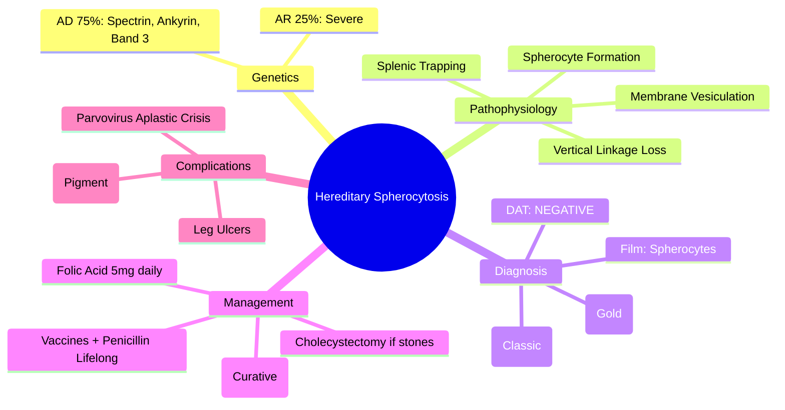

# Hereditary Spherocytosis (HS)

> [!info] **Davidson Ch 25 Alignment**: Haemolytic Anaemias → Hereditary Spherocytosis
> **FCPS/MRCP Focus**: Cytoskeletal protein defects, spherocytes, osmotic fragility/EMA binding, splenectomy timing, gallstones, parvovirus aplastic crisis

---

## 🎯 Learning Objectives

- [ ] Define HS: **Autosomal dominant (75%)** or recessive cytoskeletal membrane defect → **spherocytes, haemolysis, splenomegaly**
- [ ] Identify **protein defects**: **Spectrin (α/β) 40-50%**, **Ankyrin 40-50%**, **Band 3 (15-20%)**, **Protein 4.2 (5%)**
- [ ] Diagnose: **Spherocytes on film**, **Reticulocytosis**, **DAT negative**, **Osmotic Fragility Test (OFT) ↑**, **EMA Binding Test ↓** (gold standard)
- [ ] Manage: **Folic acid 5mg daily**, **Splenectomy timing** (elective age >6yr), **Cholecystectomy** if gallstones, **Parvovirus B19 aplastic crisis** management
- [ ] Recognise **post-splenectomy risks**: Overwhelming post-splenectomy infection (OPSI), thrombosis, need for vaccination/prophylaxis

---

## 📖 Definition & Classification

| Feature | Details |
|---------|---------|
| **Inheritance** | **AD 75%** (mild-moderate), **AR 25%** (severe) |
| **Protein Defects** | **Spectrin (α/β) 40-50%**, **Ankyrin 40-50%**, **Band 3 (SLC4A1) 15-20%**, **Protein 4.2 (EPB42) 5%** |
| **Pathophysiology** | **Loss of membrane surface area** → spherical shape → **splenic trapping** → haemolysis |
| **Clinical Spectrum** | Silent carrier → Mild (Hb 11-15) → Moderate (Hb 8-11) → Severe (Hb <8, transfusion-dependent) |

> [!tip] **FCPS/MRCP**: **HS = Spectrin/Ankyrin/Band 3/Protein 4.2 defects → membrane loss → spherocytes → splenic sequestration**. **EMA binding test = gold standard (sensitivity >95%)**. **Splenectomy = curative for haemolysis but OPSI risk**.

---

## ⚙️ Pathophysiology

```mermaid
flowchart TD
    A[Cytoskeletal Protein Defect] --> B[Loss of Vertical Linkages]
    B --> C[Membrane Instability]
    C --> D[Vesiculation & Membrane Loss]
    D --> E[Decreased Surface Area : Volume Ratio]
    E --> F[Spherocyte Formation]
    F --> G[Splenic Trapping & Conditioning]
    G --> H[Extravascular Haemolysis]
    H --> I[Anaemia, Reticulocytosis, Jaundice, Splenomegaly]
    H --> J[Gallstones (Pigment)]
```

---

## 🔬 Diagnostic Workup

```mermaid
flowchart TD
    A[Haemolytic Anaemia + Splenomegaly + Family History] --> B[CBC + Film]
    B --> C{**Spherocytes** + Polychromasia, No Central Pallor}
    C --> D[**DAT: NEGATIVE** (excludes AIHA)]
    D --> E[**Reticulocytosis**, ↑ LDH, ↑ Bilirubin (indirect), ↓ Haptoglobin]
    E --> F[**Confirmatory Tests**]
    F --> G1[**EMA Binding Test (Flow): DECREASED** (Gold Standard)]
    F --> G2[**Osmotic Fragility Test: INCREASED** (Classic, less specific)]
    F --> G3[**Cryohaemolysis Test: POSITIVE** (Band 3 defect)]
    F --> G4[**SDS-PAGE / Genetic Panel**: Spectrin, Ankyrin, Band 3, Protein 4.2]
```

### Key Diagnostic Tests

| Test | HS Result | Sensitivity/Specificity |
|------|-----------|------------------------|
| **EMA Binding (Flow Cytometry)** | **Decreased** (mean channel fluorescence ↓) | **>95% / >95%** (Gold Standard) |
| **Osmotic Fragility Test (OFT)** | **Increased** (lysis at higher osmolarity) | 85% / 90% (classic) |
| **Incubated OFT** | Markedly increased | More sensitive |
| **Cryohaemolysis** | Positive (Band 3 defects) | Specific for Band 3 |
| **SDS-PAGE** | Quantifies protein deficiency | Specific protein identification |
| **Genetic Panel** | ANK1, SPTA1, SPTB, SLC4A1, EPB42 | Definitive |

---

## 🩺 Clinical Features

| Severity | Hb | Reticulocytes | Bilirubin | Clinical |
|----------|-----|---------------|-----------|----------|
| **Mild** | 11-15 g/dL | 3-6% | Normal/Mild ↑ | Often asymptomatic, incidental |
| **Moderate** | 8-11 g/dL | 6-15% | ↑↑ | Jaundice, splenomegaly, gallstones |
| **Severe** | <8 g/dL | >15% | ↑↑↑ | Transfusion-dependent, growth failure |

**Complications:**
- **Gallstones** (pigment) – 30-50% by adulthood
- **Aplastic Crisis** – **Parvovirus B19** → acute severe anaemia, retic <1%
- **Megaloblastic Crisis** – Folate deficiency (increased demand)
- **Haemolytic Crisis** – Infection, oxidative stress
- **Leg Ulcers** – Chronic haemolysis, ankle region

---

## 💊 Management

### General Measures
| Measure | Details |
|---------|---------|
| **Folic Acid** | **5 mg daily lifelong** (increased erythropoiesis) |
| **Monitoring** | Annual CBC, reticulocytes, bilirubin, LFT, US abdomen (gallstones) |
| **Vaccinations** | **Pre-splenectomy**: PCV13, PPSV23, MenACWY, Hib, **COVID, Flu** |

### Splenectomy – **Curative for Haemolysis**

| Aspect | Recommendation |
|--------|----------------|
| **Indication** | **Moderate-Severe HS**, symptomatic anaemia, gallstones, growth failure, quality of life |
| **Timing** | **Elective age ≥6 years** (immune maturity); **Delay if possible** (OPSI risk highest <5yr) |
| **Pre-op** | **Vaccines 2 weeks before**; Pneumococcal, Meningococcal, Hib; **Penicillin prophylaxis post-op** |
| **Procedure** | **Laparoscopic** preferred; **Total splenectomy** (partial preserves some immune function) |
| **Outcome** | **Normal Hb, retics, bilirubin**; **Spherocytes persist** (but no splenic trapping) |

### Post-Splenectomy Care

| Risk | Management |
|------|------------|
| **OPSI** (Strep pneumo, H. influenzae, N. meningitidis) | **Penicillin V 250mg BD lifelong** (or Amoxicillin); **Booster vaccines q5yr** |
| **Thrombosis** | Portal/ splenic vein thrombosis (early); **Anticoagulation if high risk** |
| **Malaria/Babesia** | **Severe risk** – prophylaxis if endemic travel |

### Cholecystectomy
- **Indicated if symptomatic gallstones** (pain, cholecystitis)
- **Can combine with splenectomy** (single anaesthetic)
- **Ursodeoxycholic acid** not effective for pigment stones

### Parvovirus B19 Aplastic Crisis
- **Presentation**: Sudden severe anaemia, **reticulocytopenia**, high parvovirus IgM/PCR
- **Management**: **Supportive transfusion**, **IVIG 400 mg/kg/day × 5 days** (immunocompromised), self-limiting 7-10 days

---

## 🔄 Differential Diagnosis

| Condition | Distinguishing Features |
|-----------|------------------------|
| **AIHA** | **DAT POSITIVE**, spherocytes, no family history |
| **G6PD Deficiency** | **Heinz bodies, Bite cells, Normal OFT/EMA**, episodic (oxidant trigger) |
| **Pyruvate Kinase Deficiency** | **Normocytic**, echinocytes, **OFT normal**, PK assay low |
| **Elliptocytosis (HE)** | **Elliptocytes >25%**, milder, **OFT increased**, SPTA1/SPTB/EPB41 |
| **Stomatocytosis** | **Stomatocytes**, high Na/K permeability, **OFT variable** |
| **Burns/Heat Injury** | **Spherocytes**, history of burns, acute |

---

## 💡 FCPS/MRCP High-Yield Summary

| Topic | Key Point |
|-------|-----------|
| **Genetics** | **AD 75% (Spectrin, Ankyrin, Band 3)**; AR 25% |
| **Film** | **Spherocytes** (no central pallor, dense), polychromasia |
| **DAT** | **NEGATIVE** |
| **Gold Standard Test** | **EMA Binding Test (Flow) – Decreased** |
| **Classic Test** | **Osmotic Fragility Test – Increased** |
| **Splenectomy** | **Curative for haemolysis**; **Age ≥6yr**; **Vaccines + Penicillin prophylaxis** |
| **Complications** | **Gallstones (pigment)**, **Parvovirus aplastic crisis**, leg ulcers |
| **Folic Acid** | **5 mg daily lifelong** |
| **Post-Splenectomy** | **OPSI risk** – Penicillin lifelong, vaccine boosters |

---

## ❓ Viva Questions

1. **What are the cytoskeletal protein defects in Hereditary Spherocytosis?**
   - **Spectrin (α/β) 40-50%**, **Ankyrin 40-50%**, **Band 3 (SLC4A1) 15-20%**, **Protein 4.2 (EPB42) 5%**

2. **What is the gold standard diagnostic test for HS?**
   - **EMA Binding Test (Flow Cytometry) – Decreased fluorescence** (sensitivity >95%)

3. **How does Osmotic Fragility Test differ from EMA Binding in HS?**
   - **OFT: Increased fragility (classic, less specific)**; **EMA: Decreased binding (gold standard, >95% sens/spec)**

4. **When do you perform splenectomy in HS and what is the minimum age?**
   - **Moderate-Severe HS, symptomatic**; **Elective age ≥6 years** (immune maturity, OPSI risk)

5. **What vaccinations are required pre-splenectomy?**
   - **PCV13, PPSV23 (2mo later), MenACWY, Hib, COVID, Flu** – **2 weeks before surgery**

6. **What is the post-splenectomy infection prophylaxis?**
   - **Penicillin V 250mg BD lifelong** (or Amoxicillin); **Booster vaccines every 5 years**

6. **How does Parvovirus B19 present in HS and how is it managed?**
   - **Aplastic crisis**: Sudden severe anaemia, **reticulocytopenia**; **Supportive transfusion**, IVIG if immunocompromised

7. **What type of gallstones occur in HS and why?**
   - **Pigment stones** (calcium bilirubinate) from chronic haemolysis → high bilirubin turnover

8. **Differentiate HS from AIHA on blood film and DAT.**
   - **HS: Spherocytes, DAT NEGATIVE, family history**; **AIHA: Spherocytes, DAT POSITIVE (IgG/C3d)**

9. **Why is folic acid supplementation needed in HS?**
   - **Chronic increased erythropoiesis** → folate depletion → megaloblastic crisis if deficient

10. **What are the risks of splenectomy in children <5 years?**
    - **High OPSI risk** (encapsulated organisms); delay if possible; if needed → vaccines + penicillin + close monitoring

---

## 🧠 Confusions & Mnemonics

| Confusion | Clarification |
|-----------|---------------|
| **HS vs AIHA** | **HS: DAT negative, family history**; **AIHA: DAT positive** |
| **HS vs G6PD** | **HS: Chronic, EMA↓, OFT↑, splenomegaly**; **G6PD: Episodic, Heinz bodies, normal EMA/OFT** |
| **HS vs Elliptocytosis** | **HS: Spherocytes**; **HE: Elliptocytes >25%** |
| **OFT vs EMA** | **OFT = Classic screening**; **EMA = Gold standard confirmatory** |
| **Splenectomy age** | **≥6 years** (immune maturity, OPSI risk) |

| Mnemonic | Meaning |
|----------|---------|
| **"HS = Spectrin, Ankyrin, Band 3, Protein 4.2"** | Protein defects |
| **"Spherocytes = No Central Pallor"** | Film finding |
| **"EMA = Gold Standard"** | Diagnostic test |
| **"Splenectomy ≥6yr = Penicillin Life"** | Post-splenectomy care |
| **"Parvo = Aplastic Crisis = Reticulo Zero"** | Parvovirus presentation |
| **"Pigment Stones = Chronic Haemolysis"** | Gallstones in HS |

---

## 🗺️ Mind Map



---

## 📋 One-Page Revision Card

| **HEREDITARY SPHEROCYTOSIS – FCPS/MRCP REVISION CARD** |
|---------------------------------------------------------|
| **Inheritance**: **AD 75%** (Spectrin, Ankyrin, Band 3, Protein 4.2) |
| **Film**: **Spherocytes** (no central pallor), polychromasia |
| **DAT**: **NEGATIVE** |
| **Gold Standard**: **EMA Binding Test – DECREASED** (>95% sens/spec) |
| **Screening**: **Osmotic Fragility Test – INCREASED** |
| **Splenectomy**: **Curative**; **Age ≥6yr**; **Laparoscopic** |
| **Pre-Splenectomy**: **PCV13, PPSV23, MenACWY, Hib, COVID, Flu** (2 wk prior) |
| **Post-Splenectomy**: **Penicillin V 250mg BD LIFELONG**; Booster vaccines q5yr |
| **Complications**: **Pigment gallstones**, **Parvovirus aplastic crisis**, Leg ulcers |
| **Folic Acid**: **5 mg daily lifelong** |
| **Parvovirus Crisis**: Sudden severe anaemia + **reticulocytopenia** → Transfusion + IVIG |

---

## 📅 Spaced Repetition Tracker

| Review | Date | Score (1-5) | Next Review |
|--------|------|-------------|-------------|
| Day 1 | 2025-06-16 | | 2025-06-17 |
| Day 3 | | | |
| Day 7 | | | |
| Day 15 | | | |
| Day 30 | | | |

---

## 🎯 Must Know / Should Know / Nice to Know

| Level | Content |
|-------|---------|
| **Must Know** | Protein defects, spherocytes, DAT negative, EMA gold standard, OFT increased, splenectomy indications/age, vaccine/penicillin prophylaxis, gallstones, parvovirus aplastic crisis, folic acid |
| **Should Know** | AD vs AR severity, cryohaemolysis for Band 3, SDS-PAGE quantification, partial splenectomy, post-splenectomy thrombosis risk, ursodeoxycholic acid not effective, leg ulcer management |
| **Nice to Know** | Detailed membrane biology (vertical vs horizontal linkages), specific mutations (ANK1, SPTA1, SPTB, SLC4A1, EPB42), elliptocytosis overlap (SPTA1), stomatocytosis differential, malaria/babesia severe risk post-splenectomy |

---

## ✅ Self-Test Scorecard

| Section | Score (0-10) | Notes |
|---------|--------------|-------|
| Pathophysiology & Genetics | | |
| Diagnostic Tests (EMA, OFT) | | |
| Splenectomy Protocol | | |
| Complications | | |
| Viva Questions | | |

---

## 🔗 Local Navigation

- **Previous**: [[Immune Haemolytic Anaemia (AIHA)]]
- **Next**: [[G6PD Deficiency]]
- **Section Hub**: [[Anaemia and Red Cell Disorders]]
- **MOC**: [[Hematology MOC]]
- **Template**: [[../Templates/Hematology Topic Template]]

---

*Generated for FCPS/MRCP exam preparation. Based on Davidson Medicine 24th Ed Chapter 25.*
---

> Auto-generated study sections for "Hematology" — Ch 24: Haematology & Transfusion Medicine.

## Flashcards (14 generated)

- Q: What is the definition of Hematology?
  A: [!info] Davidson Ch 25 Alignment: Haemolytic Anaemias → Hereditary Spherocytosis
- Q: What is Inheritance of Hematology?
  A: AD 75% (mild-moderate), AR 25% (severe)
- Q: What is Protein Defects of Hematology?
  A: Spectrin (α/β) 40-50%, Ankyrin 40-50%, Band 3 (SLC4A1) 15-20%, Protein 4.2 (EPB42) 5%
- Q: What is the pathogenesis of Hematology?
  A: Loss of membrane surface area → spherical shape → splenic trapping → haemolysis
- Q: What is Clinical Spectrum of Hematology?
  A: Silent carrier → Mild (Hb 11-15) → Moderate (Hb 8-11) → Severe (Hb <8, transfusion-dependent)
- Q: What is Hematology indicated for?
  A: Moderate-Severe HS, symptomatic anaemia, gallstones, growth failure, quality of life
- Q: What is Timing of Hematology?
  A: Elective age ≥6 years (immune maturity); Delay if possible (OPSI risk highest <5yr)
- Q: What is Pre-op of Hematology?
  A: Vaccines 2 weeks before; Pneumococcal, Meningococcal, Hib; Penicillin prophylaxis post-op
- Q: What is Procedure of Hematology?
  A: Laparoscopic preferred; Total splenectomy (partial preserves some immune function)
- Q: What is the prognosis of Hematology?
  A: Normal Hb, retics, bilirubin; Spherocytes persist (but no splenic trapping)
- Q: What is Hematology indicated for?
  A: Moderate-Severe HS, symptomatic anaemia, gallstones, growth failure, quality of life
- Q: What is Timing of Hematology?
  A: Elective age ≥6 years (immune maturity); Delay if possible (OPSI risk highest <5yr)
- Q: What is Pre-op of Hematology?
  A: Vaccines 2 weeks before; Pneumococcal, Meningococcal, Hib; Penicillin prophylaxis post-op
- Q: What is Procedure of Hematology?
  A: Laparoscopic preferred; Total splenectomy (partial preserves some immune function)

## MCQs (1 generated)

1. **Which of the following best describes Hematology?**
   A. **[!info] Davidson Ch 25 Alignment: Haemolytic Anaemias → Hereditary Spherocytosis**
   B. An unrelated condition not matching the clinical picture of Hematology
   C. A complication seen late in the disease course of Hematology
   D. A condition that mimics Hematology but has a different underlying cause

## SBA Questions (1 generated)

1. A patient with suspected Hematology presents with: Inheritance — AD 75% (mild-moderate), AR 25% (severe); Protein Defects — Spectrin (α/β) 40-50%, Ankyrin 40-50%, Band 3 (SLC4A1) 15-20%, Protein 4.2 (EPB42) 5%; Pathophysiology — Loss of membrane surface area → spherical shape → splenic trapping → haemolysis. What is the most likely diagnosis?
   A. **Hematology**
   B. A condition that mimics Hematology but is not the same entity
   C. A complication of Hematology rather than the primary diagnosis
   D. An unrelated condition in the same clinical category as Hematology

