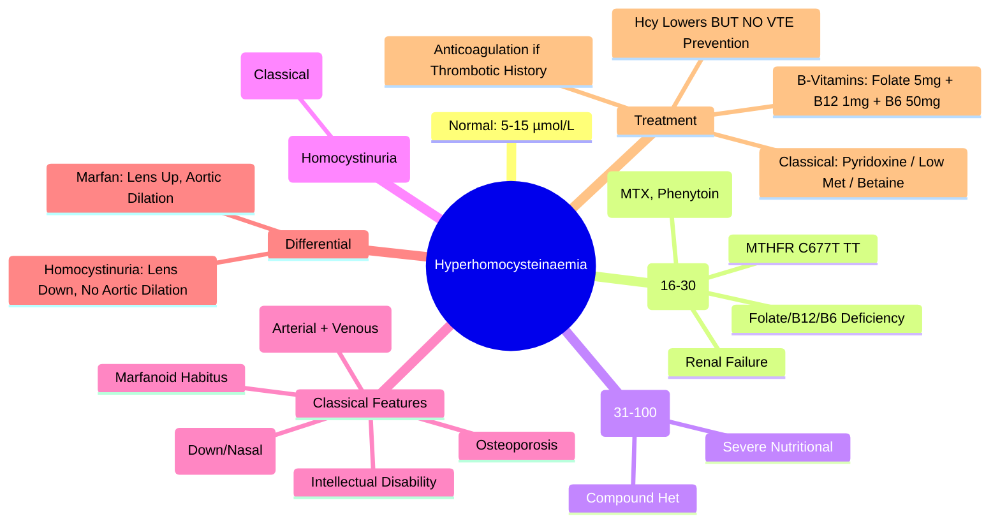

# Hyperhomocysteinaemia

> [!info] **Davidson Ch 25 Alignment**: Bleeding and Thrombotic Disorders → Thrombophilia → Hyperhomocysteinaemia
> **FCPS/MRCP Focus**: Homocystinuria (classical), Mild hyperhomocysteinaemia, MTHFR C677T, VTE risk, folate/B12/B6 therapy, homocysteine lowering

---

## 🎯 Learning Objectives

- [ ] Define **Hyperhomocysteinaemia**: Elevated plasma homocysteine >15 µmol/L (fasting)
- [ ] Classify: **Severe (Homocystinuria)** vs **Mild/Moderate** (acquired/nutritional/genetic)
- [ ] Identify **Causes**: **Nutritional** (Folate/B12/B6 deficiency), **Genetic** (MTHFR C677T, CBS deficiency), **Renal failure**, **Drugs** (MTX, Phenytoin)
- [ ] Assess **VTE Risk**: Mild hyperhomocysteinaemia = weak independent risk factor; Severe = high risk
- [ ] Apply **Testing**: Fasting plasma homocysteine, MTHFR C677T genotyping, Folate/B12/B6 levels
- [ ] Manage: **Folate 5mg + B12 1mg + B6 50mg** daily; **Homocysteine lowering ≠ VTE prevention proven**
- [ ] Recognise **Homocystinuria (Classical)**: CBS deficiency, Marfanoid habitus, Lens dislocation, Osteoporosis, VTE

---

## 📖 Classification & Causes

| Category | Homocysteine Level | Causes |
|----------|-------------------|--------|
| **Normal** | **5-15 µmol/L** | - |
| **Mild** | **16-30 µmol/L** | **MTHFR C677T homozygosity**, Folate/B12/B6 deficiency, Renal impairment, Drugs |
| **Moderate** | **31-100 µmol/L** | **Compound heterozygosity**, Severe nutritional deficiency, Hypothyroidism |
| **Severe (Homocystinuria)** | **>100 µmol/L** | **CBS deficiency (Classical)**, MTHFR severe mutations |

### Common Causes

| Cause | Mechanism |
|-------|-----------|
| **Folate Deficiency** | ↓ 5-methyl-THF → ↓ Homocysteine remethylation |
| **Vitamin B12 Deficiency** | ↓ Methylcobalamin → ↓ Methionine synthase |
| **Vitamin B6 Deficiency** | ↓ Pyridoxal phosphate → ↓ Cystathionine β-synthase (CBS) |
| **MTHFR C677T** | ↓ Enzyme activity → ↓ 5-methyl-THF |
| **Renal Failure** | ↓ Homocysteine clearance |
| **Drugs** | MTX, Phenytoin, Carbamazepine, Nitrous oxide, Metformin |

---

## ⚙️ Pathophysiology

```mermaid
flowchart TD
    A[Methionine] --> B[SAM] --> C[Homocysteine]
    C --> D1[Remethylation → Methionine] 
    C --> D2[Transsulfuration → Cystathionine → Cysteine]
    D1 --> E1[Requires: **Folate (5-methyl-THF), B12 (Methylcobalamin)**]
    D2 --> E2[Requires: **B6 (Pyridoxal phosphate), CBS**]
    
    F[Causes of Elevation] --> G1[Nutritional: ↓ Folate/B12/B6]
    F --> G2[Genetic: **MTHFR C677T**, CBS deficiency]
    F --> G3[Renal: ↓ Clearance]
    F --> G4[Drugs: MTX, Phenytoin]
    G1 & G2 & G3 & G4 --> H[↑ Homocysteine]
    H --> I[Endothelial Dysfunction]
    I --> J[Prothrombotic State]
    I --> K[Oxidative Stress]
    I --> L[Vascular Inflammation]
```

---

## 🔬 Diagnostic Workup

```mermaid
flowchart TD
    A[Suspected Hyperhomocysteinaemia: VTE, Family History, Premature CVD] --> B[**Fasting Plasma Homocysteine**]
    B --> C{Level}
    C -->|Normal 5-15| D[No further testing]
    C -->|Mild 16-30| E[**Folate, B12, B6 Levels**, Renal Function, **MTHFR C677T**]
    C -->|Moderate 31-100| F[**Nutritional Workup**, **MTHFR Genotyping**, **Renal US**]
    C -->|Severe >100| G[**CBS Enzyme Assay**, **Genetic Testing (CBS, MTHFR)**, **Ophthalmology (Ectopia Lentis)**, **Skeletal Survey**]
    E & F & G --> H[**Treat Underlying Cause**]
```

### Key Investigations

| Test | Purpose |
|------|---------|
| **Fasting Plasma Homocysteine** | **Gold standard**; >15 µmol/L = elevated |
| **Folate (Serum/RBC)** | RBC folate = long-term status |
| **Vitamin B12** | Active B12 (HoloTC) preferred |
| **Vitamin B6 (PLP)** | Pyridoxal phosphate |
| **MTHFR C677T Genotype** | TT = ~25% enzyme activity |
| **Renal Function** | eGFR, Creatinine |
| **CBS Enzyme Assay** | Fibroblasts/lymphocytes (if homocystinuria suspected) |
| **Ophthalmology** | Ectopia lentis (downward/nasal) |

---

## 🩺 Clinical Features

### Classical Homocystinuria (CBS Deficiency)

| System | Manifestations |
|--------|----------------|
| **Ocular** | **Ectopia lentis (Downward/Nasal)**, Myopia, Glaucoma, Retinal detachment |
| **Skeletal** | **Marfanoid habitus** (Tall, Arachnodactyly, Pectus deformity), **Osteoporosis**, Kyphoscoliosis |
| **Vascular** | **Premature VTE (Arterial + Venous)**, Atherosclerosis, Stroke/MI in youth |
| **Neurological** | Intellectual disability, Seizures, Psychiatric disorders |
| **Skin** | Livedo reticularis, Malar flush |

> [!tip] **Differentiate from Marfan**: **Ectopia lentis direction** (Homocystinuria = Downward/Nasal; Marfan = Upward), **No aortic root dilation in Homocystinuria**, **Thrombosis vs Aneurysm**

### Mild/Moderate Hyperhomocysteinaemia

| Feature | Association |
|---------|-------------|
| **VTE** | Weak independent risk factor (OR 1.5-2.5 for mild) |
| **Arterial Disease** | Premature CAD, Stroke, PAD |
| **Pregnancy** | Recurrent loss, Pre-eclampsia, Placental abruption |
| **Neurodevelopmental** | Neural tube defects (if Maternal) |

---

## 💊 Management

### Nutritional Supplementation (First-line)

| Agent | Dose | Target |
|-------|------|--------|
| **Folic Acid** | **5 mg daily** | Homocysteine <10-15 µmol/L |
| **Vitamin B12** | **1 mg daily (oral)** or **1 mg IM monthly** | Normalise B12 |
| **Vitamin B6 (Pyridoxine)** | **50-100 mg daily** | If B6 deficiency or CBS defect |

> [!warning] **Homocysteine lowering with B-vitamins DOES NOT consistently reduce VTE/CVD events** (HOPE-2, NORVIT, SEARCH trials). **Treat nutritional deficiency**; **Do NOT routinely prescribe for VTE prevention**.

### Classical Homocystinuria (CBS Deficiency)

| Intervention | Details |
|--------------|---------|
| **Pyridoxine (B6) Responsiveness** | **~50% responsive** (pyridoxine 100-500 mg/day) → ↓ Homocysteine |
| **Low Methionine Diet** | **Restrict methionine** (if pyridoxine non-responsive) |
| **Betaine** | **6 g/day** (remethylates homocysteine via BHMT) |
| **Folate/B12** | Standard doses |
| **VTE Prophylaxis** | **Anticoagulation** if thrombotic history / high risk |

---

## 🔄 Differential Diagnosis

| Condition | Homocysteine | Key Differentiators |
|-----------|--------------|---------------------|
| **Folate Deficiency** | ↑ | Low folate, Macrocytic anaemia, Normal B12 |
| **B12 Deficiency** | ↑ | Low B12, Macrocytic anaemia, Neurological |
| **B6 Deficiency** | ↑ | Low PLP, Sideroblastic anaemia, Neuropathy |
| **MTHFR C677T** | Mild ↑ | Genetic test TT homozygous |
| **Renal Failure** | ↑ | ↑ Creatinine, ↓ eGFR |
| **Drugs (MTX, Phenytoin)** | ↑ | Drug history |
| **CBS Deficiency** | **Severe (>100)** | Ectopia lentis, Marfanoid, Osteoporosis |

---

## 💡 FCPS/MRCP High-Yield Summary

| Topic | Key Point |
|-------|-----------|
| **Normal Homocysteine** | **5-15 µmol/L** (fasting) |
| **Mild (16-30)** | Common; MTHFR C677T TT, Folate/B12/B6 deficiency, Renal |
| **Severe (>100)** | **Classical Homocystinuria** = CBS deficiency |
| **Classical Features** | **Ectopia lentis (Down/Nasal)**, Marfanoid, Osteoporosis, VTE |
| **MTHFR C677T** | TT = 25% enzyme activity; Mild ↑ Hcy, Weak VTE risk |
| **B-vitamin Therapy** | **Folate 5mg + B12 1mg + B6 50mg**; **Lowers Hcy but NO proven VTE/CVD prevention** |
| **Homocystinuria vs Marfan** | **Ectopia lentis: Down/Nasal (Homocystinuria) vs Up (Marfan)**; **No aortic dilation in Homocystinuria** |
| **VTE Risk** | Mild = Weak; Severe = High |
| **Treatment Goal** | **Correct nutritional deficiency**; **NOT routine VTE prevention** |

---

## ❓ Viva Questions

1. **What is the normal fasting plasma homocysteine level?**
   - **5-15 µmol/L**

2. **What is the most common cause of mild hyperhomocysteinaemia?**
   - **MTHFR C677T homozygosity** (TT genotype) + **Folate/B12/B6 deficiency**

3. **What are the clinical features of classical homocystinuria (CBS deficiency)?**
   - **Ectopia lentis (Downward/Nasal)**, **Marfanoid habitus**, **Osteoporosis**, **Premature VTE**, **Intellectual disability**

4. **How does ectopia lentis differ between Homocystinuria and Marfan syndrome?**
   - **Homocystinuria: Downward/Nasal displacement**; **Marfan: Upward/Outward displacement**

5. **Does folic acid/B-vitamin supplementation prevent VTE in hyperhomocysteinaemia?**
   - **NO** - Trials (HOPE-2, NORVIT, SEARCH) showed homocysteine lowering **does NOT reduce VTE/CVD events**

5. **What is the treatment for classical homocystinuria?**
   - **Pyridoxine (B6) 100-500mg/day** (if responsive), **Low methionine diet**, **Betaine 6g/day**, **Folate/B12**, **Anticoagulation if thrombotic**

6. **What is MTHFR C677T and its significance?**
   - **Polymorphism reducing enzyme activity to ~25%**; **TT genotype = Mild hyperhomocysteinaemia, Weak VTE risk factor**

6. **What is the difference between folate and B12 deficiency effect on homocysteine?**
   - **Both ↑ Homocysteine**; **Folate deficiency = Low folate, Normal B12**; **B12 deficiency = Low B12, Neurological signs**

7. **Is hyperhomocysteinaemia an indication for anticoagulation?**
   - **NO** - Mild = Not an indication; **Severe (Homocystinuria) with VTE history = Anticoagulation indicated**

8. **How does renal failure cause hyperhomocysteinaemia?**
   - **Impaired renal clearance** of homocysteine → Accumulation

9. **What drugs can cause hyperhomocysteinaemia?**
   - **Methotrexate, Phenytoin, Carbamazepine, Nitrous oxide, Metformin**

10. **What is Betaine and when is it used in homocystinuria?**
    - **Betaine (Trimethylglycine) 6g/day** → Remethylates homocysteine via **BHMT pathway** (B6-independent); Used if **pyridoxine non-responsive**

---

## 🧠 Confusions & Mnemonics

| Confusion | Clarification |
|-----------|---------------|
| **Homocystinuria vs Marfan** | **Lens: Down/Nasal (Homocystinuria) vs Up (Marfan)**; **Aorta: Normal (Homocystinuria) vs Dilated (Marfan)** |
| **Hcy Lowering vs VTE Prevention** | **Hcy ↓ with B-vitamins** BUT **NO VTE/CVD reduction** (RCTs negative) |
| **MTHFR TT vs CBS Deficiency** | **MTHFR TT = Mild (16-30)**; **CBS Def = Severe (>100)** + Clinical features |
| **B6 vs B12/Folate** | **B6 = Transsulfuration (CBS)**; **B12/Folate = Remethylation (Methionine synthase)** |
| **Classical vs Mild** | **Classical = CBS Def, >100, Clinical features**; **Mild = Nutritional/MTHFR, 16-30** |

| Mnemonic | Meaning |
|----------|---------|
| **"Homocysteine = Hcy = High = Harm"** | Elevated = Risk |
| **"CBS = Classical Homocystinuria = Severe >100"** | CBS deficiency |
| **"MTHFR TT = Mild Rise = Weak Risk"** | MTHFR polymorphism |
| **"Ectopia Lentis Down = Homocystinuria"** | Lens direction |
| **"B-Vitamins = Lower Hcy ≠ Prevent VTE"** | Trial evidence |
| **"Homocysteine = Remethylation (B12/Folate) + Transsulfuration (B6)"** | Metabolic pathways |

---

## 🗺️ Mind Map



---

## 📋 One-Page Revision Card

| **HYPERHOMOCYSTEINAEMIA – FCPS/MRCP REVISION CARD** |
|------------------------------------------------------|
| **Normal**: **5-15 µmol/L** (fasting) |
| **Mild (16-30)**: **MTHFR C677T TT**, Folate/B12/B6 def, Renal, Drugs |
| **Severe (>100)**: **Classical Homocystinuria = CBS Deficiency** |
| **Classical Features**: **Ectopia Lentis (Down/Nasal)**, Marfanoid, Osteoporosis, VTE |
| **vs Marfan**: **Lens Down/Nasal (Homocystinuria) vs Up (Marfan)**; **No Aortic Dilation** |
| **MTHFR C677T TT**: 25% enzyme activity, Mild ↑ Hcy, **Weak VTE risk** |
| **B-Vitamin Therapy**: **Folate 5mg + B12 1mg + B6 50mg** → **Lowers Hcy, NO VTE Prevention** |
| **Classical Treatment**: **Pyridoxine (if responsive), Low Met Diet, Betaine, Anticoagulation** |
| **CBS Deficiency**: **Pyridoxine Response ~50%**; Non-responsive → Low Met + Betaine |
| **VTE Risk**: Mild = Weak; Severe = High |

---

## 📅 Spaced Repetition Tracker

| Review | Date | Score (1-5) | Next Review |
|--------|------|-------------|-------------|
| Day 1 | 2025-06-17 | | 2025-06-18 |
| Day 3 | | | |
| Day 7 | | | |
| Day 15 | | | |
| Day 30 | | | |

---

## 🎯 Must Know / Should Know / Nice to Know

| Level | Content |
|-------|---------|
| **Must Know** | Normal Hcy range, Mild vs Severe classification, Classical homocystinuria features (CBS deficiency), Ectopia lentis direction (Down/Nasal), MTHFR C677T TT mild risk, B-vitamins lower Hcy but NO VTE prevention, Homocystinuria vs Marfan differentiation |
| **Should Know** | Homocysteine metabolism pathways (Remethylation vs Transsulfuration), CBS deficiency pyridoxine responsiveness, Betaine mechanism, Homocysteine in pregnancy (neural tube defects, pre-eclampsia), Renal failure mechanism, Drug-induced (MTX, Phenytoin), CVD trial evidence (HOPE-2, NORVIT, SEARCH) |
| **Nice to Know** | Homocysteine assay methods (HPLC, Immunoassay, LC-MS/MS), MTHFR A1298C polymorphism, BHMT pathway, Homocysteine in neurodegenerative disease, Cost-effectiveness of screening, Genetic counselling for CBS deficiency, Homocysteine in dialysis patients, Methylene-THF reductase structure/function |

---

## ✅ Self-Test Scorecard

| Section | Score (0-10) | Notes |
|---------|--------------|-------|
| Classification & Causes | | |
| Classical Homocystinuria Features | | |
| MTHFR C677T Significance | | |
| B-Vitamin Therapy Evidence | | |
| Differential Diagnosis | | |
| Viva Questions | | |

---

## 🔗 Local Navigation

- **Previous**: [[Factor XI Deficiency & Rare Factor Deficiencies]]
- **Next**: [[Mixed Lineage Leukaemia]]
- **Section Hub**: [[Bleeding and Thrombotic Disorders]]
- **MOC**: [[Hematology MOC]]
- **Template**: [[../Templates/Hematology Topic Template]]

---

*Generated for FCPS/MRCP exam preparation. Based on Davidson Medicine 24th Ed Chapter 25.*