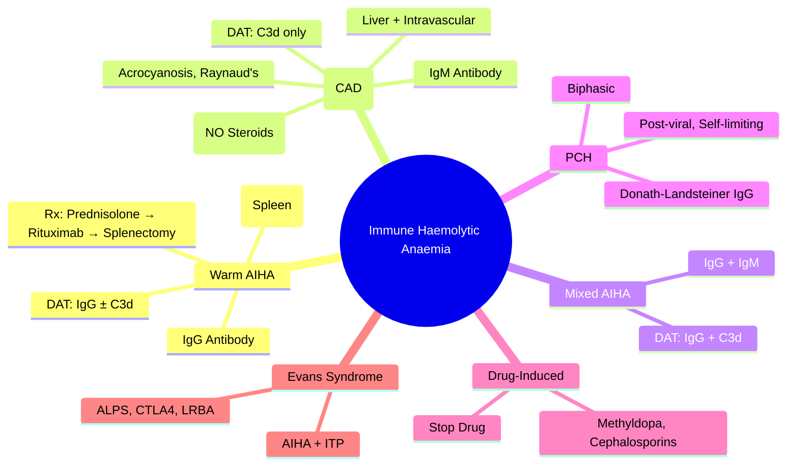

# Immune Haemolytic Anaemia (AIHA)

> [!info] **Davidson Ch 25 Alignment**: Haemolytic Anaemias → Immune Haemolytic Anaemia
> **FCPS/MRCP Focus**: Warm vs Cold AIHA, DAT patterns, steroids first-line, rituximab, splenectomy, cold agglutinin disease

---

## 🎯 Learning Objectives

- [ ] Classify AIHA: **Warm (IgG)** vs **Cold (IgM)** vs **Mixed** vs **Paroxysmal Cold Haemoglobinuria (PCH)**
- [ ] Interpret **DAT (Coombs test)**: IgG ± C3d (warm), C3d only (cold), IgG + C3d (mixed)
- [ ] Manage **Warm AIHA**: **Prednisolone 1-1.5 mg/kg** first-line; **Rituximab** second-line; Splenectomy refractory
- [ ] Manage **Cold Agglutinin Disease (CAD)**: **Rituximab ± Bendamustine**; Avoid cold; **Steroids ineffective**
- [ ] Recognise **Drug-induced AIHA**: Methyldopa, Cephalosporins, Penicillins, NSAIDs
- [ ] Identify **Evans Syndrome**: AIHA + ITP (+/- neutropenia) = **ALPS / CTLA4 / LRBA** workup

---

## 📖 Classification & DAT Patterns

| Type | Antibody | Thermal Amplitude | DAT Pattern | Common Causes |
|------|----------|-------------------|-------------|---------------|
| **Warm AIHA** | **IgG** (↔ C3) | 37°C (optimal) | **IgG ± C3d** | Idiopathic, SLE, CLL, Lymphoma, Drugs (Methyldopa) |
| **Cold AIHA** | **IgM** (κ/λ) | 0-4°C (optimal) | **C3d only** | **Cold Agglutinin Disease (CAD)**, Lymphoproliferative, Mycoplasma, EBV |
| **Mixed AIHA** | IgG + IgM | Both | **IgG + C3d** | Idiopathic, SLE, CLL |
| **PCH** | **Donath-Landsteiner (IgG biphasic)** | Binds cold, lyses warm | **C3d only** (transient) | **Post-viral (Mycoplasma, EBV), Syphilis** |

> [!tip] **FCPS/MRCP**: **Warm AIHA = IgG DAT+**, steroids work. **Cold AIHA = C3d only DAT+**, IgM, steroids DON'T work, Rituximab ± Bendamustine. **PCH = Donath-Landsteiner test**, post-viral, self-limiting.

---

## ⚙️ Pathophysiology

```mermaid
flowchart TD
    A[Autoantibody Production] --> B{Warm vs Cold}
    B -->|Warm IgG| C[Fcγ Receptor on Macrophages]
    C --> D[Extravascular Haemolysis: Spleen/Liver]
    D --> E[Spherocytes, Reticulocytosis]
    B -->|Cold IgM| F[Complement Activation C1-C4]
    F --> G[C3b Deposition on RBCs]
    G --> H1[Extravascular: Liver (Kupffer cells CR1)]
    G --> H2[Intravascular: C5-C9 MAC Lysis]
    H1 & H2 --> I[RBC Agglutination on Film]
```

---

## 🔬 Diagnostic Workup

```mermaid
flowchart TD
    A[Anaemia + Reticulocytosis + Haemolysis] --> B[DAT (Direct Antiglobulin Test)]
    B --> C{Pattern}
    C -->|IgG ± C3d| D[**Warm AIHA**]
    C -->|C3d only| E[**Cold AIHA / PCH**]
    C -->|IgG + C3d| F[**Mixed AIHA**]
    D --> G[Underlying Cause Screen: SLE, CLL, Lymphoma, Drugs]
    E --> H[**Cold Agglutinin Titre** >1:64; **Donath-Landsteiner Test** for PCH]
    F --> I[Warm + Cold workup]
```

### Key Investigations

| Test | Warm AIHA | Cold AIHA (CAD) | PCH |
|------|-----------|-----------------|-----|
| **DAT** | **IgG ± C3d** | **C3d only** | C3d only (transient) |
| **Cold Agglutinin Titre** | Low/Negative | **>1:64 (often 1:1000-1:10000)** | Negative |
| **Donath-Landsteiner Test** | Negative | Negative | **Positive** |
| **Thermal Amplitude** | 37°C | **<30°C (often 4°C)** | Biphasic |
| **Serum Protein Electrophoresis** | Polyclonal | **IgM κ/λ paraprotein** (lymphoproliferative) | Polyclonal |
| **Flow Cytometry** | Normal | **Clonal B-cells (CAD)** | Normal |

---

## 🩺 Clinical Features

| Feature | Warm AIHA | Cold AIHA (CAD) |
|---------|-----------|-----------------|
| **Age** | Any (peak 40-60) | Elderly (>60) |
| **Haemolysis** | Extravascular (spleen) | Extravascular (liver) + Intravascular |
| **Symptoms** | Anaemia, jaundice, splenomegaly | **Acrocyanosis, Raynaud's**, haemoglobinuria (cold exposure) |
| **Splenomegaly** | Common | Rare |
| **Underlying** | SLE, CLL, Lymphoma, Drugs | Lymphoma, CLL, Waldenström, Mycoplasma, Idiopathic |

---

## 💊 Management

### Warm AIHA

| Line | Treatment | Dose/Details | Response |
|------|-----------|--------------|----------|
| **1st** | **Prednisolone** | **1-1.5 mg/kg/day** (max 100mg) → taper over 3-6mo | 70-80% |
| **2nd** | **Rituximab** | 375 mg/m² weekly × 4 | 60-70% (relapsed/refractory) |
| **3rd** | **Splenectomy** | Laparoscopic | 60-70% long-term remission |
| **Refractory** | **Immunosuppressants**: Azathioprine, MMF, Cyclophosphamide, Cyclosporine, Tacrolimus, Bortezomib, Daratumumab, Fostamatinib (Syk inhibitor) | Case-by-case | Variable |

> [!warning] **Avoid IVIG as monotherapy** (transient effect); **Transfuse if life-threatening** (least incompatible, warm blood):

### Cold Agglutinin Disease (CAD)

| Treatment | Dose/Details | Notes |
|-----------|--------------|-------|
| **Avoid Cold Exposure** | Warm clothing, heated IV fluids | **Cornerstone** |
| **Rituximab** | 375 mg/m² weekly × 4 | **First-line**; 50-60% response |
| **Rituximab + Bendamustine** | Rituximab 375 + Bendamustine 90 mg/m² d1-2 q28d × 4-6 | **Higher response (75-80%)**, longer remission |
| **Sutimlimab (Anti-C1s)** | **New**: inhibits classical complement pathway | FDA approved for CAD; rapid Hb rise |
| **Steroids** | **NOT RECOMMENDED** (high dose needed, poor response) | Avoid |
| **Splenectomy** | **NOT EFFECTIVE** (haemolysis in liver) | Avoid |
| **Plasma Exchange** | Acute severe haemolysis | Temporary bridge |

### Paroxysmal Cold Haemoglobinuria (PCH)
- **Post-viral (Mycoplasma, EBV), Syphilis**
- **Self-limiting** (weeks-months)
- **Supportive**: Warmth, transfusions if needed; **Steroids may help**

### Drug-Induced AIHA
- **Methyldopa** (classic, IgG warm), **Cephalosporins/Penicillins** (hapten), **NSAIDs**, **Fludarabine**
- **Management: STOP DRUG** → most resolve; short steroids if severe

---

## 🔄 Evans Syndrome

| Feature | Details |
|---------|---------|
| **Definition** | **AIHA + ITP** (± Immune neutropenia) |
| **Associations** | **ALPS (FAS mutation)**, **CTLA4 haploinsufficiency**, **LRBA deficiency**, SLE, CLL, Lymphoma |
| **Workup** | **FAS-mediated apoptosis assay, CTLA4/LRBA genetics, immunophenotype (DNT cells for ALPS)** |
| **Management** | **Rituximab** preferred; **Steroids**; **Sirolimus (ALPS)**; **Splenectomy** (caution: sepsis risk) |
| **Prognosis** | Relapsing/remitting; higher malignancy risk |

---

## 🔄 Differential Diagnosis

| Condition | Distinguishing Features |
|-----------|------------------------|
| **TTP/HUS** | **MAHA (schistocytes), Thrombocytopenia, Normal DAT**, ADAMTS13 <10% |
| **DIC** | **Prolonged PT/APTT, Low Fibrinogen, High D-dimer, Schistocytes** |
| **Paroxysmal Nocturnal Haemoglobinuria (PNH)** | **DAT NEGATIVE**, Flow CD55/CD59-, Haemoglobinuria, Thrombosis |
| **Hereditary Spherocytosis** | **Family history, Spherocytes, Negative DAT, Eosin-5-maleimide binding test** |
| **G6PD Deficiency** | **Heinz bodies, Bite cells, Normal DAT, G6PD assay low** |
| **Microangiopathic Haemolytic Anaemia** | **Schistocytes, Negative DAT**, underlying cause (malignancy, HELLP, malignant HTN) |

---

## 💡 FCPS/MRCP High-Yield Summary

| Topic | Key Point |
|-------|-----------|
| **Warm AIHA** | **IgG DAT+**, **Prednisolone 1-1.5 mg/kg 1st line**, Rituximab 2nd, Splenectomy 3rd |
| **Cold AIHA (CAD)** | **C3d only DAT+**, **IgM**, **Steroids INEFFECTIVE**, **Rituximab ± Bendamustine**, Avoid cold |
| **PCH** | **Donath-Landsteiner test +**, Post-viral, Self-limiting |
| **Drug-induced** | **Methyldopa (classic)**, Cephalosporins, Penicillins → **Stop drug** |
| **Evans Syndrome** | **AIHA + ITP** → Screen **ALPS (FAS), CTLA4, LRBA** |
| **DAT Patterns** | **IgG = Warm; C3d = Cold; IgG+C3d = Mixed** |
| **Cold Agglutinin Titre** | **>1:64 = significant** |
| **Sutimlimab** | **Anti-C1s** – new complement inhibitor for CAD |

---

## ❓ Viva Questions

1. **What are the DAT patterns in Warm vs Cold AIHA?**
   - **Warm: IgG ± C3d**; **Cold: C3d only**; Mixed: IgG + C3d

2. **Why are steroids ineffective in Cold Agglutinin Disease?**
   - IgM doesn't bind Fcγ receptors on splenic macrophages; haemolysis is **complement-mediated in liver** (Kupffer cells via CR1) and intravascular; steroids don't suppress IgM production effectively

3. **What is the first-line treatment for Warm AIHA?**
   - **Prednisolone 1-1.5 mg/kg/day** (taper over 3-6 months)

4. **What is the treatment of choice for Cold Agglutinin Disease?**
   - **Rituximab 375 mg/m² weekly × 4** (± Bendamustine for higher response)

5. **What is the Donath-Landsteiner test and when is it positive?**
   - Detects **biphasic IgG haemolysin** (binds cold, fixes complement, lyses at 37°C); **Positive in PCH**

6. **Describe the management of Drug-Induced AIHA.**
   - **STOP OFFENDING DRUG** (Methyldopa, Cephalosporins, Penicillins, NSAIDs); short course steroids if severe haemolysis

7. **What is Evans Syndrome and what genetic workup is indicated?**
   - **AIHA + ITP (± neutropenia)**; **ALPS (FAS mutation), CTLA4 haploinsufficiency, LRBA deficiency**

8. **Why is splenectomy ineffective in Cold AIHA?**
   - Haemolysis occurs primarily in **liver (Kupffer cells)** via complement receptors, not spleen

9. **What is Sutimlimab and its indication?**
   - **Anti-C1s monoclonal antibody**; inhibits classical complement pathway; **approved for CAD**

10. **Differentiate AIHA from TTP/HUS on lab findings.**
    - **AIHA: DAT+, Spherocytes, Reticulocytosis, Normal Platelets**; **TTP/HUS: DAT-, Schistocytes, Thrombocytopenia, ADAMTS13<10%**

---

## 🧠 Confusions & Mnemonics

| Confusion | Clarification |
|-----------|---------------|
| **Warm vs Cold AIHA DAT** | **Warm = IgG**; **Cold = C3d only** |
| **Steroids in CAD** | **INEFFECTIVE** – use Rituximab |
| **Splenectomy in Cold AIHA** | **INEFFECTIVE** – haemolysis in liver |
| **PCH vs Cold AIHA** | PCH = **Donath-Landsteiner +**, biphasic IgG, post-viral, self-limiting |
| **Methyldopa AIHA** | Classic **drug-induced warm AIHA** (IgG) |

| Mnemonic | Meaning |
|----------|---------|
| **"Warm = IgG = Steroids Work"** | Warm AIHA management |
| **"Cold = C3d = Rituximab Works"** | Cold AIHA management |
| **"CAD = C3d, Avoid Cold, Rituximab"** | Cold Agglutinin Disease |
| **"PCH = Donath-Landsteiner, Post-Viral"** | Paroxysmal Cold Haemoglobinuria |
| **"Evans = AIHA + ITP = ALPS/CTLA4/LRBA"** | Evans Syndrome workup |
| **"Methyldopa = Classic Drug AIHA"** | Drug-induced AIHA |

---

## 🗺️ Mind Map



---

## 📋 One-Page Revision Card

| **AIHA – FCPS/MRCP REVISION CARD** |
|-------------------------------------|
| **Warm AIHA**: **IgG DAT+** → **Prednisolone 1-1.5 mg/kg** → Rituximab → Splenectomy |
| **Cold AIHA (CAD)**: **C3d only DAT+**, **IgM**, **Steroids INEFFECTIVE** → **Rituximab ± Bendamustine**, Avoid Cold, Sutimlimab |
| **PCH**: **Donath-Landsteiner test +**, Post-viral, Self-limiting |
| **Drug AIHA**: **Methyldopa** (classic), Cephalosporins, Penicillins → **Stop Drug** |
| **Evans Syndrome**: **AIHA + ITP** → **ALPS (FAS), CTLA4, LRBA** |
| **DAT**: Warm=IgG; Cold=C3d; Mixed=IgG+C3d |
| **Cold Agglutinin Titre**: **>1:64 significant** |
| **Splenectomy**: Works in Warm, **Fails in Cold** (liver haemolysis) |

---

## 📅 Spaced Repetition Tracker

| Review | Date | Score (1-5) | Next Review |
|--------|------|-------------|-------------|
| Day 1 | 2025-06-16 | | 2025-06-17 |
| Day 3 | | | |
| Day 7 | | | |
| Day 15 | | | |
| Day 30 | | | |

---

## 🎯 Must Know / Should Know / Nice to Know

| Level | Content |
|-------|---------|
| **Must Know** | Warm vs Cold DAT patterns, steroid responsiveness difference, Rituximab for CAD, PCH Donath-Landsteiner, Evans syndrome genetics, Drug-induced AIHA (methyldopa), Splenectomy indications |
| **Should Know** | Rituximab + Bendamustine regimen for CAD, Sutimlimab mechanism, Cold agglutinin titre interpretation, Thermal amplitude, Fostamatinib (Syk inhibitor), Daratumumab in refractory AIHA |
| **Nice to Know** | Detailed complement pathway in cold AIHA, ALPS pathophysiology (FAS/FASL), CTLA4/LRBA haploinsufficiency mechanisms, IVIG use in acute severe AIHA, Plasmapheresis role |

---

## ✅ Self-Test Scorecard

| Section | Score (0-10) | Notes |
|---------|--------------|-------|
| Classification & DAT | | |
| Warm AIHA Management | | |
| Cold AIHA / CAD Management | | |
| PCH & Drug-Induced | | |
| Evans Syndrome | | |
| Viva Questions | | |

---

## 🔗 Local Navigation

- **Previous**: [[Pure Red Cell Aplasia]]
- **Next**: [[Hereditary Spherocytosis]]
- **Section Hub**: [[Anaemia and Red Cell Disorders]]
- **MOC**: [[Hematology MOC]]
- **Template**: [[../Templates/Hematology Topic Template]]

---

*Generated for FCPS/MRCP exam preparation. Based on Davidson Medicine 24th Ed Chapter 25.*
---

> Auto-generated study sections for "Hematology" — Ch 24: Haematology & Transfusion Medicine.

## Flashcards (18 generated)

- Q: What is the definition of Hematology?
  A: AIHA + ITP (± Immune neutropenia)
- Q: What is Associations of Hematology?
  A: ALPS (FAS mutation), CTLA4 haploinsufficiency, LRBA deficiency, SLE, CLL, Lymphoma
- Q: What is Workup of Hematology?
  A: FAS-mediated apoptosis assay, CTLA4/LRBA genetics, immunophenotype (DNT cells for ALPS)
- Q: How is Hematology managed?
  A: Rituximab preferred; Steroids; Sirolimus (ALPS); Splenectomy (caution: sepsis risk)
- Q: What is the prognosis of Hematology?
  A: Relapsing/remitting; higher malignancy risk
- Q: What is the definition of Hematology?
  A: AIHA + ITP (± Immune neutropenia)
- Q: What is Associations of Hematology?
  A: ALPS (FAS mutation), CTLA4 haploinsufficiency, LRBA deficiency, SLE, CLL, Lymphoma
- Q: What is Workup of Hematology?
  A: FAS-mediated apoptosis assay, CTLA4/LRBA genetics, immunophenotype (DNT cells for ALPS)
- Q: How is Hematology managed?
  A: Rituximab preferred; Steroids; Sirolimus (ALPS); Splenectomy (caution: sepsis risk)
- Q: What is the prognosis of Hematology?
  A: Relapsing/remitting; higher malignancy risk
- Q: What is Warm AIHA of Hematology?
  A: IgG DAT+, Prednisolone 1-1.5 mg/kg 1st line, Rituximab 2nd, Splenectomy 3rd
- Q: What is Cold AIHA (CAD) of Hematology?
  A: C3d only DAT+, IgM, Steroids INEFFECTIVE, Rituximab ± Bendamustine, Avoid cold
- Q: What is PCH of Hematology?
  A: Donath-Landsteiner test +, Post-viral, Self-limiting
- Q: What is Drug-induced of Hematology?
  A: Methyldopa (classic), Cephalosporins, Penicillins → Stop drug
- Q: What is Evans Syndrome of Hematology?
  A: AIHA + ITP → Screen ALPS (FAS), CTLA4, LRBA
- Q: What is DAT Patterns of Hematology?
  A: IgG = Warm; C3d = Cold; IgG+C3d = Mixed
- Q: What is Cold Agglutinin Titre of Hematology?
  A: >1:64 = significant
- Q: What is Sutimlimab of Hematology?
  A: Anti-C1s – new complement inhibitor for CAD

## MCQs (1 generated)

1. **Which of the following best describes Hematology?**
   A. **[!info] Davidson Ch 25 Alignment: Haemolytic Anaemias → Immune Haemolytic Anaemia**
   B. An unrelated condition not matching the clinical picture of Hematology
   C. A complication seen late in the disease course of Hematology
   D. A condition that mimics Hematology but has a different underlying cause

## SBA Questions (1 generated)

1. A patient with suspected Hematology presents with: Warm AIHA — IgG (↔ C3); Cold AIHA — IgM (κ/λ); Mixed AIHA — IgG + IgM. What is the most likely diagnosis?
   A. **Hematology**
   B. A condition that mimics Hematology but is not the same entity
   C. A complication of Hematology rather than the primary diagnosis
   D. An unrelated condition in the same clinical category as Hematology

