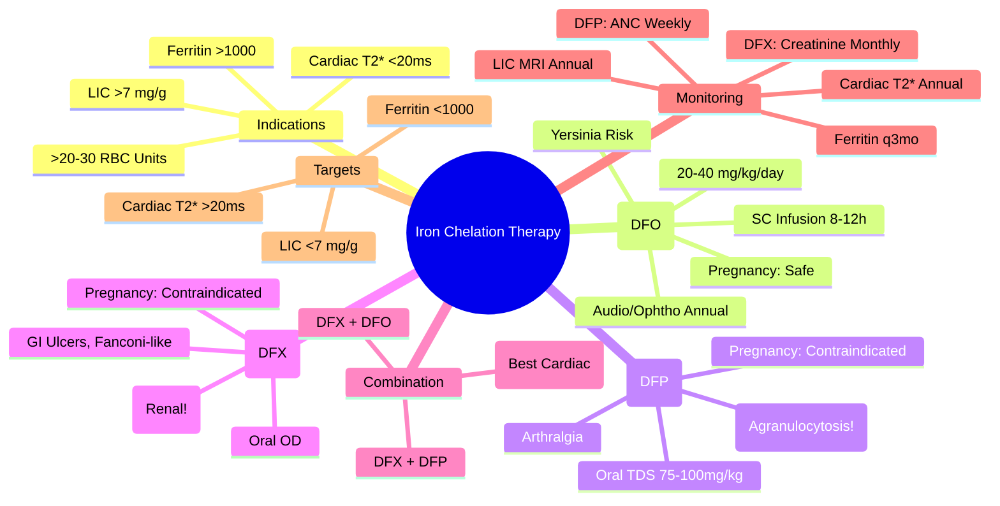

# Iron Chelation Therapy

> [!info] **Davidson Ch 25 Alignment**: Transfusion Medicine / Supportive Care → Iron Chelation Therapy
> **FCPS/MRCP Focus**: Indications (Ferritin >1000, >20 units), Agents (DFO, DFP, DFX), Dosing, Monitoring (Ferritin, LIC, MRI T2*), Side Effects, Combination Therapy, Pregnancy

---

## 🎯 Learning Objectives

- [ ] Define **Indications**: **Ferritin >1000 µg/L** OR **>20-30 RBC Units** transfused OR **Liver Iron Concentration (LIC) >7 mg/g dw** OR **Cardiac T2* <20 ms**
- [ ] Compare **Three Chelators**: **Deferoxamine (DFO)**, **Deferiprone (DFP)**, **Deferasirox (DFX)** – Route, Dose, Monitoring, Side Effects
- [ ] Apply **Monitoring**: **Ferritin q3mo**, **LIC (MRI R2/FerriScan) Annual**, **Cardiac MRI T2* Annual (after age 10/first chelation)**
- [ ] Manage **Side Effects**: **DFO** (Local, Audio/Ophthal, Growth), **DFP** (Agranulocytosis, Arthralgia, GI), **DFX** (Renal, GI, Rash)
- [ ] Apply **Combination Therapy**: **DFO + DFP** (Synergistic, Alternate days), **DFX + DFP**, **DFX + DFO**
- [ ] Manage **Pregnancy**: **DFO Safe (Category C, but experience)**, **DFP Contraindicated**, **DFX Contraindicated**

---

## 📖 Indications for Iron Chelation

| Indication | Threshold |
|------------|-----------|
| **Serum Ferritin** | **>1000 µg/L** (on 2 occasions, 4-6 weeks apart) |
| **Transfusion Burden** | **>20-30 RBC Units** lifetime |
| **Liver Iron Concentration (LIC)** | **>7 mg/g dry weight** (MRI R2/FerriScan) |
| **Cardiac Iron** | **MRI T2* <20 ms** (High Risk <10 ms) |
| **Clinical** | **Symptomatic Iron Overload** (Cardiac, Endocrine, Hepatic) |

> [!tip] **FCPS/MRCP**: **Start Chelation when Ferritin >1000 OR >20 Units Transfused**. **Goal: Ferritin <1000, LIC <7mg/g, Cardiac T2* >20ms**. **Three Agents: DFO (SC), DFP (Oral), DFX (Oral)**.

---

## 💊 Chelating Agents Comparison

### Deferoxamine (DFO) – **Parenteral, Gold Standard**

| Parameter | Details |
|-----------|---------|
| **Route** | **Subcutaneous (SC) Infusion** 8-12 hours/night, 5-7 days/week (Pump) |
| **Dose** | **20-40 mg/kg/day** (Max 50 mg/kg) |
| **Mechanism** | **Hexadentate**, 1:1 Fe³⁺ binding, Excreted in Urine (vincent red) + Faeces |
| **Monitoring** | **Ferritin q3mo**, **Annual Audio/Ophthalmology**, **Growth (Children)**, **LIC/MRI T2* Annually** |
| **Key Side Effects** | **Local Reactions** (Induration, Pain), **Ototoxicity** (High-frequency hearing loss), **Ocular Toxicity** (Retinopathy, Cataract), **Growth Retardation** (Children), **Yersinia Sepsis** (Risk ↑ with high dose) |
| **Pregnancy** | **Category C** – **Safe to Continue** (Decades of Experience), Dose Adjust if Needed |

### Deferiprone (DFP) – **Oral, 3x Daily**

| Parameter | Details |
|-----------|---------|
| **Route** | **Oral**, **75-100 mg/kg/day** in **3 Divided Doses (TDS)** |
| **Mechanism** | **Bidentate**, 3:1 Fe³⁺ binding, Excreted in Urine (Red/Orange) |
| **Monitoring** | **NEUTROPHIL COUNT WEEKLY** (Agranulocytosis Risk), **Ferritin q3mo**, **LIC/MRI Annually**, **Joints** |
| **Key Side Effects** | **AGRANULOCYTOSIS (1-2%) – NEUTROPENIA**, **Arthralgia/Arthritis** (Zinc Chelation), **GI Upset**, **Zinc Deficiency**, **Neurological** (Rare) |
| **Pregnancy** | **CONTRAINDICATED** (Teratogenic in Animals) |

### Deferasirox (DFX) – **Oral, Once Daily**

| Parameter | Details |
|-----------|---------|
| **Formulations** | **Dispersible Tablets** (Older), **Film-Coated Tablets (JADENU)** – Higher Bioavailability (30% Less Dose) |
| **Dose** | **Dispersible: 20-40 mg/kg/day**; **Film-Coated: 14-28 mg/kg/day** (Once Daily, Empty Stomach) |
| **Mechanism** | **Tridentate**, 2:1 Fe³⁺ binding, Excreted in Faeces (Biliary) |
| **Monitoring** | **MONTHLY RENAL FUNCTION (Creatinine, eGFR, Proteinuria)**, **Ferritin q3mo**, **LFT**, **LIC/MRI Annually**, **Ophthalmology** |
| **Key Side Effects** | **RENAL TUBULAR DYSFUNCTION** (Fanconi-like – Proteinuria, Glycosuria, Aminoaciduria), **GI Ulceration/Haemorrhage**, **Rash**, **Hepatic Toxicity** |
| **Pregnancy** | **CONTRAINDICATED** (Animal Teratogenicity) |

---

## ⚠️ Monitoring Schedule (All Chelators)

| Parameter | Frequency | Target / Action Threshold |
|-----------|-----------|---------------------------|
| **Serum Ferritin** | **Every 3 Months** | **Goal <1000 µg/L**; ↑↑ → Intensify Chelation |
| **Liver Iron Concentration (LIC)** | **Annual (MRI R2/FerriScan)** | **<7 mg/g dw (Low Risk)**; **7-15 (Moderate)**; **>15 (High Risk)** |
| **Cardiac MRI T2*** | **Annual (Age >10 or >5y Chelation)** | **>20 ms (Normal)**; **10-20 (Mild)**; **6-10 (Moderate)**; **<6 (Severe)** |
| **Renal Function (Creatinine, eGFR, UACR)** | **Monthly (DFX)**, q3mo (DFP/DFO) | **DFX: ↑ Creatinine >33% from Baseline → Dose Reduce/Hold** |
| **Audiology / Ophthalmology** | **Annual (DFO)** | **Early Detection of Ototoxicity/Retinopathy** |
| **FBC (Neutrophils)** | **WEEKLY (DFP)** | **ANC <1.5 → Hold DFP**; **ANC <0.5 → Stop DFP** |
| **LFT / Zinc (DFP)** | q3mo | Zinc Supplementation if Deficient |

---

## 🔄 Combination Chelation Therapy

| Combination | Regimen | Indication |
|-------------|---------|------------|
| **DFO + DFP** | **DFO SC 5-7 nights/week + DFP TDS** (Alternate Days or Concurrent) | **Severe Iron Overload**, **Cardiac Iron (T2* <10ms)**, **Poor Adherence to DFO Alone** |
| **DFX + DFP** | **DFX OD + DFP TDS** | **Intolerant to DFO**, **Need Strong Chelation** |
| **DFX + DFO** | **DFX OD + DFO SC** | **Renal Impairment (DFX Dose Limited)**, **Complementary Excretion (Biliary + Renal)** |

> [!tip] **Combination = Synergistic (DFO/DFP "Shuttle Effect")**, **Lower Individual Doses**, **Improved Cardiac Iron Removal**. **Monitor All Drug-Specific Toxicities**.

---

## 📊 Iron Overload Assessment

| Method | Principle | Target |
|--------|-----------|--------|
| **Serum Ferritin** | Acute Phase Reactant + Iron Stores | **Trend > Single Value**; **<1000 µg/L Goal** |
| **Liver Iron Concentration (LIC)** | **MRI R2* (FerriScan)** or **Liver Biopsy** | **<7 mg/g dw (Low)**, **7-15 (Moderate)**, **>15 (Severe)** |
| **Cardiac MRI T2*** | **T2* Relaxometry** (Black Blood) | **>20 ms (Safe)**; **10-20 (Mild)**; **6-10 (Moderate)**; **<6 (Severe)** |
| **Serum Hepcidin** | Emerging | Low in Iron Overload (Suppressed by Iron) |

> [!warning] **Cardiac MRI T2* <10 ms = HIGH RISK** for cardiac failure/arrhythmia → **Intensify Chelation (Combination DFO+DFP)**. **T2* <6 ms = SEVERE** → Emergency Intensification.

---

## 🔄 Chelation by Condition

| Condition | Preferred Chelator(s) | Notes |
|-----------|----------------------|-------|
| **Thalassaemia Major** | **DFO (SC) ± DFP** OR **DFX ± DFP** | **DFO + DFP preferred for Cardiac Iron** |
| **Thalassaemia Intermedia** | **DFX** (Oral Convenience) | If Transfusion-Dependent – Same as Major |
| **Sickle Cell Disease (Chronic Tx)** | **DFX** OR **DFO + DFP** | **DFX Preferred** (Oral, Renal Monitor) |
| **MDS / Aplastic Anaemia (Chronic Tx)** | **DFX** (Oral) | **DFO SC Acceptable** |
| **Cardiac Iron (T2* <10ms)** | **DFO + DFP (Combination)** | **Most Effective Cardiac Removal** |
| **Renal Impairment (eGFR <40)** | **DFO** (SC) OR **DFP** (Dose Adjust) | **DFX Contraindicated if eGFR <40** (or Dose Reduce) |
| **Pregnancy** | **DFO** (Continue) | **DFP/DFX Contraindicated** |

---

## 💡 FCPS/MRCP High-Yield Summary

| Topic | Key Point |
|-------|-----------|
| **Indications** | **Ferritin >1000**, **>20 RBC Units**, **LIC >7 mg/g**, **Cardiac T2* <20 ms** |
| **DFO** | **SC Infusion 8-12h**, 20-40 mg/kg; **Audio/Ophtho Annual**; **Yersinia Risk** |
| **DFP** | **Oral TDS 75-100 mg/kg**; **WEEKLY ANC** (Agranulocytosis); **Arthralgia** |
| **DFX** | **Oral OD**, **Monthly Renal Function**; **GI Ulcers, Fanconi-like Renal** |
| **Combination** | **DFO+DFP** = Best for Cardiac Iron (T2* <10ms) |
| **Monitoring** | **Ferritin q3mo**, **LIC Annual (MRI)**, **Cardiac T2* Annual (>10y)**, **DFP: Weekly ANC**, **DFX: Monthly Creatinine** |
| **Targets** | **Ferritin <1000**, **LIC <7 mg/g**, **Cardiac T2* >20 ms** |
| **Pregnancy** | **DFO Safe**, **DFP/DFX Contraindicated** |
| **Targets** | **LIC <7 mg/g**, **Cardiac T2* >20ms**, **Ferritin <1000** |

---

## ❓ Viva Questions

1. **What are the indications for starting iron chelation therapy?**
   - **Ferritin >1000 µg/L**, **>20-30 RBC Units Transfused**, **LIC >7 mg/g**, **Cardiac T2* <20 ms**

2. **Compare the three iron chelators: Route, Monitoring, Major Toxicity.**
   - **DFO**: SC Infusion, Audio/Ophtho Annual, Local Reactions/Yersinia; **DFP**: Oral TDS, **Weekly ANC (Agranulocytosis)**, Arthralgia; **DFX**: Oral OD, **Monthly Renal**, GI/Renal

2. **What is the monitoring schedule for Deferiprone?**
   - **WEEKLY NEUTROPHIL COUNT** (Agranulocytosis Risk), Ferritin q3mo, LIC/MRI Annual, Joint Assessment

3. **Which chelation combination is most effective for cardiac iron overload?**
   - **DFO + DFP (Combination)** – Synergistic "Shuttle Effect", Best Cardiac Iron Removal

4. **How do you assess cardiac iron overload and what are the thresholds?**
   - **Cardiac MRI T2***: **>20 ms Normal**, **10-20 Mild**, **6-10 Moderate**, **<6 Severe**; **<10ms = High Risk**

5. **What is the monitoring for Deferasirox and what is the major renal toxicity?**
   - **Monthly Creatinine/eGFR/UACR**; **Fanconi-like Syndrome** (Proteinuria, Glycosuria, Aminoaciduria)

6. **Which chelator is safe in pregnancy and which are contraindicated?**
   - **DFO Safe (Continue)**; **DFP Contraindicated**, **DFX Contraindicated**

7. **When do you use combination chelation therapy?**
   - **Severe Iron Overload**, **Cardiac T2* <10ms**, **Poor Adherence to Monotherapy**, **Inadequate Response to Single Agent**

8. **What is the "Shuttle Effect" in DFO + DFP combination?**
   - **DFP (Cell Permeable) Chelates Intracellular Iron → Transfers to DFO (Excreted in Urine)** → Enhanced Cardiac Iron Removal

9. **How is Liver Iron Concentration measured non-invasively?**
   - **MRI R2* (FerriScan)** – Gold Standard non-invasive LIC measurement

10. **What is the target ferritin level on chelation therapy?**
    - **<1000 µg/L** (Maintenance Goal)

---

## 🧠 Confusions & Mnemonics

| Confusion | Clarification |
|-----------|---------------|
| **DFO vs DFP vs DFX Monitoring** | **DFO = Audio/Ophtho**; **DFP = Weekly ANC**; **DFX = Monthly Creatinine** |
| **DFO + DFP vs Single** | **Combination = Synergistic Shuttle Effect**, Best for Cardiac Iron |
| **DFP Agranulocytosis** | **1-2% Incidence**, **Weekly ANC Mandatory**, **Stop if ANC <0.5** |
| **DFX Renal Toxicity** | **Fanconi-like** (Proteinuria, Glycosuria, Aminoaciduria); **Monthly Creatinine** |
| **Pregnancy Chelation** | **DFO Only Safe**; **DFP/DFX Contraindicated** |

| Mnemonic | Meaning |
|----------|---------|
| **"DFO = SubCut, Audio/Ophtho"** | Deferoxamine |
| **"DFP = TDS, ANC Weekly"** | Deferiprone |
| **"DFX = Once Daily, Creatinine Monthly"** | Deferasirox |
| **"DFO+DFP = Cardiac Best"** | Combination |
| **"T2* <10 = Cardiac Danger"** | Cardiac MRI |
| **"LIC <7 = Liver Safe"** | Liver Iron |
| **"Ferritin <1000 = Goal"** | Ferritin Target |
| **"Pregnancy = DFO Only"** | Pregnancy Safety |

---

## 🗺️ Mind Map

---

## 📋 One-Page Revision Card

| **IRON CHELATION THERAPY – FCPS/MRCP REVISION CARD** |
|------------------------------------------------------|
| **Indications**: Ferritin >1000, >20-30 Units, LIC >7mg/g, T2* <20ms |
| **DFO**: SC 8-12h, 20-40mg/kg, **Audio/Ophtho Annual**, Yersinia Risk, **Preg: Safe** |
| **DFP**: Oral TDS 75-100mg/kg, **Weekly ANC (Agranulocytosis)**, Arthralgia, **Preg: NO** |
| **DFX**: Oral OD, **Monthly Creatinine**, GI Ulcers, Fanconi Renal, **Preg: NO** |
| **Combination**: **DFO + DFP = Best Cardiac** (Shuttle Effect) |
| **Monitoring**: Ferritin q3mo, **LIC MRI Annual**, **Cardiac T2* Annual**, DFP: ANC Weekly, DFX: Cr Monthly |
| **Targets**: Ferritin <1000, LIC <7mg/g, Cardiac T2* >20ms |
| **Pregnancy**: **DFO Safe**, DFP/DFX Contraindicated |

---

## 📅 Spaced Repetition Tracker

| Review | Date | Score (1-5) | Next Review |
|--------|------|-------------|-------------|
| Day 1 | 2025-06-16 | | 2025-06-17 |
| Day 3 | | | |
| Day 7 | | | |
| Day 15 | | | |
| Day 30 | | | |

---

## 🎯 Must Know / Should Know / Nice to Know

| Level | Content |
|-------|---------|
| **Must Know** | Indications (Ferritin >1000, >20 units), Three chelators (DFO SC, DFP Oral TDS, DFX Oral OD), Monitoring (DFP: Weekly ANC, DFX: Monthly Cr, DFO: Audio/Ophtho Annual), Cardiac MRI T2* thresholds, LIC MRI, Combination DFO+DFP for cardiac iron, Pregnancy: DFO only, Targets (Ferritin <1000, LIC <7, T2* >20) |
| **Should Know** | Shuttle mechanism DFO+DFP, DFO dose escalation, DFP zinc deficiency, DFX film-coated vs dispersible dosing, Renal dosing adjustments, Cardiac T2* physics, LIC measurement methods (R2 vs R2*), Deferoxamine test (ocular), Deferiprone zinc supplementation, Cost-effectiveness, Adherence strategies, Chelation in non-transfusion iron overload (Hereditary Haemochromatosis, Porphyria Cutanea Tarda) |
| **Nice to Know** | Novel chelators (Deferitrin, FBS0701), Combination DFX+DFP trials, Gene therapy impact on chelation need, Cardiac T2* mapping techniques, Hepcidin as biomarker, Nanoparticle delivery, Individualised chelation based on MRI, Psychosocial aspects of adherence, Cost-effectiveness analyses, Paediatric dosing, Chelation in thalassaemia intermedia, Sickle cell specific chelation (less cardiac iron), Chelation in MDS/AML vs Thalassaemia |

---

## ✅ Self-Test Scorecard

| Section | Score (0-10) | Notes |
|---------|--------------|-------|
| Indications & Targets | | |
| Deferoxamine (DFO) | | |
| Deferiprone (DFP) | | |
| Deferasirox (DFX) | | |
| Combination Therapy | | |
| Monitoring & Targets | | |
| Pregnancy & Special Populations | | |
| Viva Questions | | |

---

## 🔗 Local Navigation

- **Previous**: [[Transfusion Reactions]]
- **Next**: [[G-CSF & Growth Factors]]
- **Section Hub**: [[Transfusion Medicine]] / [[Supportive Care in Haematology]]
- **MOC**: [[Hematology MOC]]
- **Template**: [[../Templates/Hematology Topic Template]]

---

*Generated for FCPS/MRCP exam preparation. Based on Davidson Medicine 24th Ed Chapter 25.*