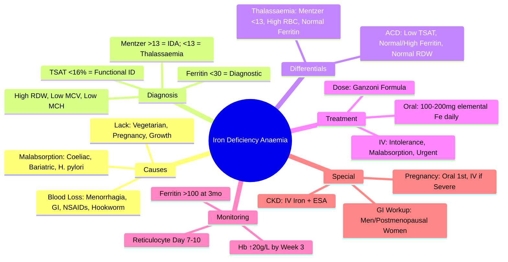

# Iron Deficiency Anaemia (IDA)

## Learning Objectives
- [ ] Diagnose IDA using CBC, iron studies, and peripheral smear
- [ ] Differentiate IDA from thalassaemia trait and anaemia of chronic disease
- [ ] Identify underlying causes (GI blood loss, menstrual loss, malabsorption)
- [ ] Apply oral and IV iron therapy with monitoring
- [ ] Identify FCPS/MRCP high-yield diagnostic and management pearls

---

## Definition & Epidemiology

| Feature | Detail |
|---------|--------|
| **Definition** | Anaemia due to insufficient iron for haemoglobin synthesis |
| **Prevalence** | **Most common anaemia worldwide** (~30% global population) |
| **High-risk Groups** | Women of reproductive age, children, elderly, vegetarians, blood donors |
| **MCV** | **Low (<80 fL)** — microcytic |
| **MCH** | Low |
| **RDW** | **High** (>14.5%) — anisocytosis |

---

## Aetiology: The "3 Ls" (Loss, Lack, Limited absorption)

```mermaid
flowchart TD
    A[Iron Deficiency Anaemia] --> B{Blood Loss}
    A --> C{Dietary Lack}
    A --> D{Malabsorption}
    B --> B1[Menorrhagia]
    B --> B2[GI Blood Loss (Ulcers, Cancer, Angiodysplasia)]
    B --> B3[NSAID/Aspirin Use]
    B --> B4[Hookworm]
    C --> C1[Low Dietary Iron]
    C --> C2[Vegetarian/Vegan Diet]
    C --> C3[Increased Demand (Pregnancy, Growth)]
    D --> D1[Coeliac Disease]
    D --> D2[Gastric Bypass/Bariatric Surgery]
    D --> D3[H. pylori Gastritis]
    D --> D4[PPI Long-term Use]
```

---

## Clinical Features

| System | Features |
|--------|----------|
| **General** | Fatigue, lethargy, exertional dyspnoea, palpitations |
| **Skin/Mucosa** | Pallor, angular stomatitis, glossitis, koilonychia (spoon nails) |
| **Cardiovascular** | Tachycardia, flow murmur, high-output failure (severe) |
| **Neurological** | Pica (pagophagia - ice craving), restless legs |
| **Other** | Dysphagia (Plummer-Vinson syndrome - rare) |

> **FCPS/MRCP**: **Koilonychia (spoon nails) and pica (ice craving) are classic but late signs**.

---

## Diagnostic Algorithm

```mermaid
flowchart TD
    A[Suspect IDA: Microcytic Anaemia] --> B[Check Ferritin]
    B --> C{Ferritin <30 µg/L?}
    C -->|Yes| D[Diagnose IDA]
    C -->|No (30-100)| E[Check CRP]
    E --> F{CRP Elevated?}
    F -->|Yes| G[Ferritin Falsely Normal → Treat as IDA if Clinical Suspicion]
    F -->|No| H[Consider Other Causes: Thalassaemia, ACD]
    C -->|Ferritin >100| I[IDA Unlikely]
```

---

## Laboratory Findings

| Test | IDA | Thalassaemia Trait | Anaemia of Chronic Disease (ACD) |
|------|-----|-------------------|----------------------------------|
| **Hb** | ↓ | ↓ (mild) | ↓ (mild-moderate) |
| **MCV** | **Low (<80 fL)** | **Low (<80 fL)** | Normal/Low-normal |
| **MCH** | Low | Low | Normal/Low |
| **RDW** | **High (>14.5%)** | Normal | Normal/High |
| **Ferritin** | **<30 µg/L** | Normal/High | **Normal/High** |
| **Serum Iron** | ↓↓ | Normal/High | ↓ |
| **TIBC** | **High** | Normal | **Low** |
| **Transferrin Saturation** | **<16%** | Normal/High | **Low** |
| **sTfR** | **High** | Normal | Normal/High |
| **sTfR/log Ferritin Index** | **High** | Normal | Normal |

> **FCPS/MRCP**: **Ferritin <30 µg/L = diagnostic of IDA**; **TSAT <16% = functional iron deficiency**; **sTfR/log Ferritin index >1 = IDA even with inflammation**.

---

## Peripheral Smear Findings

| Feature | IDA |
|---------|-----|
| **RBC Morphology** | Microcytic, hypochromic |
| **Anisocytosis** | **Marked (High RDW)** |
| **Poikilocytosis** | Pencil cells, elliptocytes, target cells |
| **Reticulocyte Count** | Low/Inappropriately normal |
| **Polychromasia** | Reduced |

---

## Differential Diagnosis: Microcytic Anaemia

```mermaid
flowchart TD
    A[Microcytic Anaemia (MCV <80)] --> B{RDW}
    B -->|High| C[IDA likely]
    B -->|Normal| D[Thalassaemia Trait?]
    D --> E{HbA2}
    E -->|>3.5%| F[Beta Thalassaemia Trait]
    E -->|Normal| G[Alpha Thalassaemia / ACD]
    A --> H{Iron Studies}
    H -->|Ferritin <30| I[IDA]
    H -->|Ferritin Normal/High + Low TSAT| J[ACD]
```

| Feature | **IDA** | **Beta Thal Trait** | **ACD** |
|---------|---------|---------------------|---------|
| **MCV** | Low | Low (disproportionate to Hb) | Normal/Low-normal |
| **RDW** | **High** | Normal | Normal/High |
| **RBC Count** | Low | **Normal/High** | Normal/Low |
| **HbA2** | Normal | **>3.5%** | Normal |
| **Ferritin** | **<30** | Normal/High | Normal/High |
| **Mentzer Index (MCV/RBC)** | **>13** | **<13** | — |

---

## Investigation for Underlying Cause

### Mandatory Investigations
| Test | Indication |
|------|------------|
| **FBC + Film** | Confirm microcytic hypochromic |
| **Ferritin** | **Diagnostic if <30** |
| **Iron Studies** | Iron, TIBC, TSAT, sTfR |
| **Coeliac Screen** | **TTG-IgA + Total IgA** (all IDA) |
| **Faecal Occult Blood** | If >50 or GI symptoms |

### Directed by Age/Sex
| Group | Mandatory Investigations |
|-------|-------------------------|
| **Men & Postmenopausal Women** | **Upper + Lower GI Endoscopy** (exclude GI malignancy) |
| **Premenopausal Women** | Gynae history; endoscopy if >50 or symptoms |
| **Children** | Dietary history; Coeliac screen; Stool for parasites |

> **FCPS/MRCP**: **All men and postmenopausal women with IDA need GI endoscopy** — exclusion of GI malignancy is mandatory.

---

## Management

### Oral Iron Therapy (First-Line)
| Parameter | Detail |
|-----------|--------|
| **Dose** | **Elemental Iron 100-200 mg/day** (e.g., Ferrous Fumarate 210mg = 65mg elemental) |
| **Frequency** | **Once daily** (alternate day may improve absorption) |
| **Duration** | **3 months after Hb normalisation** (replete stores) |
| **Absorption Enhancers** | Vitamin C (250mg), empty stomach |
| **Absorption Inhibitors** | Tea, coffee, calcium, antacids, PPIs (take 2h apart) |

> **Alternate Day Dosing** may improve absorption and reduce GI side effects (hepcidin regulation).

### IV Iron (Second-Line)
| Indication | Preparation | Dose Calculation |
|------------|-------------|------------------|
| **Intolerance to Oral** | Ferric Carboxymaltose (Ferinject®) | **Ganzoni Formula**: Weight (kg) × (Target Hb - Actual Hb) × 2.4 + 500 |
| **Malabsorption** | Iron Sucrose (Venofer®) | |
| **Rapid Correction Needed** | Iron Isomaltoside (Monofer®) | |
| **CKD/IBD/Erythropoietin Use** | | |

> **Ganzoni Formula**: Total Iron Deficit (mg) = Weight (kg) × (Target Hb - Actual Hb) × 2.4 + 500 mg (stores)

---

## Monitoring Response

| Parameter | Timeline | Target |
|-----------|----------|--------|
| **Reticulocytosis** | Days 3-10 | Peak Day 7-10 |
| **Hb Rise** | **≥20 g/L by 3 weeks** | ≥20 g/L by Week 3 |
| **Hb Normalisation** | **6-8 weeks** | Hb >130 (M), >120 (F) |
| **Ferritin** | **3 months** | **>100 µg/L** (stores replete) |

> **Failure to Respond**: Check adherence, ongoing blood loss, malabsorption, wrong diagnosis (Thalassaemia, ACD, MDS).

---

## Special Situations

### Pregnancy
| Trimester | Hb Threshold | Action |
|-----------|--------------|--------|
| **1st** | <110 g/L | Oral Iron |
| **2nd** | <105 g/L | Oral Iron |
| **3rd** | <110 g/L | IV Iron if Severe (<100) or Non-compliant |

### CKD (on ESA)
| Target Hb | Iron Target |
|-----------|-------------|
| 100-120 g/L | **TSAT >20%**, **Ferritin >100** (IV Iron preferred) |

---

## FCPS/MRCP High-Yield Summary

| Concept | Key Points |
|---------|------------|
| **Most Common Anaemia** | **Iron Deficiency Anaemia** (global) |
| **Diagnostic Triad** | **Ferritin <30**, **TSAT <16%**, **High RDW** |
| **Ferritin Cut-off** | **<30 µg/L = Diagnostic** (CRP <10) |
| **TSAT** | **<16% = Functional Iron Deficiency** |
| **Mentzer Index** | **MCV/RBC <13 = Thalassaemia**; **>13 = IDA** |
| **Oral Iron** | 100-200mg elemental Fe daily; Alternate day dosing |
| **IV Iron Indications** | Intolerance, Malabsorption, Rapid correction needed |
| **Ganzoni Formula** | Weight × (Target Hb - Actual Hb) × 2.4 + 500 |
| **Response Target** | **Hb ↑20 g/L by Week 3**; Hb normal by 6-8 weeks |
| **GI Workup** | **Men & Postmenopausal Women** → Upper + Lower GI Endoscopy |

---

## Viva Questions

1. **What is the diagnostic triad for Iron Deficiency Anaemia?**
2. **How do you differentiate IDA from Thalassaemia Trait?**
3. **What is the Mentzer Index and its cut-off?**
3. **When do you use IV Iron instead of Oral?**
4. **What is the Ganzoni Formula for IV Iron dose?**
4. **When do you investigate GI tract in IDA?**
5. **What is the expected Hb rise with oral iron at 3 weeks?**
5. **How do you manage IDA in pregnancy?**
6. **What is the difference between Functional and Absolute Iron Deficiency?**
6. **What is the role of sTfR in diagnosis?**

---

## Confusions & Mnemonics

| Confusion | Clarification |
|-----------|---------------|
| **Ferritin in Inflammation** | **Ferritin is Acute Phase Reactant** — Can be normal/high in IDA + Inflammation → Use sTfR or CRP |
| **Thalassaemia vs IDA** | **Mentzer Index: MCV/RBC <13 = Thalassaemia**; RBC count high in Thalassaemia |
| **Functional vs Absolute ID** | **Functional = Low TSAT but Normal Ferritin** (Inflammation); **Absolute = Low Ferritin** |
| **High Ferritin + Low TSAT** | **Anaemia of Chronic Disease** — Functional Iron Deficiency |
| **Mentzer Index** | **<13 = Thalassaemia**; **>13 = IDA** |
| **Ferritin in Inflammation** | **CRP >10 → Ferritin Falsely Normal** → Use sTfR |

---

## Mind Map



---

## One-Page Revision Card

| **Iron Deficiency Anaemia** | **Key Features** |
|----------------------------|------------------|
| **MCV** | <80 fL (Microcytic) |
| **RDW** | **High (>14.5%)** |
| **Ferritin** | **<30 µg/L** (Diagnostic) |
| **TSAT** | **<16%** |
| **Mentzer Index** | **>13** (MCV/RBC) |
| **sTfR** | **Elevated** |

| **Oral Iron** | **Details** |
|--------------|-------------|
| Dose | 100-200mg Elemental Fe daily |
| Duration | 3 months after Hb normal |
| Enhanced by | Vitamin C, Empty Stomach |
| Inhibited by | Tea, Coffee, Calcium, PPI |

| **IV Iron** | **Indications** |
|-------------|-----------------|
| Ferric Carboxymaltose | Intolerance, Malabsorption, Urgent |
| Ganzoni Formula | Weight × (Target Hb - Actual) × 2.4 + 500 |

| **Monitoring** | **Target** |
|----------------|------------|
| Reticulocytes | Peak Day 7-10 |
| Hb Rise | ≥20 g/L by Week 3 |
| Ferritin | >100 µg/L at 3 Months |

---

## Spaced Repetition Tracker

| Day | 1 | 3 | 7 | 15 | 30 |
|-----|---|---|---|---|---|
| Diagnostic Triad (Ferritin, TSAT, RDW) | ☐ | ☐ | ☐ | ☐ | ☐ |
| Mentzer Index Cut-off | ☐ | ☐ | ☐ | ☐ | ☐ |
| Ganzoni Formula | ☐ | ☐ | ☐ | ☐ | ☐ |
| Oral vs IV Indications | ☐ | ☐ | ☐ | ☐ | ☐ |
| Monitoring Targets | ☐ | ☐ | ☐ | ☐ | ☐ |

---

## Self-Test Scorecard

| Question | My Answer | Correct? |
|----------|-----------|----------|
| Diagnostic Triad (Ferritin, TSAT, RDW) |  |  |
| Mentzer Index Cut-off |  |  |
| Ganzoni Formula |  |  |
| Oral vs IV Indications |  |  |
| Monitoring Targets |  |  |

---

## Local Navigation

- [[Anaemia and Red Cell Disorders/Microcytic Anaemia|Microcytic Anaemia Overview]]
- [[Anaemia and Red Cell Disorders/Anaemia of Chronic Disease|Anaemia of Chronic Disease]]
- [[Anaemia and Red Cell Disorders/Thalassaemia|Thalassaemia]]
- [[Bleeding and Thrombotic Disorders/Gastrointestinal Bleeding|GI Bleeding]]
- [[Transfusion Medicine/Red Cell Transfusion|Red Cell Transfusion]]
---

> Auto-generated study sections for "Hematology" — Ch 24: Haematology & Transfusion Medicine.

## Flashcards (30 generated)

- Q: What is the definition of Hematology?
  A: ## Aetiology: The "3 Ls" (Loss, Lack, Limited absorption)
- Q: What is FBC + Film of Hematology?
  A: Confirm microcytic hypochromic
- Q: What is Ferritin of Hematology?
  A: Diagnostic if <30
- Q: What is Iron Studies of Hematology?
  A: Iron, TIBC, TSAT, sTfR
- Q: What is Coeliac Screen of Hematology?
  A: TTG-IgA + Total IgA (all IDA)
- Q: What is Faecal Occult Blood of Hematology?
  A: If >50 or GI symptoms
- Q: What is the dose of Hematology?
  A: Elemental Iron 100-200 mg/day (e.g., Ferrous Fumarate 210mg = 65mg elemental)
- Q: What is Frequency of Hematology?
  A: Once daily (alternate day may improve absorption)
- Q: What is Duration of Hematology?
  A: 3 months after Hb normalisation (replete stores)
- Q: What is Absorption Enhancers of Hematology?
  A: Vitamin C (250mg), empty stomach
- Q: What is Absorption Inhibitors of Hematology?
  A: Tea, coffee, calcium, antacids, PPIs (take 2h apart)
- Q: What is FBC + Film of Hematology?
  A: Confirm microcytic hypochromic
- Q: What is Ferritin of Hematology?
  A: Diagnostic if <30
- Q: What is Iron Studies of Hematology?
  A: Iron, TIBC, TSAT, sTfR
- Q: What is Coeliac Screen of Hematology?
  A: TTG-IgA + Total IgA (all IDA)
- Q: What is the dose of Hematology?
  A: Elemental Iron 100-200 mg/day (e.g., Ferrous Fumarate 210mg = 65mg elemental)
- Q: What is Frequency of Hematology?
  A: Once daily (alternate day may improve absorption)
- Q: What is Duration of Hematology?
  A: 3 months after Hb normalisation (replete stores)
- Q: What is Absorption Enhancers of Hematology?
  A: Vitamin C (250mg), empty stomach
- Q: What is Absorption Inhibitors of Hematology?
  A: Tea, coffee, calcium, antacids, PPIs (take 2h apart)
- Q: What is Most Common Anaemia of Hematology?
  A: Iron Deficiency Anaemia (global)
- Q: What is Diagnostic Triad of Hematology?
  A: Ferritin <30, TSAT <16%, High RDW
- Q: What is Ferritin Cut-off of Hematology?
  A: <30 µg/L = Diagnostic (CRP <10)
- Q: What is TSAT of Hematology?
  A: <16% = Functional Iron Deficiency
- Q: What is Mentzer Index of Hematology?
  A: MCV/RBC <13 = Thalassaemia; >13 = IDA
- Q: What is Oral Iron of Hematology?
  A: 100-200mg elemental Fe daily; Alternate day dosing
- Q: What is Hematology indicated for?
  A: Intolerance, Malabsorption, Rapid correction needed
- Q: What is Ganzoni Formula of Hematology?
  A: Weight × (Target Hb - Actual Hb) × 2.4 + 500
- Q: What is Response Target of Hematology?
  A: Hb ↑20 g/L by Week 3; Hb normal by 6-8 weeks
- Q: What is GI Workup of Hematology?
  A: Men & Postmenopausal Women → Upper + Lower GI Endoscopy

## MCQs (1 generated)

1. **Which of the following best describes Hematology?**
   A. **## Aetiology: The "3 Ls" (Loss, Lack, Limited absorption)**
   B. An unrelated condition not matching the clinical picture of Hematology
   C. A complication seen late in the disease course of Hematology
   D. A condition that mimics Hematology but has a different underlying cause

## SBA Questions (1 generated)

1. A patient with suspected Hematology presents with: Definition — Anaemia due to insufficient iron for haemoglobin synthesis; Prevalence — Most common anaemia worldwide (~30% global population); High-risk Groups — Women of reproductive age, children, elderly, vegetarians, blood donors. What is the most likely diagnosis?
   A. **Hematology**
   B. A condition that mimics Hematology but is not the same entity
   C. A complication of Hematology rather than the primary diagnosis
   D. An unrelated condition in the same clinical category as Hematology

## PasTest Scenario SBAs (Clinical Vignettes)

> **Auto-generated PasTest/Mediscope-style scenario SBAs** grounded in the authored source. Each scenario tests a real clinical fact (triad, specific sign, contraindication, trial, first-line Rx) extracted from the topic. *Source: Ch 24: Haematology — Iron Deficiency Anaemia*

**Q1.** Which of the following is characterised by the clinical triad: Ferritin, TSAT, RDW?

  - **A.** Iron Deficiency Anaemia
  - **B.** Iron deficiency anaemia
  - **C.** B12 deficiency
  - **D.** Anaemia of chronic disease

  > **Answer: A** — Iron Deficiency Anaemia
  >
  > *Source:* ths |

---
## Spaced Repetition Tracker
| Day | 1 | 3 | 7 | 15 | 30 |
|-----|---|---|---|---|---|
| Diagnostic Triad (Ferritin, TSAT, RDW) | ☐ | ☐ | ☐ | ☐ | ☐ |
| Mentzer Index Cut-off | ☐ | ☐ | ☐ | ☐

