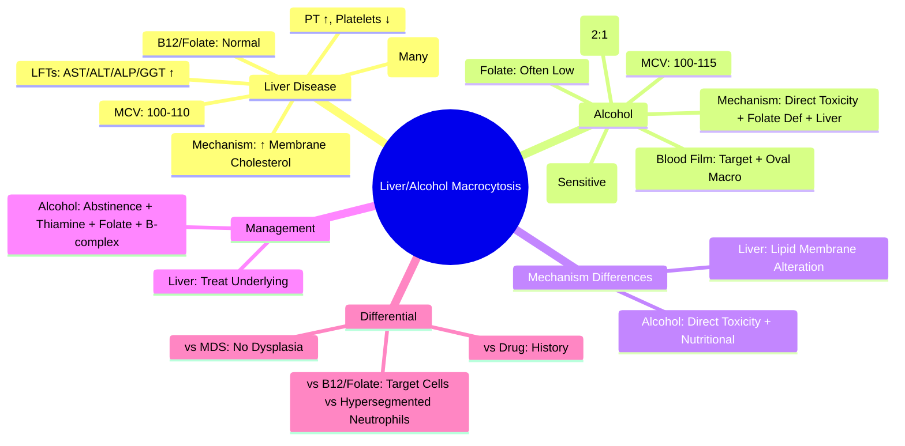

# Liver Disease & Alcohol-Related Macrocytosis

> [!info] **Davidson Ch 25 Alignment**: Anaemia and Red Cell Disorders → Macrocytic Anaemia → Liver Disease & Alcohol
> **FCPS/MRCP Focus**: Mechanisms in liver disease/alcohol, target cells, normal B12/folate, differentiation from B12/folate deficiency, alcohol's direct toxicity

---

## 🎯 Learning Objectives

- [ ] Explain **Mechanism** of macrocytosis in liver disease: **Altered lipid membrane** → ↑ Surface area:volume ratio
- [ ] Explain **Alcohol's Direct Toxicity**: **Bone marrow suppression** + **Folate deficiency** + **Liver disease**
- [ ] Identify **Key Features**: **Target cells**, **Normal B12/Folate**, **Elevated MCV (often 100-110 fL)**
- [ ] Apply **Diagnostic Approach**: Liver function tests, Alcohol history, B12/Folate levels, Exclude other causes
- [ ] Differentiate from **B12/Folate Deficiency** and **MDS**
- [ ] Manage: **Treat underlying liver disease**, **Alcohol cessation**, **Nutritional support**, **Monitor MCV**

---

## 📖 Pathophysiology

### Liver Disease Macrocytosis

```mermaid
flowchart TD
    A[Liver Disease] --> B[↓ Hepatic Lipid Synthesis]
    B --> C[Altered RBC Membrane Lipid Composition]
    C --> D[↑ Cholesterol/Phospholipid Ratio]
    D --> E[↑ RBC Membrane Surface Area]
    E --> F[↑ Surface Area : Volume Ratio]
    F --> G[Macrocytosis (Round Macrocytes)]
    
    A --> H[↓ Thrombopoietin Production]
    H --> I[Thrombocytopenia]
    
    A --> J[Portal Hypertension → Splenomegaly]
    J --> K[Sequestration → Cytopenias]
```

### Alcohol-Induced Macrocytosis

```mermaid
flowchart TD
    A[Chronic Alcohol] --> B1[**Direct Marrow Toxicity**]
    B1 --> C1[Macrocytosis]
    
    A --> B2[**Folate Deficiency**]
    B2 --> C2[↓ Intake + ↓ Absorption + ↑ Excretion]
    C2 --> D2[Impaired DNA Synthesis]
    D2 --> E1[Macrocytosis + Hypersegmented Neutrophils]
    
    A --> B3[**Liver Disease**]
    B3 --> C3[Altered Lipid Membrane + Target Cells]
    
    A --> B4[**Direct Toxicity + Nutritional**]
    B4 --> C4[Sideroblastic Changes (Ring Sideroblasts)]
```

---

## 🚨 Key Differences: Liver Disease vs Alcohol vs B12/Folate Deficiency

| Feature | **Liver Disease** | **Alcohol** | **B12/Folate Deficiency** |
|---------|-------------------|-------------|---------------------------|
| **MCV** | **100-110 fL** (mild-moderate) | **100-115 fL** | **>115 fL** (often) |
| **RBC Morphology** | **Target cells**, Round macrocytes | **Target cells + Oval macrocytes** | **Oval macrocytes**, Hypersegmented neutrophils |
| **B12/Folate** | **Normal** | **Low/Normal** (if malnutrition) | **Low** |
| **Liver Enzymes** | ↑↑ (AST, ALT, ALP, GGT) | ↑ GGT (specific) | Normal |
| **Platelets** | **↓↓** (Sequestration + ↓TPO) | Normal/↓ | Normal |
| **Coagulation** | PT ↑ (Factor deficiency) | Normal/↑ PT | Normal |
| **Reticulocytes** | Normal/↓ | Normal/↓ | ↓ |
| **Neutrophils** | Normal | Normal | **Hypersegmented (>6 lobes)** |

> [!tip] **Target cells = Hallmark of Liver Disease** (also in HbC, HbE, Thalassaemia, Iron deficiency). **Alcohol = Target cells + Oval macrocytes**. **B12/Folate = Oval macrocytes + Hypersegmented neutrophils**.

---

## 🔬 Diagnostic Workup

```mermaid
flowchart TD
    A[Macrocytosis (MCV >100 fL)] --> B[**Alcohol History + Liver Assessment**]
    B --> C[**LFTs (AST, ALT, ALP, GGT, Albumin, Bilirubin, PT/INR)**]
    C --> D[**Serum B12, Folate, RBC Folate**]
    D --> E{**Liver Disease / Alcohol Excess?**}
    E -->|Yes| F[**Target Cells on Film?**]
    F -->|Yes| G[**Liver/Alcohol Macrocytosis Likely**]
    F -->|No| H[**Consider Other Causes**]
    E -->|No| I[**Standard Macrocytosis Workup**]
    G --> J[**MCV 100-110, Normal B12/Folate, Target Cells**]
```

### Key Investigations

| Test | Liver Disease | Chronic Alcohol |
|------|---------------|-----------------|
| **MCV** | 100-110 fL | 100-115 fL |
| **Blood Film** | **Target cells** (many), Round macrocytes | **Target cells + Oval macrocytes** |
| **B12/Folate** | Normal | Low/Normal (if malnutrition) |
| **AST/ALT** | ↑↑ | **GGT ↑↑** (specific), AST>ALT (2:1) |
| **GGT** | ↑ | **↑↑ (Most sensitive)** |
| **Albumin** | ↓ | Normal/↓ |
| **PT/INR** | ↑ (Factor deficiency) | Normal/↑ |
| **Platelets** | ↓↓ (Sequestration) | Normal/↓ |
| **MCV Trend** | Correlates with liver severity | Reverses with abstinence (2-4 months) |

---

## 🩺 Clinical Features

### Liver Disease
| Manifestation | Details |
|---------------|---------|
| **Anaemia** | Mild-moderate, Multifactorial (blood loss, folate, inflammation) |
| **Target Cells** | **Pathognomonic** (also in HbC, HbE, Thalassaemia, Iron deficiency post-treatment) |
| **Coagulopathy** | PT ↑, Factor V/II/VII/IX/X ↓ |
| **Portal Hypertension** | Splenomegaly, Thrombocytopenia, Varices |
| **Other** | Jaundice, Ascites, Encephalopathy, Spider naevi |

### Chronic Alcohol Excess
| Manifestation | Details |
|---------------|---------|
| **Macrocytosis** | Often **first sign** of alcohol excess (before liver disease) |
| **GGT** | **Most sensitive marker** (↑ within days of heavy drinking) |
| **Folate Deficiency** | Common (poor intake, malabsorption, renal loss) |
| **Direct Toxicity** | Vacuolated marrow precursors, Ring sideroblasts |
| **Neuropathy** | Peripheral (B1/B6/B12 deficiency) |
| **Withdrawal** | Delirium tremens, Seizures |

---

## 🔧 Management

### Liver Disease Macrocytosis
| Step | Action |
|------|--------|
| **1. Treat Underlying** | Manage liver disease (diuretics, lactulose, beta-blockers, antiviral for HBV/HCV) |
| **2. Nutritional Support** | **High-calorie, high-protein**, **Multivitamins**, **Folate 5mg daily** if deficient |
| **3. Monitor** | **MCV q3-6mo**, LFTs, Platelets, PT/INR |
| **4. Transplant Assessment** | If decompensated cirrhosis |

### Alcohol-Related Macrocytosis
| Step | Action |
|------|--------|
| **1. Alcohol Cessation** | **Most effective** - MCV normalises in **2-4 months** |
| **2. Nutritional Repletion** | **Thiamine 100mg IV/PO** (Wernicke's prophylaxis), **Folate 5mg daily**, **B-complex** |
| **3. Withdrawal Management** | **Chlordiazepoxide/Diazepam** (tapering), **Thiamine BEFORE glucose** |
| **4. Monitor** | **MCV q3mo**, GGT, LFTs, CBC |
| **5. Relapse Prevention** | **Acamprosate, Naltrexone, Disulfiram**, Counselling |

---

## 🔄 Differential Diagnosis

| Condition | MCV | B12/Folate | Key Differentiator |
|-----------|-----|------------|-------------------|
| **Liver Disease** | 100-110 | Normal | **Target cells**, LFTs abnormal, PT↑, Platelets↓ |
| **Alcohol** | 100-115 | Normal/Low | **Target cells + Oval macro**, GGT↑↑, AST>ALT |
| **B12 Deficiency** | >115 | **Low B12** | **Hypersegmented neutrophils**, Neurological, ↑MMA |
| **Folate Deficiency** | >115 | **Low Folate** | **Hypersegmented neutrophils**, Dietary/absorptive cause |
| **MDS** | >100 | Normal | **Dysplasia**, Cytopenias, Cytogenetics |
| **Drug-Induced** | 95-115 | Normal | **Drug history**, Reversible |

---

## 💡 FCPS/MRCP High-Yield Summary

| Topic | Key Point |
|-------|-----------|
| **Liver Disease Macrocytosis** | **Target cells** (hallmark), **MCV 100-110**, **Normal B12/Folate**, PT↑, Platelets↓ |
| **Alcohol Macrocytosis** | **Target cells + Oval macro**, **GGT ↑↑** (most sensitive), **MCV 100-115** |
| **Mechanism** | **Liver: Altered lipid membrane**; **Alcohol: Direct toxicity + Folate deficiency + Liver** |
| **B12/Folate** | **Normal** in both (unless coexisting malnutrition) |
| **Reversibility** | **Alcohol: 2-4 months abstinence**; **Liver: Improves with disease control** |
| **Differentiation** | **Target cells = Liver/Alcohol**; **Hypersegmented neutrophils = B12/Folate** |
| **Management** | **Alcohol cessation + Thiamine/Folate**; **Liver disease treatment** |
| **GGT** | **Alcohol marker** (↑↑ within days); **Liver disease = AST, ALT, ALP, GGT all ↑** |

---

## ❓ Viva Questions

1. **What is the characteristic blood film finding in liver disease macrocytosis?**
   - **Target cells** (codocytes) - due to excess membrane cholesterol relative to cell volume

2. **How does MCV differ between liver disease, alcohol, and B12/folate deficiency?**
   - **Liver: 100-110 fL**; **Alcohol: 100-115 fL**; **B12/Folate: >115 fL**

3. **Why is GGT the most sensitive marker for alcohol excess?**
   - **Induced within days** of heavy drinking; Returns to normal with abstinence

4. **What blood film findings differentiate alcohol from B12/folate deficiency?**
   - **Alcohol: Target cells + Oval macrocytes**; **B12/Folate: Oval macrocytes + Hypersegmented neutrophils (>6 lobes)**

5. **How long does it take for MCV to normalise after alcohol cessation?**
   - **2-4 months** (RBC lifespan ~120 days)

6. **What causes target cells in liver disease?**
   - **Altered cholesterol:phospholipid ratio** → Excess membrane cholesterol → Increased surface area:volume ratio

7. **Is folate supplementation needed in alcohol-related macrocytosis?**
   - **Yes, Folate 5mg daily** (often coexists with folate deficiency from poor intake/malabsorption)

8. **How does macrocytosis in liver disease differ from haemolytic anaemia?**
   - **Liver: Target cells, Normal reticulocytes, Normal LDH/haptoglobin**; **Haemolysis: ↑ Reticulocytes, ↑ LDH, ↓ Haptoglobin**

9. **What is the significance of MCV in assessing alcohol relapse?**
   - **Rising MCV + Rising GGT** = Early marker of relapse (before clinical signs)

10. **Can macrocytosis be the only abnormality in early alcoholic liver disease?**
    - **Yes** - MCV elevation often **precedes** LFT abnormalities by months

---

## 🧠 Confusions & Mnemonics

| Confusion | Clarification |
|-----------|---------------|
| **Liver vs Alcohol** | **Both have target cells**; **Alcohol has GGT↑↑ + oval macrocytes + often folate deficiency** |
| **Liver vs B12 Deficiency** | **Liver: Target cells, Normal B12, PT↑**; **B12: Hypersegmented neutrophils, Low B12, Normal PT** |
| **Alcohol vs B12 Deficiency** | **Alcohol: Target cells, GGT↑↑, AST>ALT**; **B12: Hypersegmented neutrophils, Low B12, Neurological** |
| **Target Cells** | **Liver disease, HbC, HbE, Thalassaemia, Iron deficiency (post-treatment)** |
| **MCV Normalisation** | **Alcohol: 2-4 months abstinence**; **Liver: Improves with disease control** |

| Mnemonic | Meaning |
|----------|---------|
| **"Target Cells = Liver (or HbC/E/Thal)"** | Target cell causes |
| **"GGT = Alcohol's Fingerprint"** | GGT specificity |
| **"Alcohol = Target + Oval + GGT"** | Alcohol triad |
| **"AST > ALT = Alcohol"** | AST/ALT ratio |
| **"MCV 100-110 = Liver; 100-115 = Alcohol; >115 = B12/Folate"** | MCV ranges |
| **"Target Cells = Excess Membrane Cholesterol"** | Mechanism |

---

## 🗺️ Mind Map



---

## 📋 One-Page Revision Card

| **LIVER & ALCOHOL MACROCYTOSIS – FCPS/MRCP REVISION CARD** |
|-------------------------------------------------------------|
| **Liver**: **Target cells**, MCV 100-110, **Normal B12/Folate**, LFTs↑, PT↑, Plt↓ |
| **Alcohol**: **Target + Oval Macro**, MCV 100-115, **GGT↑↑**, AST>ALT, Folate↓ often |
| **Mechanism**: Liver = Lipid membrane alteration; Alcohol = Direct + Nutritional |
| **B12/Folate**: **Normal** (unless coexisting deficiency) |
| **Reversibility**: Alcohol cessation → Normalise in 2-4 months |
| **Management**: Alcohol → **Abstinence + Thiamine + Folate + B-complex**; Liver → Treat disease |
| **Differentiation**: **Target cells = Liver/Alcohol**; **Hypersegmented neutrophils = B12/Folate** |
| **GGT**: **Alcohol marker** (sensitive, early rise) |

---

## 📅 Spaced Repetition Tracker

| Review | Date | Score (1-5) | Next Review |
|--------|------|-------------|-------------|
| Day 1 | 2025-06-17 | | 2025-06-18 |
| Day 3 | | | |
| Day 7 | | | |
| Day 15 | | | |
| Day 30 | | | |

---

## 🎯 Must Know / Should Know / Nice to Know

| Level | Content |
|-------|---------|
| **Must Know** | Target cells in liver/alcohol, MCV ranges (Liver 100-110, Alcohol 100-115, B12/Folate >115), GGT as alcohol marker, Alcohol mechanism (direct+nutritional), Target cell mechanism, B12/folate normal in liver/alcohol (unless coexisting), Abstinence reverses in 2-4 months |
| **Should Know** | AST>ALT ratio (2:1) in alcohol, Folate deficiency mechanism in alcohol, Target cells in other conditions (HbC, HbE, Thal, post-Fe Rx), Alcohol withdrawal management, Wernicke's prophylaxis, MCV as relapse marker, Zieve's syndrome |
| **Nice to Know** | Membrane lipid biochemistry (cholesterol:phospholipid ratio), RBC lifespan in liver disease, Acanthocytes in severe liver disease, Spur cells, Macrocytosis in NAFLD, Genetic polymorphisms (ADH/ALDH), Non-invasive fibrosis scores (FibroScan), Cost-effectiveness of GGT screening |

---

## ✅ Self-Test Scorecard

| Section | Score (0-10) | Notes |
|---------|--------------|-------|
| Liver Disease Macrocytosis | | |
| Alcohol Macrocytosis | | |
| Differentiation from B12/Folate | | |
| Management | | |
| Viva Questions | | |

---

## 🔗 Local Navigation

- **Previous**: [[Drug-Induced Macrocytosis]]
- **Next**: [[Endocrine Anaemia]]
- **Section Hub**: [[Anaemia and Red Cell Disorders]]
- **MOC**: [[Hematology MOC]]
- **Template**: [[../Templates/Hematology Topic Template]]

---

*Generated for FCPS/MRCP exam preparation. Based on Davidson Medicine 24th Ed Chapter 25.*
---

> Auto-generated study sections for "Hematology" — Ch 24: Haematology & Transfusion Medicine.

## Flashcards (9 generated)

- Q: What is the definition of Hematology?
  A: [!info] Davidson Ch 25 Alignment: Anaemia and Red Cell Disorders → Macrocytic Anaemia → Liver Disease & Alcohol
- Q: What is Liver Disease Macrocytosis of Hematology?
  A: Target cells (hallmark), MCV 100-110, Normal B12/Folate, PT↑, Platelets↓
- Q: What is Alcohol Macrocytosis of Hematology?
  A: Target cells + Oval macro, GGT ↑↑ (most sensitive), MCV 100-115
- Q: What is the mechanism of Hematology?
  A: Liver: Altered lipid membrane; Alcohol: Direct toxicity + Folate deficiency + Liver
- Q: What is B12/Folate of Hematology?
  A: Normal in both (unless coexisting malnutrition)
- Q: What is Reversibility of Hematology?
  A: Alcohol: 2-4 months abstinence; Liver: Improves with disease control
- Q: What is Differentiation of Hematology?
  A: Target cells = Liver/Alcohol; Hypersegmented neutrophils = B12/Folate
- Q: How is Hematology managed?
  A: Alcohol cessation + Thiamine/Folate; Liver disease treatment
- Q: What is GGT of Hematology?
  A: Alcohol marker (↑↑ within days); Liver disease = AST, ALT, ALP, GGT all ↑

## MCQs (1 generated)

1. **Which of the following best describes Hematology?**
   A. **[!info] Davidson Ch 25 Alignment: Anaemia and Red Cell Disorders → Macrocytic Anaemia → Liver Disease & Alcohol**
   B. An unrelated condition not matching the clinical picture of Hematology
   C. A complication seen late in the disease course of Hematology
   D. A condition that mimics Hematology but has a different underlying cause

## SBA Questions (1 generated)

1. A patient with suspected Hematology presents with: Anaemia — Mild-moderate, Multifactorial (blood loss, folate, inflammation); Target Cells — Pathognomonic (also in HbC, HbE, Thalassaemia, Iron deficiency post-treatment); Coagulopathy — PT ↑, Factor V/II/VII/IX/X ↓. What is the most likely diagnosis?
   A. **Hematology**
   B. A condition that mimics Hematology but is not the same entity
   C. A complication of Hematology rather than the primary diagnosis
   D. An unrelated condition in the same clinical category as Hematology

## PasTest Scenario SBAs (Clinical Vignettes)

> **Auto-generated PasTest/Mediscope-style scenario SBAs** grounded in the authored source. Each scenario tests a real clinical fact (triad, specific sign, contraindication, trial, first-line Rx) extracted from the topic. *Source: Ch 24: Haematology — Liver Disease & Alcohol Macrocytosis*

**Q1.** Which of the following features is most specific or characteristic of Liver Disease & Alcohol Macrocytosis?

  - **A.** Liver Enzymes
  - **B.** A feature common to many acute inflammatory conditions
  - **C.** A non-specific sign that does not localise the diagnosis
  - **D.** An investigation finding rather than a clinical feature

  > **Answer: A** — Liver Enzymes
  >
  > *Source:* mented neutrophils |
| **B12/Folate** | **Normal** | **Low/Normal** (if malnutrition) | **Low** |
| **Liver Enzymes** | ↑↑ (AST, ALT, ALP, GGT) | ↑ GGT (specific) | Normal |
| **Platelets** | **↓↓** (

**Q2.** What is the most appropriate first-line therapy for Liver Disease & Alcohol Macrocytosis?

  - **A.** - MCV normalises in
  - **B.** An advanced/surgical therapy reserved for refractory disease
  - **C.** Symptomatic treatment only, no disease-modifying therapy
  - **D.** Empiric broad-spectrum therapy without specific indication

  > **Answer: A** — - MCV normalises in
  >
  > *Source:* Alcohol Cessation**   **Most effective** - MCV normalises in **2-4 months**

