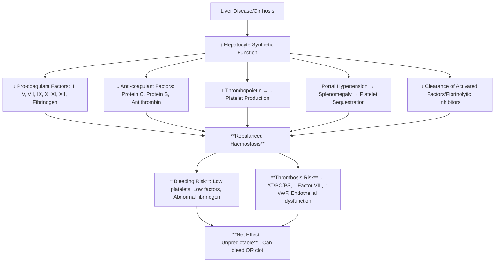

# Liver Disease Coagulopathy

> [!info] **Davidson Ch 25 Alignment**: Bleeding and Thrombotic Disorders → Coagulation Disorders → Liver Disease
> **FCPS/MRCP Focus**: Rebalanced haemostasis, thrombocytopenia, prolonged PT/APTT, factor deficiency, fibrinogen, bleeding vs thrombosis risk, TEG/ROTEM

---

## 🎯 Learning Objectives

- [ ] Understand **Rebalanced Haemostasis** in cirrhosis: Pro- and anti-coagulant factors both ↓
- [ ] Interpret **Coagulation Screen**: **PT/INR ↑, APTT ↑, Platelets ↓, Fibrinogen Normal/↓, D-dimer ↑**
- [ ] Assess **Bleeding vs Thrombosis Risk**: **Not predicted by PT/INR alone**; Use TEG/ROTEM, clinical context
- [ ] Manage **Bleeding**: Vitamin K (if deficient), FFP (if active bleed/invasive), Platelets (<50), Tranexamic acid
- [ ] Manage **Thrombosis Risk**: **VTE prophylaxis** (LMWH) indicated in hospitalised cirrhotics
- [ ] Use **TEG/ROTEM**: Better predicts bleeding than PT/INR
- [ ] Manage **Portal Hypertension Bleeding**: Band ligation, Terlipressin, Antibiotics, Transfusion targets

---

## 📖 Pathophysiology: Rebalanced Haemostasis



---

## 🔬 Laboratory Findings

| Parameter | Typical Finding | Mechanism |
|-----------|-----------------|-----------|
| **PT/INR** | **↑↑** | ↓ Factors II, VII, IX, X, Vitamin K malabsorption |
| **APTT** | **↑** | ↓ Factors VIII, IX, XI, XII, Contact activation |
| **Platelets** | **↓↓** (often 50-100) | Splenic sequestration + ↓ TPO |
| **Fibrinogen** | **Normal/↑** (acute phase) or **↓** (severe) | Acute phase reactant vs ↓ synthesis |
| **Factor VIII** | **↑↑** | Endothelial release, ↓ clearance |
| **vWF** | **↑↑** | Endothelial release, ↓ ADAMTS13 |
| **Protein C/S/AT** | **↓↓** | ↓ Hepatic synthesis |
| **D-dimer** | **↑** | Low-grade DIC, ↑ Fibrinolysis |
| **Factor V** | **Normal/↓** | Mixed (hepatic + megakaryocyte) |

> [!tip] **Key Differentiator**: **Liver Disease = PT↑ + APTT↑ + Platelets↓ + Factor VIII↑** vs **Vitamin K Deficiency = PT↑, APTT Normal, Platelets Normal**.

---

## 🩺 Clinical Manifestations

### Bleeding Manifestations
| Site | Features |
|------|----------|
| **Gastrointestinal** | Variceal bleeding, Portal hypertensive gastropathy, Ulcers |
| **Mucosal** | Epistaxis, Gum bleeding, Haematuria |
| **Procedural** | Post-paracentesis, Post-biopsy, Post-endoscopy |
| **Spontaneous** | Ecchymoses, Petechiae, Retroperitoneal |

### Thrombosis Manifestations
| Type | Incidence | Features |
|------|-----------|----------|
| **Portal Vein Thrombosis** | 5-15% | Often asymptomatic, Worsens portal HTN |
| **DVT/PE** | Increased vs general population | May be asymptomatic |
| **Splanchnic Vein Thrombosis** | Mesenteric, Splenic | Often in decompensated cirrhosis |
| **Arterial Thrombosis** | Rare | Stroke, MI |

---

## ⚠️ Management Principles

### 1. Bleeding Risk Assessment

| Tool | Utility |
|------|---------|
| **PT/INR** | **Poor predictor** of bleeding risk |
| **Platelet Count** | **Better predictor** (<50 = high risk) |
| **Fibrinogen** | **<1.0 g/L = High bleeding risk** |
| **TEG/ROTEM** | **Best predictor** of procedural bleeding |
| **FibroScan/Child-Pugh/MELD** | Correlates with bleeding risk |

### 2. Prophylactic Transfusion (Non-bleeding)

| Procedure | Platelet Threshold | FFP Threshold | Fibrinogen Target |
|-----------|-------------------|---------------|-------------------|
| **Low Risk** (Paracentesis, Thoracentesis) | **>20** | **Not routine** | >1.0 |
| **Moderate Risk** (Liver biopsy, Endoscopy with therapy) | **>50** | **Consider if INR >1.5** | >1.5 |
| **High Risk** (Major surgery, TIPS) | **>50-80** | **INR >1.5** | >2.0 |

> [!warning] **Routine FFP correction of INR NOT recommended** for non-bleeding patients. **Does not reduce bleeding**, causes volume overload/TACO.

### 3. Active Bleeding Management

| Intervention | Details |
|--------------|---------|
| **Volume Resuscitation** | Crystalloids, **Avoid excessive crystalloid** (worsens portal HTN) |
| **Terlipressin/Vasopressin** | **First-line** for variceal bleeding (splanchnic vasoconstriction) |
| **Antibiotics** | **Ceftriaxone** (SBP prophylaxis, ↓ rebleeding, ↓ mortality) |
| **Endoscopic Therapy** | **Band ligation** (varices), **Sclerotherapy** (if banding fails) |
| **FFP** | **15 mL/kg** if INR >1.5 with active bleed |
| **Platelets** | **<50** (active bleed), **<20** (prophylactic) |
| **Fibrinogen** | **Cryoprecipitate** if **<1.0-1.5 g/L** |
| **Tranexamic Acid** | **1g IV** (adjunct for variceal/upper GI bleed) |
| **Vitamin K** | **10mg IV** if deficiency suspected (cholestasis) |
| **rFVIIa** | **Refractory bleeding only** (risk of thrombosis) |

---

## 🩸 VTE Prophylaxis in Hospitalised Cirrhotics

| Risk Assessment | Recommendation |
|------------------|----------------|
| **All hospitalised cirrhotics** | **Pharmacological prophylaxis (LMWH)** unless contraindicated |
| **Contraindications** | Active bleed, Platelets <30, Fibrinogen <1.0, Recent major bleed |
| **Preferred Agent** | **LMWH (Enoxaparin 40mg daily)**, **Dose-adjust for renal impairment** |
| **Duration** | **Throughout hospitalisation** + **Extended (4 weeks) post-discharge** if high risk |

> [!tip] **Cirrhosis = Prothrombotic state**. **VTE risk ↑ 2-4x**. **LMWH prophylaxis recommended** unless active bleeding/severe thrombocytopenia.

---

## 🔬 TEG/ROTEM in Liver Disease

| Parameter | Normal | Liver Disease Pattern | Interpretation |
|-----------|--------|----------------------|----------------|
| **R-time / CT** | Normal | **Prolonged** | ↓ Clotting factors (PT/INR equivalent) |
| **Angle / α-angle** | Normal | **Decreased** | ↓ Fibrinogen/platelet function |
| **MA / MCF** | Normal | **Decreased** | ↓ Platelet function/fibrinogen |
| **LY30 / LI30** | <7.5% | **Variable** | Hyperfibrinolysis if ↑ |

> [!tip] **TEG/ROTEM = Better bleeding predictor than PT/INR**. **Guides targeted component therapy** (FFP vs Cryo vs Platelets).

---

## 🔄 Differential Diagnosis

| Condition | PT | APTT | Platelets | Fibrinogen | Factor VIII |
|-----------|----|------|-----------|------------|-------------|
| **Liver Disease** | ↑↑ | ↑ | **↓** | Normal/↓ | **↑↑** |
| **Vitamin K Deficiency** | **↑↑** | **Normal** | Normal | Normal | Normal/↓ |
| **DIC** | ↑ | ↑ | **↓** | **↓↓** | Variable |
| **Dilutional Coagulopathy** | ↑ | ↑ | ↓ | ↓ | Normal |

---

## 💡 FCPS/MRCP High-Yield Summary

| Topic | Key Point |
|-------|-----------|
| **Rebalanced Haemostasis** | **Both pro- and anti-coagulant factors ↓** → Net unpredictable (bleed or clot) |
| **Coagulopathy** | **PT↑, APTT↑, Platelets↓, Factor VIII↑** |
| **PT/INR** | **Poor bleeding predictor**; Do not routinely correct with FFP |
| **Bleeding Management** | **Terlipressin + Banding + Antibiotics + Targeted Transfusion** |
| **Variceal Bleeding** | **Terlipressin + Ceftriaxone + Band Ligation** |
| **VTE Prophylaxis** | **LMWH for all hospitalised** (unless active bleed/plt<30) |
| **TEG/ROTEM** | **Better than PT/INR** for bleeding prediction |
| **FFP for INR** | **NOT for asymptomatic INR correction**; Only active bleed/procedure |
| **Fibrinogen** | **Cryoprecipitate if <1.0-1.5 g/L** |

---

## ❓ Viva Questions

1. **What is rebalanced haemostasis in liver disease?**
   - **Both pro-coagulant (II, VII, IX, X) and anti-coagulant (PC, PS, AT) factors are reduced** → Net haemostasis is balanced but fragile

2. **Why is PT/INR a poor predictor of bleeding risk in cirrhosis?**
   - **PT/INR reflects only pro-coagulant factor deficiency**; **Does not account for concomitant anti-coagulant deficiency (PC/PS/AT) or thrombocytopenia**

3. **How do you manage active variceal bleeding in cirrhosis?**
   - **Resuscitation + Terlipressin + Ceftriaxone + Endoscopic Band Ligation + Targeted Transfusion (FFP/Plt/Cryo if indicated) + Tranexamic Acid**

4. **When do you transfuse FFP in a cirrhotic patient?**
   - **Active bleeding + INR >1.5**; **Invasive procedure with INR >1.5**; **NOT for asymptomatic INR correction**

5. **What is the platelet threshold for procedures in cirrhosis?**
   - **Low risk: >20; Moderate: >50; High risk: >50-80**

6. **Why is Factor VIII elevated in liver disease?**
   - **Endothelial release** + **Decreased hepatic clearance** (Factor VIII is acute phase reactant, not hepatically cleared)

7. **Should cirrhotic patients receive VTE prophylaxis?**
   - **YES, LMWH for all hospitalised cirrhotics** unless active bleed, platelets <30, fibrinogen <1.0

8. **What is the role of TEG/ROTEM in liver disease?**
   - **Better predictor of bleeding than PT/INR**; Guides targeted component therapy (FFP vs Cryo vs Platelets)

9. **How do you manage portal vein thrombosis in cirrhosis?**
   - **Anticoagulation (LMWH/VKA/DOAC)** if recent/extending; **Consider TIPS** if portal HTN; **Screen for malignancy**

10. **Differentiate liver disease coagulopathy from Vitamin K deficiency.**
    - **Liver: PT↑, APTT↑, Platelets↓, Factor VIII↑**; **Vit K Def: PT↑, APTT Normal, Platelets Normal, Factor VIII Normal/↓**

---

## 🧠 Confusions & Mnemonics

| Confusion | Clarification |
|-----------|---------------|
| **Liver vs Vit K Deficiency** | **Liver: APTT↑, Plt↓, FVIII↑**; **Vit K: APTT Normal, Plt Normal, FVIII Normal/↓** |
| **Liver vs DIC** | **Liver: FVIII↑, Fibrinogen Normal/↑**; **DIC: FVIII Variable, Fibrinogen↓↓, D-dimer↑↑↑** |
| **FFP for INR** | **Not for asymptomatic correction**; Only active bleed/high-risk procedure |
| **VTE Prophylaxis** | **Indicated** (contrary to old belief); **LMWH standard** |
| **Factor VIII** | **Elevated** (not deficient) in liver disease |

| Mnemonic | Meaning |
|----------|---------|
| **"Liver = PT↑ APTT↑ Plt↓ FVIII↑"** | Coagulation pattern |
| **"PT/INR ≠ Bleeding Risk"** | Poor predictor |
| **"FVIII Up = Liver Disease"** | Key differentiator |
| **"LMWH for All Cirrhotics"** | VTE prophylaxis |
| **"TEG > INR for Bleeding"** | Better prediction |
| **"FFP Not for INR Alone"** | Transfusion threshold |

---

## 🗺️ Mind Map

```mermaid
mindmap
  root((Liver Disease Coagulopathy))
    Pathophysiology
      Rebalanced Haemostasis
      ↓ Pro-coagulants (II,VII,IX,X)
      ↓ Anti-coagulants (PC,PS,AT)
      ↓ Platelets (Sequestration + ↓TPO)
    Lab Findings
      PT↑, APTT↑
      Platelets ↓
      Factor VIII ↑↑
      vWF ↑
      D-dimer ↑
    Bleeding Management
      Terlipressin + Banding + Antibiotics
      Platelets >50 (Proc), >20 (Low Risk)
      FFP if Active Bleed + INR>1.5
      Cryo if Fib<1.0-1.5
      TXA Adjunct
    Thrombosis Risk
      PVT, DVT/PE, Splanchnic
      FVIII↑, vWF↑, AT/PC/PS↓
      LMWH Prophylaxis (All Admitted)
    Assessment
      TEG/ROTEM > PT/INR
      Child-Pugh/MELD Correlation
```

---

## 📋 One-Page Revision Card

| **LIVER DISEASE COAGULOPATHY – FCPS/MRCP REVISION CARD** |
|-----------------------------------------------------------|
| **Rebalanced Haemostasis**: ↓ Pro-coagulants + ↓ Anti-coagulants |
| **Labs**: **PT↑, APTT↑, Platelets↓, Factor VIII↑↑** |
| **PT/INR ≠ Bleeding Risk**; **TEG/ROTEM Best Predictor** |
| **Bleeding**: **Terlipressin + Banding + Ceftriaxone** + Targeted Tx |
| **Platelets**: >50 (Proc), >20 (Low Risk), >50-80 (High Risk) |
| **FFP**: **NOT for Asymptomatic INR**; Only Active Bleed/Proc + INR>1.5 |
| **Cryo**: Fibrinogen <1.0-1.5 → Cryoprecipitate |
| **VTE Prophylaxis**: **LMWH ALL Hospitalised** (unless Bleed/Plt<30/Fib<1) |
| **PVT**: Anticoagulate (LMWH/DOAC/VKA) |
| **FVIII**: **Elevated** (Endothelial release + ↓ Clearance) |

---

## 📅 Spaced Repetition Tracker

| Review | Date | Score (1-5) | Next Review |
|--------|------|-------------|-------------|
| Day 1 | 2025-06-17 | | 2025-06-18 |
| Day 3 | | | |
| Day 7 | | | |
| Day 15 | | | |
| Day 30 | | | |

---

## 🎯 Must Know / Should Know / Nice to Know

| Level | Content |
|-------|---------|
| **Must Know** | Rebalanced haemostasis concept, PT/INR poor predictor, FVIII elevated, TEG/ROTEM superior, FFP not for asymptomatic INR, LMWH prophylaxis for hospitalised cirrhotics, variceal bleeding management, platelet thresholds for procedures |
| **Should Know** | TEG/ROTEM parameter interpretation, platelet thresholds by procedure, terlipressin dosing, antibiotic choice (ceftriaxone), tranexamic acid role, PVT management, FFP vs PCC vs rFVIIa, transplant coagulation assessment, balanced resuscitation |
| **Nice to Know** | Rebalanced haemostasis molecular details, non-invasive liver fibrosis scores correlation, coagulation factor half-lives in cirrhosis, endothelial dysfunction role, VWF/ADAMTS13 axis, DOAC vs VKA in liver disease, post-transplant coagulopathy, cost-effectiveness of prophylaxis strategies |

---

## ✅ Self-Test Scorecard

| Section | Score (0-10) | Notes |
|---------|--------------|-------|
| Pathophysiology (Rebalanced Haemostasis) | | |
| Lab Interpretation | | |
| Bleeding Management | | |
| VTE Prophylaxis | | |
| TEG/ROTEM | | |
| Procedural Thresholds | | |
| Viva Questions | | |

---

## 🔗 Local Navigation

- **Previous**: [[Vitamin K Deficiency]]
- **Next**: [[Palliative Care in Haematology]]
- **Section Hub**: [[Bleeding and Thrombotic Disorders]] / [[Supportive Care in Haematology]]
- **MOC**: [[Hematology MOC]]
- **Template**: [[../Templates/Hematology Topic Template]]

---

*Generated for FCPS/MRCP exam preparation. Based on Davidson Medicine 24th Ed Chapter 25.*
---

> Auto-generated study sections for "Hematology" — Ch 24: Haematology & Transfusion Medicine.

## Flashcards (10 generated)

- Q: What is the definition of Hematology?
  A: [!info] Davidson Ch 25 Alignment: Bleeding and Thrombotic Disorders → Coagulation Disorders → Liver Disease
- Q: What is Rebalanced Haemostasis of Hematology?
  A: Both pro- and anti-coagulant factors ↓ → Net unpredictable (bleed or clot)
- Q: What is Coagulopathy of Hematology?
  A: PT↑, APTT↑, Platelets↓, Factor VIII↑
- Q: What is PT/INR of Hematology?
  A: Poor bleeding predictor; Do not routinely correct with FFP
- Q: How is Hematology managed?
  A: Terlipressin + Banding + Antibiotics + Targeted Transfusion
- Q: What is Variceal Bleeding of Hematology?
  A: Terlipressin + Ceftriaxone + Band Ligation
- Q: What is VTE Prophylaxis of Hematology?
  A: LMWH for all hospitalised (unless active bleed/plt<30)
- Q: What is TEG/ROTEM of Hematology?
  A: Better than PT/INR for bleeding prediction
- Q: What is FFP for INR of Hematology?
  A: NOT for asymptomatic INR correction; Only active bleed/procedure
- Q: What is Fibrinogen of Hematology?
  A: Cryoprecipitate if <1.0-1.5 g/L

## MCQs (1 generated)

1. **Which of the following best describes Hematology?**
   A. **[!info] Davidson Ch 25 Alignment: Bleeding and Thrombotic Disorders → Coagulation Disorders → Liver Disease**
   B. An unrelated condition not matching the clinical picture of Hematology
   C. A complication seen late in the disease course of Hematology
   D. A condition that mimics Hematology but has a different underlying cause

## SBA Questions (1 generated)

1. A patient with suspected Hematology presents with: Gastrointestinal — Variceal bleeding, Portal hypertensive gastropathy, Ulcers; Mucosal — Epistaxis, Gum bleeding, Haematuria; Procedural — Post-paracentesis, Post-biopsy, Post-endoscopy. What is the most likely diagnosis?
   A. **Hematology**
   B. A condition that mimics Hematology but is not the same entity
   C. A complication of Hematology rather than the primary diagnosis
   D. An unrelated condition in the same clinical category as Hematology

## PasTest Scenario SBAs (Clinical Vignettes)

> **Auto-generated PasTest/Mediscope-style scenario SBAs** grounded in the authored source. Each scenario tests a real clinical fact (triad, specific sign, contraindication, trial, first-line Rx) extracted from the topic. *Source: Ch 24: Haematology — Liver Disease Coagulopathy*

**Q1.** Which of the following features is most specific or characteristic of Liver Disease Coagulopathy?

  - **A.** "FVIII Up = Liver Disease"
  - **B.** A feature common to many acute inflammatory conditions
  - **C.** A non-specific sign that does not localise the diagnosis
  - **D.** An investigation finding rather than a clinical feature

  > **Answer: A** — "FVIII Up = Liver Disease"
  >
  > *Source:* T↑ APTT↑ Plt↓ FVIII↑"** | Coagulation pattern |
| **"PT/INR ≠ Bleeding Risk"** | Poor predictor |
| **"FVIII Up = Liver Disease"** | Key differentiator |
| **"LMWH for All Cirrhotics"** | VTE prophyla

**Q2.** What is the most appropriate first-line therapy for Liver Disease Coagulopathy?

  - **A.** FibroScan/Child-Pugh/MELD
  - **B.** An advanced/surgical therapy reserved for refractory disease
  - **C.** Symptomatic treatment only, no disease-modifying therapy
  - **D.** Empiric broad-spectrum therapy without specific indication

  > **Answer: A** — FibroScan/Child-Pugh/MELD
  >
  > *Source:* **FibroScan/Child-Pugh/MELD**   Correlates with bleeding risk  

### 2.

