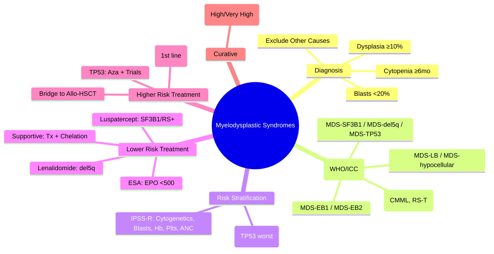

# Myelodysplastic Syndromes (MDS) – Classification & Management

> [!info] **Davidson Ch 25 Alignment**: Haematological Malignancies → Myelodysplastic Syndromes
> **FCPS/MRCP Focus**: WHO 2022 / ICC classification, IPSS-R / IPSS-M, SF3B1, luspatercept, HMAs (azacitidine/decitabine), transplant timing

---

## 🎯 Learning Objectives

- [ ] Define MDS: **Clonal haematopoietic stem cell disorder** with **dysplasia** (≥10% in ≥1 lineage), **cytopenias**, risk of **AML transformation**
- [ ] Apply **WHO 2022 / ICC Classification**: MDS with defining genetic abnormalities, MDS-RS, MDS with excess blasts, MDS/MPN overlap
- [ ] Apply **IPSS-R / IPSS-M** for risk stratification: Blast %, karyotype, cytopenias, molecular mutations
- [ ] Manage **Lower-risk MDS**: **Luspatercept** (SF3B1/RS+-), **ESAs**, **Lenalidomide** (del5q), **Supportive**
- [ ] Manage **Higher-risk MDS**: **HMAs (Azacitidine/Decitabine)** → bridge to **Allo-HSCT**
- [ ] Define **AML transformation**: **Blasts ≥20%** in PB/BM
- [ ] Recognise **PPM1D/TP53 MDS** (post-chemo/radiotherapy) – poor prognosis
- [ ] Monitor: CBC q1-3mo, BM at progression, molecular (VAF tracking)

---

## 📖 Definition & Classification (WHO 2022 / ICC)

| WHO 2022 Category | Key Features |
|-------------------|--------------|
| **MDS with defining genetic abnormalities** | **SF3B1 mutation**, **del(5q)**, **TP53 mutation** (multi-hit) |
| **MDS, morphologically defined** | MDS-LB (low blasts <5% PB, <10% BM), MDS-hypocellular |
| **MDS with excess blasts** | **MDS-EB1** (5-9% PB blasts / 10-19% BM blasts), **MDS-EB2** (10-19% PB / 20-29% BM) |
| **MDS with fibrosis** | Fibrosis grade 2-3 + MDS features |
| **MDS/MPN overlap** | **CMML**, **MDS/MPN-RS-T**, **MDS/MPN with thrombocytosis** |

| ICC 2022 Key Changes | |
|----------------------|---|
| **MDS with mutated SF3B1** | Definitive entity (ring sideroblasts ≥5% OR ≥15% if no SF3B1) |
| **MDS with mutated TP53** | **Multi-hit TP53** (VAF >10% OR 2 hits OR complex karyotype) = separate entity, worst prognosis |
| **MDS with del(5q)** | Isolated del5q, <5% blasts, no Auer rods |
| **MDS-EB** | EB1 (5-9% PB, 10-19% BM), EB2 (10-19% PB, 20-29% BM) |

> [!tip] **FCPS/MRCP**: **MDS = Dysplasia ≥10% + Cytopenias + <20% blasts**. **SF3B1 = good prognosis, luspatercept eligible**. **TP53 multi-hit = worst prognosis**. **IPSS-R/IPSS-M guide transplant timing**.

---

## ⚙️ Pathophysiology

```mermaid
flowchart TD
    A[Age-related Clonal Haematopoiesis (CHIP)] --> B[Acquisition of Driver Mutations]
    B --> C[Dominant Clone Expansion]
    C --> D[Ineffective Haematopoiesis: Apoptosis of Late Precursors]
    D --> E[Cytopenias (Anaemia > Thrombocytopenia > Neutropenia)]
    C --> F[Genomic Instability → Additional Mutations]
    F --> G[Clonal Evolution → Progression to AML]
    
    H[Key Mutational Pathways] --> C
    H --> I1[Splicing: SF3B1, SRSF2, U2AF1, ZRSR2]
    H --> I2[Epigenetic: TET2, DNMT3A, ASXL1, EZH2, IDH1/2]
    H --> I3[Transcription: RUNX1, ETV6, GATA2, TP53]
    H --> I4[Signalling: JAK2, NRAS, KRAS, CBL]
    H --> I5[Cohesin: STAG2, RAD21, SMC3, SMC1A]
    H --> I6[TP53: Genome Guardian Loss]
```

---

## 🔬 Diagnostic Workup

```mermaid
flowchart TD
    A[Unexplained Cytopenia(s) >6 months] --> B[CBC + Film]
    B --> C{**Dysplasia** ≥10% in ≥1 lineage?}
    C -->|Yes| D[**BM Aspirate + Biopsy**]
    C -->|No| E[Exclude Nutritional, Drug, Autoimmune, Viral]
    D --> F[**Morphology**: Blast %, Dysplasia, Ring Sideroblasts, Fibrosis]
    D --> G[**Cytogenetics: Karyotype + FISH** (5q, 7q, 20q, 8, 17p, Y)]
    D --> H[**NGS Panel**: SF3B1, TP53, TET2, ASXL1, DNMT3A, RUNX1, SRSF2, U2AF1, etc.]
    F & G & H --> I[**WHO/ICC Classification + IPSS-R / IPSS-M**]
    I --> J[Treatment Algorithm based on Risk]
```

### Key Diagnostic Criteria

| Requirement | Threshold |
|-------------|-----------|
| **Persistent Cytopenia** | ≥6 months (Anaemia Hb<10, Plt<100, ANC<1.8) |
| **Dysplasia** | **≥10%** cells in ≥1 myeloid lineage |
| **Blasts** | **<20%** (PB & BM) |
| **Exclusion** | Nutritional (B12, folate, Cu), Drugs, Toxins, Viral, Autoimmune, Genetic |
| **Genetic Confirmation** | **SF3B1, TP53, del5q, complex karyotype** = definitive even with <10% dysplasia |

---

## 📊 Risk Stratification

### IPSS-Revised (IPSS-R) – 5 Variables

| Variable | Score 0 | 0.5 | 1 | 2 | 3 | 4 |
|----------|---------|-----|---|---|---|---|
| **Cytogenetics** | Very Good | | Good | Intermediate | Poor | Very Poor |
| **BM Blasts %** | ≤2% | 2-<5% | 5-<10% | | 10-<20% | >30%* |
| **Haemoglobin** | ≥10 | 8-<10 | <8 | | | |
| **Platelets** | ≥100 | 50-<100 | <50 | | | |
| **ANC** | ≥0.8 | <0.8 | | | | |

| IPSS-R Category | Score | Median OS | AML Risk |
|-----------------|-------|-----------|----------|
| **Very Low** | ≤1.5 | ~8-10 yr | ~3% |
| **Low** | 2-3 | ~5-6 yr | ~10% |
| **Intermediate** | 3.5-4.5 | ~3-4 yr | ~20% |
| **High** | 5-6 | ~1.5-2 yr | ~40% |
| **Very High** | >6 | ~0.5-1 yr | >50% |

### IPSS-M (Molecular) – **Current Standard**

| Adds to IPSS-R | Key Mutations |
|----------------|---------------|
| **17 genes** | **TP53** (worst), **FLT3, RAS, RUNX1, EZH2, ETV6, CBL, NRAS, KRAS, JAK2, IDH1/2, U2AF1, SRSF2, STAG2, BCOR, ASXL1, ZRSR2** |
| **TP53 VAF >10% / Multi-hit** | **Very High risk** regardless of blasts/karyotype |

> [!tip] **Use IPSS-M when NGS available** – **TP53 multi-hit = Very High risk** even if Low IPSS-R.

---

## 💊 Management by Risk

### Lower-Risk (Very Low / Low / Intermediate IPSS-R)

| Priority | Treatment | Indication |
|----------|-----------|------------|
| **1st** | **Luspatercept** | **SF3B1 mut / RS+ (ring sideroblasts ≥15%)** with transfusion dependence (MEDALIST) |
| **1st** | **ESA (Epoetin/Darbepoetin)** | **Non-SF3B1, EPO <500 mU/mL**, no thrombosis risk |
| **1st** | **Lenalidomide** | **Isolated del(5q)** (SYNDROME 0017/LEN-MDS) |
| **2nd** | **Luspatercept** | **RS- / Non-SF3B1** if ESA-fail/refractory (beyond label) |
| **Supportive** | **Transfusions + Iron Chelation** | Ferritin >1000 / >20 units RBC |
| **Immunosuppression** | **ATC + CsA** | **Young, HLA-DR15+, hypocellular MDS** (rare) |

### Higher-Risk (High / Very High IPSS-R / IPSS-M)

| Treatment | Details |
|-----------|---------|
| **Azacitidine (Aza)** | **75 mg/m² SC/IV Days 1-7 q28d**; **Standard first-line** (AZA-001 trial: OS benefit) |
| **Decitabine (Dec)** | **20 mg/m² IV Days 1-5 q28d** (or 10 mg/m² Days 1-10); Alternative |
| **Response Assessment** | Minimum **4-6 cycles** before failure; CR/PR/MR/SD/PD |
| **Bridge to Allo-HSCT** | **Aim for CR/CRi/MR** → **Allo-HSCT** (only curative) |
| **TP53-mutated** | **Aza preferred** (better than Dec); **Clinical trials** (e.g., APR-246/Aza, Magrolimab) |

### Allogeneic HSCT – **Only Curative**

| Indication | Timing |
|------------|--------|
| **IPSS-R High / Very High** | **Refer at diagnosis**; Donor search ASAP |
| **IPSS-R Intermediate + Age <65-70** | Consider if fit, donor available |
| **TP53-mutated** | **HSCT if remission achieved** (high relapse risk) |
| **Conditioning** | **RIC (Flu/Mel)** preferred (age/comorbidities) |
| **Pre-HSCT** | Aza/Dec → best response → proceed to transplant |

---

## ⚠️ Specific Subtypes & Targeted Therapy

| Subtype | Targeted Therapy |
|---------|------------------|
| **MDS with SF3B1 mutation / RS+** | **Luspatercept** (ActRIIB-Fc) – ↓ transfusions, ↑ Hb |
| **MDS with isolated del(5q)** | **Lenalidomide 10 mg daily** – cytogenetic remission ~50% |
| **MDS with TP53 multi-hit** | **Azacitidine + APR-246 (Eprenetapopt)** trials; **Magrolimab (anti-CD47)** trials |
| **MDS/MPN-RS-T** | **Luspatercept** + JAK inhibitor (ruxolitinib) if thrombocytosis |
| **Hypocellular MDS** | **IST (ATC+CsA)** if young, HLA-DR15+ |

---

## 🔄 Transformation to AML

| Definition | **Blasts ≥20%** in PB or BM |
|------------|-------------------------------|
| **Treatment** | **Treat as AML** (age/fitness dependent): "7+3" / CPX-351 / Ven+Aza / HMA ± HSCT |
| **Prognosis** | **Poor** (secondary AML); **HSCT if remission achieved** |

---

## 🔄 Differential Diagnosis

| Condition | Distinguishing Features |
|-----------|------------------------|
| **Aplastic Anaemia** | **Hypocellular BM**, **no dysplasia**, normal karyotype (usually) |
| **MDS vs CHIP** | **CHIP = Mutation + NO cytopenia/dysplasia**; MDS = cytopenia + dysplasia |
| **CCUS (Clonal Cytopenia of Undetermined Significance)** | Cytopenia + mutation + **<10% dysplasia** |
| **Nutritional Deficiencies** | B12/folate/Cu deficiency → megaloblastoid changes, **reversible** |
| **Drug/Toxin-induced** | Chloramphenicol, chemo, arsenic → reversible on withdrawal |
| **MDS/MPN Overlap (CMML)** | **Monocytosis >1×10⁹/L** + dysplasia + mutation |

---

## 💡 FCPS/MRCP High-Yield Summary

| Topic | Key Point |
|-------|-----------|
| **Diagnosis** | **Cytopenia + Dysplasia ≥10% + <20% blasts** (or defining genetics) |
| **Key Mutations** | **SF3B1 (good, luspatercept)**, **TP53 multi-hit (worst)**, **del5q (lenalidomide)**, **ASXL1/SRSF2/RUNX1 (poor)** |
| **IPSS-R** | Cytogenetics, Blasts, Hb, Plts, ANC → 5 risk groups |
| **IPSS-M** | **Adds 17 mutations**; **TP53 VAF>10% = Very High** |
| **Lower-Risk** | **Luspatercept (SF3B1/RS+)**, **ESA (EPO<500)**, **Lenalidomide (del5q)** |
| **Higher-Risk** | **Azacitidine (standard)** → **Bridge to Allo-HSCT** |
| **Transplant** | **Curative**; **High/Very High IPSS-R → Refer early** |
| **TP53 multi-hit** | Worst prognosis; **Aza preferred**; Clinical trials (Eprenetapopt, Magrolimab) |
| **Luspatercept** | **SF3B1/ring sideroblasts**; **ActRIIB-Fc**; MEDALIST trial |
| **Lenalidomide** | **Isolated del5q** only; 10 mg daily; thrombosis risk |

---

## ❓ Viva Questions

1. **What are the diagnostic criteria for MDS?**
   - **Persistent cytopenia ≥6mo + Dysplasia ≥10% in ≥1 lineage + Blasts <20% + Exclusion of other causes**

2. **What is the significance of SF3B1 mutation in MDS?**
   - Defines **MDS with SF3B1 mutation**; **Ring sideroblasts ≥5%**; **Good prognosis**; **Luspatercept indication**

3. **How does IPSS-M differ from IPSS-R?**
   - **IPSS-M adds 17 molecular mutations**; **TP53 VAF>10% = Very High risk** regardless of other variables

4. **What is the first-line treatment for Lower-Risk MDS with ring sideroblasts and transfusion dependence?**
   - **Luspatercept** (ActRIIB-Fc) – MEDALIST trial showed ↓ transfusion burden

5. **What is the treatment for MDS with isolated del(5q)?**
   - **Lenalidomide 10 mg daily** – cytogenetic remission in ~50%

6. **What is the standard first-line treatment for Higher-Risk MDS?**
   - **Azacitidine 75 mg/m² SC/IV Days 1-7 q28d** (AZA-001: OS benefit vs conventional care)

7. **When should allogeneic HSCT be considered in MDS?**
   - **IPSS-R High/Very High** → refer at diagnosis; **Intermediate + age <65-70** if fit/donor

8. **What defines TP53 multi-hit MDS and its prognosis?**
   - **TP53 VAF >10% OR 2 mutations OR complex karyotype** = **Worst prognosis** (Very High IPSS-M)

9. **How does Luspatercept work in MDS?**
   - **ActRIIB-Fc fusion protein** → traps TGF-β superfamily ligands → **enhances late erythropoiesis** → ↑ Hb, ↓ transfusions

10. **Differentiate MDS from Aplastic Anaemia.**
    - **MDS = Dysplasia + usually normal/hypercellular BM + cytogenetic abnormalities**; **AA = Hypocellular BM, no dysplasia, normal karyotype**

---

## 🧠 Confusions & Mnemonics

| Confusion | Clarification |
|-----------|---------------|
| **MDS vs AA** | **MDS = Dysplasia + hypercellular + cytogenetics**; **AA = Hypocellular, no dysplasia** |
| **MDS vs CHIP/CCUS** | **CHIP = Mutation only, no cytopenia**; **CCUS = Cytopenia + mutation, <10% dysplasia**; **MDS = Dysplasia ≥10%** |
| **Lower vs Higher Risk** | **IPSS-R ≤3.5 = Lower**; **≥4 = Higher** (treatment differs) |
| **SF3B1 vs TP53** | **SF3B1 = Good, Luspatercept**; **TP53 multi-hit = Worst, Aza + trials** |
| **Del5q vs Other** | **Isolated del5q = Lenalidomide**; **Complex + del5q = Higher risk** |

| Mnemonic | Meaning |
|----------|---------|
| **"MDS = Dysplasia ≥10% + Cytopenia"** | Diagnosis |
| **"SF3B1 = Splicing Factor = Good Prognosis"** | SF3B1 = ring sideroblasts, luspatercept |
| **"TP53 = Terrible Prognosis"** | Multi-hit = worst |
| **"Lower Risk = Luspatercept / ESA / Len"** | Treatment algorithm |
| **"Higher Risk = Aza → HSCT"** | Treatment algorithm |
| **"IPSS-M = Molecular IPSS"** | Adds 17 genes; TP53 VAF >10% = Very High |
| **"del5q = Lenalidomide"** | Isolated del5q specific treatment |

---

## 🗺️ Mind Map



---

## 📋 One-Page Revision Card

| **MDS – FCPS/MRCP REVISION CARD** |
|-------------------------------------|
| **Diagnosis**: **Cytopenia ≥6mo + Dysplasia ≥10% + Blasts <20%** |
| **Key Mutations**: **SF3B1 (Good, Luspatercept)**, **TP53 multi-hit (Worst)**, **del5q (Lenalidomide)**, **ASXL1/SRSF2/RUNX1 (Poor)** |
| **IPSS-R**: Cytogenetics, Blasts, Hb, Plts, ANC → 5 groups |
| **IPSS-M**: **Adds 17 mutations**; **TP53 VAF>10% = Very High** |
| **Lower Risk**: **Luspatercept (SF3B1/RS+)**, **ESA (EPO<500)**, **Lenalidomide (del5q)** |
| **Higher Risk**: **Azacitidine (Aza 75mg/m² d1-7 q28d)** → **Bridge to Allo-HSCT** |
| **Transplant**: **Curative**; **High/Very High IPSS-R → Refer early** |
| **TP53 multi-hit**: Aza + Trials (Eprenetapopt, Magrolimab) |
| **Transformation**: **Blasts ≥20%** → Treat as AML |

---

## 📅 Spaced Repetition Tracker

| Review | Date | Score (1-5) | Next Review |
|--------|------|-------------|-------------|
| Day 1 | 2025-06-16 | | 2025-06-17 |
| Day 3 | | | |
| Day 7 | | | |
| Day 15 | | | |
| Day 30 | | | |

---

## 🎯 Must Know / Should Know / Nice to Know

| Level | Content |
|-------|---------|
| **Must Know** | Diagnostic criteria, WHO/ICC classification, SF3B1/TP53/del5q significance, IPSS-R vs IPSS-M, lower-risk Rx (luspatercept/ESA/len), higher-risk Rx (Aza→HSCT), transplant indications, transformation definition |
| **Should Know** | MEDALIST trial details, AZA-001 trial, lenalidomide in del5q (SYNDROME 0017), luspatercept mechanism (TGF-β trap), Aza vs Dec dosing, RIC conditioning, TP53 trials (Eprenetapopt, Magrolimab), CMML distinction |
| **Nice to Know** | Detailed mutational hierarchy (epigenetic → splicing → transcription), TP53 allelic state (single vs multi-hit), luspatercept in non-SF3B1, roxadustat in MDS, SCD (somatic clonal drift), germline predisposition (GATA2, RUNX1, DDX41), MDS/IPSS-R calculator, MDS registry data |

---

## ✅ Self-Test Scorecard

| Section | Score (0-10) | Notes |
|---------|--------------|-------|
| Diagnostic Criteria & Classification | | |
| Risk Stratification (IPSS-R/IPSS-M) | | |
| Lower-Risk Management | | |
| Higher-Risk Management | | |
| Allogeneic HSCT Indications | | |
| TP53 & Special Subtypes | | |
| Viva Questions | | |

---

## 🔗 Local Navigation

- **Previous**: [[Primary Myelofibrosis]]
- **Next**: [[ITP]]
- **Section Hub**: [[Haematological Malignancies]] / [[Anaemia and Red Cell Disorders]]
- **MOC**: [[Hematology MOC]]
- **Template**: [[../Templates/Hematology Topic Template]]

---

*Generated for FCPS/MRCP exam preparation. Based on Davidson Medicine 24th Ed Chapter 25.*
---

> Auto-generated study sections for "Hematology" — Ch 24: Haematology & Transfusion Medicine.

## Flashcards (30 generated)

- Q: What is the definition of Hematology?
  A: # Myelodysplastic Syndromes (MDS) – Classification & Management
- Q: What is Azacitidine (Aza) of Hematology?
  A: 75 mg/m² SC/IV Days 1-7 q28d; Standard first-line (AZA-001 trial: OS benefit)
- Q: What is Decitabine (Dec) of Hematology?
  A: 20 mg/m² IV Days 1-5 q28d (or 10 mg/m² Days 1-10); Alternative
- Q: What is Response Assessment of Hematology?
  A: Minimum 4-6 cycles before failure; CR/PR/MR/SD/PD
- Q: What is Bridge to Allo-HSCT of Hematology?
  A: Aim for CR/CRi/MR → Allo-HSCT (only curative)
- Q: What is TP53-mutated of Hematology?
  A: Aza preferred (better than Dec); Clinical trials (e.g., APR-246/Aza, Magrolimab)
- Q: What is IPSS-R High / Very High of Hematology?
  A: Refer at diagnosis; Donor search ASAP
- Q: What is IPSS-R Intermediate + Age <65-70 of Hematology?
  A: Consider if fit, donor available
- Q: What is TP53-mutated of Hematology?
  A: HSCT if remission achieved (high relapse risk)
- Q: What is Conditioning of Hematology?
  A: RIC (Flu/Mel) preferred (age/comorbidities)
- Q: What is Pre-HSCT of Hematology?
  A: Aza/Dec → best response → proceed to transplant
- Q: What is Azacitidine (Aza) of Hematology?
  A: 75 mg/m² SC/IV Days 1-7 q28d; Standard first-line (AZA-001 trial: OS benefit)
- Q: What is Decitabine (Dec) of Hematology?
  A: 20 mg/m² IV Days 1-5 q28d (or 10 mg/m² Days 1-10); Alternative
- Q: What is Response Assessment of Hematology?
  A: Minimum 4-6 cycles before failure; CR/PR/MR/SD/PD
- Q: What is Bridge to Allo-HSCT of Hematology?
  A: Aim for CR/CRi/MR → Allo-HSCT (only curative)
- Q: What is IPSS-R High / Very High of Hematology?
  A: Refer at diagnosis; Donor search ASAP
- Q: What is IPSS-R Intermediate + Age <65-70 of Hematology?
  A: Consider if fit, donor available
- Q: What is TP53-mutated of Hematology?
  A: HSCT if remission achieved (high relapse risk)
- Q: What is Conditioning of Hematology?
  A: RIC (Flu/Mel) preferred (age/comorbidities)
- Q: What is Pre-HSCT of Hematology?
  A: Aza/Dec → best response → proceed to transplant
- Q: What is the investigation of choice for Hematology?
  A: Cytopenia + Dysplasia ≥10% + <20% blasts (or defining genetics)
- Q: What is Key Mutations of Hematology?
  A: SF3B1 (good, luspatercept), TP53 multi-hit (worst), del5q (lenalidomide), ASXL1/SRSF2/RUNX1 (poor)
- Q: What is IPSS-R of Hematology?
  A: Cytogenetics, Blasts, Hb, Plts, ANC → 5 risk groups
- Q: What is IPSS-M of Hematology?
  A: Adds 17 mutations; TP53 VAF>10% = Very High
- Q: What is Lower-Risk of Hematology?
  A: Luspatercept (SF3B1/RS+), ESA (EPO<500), Lenalidomide (del5q)
- Q: What is Higher-Risk of Hematology?
  A: Azacitidine (standard) → Bridge to Allo-HSCT
- Q: What is Transplant of Hematology?
  A: Curative; High/Very High IPSS-R → Refer early
- Q: What is TP53 multi-hit of Hematology?
  A: Worst prognosis; Aza preferred; Clinical trials (Eprenetapopt, Magrolimab)
- Q: What is Luspatercept of Hematology?
  A: SF3B1/ring sideroblasts; ActRIIB-Fc; MEDALIST trial
- Q: What is Lenalidomide of Hematology?
  A: Isolated del5q only; 10 mg daily; thrombosis risk

## MCQs (1 generated)

1. **Which of the following best describes Hematology?**
   A. **# Myelodysplastic Syndromes (MDS) – Classification & Management**
   B. An unrelated condition not matching the clinical picture of Hematology
   C. A complication seen late in the disease course of Hematology
   D. A condition that mimics Hematology but has a different underlying cause

## SBA Questions (1 generated)

1. A patient with suspected Hematology presents with: WHO 2022 Category — Key Features; MDS with defining genetic abnormalities — SF3B1 mutation, del(5q), TP53 mutation (multi-hit); MDS, morphologically defined — MDS-LB (low blasts <5% PB, <10% BM), MDS-hypocellular. What is the most likely diagnosis?
   A. **Hematology**
   B. A condition that mimics Hematology but is not the same entity
   C. A complication of Hematology rather than the primary diagnosis
   D. An unrelated condition in the same clinical category as Hematology

## PasTest Scenario SBAs (Clinical Vignettes)

> **Auto-generated PasTest/Mediscope-style scenario SBAs** grounded in the authored source. Each scenario tests a real clinical fact (triad, specific sign, contraindication, trial, first-line Rx) extracted from the topic. *Source: Ch 24: Haematology — MDS Classification & Management*

**Q1.** Which of the following features is most specific or characteristic of MDS Classification & Management?

  - **A.** "del5q = Lenalidomide"
  - **B.** A feature common to many acute inflammatory conditions
  - **C.** A non-specific sign that does not localise the diagnosis
  - **D.** An investigation finding rather than a clinical feature

  > **Answer: A** — "del5q = Lenalidomide"
  >
  > *Source:* reatment algorithm |
| **"IPSS-M = Molecular IPSS"** | Adds 17 genes; TP53 VAF >10% = Very High |
| **"del5q = Lenalidomide"** | Isolated del5q specific treatment |

---

**Q2.** Which landmark clinical trial provided evidence relevant to the management of MDS Classification & Management (specifically: ↓ transfusion burden

5)?

  - **A.** MEDALIST trial
  - **B.** A different but related trial in the same area
  - **C.** A guideline (not a trial) addressing the same question
  - **D.** An observational/cohort study addressing similar outcomes

  > **Answer: A** — MEDALIST trial
  >
  > *Source:* **What is the first-line treatment for Lower-Risk MDS with ring sideroblasts and transfusion dependence?**
   - **Luspatercept** (ActRIIB-Fc) – MEDALIST trial showed ↓ transfusion burden

5

**Q3.** What is the most appropriate first-line therapy for MDS Classification & Management?

  - **A.** 1st + Luspatercept + SF3B1 mut / RS
  - **B.** An advanced/surgical therapy reserved for refractory disease
  - **C.** Symptomatic treatment only, no disease-modifying therapy
  - **D.** Empiric broad-spectrum therapy without specific indication

  > **Answer: A** — 1st + Luspatercept + SF3B1 mut / RS
  >
  > *Source:* **1st**   **Luspatercept**   **SF3B1 mut / RS+ (ring sideroblasts ≥15%)** with transfusion dependence (MEDALIST)

