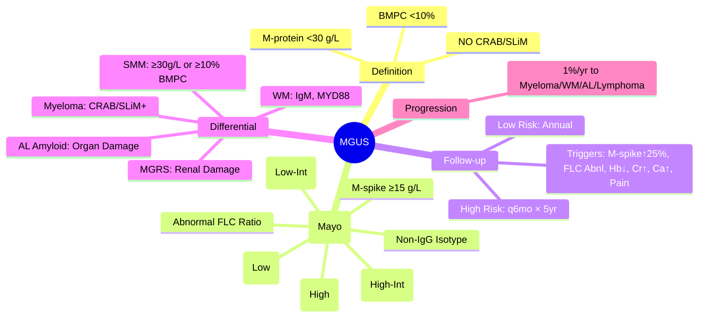

# Monoclonal Gammopathy of Undetermined Significance (MGUS)

> [!info] **Davidson Ch 25 Alignment**: Haematological Malignancies → Plasma Cell Disorders → MGUS
> **FCPS/MRCP Focus**: Diagnostic criteria, risk of progression (1%/yr), risk stratification (Mayo/IMWG), distinction from smouldering myeloma/myeloma, follow-up schedule

---

## 🎯 Learning Objectives

- [ ] Define MGUS: **Monoclonal protein <30 g/L**, **Bone marrow plasma cells <10%**, **NO CRAB/SLiM** (no end-organ damage)
- [ ] Apply **Diagnostic Criteria** (IMWG): M-protein <30g/L + BMPC <10% + NO CRAB/SLiM
- [ ] Stratify risk: **Mayo Clinic Model** / **IMWG Risk Model** (M-protein type, level, FLC ratio)
- [ ] Differentiate from **Smouldering Myeloma** (BMPC ≥10% OR M-protein ≥30g/L) and **Active Myeloma** (CRAB/SLiM)
- [ ] Apply **Follow-up Schedule**: CBC, SPEP, sFLC, renal function, calcium – **q6-12mo** based on risk
- [ ] Recognise **Non-IgG MGUS** (IgA, IgM, light chain) – higher progression risk
- [ ] Understand **MGRS** (Monoclonal Gammopathy of Renal Significance) – low tumour burden, renal damage

---

## 📖 Definition & Diagnostic Criteria (IMWG)

| Criterion | MGUS | Smouldering Myeloma (SMM) | Active Myeloma |
|-----------|------|---------------------------|----------------|
| **M-protein** | **<30 g/L** | **≥30 g/L** OR **BMPC ≥10%** | Usually >30 g/L (but not required if CRAB/SLiM) |
| **BM Plasma Cells** | **<10%** | **≥10%** | **≥10%** (or biopsy-proven plasmacytoma) |
| **CRAB/SLiM** | **ABSENT** | **ABSENT** | **PRESENT** (≥1 MDE) |
| **Progression Risk** | ~1%/yr | ~10%/yr (first 5yr) | N/A (already active) |

> [!tip] **FCPS/MRCP**: **MGUS = M-spike <30 + BMPC <10% + NO CRAB**. **Progression ~1%/yr**. **Risk stratification by M-protein type/level + FLC ratio**. **Follow-up q6-12mo**. **SMM = BMPC ≥10% OR M-spike ≥30, NO CRAB (10%/yr progression)**.

---

## 🔬 Diagnostic Workup

```mermaid
flowchart TD
    A[Incidental M-protein on SPEP] --> B[**SPEP + Immunofixation**]
    B --> C[**sFLC (κ/λ ratio)**]
    C --> D[**CBC, U&E, Ca, Creatinine, LFT, Albumin, β2M, LDH**]
    D --> E{**M-protein Level?**}
    E -->|<30 g/L| F[**BM Biopsy?**]
    F -->|Low Risk: No| G[**No BM Biopsy** (if M-spike <15, IgG, normal FLC ratio)]
    F -->|Higher Risk: Yes| H[**BM Aspirate: BMPC%**]
    H --> I{**BMPC <10%?**}
    I -->|Yes| J[**MGUS**]
    I -->|No (≥10%)| K[**Smouldering Myeloma**]
    J & K --> L[**CRAB/SLiM Assessment**]
    L --> M{**Any CRAB/SLiM?**}
    M -->|Yes| N[**Active Myeloma**]
    M -->|No| O[**Confirm MGUS/SMM**]
```

### Minimal Baseline Investigations

| Test | Purpose |
|------|---------|
| **SPEP + Immunofixation** | Identify & quantify M-protein (IgG, IgA, IgM, κ, λ) |
| **sFLC (κ/λ ratio)** | Risk stratification; detect light chain MGUS |
| **CBC, Creatinine, Ca** | Exclude CRAB (Anaemia, Renal, Hypercalcaemia) |
| **β2-Microglobulin, Albumin** | ISS staging (if progression) |
| **BM Biopsy** | **Only if**: M-spike ≥15 g/L, Non-IgG, Abnormal FLC ratio, Unexplained anaemia/renal/bone |

---

## 📊 Risk Stratification

### Mayo Clinic Risk Model (Progression to Myeloma at 20 years)

| Risk Factor | Points |
|-------------|--------|
| **Non-IgG Isotype** (IgA, IgM, IgD, IgE) | 1 |
| **M-protein ≥15 g/L** | 1 |
| **Abnormal FLC Ratio** (<0.26 or >1.65) | 1 |

| Risk Category | Points | 20-yr Progression Risk |
|---------------|--------|------------------------|
| **Low** | 0 | **2%** |
| **Low-Intermediate** | 1 | **10%** |
| **High-Intermediate** | 2 | **25%** |
| **High** | 3 | **58%** |

### IMWG Risk Model (Progression at 20 years)

| Factor | HR |
|--------|----|
| **M-protein >15 g/L** | ~2.5 |
| **Non-IgG** | ~2 |
| **Abnormal FLC Ratio** | ~2 |

> [!tip] **Low-risk MGUS** (IgG, M-spike <15, normal FLC ratio) → **Annual follow-up sufficient**. **High-risk** → **q6mo follow-up**.

---

## 💊 Management & Follow-up

### Follow-up Schedule (Based on Risk)

| Risk Group | Follow-up |
|------------|-----------|
| **Low Risk** (IgG, <15 g/L, normal FLC ratio) | **Annual** SPEP, sFLC, CBC, Creatinine, Ca |
| **Intermediate/High Risk** | **Every 6 months** × 5 years, then annually if stable |
| **Any Change** | Repeat BM if M-spike ↑ ≥25%, FLC ratio becomes abnormal, new cytopenias, renal dysfunction |

### Monitoring Parameters at Each Visit

| Parameter | Action Threshold |
|-----------|------------------|
| **M-protein** | **≥25% increase** from baseline → Repeat BM |
| **sFLC Ratio** | **Becomes abnormal** (<0.26 or >1.65) → Repeat BM |
| **Haemoglobin** | **↓ >2 g/dL** below baseline → Exclude progression |
| **Creatinine** | **↑ >30%** or >177 μmol/L → Exclude myeloma kidney/amyloidosis |
| **Calcium** | **>2.75 mmol/L** → Exclude myeloma |
| **Bone Pain** | **New onset** → Imaging (WBLD-CT/PET-CT) |

---

## 🔄 Differential Diagnosis & Related Entities

| Entity | Distinguishing Features |
|--------|------------------------|
| **Smouldering Myeloma (SMM)** | **BMPC ≥10% OR M-spike ≥30 g/L**, NO CRAB; **Progression ~10%/yr** |
| **Active Myeloma** | **CRAB/SLiM PRESENT** |
| **Waldenström Macroglobulinaemia** | **IgM Paraprotein**, **MYD88 L265P**, Lymphoplasmacytic infiltration |
| **AL Amyloidosis** | **Low BMPC** (<10%), **Organ involvement** (heart, kidney, liver, nerve), **FLC elevation**, Congo red +ve |
| **MGRS** (Monoclonal Gammopathy of Renal Significance) | **Low tumour burden**, **Renal lesion from M-protein** (cast nephropathy, AL amyloid, MIDD, C3 glomerulopathy) |
| **Light Chain MGUS** | **No intact immunoglobulin**, **Only abnormal FLC ratio** (κ or λ) |
| **IgM MGUS** | **Risk of progression to WM/Lymphoma** (not myeloma); **Monitor for lymphadenopathy, hyperviscosity** |

---

## 💡 FCPS/MRCP High-Yield Summary

| Topic | Key Point |
|-------|-----------|
| **Definition** | **M-protein <30 g/L + BMPC <10% + NO CRAB/SLiM** |
| **Progression Risk** | **~1%/yr to Myeloma/Lymphoma/WM/AL Amyloidosis** |
| **Risk Factors** | **Non-IgG, M-spike ≥15 g/L, Abnormal FLC ratio** (Mayo 3-factor model) |
| **Low Risk** | **IgG, <15 g/L, normal FLC ratio** → 2% at 20yr |
| **High Risk** | **All 3 factors** → 58% at 20yr |
| **Follow-up** | **Low risk: Annual**; **High risk: q6mo** × 5yr |
| **BM Biopsy** | Only if M-spike ≥15, Non-IgG, abnormal FLC, unexplained cytopenia/renal |
| **Action Threshold** | M-spike ↑ ≥25%, FLC ratio abnormal, Hb↓, Cr↑, Ca↑, bone pain |
| **SMM vs MGUS** | **SMM = BMPC ≥10% OR M-spike ≥30, NO CRAB** (10%/yr progression) |
| **MGRS** | **Renal damage from M-protein** despite low tumour burden |

---

## ❓ Viva Questions

1. **What are the diagnostic criteria for MGUS?**
   - **M-protein <30 g/L**, **BMPC <10%**, **NO CRAB/SLiM** (end-organ damage)

2. **What is the annual risk of progression from MGUS to multiple myeloma?**
   - **~1% per year** (cumulative ~10% at 10yr, ~20% at 20yr for average)

3. **What are the three risk factors in the Mayo Clinic risk stratification for MGUS?**
   - **Non-IgG isotype**, **M-protein ≥15 g/L**, **Abnormal FLC ratio (<0.26 or >1.65)**

4. **What is the 20-year progression risk for low-risk vs high-risk MGUS?**
   - **Low-risk (0 factors): 2%**; **High-risk (3 factors): 58%**

5. **When is bone marrow biopsy indicated in MGUS?**
   - **M-spike ≥15 g/L**, **Non-IgG isotype**, **Abnormal FLC ratio**, **Unexplained cytopenias/renal dysfunction/bone lesions**

6. **What follow-up schedule is recommended for MGUS?**
   - **Low-risk: Annual**; **High-risk: Every 6 months** (×5 years, then annually if stable)

7. **What parameters should trigger investigation for progression?**
   - **M-spike ↑ ≥25%**, **FLC ratio becomes abnormal**, **Hb ↓>2 g/dL**, **Cr ↑>30%**, **Ca >2.75**, **New bone pain**

8. **Differentiate MGUS from Smouldering Myeloma.**
   - **MGUS**: <30 g/L + <10% BMPC; **SMM**: ≥30 g/L OR ≥10% BMPC (NO CRAB in both)

9. **What is MGRS (Monoclonal Gammopathy of Renal Significance)?**
   - **Low tumour burden (MGUS/SMM level)** but **M-protein causes renal damage** (cast nephropathy, AL amyloid, MIDD, C3 glomerulopathy)

10. **Can MGUS progress to conditions other than Multiple Myeloma?**
    - **Yes** – **AL Amyloidosis, Waldenström Macroglobulinaemia (IgM MGUS), Lymphoma, CLL**

---

## 🧠 Confusions & Mnemonics

| Confusion | Clarification |
|-----------|---------------|
| **MGUS vs SMM** | **MGUS <30 g/L + <10% BMPC**; **SMM ≥30 g/L OR ≥10% BMPC** (both NO CRAB) |
| **MGUS vs Myeloma** | **Myeloma = CRAB/SLiM present**; MGUS = NO CRAB/SLiM |
| **Non-IgG MGUS** | **IgA, IgM, IgD, IgE** = Higher progression risk (to WM/IgA myeloma/AL Amyloid) |
| **FLC Ratio in MGUS** | **Abnormal ratio = Risk factor**; Normal = Low risk |
| **MGRS vs MGUS** | **MGRS = Renal damage from M-protein**; MGUS = No organ damage |

| Mnemonic | Meaning |
|----------|---------|
| **"MGUS = M-spike <30, Marrow <10%, Minus CRAB"** | Diagnostic criteria |
| **"1% per Year = Progression Fear"** | Annual transformation risk |
| **"Mayo 3 = Non-IgG, ≥15, FLC Abnormal"** | Risk factors |
| **"Low Risk = IgG, <15, Normal FLC"** | Low risk profile |
| **"SMM = Thirty or Ten" (30g/L or 10% BMPC)** | SMM thresholds |
| **"MGRS = Renal Damage, Small Burden"** | MGRS definition |

---

## 🗺️ Mind Map



---

## 📋 One-Page Revision Card

| **MGUS – FCPS/MRCP REVISION CARD** |
|-------------------------------------|
| **Diagnosis**: **M-protein <30 + BMPC <10% + NO CRAB/SLiM** |
| **Progression**: **1%/yr** (Myeloma, WM, AL Amyloid, Lymphoma) |
| **Mayo Risk**: Non-IgG, ≥15 g/L, Abnormal FLC (<0.26 or >1.65) |
| **Low Risk (0)**: 2% at 20yr (IgG, <15, Normal FLC) |
| **High Risk (3)**: 58% at 20yr |
| **Follow-up**: **Low = Annual**; **High = q6mo × 5yr** |
| **BM Biopsy if**: ≥15 g/L, Non-IgG, Abnl FLC, Unexplained Cx/Re/Ca |
| **Action**: M-spike↑25%, FLC abnl, Hb↓, Cr↑, Ca↑, Pain |
| **SMM**: ≥30 g/L OR ≥10% BMPC (NO CRAB) – 10%/yr progression |
| **MGRS**: Renal damage from M-protein despite low burden |

---

## 📅 Spaced Repetition Tracker

| Review | Date | Score (1-5) | Next Review |
|--------|------|-------------|-------------|
| Day 1 | 2025-06-16 | | 2025-06-17 |
| Day 3 | | | |
| Day 7 | | | |
| Day 15 | | | |
| Day 30 | | | |

---

## 🎯 Must Know / Should Know / Nice to Know

| Level | Content |
|-------|---------|
| **Must Know** | Diagnostic criteria, 1%/yr progression, Mayo 3-factor risk model, low vs high risk follow-up, BM biopsy indications, progression triggers, SMM distinction, MGRS concept |
| **Should Know** | IMWG risk model, non-IgG progression patterns (IgM→WM, IgA→myeloma/amyloid, LC→amyloid), detailed follow-up lab panel, imaging for progression (WBLD-CT), SMM high-risk criteria (20-2-20 model: BMPC≥20%, M-spike≥20g/L, FLC ratio≥20), early intervention trials in SMM |
| **Nice to Know** | Genomic landscape of MGUS progression (hyperdiploidy, IgH translocations, RAS, TP53), immune microenvironment changes, microbiome influence, circulating tumour DNA, cost-effectiveness of screening, familial MGUS, MGUS in specific populations, MGRS histopathological patterns (cast nephropathy, AL amyloid, MIDD, PGNMID, C3GN) |

---

## ✅ Self-Test Scorecard

| Section | Score (0-10) | Notes |
|---------|--------------|-------|
| Diagnostic Criteria | | |
| Risk Stratification (Mayo/IMWG) | | |
| Follow-up Schedule | | |
| Progression Triggers | | |
| Differential (SMM, Myeloma, WM, MGRS) | | |
| Viva Questions | | |

---

## 🔗 Local Navigation

- **Previous**: [[DVT PE & Cancer-associated Thrombosis]]
- **Next**: [[Amyloidosis (AL)]]
- **Section Hub**: [[Haematological Malignancies]]
- **MOC**: [[Hematology MOC]]
- **Template**: [[../Templates/Hematology Topic Template]]

---

*Generated for FCPS/MRCP exam preparation. Based on Davidson Medicine 24th Ed Chapter 25.*