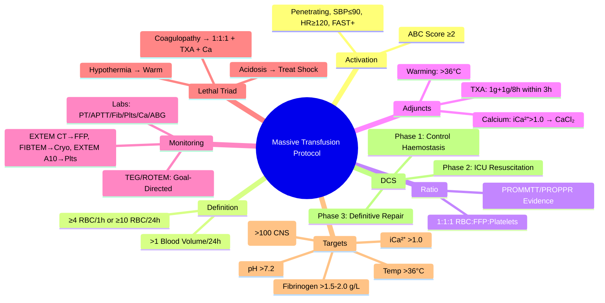

# Massive Transfusion Protocol (MTP)

> [!info] **Davidson Ch 25 Alignment**: Transfusion Medicine → Massive Transfusion Protocol
> **FCPS/MRCP Focus**: Activation criteria (ABC Score), 1:1:1 ratio, empiric vs goal-directed, tranexamic acid, calcium replacement, hypothermia/acidosis management, TEG/ROTEM, complications

---

## 🎯 Learning Objectives

- [ ] Define **Massive Transfusion**: **≥4 units RBC in 1h** OR **≥10 units in 24h** OR **Replacement >1 blood volume in 24h** OR **>50% blood volume in 3h**
- [ ] Apply **Activation Criteria**: **ABC Score** (Penetrating mechanism, SBP ≤90, HR ≥120, FAST positive) ≥2 → Activate MTP
- [ ] Apply **Damage Control Resuscitation**: **1:1:1 Ratio** (RBC:FFP:Platelets) vs **Empiric vs Goal-directed (TEG/ROTEM)**
- [ ] Administer **Tranexamic Acid (TXA)**: **1g IV bolus + 1g infusion over 8h** (within 3h of injury – CRASH-2)
- [ ] Manage **Lethal Triad**: **Hypothermia, Acidosis, Coagulopathy** – Prevent/Correct
- [ ] Monitor **Calcium**: **Ionised Ca²⁺ >1.0 mmol/L** – Replace (Citrate toxicity)
- [ ] Use **TEG/ROTEM** for Goal-Directed Therapy (FIBTEM, EXTEM, APTEM)
- [ ] Know **Complications**: Citrate toxicity, Hypocalcaemia, Hyperkalaemia, Hypothermia, Acidosis, Dilutional coagulopathy, TACO, TRALI

---

## 📖 Definition & Activation Criteria

### Massive Transfusion Definitions (Any One)

| Definition | Threshold |
|------------|-----------|
| **Acute Rate** | **≥4 Units RBC in 1 Hour** |
| **24-Hour Volume** | **≥10 Units RBC in 24 Hours** |
| **Blood Volume Replacement** | **>1 Blood Volume (70 mL/kg) in 24 Hours** |
| **Rapid Exsanguination** | **>50% Blood Volume in 3 Hours** |

### ABC Score for MTP Activation (Trauma)

| Parameter | Points |
|-----------|--------|
| **Penetrating Mechanism** | 1 |
| **SBP ≤90 mmHg** | 1 |
| **HR ≥120 bpm** | 1 |
| **FAST Positive** | 1 |

| Score | MTP Activation | Probability of MT |
|-------|----------------|-------------------|
| **0-1** | **No** | Low (~5-10%) |
| **≥2** | **YES – Activate MTP** | **High (~40-50%)** |

> [!tip] **FCPS/MRCP**: **ABC Score ≥2 = Activate MTP**. **1:1:1 Ratio (RBC:FFP:Plts)**. **TXA 1g bolus + 1g/8h within 3h**. **Calcium replacement** (Citrate toxicity). **TEG/ROTEM for goal-directed**.

---

## 🩸 MTP Pack Composition (Standard 1:1:1 Ratio)

| Pack | Components (Typical) | Volume |
|------|----------------------|--------|
| **Pack 1** | 4-6 Units RBC + 4-6 Units FFP + **1 Apheresis Platelet Unit** | ~1.5-2 L |
| **Pack 2** | 4-6 Units RBC + 4-6 Units FFP + **1 Apheresis Platelet Unit** | ~1.5-2 L |
| **Pack 3...** | Repeat as needed | |

> [!tip] **1:1:1 ≈ Reconstituted Whole Blood**. **PROMMTT, PROPPR Trials**: 1:1:1 similar mortality to 1:1:2, but **1:1:1 achieved more haemostasis, less exsanguination death**.

---

## 💊 Adjunctive Therapies

### Tranexamic Acid (TXA) – **CRASH-2 Trial**

| Indication | Dose | Timing |
|------------|------|--------|
| **Trauma with/at risk of significant haemorrhage** | **1g IV Bolus (10 min) + 1g IV Infusion over 8 hours** | **Within 3 Hours of Injury** (Benefit ↓ after 3h; Harm if >3h) |

> [!warning] **TXA Contraindicated if >3h post-injury** (increased mortality). **Dose adjust for renal impairment**.

### Calcium Replacement (Citrate Toxicity)

| Monitoring | Target | Replacement |
|------------|--------|-------------|
| **Ionised Calcium (iCa²⁺)** | **>1.0 mmol/L** (or >1.15 mmol/L) | **Calcium Chloride 10% 5-10 mL IV** (or Calcium Gluconate 10% 10-20 mL) per 4-6 units FFP/PRP |
| **Frequency** | **Every 4-6 units** or **iCa²⁺ <1.0** | Repeat as needed |

> [!warning] **Each unit FFP/Platelets binds ~2.5-3 mmol Calcium** → **Hypocalcaemia = Citrate Toxicity**. **iCa²⁺ <1.0 = Replace immediately**.

### Lethal Triad Management

| Component | Prevention / Correction |
|-----------|------------------------|
| **Hypothermia** | **Active Warming** (Forced air, Fluid warmers, Warmed IV fluids, Blood warmer) → **Target >36°C** |
| **Acidosis** | **Permissive Hypotension** (SBP 80-90 until surgical control), **Treat shock** (Volume, Vasopressors), **Bicarbonate if pH <7.2** |
| **Coagulopathy** | **1:1:1 Ratio**, **Fibrinogen (Cryoprecipitate 2-4 pools / Fibrinogen Concentrate)**, **TXA**, **Calcium** |

---

## 📊 Coagulation Monitoring – Empiric vs Goal-Directed

### Standard Lab Monitoring

| Parameter | Target | Frequency |
|-----------|--------|-----------|
| **Hb** | **80-100 g/L** | q30-60 min |
| **Platelets** | **>50** (Bleeding) / **>100** (CNS) | q1-2h |
| **PT/INR** | **<1.5x Normal** | q1-2h |
| **APTT** | **<1.5x Normal** | q1-2h |
| **Fibrinogen** | **>1.5-2.0 g/L** | q1-2h |
| **Ionised Ca²⁺** | **>1.0 mmol/L** | q4-6 units / q1h |
| **ABG (pH, Lactate, BE)** | **pH >7.2, Lactate ↓** | q30-60 min |
| **Temperature** | **>36°C** | Continuous |

### Viscoelastic Testing (TEG/ROTEM) – **Goal-Directed**

| Assay | Parameter | Target | Action if Low |
|-------|-----------|--------|---------------|
| **EXTEM / ROTEM CT** | Clotting Time | **<80 sec** | **FFP** |
| **FIBTEM / FIBTEM A10** | Fibrinogen Contribution | **>10 mm** | **Cryoprecipitate / Fibrinogen Concentrate** |
| **EXTEM A10** | Clot Firmness | **>40 mm** | **Platelets** (if FIBTEM OK) |
| **APTEM / HEPTEM** | Fibrinolysis | **LI30 <15%** | **Tranexamic Acid** (if hyperfibrinolysis) |
| **HEPTEM CT** | Heparin Effect | **Similar to EXTEM** | **Protamine** if prolonged |

> [!tip] **TEG/ROTEM = Rapid (10-20 min), Whole Blood, Point-of-Care**. **Allows Goal-Directed Component Therapy**. **Reduces unnecessary transfusion**.

---

## ⚠️ Complications of Massive Transfusion

| Complication | Mechanism | Prevention / Management |
|--------------|-----------|------------------------|
| **Dilutional Coagulopathy** | RBCs dilute platelets/factors | **1:1:1 Ratio**, Early FFP/Plts |
| **Citrate Toxicity (Hypocalcaemia)** | Citrate chelates Ca²⁺ | **iCa²⁺ >1.0**, CaCl₂ replacement |
| **Hyperkalaemia** | RBC storage K⁺ leak | **Fresh RBCs (<7-14d)**, Wash, Insulin/Dextrose |
| **Hypothermia** | Cold blood products | **Fluid/Blood Warmers**, Active Warming |
| **Acidosis** | Shock, Stored blood lactate | **Permissive Hypotension**, Treat Shock |
| **TACO** | Volume Overload | **Diuretics**, Slow infusion, Monitor JVP/CVP |
| **TRALI** | Anti-HLA/HNA in plasma | Male-only plasma, Report |
| **Air Embolism** | Rapid infusion, Air in line | **Air Filters**, Head-down position |

---

## 🔄 Damage Control Surgery (DCS) & Resuscitation

| Phase | Action |
|-------|--------|
| **Phase 1: Damage Control Surgery** | **Haemostasis + Contamination Control** (Packing, Shunts, Stapling) – **NO Definitive Repair** |
| **Phase 2: ICU Resuscitation** | **Correct Lethal Triad** (Warm, Correct Coagulopathy, Normalize pH, Ca²⁺) |
| **Phase 3: Definitive Surgery** | **24-48h Later** – Definitive Repair, Abdominal Closure |

---

## 💡 FCPS/MRCP High-Yield Summary

| Topic | Key Point |
|-------|-----------|
| **MTP Activation** | **ABC Score ≥2** (Penetrating, SBP≤90, HR≥120, FAST+) |
| **Definition** | **≥4 RBC/1h OR ≥10 RBC/24h OR >1 Blood Vol/24h** |
| **Ratio** | **1:1:1 (RBC:FFP:Platelets)** – PROMMTT/PROPPR |
| **TXA** | **1g Bolus + 1g/8h IV within 3h** (CRASH-2) |
| **Calcium** | **iCa²⁺ >1.0 mmol/L** → CaCl₂ 10% 5-10mL per 4-6 FFP |
| **Lethal Triad** | **Hypothermia, Acidosis, Coagulopathy** – Prevent/Correct |
| **Monitoring** | **TEG/ROTEM (Goal-Directed)** or **Standard Labs (PT, APTT, Fib, Plts, Ca²⁺, ABG)** |
| **Fibrinogen Target** | **>1.5-2.0 g/L** → Cryoprecipitate / Fibrinogen Concentrate |
| **Complications** | Dilutional Coagulopathy, Citrate Toxicity (Ca²⁺), Hyperkalaemia, Hypothermia, TACO, TRALI |
| **DCS** | **Phase 1: Haemostasis, Phase 2: ICU Resuscitation, Phase 3: Definitive Repair** |

---

## ❓ Viva Questions

1. **What is the ABC Score and when do you activate MTP?**
   - **Penetrating (1), SBP≤90 (1), HR≥120 (1), FAST+ (1)**; **Score ≥2 = Activate MTP**

2. **What is the standard MTP ratio and what is the evidence?**
   - **1:1:1 (RBC:FFP:Platelets)** – **PROMMTT, PROPPR Trials**: Similar mortality, 1:1:1 achieved more haemostasis

3. **What is the role of Tranexamic Acid in trauma and when must it be given?**
   - **1g Bolus + 1g/8h IV**; **Must be within 3h of injury** (CRASH-2); Harm if >3h

4. **How do you monitor and replace calcium during massive transfusion?**
   - **Ionised Ca²⁺ >1.0 mmol/L**; **CaCl₂ 10% 5-10mL per 4-6 units FFP/Platelets**

5. **What is the Lethal Triad of Trauma and how do you prevent it?**
   - **Hypothermia, Acidosis, Coagulopathy** → **Warm, Correct pH/Ca²⁺, 1:1:1 Ratio, TXA**

6. **What is the role of TEG/ROTEM in MTP?**
   - **Goal-Directed Therapy**: EXTEM CT (FFP), FIBTEM A10 (Cryo/Fibrinogen), EXTEM A10 (Plts), APTEM (TXA)

7. **What is the target fibrinogen level in massive transfusion?**
   - **>1.5-2.0 g/L** → Replace with **Cryoprecipitate (2-4 pools) or Fibrinogen Concentrate**

8. **How do you manage hyperkalaemia during massive transfusion?**
   - **Fresh RBCs (<7-14 days)**, **Wash RBCs**, **Insulin/Dextrose**, **Calcium Gluconate** (cardiac protection), **Dialysis** if severe

9. **What is Damage Control Surgery and its phases?**
   - **Phase 1: Haemostasis + Packing** → **Phase 2: ICU Resuscitation (Correct Triad)** → **Phase 3: Definitive Repair (24-48h)**

10. **How does citrate toxicity present and how is it treated?**
    - **Hypocalcaemia** (iCa²⁺ <1.0): **QTc prolongation, Hypotension, Arrhythmias** → **CaCl₂ 10% 5-10mL IV**

---

## 🧠 Confusions & Mnemonics

| Confusion | Clarification |
|-----------|---------------|
| **1:1:1 vs 1:1:2** | **1:1:1 = More Plts/FFP per RBC**; PROPPR: No mortality difference, but 1:1:1 more haemostasis |
| **TXA Timing** | **Within 3h = Benefit**; **>3h = Harm** |
| **CaCl₂ vs Ca Gluconate** | **CaCl₂ = 6.8 mEq/mL (3x more Ca²⁺)** → Preferred for rapid correction; **Central line preferred** |
| **TEG vs ROTEM** | **TEG = Cup & Pin**; **ROTEM = Rotating Cup** – Both viscoelastic, similar parameters |
| **DCS Phases** | **1=Control, 2=ICU, 3=Definitive** |

| Mnemonic | Meaning |
|----------|---------|
| **"ABC ≥2 = MTP ON"** | Activation criteria |
| **"1:1:1 = Balanced Resuscitation"** | Ratio |
| **"TXA = 1+1 in 3"** | Dose & Timing |
| **"Ca²⁺ >1.0 = Citrate Safe"** | Calcium target |
| **"Triad = Cold, Acid, Thin"** | Lethal Triad |
| **"FIBTEM = Fibrinogen → Cryo"** | ROTEM interpretation |
| **"TXA = 1+1 in 3, Not After"** | TXA timing |

---

## 🗺️ Mind Map

---

## 📋 One-Page Revision Card

| **MASSIVE TRANSFUSION PROTOCOL – FCPS/MRCP REVISION CARD** |
|-------------------------------------------------------------|
| **Activation**: **ABC Score ≥2** (Penetrating, SBP≤90, HR≥120, FAST+) |
| **Definition**: **≥4 RBC/1h or ≥10 RBC/24h** |
| **Ratio**: **1:1:1 RBC:FFP:Platelets** (PROMMTT/PROPPR) |
| **TXA**: **1g Bolus + 1g/8h IV within 3h** (CRASH-2) |
| **Calcium**: **iCa²⁺ >1.0** → **CaCl₂ 5-10mL per 4-6 FFP** |
| **Lethal Triad**: **Hypothermia, Acidosis, Coagulopathy** |
| **Monitoring**: **TEG/ROTEM (Goal-Directed)** – EXTEM CT→FFP, FIBTEM→Cryo, EXTEM A10→Plts |
| **Targets**: Fib >1.5-2, Plts >50, iCa²⁺>1.0, pH>7.2, Temp>36°C |
| **DCS**: 1=Control, 2=ICU Resuscitate, 3=Definitive Repair |
| **Complications**: Dilutional Coagulopathy, Citrate Toxicity (Ca²⁺↓), Hyperkalaemia, Hypothermia, TACO, TRALI |

---

## 📅 Spaced Repetition Tracker

| Review | Date | Score (1-5) | Next Review |
|--------|------|-------------|-------------|
| Day 1 | 2025-06-16 | | 2025-06-17 |
| Day 3 | | | |
| Day 7 | | | |
| Day 15 | | | |
| Day 30 | | | |

---

## 🎯 Must Know / Should Know / Nice to Know

| Level | Content |
|-------|---------|
| **Must Know** | ABC Score ≥2, MTP definition, 1:1:1 ratio, TXA dose/timing (3h), calcium replacement, lethal triad, TEG/ROTEM basics (EXTEM/FIBTEM/APTEM), fibrinogen target, TXA 3h window, DCS phases |
| **Should Know** | PROMMTT/PROPPR trial details, TXA mechanism (plasminogen inhibition), calcium chloride vs gluconate, hyperkalaemia management, citrate metabolism, TEG vs ROTEM parameter mapping, cryoprecipitate vs fibrinogen concentrate, permissive hypotension, damage control laparotomy indications, massive transfusion in non-trauma (GI, OB, vascular), clinical transfusion triggers |
| **Nice to Know** | Fibrinogen concentrate vs cryo RCT data (FIBRES, RIA), whole blood transfusion (low titer O), cold-stored platelets (4°C), fibrinogen concentrate in PPP, synthetic haemoglobin, viscoelastic testing in specific populations (liver transplant, cardiac, obstetric), point-of-care platelet function testing, TXA in non-trauma bleeding, fibrinogen thresholds in specific contexts, machine learning for MTP prediction |

---

## ✅ Self-Test Scorecard

| Section | Score (0-10) | Notes |
|---------|--------------|-------|
| Activation Criteria & Definition | | |
| Ratio & Adjuncts (TXA, Calcium) | | |
| Lethal Triad Management | | |
| TEG/ROTEM Monitoring | | |
| Damage Control Surgery | | |
| Complications | | |
| Viva Questions | | |

---

## 🔗 Local Navigation

- **Previous**: [[Platelet Transfusion]]
- **Next**: [[Transfusion Reactions]]
- **Section Hub**: [[Transfusion Medicine]]
- **MOC**: [[Hematology MOC]]
- **Template**: [[../Templates/Hematology Topic Template]]

---

*Generated for FCPS/MRCP exam preparation. Based on Davidson Medicine 24th Ed Chapter 25.*