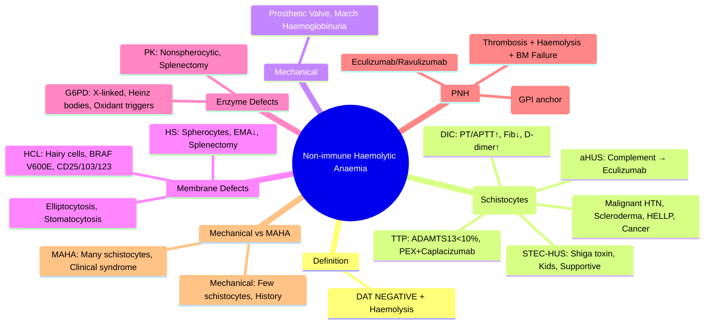

# Non-immune Haemolytic Anaemia

> [!info] **Davidson Ch 25 Alignment**: Haemolytic Anaemias → Non-immune Haemolytic Anaemia
> **FCPS/MRCP Focus**: Classification by mechanism, Microangiopathic (TTP/HUS/DIC), Mechanical (prosthetic valves, HUS), Membrane defects (HCL, HS), Enzyme defects (G6PD, PK), PNH, Differentiation from immune haemolysis

---

## 🎯 Learning Objectives

- [ ] Classify **Non-immune Haemolytic Anaemia** by **mechanism**: Microangiopathic, Mechanical, Membrane defects, Enzyme defects, PNH
- [ ] Apply **Diagnostic Criteria**: **Negative DAT**, **Evidence of haemolysis** (↑ LDH, ↓ Haptoglobin, ↑ Reticulocytes, ↑ Bilirubin)
- [ ] Identify **Microangiopathic (MAHA)**: **Schistocytes**, TTP/HUS, DIC, Malignant hypertension, Scleroderma renal crisis
- [ ] Identify **Mechanical**: Prosthetic heart valves, March haemoglobinuria, Burns
- [ ] Recognise **Membrane Defects**: Hereditary spherocytosis, HCL, Stomatocytosis
- [ ] Recognise **Enzyme Defects**: G6PD, Pyruvate kinase, Hexokinase
- [ ] Diagnose **PNH**: Flow cytometry (CD55/CD59), Thrombosis risk, Ham's test obsolete
- [ ] Differentiate from **Immune Haemolytic Anaemia** (DAT positive)

---

## 📖 Classification by Mechanism

| Category | Examples | Key Feature |
|----------|----------|-------------|
| **Microangiopathic (MAHA)** | **TTP, HUS, DIC**, Malignant HTN, Scleroderma renal crisis, HELLP, Cancer | **Schistocytes** on film |
| **Mechanical Trauma** | **Prosthetic heart valves**, March haemoglobinuria, Extracorporeal circuits | **Physical shear stress** |
| **Membrane Defects (Hereditary)** | **Hereditary Spherocytosis**, **HCL**, **Elliptocytosis**, **Stomatocytosis**, Southeast Asian Ovalocytosis | **Intrinsic RBC membrane defect** |
| **Enzyme Defects (Hereditary)** | **G6PD Deficiency**, **Pyruvate Kinase**, **Hexokinase**, Triose phosphate isomerase | **Enzymopathy** |
| **Paroxysmal Nocturnal Haemoglobinuria (PNH)** | **Acquired GPI-anchor defect** | **CD55/CD59 negative clones** |
| **Drug/Toxin Induced** | Oxidative drugs (in G6PD), Snake venom, Copper | **Oxidative/Toxic damage** |
| **Infections** | Malaria, Bartonella, Clostridium | **Direct RBC invasion/Toxin** |

> [!tip] **Non-immune = DAT NEGATIVE + Haemolysis**. **Schistocytes = MAHA**. **PNH = CD55/CD59 negative**. **G6PD = Heinz bodies + Oxidative trigger**.

---

## 🔬 Diagnostic Approach

```mermaid
flowchart TD
    A[Haemolytic Anaemia: ↑ LDH, ↓ Haptoglobin, ↑ Retic, ↑ Bilirubin] --> B[**Direct Antiglobulin Test (DAT)**]
    B --> C{**DAT Positive?**}
    C -->|Yes| D[**Immune Haemolytic Anaemia** (AIHA, DHTR, Drug-induced)]
    C -->|No| E[**Non-immune Haemolytic Anaemia**]
    E --> F[**Blood Film**]
    F --> G{**Schistocytes?**}
    G -->|Yes| H[**MAHA: TTP/HUS/DIC/Malignancy/HTN**]
    G -->|No| I{**Specific Morphology?**}
    I --> J1[**Spherocytes** → Hereditary Spherocytosis / HCL]
    I --> J2[**Heinz Bodies / Bite Cells** → G6PD / Oxidative]
    I --> J3[**Normal Morphology** → PNH / Enzyme Defect / Mechanical]
    J3 --> K[**Flow Cytometry (CD55/CD59)** → PNH]
    J3 --> L[**Enzyme Assays (G6PD, PK)** → Enzyme Defect]
    J3 --> M[**Prosthetic Valve / March Hb** → Mechanical]
```

### Key Investigations

| Test | Purpose |
|------|---------|
| **DAT (Coombs)** | **Negative = Non-immune** |
| **Blood Film** | **Schistocytes** = MAHA; **Spherocytes** = HS/HCL; **Heinz bodies** = G6PD; **Target cells** = Liver/Thalassaemia |
| **LDH** | ↑↑ (Marked elevation = Intravascular haemolysis) |
| **Haptoglobin** | ↓↓ (Consumed) |
| **Reticulocytes** | ↑↑ (Compensatory) |
| **Bilirubin** | **Unconjugated ↑↑** |
| **Urine Haemoglobin** | Positive (Intravascular haemolysis) |
| **G6PD Assay** | Quantitative (if Heinz bodies/Bite cells) |
| **Pyruvate Kinase Assay** | If nonspherocytic haemolytic anaemia |
| **Flow Cytometry (CD55/CD59)** | **Gold standard for PNH** |
| **Ham's Test / Sugar Water Test** | **Obsolete** (Historical for PNH) |

---

## 💊 Major Subtypes

### 1. Microangiopathic Haemolytic Anaemia (MAHA)

| Condition | Key Features |
|-----------|--------------|
| **TTP** | **ADAMTS13 <10%**, **Schistocytes**, Thrombocytopenia, Neuro/Renal, **PEX + Caplacizumab** |
| **HUS (STEC)** | **Shiga toxin**, Bloody diarrhoea, **Children**, Supportive only |
| **aHUS** | **Complement dysregulation** (CFH, CFI, MCP), **Eculizumab** |
| **DIC** | **PT/APTT↑, Fib↓, D-dimer↑**, Underlying trigger (Sepsis, Obstetric, Trauma) |
| **Malignant HTN** | **BP >180/120**, Retinopathy, Renal failure |
| **Scleroderma Renal Crisis** | **Scleroderma**, **HTN**, **Renal failure**, **ACEi urgent** |
| **HELLP** | **Pregnancy**, Haemolysis, Elevated Liver enzymes, Low Platelets |
| **Cancer** | **Mucinous adenocarcinoma**, **MAR** |

### 2. Mechanical Haemolysis

| Cause | Features |
|-------|----------|
| **Prosthetic Heart Valve** | **Chronic low-grade haemolysis**, **LDH ↑**, **Haptoglobin ↓**, **Iron deficiency** common |
| **March Haemoglobinuria** | **Repetitive foot impact** (marathon, drumming) → Intravascular haemolysis |
| **Extracorporeal Circuits** | ECMO, Dialysis, Cardiopulmonary bypass |

### 3. Membrane Defects (Hereditary)

| Disorder | Key Feature |
|----------|-------------|
| **Hereditary Spherocytosis** | **Spherocytes**, **EMA binding ↓**, **Osmotic fragility ↑**, **Splenectomy curative** |
| **Hereditary Elliptocytosis** | **Elliptocytes >25%**, Usually mild |
| **HCL** | **Hairy cells**, **CD25+/CD103+/CD123+**, **TRAP+**, **BRAF V600E** |
| **Stomatocytosis** | **Stomatocytes**, High Na/K permeability |
| **SE Asian Ovalocytosis** | **Ovalocytes**, Band 3 mutation, Malaria protection |

### 4. Enzyme Defects

| Defect | Mechanism | Key Feature |
|--------|-----------|-------------|
| **G6PD Deficiency** | **Oxidative stress** → Heinz bodies, Bite cells | **X-linked**, Males affected, Oxidant triggers |
| **Pyruvate Kinase** | **Glycolysis defect** → ATP depletion | **Nonspherocytic**, **PK assay**, Splenectomy helps |
| **Hexokinase** | Glycolysis defect | Rare, Severe |
| **Triose Phosphate Isomerase** | Glycolysis defect | Neurological involvement |

### 5. Paroxysmal Nocturnal Haemoglobinuria (PNH)

| Feature | Details |
|---------|---------|
| **Defect** | **Acquired PIG-A mutation** → **GPI-anchor deficiency** → **CD55/CD59 negative** |
| **Triad** | **Intravascular haemolysis**, **Thrombosis (abdominal veins)**, **Bone marrow failure** |
| **Diagnosis** | **Flow cytometry: CD55/CD59 negative** (Granulocytes > RBCs) |
| **Clone Size** | **>1% = Significant**; **>10% = Clinical PNH** |
| **Complications** | **Thrombosis (Budd-Chiari, Cerebral venous)**, **AA overlap**, **Transformation to MDS/AML** |
| **Treatment** | **Eculizumab/Ravulizumab** (Anti-C5), **Supportive** (Folic acid, Iron, Anticoagulation) |

---

## 🔬 Key Diagnostic Differentiators

| Feature | **AIHA** | **MAHA** | **PNH** | **G6PD** | **HS** | **Mechanical** |
|---------|----------|----------|---------|----------|--------|----------------|
| **DAT** | **+ve** | -ve | -ve | -ve | -ve | -ve |
| **Film** | Spherocytes | **Schistocytes** | Normal | **Heinz bodies, Bite cells** | Spherocytes | Normal/Schistocytes |
| **Reticulocytes** | ↑↑ | ↑ | Variable | ↑ | ↑ | ↑ |
| **LDH** | ↑↑ | ↑↑↑ | ↑↑ | ↑ | ↑ | ↑ |
| **Haptoglobin** | ↓ | ↓↓ | ↓↓ | ↓ | ↓ | ↓ |
| **Key Test** | **DAT** | **Schistocytes + Clinical** | **Flow CD55/CD59** | **G6PD Activity** | **EMA Binding** | **History/Valve** |

---

## 💊 Management Principles

| Category | Key Management |
|----------|----------------|
| **MAHA (TTP)** | **PEX + Caplacizumab + Steroids + Rituximab** (Urgent) |
| **MAHA (STEC-HUS)** | **Supportive ONLY** (NO PEX, NO Antibiotics) |
| **MAHA (aHUS)** | **Eculizumab/Ravulizumab** |
| **PNH** | **Eculizumab/Ravulizumab** (Anti-C5), Anticoagulation if thrombosis |
| **G6PD** | **Avoid Oxidants**, Supportive, Transfuse if severe |
| **HS** | **Folic acid**, **Splenectomy** (if severe) |
| **Mechanical** | **Valve optimisation**, Iron replacement, Folic acid |
| **PK Deficiency** | **Splenectomy** (mainstay), **Mitapivat** (emerging) |

---

## 💡 FCPS/MRCP High-Yield Summary

| Topic | Key Point |
|-------|-----------|
| **Non-immune = DAT NEGATIVE + Haemolysis** | Core definition |
| **MAHA** | **Schistocytes** + **TTP/HUS/DIC/Malignant HTN/Scleroderma/HELLP/Cancer** |
| **TTP** | **ADAMTS13 <10%**, **PEX + Caplacizumab + Steroids + Rituximab** |
| **HUS (STEC)** | **Shiga toxin**, **Children**, **Supportive only (NO PEX)** |
| **aHUS** | **Complement mutation**, **Eculizumab** |
| **PNH** | **CD55/CD59 negative**, **Thrombosis (Budd-Chiari)**, **Eculizumab** |
| **G6PD** | **X-linked**, **Heinz bodies, Bite cells**, **Oxidant triggers** |
| **HS** | **Spherocytes**, **EMA binding ↓**, **Splenectomy curative** |
| **PK Deficiency** | **Nonspherocytic**, **Splenectomy**, **Mitapivat emerging** |
| **Mechanical** | **Prosthetic valve, March Hb**, Iron deficiency common |
| **DAT** | **Positive = Immune**; **Negative = Non-immune** |

---

## ❓ Viva Questions

1. **What is the definition of non-immune haemolytic anaemia?**
   - **Haemolytic anaemia with NEGATIVE Direct Antiglobulin Test (DAT)**

2. **What are schistocytes and in which conditions are they seen?**
   - **Fragmented RBCs** (helmet cells, triangle cells); **MAHA**: TTP, HUS, DIC, Malignant HTN, Scleroderma renal crisis, HELLP, Cancer

3. **Differentiate TTP from STEC-HUS.**
   - **TTP: ADAMTS13 <10%, PEX + Caplacizumab**; **STEC-HUS: Shiga toxin, Children, Supportive only, NO PEX**

4. **What is the diagnostic test for PNH?**
   - **Flow cytometry for CD55/CD59 (GPI-anchored proteins)** on granulocytes and RBCs

5. **How does PNH differ from other haemolytic anaemias?**
   - **Intravascular haemolysis + Thrombosis (abdominal veins) + Bone marrow failure triad**

6. **What are the key features of G6PD deficiency?**
   - **X-linked**, **Heinz bodies, Bite cells**, **Oxidant drug triggers** (Sulfa, Dapsone, Primaquine, Naphthalene)

7. **How do you diagnose Hereditary Spherocytosis?**
   - **Spherocytes on film**, **EMA binding test (decreased)**, **Osmotic fragility increased**, **DAT negative**

8. **What is the management of mechanical haemolysis from prosthetic valves?**
   - **Iron replacement**, **Folic acid**, **Valve optimisation**, **Monitor for iron deficiency**

9. **How does pyruvate kinase deficiency differ from G6PD deficiency?**
   - **PK: Chronic nonspherocytic, No oxidative trigger, PK assay**; **G6PD: Episodic, Oxidative trigger, Heinz bodies**

10. **What is the difference between immune and non-immune haemolytic anaemia?**
    - **Immune: DAT POSITIVE**; **Non-immune: DAT NEGATIVE + Haemolysis**

---

## 🧠 Confusions & Mnemonics

| Confusion | Clarification |
|-----------|---------------|
| **MAHA vs AIHA** | **MAHA = Schistocytes, DAT -ve**; **AIHA = Spherocytes, DAT +ve** |
| **TTP vs HUS** | **TTP = ADAMTS13<10%, Adults, Neuro**; **STEC-HUS = Shiga toxin, Children, Diarrhoea** |
| **PNH vs Other** | **PNH = CD55/CD59-, Thrombosis, BM Failure** triad |
| **G6PD vs PK** | **G6PD = Oxidant trigger, Heinz bodies**; **PK = Chronic, No trigger, PK assay** |
| **HS vs AIHA** | **HS = DAT -, Family history, EMA ↓**; **AIHA = DAT +, No family history** |
| **Mechanical vs MAHA** | **Mechanical = Prosthetic valve/March, Schistocytes few**; **MAHA = Many schistocytes, Clinical syndrome** |

| Mnemonic | Meaning |
|----------|---------|
| **"MAHA = Schistocytes = TTP/HUS/DIC"** | MAHA causes |
| **"TTP = ADAMTS13 <10 = PEX NOW"** | TTP management |
| **"STEC-HUS = Kids + Diarrhoea = Supportive Only"** | HUS management |
| **"PNH = CD55/CD59 - = Thrombosis + Haemolysis + BM Failure"** | PNH triad |
| **"G6PD = Heinz Bodies + Oxidant Trigger"** | G6PD features |
| **"HS = Spherocytes + EMA Down + DAT Negative"** | HS diagnosis |
| **"DAT + = Immune; DAT - = Non-immune"** | Core classification |

---

## 🗺️ Mind Map



---

## 📋 One-Page Revision Card

| **NON-IMMUNE HAEMOLYTIC ANAEMIA – FCPS/MRCP REVISION CARD** |
|--------------------------------------------------------------|
| **Definition**: **DAT NEGATIVE + Haemolysis** |
| **MAHA**: **Schistocytes** → TTP (ADAMTS13<10%, PEX), HUS (Shiga toxin, Supportive), DIC, Malignant HTN, Scleroderma, HELLP |
| **TTP**: ADAMTS13<10% → **PEX + Caplacizumab + Steroids + Rituximab** |
| **STEC-HUS**: Children, Diarrhoea → **Supportive ONLY** (NO PEX) |
| **aHUS**: Complement mutation → **Eculizumab** |
| **PNH**: **CD55/CD59-** (Flow), Thrombosis (Budd-Chiari), BM Failure → **Eculizumab** |
| **G6PD**: X-linked, **Heinz bodies, Bite cells**, Oxidant triggers |
| **HS**: **Spherocytes, EMA↓, Osmotic Fragility↑**, DAT-, Splenectomy |
| **PK Deficiency**: Nonspherocytic, PK assay, Splenectomy |
| **Mechanical**: Prosthetic valve, March Hb → Iron deficiency |
| **DAT**: **+ = Immune; - = Non-immune** |

---

## 📅 Spaced Repetition Tracker

| Review | Date | Score (1-5) | Next Review |
|--------|------|-------------|-------------|
| Day 1 | 2025-06-17 | | 2025-06-18 |
| Day 3 | | | |
| Day 7 | | | |
| Day 15 | | | |
| Day 30 | | | |

---

## 🎯 Must Know / Should Know / Nice to Know

| Level | Content |
|-------|---------|
| **Must Know** | Non-immune = DAT -, MAHA = Schistocytes (TTP/HUS/DIC), TTP management (PEX+Capla+Steroids+Ritux), STEC-HUS supportive only, aHUS = Eculizumab, PNH = CD55/CD59- = Eculizumab, G6PD = Heinz/Bite cells + Oxidants, HS = EMA↓ + Spherocytes, PK deficiency = Splenectomy, Mechanical = Prosthetic valve/March |
| **Should Know** | MAHA differential (TTP vs HUS vs DIC vs Malignant HTN), PNH triad (haemolysis, thrombosis, BM failure), PNH diagnostics (granulocytes > RBCs for CD55/CD59), G6PD variants (African vs Mediterranean), PK deficiency pathophysiology, Prosthetic valve haemolysis management, March haemoglobinuria mechanism, Drug-induced oxidative haemolysis, MAHA in cancer (adenocarcinoma) |
| **Nice to Know** | MAHA pathophysiology (ADAMTS13 ultrastructure), PNH clone size dynamics, Eculizumab vs Ravulizumab pharmacokinetics, Complement pathway in aHUS (alternative pathway), Menin inhibitors in PK deficiency, Gene therapy for G6PD/PK, Novel complement inhibitors (iptacopan, pegcetacoplan), Chronic haemolysis complications (pigment stones, leg ulcers, pulmonary HTN), Foetal/neonatal alloimmune haemolytic disease differentiation |

---

## ✅ Self-Test Scorecard

| Section | Score (0-10) | Notes |
|---------|--------------|-------|
| Classification & Mechanisms | | |
| MAHA (TTP/HUS/DIC) | | |
| PNH | | |
| Membrane/Enzyme Defects | | |
| Mechanical Haemolysis | | |
| Differential Diagnosis | | |
| Viva Questions | | |

---

## 🔗 Local Navigation

- **Previous**: [[Endocrine Anaemia]]
- **Next**: [[Secondary Polycythaemia]]
- **Section Hub**: [[Anaemia and Red Cell Disorders]]
- **MOC**: [[Hematology MOC]]
- **Template**: [[../Templates/Hematology Topic Template]]

---

*Generated for FCPS/MRCP exam preparation. Based on Davidson Medicine 24th Ed Chapter 25.*