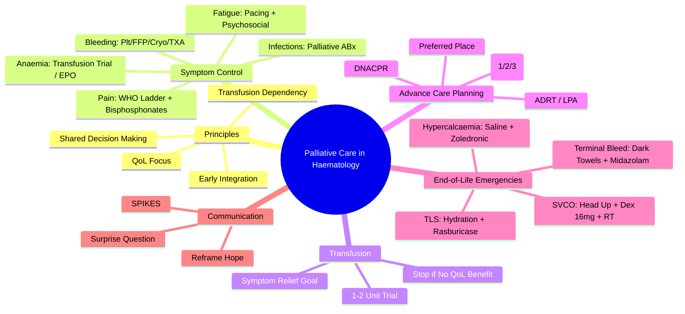

# Palliative Care in Haematology

> [!info] **Davidson Ch 25 Alignment**: Supportive Care in Haematology → Palliative Care
> **FCPS/MRCP Focus**: Symptom management, transfusion in palliative setting, advance care planning, communication, end-of-life care in haematological malignancies

---

## 🎯 Learning Objectives

- [ ] Apply **Palliative Care Principles** in haematology: Early integration, shared decision-making, quality of life focus
- [ ] Manage **Common Symptoms**: Anaemia, bleeding, infections, pain, fatigue, breathlessness, nausea
- [ ] Apply **Transfusion in Palliative Care**: Indications, thresholds, patient-centred goals, stopping criteria
- [ ] Perform **Advance Care Planning**: DNACPR, treatment ceilings, preferred place of care, power of attorney
- [ ] Manage **End-of-Life Care**: Terminal bleeding, hypercalcaemia, superior vena cava obstruction, tumour lysis
- [ ] Communicate **Prognosis & Uncertainty**: SPIKES framework, honest conversations, hope reframing

---

## 📖 Principles of Palliative Care in Haematology

| Principle | Application in Haematology |
|-----------|---------------------------|
| **Early Integration** | **At diagnosis** for high-risk AML, myeloma, aggressive lymphoma; Not just end-of-life |
| **Shared Decision-Making** | **Treatment goals** aligned with patient values (curative vs palliative intent) |
| **Quality of Life** | **Symptom burden** often > disease burden (fatigue, infections, transfusions) |
| **Uncertainty Management** | **Prognostic uncertainty** high in haematology (sudden deterioration, transformation) |
| **Transfusion Dependency** | **Unique to haematology** - palliative transfusions for QoL, not survival |

> [!tip] **Haematology Palliative Care is Different**: **Transfusion-dependent**, **Sudden deterioration**, **Transformation risk**, **Curative options late** (HSCT, CAR-T).

---

## 🩺 Symptom Management

### Anaemia-Related Fatigue
| Intervention | Indication |
|--------------|------------|
| **Red Cell Transfusion** | **Symptomatic anaemia** (Hb <80-90, dyspnoea, fatigue affecting QoL) |
| **Erythropoietin (EPO)** | **Chemo-induced anaemia**, MDS, CKD (if Hb <10, avoid if curative intent) |
| **Iron** | If **absolute/functional deficiency** (Ferritin <100, TSAT <20%) |
| **Non-pharmacological** | Activity pacing, sleep hygiene, psychosocial support |

### Bleeding
| Cause | Management |
|-------|------------|
| **Thrombocytopenia** | **Platelet transfusion** if symptomatic (active bleed, high-risk activity) |
| **Coagulopathy** | **FFP/Cryoprecipitate** if active bleed + INR>1.5/Fib<1.5 |
| **Mucosal/Minor** | **Tranexamic acid** (topical/oral/IV), Sucralfate mouthwash |
| **Massive/Terminal** | **Palliative sedation**, **Octreotide** (GI bleed), **Comfort measures** |

### Infections (Neutropenic/Immunosuppressed)
| Situation | Management |
|-----------|------------|
| **Febrile Neutropenia** | **Palliative antibiotics** (oral if appropriate) vs **Comfort care** if dying |
| **Prophylaxis** | **Stop** if no longer aligned with goals (e.g. POS prophylaxis in dying) |
| **Fungal** | **Treat if symptomatic** (oral thrush, oesophagitis); **Stop prophylaxis** if dying |

### Pain
| Type | Management |
|------|------------|
| **Bone Pain** (Myeloma, Metastases) | **WHO Ladder**: NSAIDs (caution platelets) → Weak opioid → Strong opioid; **Bisphosphonates/Denosumab** |
| **Neuropathic** (Chemo-induced, Infiltration) | **Gabapentin/Pregabalin**, **Duloxetine**, **Amitriptyline** |
| **Visceral** (Splenomegaly, Hepatomegaly) | **Opioids**, **Corticosteroids** (short-term), **Splenic irradiation** (rare) |

---

## 🩸 Transfusion in Palliative Care

### Indications for Palliative Transfusion

| Indication | Threshold | Goal |
|------------|-----------|------|
| **Symptomatic Anaemia** | **Hb <80-90** (or <90 if cardiac) | **Symptom relief** (dyspnoea, fatigue, exercise tolerance) |
| **Active Bleeding** | **Any Hb** + bleeding | **Haemostasis** |
| **Procedure/Haemostasis** | **Plt <50** (procedure), **<20** (prophylactic) | **Haemostasis** |

### Palliative Transfusion Principles

| Principle | Application |
|-----------|-------------|
| **Goal-Oriented** | **Symptom relief** > Normalisation of counts |
| **Trial of Transfusion** | **1-2 units**, reassess **24h post** for symptom benefit |
| **Stopping Criteria** | **No symptomatic benefit** after 2-3 transfusions; **Patient declines**; **Goals change to comfort-only** |
| **Frequency** | **As needed for symptoms**; Not routine scheduled |
| **Volume** | **Single unit** often sufficient for symptom relief |

> [!warning] **Palliative Transfusion ≠ Curative Transfusion**. **1 unit often sufficient**. **Stop if no QoL benefit**. **Avoid futile transfusions** in last days of life.

---

## 📋 Advance Care Planning (ACP)

### Key Components

| Component | Details |
|-----------|---------|
| **DNACPR (Do Not Attempt CPR)** | **Discuss early**; Not just "no CPR" - clarify what IS wanted |
| **Treatment Ceilings** | **Level 1**: Full active; **Level 2**: Ward-based care (no ICU); **Level 3**: Comfort only |
| **Preferred Place of Care** | **Home, Hospice, Hospital** - Document and review |
| **Advance Decision to Refuse Treatment (ADRT)** | **Legally binding** if valid & applicable |
| **Lasting Power of Attorney (LPA)** | **Health & Welfare** decisions if capacity lost |

### ACP Conversation Framework (SPIKES)

| Step | Action |
|------|--------|
| **S - Setting** | Private, uninterrupted, time, tissues |
| **P - Perception** | "What do you understand about your illness?" |
| **I - Invitation** | "How much detail would you like?" |
| **K - Knowledge** | **Warning shot** → "Unfortunately, the news is not good..." then clear info |
| **E - Empathy** | **Name emotion** → "I can see this is devastating..." |
| **S - Strategy/Summary** | **Shared plan** → "Based on what matters to you..." |

---

## 🚨 End-of-Life Specific Complications

### Terminal Haemorrhage (Catastrophic Bleeding)
| Scenario | Immediate Management |
|----------|---------------------|
| **Major GI/Pulmonary/External** | **Call for help**, **Dark towels** (reduce visual distress), **Midazolam 5-10mg IV/SC** (sedation), **Morphine** (analgesia), **Octreotide** (GI), **Tranexamic acid** (if appropriate), **Family support** |

### Hypercalcaemia of Malignancy
| Feature | Management |
|---------|------------|
| **Symptoms** | Thirst, Polyuria, Confusion, Constipation, Nausea, Renal failure |
| **Acute** | **IV Fluids (Saline 2-3L/24h)** → **IV Bisphosphonate (Zoledronic acid 4mg)** or **Denosumab 120mg SC** |
| **Palliative** | **Hydration as tolerated**, **Symptom control** (anti-emetics, laxatives) |

### Superior Vena Cava Obstruction (SVCO)
| Feature | Management |
|---------|------------|
| **Signs** | Facial/arm swelling, Dyspnoea, Distended neck veins, Stridor |
| **Emergency** | **Head up**, **Oxygen**, **Dexamethasone 16mg IV** → **Urgent Radiotherapy** (or Stenting/Chemo) |

### Tumour Lysis Syndrome (TLS)
| Feature | Management |
|---------|------------|
| **Risk** | High-grade lymphoma, Leukaemia, Rapidly proliferating tumours |
| **Prophylaxis** | **Allopurinol** (all), **Rasburicase** (high risk: WBC>50, high LDH, renal impairment) |
| **Acute** | **Aggressive Hydration**, **Rasburicase**, **Monitor K/PO4/Ca/UA**, **Renal Replacement if needed** |

---

## 💬 Communication Framework

### Prognostication in Haematology

| Tool | Use |
|------|-----|
| **Surprise Question** | "Would you be surprised if this patient died in the next 12 months?" |
| **Prognostic Scores** | IPSS-R (MDS), IPSS-WM, IPI (Lymphoma), ISS (Myeloma), APACHE (ICU) |
| **Clinical Triggers** | **Transfusion dependence**, **Refractory disease**, **Repeated admissions**, **Functional decline** |

### Reframing Hope

| From | To |
|------|----|
| "Cure" | "Best possible quality of life" |
| "More treatment" | "Best possible symptom control" |
| "Fighting" | "Living well with illness" |
| "Not giving up" | "Shifting focus to what matters most" |

---

## 💡 FCPS/MRCP High-Yield Summary

| Topic | Key Point |
|-------|-----------|
| **Palliative Haematology** | **Early integration**, **Transfusion-dependent**, **Uncertainty**, **Curative options late** |
| **Symptom Control** | **Trial of Transfusion** (1-2 units, assess 24h), **WHO Pain Ladder**, **Tranexamic acid for bleeding** |
| **Palliative Transfusion** | **Symptom relief > Count normalisation**, **1-2 unit trial**, **Stop if no QoL benefit** |
| **Advance Care Planning** | **Early DNACPR**, **Treatment ceilings**, **Preferred place**, **LPA** |
| **Terminal Bleeding** | **Dark towels, Midazolam, Morphine, Octreotide, Tranexamic, Family support** |
| **Hypercalcaemia** | **Saline + Zoledronic Acid/Denosumab** |
| **SVCO** | **Head up, Oxygen, Dexamethasone 16mg IV, Urgent RT** |
| **Communication** | **SPIKES**, **Reframe hope**, **Name emotions** |

---

## ❓ Viva Questions

1. **How does palliative transfusion differ from curative transfusion?**
   - **Goal = Symptom relief (not count normalisation)**; **1-2 unit trial**; **Stop if no QoL benefit**; **Patient-centred goals**

2. **What are the indications for palliative red cell transfusion?**
   - **Symptomatic anaemia** (dyspnoea, fatigue affecting QoL) with **Hb <80-90**; **Active bleeding**

3. **How do you manage terminal catastrophic haemorrhage?**
   - **Dark towels**, **Midazolam 5-10mg SC/IV**, **Morphine**, **Octreotide (GI)**, **Tranexamic acid**, **Family support**, **Comfort measures**

3. **What is the SPIKES framework for breaking bad news?**
   - **Setting, Perception, Invitation, Knowledge (warning shot), Empathy, Strategy/Summary**

4. **How do you manage hypercalcaemia of malignancy palliatively?**
   - **IV Saline 2-3L/24h + Zoledronic acid 4mg IV** (or Denosumab 120mg SC); Symptom control if dying

4. **What are the key components of Advance Care Planning in haematology?**
   - **DNACPR, Treatment ceilings, Preferred place of care, ADRT, LPA**

5. **How do you manage Superior Vena Cava Obstruction in a palliative setting?**
   - **Head up, Oxygen, Dexamethasone 16mg IV, Urgent Radiotherapy/Stenting**, Symptom control

6. **When should you stop palliative transfusions?**
   - **No symptomatic benefit after 1-2 units**, **Patient declines**, **Goals shift to comfort-only**, **Last days of life**

6. **What is the "Surprise Question" in prognostication?**
   - **"Would you be surprised if this patient died in the next 12 months?"** → If NO → Palliative care referral

7. **How do you reframe hope in palliative haematology conversations?**
   - **From "Cure" → "Best possible QoL"; "More treatment" → "Best symptom control"; "Fighting" → "Living well"**

8. **What are the thresholds for palliative platelet transfusion?**
   - **Active bleeding: Any**; **Prophylactic: <20** (if QoL affected); **Procedure: >50**; **Comfort care: Avoid if no benefit**

9. **How do you manage tumour lysis syndrome in a palliative patient?**
   - **Hydration, Rasburicase, Monitor electrolytes, Renal replacement if appropriate**; **Comfort-focused if dying**

10. **What is the difference between an ADRT and a DNACPR?**
    - **ADRT = Legally binding refusal of specific treatment**; **DNACPR = Clinical recommendation not to attempt CPR** (not legally binding)

---

## 🧠 Confusions & Mnemonics

| Confusion | Clarification |
|-----------|---------------|
| **Palliative vs Curative Transfusion** | **Palliative = Symptom relief, 1-2 unit trial, stop if no benefit**; **Curative = Normalise counts, scheduled** |
| **DNACPR vs ADRT** | **DNACPR = Clinical recommendation**; **ADRT = Legally binding refusal** |
| **Treatment Ceilings** | **Level 2 = Ward care (no ICU)**; **Level 3 = Comfort only** |
| **SVCO Emergency** | **Dex 16mg IV + Urgent RT** (not just steroids) |
| **Terminal Bleeding** | **Midazolam for distress**, **Dark towels for dignity** |

| Mnemonic | Meaning |
|----------|---------|
| **"Palliative Transfusion = Symptom Trial, Stop if No Benefit"** | Transfusion principle |
| **"SPIKES = Bad News Framework"** | Communication |
| **"SVCO = Dex + RT Urgent"** | SVCO management |
| **"Terminal Bleed = Dark Towels + Midazolam"** | Terminal haemorrhage |
| **"ACP = DNACPR + Ceilings + Place + LPA"** | ACP components |

---

## 🗺️ Mind Map

---

## 📋 One-Page Revision Card

| **PALLIATIVE CARE IN HAEMATOLOGY – FCPS/MRCP REVISION CARD** |
|---------------------------------------------------------------|
| **Principles**: Early integration, QoL focus, Transfusion dependency, Uncertainty |
| **Transfusion**: **Symptom relief > Normalisation**; **1-2 unit trial**; **Stop if no QoL benefit** |
| **Bleeding**: Tranexamic acid, Plts/FFP/Cryo if active bleed |
| **Pain**: WHO Ladder + Bisphosphonates/Denosumab |
| **Hypercalcaemia**: **Saline + Zoledronic 4mg/Denosumab 120mg** |
| **SVCO**: **Head Up + O2 + Dex 16mg IV + Urgent RT** |
| **Terminal Bleed**: **Dark Towels + Midazolam + Morphine + Octreotide + TXA + Family** |
| **ACP**: **DNACPR + Ceilings (1/2/3) + Preferred Place + ADRT + LPA** |
| **Communication**: **SPIKES**; **Reframe Hope** (Cure → QoL) |
| **Prognostication**: **Surprise Question**, **Transfusion Dependence**, **Refractory Disease** |

---

## 📅 Spaced Repetition Tracker

| Review | Date | Score (1-5) | Next Review |
|--------|------|-------------|-------------|
| Day 1 | 2025-06-17 | | 2025-06-18 |
| Day 3 | | | |
| Day 7 | | | |
| Day 15 | | | |
| Day 30 | | | |

---

## 🎯 Must Know / Should Know / Nice to Know

| Level | Content |
|-------|---------|
| **Must Know** | Palliative transfusion principles (trial, stop criteria), symptom management (anaemia, bleeding, pain), terminal emergencies (haemorrhage, hypercalcaemia, SVCO, TLS), advance care planning (DNACPR, ceilings, ADRT, LPA), SPIKES communication, reframing hope |
| **Should Know** | Transfusion thresholds in palliative setting, ESA role in palliative anaemia, opioid rotation, midazolam dosing for distress, octreotide for GI bleed, tranexamic acid indications, rasburicase in palliative TLS, DNACPR vs ADRT legalities, paediatric palliative haematology, spiritual care |
| **Nice to Know** | Haematology-specific palliative trajectories (myeloma vs leukaemia vs lymphoma), integration with haemato-oncology MDT, prognostic models validation, advance care planning timing, cultural aspects, carer burden, bereavement support, research in palliative haematology, ethical frameworks, resource allocation |

---

## ✅ Self-Test Scorecard

| Section | Score (0-10) | Notes |
|---------|--------------|-------|
| Palliative Transfusion Principles | | |
| Symptom Management | | |
| Terminal Emergencies | | |
| Advance Care Planning | | |
| Communication (SPIKES) | | |
| Viva Questions | | |

---

## 🔗 Local Navigation

- **Previous**: [[Liver Disease Coagulopathy]]
- **Next**: [[Special Transfusion Situations]]
- **Section Hub**: [[Supportive Care in Haematology]] / [[Bleeding and Thrombotic Disorders]]
- **MOC**: [[Hematology MOC]]
- **Template**: [[../Templates/Hematology Topic Template]]

---

*Generated for FCPS/MRCP exam preparation. Based on Davidson Medicine 24th Ed Chapter 25.*
---

> Auto-generated study sections for "Hematology" — Ch 24: Haematology & Transfusion Medicine.

## Flashcards (29 generated)

- Q: What is the definition of Hematology?
  A: [!info] Davidson Ch 25 Alignment: Supportive Care in Haematology → Palliative Care
- Q: What is Thrombocytopenia of Hematology?
  A: Platelet transfusion if symptomatic (active bleed, high-risk activity)
- Q: What is Coagulopathy of Hematology?
  A: FFP/Cryoprecipitate if active bleed + INR>1.5/Fib<1.5
- Q: What is Mucosal/Minor of Hematology?
  A: Tranexamic acid (topical/oral/IV), Sucralfate mouthwash
- Q: What is Massive/Terminal of Hematology?
  A: Palliative sedation, Octreotide (GI bleed), Comfort measures
- Q: What are the clinical features of Hematology?
  A: Thirst, Polyuria, Confusion, Constipation, Nausea, Renal failure
- Q: What is Acute of Hematology?
  A: IV Fluids (Saline 2-3L/24h) → IV Bisphosphonate (Zoledronic acid 4mg) or Denosumab 120mg SC
- Q: What is Palliative of Hematology?
  A: Hydration as tolerated, Symptom control (anti-emetics, laxatives)
- Q: What is Signs of Hematology?
  A: Facial/arm swelling, Dyspnoea, Distended neck veins, Stridor
- Q: What is Emergency of Hematology?
  A: Head up, Oxygen, Dexamethasone 16mg IV → Urgent Radiotherapy (or Stenting/Chemo)
- Q: What is Risk of Hematology?
  A: High-grade lymphoma, Leukaemia, Rapidly proliferating tumours
- Q: What is Prophylaxis of Hematology?
  A: Allopurinol (all), Rasburicase (high risk: WBC>50, high LDH, renal impairment)
- Q: What is Acute of Hematology?
  A: Aggressive Hydration, Rasburicase, Monitor K/PO4/Ca/UA, Renal Replacement if needed
- Q: What is Thrombocytopenia of Hematology?
  A: Platelet transfusion if symptomatic (active bleed, high-risk activity)
- Q: What is Coagulopathy of Hematology?
  A: FFP/Cryoprecipitate if active bleed + INR>1.5/Fib<1.5
- Q: What is Mucosal/Minor of Hematology?
  A: Tranexamic acid (topical/oral/IV), Sucralfate mouthwash
- Q: What are the clinical features of Hematology?
  A: Thirst, Polyuria, Confusion, Constipation, Nausea, Renal failure
- Q: What is Acute of Hematology?
  A: IV Fluids (Saline 2-3L/24h) → IV Bisphosphonate (Zoledronic acid 4mg) or Denosumab 120mg SC
- Q: What is Risk of Hematology?
  A: High-grade lymphoma, Leukaemia, Rapidly proliferating tumours
- Q: What is Prophylaxis of Hematology?
  A: Allopurinol (all), Rasburicase (high risk: WBC>50, high LDH, renal impairment)
- Q: What is Acute of Hematology?
  A: Aggressive Hydration, Rasburicase, Monitor K/PO4/Ca/UA, Renal Replacement if needed
- Q: What is Palliative Haematology of Hematology?
  A: Early integration, Transfusion-dependent, Uncertainty, Curative options late
- Q: What are the clinical features of Hematology?
  A: Trial of Transfusion (1-2 units, assess 24h), WHO Pain Ladder, Tranexamic acid for bleeding
- Q: What is Palliative Transfusion of Hematology?
  A: Symptom relief > Count normalisation, 1-2 unit trial, Stop if no QoL benefit
- Q: What is Advance Care Planning of Hematology?
  A: Early DNACPR, Treatment ceilings, Preferred place, LPA
- Q: What is Terminal Bleeding of Hematology?
  A: Dark towels, Midazolam, Morphine, Octreotide, Tranexamic, Family support
- Q: What is Hypercalcaemia of Hematology?
  A: Saline + Zoledronic Acid/Denosumab
- Q: What is SVCO of Hematology?
  A: Head up, Oxygen, Dexamethasone 16mg IV, Urgent RT
- Q: What is Communication of Hematology?
  A: SPIKES, Reframe hope, Name emotions

## MCQs (1 generated)

1. **Which of the following best describes Hematology?**
   A. **[!info] Davidson Ch 25 Alignment: Supportive Care in Haematology → Palliative Care**
   B. An unrelated condition not matching the clinical picture of Hematology
   C. A complication seen late in the disease course of Hematology
   D. A condition that mimics Hematology but has a different underlying cause

## SBA Questions (1 generated)

1. A patient with suspected Hematology presents with: DNACPR (Do Not Attempt CPR) — Discuss early; Not just "no CPR" - clarify what IS wanted; Treatment Ceilings — Level 1: Full active; Level 2: Ward-based care (no ICU); Level 3: Comfort only; Preferred Place of Care — Home, Hospice, Hospital - Document and review. What is the most likely diagnosis?
   A. **Hematology**
   B. A condition that mimics Hematology but is not the same entity
   C. A complication of Hematology rather than the primary diagnosis
   D. An unrelated condition in the same clinical category as Hematology

