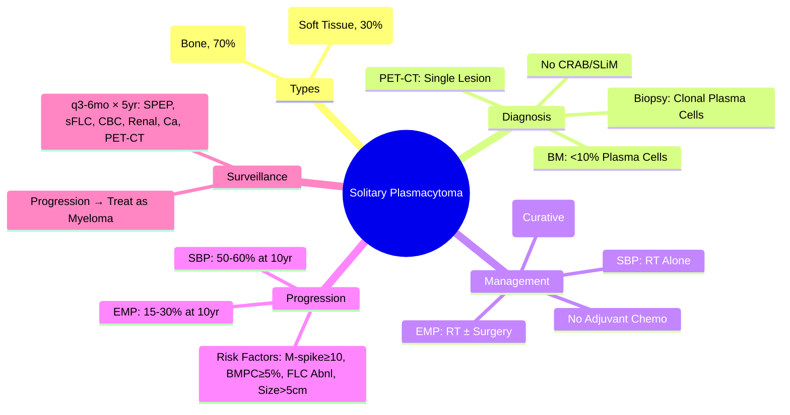

# Solitary Plasmacytoma

> [!info] **Davidson Ch 25 Alignment**: Haematological Malignancies → Plasma Cell Disorders → Solitary Plasmacytoma
> **FCPS/MRCP Focus**: Solitary bone plasmacytoma (SBP) vs Extramedullary plasmacytoma (EMP), differentiation from myeloma, radiotherapy, progression risk, surveillance

---

## 🎯 Learning Objectives

- [ ] Define **Solitary Plasmacytoma**: **Single clonal plasma cell tumour** with **NO other sites** of involvement and **NO CRAB/SLiM criteria**
- [ ] Distinguish **Solitary Bone Plasmacytoma (SBP)** vs **Extramedullary Plasmacytoma (EMP)**
- [ ] Apply **Diagnostic Criteria**: **Single lesion** (bone or soft tissue) + **BM plasma cells <10%** + **NO CRAB/SLiM** + **Normal skeletal survey/PET-CT** elsewhere
- [ ] Manage **SBP**: **Radiotherapy 40-50 Gy** (curative intent) → **Surveillance for progression to myeloma**
- [ ] Manage **EMP**: **Radiotherapy ± Surgery** (local control) → **Surveillance**
- [ ] Apply **Surveillance Protocol**: **q3-6mo × 5yr, then annually** (SPEP, sFLC, CBC, Renal, Ca, Imaging)
- [ ] Assess **Progression Risk**: **SBP ~50-60% at 10yr**, **EMP ~15-30%**; Risk factors: M-spike size, BMPC%, Free light chains

---

## 📖 Definition & Classification

| Type | Site | Features |
|------|------|----------|
| **Solitary Bone Plasmacytoma (SBP)** | **Single bone lesion** (vertebrae, ribs, femur, skull) | **Most common** (~70%); Male predominance; Median age 55-60 |
| **Extramedullary Plasmacytoma (EMP)** | **Soft tissue** (Upper aerodigestive tract ~80%: Nasopharynx, Sinus, Larynx) | **~30%**; Male predominance; Median age 50-60 |
| **Multiple Solitary Plasmacytomas** | **2-3 lesions** (No BM involvement) | Rare; **Behaviour like SBP** |

### Diagnostic Criteria (IMWG)

| Criterion | Requirement |
|-----------|-------------|
| **1. Biopsy** | **Clonal plasma cell infiltrate** (monotypic κ or λ) |
| **2. Single Lesion** | **Bone (SBP)** OR **Soft tissue (EMP)** on **PET-CT / MRI** |
| **3. Bone Marrow** | **<10% clonal plasma cells** (no dysplasia) |
| **4. No CRAB/SLiM** | **No**: Hypercalcaemia, Renal insufficiency, Anaemia, Bone lesions (other), SLiM criteria |
| **5. Normal Imaging** | **PET-CT / Whole-body MRI / Skeletal survey** = No other lesions |

> [!tip] **SBP vs Myeloma**: **SBP = Single lesion + BM <10% + NO CRAB**; **Myeloma = BM ≥10% or ≥1 CRAB/SLiM**. **EMP = Soft tissue + No bone/bone marrow involvement**.

---

## 🔬 Diagnostic Workup

```mermaid
flowchart TD
    A[Solitary Lytic Bone Lesion / Soft Tissue Mass] --> B[**Biopsy: Clonal Plasma Cells (κ/λ restriction)**]
    B --> C[**Comprehensive Staging**]
    C --> D1[**SPEP + Immunofixation**]
    C --> D2[**sFLC (κ/λ ratio)**]
    C --> D3[**BM Aspirate/Biopsy** (BMPC%)]
    C --> D4[**Imaging: PET-CT or WBLD-CT** (Whole body)]
    C --> D5[**CBC, Renal, Ca, Albumin, β2M, LDH**]
    D1 & D2 & D3 & D4 & D5 --> E{**Single Lesion + BMPC <10% + No CRAB?**}
    E -->|Yes| F[**Solitary Plasmacytoma**]
    E -->|No| G[**Multiple Myeloma**]
    F --> H{**Bone or Soft Tissue?**}
    H -->|Bone| I[**Solitary Bone Plasmacytoma (SBP)**]
    H -->|Soft Tissue| J[**Extramedullary Plasmacytoma (EMP)**]
```

### Essential Staging Investigations

| Investigation | Purpose |
|---------------|---------|
| **Biopsy + IHC** | **Clonal plasma cells** (CD38+, CD138+, CD19-, CD56+, κ/λ restriction) |
| **SPEP + Immunofixation** | **M-protein** (often small, <30 g/L); **Absent in ~30%** |
| **sFLC** | **Abnormal κ/λ ratio**; Involved FLC elevated |
| **BM Aspirate/Biopsy** | **<10% plasma cells** (required for SBP/EMP diagnosis) |
| **PET-CT / WBLD-CT** | **Single lesion**; No other metabolically active sites |
| **Skeletal Survey** | **Single lytic lesion** (SBP); **No lesions** (EMP) |
| **MRI Spine** | If paraspinal/solitary vertebra lesion (cord compression) |

---

## 🥴 SBP vs EMP Comparison

| Feature | **Solitary Bone Plasmacytoma (SBP)** | **Extramedullary Plasmacytoma (EMP)** |
|---------|--------------------------------------|---------------------------------------|
| **Site** | **Bone** (Vertebrae, Ribs, Femur, Skull) | **Soft Tissue** (Nasopharynx, Sinus, Larynx, Lung, GI, Bladder) |
| **Frequency** | **~70%** | **~30%** |
| **Male:Female** | **2:1** | **3:1** |
| **Median Age** | **55-60 years** | **50-60 years** |
| **Radiotherapy Dose** | **40-50 Gy** (Curative) | **40-50 Gy** (Curative) ± Surgery |
| **Progression to Myeloma** | **~50-60% at 10yr** | **~15-30% at 10yr** |
| **Surveillance** | **Intensive** (q6mo × 5yr) | **Less intensive** (q6-12mo × 5yr) |

---

## 💊 Management

### Radiotherapy (Primary Treatment)

| Aspect | SBP | EMP |
|--------|-----|-----|
| **Primary Treatment** | **Radiotherapy** (Curative intent) | **Radiotherapy** (Curative) ± **Surgery** |
| **Dose** | **40-50 Gy** (2 Gy/fraction) | **40-50 Gy** (2 Gy/fraction) |
| **Field** | **Involved field + margin** | **Involved field + margin** |
| **Surgery** | **Rare** (pathological fracture, cord compression) | **Often combined** (Endoscopic resection + RT) |
| **Local Control** | **>80-90%** | **>80-90%** |

### Systemic Therapy

| Setting | Recommendation |
|---------|----------------|
| **Upfront** | **NO systemic therapy** (Radiotherapy alone curative) |
| **Adjuvant** | **NO routine adjuvant** (No survival benefit) |
| **Relapse/Progression** | **Treat as Multiple Myeloma** (Induction + ASCT if eligible) |

---

## 🔬 Surveillance Protocol

### Follow-up Schedule (SBP)

| Time | Investigations |
|------|----------------|
| **Every 3-6 months × 5 years** | **SPEP + Immunofixation**, **sFLC**, **CBC**, **Renal function**, **Calcium**, **β2M**, **PET-CT / WBLD-CT** |
| **Annually after 5 years** | **SPEP, sFLC, CBC, Renal, Ca**, **Imaging if symptomatic** |

### Surveillance (EMP)

| Time | Investigations |
|------|----------------|
| **Every 6-12 months × 5 years** | **SPEP, sFLC, CBC, Renal, Ca**, **Endoscopy/Imaging of primary site** |
| **Annually after 5 years** | **As above** |

---

## ⚠️ Progression to Multiple Myeloma

### Risk Factors for Progression

| Risk Factor | SBP | EMP |
|-------------|-----|-----|
| **M-spike ≥10 g/L** | High | Moderate |
| **BMPC ≥5%** | High | Moderate |
| **Abnormal FLC Ratio** | High | Moderate |
| **Size >5 cm** | High | - |
| **Non-vertebral site** | Moderate | - |

### Progression Rates

| Time | **SBP** | **EMP** |
|------|---------|---------|
| **2 years** | ~15% | ~5% |
| **5 years** | ~30% | ~15% |
| **10 years** | **50-60%** | **15-30%** |
| **Median Time** | **2-3 years** | **3-5 years** |

### Management of Progression

| Scenario | Action |
|----------|--------|
| **Progression to Myeloma** | **Treat as Active Myeloma** (Induction + ASCT if eligible) |
| **Local Recurrence** | **Re-irradiation** (if feasible) / Surgery / Systemic therapy |
| **New Solitary Lesion** | **Re-biopsy** → Treat as new SBP/EMP if truly isolated |

---

## 💡 FCPS/MRCP High-Yield Summary

| Topic | Key Point |
|-------|-----------|
| **Definition** | **Single clonal plasma cell lesion** + **BM <10%** + **NO CRAB/SLiM** + **Single lesion on PET-CT** |
| **SBP vs EMP** | **SBP = Bone** (70%), **EMP = Soft tissue** (Upper aerodigestive 80%) |
| **Radiotherapy** | **40-50 Gy** (Curative); **Local control >80-90%** |
| **No Systemic Therapy** | **Upfront/Adjuvant chemo NOT recommended** |
| **Progression Risk** | **SBP: 50-60% at 10yr**; **EMP: 15-30%** |
| **Surveillance** | **SPEP, sFLC, CBC, Renal, Ca, PET-CT q6mo × 5yr** |
| **Progression** | **Treat as Multiple Myeloma** (Induction + ASCT) |
| **Risk Factors** | **M-spike ≥10, BMPC ≥5%, Abnormal FLC, Size >5cm** |

---

## ❓ Viva Questions

1. **What are the diagnostic criteria for Solitary Plasmacytoma?**
   - **Single clonal plasma cell lesion** + **BM plasma cells <10%** + **NO CRAB/SLiM** + **Single lesion on PET-CT/MRI/Skeletal survey**

2. **How does Solitary Bone Plasmacytoma differ from Extramedullary Plasmacytoma?**
   - **SBP = Bone lesion** (vertebrae, ribs); **EMP = Soft tissue** (nasopharynx, sinuses, larynx); **SBP more common (70%)**

3. **What is the standard radiotherapy dose for Solitary Plasmacytoma?**
   - **40-50 Gy** in 2 Gy fractions (curative intent)

4. **What is the progression rate of SBP to Multiple Myeloma at 10 years?**
   - **50-60%**

5. **What is the surveillance schedule for SBP?**
   - **q3-6mo × 5yr** (SPEP, sFLC, CBC, Renal, Ca, β2M, PET-CT), then annually

5. **Is adjuvant chemotherapy recommended after radiotherapy for SBP?**
   - **NO** - No survival benefit; Radiotherapy alone is curative

6. **How is progression to Multiple Myeloma managed?**
   - **Treat as Active Myeloma**: Induction (VRd/Dara-VRd) → ASCT if eligible

6. **What are the risk factors for progression from SBP to Myeloma?**
   - **M-spike ≥10 g/L**, **BMPC ≥5%**, **Abnormal FLC ratio**, **Lesion size >5cm**, **Non-vertebral site**

7. **How does EMP differ from SBP in management?**
   - **EMP often combines Surgery + Radiotherapy**; SBP = Radiotherapy alone; **EMP lower progression risk (15-30%)**

7. **What imaging is used for staging Solitary Plasmacytoma?**
   - **PET-CT or Whole-Body Low-Dose CT (WBLD-CT)** + **MRI for spinal lesions**

---

## 🧠 Confusions & Mnemonics

| Confusion | Clarification |
|-----------|---------------|
| **SBP vs Myeloma** | **SBP = Single lesion + BM <10% + NO CRAB**; **Myeloma = Multiple lesions OR BM ≥10% OR CRAB+** |
| **SBP vs EMP** | **SBP = Bone**; **EMP = Soft tissue** (Nasopharynx, Sinus, Larynx) |
| **Radiotherapy Dose** | **40-50 Gy** (NOT higher - no added benefit, more toxicity) |
| **Adjuvant Chemo** | **NO benefit** - RT alone curative for local control |
| **Progression Timing** | **SBP: Median 2-3yr**; **EMP: Median 3-5yr** |

| Mnemonic | Meaning |
|----------|---------|
| **"SBP = Single Bone Plasmacytoma"** | Definition |
| **"EMP = Extramedullary = Soft Tissue"** | EMP site |
| **"40-50 Gy = Curative RT"** | Radiotherapy dose |
| **"SBP 50-60% → Myeloma"** | Progression risk |
| **"PET-CT = Staging Gold Standard"** | Imaging |
| **"No Chemo Upfront = RT Alone"** | Treatment principle |

---

## 🗺️ Mind Map



---

## 📋 One-Page Revision Card

| **SOLITARY PLASMACYTOMA – FCPS/MRCP REVISION CARD** |
|------------------------------------------------------|
| **Definition**: **Single lesion + BM<10% + NO CRAB/SLiM** |
| **SBP**: Bone (70%); **EMP**: Soft Tissue (Naso/Sinus/Larynx, 80%) |
| **RT**: **40-50 Gy** curative; **Local control >80%** |
| **No Adjuvant Chemo** |
| **Progression**: **SBP 50-60% at 10yr**; **EMP 15-30%** |
| **Risk Factors**: M-spike≥10, BMPC≥5%, FLC abnl, Size>5cm |
| **Surveillance**: q3-6mo × 5yr (SPEP, sFLC, CBC, Renal, Ca, PET-CT) |
| **Progression → Treat as Myeloma** |

---

## 📅 Spaced Repetition Tracker

| Review | Date | Score (1-5) | Next Review |
|--------|------|-------------|-------------|
| Day 1 | 2025-06-17 | | 2025-06-18 |
| Day 3 | | | |
| Day 7 | | | |
| Day 15 | | | |
| Day 30 | | | |

---

## 🎯 Must Know / Should Know / Nice to Know

| Level | Content |
|-------|---------|
| **Must Know** | Diagnostic criteria (single lesion, BM<10%, no CRAB), SBP vs EMP, RT 40-50 Gy curative, no adjuvant chemo, progression rates (SBP 50-60%, EMP 15-30%), surveillance schedule, progression treated as myeloma |
| **Should Know** | Risk factors for progression, surveillance imaging modality (PET-CT vs WBLD-CT), EMP surgical management, re-irradiation for local recurrence, differential diagnosis (metastasis, lymphoma), quality of life outcomes, second primary malignancy risk |
| **Nice to Know** | Molecular features (cyclin D, MAF translocations), outcomes by site (vertebral vs non-vertebral), radiotherapy fractionation schedules, proton therapy, immunotherapy in plasmacytoma, smouldering multiple myeloma distinction, familial plasmacytoma, cost-effectiveness of surveillance |

---

## ✅ Self-Test Scorecard

| Section | Score (0-10) | Notes |
|---------|--------------|-------|
| Diagnostic Criteria | | |
| SBP vs EMP | | |
| Radiotherapy | | |
| Progression Risk | | |
| Surveillance Protocol | | |
| Progression Management | | |
| Viva Questions | | |

---

## 🔗 Local Navigation

- **Previous**: [[Mixed Lineage Leukaemia]]
- **Next**: [[Cutaneous T-cell Lymphoma]]
- **Section Hub**: [[Haematological Malignancies]]
- **MOC**: [[Hematology MOC]]
- **Template**: [[../Templates/Hematology Topic Template]]

---

*Generated for FCPS/MRCP exam preparation. Based on Davidson Medicine 24th Ed Chapter 25.*
---

> Auto-generated study sections for "Hematology" — Ch 24: Haematology & Transfusion Medicine.

## Flashcards (31 generated)

- Q: What is 1. Biopsy of Hematology?
  A: Clonal plasma cell infiltrate (monotypic κ or λ)
- Q: What is 2. Single Lesion of Hematology?
  A: Bone (SBP) OR Soft tissue (EMP) on PET-CT / MRI
- Q: What is 3. Bone Marrow of Hematology?
  A: <10% clonal plasma cells (no dysplasia)
- Q: What is 4. No CRAB/SLiM of Hematology?
  A: No: Hypercalcaemia, Renal insufficiency, Anaemia, Bone lesions (other), SLiM criteria
- Q: What is 5. Normal Imaging of Hematology?
  A: PET-CT / Whole-body MRI / Skeletal survey = No other lesions
- Q: What is Biopsy + IHC of Hematology?
  A: Clonal plasma cells (CD38+, CD138+, CD19-, CD56+, κ/λ restriction)
- Q: What is SPEP + Immunofixation of Hematology?
  A: M-protein (often small, <30 g/L); Absent in ~30%
- Q: What is sFLC of Hematology?
  A: Abnormal κ/λ ratio; Involved FLC elevated
- Q: What is BM Aspirate/Biopsy of Hematology?
  A: <10% plasma cells (required for SBP/EMP diagnosis)
- Q: What is PET-CT / WBLD-CT of Hematology?
  A: Single lesion; No other metabolically active sites
- Q: What is Skeletal Survey of Hematology?
  A: Single lytic lesion (SBP); No lesions (EMP)
- Q: What is MRI Spine of Hematology?
  A: If paraspinal/solitary vertebra lesion (cord compression)
- Q: What is 1. Biopsy of Hematology?
  A: Clonal plasma cell infiltrate (monotypic κ or λ)
- Q: What is 2. Single Lesion of Hematology?
  A: Bone (SBP) OR Soft tissue (EMP) on PET-CT / MRI
- Q: What is 3. Bone Marrow of Hematology?
  A: <10% clonal plasma cells (no dysplasia)
- Q: What is 4. No CRAB/SLiM of Hematology?
  A: No: Hypercalcaemia, Renal insufficiency, Anaemia, Bone lesions (other), SLiM criteria
- Q: What is 5. Normal Imaging of Hematology?
  A: PET-CT / Whole-body MRI / Skeletal survey = No other lesions
- Q: What is Biopsy + IHC of Hematology?
  A: Clonal plasma cells (CD38+, CD138+, CD19-, CD56+, κ/λ restriction)
- Q: What is SPEP + Immunofixation of Hematology?
  A: M-protein (often small, <30 g/L); Absent in ~30%
- Q: What is sFLC of Hematology?
  A: Abnormal κ/λ ratio; Involved FLC elevated
- Q: What is BM Aspirate/Biopsy of Hematology?
  A: <10% plasma cells (required for SBP/EMP diagnosis)
- Q: What is PET-CT / WBLD-CT of Hematology?
  A: Single lesion; No other metabolically active sites
- Q: What is Skeletal Survey of Hematology?
  A: Single lytic lesion (SBP); No lesions (EMP)
- Q: What is MRI Spine of Hematology?
  A: If paraspinal/solitary vertebra lesion (cord compression)
- Q: What is the definition of Hematology?
  A: Single clonal plasma cell lesion + BM <10% + NO CRAB/SLiM + Single lesion on PET-CT
- Q: What is SBP vs EMP of Hematology?
  A: SBP = Bone (70%), EMP = Soft tissue (Upper aerodigestive 80%)
- Q: How is Hematology managed?
  A: 40-50 Gy (Curative); Local control >80-90%
- Q: What is Progression Risk of Hematology?
  A: SBP: 50-60% at 10yr; EMP: 15-30%
- Q: What is Surveillance of Hematology?
  A: SPEP, sFLC, CBC, Renal, Ca, PET-CT q6mo × 5yr
- Q: What is Progression of Hematology?
  A: Treat as Multiple Myeloma (Induction + ASCT)
- Q: What causes Hematology?
  A: M-spike ≥10, BMPC ≥5%, Abnormal FLC, Size >5cm

## MCQs (1 generated)

1. **Which of the following best describes Hematology?**
   A. **[!info] Davidson Ch 25 Alignment: Haematological Malignancies → Plasma Cell Disorders → Solitary Plasmacytoma**
   B. An unrelated condition not matching the clinical picture of Hematology
   C. A complication seen late in the disease course of Hematology
   D. A condition that mimics Hematology but has a different underlying cause

## SBA Questions (1 generated)

1. A patient with suspected Hematology presents with: Solitary Bone Plasmacytoma (SBP) — Single bone lesion (vertebrae, ribs, femur, skull); Extramedullary Plasmacytoma (EMP) — Soft tissue (Upper aerodigestive tract ~80%: Nasopharynx, Sinus, Larynx); Multiple Solitary Plasmacytomas — 2-3 lesions (No BM involvement). What is the most likely diagnosis?
   A. **Hematology**
   B. A condition that mimics Hematology but is not the same entity
   C. A complication of Hematology rather than the primary diagnosis
   D. An unrelated condition in the same clinical category as Hematology

