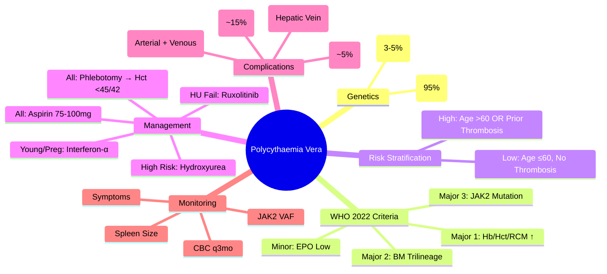

# Polycythaemia Vera (PV)

> [!info] **Davidson Ch 25 Alignment**: Haematological Malignancies → Myeloproliferative Neoplasms → Polycythaemia Vera
> **FCPS/MRCP Focus**: JAK2 V617F (95%), WHO 2022 criteria, phlebotomy target Hct <45%, hydroxyurea, aspirin, thrombosis risk stratification

---

## 🎯 Learning Objectives

- [ ] Define PV: **Clonal myeloproliferative neoplasm** with **erythrocytosis** (often pan-myeloproliferation: ↑WBC, ↑Plt)
- [ ] Apply **WHO 2022 Diagnostic Criteria**: Major (Hb/Hct, BM, JAK2) + Minor (EPO level)
- [ ] Identify **driver mutations**: **JAK2 V617F (95%)**, **JAK2 Exon 12 (3-5%)**
- [ ] Stratify **thrombosis risk**: Age >60, prior thrombosis → **High risk**; others → **Low risk**
- [ ] Manage **phlebotomy**: Target **Hct <45%** (men) / **<42%** (women); **Iron deficiency is therapeutic**
- [ ] Select **cytoreductive therapy**: **Hydroxyurea** (high-risk); **Ruxolitinib** (HU-intolerant/resistant); **Interferon-α** (young/pregnancy)
- [ ] Prescribe **Low-dose Aspirin** (all patients, unless contraindicated)
- [ ] Monitor for **transformation**: Post-PV MF, AML; **Leukocytosis = independent risk factor**

---

## 📖 Definition & WHO 2022 Criteria

| **Major Criteria** | **Minor Criterion** |
|---------------------|---------------------|
| 1. **Hb >165 g/L (men) / >160 g/L (women)** OR **Hct >49% (men) / >48% (women)** OR **Increased RCM** (>25% above mean) | **Serum EPO level <Normal** (subnormal) |
| 2. **BM biopsy**: Hypercellular, **trilineage proliferation** (erythroid, granulocytic, megakaryocytic) with pleomorphic megakaryocytes | |
| 3. **JAK2 V617F or JAK2 Exon 12 mutation** | |

**Diagnosis**: **All 3 Major** OR **Major 1 + 2 + Minor**

> [!tip] **FCPS/MRCP**: **PV = JAK2 V617F (95%) or Exon 12 (3-5%)**. **WHO 2022: Hb/Hct thresholds + BM trilineage + JAK2**. **EPO low = minor criterion**.

---

## ⚙️ Pathophysiology

```mermaid
flowchart TD
    A[JAK2 V617F / Exon 12 Mutation] --> B[Constitutive JAK-STAT Activation]
    B --> C[Hypersensitivity to EPO / EPO-Independent Growth]
    C --> D[Trilineage Myeloproliferation]
    D --> E1[Erythrocytosis → ↑ Blood Viscosity]
    D --> E2[Leukocytosis → ↑ Thrombosis Risk]
    D --> E3[Thrombocytosis → ↑ Thrombosis Risk]
    E1 & E2 & E3 --> F[Thrombosis (Arterial + Venous)]
    E1 --> G[Splenomegaly (extramedullary haematopoiesis)]
    E1 --> H[Symptoms: Headache, Pruritus (aquagenic), Erythromelalgia]
    F --> I[Major Arterial: MI, Stroke, TIA]
    F --> J[Major Venous: Budd-Chiari, Portal Vein, DVT/PE]
```

---

## 🔬 Diagnostic Workup

```mermaid
flowchart TD
    A[Erythrocytosis: Hb/Hct Elevated] --> B[Exclude Secondary Causes]
    B --> C{**JAK2 V617F / Exon 12 Mutation?}
    C -->|Yes| D[**Major Criteria 3 Met**]
    C -->|No| E[Consider Secondary / Rare JAK2-WT PV]
    D --> F[**Serum EPO Level**]
    F -->|Low/Normal| G[Minor Criterion Met]
    F -->|High| H[Secondary Polycythaemia]
    G --> I[**BM Biopsy** (if needed): Trilineage Proliferation]
    I --> J[**WHO Criteria Applied**]
    J --> K[Risk Stratification]
```

### Essential Investigations

| Test | PV Finding | Purpose |
|------|------------|---------|
| **JAK2 V617F** | **Positive (95%)** | Major criterion |
| **JAK2 Exon 12** | **Positive (3-5%)** if V617F negative | Major criterion |
| **Serum EPO** | **Subnormal / Low** | Minor criterion; excludes secondary |
| **BM Biopsy** | **Hypercellular, trilineage, pleomorphic megakaryocytes** | Major criterion |
| **CBC** | **Hb/Hct ↑, WBC ↑ (often), Plt ↑ (often)** | Pan-myeloproliferation |
| **Iron Studies** | **Ferritin low/normal** (iron consumed); transferrin saturation | Guide phlebotomy |
| **LFT/Renal/Uric Acid** | Uric acid often ↑ (cell turnover) | Baseline |

---

## 🩺 Clinical Features

| Feature | Details |
|---------|---------|
| **Constitutional** | Headache, dizziness, fatigue, pruritus (aquagenic - post-shower), erythromelalgia (burning extremities) |
| **Splenomegaly** | ~70% (extramedullary haematopoiesis) |
| **Thrombosis** | **Arterial (MI, stroke, TIA) + Venous (Budd-Chiari, portal vein, DVT/PE)** – leading cause of morbidity/mortality |
| **Haemorrhage** | Acquired von Willebrand syndrome (if Plt >1000-1500) |
| **Hyperviscosity** | Visual disturbances, Budd-Chiari, renal/hepatic impairment |
| **Uric Acid** | ↑ (cell turnover) → gout, renal stones |

---

## 💊 Management

### Risk Stratification

| Risk Group | Criteria | Annual Thrombosis Risk |
|------------|----------|------------------------|
| **Low Risk** | Age ≤60 AND **No prior thrombosis** | ~1-2% |
| **High Risk** | **Age >60** OR **Prior thrombosis** | ~4-5% |

> [!tip] **Leukocytosis (>15×10⁹/L) = independent risk factor** for thrombosis – consider cytoreduction

### Universal Measures (All Patients)

| Intervention | Target/Details |
|--------------|----------------|
| **Low-dose Aspirin** | **75-100 mg daily** (unless contraindicated: active bleed, Plt <50, acquired VWS) |
| **Phlebotomy** | **Hct <45% (men) / <42% (women)** – **Iron deficiency is therapeutic goal** |
| **Cardiovascular Risk Control** | HTN, lipids, diabetes, smoking cessation |

### Cytoreductive Therapy (High-Risk + Low-Risk with Indications)

| Indication for Cytoreduction | Preferred Agent |
|------------------------------|-----------------|
| **High-risk (Age >60 / Prior thrombosis)** | **Hydroxyurea (HU)** |
| **HU-intolerant / resistant** | **Ruxolitinib** (JAK1/2 inhibitor) |
| **Young patients (<40) / Pregnancy desire** | **Pegylated Interferon-α** |
| **Severe pruritus / constitutional symptoms** | **Ruxolitinib** / **Interferon-α** |
| **Thrombocytosis >1500 / acquired VWS** | **Anagrelide** (platelet-specific) + **Aspirin** |

### Hydroxyurea (HU) – **First-line Cytoreductive**

| Aspect | Details |
|--------|---------|
| **Starting Dose** | 15 mg/kg/day (round to 500mg increments) |
| **Target** | **Hct <45% without phlebotomy**, Plt <400, WBC <10 |
| **Monitoring** | **CBC q2-4wk** during titration; q3mo at stable dose |
| **Max Dose** | 2000-3000 mg/day |
| **Toxicities** | Cytopenias, macrocytosis, leg ulcers (rare), skin cancer risk (NMSC) |
| **Time to Response** | 4-12 weeks |

### Ruxolitinib (JAK1/2 Inhibitor) – **2nd Line (RESPONSE/RESPONSE-2 trials)**

| Aspect | Details |
|--------|---------|
| **Indication** | **HU-intolerant or resistant** (failure to control Hct/spleen/symptoms) |
| **Starting Dose** | 10 mg BD (adjust for Plt, renal) |
| **Monitoring** | **CBC q2wk × 4, then q4wk**; LFT, lipids |
| **Benefits** | **Spleen reduction**, **symptom control**, Hct control |
| **Risks** | **Infections** (HZV – need ACV prophylaxis), anaemia, thrombocytopenia |

### Pegylated Interferon-α (Peg-IFN-α)

| Aspect | Details |
|--------|---------|
| **Indication** | **Young patients**, **pregnancy desire**, **HU-intolerant**, **early PV** |
| **Dose** | 45-90 µg SC weekly (titrate) |
| **Benefits** | **Molecular remission (JAK2 VAF reduction)**; safe in pregnancy |
| **Toxicities** | Flu-like, depression, cytopenias, autoimmune, thyroid |

---

## ⚠️ Complications & Monitoring

| Complication | Management |
|--------------|------------|
| **Thrombosis** | **Aspirin + Cytoreduction + Anticoagulation** (if venous) |
| **Bleeding** | Acquired VWS (Plt >1000) → **Apheresis / Desmopressin / Avoid aspirin if active bleed** |
| **Post-PV Myelofibrosis** | ~10-15% at 15yr; BM fibrosis, splenomegaly, leukoerythroblastic film → **Ruxolitinib / HSCT** |
| **AML Transformation** | ~2-5% at 20yr; **HSCT if fit** |
| **Gout** | Allopurinol / Febuxostat |
| **Pruritus** | **Antihistamines**, **SSRIs**, **Ruxolitinib**, **PUVA**, **Interferon** |

---

## 🔄 Differential Diagnosis

| Condition | Distinguishing Features |
|-----------|------------------------|
| **Secondary Polycythaemia** | **EPO HIGH**; hypoxia (COPD, sleep apnoea), renal tumour, EPO doping |
| **Apparent Polycythaemia** | **Normal RCM**, low plasma volume (dehydration, obesity, diuretics) |
| **ET** | **Plt ↑↑**, Hb normal, JAK2/CALR/MPL; may have erythrocytosis if JAK2 |
| **PMF** | **Fibrosis**, leukoerythroblastic film, teardrops, splenomegaly, JAK2/CALR/MPL |
| **JAK2-WT PV** | Rare; **SH2B3/LNK, JAK2 exon 12-like, ERG** mutations; same criteria minus JAK2 |

---

## 💡 FCPS/MRCP High-Yield Summary

| Topic | Key Point |
|-------|-----------|
| **Driver Mutation** | **JAK2 V617F (95%)**, **JAK2 Exon 12 (3-5%)** |
| **WHO 2022 Criteria** | Hb/Hct ↑ + BM trilineage + JAK2 mutation (or EPO low) |
| **Risk Stratification** | **High: Age >60 OR Prior thrombosis**; **Low: Age ≤60, no thrombosis** |
| **Phlebotomy Target** | **Hct <45% (men) / <42% (women)**; Iron deficiency therapeutic |
| **Aspirin** | **75-100 mg daily** (all, unless contraindicated) |
| **Cytoreduction** | **High-risk = Hydroxyurea**; **HU-fail = Ruxolitinib**; **Young/preg = Interferon-α** |
| **Leukocytosis** | **>15 = independent thrombosis risk** → cytoreduction |
| **Pruritus** | Aquagenic; Ruxolitinib/Interferon/PUVA |
| **Transformation** | **Post-PV MF (~15%)**, **AML (~5%)** |
| **Budd-Chiari** | Hepatic vein thrombosis – classic venous site in PV |

---

## ❓ Viva Questions

1. **What are the WHO 2022 diagnostic criteria for Polycythaemia Vera?**
   - **Major 1**: Hb >165/160 or Hct >49/48% or ↑RCM; **Major 2**: BM trilineage proliferation; **Major 3**: JAK2 V617F/Exon12; **Minor**: Subnormal EPO. **Diagnosis = 3 Major OR 2 Major + Minor**

2. **What is the target haematocrit for phlebotomy in PV?**
   - **<45% (men)**, **<42% (women)** – based on CYTO-PV trial

3. **How do you risk-stratify PV patients?**
   - **High risk**: Age >60 **OR** prior thrombosis; **Low risk**: Age ≤60 AND no prior thrombosis

4. **What is the first-line cytoreductive therapy for high-risk PV?**
   - **Hydroxyurea** (15 mg/kg/day, target Hct <45% without phlebotomy, Plt <400, WBC <10)

5. **When do you use Ruxolitinib in PV?**
   - **Hydroxyurea-intolerant or resistant** (failure to control Hct/spleen/symptoms); also for pruritus

6. **Why is Interferon-α preferred in young patients/pregnancy?**
   - **Safe in pregnancy**, can induce **molecular remission (JAK2 VAF reduction)**, no teratogenicity

7. **What is the significance of leukocytosis in PV?**
   - **Leukocytosis >15×10⁹/L = independent risk factor for thrombosis** → indicates cytoreduction

8. **What are the classic thrombosis sites in PV?**
   - **Arterial: MI, Stroke, TIA**; **Venous: Budd-Chiari (hepatic vein), Portal vein, DVT/PE**

9. **How does PV transform and what are the rates?**
   - **Post-PV Myelofibrosis: ~10-15% at 15yr**; **AML: ~2-5% at 20yr**

10. **What is acquired von Willebrand syndrome in PV and how is it managed?**
    - **Plt >1000-1500** → adsorption of vWF on platelets → **bleeding**; **Platelet apheresis**, **Desmopressin**, hold aspirin

---

## 🧠 Confusions & Mnemonics

| Confusion | Clarification |
|-----------|---------------|
| **PV vs Secondary Polycythaemia** | **PV: JAK2+, EPO low**; **Secondary: EPO high (hypoxia/renal/ETP)** |
| **PV vs ET** | **PV = Erythrocytosis dominant (Hb/Hct ↑)**; **ET = Thrombocytosis dominant (Plt ↑↑)** |
| **PV vs PMF** | **PMF = Fibrosis + Leukoerythroblastic film + Teardrops**; PV = No fibrosis early |
| **HU vs Ruxolitinib** | **HU = 1st line**; **Ruxo = HU-intolerant/resistant, pruritus, spleen** |
| **Phlebotomy Target** | **Hct <45% (M) / <42% (F)** – iron deficiency is the goal |

| Mnemonic | Meaning |
|----------|---------|
| **"PV = JAK2 V617F = 95%"** | Driver mutation |
| **"Hct <45 M, <42 F"** | Phlebotomy target |
| **"High Risk = Age >60 or Prior Clot"** | Risk stratification |
| **"HU = 1st Line Cyto"** | Hydroxyurea first |
| **"Ruxo = Rescue (HU fail)"** | Ruxolitinib 2nd line |
| **"IFN = Young & Pregnant"** | Interferon-α indication |
| **"Leukocytosis >15 = Thrombosis Risk"** | Independent risk factor |

---

## 🗺️ Mind Map



---

## 📋 One-Page Revision Card

| **POLYCYTHAEMIA VERA – FCPS/MRCP REVISION CARD** |
|-----------------------------------------------------|
| **Driver**: **JAK2 V617F (95%)**, Exon 12 (3-5%) |
| **WHO 2022**: Hb/Hct↑ + BM Trilineage + JAK2 (+ EPO low) |
| **Risk**: **High = Age >60 OR Prior Thrombosis**; Low = Age ≤60, no clot |
| **Universal**: **Aspirin 75-100mg** + **Phlebotomy Hct <45% (M) / <42% (F)** |
| **Cytoreduction**: High-risk → **Hydroxyurea**; HU-fail → **Ruxolitinib**; Young/Preg → **Interferon-α** |
| **Leukocytosis >15** = Independent thrombosis risk |
| **Thrombosis**: Arterial (MI, Stroke) + Venous (Budd-Chiari, Portal, DVT) |
| **Transformation**: Post-PV MF (~15%), AML (~5%) |
| **Pruritus**: Aquagenic → Ruxolitinib/Interferon/PUVA |
| **Acquired VWS**: Plt >1000 → Bleeding → Apheresis/DDAVP |

---

## 📅 Spaced Repetition Tracker

| Review | Date | Score (1-5) | Next Review |
|--------|------|-------------|-------------|
| Day 1 | 2025-06-16 | | 2025-06-17 |
| Day 3 | | | |
| Day 7 | | | |
| Day 15 | | | |
| Day 30 | | | |

---

## 🎯 Must Know / Should Know / Nice to Know

| Level | Content |
|-------|---------|
| **Must Know** | JAK2 V617F/Exon12, WHO criteria, Hct targets, risk stratification, aspirin, phlebotomy, HU 1st line, ruxolitinib 2nd line, interferon young/preg, leukocytosis risk, thrombosis sites, transformation |
| **Should Know** | CYTO-PV trial evidence, HU dosing/titration/monitoring, ruxolitinib trials (RESPONSE), interferon molecular remission, acquired VWS management, gout prophylaxis, pruritus pathways (histamine independent), cardiovascular risk factor control |
| **Nice to Know** | JAK2 exon 12 specific features (erythroid predominance), JAK2-WT PV (SH2B3/LNK), ruxolitinib dose adjustments (renal, Plt), ropeginterferon approval, momelotinib (ACVR1), givinostat, PVSG vs WHO criteria evolution, thrombosis risk scores (IPSET-thrombosis) |

---

## ✅ Self-Test Scorecard

| Section | Score (0-10) | Notes |
|---------|--------------|-------|
| WHO Diagnostic Criteria | | |
| Risk Stratification | | |
| Phlebotomy & Aspirin | | |
| Cytoreductive Therapy Selection | | |
| Complications & Transformation | | |
| Viva Questions | | |

---

## 🔗 Local Navigation

- **Previous**: [[TTP/HUS]]
- **Next**: [[Renal Anaemia]]
- **Section Hub**: [[Anaemia and Red Cell Disorders]] / [[Haematological Malignancies]]
- **MOC**: [[Hematology MOC]]
- **Template**: [[../Templates/Hematology Topic Template]]

---

*Generated for FCPS/MRCP exam preparation. Based on Davidson Medicine 24th Ed Chapter 25.*
---

> Auto-generated study sections for "Hematology" — Ch 24: Haematology & Transfusion Medicine.

## Flashcards (42 generated)

- Q: What is the definition of Hematology?
  A: [!info] Davidson Ch 25 Alignment: Haematological Malignancies → Myeloproliferative Neoplasms → Polycythaemia Vera
- Q: What is Constitutional of Hematology?
  A: Headache, dizziness, fatigue, pruritus (aquagenic - post-shower), erythromelalgia (burning extremities)
- Q: What is Splenomegaly of Hematology?
  A: ~70% (extramedullary haematopoiesis)
- Q: What is Thrombosis of Hematology?
  A: Arterial (MI, stroke, TIA) + Venous (Budd-Chiari, portal vein, DVT/PE) – leading cause of morbidity/mortality
- Q: What is Haemorrhage of Hematology?
  A: Acquired von Willebrand syndrome (if Plt >1000-1500)
- Q: What is Hyperviscosity of Hematology?
  A: Visual disturbances, Budd-Chiari, renal/hepatic impairment
- Q: What is Uric Acid of Hematology?
  A: ↑ (cell turnover) → gout, renal stones
- Q: What is Hematology indicated for?
  A: HU-intolerant or resistant (failure to control Hct/spleen/symptoms)
- Q: What is the dose of Hematology?
  A: 10 mg BD (adjust for Plt, renal)
- Q: How is Hematology monitored?
  A: CBC q2wk × 4, then q4wk; LFT, lipids
- Q: What is Benefits of Hematology?
  A: Spleen reduction, symptom control, Hct control
- Q: What is Risks of Hematology?
  A: Infections (HZV – need ACV prophylaxis), anaemia, thrombocytopenia
- Q: What is Hematology indicated for?
  A: Young patients, pregnancy desire, HU-intolerant, early PV
- Q: What is the dose of Hematology?
  A: 45-90 µg SC weekly (titrate)
- Q: What is Benefits of Hematology?
  A: Molecular remission (JAK2 VAF reduction); safe in pregnancy
- Q: What is Toxicities of Hematology?
  A: Flu-like, depression, cytopenias, autoimmune, thyroid
- Q: What is Thrombosis of Hematology?
  A: Aspirin + Cytoreduction + Anticoagulation (if venous)
- Q: What is Bleeding of Hematology?
  A: Acquired VWS (Plt >1000) → Apheresis / Desmopressin / Avoid aspirin if active bleed
- Q: What is Post-PV Myelofibrosis of Hematology?
  A: ~10-15% at 15yr; BM fibrosis, splenomegaly, leukoerythroblastic film → Ruxolitinib / HSCT
- Q: What is AML Transformation of Hematology?
  A: ~2-5% at 20yr; HSCT if fit
- Q: What is Gout of Hematology?
  A: Allopurinol / Febuxostat
- Q: What is Pruritus of Hematology?
  A: Antihistamines, SSRIs, Ruxolitinib, PUVA, Interferon
- Q: What is Constitutional of Hematology?
  A: Headache, dizziness, fatigue, pruritus (aquagenic - post-shower), erythromelalgia (burning extremities)
- Q: What is Splenomegaly of Hematology?
  A: ~70% (extramedullary haematopoiesis)
- Q: What is Thrombosis of Hematology?
  A: Arterial (MI, stroke, TIA) + Venous (Budd-Chiari, portal vein, DVT/PE) – leading cause of morbidity/mortality
- Q: What is Haemorrhage of Hematology?
  A: Acquired von Willebrand syndrome (if Plt >1000-1500)
- Q: What is Hyperviscosity of Hematology?
  A: Visual disturbances, Budd-Chiari, renal/hepatic impairment
- Q: What is Uric Acid of Hematology?
  A: ↑ (cell turnover) → gout, renal stones
- Q: What is Hematology indicated for?
  A: HU-intolerant or resistant (failure to control Hct/spleen/symptoms)
- Q: What is the dose of Hematology?
  A: 10 mg BD (adjust for Plt, renal)
- Q: How is Hematology monitored?
  A: CBC q2wk × 4, then q4wk; LFT, lipids
- Q: What is Benefits of Hematology?
  A: Spleen reduction, symptom control, Hct control
- Q: What is Hematology indicated for?
  A: Young patients, pregnancy desire, HU-intolerant, early PV
- Q: What is the dose of Hematology?
  A: 45-90 µg SC weekly (titrate)
- Q: What is Benefits of Hematology?
  A: Molecular remission (JAK2 VAF reduction); safe in pregnancy
- Q: What is Toxicities of Hematology?
  A: Flu-like, depression, cytopenias, autoimmune, thyroid
- Q: What is Thrombosis of Hematology?
  A: Aspirin + Cytoreduction + Anticoagulation (if venous)
- Q: What is Bleeding of Hematology?
  A: Acquired VWS (Plt >1000) → Apheresis / Desmopressin / Avoid aspirin if active bleed
- Q: What is Post-PV Myelofibrosis of Hematology?
  A: ~10-15% at 15yr; BM fibrosis, splenomegaly, leukoerythroblastic film → Ruxolitinib / HSCT
- Q: What is AML Transformation of Hematology?
  A: ~2-5% at 20yr; HSCT if fit
- Q: What is Gout of Hematology?
  A: Allopurinol / Febuxostat
- Q: What is Pruritus of Hematology?
  A: Antihistamines, SSRIs, Ruxolitinib, PUVA, Interferon

## MCQs (1 generated)

1. **Which of the following best describes Hematology?**
   A. **[!info] Davidson Ch 25 Alignment: Haematological Malignancies → Myeloproliferative Neoplasms → Polycythaemia Vera**
   B. An unrelated condition not matching the clinical picture of Hematology
   C. A complication seen late in the disease course of Hematology
   D. A condition that mimics Hematology but has a different underlying cause

## SBA Questions (1 generated)

1. A patient with suspected Hematology presents with: Major Criteria — Minor Criterion; Diagnosis: All 3 Major OR Major 1 + 2 + Minor; [!tip] FCPS/MRCP: PV = JAK2 V617F (95%) or Exon 12 (3-5%). WHO 2022: Hb/Hct thresholds + BM trilineage + JAK2. EPO low = minor criterion.. What is the most likely diagnosis?
   A. **Hematology**
   B. A condition that mimics Hematology but is not the same entity
   C. A complication of Hematology rather than the primary diagnosis
   D. An unrelated condition in the same clinical category as Hematology

## PasTest Scenario SBAs (Clinical Vignettes)

> **Auto-generated PasTest/Mediscope-style scenario SBAs** grounded in the authored source. Each scenario tests a real clinical fact (triad, specific sign, contraindication, trial, first-line Rx) extracted from the topic. *Source: Ch 24: Haematology — Polycythaemia Vera*

**Q1.** What is the most appropriate first-line therapy for Polycythaemia Vera?

  - **A.** High Risk + Age >60 + Prior thrombosis
  - **B.** An advanced/surgical therapy reserved for refractory disease
  - **C.** Symptomatic treatment only, no disease-modifying therapy
  - **D.** Empiric broad-spectrum therapy without specific indication

  > **Answer: A** — High Risk + Age >60 + Prior thrombosis
  >
  > *Source:* **High Risk**   **Age >60** OR **Prior thrombosis**   ~4-5%  

> [!tip] **Leukocytosis (>15×10⁹/L) = independent risk factor** for thrombosis – consider cytoreduction

### Universal Measures (All Pati

