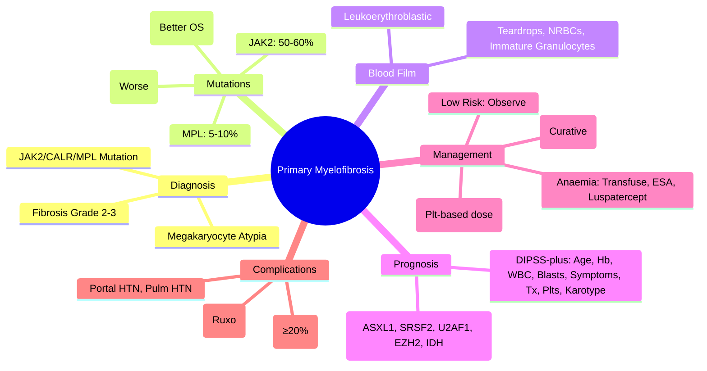

# Primary Myelofibrosis (PMF)

> [!info] **Davidson Ch 25 Alignment**: Haematological Malignancies → Myeloproliferative Neoplasms → Primary Myelofibrosis
> **FCPS/MRCP Focus**: JAK2/CALR/MPL, DIPSS-plus risk stratification, ruxolitinib, splenomegaly, leukoerythroblastic film, teardrops, allogeneic HSCT

---

## 🎯 Learning Objectives

- [ ] Define PMF: **Clonal MPN** with **bone marrow fibrosis**, **leukoerythroblastic blood film**, **extramedullary haematopoiesis** (splenomegaly)
- [ ] Apply **WHO 2022 Criteria**: Megakaryocyte atypia + fibrosis (grade 2-3) + JAK2/CALR/MPL + exclusion of PV/ET/CML/MDS
- [ ] Apply **DIPSS-plus** for prognostication: Age >65, Hb <10, WBC >25, Blasts ≥1%, Constitutional symptoms, RBC transfusion need, Platelets <100, Unfavourable karyotype
- [ ] Manage **symptomatic splenomegaly/constitutional symptoms**: **Ruxolitinib** (JAK1/2 inhibitor) – first-line
- [ ] Manage **anaemia**: Transfusions, ESA (cautious), Luspatercept (emerging), Danazol (historical)
- [ ] Identify **transplant candidates**: **Allogeneic HSCT** = only curative; DIPSS-plus Int-2/High → HSCT referral
- [ ] Monitor for **transformation**: **Blast phase (≥20% blasts)** → treat as AML

---

## 📖 Definition & WHO 2022 Criteria

| **Major Criteria** | |
|---------------------|---|
| 1. **Megakaryocyte proliferation + atypia** (hyperchromatic, bulbous nuclei) **WITHOUT** significant erythroid/granulocytic proliferation | |
| 2. **BM fibrosis grade 2-3** (reticulin/collagen) | |
| 3. **JAK2 V617F, CALR, or MPL mutation** (or other clonal marker) | |
| 4. **Exclusion** of PV, ET, CML, MDS, other myeloid neoplasms, reactive fibrosis | |

**Diagnosis**: **All 4 Major Criteria**

| **Prefibrotic/early PMF** | **Overt PMF** |
|---------------------------|---------------|
| **Fibrosis grade 0-1** | **Fibrosis grade 2-3** |
| Often thrombocytosis | Anaemia, leukoerythroblastic, teardrops |
| May mimic ET | Splenomegaly, constitutional symptoms |

> [!tip] **FCPS/MRCP**: **PMF = Megakaryocyte atypia + Fibrosis grade 2-3 + JAK2/CALR/MPL**. **DIPSS-plus = main prognostic tool**. **Ruxolitinib = symptomatic splenomegaly/symptoms**. **Allo-HSCT = curative for Int-2/High risk**.

---

## ⚙️ Pathophysiology

```mermaid
flowchart TD
    A[Driver Mutation: JAK2/CALR/MPL] --> B[Constitutive JAK-STAT Signaling]
    B --> C[Megakaryocyte Hyperplasia & Atypia]
    C --> D[Cytokine Release: TGF-β, PDGF, FGF, VEGF]
    D --> E[Fibroblast Activation → Collagen Deposition]
    E --> F[Bone Marrow Fibrosis]
    F --> G1[Ineffective Haematopoiesis → Anaemia, Thrombocytopenia]
    F --> G2[Extramedullary Haematopoiesis → Splenomegaly, Hepatomegaly]
    F --> G3[Leukoerythroblastic Film: Teardrops, NRBCs, Immature Granulocytes]
    G2 --> H[Portal Hypertension, Varices, Ascites]
    B --> I[Constitutional Symptoms: Cytokine-mediated (TNF-α, IL-6)]
```

---

## 🔬 Diagnostic Workup

```mermaid
flowchart TD
    A[Splenomegaly + Leukoerythroblastic Film + Anaemia] --> B[CBC + Film]
    B --> C{**Teardrops, NRBCs, Immature Granulocytes**}
    C --> D[**Driver Mutation Testing**]
    D --> E1[**JAK2 V617F (50-60%)**]
    D --> E2[**CALR Type 1/2 (25-30%)**]
    D --> E3[**MPL W515L/K (5-10%)**]
    D --> E4[**Triple-Negative (10-15%)**]
    E1 & E2 & E3 & E4 --> F[**BM Biopsy + Reticulin/Trichrome Stain**]
    F --> G{Fibrosis Grade 2-3 + Megakaryocyte Atypia?}
    G -->|Yes| H[**Overt PMF**]
    G -->|Grade 0-1| I[**Prefibrotic PMF**]
    H & I --> J[**DIPSS-plus Risk Stratification**]
    J --> K[**Imaging: US/CT for Spleen Volume**]
```

### Key Investigations

| Test | PMF Finding |
|------|-------------|
| **Blood Film** | **Leukoerythroblastic**: Teardrops, NRBCs, immature granulocytes, giant platelets |
| **CBC** | **Anaemia** (often), **Thrombocytopenia** or thrombocytosis, WBC variable |
| **JAK2 V617F** | **50-60%** |
| **CALR Type 1/2** | **25-30%** (better prognosis than JAK2) |
| **MPL W515L/K** | **5-10%** |
| **Triple-Negative** | **10-15%** (worse prognosis) |
| **BM Reticulin (Grade 0-3)** | **Grade 2-3 = overt PMF**; Grade 0-1 = prefibrotic |
| **Trichrome (Collagen)** | Confirms advanced fibrosis |
| **Cytogenetics** | **Unfavourable**: Complex, -5/del5q, -7/del7q, +8, 12p-, 11q23, inv3, i17q |

---

## 🩺 Clinical Features

| Feature | Details |
|---------|---------|
| **Splenomegaly** | **Massive** (often >20 cm), LUQ pain, early satiety, portal hypertension |
| **Constitutional Symptoms** | Night sweats, fever, weight loss, fatigue (cytokine-mediated) |
| **Anaemia** | Normocytic, often severe, transfusion-dependent |
| **Leukoerythroblastic Film** | **Teardrops (dacryocytes)**, NRBCs, myelocytes, metamyelocytes |
| **Bone Pain** | Marrow expansion |
| **Gout** | Hyperuricaemia (cell turnover) |
| **Bleeding/Thrombosis** | Platelet dysfunction, acquired VWS if Plt >1000 |

---

## 📊 DIPSS-plus Prognostic Scoring

| Variable | Points |
|----------|--------|
| **Age >65 years** | 1 |
| **Hb <10 g/dL** | 2 |
| **Leukocytosis >25×10⁹/L** | 1 |
| **Circulating Blasts ≥1%** | 1 |
| **Constitutional Symptoms** | 1 |
| **RBC Transfusion Need** | 1 |
| **Platelets <100×10⁹/L** | 1 |
| **Unfavourable Karyotype** | 1 |

| Score | Risk Group | Median Survival |
|-------|------------|-----------------|
| **0** | **Low** | Not reached |
| **1-2** | **Intermediate-1** | ~14 years |
| **3-4** | **Intermediate-2** | ~4 years |
| **5-6** | **High** | ~2 years |
| **≥7** | **Very High** | ~1.5 years |

> [!tip] **MIPSS70 / MIPSS70-plus** = mutation-enhanced (ASXL1, SRSF2, U2AF1, EZH2, IDH1/2 = HMR mutations = worse)

---

## 💊 Management

### Asymptomatic Low-Risk (DIPSS-plus Low)
- **Observation** ("Watch & Wait")
- Folic acid 5 mg daily
- Allopurinol if hyperuricaemia
- Regular monitoring (CBC q3-6mo, spleen size)

### Symptomatic / Intermediate-2 & High Risk

| Indication | First-Line | Alternative |
|------------|------------|-------------|
| **Symptomatic Splenomegaly** | **Ruxolitinib** | Splenectomy (if ruxolitinib fail) |
| **Constitutional Symptoms** | **Ruxolitinib** | |
| **Anaemia (Transfusion-dependent)** | **Transfusions ± ESA** | **Luspatercept** (emerging), Danazol (historical) |
| **Thrombocytopenia** | **Avoid JAKi if Plt <50** | Platelet transfusions, TPO-RA (romiplostim/eltrombopag) |

### Ruxolitinib (JAK1/2 Inhibitor) – **Standard for Symptoms/Spleen**

| Aspect | Details |
|--------|---------|
| **Indication** | **Symptomatic splenomegaly**, **Constitutional symptoms** (Int-2/High risk) |
| **Starting Dose** | **Plt-based**: >200 = 20mg BD; 100-200 = 15mg BD; 50-100 = 10mg BD; 25-50 = 5mg BD |
| **Monitoring** | **CBC q2wk × 4, then q4wk**; LFT, lipids, HCV/HBV/HIV screen |
| **Response** | **Spleen volume reduction ≥35%** (CT), **Symptom improvement** (MFSAF v4.0) |
| **Dose Adjustment** | Reduce for thrombocytopenia/anaemia; **Avoid if Plt <25** |
| **Discontinuation** | **Gradual taper** (withdrawal syndrome: rebound symptoms, cytokine storm) |

### Allogeneic HSCT – **Only Curative Option**

| Indication | Timing |
|------------|--------|
| **DIPSS-plus Int-2 / High / Very High** | **Referral at diagnosis** (donor search ASAP) |
| **Age <65-70**, fit, HLA-matched donor | **RIC/MAC conditioning** (Flu/Mel ± TBI) |
| **Molecular remission** | Pre-HSCT ruxolitinib bridge OK; **JAK2 VAF monitoring** post-HSCT |

### Anaemia Management
| Option | Details |
|--------|---------|
| **Transfusions** | Mainstay; leucodepleted, irradiated |
| **ESA (Epoetin/Darbepoetin)** | Cautious (thrombosis risk); often poor response |
| **Luspatercept** | Emerging (MEDALIST-MF trial); improves Hb in some |
| **Danazol** | Historical (androgen); hepatotoxicity, virilisation |
| **Thalidomide/Lenalidomide** | With prednisolone; neuropathy risk |

---

## ⚠️ Complications

| Complication | Management |
|--------------|------------|
| **Portal Hypertension** | Variceal screening (endoscopy), beta-blockers, TIPS if refractory |
| **Pulmonary Hypertension** | Echo screening; treat underlying |
| **Blast Transformation (≥20% blasts)** | **Treat as AML** (poor prognosis); HSCT if remission |
| **Infections** | Vaccinate; neutropenia from ruxolitinib → ACV prophylaxis |
| **Thrombosis** | Aspirin if Plt >50; anticoagulate if arterial/venous event |

---

## 🔄 Differential Diagnosis

| Condition | Distinguishing Features |
|-----------|------------------------|
| **Post-PV/ET MF** | **Prior PV/ET diagnosis**; same fibrosis/mutations; DIPSS applies |
| **Secondary Fibrosis** | MDS, AML, metastates, TB, autoimmune, hairy cell leukaemia – **no driver mutation** |
| **Prefibrotic PMF** | **Fibrosis grade 0-1**; often thrombocytosis; mimics ET |
| **ET** | **No fibrosis**, no teardrops, no leukoerythroblastosis |
| **PV** | **Erythrocytosis dominant**, JAK2, trilineage BM |

---

## 💡 FCPS/MRCP High-Yield Summary

| Topic | Key Point |
|-------|-----------|
| **Diagnosis** | **Megakaryocyte atypia + Fibrosis grade 2-3 + JAK2/CALR/MPL** |
| **Driver Mutations** | **JAK2 (50-60%)**, **CALR (25-30%, better OS)**, **MPL (5-10%)**, **Triple-neg (10-15%, worse)** |
| **Blood Film** | **Leukoerythroblastic**: Teardrops, NRBCs, immature granulocytes |
| **DIPSS-plus** | Age>65, Hb<10, WBC>25, Blasts≥1%, Symptoms, Transfusion need, Plt<100, Unfavourable karyotype |
| **Ruxolitinib** | **First-line for spleen/symptoms**; Plt-based dosing; **taper on discontinuation** |
| **Allo-HSCT** | **Curative**; **Int-2/High risk → refer early**; RIC conditioning |
| **Transformation** | **Blasts ≥20% = Blast phase** → AML-type therapy |
| **CALR vs JAK2** | **CALR = better OS, lower thrombosis** |
| **MIPSS70** | Mutation-enhanced (ASXL1, SRSF2, U2AF1, EZH2, IDH1/2 = HMR = worse) |

---

## ❓ Viva Questions

1. **What are the WHO 2022 criteria for Primary Myelofibrosis?**
   - Megakaryocyte atypia + **Fibrosis grade 2-3** + **JAK2/CALR/MPL mutation** + exclusion of other causes

2. **Describe the characteristic blood film in PMF.**
   - **Leukoerythroblastic**: **Teardrops (dacryocytes)**, NRBCs, immature granulocytes (myelocytes, metamyelocytes)

3. **What is DIPSS-plus and what variables does it include?**
   - **Prognostic score**: Age>65, Hb<10, WBC>25, Blasts≥1%, Constitutional symptoms, Transfusion need, Plt<100, Unfavourable karyotype

4. **What is the first-line treatment for symptomatic splenomegaly in PMF?**
   - **Ruxolitinib** (JAK1/2 inhibitor); Plt-based dosing; spleen volume reduction ≥35%

5. **When should allogeneic HSCT be considered in PMF?**
   - **DIPSS-plus Intermediate-2 / High / Very High risk** → refer early for donor search

6. **How does CALR mutation prognosis differ from JAK2 in PMF?**
   - **CALR = better overall survival, lower thrombosis risk**; **JAK2 = higher risk**

7. **What is the Ruxolitinib starting dose based on platelet count?**
   - >200: 20mg BD; 100-200: 15mg BD; 50-100: 10mg BD; 25-50: 5mg BD

8. **What happens on abrupt Ruxolitinib discontinuation?**
   - **Withdrawal syndrome**: Rebound splenomegaly, cytokine storm, constitutional symptoms → **taper gradually**

9. **What is blast transformation in PMF and how is it managed?**
   - **Blasts ≥20%** in PB/BM → **Treat as AML** (poor prognosis); HSCT if remission achieved

10. **What are the high molecular risk (HMR) mutations in PMF?**
    - **ASXL1, SRSF2, U2AF1, EZH2, IDH1/2** – incorporated in MIPSS70-plus for refined prognosis

---

## 🧠 Confusions & Mnemonics

| Confusion | Clarification |
|-----------|---------------|
| **PMF vs Post-PV/ET MF** | **Post-PV/ET = Prior PV/ET diagnosis**; same treatment/prognosis |
| **PMF vs Prefibrotic PMF** | **Prefibrotic = Fibrosis grade 0-1**; often thrombocytosis; mimics ET |
| **PMF vs MDS with Fibrosis** | **PMF = Driver mutation (JAK2/CALR/MPL) + megakaryocyte atypia**; MDS = dysplasia, cytogenetics |
| **Ruxolitinib Dose** | **Plt-based** – critical for thrombocytopenia management |
| **Ruxolitinib Withdrawal** | **Must taper** – rebound syndrome (cytokine storm) |

| Mnemonic | Meaning |
|----------|---------|
| **"PMF = Teardrops + Fibrosis + JAK2/CALR/MPL"** | Diagnosis |
| **"DIPSS-plus = A-H-W-B-C-T-P-K"** | Age, Hb, WBC, Blasts, Constitutional, Transfusion, Plts, Karyotype |
| **"Ruxo = Spleen/Symptoms 1st Line"** | Indication |
| **"CALR = Better OS"** | Mutation prognosis |
| **"Int-2/High = HSCT Referral"** | Transplant timing |
| **"HMR = ASXL1, SRSF2, U2AF1, EZH2, IDH"** | High molecular risk mutations |

---

## 🗺️ Mind Map



---

## 📋 One-Page Revision Card

| **PRIMARY MYELOFIBROSIS – FCPS/MRCP REVISION CARD** |
|------------------------------------------------------|
| **Diagnosis**: **Megakaryocyte atypia + Fibrosis Grade 2-3 + JAK2/CALR/MPL** |
| **Film**: **Leukoerythroblastic** – **Teardrops, NRBCs, Immature Granulocytes** |
| **Mutations**: **JAK2 50-60%**, **CALR 25-30% (Better OS)**, **MPL 5-10%**, **Triple-neg 10-15%** |
| **DIPSS-plus**: Age>65, Hb<10, WBC>25, Blasts≥1%, Symptoms, Tx Need, Plt<100, Unfav Karotype |
| **Ruxolitinib**: **1st line spleen/symptoms**; **Plt-based dose**; **Taper on stop** |
| **HSCT**: **Curative**; **Int-2/High → Refer early**; RIC conditioning |
| **Blast Phase**: **≥20% blasts** → Treat as AML |
| **CALR vs JAK2**: CALR = Better OS, Lower Thrombosis |
| **HMR Mutations**: ASXL1, SRSF2, U2AF1, EZH2, IDH1/2 → Worse Prognosis |

---

## 📅 Spaced Repetition Tracker

| Review | Date | Score (1-5) | Next Review |
|--------|------|-------------|-------------|
| Day 1 | 2025-06-16 | | 2025-06-17 |
| Day 3 | | | |
| Day 7 | | | |
| Day 15 | | | |
| Day 30 | | | |

---

## 🎯 Must Know / Should Know / Nice to Know

| Level | Content |
|-------|---------|
| **Must Know** | WHO criteria, blood film (teardrops, leukoerythroblastic), mutations (JAK2/CALR/MPL), DIPSS-plus scoring, ruxolitinib indication/dosing/tapering, HSCT for Int-2/High, blast transformation, CALR vs JAK2 prognosis |
| **Should Know** | Prefibrotic PMF distinction, MIPSS70/HMR mutations, post-PV/ET MF management, anaemia management (luspatercept, danazol), portal hypertension management, ruxolitinib trials (COMFORT-I/II), withdrawal syndrome, RIC vs MAC conditioning |
| **Nice to Know** | Detailed cytokine biology (TGF-β, PDGF), fedratinib (JAK2 inhibitor) for ruxolitinib failure, momelotinib (ACVR1 inhibitor) for anaemia, pacritinib (for Plt <50), navitoclax combinations, HSCT outcomes by DIPSS, molecular monitoring post-HSCT, germline predisposition |

---

## ✅ Self-Test Scorecard

| Section | Score (0-10) | Notes |
|---------|--------------|-------|
| WHO Criteria & Diagnosis | | |
| DIPSS-plus Prognostication | | |
| Ruxolitinib Management | | |
| Allogeneic HSCT Indications | | |
| Blast Transformation | | |
| Viva Questions | | |

---

## 🔗 Local Navigation

- **Previous**: [[Essential Thrombocythaemia]]
- **Next**: [[MDS Classification & Management]]
- **Section Hub**: [[Haematological Malignancies]]
- **MOC**: [[Hematology MOC]]
- **Template**: [[../Templates/Hematology Topic Template]]

---

*Generated for FCPS/MRCP exam preparation. Based on Davidson Medicine 24th Ed Chapter 25.*