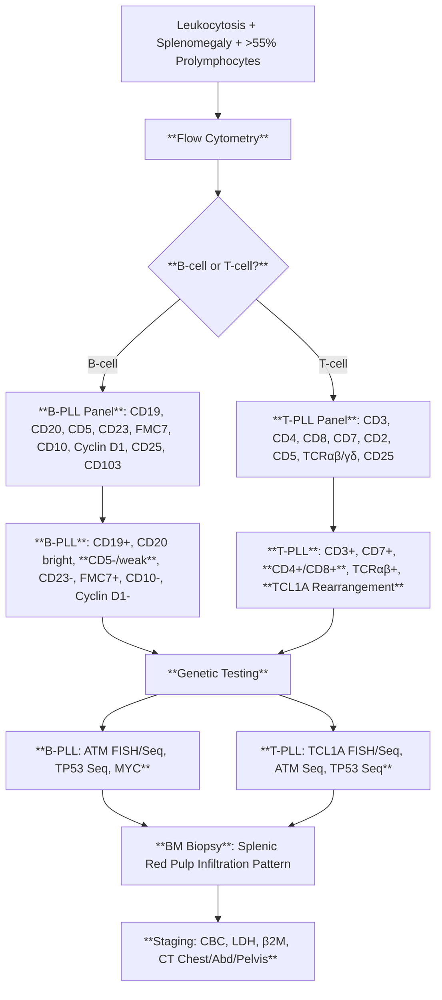
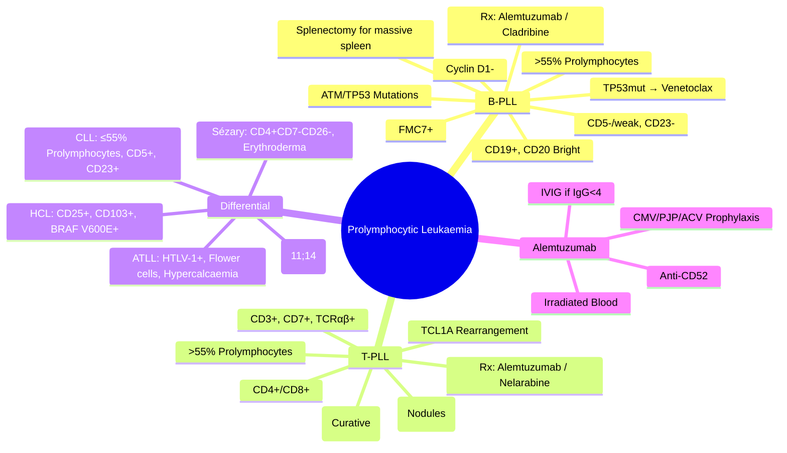

# Prolymphocytic Leukaemia (PLL)

> [!info] **Davidson Ch 25 Alignment**: Haematological Malignancies → Prolymphocytic Leukaemia
> **FCPS/MRCP Focus**: >55% prolymphocytes, B-PLL vs T-PLL, ATM/TP53 mutations, aggressive course, alemtuzumab, cladribine, splenectomy, distinction from CLL/PLL

---

## 🎯 Learning Objectives

- [ ] Define PLL: **Mature lymphoid leukaemia** with **>55% prolymphocytes** in peripheral blood
- [ ] Distinguish **B-PLL** (CD19+, CD20 bright, CD5-/weak, CD23-, FMC7+) from **T-PLL** (CD3+, CD4+/CD8+, CD7+, CD2-, TCRαβ+)
- [ ] Recognise **Genetics**: **B-PLL = ATM deletion/mutation (70-80%), TP53 mutation**; **T-PLL = TCL1A rearrangement, ATM/TP53**
- [ ] Identify **Clinical**: Aggressive, **Massive splenomegaly**, Lymphadenopathy (T-PLL > B-PLL), Skin involvement (T-PLL), High LDH
- [ ] Apply **Treatment**: **Alemtuzumab** (anti-CD52) historically standard; **Cladribine**, **Splenectomy** (B-PLL); **Venetoclax** (TP53-mut B-PLL); **Nelarabine** (T-PLL)
- [ ] Differentiate from **CLL** (≤55% prolymphocytes), **MCL** (Cyclin D1+, t(11;14)), **HCL** (CD25+, CD103+, BRAF V600E)

---

## 📖 Definition & Classification

| Feature | **B-PLL** | **T-PLL** |
|---------|-----------|-----------|
| **Lineage** | **B-cell** | **T-cell** |
| **Prolymphocytes** | **>55%** of lymphocytes | **>55%** of lymphocytes |
| **Immunophenotype** | **CD19+, CD20 bright, CD5-/weak, CD23-, FMC7+, CD10-, Cyclin D1-** | **CD3+, CD7+, CD4+/CD8+ (or CD4-CD8-), TCRαβ+** |
| **Genetics** | **ATM del/mut (70-80%)**, TP53 mut, MYC | **TCL1A rearrangement (14q32)**, ATM mut, TP53 mut |
| **Splenomegaly** | **Massive** | Massive |
| **Lymphadenopathy** | Uncommon | **Common** |
| **Skin Involvement** | Rare | **Common** (nodules, erythroderma) |
| **Serum Markers** | LDH ↑, β2M ↑ | LDH ↑↑, β2M ↑↑ |

> [!tip] **FCPS/MRCP**: **PLL = >55% Prolymphocytes**. **B-PLL = CD19+/CD20 bright/CD5-/CD23-/FMC7+**, **ATM/TP53 mut**. **T-PLL = CD3+/CD7+/TCRαβ+**, **TCL1A rearrangement**, skin involvement. **Aggressive**; **Alemtuzumab/Cladribine/Splenectomy**.

---

## ⚙️ Pathophysiology

```mermaid
flowchart TD
    A[Genetic Alterations] --> B[B-cell or T-cell Progenitor]
    B --> C1[B-PLL: ATM/TP53 Loss → Genomic Instability]
    B --> C2[T-PLL: TCL1A Overexpression → AKT Activation]
    C1 & C2 --> D[Prolymphocyte Accumulation]
    D --> E1[Peripheral Blood: >55% Prolymphocytes]
    D --> E2[Massive Splenomegaly (Red Pulp Infiltration)]
    D --> E3[Lymphadenopathy (T-PLL > B-PLL)]
    D --> E3b[Skin Infiltration (T-PLL)]
    D --> F[Aggressive Course: High LDH, Rapid Progression]
```

---

## 🔬 Diagnostic Workup



### Key Investigations

| Test | B-PLL | T-PLL |
|------|-------|-------|
| **Prolymphocytes** | **>55%** | **>55%** |
| **Flow: CD20** | **Bright** | Negative |
| **Flow: CD5** | **Negative/Weak** | Positive (pan-T) |
| **Flow: CD23** | **Negative** | Variable |
| **Flow: FMC7** | **Positive** | Negative |
| **Flow: Cyclin D1** | **Negative** | Negative |
| **Flow: CD25** | Negative | **Often Positive** |
| **Flow: TCR** | Negative | **αβ+** |
| **Genetics** | **ATM del/mut, TP53 mut** | **TCL1A rearrangement (14q32), ATM/TP53** |
| **Splenomegaly** | **Massive** | Massive |
| **Lymphadenopathy** | Uncommon | **Common** |
| **Skin Involvement** | Rare | **Common (nodules, erythroderma)** |

---

## 🩺 Clinical Features

| Feature | B-PLL | T-PLL |
|---------|-------|-------|
| **Age** | Older adults (median 65-70) | Adults (median 60-65) |
| **Sex** | Male > Female | Male > Female |
| **Presentation** | Splenomegaly, Pancytopenia | Splenomegaly, Lymphadenopathy, Skin, High WBC |
| **Skin** | Rare | **Nodules, Erythroderma, Leukaemia cutis** |
| **Lymph Nodes** | Minimal | **Generalised** |
| **Serum** | LDH ↑, β2M ↑ | **LDH ↑↑, β2M ↑↑** |

---

## 💊 Management

### B-PLL

| Line | Treatment | Details |
|------|-----------|---------|
| **1st Line** | **Alemtuzumab** (anti-CD52) | **30 mg IV 3x/week × 12 weeks** (escalate 3/10/30mg); **CMV monitoring**, PJP/ACV prophylaxis |
| **Alternative 1st** | **Cladribine** (2-CdA) | 0.14 mg/kg/day × 5d (similar to HCL); **CR ~60-70%** |
| **TP53-mutated** | **Venetoclax** (± Rituximab) | **BCL-2 inhibition**; Effective in TP53-mut |
| **Splenectomy** | **Massive Splenomegaly** | **Curative in some**; **Pre-op vaccines**; **Post-op penicillin** |
| **Relapsed** | **Venetoclax**, **Ibrutinib**, **CAR-T**, **Clinical trials** | |

### T-PLL

| Line | Treatment | Details |
|------|-----------|---------|
| **1st Line** | **Alemtuzumab** | **Same as B-PLL**; **High response but short duration** |
| **Nelarabine** | **T-cell specific** | **1500 mg/m² d1,3,5 q21d**; **Neurotoxicity (cerebellar)** |
| **Cladribine** | Alternative | Similar to B-PLL |
| **Allo-HSCT** | **Young/Fit, CR1** | **Only potentially curative** |

> [!warning] **Alemtuzumab = Profound Immunosuppression** → **CMV PCR monitoring weekly**, **PJP/ACV prophylaxis**, **Irradiated Blood Products**, **IVIG if IgG <4 + infections**

---

## 🔄 Differential Diagnosis

| Condition | Distinguishing Features |
|-----------|------------------------|
| **CLL with Prolymphocytes** | **Prolymphocytes ≤55%**, CD5+, CD23+, CD20 dim, sIg dim |
| **B-PLL vs MCL** | **MCL: Cyclin D1+, t(11;14), SOX11+**; **B-PLL: Cyclin D1-, No t(11;14)** |
| **B-PLL vs HCL** | **HCL: CD25+, CD103+, CD123+, BRAF V600E+, TRAP+**; **B-PLL: CD25-, CD103-, BRAF WT** |
| **T-PLL vs Sézary Syndrome** | **Sézary: CD4+CD7-CD26-, Skin erythroderma, Blood cerebriform lymphocytes**; **T-PLL: CD7+, Skin nodules** |
| **T-PLL vs ATLL** | **ATLL: HTLV-1+, CD4+CD25+, Flower cells, Hypercalcaemia, Lytic lesions** |
| **Prolymphocytoid CLL** | **CLL with >15% but <55% Prolymphocytes**, Same immunophenotype as CLL |

---

## 💡 FCPS/MRCP High-Yield Summary

| Topic | Key Point |
|-------|-----------|
| **Definition** | **>55% Prolymphocytes** in peripheral blood |
| **B-PLL** | **CD19+, CD20 bright, CD5-/weak, CD23-, FMC7+, Cyclin D1-**, **ATM/TP53 mut** |
| **T-PLL** | **CD3+, CD7+, TCRαβ+, CD4+/CD8+**, **TCL1A rearrangement**, **Skin involvement** |
| **Genetics** | **B-PLL: ATM/TP53**; **T-PLL: TCL1A, ATM, TP53** |
| **Treatment** | **Alemtuzumab** (anti-CD52) – **1st line both** |
| **TP53-mut B-PLL** | **Venetoclax** effective |
| **T-PLL Specific** | **Nelarabine** (T-cell), **Skin involvement common** |
| **Splenectomy** | **Massive splenomegaly in B-PLL** (curative potential) |
| **Alemtuzumab Monitoring** | **CMV weekly, PJP/ACV prophylaxis, Irradiated blood, IVIG if IgG<4** |
| **Prognosis** | **Aggressive**; Median OS **B-PLL ~3-5yr, T-PLL ~1-2yr** |

---

## ❓ Viva Questions

1. **What is the diagnostic threshold for prolymphocytes in Prolymphocytic Leukaemia?**
   - **>55% prolymphocytes** in peripheral blood

2. **How do you differentiate B-PLL from CLL?**
   - **B-PLL: >55% prolymphocytes, CD5-/weak, CD23-, FMC7+, CD20 bright**; **CLL: ≤55% prolymphocytes, CD5+, CD23+, CD20 dim, sIg dim**

3. **What are the characteristic genetic abnormalities in B-PLL?**
   - **ATM deletion/mutation (70-80%)**, **TP53 mutation**, **MYC abnormalities**

4. **What is the hallmark genetic abnormality in T-PLL?**
   - **TCL1A rearrangement (14q32)** leading to AKT pathway activation

5. **What is the first-line treatment for PLL?**
   - **Alemtuzumab** (anti-CD52) – 30mg IV 3x/week × 12 weeks with CMV monitoring

6. **How does alemtuzumab differ in B-PLL vs T-PLL?**
   - **Similar regimen**; **T-PLL has shorter remission duration**; **Nelarabine added for T-PLL**

7. **What is the role of splenectomy in PLL?**
   - **Massive splenomegaly in B-PLL** – can be curative; **Less effective in T-PLL**

7. **How does TP53 mutation affect B-PLL treatment?**
   - **Venetoclax (± Rituximab)** effective in TP53-mutated B-PLL (BCL-2 inhibition)

8. **What are the key monitoring requirements during alemtuzumab therapy?**
   - **Weekly CMV PCR**, **PJP prophylaxis (Co-trimoxazole)**, **ACV prophylaxis**, **Irradiated blood products**, **IVIG if IgG<4 + infections**

9. **Differentiate T-PLL from Sézary Syndrome.**
   - **T-PLL: CD7+, Skin nodules, TCL1A+**; **Sézary: CD4+CD7-CD26-, Erythroderma, Cerebriform cells**

10. **What is Nelarabine and when is it used in PLL?**
    - **Nucleoside analogue (T-cell specific)**; **Used in T-PLL**; **Neurotoxicity (cerebellar)**

---

## 🧠 Confusions & Mnemonics

| Confusion | Clarification |
|-----------|---------------|
| **B-PLL vs CLL** | **PLL = >55% Prolymphocytes, CD5-/weak, CD23-, FMC7+**; **CLL = ≤55%, CD5+, CD23+, CD20 dim** |
| **B-PLL vs MCL** | **MCL = Cyclin D1+, t(11;14)**; **B-PLL = Cyclin D1-, No t(11;14)** |
| **B-PLL vs HCL** | **HCL = CD25+, CD103+, BRAF V600E+, TRAP+**; **B-PLL = CD25-, CD103-, BRAF WT** |
| **T-PLL vs Sézary** | **Sézary = CD4+CD7-CD26-, Erythroderma, HTLV-1-**; **T-PLL = CD7+, TCL1A+, Nodules** |
| **Alemtuzumab** | **Anti-CD52, Pan-lymphocyte depletion, CMV/PJP prophylaxis mandatory** |

| Mnemonic | Meaning |
|----------|---------|
| **"PLL = >55% Prolymphocytes"** | Diagnostic threshold |
| **"B-PLL = CD20 Bright, CD5 Weak, ATM/TP53"** | B-PLL features |
| **"T-PLL = TCL1A, CD7+, Skin Nodules"** | T-PLL features |
| **"Alemtuzumab = Anti-CD52 = CMV Prophylaxis"** | Treatment & monitoring |
| **"Nelarabine = T-cell Specific = Neurotoxicity"** | T-PLL specific |
| **"Splenectomy = B-PLL Massive Spleen"** | Surgery indication |

---

## 🗺️ Mind Map



---

## 📋 One-Page Revision Card

| **PROLYMPHOCYTIC LEUKAEMIA – FCPS/MRCP REVISION CARD** |
|----------------------------------------------------------|
| **Definition**: **>55% Prolymphocytes** in PB |
| **B-PLL**: **CD19+, CD20 Bright, CD5-/weak, CD23-, FMC7+, Cyclin D1-** |
| **B-PLL Genetics**: **ATM del/mut (70-80%), TP53 mut** |
| **T-PLL**: **CD3+, CD7+, TCRαβ+, TCL1A Rearrangement, Skin Nodules** |
| **Treatment**: **Alemtuzumab** (Anti-CD52) 1st line both |
| **TP53-mut B-PLL**: **Venetoclax** effective |
| **T-PLL Specific**: **Nelarabine** (T-cell, neurotoxicity) |
| **Splenectomy**: **Massive Splenomegaly B-PLL** (curative potential) |
| **Alemtuzumab**: **CMV weekly, PJP/ACV, Irradiated Blood, IVIG if IgG<4** |
| **Prognosis**: Aggressive, B-PLL ~3-5yr, T-PLL ~1-2yr |

---

## 📅 Spaced Repetition Tracker

| Review | Date | Score (1-5) | Next Review |
|--------|------|-------------|-------------|
| Day 1 | 2025-06-16 | | 2025-06-17 |
| Day 3 | | | |
| Day 7 | | | |
| Day 15 | | | |
| Day 30 | | | |

---

## 🎯 Must Know / Should Know / Nice to Know

| Level | Content |
|-------|---------|
| **Must Know** | >55% prolymphocytes threshold, B-PLL vs T-PLL immunophenotype, ATM/TP53 in B-PLL, TCL1A in T-PLL, alemtuzumab 1st line, TP53-mut B-PLL → venetoclax, T-PLL nelarabine, skin involvement T-PLL, alemtuzumab monitoring (CMV/PJP), splenectomy for B-PLL massive spleen |
| **Should Know** | Alemtuzumab dosing/escalation, CMV prophylaxis duration, nelarabine dosing/neurotoxicity, cladribine alternative, prolymphocytoid CLL distinction, TP53 complexity in B-PLL, Allo-HSCT for T-PLL in CR1, T-PLL vs ATLL (HTLV-1), splenectomy technique, alemtuzumab IRR management |
| **Nice to Know** | TCRA/TCRD rearrangement in T-PLL, JVM (juxtaposed with ATM) in B-PLL, MYC abnormalities in PLL, alemtuzumab pharmacokinetics, subcutaneous alemtuzumab, alemtuzumab in refractory PLL, CAR-T in PLL, pirtobrutinib in B-PLL, minimal residual disease monitoring, quality of life, paediatric PLL |

---

## ✅ Self-Test Scorecard

| Section | Score (0-10) | Notes |
|---------|--------------|-------|
| Diagnostic Criteria (Prolymphocytes >55%) | | |
| B-PLL vs T-PLL Immunophenotype | | |
| Genetic Abnormalities (ATM/TP53/TCL1A) | | |
| Alemtuzumab Therapy & Monitoring | | |
| Relapsed/Specific Therapies | | |
| Differential Diagnosis | | |
| Viva Questions | | |

---

## 🔗 Local Navigation

- **Previous**: [[Hairy Cell Leukaemia]]
- **Next**: [[Red Cell Transfusion]]
- **Section Hub**: [[Haematological Malignancies]] / [[Transfusion Medicine]]
- **MOC**: [[Hematology MOC]]
- **Template**: [[../Templates/Hematology Topic Template]]

---

*Generated for FCPS/MRCP exam preparation. Based on Davidson Medicine 24th Ed Chapter 25.*
---

> Auto-generated study sections for "Hematology" — Ch 24: Haematology & Transfusion Medicine.

## Flashcards (1 generated)

- Q: What is the definition of Hematology?
  A: [!info] Davidson Ch 25 Alignment: Haematological Malignancies → Prolymphocytic Leukaemia

## MCQs (1 generated)

1. **Which of the following best describes Hematology?**
   A. **[!info] Davidson Ch 25 Alignment: Haematological Malignancies → Prolymphocytic Leukaemia**
   B. An unrelated condition not matching the clinical picture of Hematology
   C. A complication seen late in the disease course of Hematology
   D. A condition that mimics Hematology but has a different underlying cause

## SBA Questions (1 generated)

1. A patient with suspected Hematology presents with: Prolymphocytes — >55% of lymphocytes; Immunophenotype — CD19+, CD20 bright, CD5-/weak, CD23-, FMC7+, CD10-, Cyclin D1-; Genetics — ATM del/mut (70-80%), TP53 mut, MYC. What is the most likely diagnosis?
   A. **Hematology**
   B. A condition that mimics Hematology but is not the same entity
   C. A complication of Hematology rather than the primary diagnosis
   D. An unrelated condition in the same clinical category as Hematology

