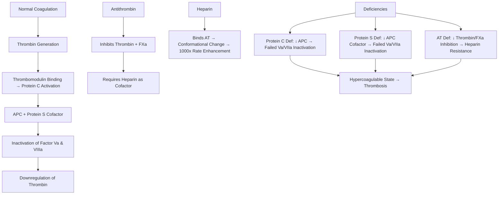

# Protein C, Protein S & Antithrombin Deficiency

> [!info] **Davidson Ch 25 Alignment**: Bleeding and Thrombotic Disorders → Thrombophilia → Inherited Deficiencies
> **FCPS/MRCP Focus**: Inherited thrombophilias, warfarin-induced skin necrosis, heparin resistance, protein C/S/AT concentrate, pregnancy management

---

## 🎯 Learning Objectives

- [ ] Define **Protein C Deficiency**: Autosomal dominant, impaired APC → failed Factor Va/VIIa inactivation
- [ ] Define **Protein S Deficiency**: Autosomal dominant, impaired APC cofactor function (free vs total)
- [ ] Define **Antithrombin Deficiency**: Autosomal dominant, impaired thrombin/FXa inhibition → heparin resistance
- [ ] Apply **Testing Principles**: Functional assays first, genetic confirmation, avoid acute phase/warfarin
- [ ] Manage **VTE Treatment**: DOACs (except AT def), Warfarin (AT def), Duration indefinite for unprovoked
- [ ] Avoid **Warfarin-Induced Skin Necrosis** in Protein C/S/AT deficiency: Heparin overlap mandatory
- [ ] Apply **Pregnancy Management**: LMWH prophylaxis, Avoid warfarin, AT concentrate if AT def

---

## 📖 Overview & Classification

| Deficiency | Gene | Mechanism | Inheritance | Prevalence (General) | Prevalence (VTE) |
|------------|------|-----------|-------------|---------------------|------------------|
| **Protein C** | **PROC** | ↓ APC generation → Failed Factor Va/VIIa inactivation | AD | 0.2-0.5% | 2-5% |
| **Protein S** | **PROS1** | ↓ APC cofactor → Failed Factor Va/VIIa inactivation | AD | 0.2-0.5% | 1-3% |
| **Antithrombin (AT)** | **SERPINC1** | ↓ Thrombin/FXa inhibition → Heparin resistance | AD | 0.02-0.2% | 1-2% |

| Type | Description |
|------|-------------|
| **Type I (Quantitative)** | **Low antigen + Low activity** (reduced synthesis) |
| **Type II (Qualitative)** | **Normal antigen + Low activity** (dysfunctional protein) |
| **Type III (Protein S only)** | **Low free Protein S + Normal total** (↑ binding to C4b-BP) |

> [!tip] **FCPS/MRCP**: **Protein C/S/AT = Loss-of-function thrombophilias**. **AT Def = Highest risk + Heparin resistance**. **Warfarin-induced skin necrosis = Protein C/S/AT def** (rapid Protein C decline before Factors II/IX/X). **Heparin resistance = AT Def**.

---

## ⚙️ Pathophysiology



---

## 🔬 Diagnostic Workup

### Testing Principles (CRITICAL)

| Principle | Details |
|-----------|---------|
| **Timing** | **OFF Warfarin ≥2 weeks** (Warfarin ↓ Protein C/S); **OFF Heparin** (affects AT); **Defer 4-6 weeks post-VTE/inflammation** |
| **Initial Test** | **Functional (Activity) Assay** (chromogenic for C/S/AT) |
| **Confirmatory** | **Antigen Assay** (Quantitative) → Type I vs II/III |
| **Genetic Confirmation** | **PROC, PROS1, SERPINC1 Sequencing** (if family screening) |

### Test Interpretation

| Test | Normal Range | Deficiency Threshold | Next Step |
|------|--------------|---------------------|-----------|
| **Protein C Activity** | 70-140% | **<60-70%** | PROC Genetic (Type I/II) |
| **Protein S Free Activity** | 60-130% | **<50-60%** | PROS1 Genetic (Type I/II/III) |
| **Antithrombin Activity** | 80-120% | **<70-80%** | SERPINC1 Genetic (Type I/II) |
| **Antithrombin Antigen** | 80-120% | **<80%** | Differentiate Type I vs II |

> [!warning] **Warfarin ↓ Protein C/S (Vitamin K-dependent)** → **False low results**. **Test OFF warfarin ≥2 weeks**. **Heparin ↓ AT (heparin cofactor assay)** → **Test OFF heparin**.

---

## 🩺 Clinical Features & Risk

| Deficiency | Heterozygous VTE Risk | Homozygous/Compound | Special Features |
|------------|----------------------|---------------------|------------------|
| **Protein C** | **5-10x** | **Neonatal Purpura Fulminans** (severe, often fatal) | Warfarin skin necrosis |
| **Protein S** | **5-10x** | Neonatal Purpura Fulminans (rare) | **Free vs Total** (C4b-BP binding), Acquired low in pregnancy/inflammation |
| **Antithrombin** | **10-20x (Highest)** | **Lethal/Neonatal thrombosis** | **Heparin Resistance**, Warfarin skin necrosis |

> [!warning] **Homozygous/Compound Heterozygous Protein C/S/AT = Neonatal Purpura Fulminans** (massive thrombosis, DIC, death) – **Protein C concentrate replacement lifesaving**.

---

## 💊 Management

### VTE Treatment in Deficiency States

| Deficiency | Preferred Anticoagulant | Duration |
|------------|------------------------|----------|
| **Protein C/S Deficiency** | **DOACs (Rivaroxaban/Apixaban)** | **Indefinite** (if unprovoked) |
| **Antithrombin Deficiency** | **Warfarin** (DOACs less reliable) | **Indefinite** |
| **Provoked VTE** | **DOAC/Warfarin** per above | **3 months** |
| **Unprovoked VTE** | **DOAC/Warfarin** per above | **Indefinite** |
| **Recurrent VTE** | **Warfarin (AT def) / DOAC (C/S def)** | **Indefinite** |

> [!tip] **DOACs = First-line for most thrombophilias**. **AT Deficiency = Warfarin preferred** (DOACs require AT for anti-Xa/IIa activity).

### Warfarin-Induced Skin Necrosis Prevention

| Scenario | Management |
|----------|------------|
| **Known Protein C/S/AT Deficiency** | **Therapeutic LMWH overlap ≥5-7 days** BEFORE & during warfarin initiation; **Target INR 2-3**; **Avoid loading doses** |
| **New Warfarin Start (High-risk)** | **LMWH 1mg/kg BD overlap ≥5 days**; **Warfarin 5mg start**; **Daily INR** |
| **Mechanism** | **Warfarin ↓ Protein C (short t½ 8h) before Factors II/IX/X** → **Transient hypercoagulable state** → Microthrombi → Skin necrosis |

> [!warning] **Warfarin Skin Necrosis = Medical Emergency** → **Stop Warfarin, Vitamin K 10mg IV, Therapeutic LMWH, Protein C Concentrate (if available), Surgical debridement**.

### Antithrombin Deficiency Specifics

| Issue | Management |
|-------|------------|
| **Heparin Resistance** | **Antithrombin Concentrate 30-50 IU/kg** + Heparin; **Monitor Anti-Xa** |
| **Surgery/Childbirth** | **AT Concentrate 30-50 IU/kg IV** pre-op → Maintain AT >80% |
| **VTE Treatment** | **Warfarin preferred** (DOAC efficacy uncertain without AT) |
| **AT Concentrate Dosing** | **Initial 50 IU/kg**, then **30-50 IU/kg q12-24h** to maintain >80% |

---

## 🤰 Pregnancy Management

| Deficiency | Antepartum | Postpartum (6 weeks) |
|------------|------------|----------------------|
| **Protein C Deficiency** | **Prophylactic LMWH** (if prior VTE/family history) | **Prophylactic LMWH 6wks** |
| **Protein S Deficiency** | **Prophylactic LMWH** (if additional risk factors) | **Prophylactic LMWH 6wks** |
| **Antithrombin Deficiency** | **Therapeutic LMWH** (1mg/kg BD) | **Therapeutic LMWH 6wks** |
| **Combined Defects** | **Therapeutic LMWH** | **Therapeutic LMWH 6wks** |
| **Prior VTE** | **Therapeutic LMWH** | **Therapeutic LMWH 6wks** |

> [!warning] **Warfarin TERATOGENIC (Category X)** – **Contraindicated in pregnancy** (weeks 6-12). **LMWH only**.

---

## 🔄 Asymptomatic Carriers & Family Screening

| Situation | Management |
|-----------|------------|
| **Asymptomatic Carrier** | **NO routine anticoagulation**; Counsel on VTE signs, avoid OCP (estrogen), avoid smoking |
| **Surgery** | **Prophylactic LMWH** (per protocol) |
| **Pregnancy** | **Prophylactic LMWH** (if high-risk: AT def, homozygous, combined, prior VTE) |
| **OCP/HRT** | **Avoid estrogen** (use progesterone-only/non-hormonal) |
| **Family Screening** | **Cascade testing** if proband has high-risk defect (AT deficiency, homozygous C/S, combined) |

---

## 🔄 Differential Diagnosis

| Condition | Distinguishing Features |
|-----------|------------------------|
| **Factor V Leiden** | **APC Resistance** (functional assay → F5 genetic); Gain-of-function |
| **Prothrombin G20210A** | ↑ Prothrombin level; F2 gene; Gain-of-function |
| **APS** | **Acquired aPL** (LA, aCL, anti-β2GPI); INR 3-4 target |
| **Malignancy** | Provoked VTE; Cancer screening if unprovoked >40yo |
| **Inflammatory/Nephrotic** | Acquired Protein S loss (nephrotic); ↑ Factor VIII (inflammation) |

---

## 💡 FCPS/MRCP High-Yield Summary

| Topic | Key Point |
|-------|-----------|
| **Protein C/S Deficiency** | **Loss-of-function**, Autosomal Dominant, **5-10x VTE risk** |
| **Antithrombin Deficiency** | **Loss-of-function**, **Highest VTE risk (10-20x)**, **Heparin Resistance** |
| **Testing** | **OFF Warfarin ≥2wk, OFF Heparin, Defer 4-6wk post-VTE**; Functional → Antigen → Genetic |
| **Warfarin Skin Necrosis** | **Protein C/S/AT Def** → **LMWH overlap ≥5-7 days BEFORE warfarin** |
| **Heparin Resistance** | **Antithrombin Deficiency** → **AT Concentrate + Heparin** |
| **VTE Treatment** | **DOACs first-line (C/S def)**; **Warfarin (AT def)**; **Indefinite for unprovoked** |
| **Pregnancy** | **Warfarin CONTRAINDICATED**; **LMWH** (Prophylactic C/S def, Therapeutic AT def) |
| **Neonatal Purpura Fulminans** | **Homozygous Protein C/S/AT Def** → **Protein C Concentrate lifesaving** |

---

## ❓ Viva Questions

1. **What is the mechanism of Warfarin-induced skin necrosis and which deficiencies predispose?**
   - **Warfarin ↓ Protein C (t½ 8h) before Factors II/IX/X** → Transient hypercoagulable state; **Protein C, Protein S, Antithrombin Deficiency** predispose

2. **How does Antithrombin deficiency cause heparin resistance?**
   - **Heparin requires AT as cofactor**; **Low AT = Heparin cannot activate → No thrombin/FXa inhibition**

3. **What is the preferred anticoagulant for VTE in Antithrombin deficiency?**
   - **Warfarin** (DOACs less reliable as they require AT for anti-Xa/IIa activity)

4. **How do you manage a patient with AT deficiency needing surgery?**
   - **AT Concentrate 30-50 IU/kg IV pre-op** → Maintain AT >80% peri-operatively

5. **What is the difference between Protein S Free and Total, and why does it matter?**
   - **Free Protein S = Active cofactor**; **Total = Free + Bound to C4b-BP**; **Pregnancy/Inflammation ↑ C4b-BP → ↓ Free S** (pseudo-deficiency)

6. **How do you prevent Warfarin-induced skin necrosis in Protein C deficiency?**
   - **Therapeutic LMWH overlap ≥5-7 days BEFORE & during warfarin initiation**; Avoid loading doses; Daily INR

7. **What is the management of Neonatal Purpura Fulminans?**
   - **Protein C Concentrate replacement** (lifesaving); Fresh frozen plasma if concentrate unavailable; Supportive

8. **When should cascade family screening be offered for inherited thrombophilia?**
   - **Proband has high-risk defect**: AT deficiency, Homozygous Protein C/S, Combined defects, Homozygous Prothrombin G20210A

9. **How does Protein S differ from Protein C in pregnancy?**
   - **Protein S: Free S ↓ in pregnancy** (↑ C4b-BP binding); **Protein C: Stable/Increased**; **Free S more clinically relevant**

10. **Why are DOACs less effective in Antithrombin deficiency?**
    - **Anti-Xa DOACs (Rivaroxaban/Apixaban) require AT for activity**; **Dabigatran (Direct Thrombin Inhibitor) also AT-dependent**

---

## 🧠 Confusions & Mnemonics

| Confusion | Clarification |
|-----------|---------------|
| **Protein C vs Protein S Def** | **Both = APC Pathway**; **Protein S = Cofactor**; **Free S = Active**; **C4b-BP binds S** |
| **AT Def vs Heparin Resistance** | **AT Def = True Heparin Resistance**; **Heparin inefficacy + High anti-Xa requirement** |
| **Warfarin Skin Necrosis** | **C/S/AT Def Only**; **Mechanism = PC drop before Factor II/IX/X**; **Prevent = LMWH Overlap** |
| **DOACs in AT Def** | **DOACs Need AT** → Less effective; **Warfarin Preferred** |
| **Free vs Total S** | **Free S = Active**; **Total = Free + C4b-BP Bound**; **Pregnancy = ↓ Free S** |

| Mnemonic | Meaning |
|----------|---------|
| **"PC/PS = APC Pathway = Loss-of-Function"** | Deficiency type |
| **"AT = Heparin's Partner = Resistance if Low"** | AT deficiency |
| **"Warfarin = PC Drop = Skin Necrosis (C/S/AT Def)"** | Warfarin complication |
| **"LMWH Overlap = Prevent Necrosis"** | Prevention |
| **"AT Conc = Heparin Rescue"** | AT deficiency management |
| **"Free S = Active; Total = Free + Bound"** | Protein S types |
| **"Homozygous = Purpura Fulminans = PC Conc Rescue"** | Severe phenotype |

---

## 🗺️ Mind Map

```mermaid
mindmap
  root((Protein C, S & Antithrombin Deficiency))
    Protein C Def
      PROC Gene, AD
      ↓ APC → Failed Va/VIIa Inactivation
      Warfarin Skin Necrosis
      Neonatal Purpura Fulminans (Homozygous)
    Protein S Def
      PROS1 Gene, AD
      ↓ APC Cofactor
      Free S (Active) vs Total (Free + C4b-BP Bound)
      Pregnancy ↓ Free S
    Antithrombin Def
      SERPINC1 Gene, AD
      ↓ Thrombin/FXa Inhibition
      Heparin Resistance (Heparin needs AT)
      Highest VTE Risk
      Warfarin Skin Necrosis
    Testing
      OFF Warfarin 2wk, OFF Heparin
      Functional → Antigen → Genetic
    Management
      VTE: C/S Def → DOAC; AT Def → Warfarin
      Warfarin: LMWH Overlap 5-7d (Prevent Necrosis)
      AT Def Surgery: AT Conc 50 IU/kg
      Pregnancy: LMWH (C/S = Prophyl, AT = Therapeutic)
    Complications
      Warfarin Skin Necrosis
      Heparin Resistance
      Neonatal Purpura Fulminans
```

---

## 📋 One-Page Revision Card

| **PROTEIN C, S & ANTITHROMBIN DEFICIENCY – FCPS/MRCP REVISION CARD** |
|-----------------------------------------------------------------------|
| **Protein C/S**: AD, Loss-of-function, 5-10x VTE, **Warfarin Skin Necrosis** |
| **Antithrombin**: **Highest VTE Risk (10-20x)**, **Heparin Resistance** |
| **Testing**: **OFF Warfarin 2wk, OFF Heparin**; Functional → Antigen → Genetic |
| **Warfarin Skin Necrosis**: **PC/PS/AT Def** → **LMWH Overlap 5-7d** (Prevent) |
| **Heparin Resistance**: **AT Def** → **AT Concentrate + Heparin** |
| **VTE Rx**: **C/S Def → DOAC**; **AT Def → Warfarin**; **Unprovoked = Indefinite** |
| **Pregnancy**: **Warfarin NO**; **LMWH only** (C/S = Prophyl, AT = Therapeutic) |
| **Neonatal Purpura Fulminans**: Homozygous PC/PS/AT → **Protein C Concentrate** |
| **AT Surgery**: **AT Concentrate 50 IU/kg** → Maintain >80% |

---

## 📅 Spaced Repetition Tracker

| Review | Date | Score (1-5) | Next Review |
|--------|------|-------------|-------------|
| Day 1 | 2025-06-17 | | 2025-06-18 |
| Day 3 | | | |
| Day 7 | | | |
| Day 15 | | | |
| Day 30 | | | |

---

## 🎯 Must Know / Should Know / Nice to Know

| Level | Content |
|-------|---------|
| **Must Know** | Protein C/S/AT deficiency mechanisms, warfarin skin necrosis mechanism & prevention, AT deficiency heparin resistance, testing timing (off warfarin/heparin), VTE treatment selection (DOAC vs warfarin), pregnancy management (LMWH only), neonatal purpura fulminans management |
| **Should Know** | Protein S free vs total distinction, C4b-BP binding, pregnancy effect on free S, AT concentrate dosing for surgery/childbirth, warfarin loading dose avoidance in C/S/AT def, protein C concentrate for purpura fulminans, cascade family screening criteria, protein C concentrate dosing |
| **Nice to Know** | PROC/PROS1/SERPINC1 mutation types, quantitative vs qualitative defects (Type I/II/III), protein C concentrate pharmacokinetics, AT concentrate formulations, DOAC mechanisms in AT def, cost-effectiveness of screening, thrombophilia in paediatrics, anticoagulation in inheritable neointimal hyperplasia, quality of life, cost-effectiveness |

---

## ✅ Self-Test Scorecard

| Section | Score (0-10) | Notes |
|---------|--------------|-------|
| Pathophysiology & Mechanisms | | |
| Testing Principles & Timing | | |
| Warfarin Skin Necrosis Prevention | | |
| Heparin Resistance Management | | |
| VTE Treatment Selection | | |
| Pregnancy Management | | |
| Neonatal Purpura Fulminans | | |
| Viva Questions | | |

---

## 🔗 Local Navigation

- **Previous**: [[Factor V Leiden & Thrombophilia]]
- **Next**: [[Prothrombin Gene Mutation]]
- **Section Hub**: [[Bleeding and Thrombotic Disorders]]
- **MOC**: [[Hematology MOC]]
- **Template**: [[../Templates/Hematology Topic Template]]

---

*Generated for FCPS/MRCP exam preparation. Based on Davidson Medicine 24th Ed Chapter 25.*