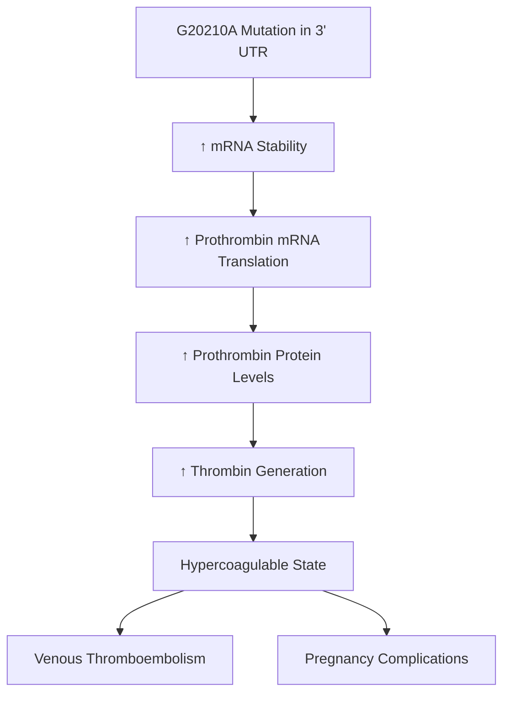
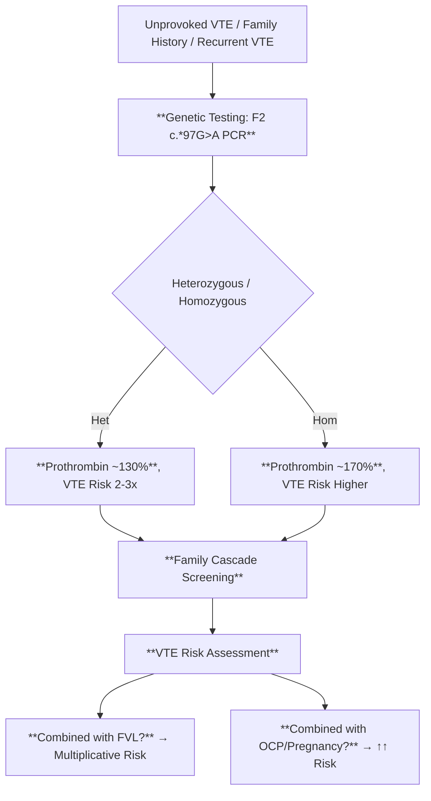
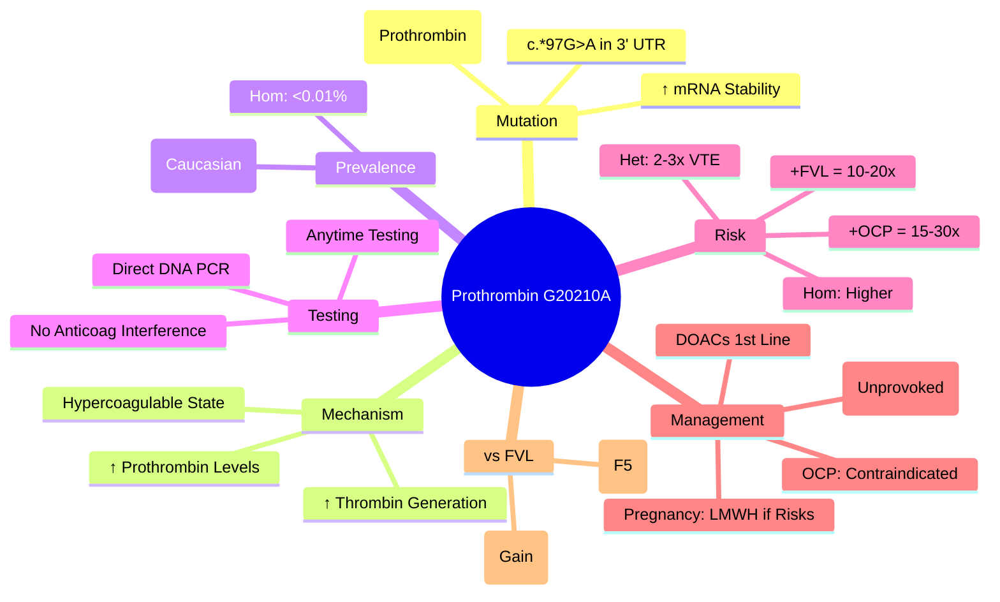

# Prothrombin G20210A Mutation

> [!info] **Davidson Ch 25 Alignment**: Bleeding and Thrombotic Disorders → Thrombophilia → Prothrombin G20210A
> **FCPS/MRCP Focus**: 2nd most common inherited thrombophilia, 3' UTR mutation → ↑ prothrombin levels, VTE risk, pregnancy/OCP counselling

---

## 🎯 Learning Objectives

- [ ] Define **Prothrombin G20210A**: 3' UTR mutation (c.*97G>A) → ↑ prothrombin mRNA stability → **↑ prothrombin levels**
- [ ] Apply **Inheritance**: Autosomal Dominant, Heterozygous ~2-3% Caucasians, Homozygous rare
- [ ] Apply **VTE Risk**: Heterozygous **2-3x**, Homozygous higher, **Combined with FVL = multiplicative**
- [ ] Apply **Testing**: DNA-based (no functional assay), **OFF anticoagulation not required** (unlike Protein C/S/AT)
- [ ] Manage **VTE Treatment**: **DOACs first-line**, Warfarin if AT def, Duration based on provoked vs unprovoked
- [ ] Manage **Pregnancy/OCP**: Avoid estrogen, LMWH prophylaxis in pregnancy if additional risks
- [ ] Differentiate from **Factor V Leiden**: Gain-of-function (↑ prothrombin) vs APC resistance

---

## 📖 Definition & Molecular Basis

| Feature | Details |
|---------|---------|
| **Mutation** | **c.*97G>A** in 3' untranslated region (3' UTR) of **F2 gene** (Prothrombin) |
| **Mechanism** | **↑ mRNA stability** → **↑ Prothrombin synthesis** → **↑ Thrombin generation** |
| **Inheritance** | **Autosomal Dominant** |
| **Prevalence** | **Heterozygous: ~2-3%** (Caucasians), **<1%** (Asian/African); **Homozygous: <0.01%** |
| **Prothrombin Levels** | **Het: ~30% ↑**; **Hom: ~70% ↑** |

| Feature | Factor V Leiden | Prothrombin G20210A |
|---------|----------------|---------------------|
| **Mechanism** | **APC Resistance** (Factor Va resistant) | **↑ Prothrombin Levels** (Gain-of-function) |
| **Gene** | **F5** (c.1691G>A) | **F2** (c.*97G>A) |
| **Prevalence (Het)** | **5-8%** (Caucasian) | **2-3%** (Caucasian) |
| **VTE Risk (Het)** | **3-7x** | **2-3x** |
| **Testing** | **APC Resistance Assay → F5 Genetic** | **Direct DNA Test (No Functional Assay)** |
| **Warfarin Effect** | No Effect | No Effect |

> [!tip] **FCPS/MRCP**: **Prothrombin G20210A = 2nd most common inherited thrombophilia**. **↑ Prothrombin → ↑ Thrombin**. **Direct DNA test (no functional assay needed)**. **No warfarin effect**. **Lower thrombotic risk than FVL**.

---

## ⚙️ Pathophysiology

---

## 🔬 Diagnostic Workup

### Testing Advantages

| Feature | Prothrombin G20210A | Factor V Leiden | Protein C/S/AT |
|---------|---------------------|-----------------|----------------|
| **Test Type** | **Direct DNA (PCR/Sequencing)** | **Functional (APC-R) → DNA** | **Functional → Antigen → DNA** |
| **Anticoagulation Effect** | **None (OFF not required)** | **None (OFF not required)** | **Warfarin/Heparin affect results** |
| **Acute Phase Effect** | **None** | **None** | **Inflammation affects results** |
| **Turnaround** | **Fast (DNA-only)** | **Two-step** | **Multi-step** |

> [!tip] **Prothrombin G20210A = Direct DNA test = No anticoagulation interference = Can test anytime**.

---

## 🩺 Clinical Features & Risk Stratification

| Scenario | VTE Risk |
|----------|----------|
| **Heterozygous G20210A** | **2-3x** baseline |
| **Homozygous G20210A** | **~5-10x** (rare) |
| **G20210A + FVL (Double Het)** | **10-20x** (multiplicative) |
| **G20210A + OCP (Estrogen)** | **15-30x** (synergistic) |
| **G20210A + Pregnancy** | **5-10x** baseline pregnancy risk |
| **G20210A + Surgery/Immobilisation** | **Additive risk** |

> [!warning] **G20210A + FVL = Multiplicative risk (~20x)**. **G20210A + OCP = ~15-30x VTE risk**.

---

## 💊 Management

### VTE Treatment

| Scenario | Preferred Anticoagulant | Duration |
|----------|------------------------|----------|
| **Provoked VTE** (surgery, trauma, OCP) | **DOAC** (Rivaroxaban/Apixaban) | **3 months** |
| **Unprovoked VTE** | **DOAC** | **Indefinite** (if bleeding risk low) |
| **Recurrent VTE** | **DOAC** (or Warfarin) | **Indefinite** |
| **Pregnancy** | **Therapeutic LMWH** (1 mg/kg BD) | Throughout pregnancy + 6wks PP |
| **Antithrombin Deficiency** | **Warfarin** (DOACs less reliable) | Indefinite |

> [!tip] **DOACs = First-line for Prothrombin G20210A**. **Warfarin if AT deficiency**. **Indefinite for unprovoked VTE**.

### Asymptomatic Carriers (No VTE)

| Situation | Management |
|-----------|------------|
| **Routine** | **NO anticoagulation**; Counsel on VTE symptoms, VTE awareness |
| **OCP/Estrogen** | **CONTRAINDICATED** (use progesterone-only/non-hormonal) |
| **Surgery** | **Prophylactic LMWH** (per protocol, higher dose if additional risks) |
| **Pregnancy** | **Prophylactic LMWH** if **additional risks**: prior VTE, homozygous, combined with FVL, family history |
| **Long-haul Travel** | **Compression stockings**, Hydration, Mobilisation |

---

## 🤰 Pregnancy Management

| Genotype | Antepartum | Postpartum (6 weeks) |
|----------|------------|----------------------|
| **Heterozygous G20210A** | **Prophylactic LMWH** if additional risks (prior VTE, FVL, family history, obesity) | **Prophylactic LMWH 6wks** |
| **Homozygous G20210A** | **Prophylactic LMWH** (or Therapeutic if prior VTE) | **Prophylactic/Therapeutic LMWH 6wks** |
| **G20210A + FVL (Double Het)** | **Therapeutic LMWH** | **Therapeutic LMWH 6wks** |
| **Any + Prior VTE** | **Therapeutic LMWH** | **Therapeutic LMWH 6wks** |

> [!warning] **OCP (Estrogen) CONTRAINDICATED** in G20210A carriers. **Progesterone-only/Non-hormonal** alternatives.

---

## 🔄 Differential Diagnosis

| Condition | Distinguishing Features |
|-----------|------------------------|
| **Factor V Leiden** | **APC Resistance**, F5 gene, 5-8% het, 3-7x risk |
| **Protein C/S/AT Deficiency** | Loss-of-function, ↓ activity on functional assay, Warfarin affects |
| **APS** | Acquired, aPL positive, INR 3-4, DOACs contraindicated in triple positive |
| **Malignancy** | Provoked VTE, Cancer screening if unprovoked >40yo |

---

## 💡 FCPS/MRCP High-Yield Summary

| Topic | Key Point |
|-------|-----------|
| **Mutation** | **F2 c.*97G>A** (3' UTR) → **↑ Prothrombin Levels** |
| **Prevalence** | **Het ~2-3%** (Caucasians), **2nd most common** after FVL |
| **VTE Risk** | **Het 2-3x**, **Hom higher**, **Combined with FVL = 10-20x** |
| **Testing** | **Direct DNA PCR** (No functional assay); **No anticoagulation interference** |
| **VTE Management** | **DOACs 1st line**; **Indefinite for unprovoked** |
| **Pregnancy** | **LMWH prophylaxis** if risk factors (FVL, prior VTE, homozygous) |
| **OCP** | **Avoid Estrogen** (Progesterone-only/Non-hormonal) |
| **vs FVL** | **G20210A = ↑ Prothrombin (Gain-of-function)**; **FVL = APC Resistance** |

---

## ❓ Viva Questions

1. **What is the molecular basis of Prothrombin G20210A mutation?**
   - **c.*97G>A in 3' UTR of F2 gene** → ↑ mRNA stability → **↑ Prothrombin synthesis** → ↑ Thrombin generation

2. **How does the VTE risk of Prothrombin G20210A compare to Factor V Leiden?**
   - **FVL: 3-7x (Het)**; **G20210A: 2-3x (Het)**; **FVL higher risk**

3. **What is the testing advantage of Prothrombin G20210A over Protein C/S/AT deficiency?**
   - **Direct DNA test (PCR)**; **No anticoagulation interference**; Can test on warfarin/heparin

4. **What is the VTE risk with combined FVL and Prothrombin G20210A mutations?**
   - **Multiplicative ~10-20x** (Double heterozygous)

5. **Is OCP contraindicated in Prothrombin G20210A carriers?**
   - **YES, Estrogen OCP contraindicated** (Progesterone-only/non-hormonal alternatives)

5. **How is pregnancy managed in a heterozygous Prothrombin G20210A carrier?**
   - **Prophylactic LMWH** if additional risks (FVL, prior VTE, family history, obesity); otherwise surveillance

6. **How does Prothrombin G20210A differ from Factor V Leiden in mechanism?**
   - **G20210A = Gain-of-function (↑ Prothrombin levels)**; **FVL = APC Resistance (Factor Va resistant to degradation)**

7. **Is anticoagulation needed for asymptomatic carriers?**
   - **NO routine anticoagulation**; Prophylaxis for surgery/pregnancy if risk factors

7. **What is the prothrombin level in heterozygous vs homozygous carriers?**
   - **Het: ~130% (30% ↑)**; **Hom: ~170% (70% ↑)**

8. **How is thrombophilia testing different for G20210A vs Protein C/S/AT?**
   - **G20210A = DNA test only (no functional assay)**; **Protein C/S/AT = Functional assay first (affected by warfarin/heparin)**

9. **What is the management of a homozygous Prothrombin G20210A carrier in pregnancy?**
   - **Therapeutic LMWH** throughout pregnancy + 6 weeks postpartum

10. **Differentiate Prothrombin G20210A from Factor V Leiden on thrombophilia screening.**
    - **G20210A = ↑ Prothrombin level (DNA test)**; **FVL = APC Resistance (Functional test + DNA)**; **Different genes (F2 vs F5)**

---

## 🧠 Confusions & Mnemonics

| Confusion | Clarification |
|-----------|---------------|
| **G20210A vs FVL** | **G20210A = ↑ Prothrombin (F2)**; **FVL = APC Resistance (F5)** |
| **G20210A vs Protein C/S/AT** | **G20210A = Gain-of-function (DNA test only)**; **PC/PS/AT = Loss-of-function (Functional assay affected by warfarin)** |
| **G20210A vs OCP** | **Estrogen OCP Contraindicated** in G20210A (synergistic VTE risk) |
| **Heterozygous vs Homozygous** | **Het: 130% prothrombin, 2-3x risk**; **Hom: 170% prothrombin, higher risk** |
| **Testing Timing** | **G20210A = Anytime (DNA test)**; **PC/S/AT = OFF Warfarin 2wk** |

| Mnemonic | Meaning |
|----------|---------|
| **"G20210A = Prothrombin Up = Gene F2"** | Gene |
| **"F2 = Factor II = Prothrombin"** | Gene name |
| **"G20210A = Gain-of-Function = DNA Test Only"** | Testing advantage |
| **"FVL = APC Resist; G20210A = Prothrombin Up"** | Mechanism difference |
| **"Double Het = 20x Risk"** | FVL + G20210A combined |
| **"OCP No for G20210A"** | Contraindication |
| **"Pregnancy = LMWH if Risks"** | Pregnancy management |

---

## 🗺️ Mind Map

---

## 📋 One-Page Revision Card

| **PROTHROMBIN G20210A – FCPS/MRCP REVISION CARD** |
|----------------------------------------------------|
| **Mutation**: **F2 c.*97G>A (3' UTR)** → **↑ Prothrombin Levels** |
| **Prevalence**: **Het ~2-3%** (Caucasian), 2nd most common thrombophilia |
| **Mechanism**: **Gain-of-function** (↑ Prothrombin → ↑ Thrombin) |
| **Testing**: **Direct DNA PCR**; **No anticoagulation interference** |
| **VTE Risk**: **Het 2-3x**, **Hom higher**; **+FVL = 10-20x; +OCP = 15-30x** |
| **Treatment**: **DOACs 1st line**; **Indefinite if unprovoked** |
| **OCP**: **Contraindicated** (Estrogen); Progesterone-only OK |
| **Pregnancy**: **LMWH prophylaxis** if FVL, prior VTE, homozygous, family history |
| **vs FVL**: **FVL = APC Resistance (F5)**; **G20210A = ↑ Prothrombin (F2)** |
| **Testing**: **DNA test anytime** (No warfarin/heparin effect) |

---

## 📅 Spaced Repetition Tracker

| Review | Date | Score (1-5) | Next Review |
|--------|------|-------------|-------------|
| Day 1 | 2025-06-17 | | 2025-06-18 |
| Day 3 | | | |
| Day 7 | | | |
| Day 15 | | | |
| Day 30 | | | |

---

## 🎯 Must Know / Should Know / Nice to Know

| Level | Content |
|-------|---------|
| **Must Know** | F2 c.*97G>A mutation, ↑ prothrombin mechanism, 2-3x VTE risk, direct DNA test (no anticoag interference), DOACs first-line, OCP contraindicated, pregnancy LMWH if risks, 20x risk with FVL, DNA test advantage |
| **Should Know** | Homozygous prevalence/management, prothrombin level quantification, combined thrombophilia risk stratification, pregnancy management details (antepartum vs postpartum), family cascade testing, cost-effectiveness of screening, interaction with other risk factors (surgery, immobilisation, malignancy) |
| **Nice to Know** | F2 gene structure, 3' UTR mRNA stability mechanisms, population genetics (Caucasian vs Asian/African prevalence), gene-gene interactions, epigenetic regulation, cost-effectiveness of universal screening, prothrombin fragment 1+2 as biomarker, thrombin generation assays, novel anticoagulants in G20210A carriers, cost-effectiveness of universal screening in pregnancy |

---

## ✅ Self-Test Scorecard

| Section | Score (0-10) | Notes |
|---------|--------------|-------|
| Molecular Basis & Mechanism | | |
| VTE Risk Stratification | | |
| Testing Advantages | | |
| Management (VTE, Pregnancy, OCP) | | |
| Comparison with FVL | | |
| Viva Questions | | |

---

## 🔗 Local Navigation

- **Previous**: [[Protein C Protein S Antithrombin Deficiency]]
- **Next**: [[Vitamin K Deficiency]]
- **Section Hub**: [[Bleeding and Thrombotic Disorders]]
- **MOC**: [[Hematology MOC]]
- **Template**: [[../Templates/Hematology Topic Template]]

---

*Generated for FCPS/MRCP exam preparation. Based on Davidson Medicine 24th Ed Chapter 25.*