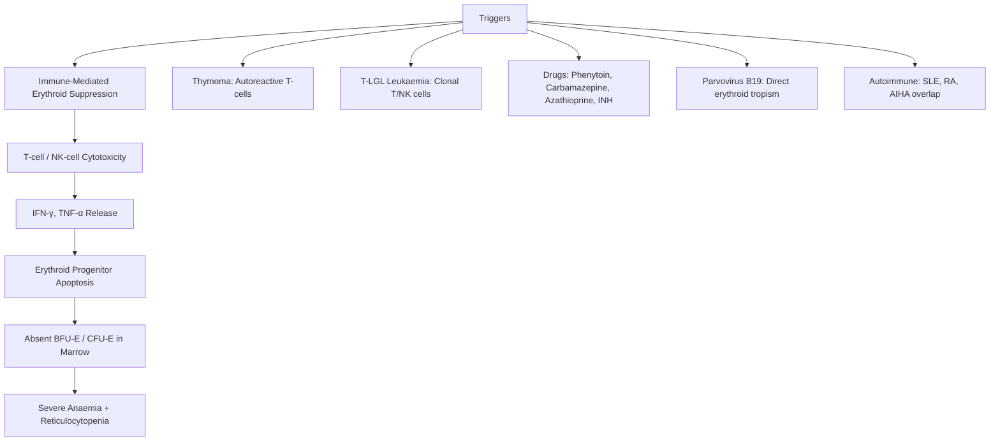
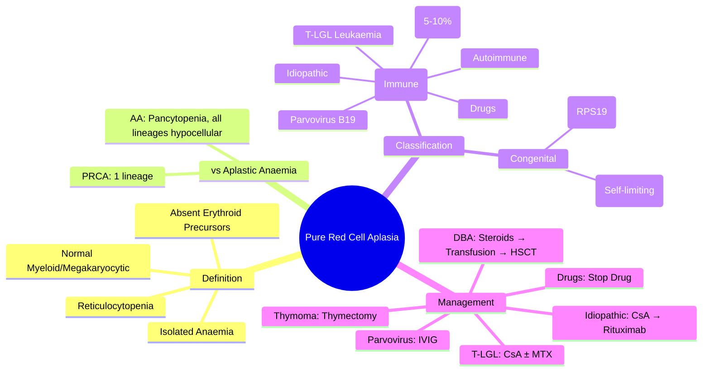

# Pure Red Cell Aplasia (PRCA)

> [!info] **Davidson Ch 25 Alignment**: Anaemia and Red Cell Disorders → Pure Red Cell Aplasia
> **FCPS/MRCP Focus**: Isolated erythroid failure, thymoma association, parvovirus B19, T-cell LGL, drug-induced, immunosuppression

---

## 🎯 Learning Objectives

- [ ] Define PRCA: **Severe anaemia with reticulocytopenia** + **absent erythroid precursors** in BM (normal myeloid/megakaryocytic lineages)
- [ ] Classify: **Acquired** (immune-mediated, thymoma, T-LGL, drugs, viral) vs **Congenital** (Diamond-Blackfan Anaemia)
- [ ] Differentiate from **Aplastic Anaemia** (pancytopenia + hypocellular marrow all lineages)
- [ ] Identify **Thymoma-associated PRCA** (paraneoplastic, 5-10% of thymomas)
- [ ] Diagnose **Parvovirus B19 PRCA** in immunocompromised (persistent infection)
- [ ] Apply **immunosuppression**: Cyclosporine, Rituximab, Thymectomy (thymoma), IVIG (parvovirus)
- [ ] Monitor for **transformation to MDS/AML** (especially Diamond-Blackfan)

---

## 📖 Definition & Classification

| Type | Aetiology | Key Features |
|------|-----------|--------------|
| **Acquired (Immune-mediated)** | **Idiopathic, Thymoma, T-LGL Leukaemia, Drugs, Viral (Parvovirus B19), Autoimmune, Pregnancy** | **Most common**; T-cell mediated erythroid suppression; **responds to IST** |
| **Congenital (Diamond-Blackfan Anaemia - DBA)** | **RPS19, RPL5, RPL11, RPL35A, GATA1** (ribosomal protein genes) | Presents infancy, **macrocytosis**, **congenital anomalies** (thumb, craniofacial, cardiac), **cancer predisposition** |
| **Transient Erythroblastopenia of Childhood (TEC)** | Post-viral, self-limiting | Age 6mo-4yr, **self-resolves 4-8 weeks**, no congenital anomalies |

> [!tip] **FCPS/MRCP**: **PRCA = Isolated red cell failure** (anaemia + retics ↓↓ + absent erythroid precursors). **Aplastic Anaemia = Pancytopenia + all lineages hypocellular**. **Thymoma = classic association (5-10% of thymomas)**.

---

## ⚙️ Pathophysiology



---

## 🔬 Diagnostic Workup

```mermaid
flowchart TD
    A[Severe Anaemia + Reticulocytopenia] --> B[CBC: Isolated Anaemia, Normal WBC/Plt]
    B --> C[**BM Aspirate + Biopsy**]
    C --> D{Marrow Findings}
    D -->|**Absent Erythroid Precursors** (normal myeloid/megakaryocytic)| E[**Diagnosis: PRCA**]
    D -->|Pancytopenia + Hypocellular All Lineages| F[Aplastic Anaemia]
    D -->|Dysplasia + Erythroid Hypoplasia| G[MDS]
    E --> H[Aetiology Workup]
    H --> I1[**Chest CT: Thymoma?**]
    H --> I2[**Flow Cytometry: T-LGL (CD3+CD8+CD57+)?**]
    H --> I3[**Parvovirus B19 PCR (serum/BM)**]
    H --> I4[Drug History Review]
    H --> I5[Autoimmune Screen: ANA, RF, etc.]
    H --> I6[Genetic: RPS19 panel (if congenital/DBA)]
```

### Key Diagnostic Criteria

| Test | PRCA Finding | Aplastic Anaemia |
|------|--------------|------------------|
| **CBC** | **Isolated anaemia** (Hb ↓), Normal WBC, Normal Plt | **Pancytopenia** (2-3 lineages) |
| **Reticulocytes** | **<1% (severe reticulocytopenia)** | Low |
| **BM Cellularity** | Normal/Increased (myeloid hyperplasia) | **Hypocellular ≤25%** |
| **Erythroid Precursors** | **Absent / <5%** | Reduced (all lineages) |
| **Myeloid/Megakaryocytic** | **Normal** | Reduced |
| **BFU-E/CFU-E Assay** | **Absent** | Reduced |
| **Serum EPO** | **Markedly Elevated** | Elevated |

---

## 🩺 Clinical Features & Aetiology-Specific Findings

| Aetiology | Clinical Clues |
|-----------|----------------|
| **Thymoma** | **5-10% of thymomas**; anterior mediastinal mass; myasthenia gravis overlap; **Good's syndrome** (hypogammaglobulinaemia) |
| **T-LGL Leukaemia** | **CD3+CD8+CD57+** clonal T-cells; neutropenia, splenomegaly, RA overlap; TCRγ rearrangement |
| **Parvovirus B19** | **Immunocompromised** (HIV, post-transplant, chemo); **persistent infection**; high viral load |
| **Drug-induced** | Phenytoin, Carbamazepine, Azathioprine, INH, D-penicillamine, Gold, Linezolid |
| **Autoimmune** | SLE, RA, AIHA overlap (Evan's syndrome); ANA+, RF+ |
| **Diamond-Blackfan (DBA)** | **Infancy presentation**, macrocytosis, **congenital anomalies** (triphalangeal thumb, craniofacial, cardiac), **elevated eADA** |

---

## 💊 Management

### Treatment Algorithm by Aetiology

```mermaid
flowchart TD
    A[PRCA Diagnosis] --> B{Aetiology}
    B -->|Thymoma| C[**Thymectomy** (complete resection) → 30-50% remission]
    C --> D[If no remission → **Cyclosporine / Rituximab**]
    B -->|T-LGL Leukaemia| E[**Immunosuppression: Cyclosporine ± Methotrexate**]
    E --> F[Rituximab / Alemtuzumab if refractory]
    B -->|Parvovirus B19| G[**IVIG 400 mg/kg/day × 5 days**]
    G --> H[Reduces viral load → erythroid recovery]
    B -->|Drug-induced| I[**Stop Offending Drug**]
    I --> J[Most recover; add **CsA** if persistent]
    B -->|Idiopathic/Autoimmune| K[**First-line: Cyclosporine** (60-70% response)]
    K --> L[**Second-line: Rituximab** (anti-CD20)]
    L --> M[**Third-line: Alemtuzumab / ATG / Tacrolimus**]
    B -->|Diamond-Blackfan| N[**Corticosteroids** (prednisolone 1-2 mg/kg)]
    N --> O[**Chronic Transfusion + Iron Chelation**]
    O --> P[**HSCT** (curative, if matched donor)]
```

### Immunosuppressive Regimens

| Agent | Dose | Response Rate | Key Monitoring |
|-------|------|---------------|----------------|
| **Cyclosporine** | 5-6 mg/kg/day (trough 150-250 ng/mL) | **60-70%** (idiopathic) | Renal function, BP, Mg, K, tremor, hirsutism, levels |
| **Rituximab** | 375 mg/m² weekly × 4 | **50-70%** (refractory) | IgG levels, infection risk, hepatitis B reactivation |
| **IVIG** | 400 mg/kg/day × 5 days | **Parvovirus: >80%** | Renal function, headache, aseptic meningitis |
| **Thymectomy** | Complete resection | **30-50% remission** | Myasthenia gravis evaluation pre-op |
| **Corticosteroids** | Prednisolone 1-2 mg/kg (DBA) | **80% initial response** | Growth, bone, cataracts, glucose, infection |

---

## ⚠️ Complications & Monitoring

| Complication | Management |
|--------------|------------|
| **Transfusion Dependence** | Leucodepleted, irradiated RBCs; **Iron Chelation** if ferritin >1000 |
| **Iron Overload** | Annual LIC/MRI T2*, ferritin q3mo; Deferasirox/Deferiprone/Deferoxamine |
| **Infection** | Pneumococcal/Hib/MenACWY vaccines; ACV prophylaxis if on IST |
| **Malignant Transformation (DBA)** | **MDS/AML risk ~20% by age 40**; solid tumours (osteosarcoma, breast); Annual BM surveillance |
| **Relapse after IST** | ~30-40% after CsA taper; Re-treat with CsA/Rituximab |

---

## 🔄 Differential Diagnosis

| Condition | Distinguishing Features |
|-----------|------------------------|
| **Aplastic Anaemia** | **Pancytopenia**, hypocellular marrow all lineages, reduced CFU-GM |
| **MDS (Erythroid hypoplasia)** | **Dysplasia** in erythroid/megakaryocytic, cytogenetic abnormalities, may progress |
| **Iron Deficiency / B12 / Folate** | **Reticulocytes normal/high** (if treated), specific nutrient deficiency |
| **Renal Anaemia** | Low EPO, normocytic normochromic, renal impairment |
| **AIHA** | **Reticulocytosis**, positive DAT, haemolysis markers (LDH↑, haptoglobin↓) |
| **Transient Erythroblastopenia (TEC)** | **Self-limiting 4-8 weeks**, age 6mo-4yr, no congenital anomalies |

---

## 💡 FCPS/MRCP High-Yield Summary

| Topic | Key Point |
|-------|-----------|
| **Definition** | **Isolated anaemia + reticulocytopenia + absent erythroid precursors** (normal myeloid/megakaryocytic) |
| **vs Aplastic Anaemia** | PRCA = **single lineage**; AA = **pancytopenia + hypocellular all lineages** |
| **Thymoma Association** | **5-10% of thymomas** → PRCA; **Thymectomy** = 30-50% remission |
| **T-LGL Leukaemia** | **CD3+CD8+CD57+** clonal T-cells; neutropenia, splenomegaly, RA; **CsA first-line** |
| **Parvovirus B19** | **Immunocompromised**; persistent infection; **IVIG 400 mg/kg × 5 days** |
| **Drugs** | Phenytoin, Carbamazepine, Azathioprine, INH, D-penicillamine |
| **Diamond-Blackfan (DBA)** | **RPS19** ribosomal gene; **infancy, macrocytosis, anomalies, eADA↑**; steroids → transfusion → HSCT |
| **First-line IST** | **Cyclosporine** (trough 150-250); **Rituximab** second-line |
| **eADA** | **Erythrocyte adenosine deaminase elevated** in DBA (diagnostic) |

---

## ❓ Viva Questions

1. **How do you differentiate Pure Red Cell Aplasia from Aplastic Anaemia?**
   - **PRCA**: Isolated anaemia, normal WBC/Plt, **absent erythroid precursors only**, normal myeloid/megakaryocytic in BM
   - **AA**: **Pancytopenia**, hypocellular marrow **all lineages**

2. **What is the association between thymoma and PRCA?**
   - **5-10% of thymomas** develop PRCA (paraneoplastic); **Thymectomy** induces remission in 30-50%

3. **Describe the T-LGL leukaemia association with PRCA.**
   - **Clonal CD3+CD8+CD57+ T-cells**; cause PRCA + neutropenia + splenomegaly; **CsA first-line**; TCRγ rearrangement confirms clonality

4. **How does Parvovirus B19 cause PRCA and how is it treated?**
   - Direct **erythroid tropism** → infects erythroblasts; **persistent in immunocompromised**; **IVIG 400 mg/kg/day × 5 days** clears virus

5. **What is Diamond-Blackfan Anaemia and how does it present?**
   - **Congenital PRCA** (RPS19/ribosomal genes); **infancy**, **macrocytosis**, **congenital anomalies** (thumb, craniofacial), **elevated eADA**

6. **What is the first-line immunosuppressive treatment for idiopathic PRCA?**
   - **Cyclosporine 5-6 mg/kg/day** (trough 150-250 ng/mL) – **60-70% response rate**

7. **What is the role of Rituximab in PRCA?**
   - **Second-line** for CsA-refractory/relapsed; **anti-CD20** depletes B-cells (antibody-mediated) and modulates T-cells

8. **How is drug-induced PRCA managed?**
   - **Stop offending drug**; most recover spontaneously; add **CsA if persistent >4-8 weeks**

9. **What is eADA and its significance?**
   - **Erythrocyte adenosine deaminase**; **elevated in Diamond-Blackfan Anaemia** (diagnostic marker)

10. **What are the congenital anomalies associated with Diamond-Blackfan Anaemia?**
    - **Triphalangeal thumb**, craniofacial (microcephaly, hypertelorism), cardiac (VSD), renal, genitourinary

---

## 🧠 Confusions & Mnemonics

| Confusion | Clarification |
|-----------|---------------|
| **PRCA vs Aplastic Anaemia** | **PRCA = 1 lineage (red cells only)**; **AA = pancytopenia (all lineages)** |
| **PRCA vs MDS** | **PRCA = no dysplasia, normal cytogenetics**; **MDS = dysplasia, cytogenetic abnormalities** |
| **PRCA vs AIHA** | **PRCA = reticulocytopenia, absent erythroid precursors**; **AIHA = reticulocytosis, haemolysis, DAT+** |
| **Thymoma PRCA** | **Thymectomy** = 30-50% remission; not all respond → need IST |
| **DBA vs TEC** | **DBA = congenital, anomalies, macrocytosis, eADA↑, lifelong**; **TEC = acquired, self-limiting 4-8wks, no anomalies** |

| Mnemonic | Meaning |
|----------|---------|
| **"PRCA = Pure Red = 1 Lineage"** | Isolated erythroid failure |
| **"Thymoma = PRCA (5-10%)"** | Paraneoplastic association |
| **"T-LGL = CD8, CD57, Neutropenia, RA"** | T-LGL leukaemia features |
| **"Parvo = IVIG (Immunocompromised)"** | Parvovirus B19 PRCA treatment |
| **"DBA = RPS19, Thumb, Macrocytosis, eADA"** | Diamond-Blackfan features |
| **"CsA = First-line PRCA"** | Cyclosporine primary IST |

---

## 🗺️ Mind Map



---

## 📋 One-Page Revision Card

| **PURE RED CELL APLASIA – FCPS/MRCP REVISION CARD** |
|------------------------------------------------------|
| **Definition**: **Isolated anaemia + reticulocytopenia + absent erythroid precursors** (normal myeloid/megakaryocytic) |
| **vs AA**: PRCA = **1 lineage**; AA = **pancytopenia + hypocellular all lineages** |
| **Key Associations**: **Thymoma (5-10%)**, **T-LGL (CD8+CD57+)**, **Parvovirus B19 (immunocompromised)** |
| **Drugs**: Phenytoin, Carbamazepine, Azathioprine, INH |
| **Diamond-Blackfan**: **RPS19**, infancy, **macrocytosis**, **thumb anomalies**, **eADA↑** |
| **Management by Cause**: |
| - Thymoma → **Thymectomy** (30-50% remission) |
| - T-LGL → **CsA ± MTX** |
| - Parvovirus → **IVIG 400mg/kg × 5d** |
| - Idiopathic/Autoimmune → **CsA** (1st) → **Rituximab** (2nd) |
| - DBA → **Steroids → Transfusion + Chelation → HSCT** |
| **CsA Dose**: 5-6 mg/kg/day, **trough 150-250 ng/mL** |
| **Complications**: Transfusion iron overload, MDS/AML (DBA), infection on IST |

---

## 📅 Spaced Repetition Tracker

| Review | Date | Score (1-5) | Next Review |
|--------|------|-------------|-------------|
| Day 1 | 2025-06-16 | | 2025-06-17 |
| Day 3 | | | |
| Day 7 | | | |
| Day 15 | | | |
| Day 30 | | | |

---

## 🎯 Must Know / Should Know / Nice to Know

| Level | Content |
|-------|---------|
| **Must Know** | Definition (isolated erythroid failure), vs aplastic anaemia, thymoma/T-LGL/Parvovirus associations, DBA features (RPS19, anomalies, eADA), CsA first-line, IVIG for parvovirus, thymectomy for thymoma |
| **Should Know** | T-LGL immunophenotype, CsA monitoring, Rituximab dosing, drug-induced PRCA drugs, Good's syndrome (thymoma+hypogammaglobulinaemia), TEC self-limiting nature |
| **Nice to Know** | Detailed DBA genetics (RPL5, RPL11, GATA1), alemtuzumab in refractory PRCA, TCRγ rearrangement methodology, eADA assay details, cancer predisposition in DBA surveillance protocols |

---

## ✅ Self-Test Scorecard

| Section | Score (0-10) | Notes |
|---------|--------------|-------|
| Definition & vs Aplastic Anaemia | | |
| Aetiology & Associations | | |
| Diamond-Blackfan Features | | |
| Management by Cause | | |
| Immunosuppressive Regimens | | |
| Viva Questions | | |

---

## 🔗 Local Navigation

- **Previous**: [[Sideroblastic Anaemia]]
- **Next**: [[Immune Haemolytic Anaemia (AIHA)]]
- **Section Hub**: [[Anaemia and Red Cell Disorders]]
- **MOC**: [[Hematology MOC]]
- **Template**: [[../Templates/Hematology Topic Template]]

---

*Generated for FCPS/MRCP exam preparation. Based on Davidson Medicine 24th Ed Chapter 25.*
---

> Auto-generated study sections for "Hematology" — Ch 24: Haematology & Transfusion Medicine.

## Flashcards (19 generated)

- Q: What is Transfusion Dependence of Hematology?
  A: Leucodepleted, irradiated RBCs; Iron Chelation if ferritin >1000
- Q: What is Iron Overload of Hematology?
  A: Annual LIC/MRI T2, ferritin q3mo; Deferasirox/Deferiprone/Deferoxamine
- Q: What is Infection of Hematology?
  A: Pneumococcal/Hib/MenACWY vaccines; ACV prophylaxis if on IST
- Q: What is Malignant Transformation (DBA) of Hematology?
  A: MDS/AML risk ~20% by age 40; solid tumours (osteosarcoma, breast); Annual BM surveillance
- Q: What is Relapse after IST of Hematology?
  A: ~30-40% after CsA taper; Re-treat with CsA/Rituximab
- Q: What is Transfusion Dependence of Hematology?
  A: Leucodepleted, irradiated RBCs; Iron Chelation if ferritin >1000
- Q: What is Iron Overload of Hematology?
  A: Annual LIC/MRI T2, ferritin q3mo; Deferasirox/Deferiprone/Deferoxamine
- Q: What is Infection of Hematology?
  A: Pneumococcal/Hib/MenACWY vaccines; ACV prophylaxis if on IST
- Q: What is Malignant Transformation (DBA) of Hematology?
  A: MDS/AML risk ~20% by age 40; solid tumours (osteosarcoma, breast); Annual BM surveillance
- Q: What is Relapse after IST of Hematology?
  A: ~30-40% after CsA taper; Re-treat with CsA/Rituximab
- Q: What is the definition of Hematology?
  A: Isolated anaemia + reticulocytopenia + absent erythroid precursors (normal myeloid/megakaryocytic)
- Q: What is vs Aplastic Anaemia of Hematology?
  A: PRCA = single lineage; AA = pancytopenia + hypocellular all lineages
- Q: What is Thymoma Association of Hematology?
  A: 5-10% of thymomas → PRCA; Thymectomy = 30-50% remission
- Q: What is T-LGL Leukaemia of Hematology?
  A: CD3+CD8+CD57+ clonal T-cells; neutropenia, splenomegaly, RA; CsA first-line
- Q: What is Parvovirus B19 of Hematology?
  A: Immunocompromised; persistent infection; IVIG 400 mg/kg × 5 days
- Q: What is Drugs of Hematology?
  A: Phenytoin, Carbamazepine, Azathioprine, INH, D-penicillamine
- Q: What is Diamond-Blackfan (DBA) of Hematology?
  A: RPS19 ribosomal gene; infancy, macrocytosis, anomalies, eADA↑; steroids → transfusion → HSCT
- Q: What is the first-line treatment for Hematology?
  A: Cyclosporine (trough 150-250); Rituximab second-line
- Q: What is eADA of Hematology?
  A: Erythrocyte adenosine deaminase elevated in DBA (diagnostic)

## MCQs (1 generated)

1. **Which of the following best describes Hematology?**
   A. **[!info] Davidson Ch 25 Alignment: Anaemia and Red Cell Disorders → Pure Red Cell Aplasia**
   B. An unrelated condition not matching the clinical picture of Hematology
   C. A complication seen late in the disease course of Hematology
   D. A condition that mimics Hematology but has a different underlying cause

## SBA Questions (1 generated)

1. A patient with suspected Hematology presents with: Acquired (Immune-mediated) — Idiopathic, Thymoma, T-LGL Leukaemia, Drugs, Viral (Parvovirus B19), Autoimmune, Pregnancy; Congenital (Diamond-Blackfan Anaemia - DBA) — RPS19, RPL5, RPL11, RPL35A, GATA1 (ribosomal protein genes); Transient Erythroblastopenia of Childhood (TEC) — Post-viral, self-limiting. What is the most likely diagnosis?
   A. **Hematology**
   B. A condition that mimics Hematology but is not the same entity
   C. A complication of Hematology rather than the primary diagnosis
   D. An unrelated condition in the same clinical category as Hematology

## PasTest Scenario SBAs (Clinical Vignettes)

> **Auto-generated PasTest/Mediscope-style scenario SBAs** grounded in the authored source. Each scenario tests a real clinical fact (triad, specific sign, contraindication, trial, first-line Rx) extracted from the topic. *Source: Ch 24: Haematology — Pure Red Cell Aplasia*

**Q1.** Which of the following features is most specific or characteristic of Pure Red Cell Aplasia?

  - **A.** Iron Deficiency / B12 / Folate
  - **B.** A feature common to many acute inflammatory conditions
  - **C.** A non-specific sign that does not localise the diagnosis
  - **D.** An investigation finding rather than a clinical feature

  > **Answer: A** — Iron Deficiency / B12 / Folate
  >
  > *Source:* oplasia)** | **Dysplasia** in erythroid/megakaryocytic, cytogenetic abnormalities, may progress |
| **Iron Deficiency / B12 / Folate** | **Reticulocytes normal/high** (if treated), specific nutrient d

**Q2.** What is the most appropriate first-line therapy for Pure Red Cell Aplasia?

  - **A.** First-line: Cyclosporine
  - **B.** An advanced/surgical therapy reserved for refractory disease
  - **C.** Symptomatic treatment only, no disease-modifying therapy
  - **D.** Empiric broad-spectrum therapy without specific indication

  > **Answer: A** — First-line: Cyclosporine
  >
  > *Source:* B --> Idiopathic/Autoimmune  K[**First-line: Cyclosporine** (60-70% response)]

