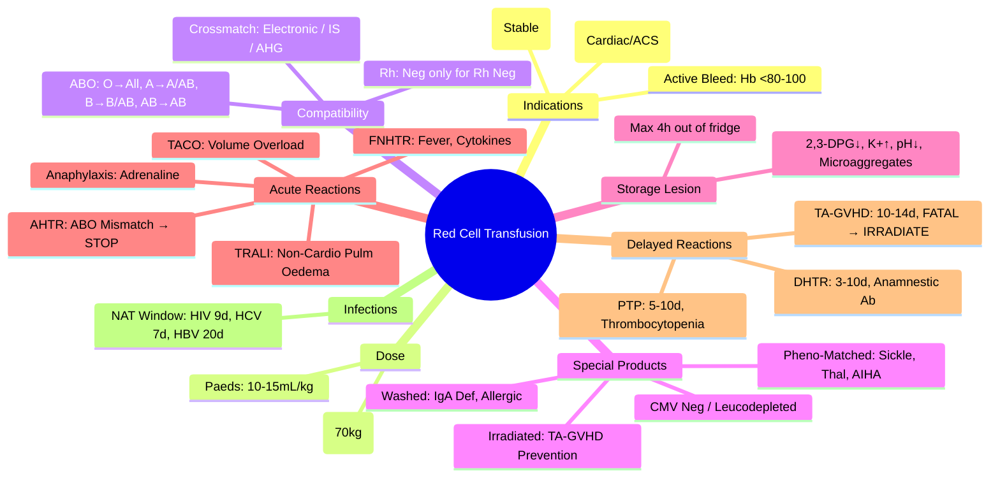

# Red Cell Transfusion

> [!info] **Davidson Ch 25 Alignment**: Transfusion Medicine → Red Cell Transfusion
> **FCPS/MRCP Focus**: Indications, restrictive vs liberal thresholds, ABO/Rh compatibility, crossmatch, special products (irradiated, CMV-, washed, phenotype-matched), storage, complications

---

## 🎯 Learning Objectives

- [ ] Apply **restrictive transfusion threshold**: **Hb <70 g/L** (stable); **Hb <80 g/L** (cardiovascular disease, acute coronary syndrome)
- [ ] Understand **ABO/Rh Compatibility**: Forward/reverse grouping, crossmatch, emergency release
- [ ] Know **Special Requirements**: Irradiated (TA-GVHD prevention), CMV-negative, Washed, Phenotype-matched (Kell, Duffy, Kidd)
- [ ] Calculate **Dose**: 1 unit ≈ 300 mL ≈ **raises Hb by 10 g/L** in 70 kg adult
- [ ] Recognise **Storage Lesion**: 2,3-DPG depletion, K⁺ rise, pH drop, microaggregates
- [ ] Manage **Complications**: Acute/Delayed haemolytic, Febrile non-haemolytic, TRALI, TACO, Allergic, TTI

---

## 📖 Indications & Thresholds

### Restrictive vs Liberal Strategy

| Patient Population | Threshold (Hb g/L) | Evidence |
|--------------------|--------------------|----------|
| **General Medical/Surgical (Stable)** | **<70** (Restrictive) | TRICC, FOCUS, ABLE trials: Non-inferior mortality, ↓ complications |
| **Cardiovascular Disease / ACS** | **<80** (Liberal) | Higher threshold for myocardial oxygen delivery |
| **Active Bleeding** | **<80-100** (Target) | Based on bleeding rate, hemodynamic stability |
| **Chronic Anaemia (Symptomatic)** | **<80-90** | Quality of life, functional status |
| **Jehovah's Witness** | **N/A** | Alternative management (EPO, iron, cell salvage) |

> [!tip] **FCPS/MRCP**: **Restrictive Threshold Hb <70 g/L** for most stable patients. **Liberal Hb <80 g/L** for cardiovascular disease. **1 unit ≈ 300 mL = Hb rise ~10 g/L in 70kg adult**.

---

## 🩸 ABO/Rh Compatibility & Crossmatch

### ABO Compatibility Matrix

| Recipient | Donor RBCs Compatible |
|-----------|----------------------|
| **O** | **O** only |
| **A** | A, O |
| **B** | B, O |
| **AB** | **A, B, AB, O** (Universal Recipient) |

### Rh Compatibility

| Recipient Rh | Donor Rh | Notes |
|--------------|----------|-------|
| **Rh Positive** | Rh Positive or Negative | Safe |
| **Rh Negative** | **Rh Negative ONLY** | Prevent anti-D alloimmunisation (especially women of childbearing potential) |
| **Emergency (Unknown)** | **O Negative** | Universal donor for RBCs |

### Crossmatch Types

| Type | Time | Use Case |
|------|------|----------|
| **Electronic (Computer)** | Seconds | **Valid ABO/Rh type + Negative Antibody Screen** (most elective) |
| **Immediate Spin (IS)** | 5-10 min | Emergency (no antibody screen time) |
| **Full AHG (Coombs)** | 45-60 min | **Positive Antibody Screen** or **Historical Antibodies** |
| **Emergency Release (Uncrossmatched)** | Immediate | **Life-threatening haemorrhage** (O Neg / Type-specific) |

> [!warning] **Emergency Release**: O Negative for females <50; Type-specific if known. **Document consent retrospectively**.

---

## 🩸 Special Blood Product Requirements

| Requirement | Indication | Product |
|-------------|------------|---------|
| **Irradiated (25-50 Gy)** | **TA-GVHD Prevention**: Immunocompromised (HSCT, chemo, congenital), HLA-matched platelets, Directed donation, Intrauterine, Premature neonates | All cellular products (RBC, Platelets, Granulocytes) |
| **CMV Negative (or Leucodepleted)** | CMV-seronegative recipients: **Pregnancy, HSCT, Immunocompromised** | Leucodepletion ≈ CMV-safe; **CMV PCR-negative preferred** for highest risk |
| **Washed (Saline)** | **Severe Allergic/Anaphylactic** reactions; **IgA deficiency with anti-IgA**; **Hyperkalaemia** (neonatal exchange) | Removes plasma proteins, K⁺, cytokines |
| **Phenotype-Matched** | **Sickle Cell, Thalassaemia, Autoimmune Haemolytic, Reregular Transfusion** | **Kell, Duffy, Kidd, S/s, C/c, E/e** (Extended matching beyond ABO/Rh) |
| **HbS Negative** | **Sickle Cell Disease** (exchange/simple) | Prevent HbS transfer |
| **HLA-Matched Platelets** | **Refractory to Random Platelets** (HLA alloimmunisation) | For platelet transfusion, not RBC |

> [!tip] **Irradiation = 25-50 Gy**; **Does NOT affect RBC function significantly**; **Reduces shelf life to 28 days** (or 14 days if already >14 days old). **CMV: Leucodepletion = CMV-safe for most; CMV PCR-negative for highest risk (in utero, HSCT).**

---

## 📊 Dose Calculation & Administration

### Dose Calculation

| Parameter | Formula |
|-----------|---------|
| **Volume per Unit** | **~300 mL** (Hct ~0.55-0.65) |
| **Hb Rise** | **1 unit ≈ 10 g/L rise** in 70 kg adult (no active bleeding) |
| **Paediatric Dose** | **10-15 mL/kg** (Hb rise ~20 g/L per 10 mL/kg) |
| **Maximum Rate** | **4 hours max** per unit (bacterial growth risk) |

### Administration Protocol

| Step | Action |
|------|--------|
| **Pre-transfusion** | **Positive Patient ID (2 identifiers)**, **Consent**, **Sample label check** |
| **Blood Collection** | **Collect within 30 min** of starting; **Return if not used in 30 min** |
| **Infusion** | **170-200 micron filter**; **Normal Saline only** compatible; **Start slow (2 mL/min × 15 min)** then increase |
| **Monitoring** | **Vitals at 0, 15 min, end, 1h post**; **STOP at first sign of reaction** |
| **Documentation** | **Start/end time, Volume, Reactions, Staff signature** |

---

## 🧪 Storage Lesion

| Change | Timeline | Clinical Significance |
|--------|----------|----------------------|
| **2,3-DPG ↓** | **Days 1-7: Progressive loss** | ↓ O₂ release to tissues → **Transfuse fresh (<7-14d) for critical O₂ delivery** |
| **K⁺ ↑** | **Up to 20-40 mmol/L by day 42** | Risk in **Massive Transfusion, Neonates, Renal Failure** → Wash if critical |
| **Ammonia ↑ / pH ↓** | Progressive | Metabolic acidosis risk in massive transfusion |
| **Microaggregates** | Forms over time | **Microaggregate filter (40 micron)** standard |
| **Bacterial Growth** | Rare but fatal | **Max 4h out of fridge**; **4h rule** |

---

## ⚠️ Complications

### Acute Transfusion Reactions (During/Within 24h)

| Reaction | Mechanism | Key Features | Management |
|----------|-----------|--------------|------------|
| **Acute Haemolytic (AHTR)** | ABO Incompatibility | **Fever, Flank pain, Dark urine, DIC, Renal failure** | **STOP**, Saline flush, IV fluids, Monitor renal/DIC |
| **Febrile Non-Haemolytic (FNHTR)** | Cytokines/Leukocyte antibodies | **Fever ≥38°C / ↑1-2°C**, Chills, Rigors | **STOP**, Antipyretics, Exclude haemolytic/sepsis |
| **Allergic / Anaphylactic** | Anti-plasma protein IgE/IgG | **Urticaria, Pruritus** → **Bronchospasm, Hypotension, Stridor** | **STOP**, **Adrenaline (Anaphylaxis)**, Antihistamines, Steroids |
| **TRALI** | Anti-HLA/HNA antibodies → Neutrophil activation | **Acute Hypoxaemia, Bilateral Infiltrates, Non-cardiogenic Pulm Oedema** (within 6h) | **STOP**, **Supportive (Ventilation)**, Report to Blood Bank |
| **TACO** | Volume overload | **Dyspnoea, Hypertension, Pulm Oedema, ↑ BNP** | **STOP**, **Diuretics**, Oxygen, Slow infusion |

### Delayed Transfusion Reactions (>24h)

| Reaction | Timing | Key Features |
|----------|--------|--------------|
| **Delayed Haemolytic (DHTR)** | **3-10 days** | Falling Hb, Jaundice, ↑ Bilirubin, +ve DAT, **ANAMNESTIC ANTIBODY** |
| **Transfusion-Associated GVHD (TA-GVHD)** | **10-14 days** | Fever, Rash, Diarrhoea, Pancytopenia, **FATAL** – **Prevent with IRRADIATION** |
| **Post-Transfusion Purpura (PTP)** | **5-10 days** | **Severe Thrombocytopenia**, Anti-HPA antibodies |
| **Iron Overload** | **Chronic (>20-30 units)** | Ferritin >1000, Cardiac/Liver/Endocrine toxicity → Chelation |

---

## 🔄 Infectious Risks (Transfusion-Transmitted Infections - TTI)

| Agent | Window Period (NAT) | Residual Risk (per unit) | Mitigation |
|-------|---------------------|--------------------------|------------|
| **HIV** | ~9 days | **<1 in 2-3 million** | NAT + Serology |
| **HCV** | ~7 days | **<1 in 1-2 million** | NAT + Serology |
| **HBV** | ~20 days | **<1 in 1 million** | NAT + HBsAg + Anti-HBc |
| **Syphilis** | N/A (Serology) | Very low | Serology |
| **HTLV I/II** | N/A (Serology) | Low | Serology (selected donors) |
| **Malaria** | N/A | Low (endemic areas) | Travel deferral, Serology/NAAT |
| **Bacterial Sepsis** | N/A | **~1 in 100,000 (Platelets > RBCs)** | Diversion pouches, Bacterial culture |

---

## 💡 FCPS/MRCP High-Yield Summary

| Topic | Key Point |
|-------|-----------|
| **Transfusion Threshold** | **Hb <70 g/L** (Restrictive, stable); **<80 g/L** (Cardiac disease/ACS) |
| **Dose** | **1 Unit ≈ 300 mL ≈ Hb ↑10 g/L** (70kg adult) |
| **ABO Compatibility** | O→All, A→A/AB, B→B/AB, AB→AB only; **Rh Neg only for Rh Neg** |
| **Crossmatch** | Electronic (valid type+screen); IS (emergency); AHG (antibodies) |
| **Irradiated** | **TA-GVHD prevention**: HSCT, chemo, congenital, directed, intrauterine |
| **CMV** | **Leucodepletion = CMV-safe**; **CMV PCR-neg for highest risk** |
| **Phenotype-Matched** | **Sickle Cell, Thalassaemia, AIHA, Regular Transfusion** (Kell, Duffy, Kidd) |
| **Washed** | **IgA deficiency**, Severe allergic, Hyperkalaemia (neonates) |
| **Storage Lesion** | 2,3-DPG ↓ (O₂ affinity), K⁺ ↑, pH ↓, Microaggregates, Bacterial risk |
| **Acute Reactions** | AHTR (ABO mismatch), FNHTR (Cytokines), TRALI (Anti-HLA), TACO (Volume), Anaphylaxis |
| **Delayed** | DHTR (3-10d), TA-GVHD (10-14d, FATAL - irradiate), PTP (5-10d) |
| **TTI** | **NAT Window: HIV 9d, HCV 7d, HBV 20d** |

---

## ❓ Viva Questions

1. **What is the restrictive transfusion threshold for haemoglobin in a stable medical patient?**
   - **Hb <70 g/L** (TRICC, FOCUS, ABLE trials)

2. **How much does 1 unit of red cells raise Hb in a 70 kg adult?**
   - **~10 g/L** (1 unit ≈ 300 mL)

3. **What blood group is the universal donor for red cells and why?**
   - **O Negative** – No A/B antigens on RBCs, No Rh D antigen

4. **When do you use irradiated blood products?**
   - **TA-GVHD prevention**: HSCT, chemotherapy, congenital immunodeficiency, directed donation, intrauterine transfusion, premature neonates

5. **What is the difference between CMV-negative and leucodepleted blood?**
   - **Leucodepletion removes WBCs (≈ CMV-safe for most)**; **CMV PCR-negative required for highest risk** (in utero, HSCT)

7. **How do you manage an acute haemolytic transfusion reaction?**
   - **STOP TRANSFUSION**, Saline flush, **IV fluids (renal protection)**, Monitor DIC/renal, Send blood for repeat grouping/DAT

8. **What is TRALI and how is it diagnosed?**
   - **Transfusion-Related Acute Lung Injury**: **Acute hypoxaemia, Bilateral infiltrates, Non-cardiogenic pulm oedema** within 6h of transfusion; **Anti-HLA/HNA antibodies** in donor

9. **Why are RBCs washed and when is it indicated?**
   - Removes plasma, K⁺, cytokines; Indicated: **IgA deficiency with anti-IgA**, Severe recurrent allergic/anaphylactic reactions, Neonatal exchange (hyperkalaemia)

10. **What are the special requirements for sickle cell disease transfusion?**
    - **HbS negative**, **Extended phenotype matching** (Kell, Duffy, Kidd, S/s, C/c, E/e), **Leucodepleted**, **Consider exchange transfusion** (target HbS <30%)

---

## 🧠 Confusions & Mnemonics

| Confusion | Clarification |
|-----------|---------------|
| **Restrictive vs Liberal** | **Stable = <70**; **Cardiac = <80** |
| **Irradiated vs Leucodepleted** | **Irradiated = TA-GVHD prevention (DNA damage)**; **Leucodepleted = CMV/leukocyte reduction (Log reduction)** |
| **FNHTR vs AHTR** | **FNHTR = Fever only, DAT negative**; **AHTR = Fever + Flank pain + Dark urine + DIC, DAT positive** |
| **TRALI vs TACO** | **TRALI = Non-cardiogenic, Anti-HLA antibodies, Normotensive**; **TACO = Cardiogenic, Volume overload, Hypertension, ↑ BNP** |
| **DHTR vs AHTR** | **DHTR = 3-10 days, Anamnestic antibody, Gradual Hb fall**; **AHTR = Immediate, ABO mismatch, Severe** |

| Mnemonic | Meaning |
|----------|---------|
| **"70 is Heaven, 80 for Heart"** | Transfusion thresholds |
| **"1 Unit = 10 g/L Rise"** | Dose calculation |
| **"O Neg = Universal Donor"** | ABO compatibility |
| **"Irradiated = GVT (GVHD Prevention)"** | Irradiation indication |
| **"Leucodepleted = CMV Safe"** | CMV prevention |
| **"TRALI = Non-Cardiogenic, TACO = Cardiogenic"** | Pulmonary reactions |
| **"DAT + = Haemolytic"** | Coombs test |

---

## 🗺️ Mind Map

---

## 📋 One-Page Revision Card

| **RED CELL TRANSFUSION – FCPS/MRCP REVISION CARD** |
|-----------------------------------------------------|
| **Threshold**: **Hb <70** (Stable); **<80** (Cardiac/ACS) |
| **Dose**: **1 Unit = 300mL = Hb +10g/L (70kg)** |
| **ABO**: O→All; A→A/AB; B→B/AB; AB→AB only |
| **Rh**: **Rh Neg only for Rh Neg** |
| **Crossmatch**: Electronic (Type+Screen); IS (Emergency); AHG (Antibodies) |
| **Special**: Irradiated (TA-GVHD); Leucodepleted (CMV); Washed (IgA/Allergic); Pheno-matched (Sickle/Thal) |
| **Storage**: 2,3-DPG↓, K+↑, 4h rule |
| **Acute Reactions**: AHTR (STOP), FNHTR, TRALI (Non-cardio), TACO (Volume), Anaphylaxis (Adrenaline) |
| **Delayed**: DHTR (3-10d), **TA-GVHD (10-14d, FATAL → Irradiate)**, PTP |
| **Infections**: NAT Window HIV 9d, HCV 7d, HBV 20d |

---

## 📅 Spaced Repetition Tracker

| Review | Date | Score (1-5) | Next Review |
|--------|------|-------------|-------------|
| Day 1 | 2025-06-16 | | 2025-06-17 |
| Day 3 | | | |
| Day 7 | | | |
| Day 15 | | | |
| Day 30 | | | |

---

## 🎯 Must Know / Should Know / Nice to Know

| Level | Content |
|-------|---------|
| **Must Know** | Restrictive threshold <70, dose calculation, ABO/Rh compatibility, crossmatch types, irradiated indications, leucodepletion vs CMV-neg, special requirements (washed, phenotyped), acute reactions (AHTR, FNHTR, TRALI, TACO, Anaphylaxis), delayed reactions (DHTR, TA-GVHD, PTP), infection window periods |
| **Should Know** | Electronic crossmatch criteria, emergency release protocol, massive transfusion protocol triggers, paediatric dosing, storage lesion details (2,3-DPG, K+, pH), bacterial contamination risks, massive transfusion dilutional coagulopathy, Jehovah's Witness management, cell salvage, intraoperative blood salvage, preoperative autologous donation |
| **Nice to Know** | Pathogen inactivation technologies, synthetic blood substitutes, RBC genotyping, extended blood group systems (Kell, Duffy, Kidd, MNS, Diego), transfusion in specific populations (neonates, pregnancy, elderly), patient blood management (PBM) programs, cost-effectiveness, transfusion alternatives (EPO, iron, antifibrinolytics), future technologies (lab-grown RBCs) |

---

## ✅ Self-Test Scorecard

| Section | Score (0-10) | Notes |
|---------|--------------|-------|
| Indications & Thresholds | | |
| ABO/Rh Compatibility | | |
| Special Requirements | | |
| Acute Reactions | | |
| Delayed Reactions | | |
| Infectious Risks | | |
| Viva Questions | | |

---

## 🔗 Local Navigation

- **Previous**: [[Prolymphocytic Leukaemia]]
- **Next**: [[Platelet Transfusion]]
- **Section Hub**: [[Transfusion Medicine]]
- **MOC**: [[Hematology MOC]]
- **Template**: [[../Templates/Hematology Topic Template]]

---

*Generated for FCPS/MRCP exam preparation. Based on Davidson Medicine 24th Ed Chapter 25.*