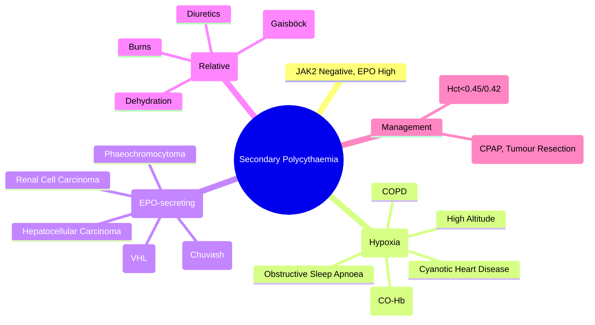

# Secondary Polycythaemia

> [!info] **Davidson Ch 25 Alignment**: Anaemia and Red Cell Disorders → Polycythaemia → Secondary Polycythaemia
> **FCPS/MRCP Focus**: Distinction from PV (JAK2 negative), Causes (Hypoxia, EPO-secreting tumours), Congenital causes, Management

---

## 🎯 Learning Objectives

- [ ] Define **Secondary Polycythaemia**: **Erythrocytosis driven by elevated EPO** (appropriate or inappropriate)
- [ ] Distinguish from **Polycythaemia Vera**: **JAK2 negative**, **EPO elevated** (vs low/normal in PV)
- [ ] Classify: **Appropriate** (Hypoxia-driven) vs **Inappropriate** (EPO-secreting tumours, Congenital)
- [ ] Diagnose: **EPO level**, **JAK2 mutation**, **Abdominal imaging** (Renal, Hepatic, Cerebellar), **Sleep study** (OSA)
- [ ] Manage: **Treat underlying cause**, **Phlebotomy if symptomatic**, **Target Hb/Hct similar to PV**

---

## 📖 Definition & Classification

| Type | Mechanism | EPO Level | Examples |
|------|-----------|-----------|----------|
| **Appropriate (Physiological)** | **Hypoxia** → ↑ EPO | **Appropriately ↑** | High altitude, COPD, Cyanotic heart disease, Sleep apnoea, Smoking |
| **Inappropriate (Pathological)** | **EPO-secreting tumour** or **Genetic** | **Inappropriately ↑** (for O₂ level) | Renal cell carcinoma, Hepatocellular carcinoma, Cerebellar haemangioblastoma, Phaeochromocytoma, Congenital (EPOR mutation) |

> [!tip] **Secondary Polycythaemia = JAK2 NEGATIVE + EPO ELEVATED**. **PV = JAK2 POSITIVE + EPO LOW/NORMAL**. **Appropriate = Hypoxia**. **Inappropriate = EPO-secreting tumour/Genetic**.

---

## 🔬 Pathophysiology

```mermaid
flowchart TD
    A[Stimulus] --> B[Renal/Extrarenal EPO Production]
    B --> C[↑ EPO → Bone Marrow]
    C --> D[↑ Erythropoiesis → Polycythaemia]
    
    A --> A1[Hypoxia (Appropriate)] 
    A1 --> A2[High Altitude, COPD, Cyanotic Heart, Sleep Apnoea, Smoking (CO)]
    A --> A3[Inappropriate EPO Secretion] 
    A3 --> A4[Renal Cell Carcinoma, Hepatoma, Cerebellar Haemangioblastoma, Phaeochromocytoma, Uterine Fibroids]
    A3 --> A5[Congenital: EPOR Mutation, VHL Mutation (Chuvash Polycythemia)]
```

---

## 🔬 Diagnostic Workup

```mermaid
flowchart TD
    A[Polycythaemia: Hb/Hct Elevated] --> B[**JAK2 V617F / Exon 12**]
    B --> C{**JAK2 Positive?**}
    C -->|Yes| D[**Polycythaemia Vera**]
    C -->|No| E[**Secondary Polycythaemia**]
    E --> F[**Serum EPO Level**]
    F --> G{**EPO Elevated?**}
    G -->|Yes| H[**Secondary Polycythaemia Confirmed**]
    H --> I{**Appropriate or Inappropriate?**}
    I -->|**Hypoxia**| J[**Appropriate: Sleep Study, Echo, ABG, CXR**]
    I -->|**No Hypoxia**| K[**Inappropriate: Tumour Screen (Renal US, CT Abdomen, Brain MRI), Genetic (EPOR, VHL)**]
    G -->|No| L[**Apparent Polycythaemia** (Volume depletion)]
```

### Key Investigations

| Test | Polycythaemia Vera | Secondary Polycythaemia |
|------|-------------------|------------------------|
| **JAK2 V617F / Exon 12** | **Positive** | **Negative** |
| **Serum EPO** | **Low / Normal** | **Elevated** |
| **Arterial Blood Gas** | Normal | **Hypoxaemia** (if appropriate) |
| **Sleep Study** | Not indicated | **If OSA suspected** |
| **Renal Ultrasound / CT** | Not indicated | **Renal tumour screen** (Inappropriate) |
| **Brain MRI** | Not indicated | **Cerebellar haemangioblastoma** (Inappropriate) |
| **Genetic Testing** | Not indicated | **EPOR, VHL** (Congenital) |

---

## 🩺 Causes by Category

### 1. Appropriate Secondary Polycythaemia (Hypoxia-driven)

| Cause | Mechanism |
|-------|-----------|
| **High Altitude** | ↓ pO₂ → ↑ EPO |
| **COPD** | Chronic hypoxaemia → ↑ EPO |
| **Cyanotic Congenital Heart Disease** | Right-to-left shunt → Hypoxaemia |
| **Obstructive Sleep Apnoea (OSA)** | Intermittent nocturnal hypoxia → ↑ EPO |
| **Heavy Smoking** | **CO binds Hb** → Functional anaemia → ↑ EPO |
| **High Affinity Hb Variants** | ↓ O₂ release → Tissue hypoxia → ↑ EPO |
| **Chronic Carbon Monoxide Exposure** | CO-Hb → Functional anaemia |

### 2. Inappropriate Secondary Polycythaemia (EPO-secreting)

| Tumour | Frequency | EPO Production |
|--------|-----------|----------------|
| **Renal Cell Carcinoma** | **Most common** | High |
| **Hepatocellular Carcinoma** | Common | High |
| **Cerebellar Haemangioblastoma** | Classic (VHL) | High |
| **Phaeochromocytoma** | Rare | Variable |
| **Uterine Fibroids / Leiomyoma** | Rare | Variable |
| **Other** | Very rare | |

### 3. Congenital Causes

| Syndrome | Gene | Mechanism |
|----------|------|-----------|
| **Familial Erythrocytosis** | **EPOR** (Gain-of-function) | Hypersensitive EPO receptor |
| **Chuvash Polycythemia** | **VHL** (Loss-of-function) | HIF stabilisation → ↑ EPO |
| **High-affinity Hb Variants** | **HBB/HBA** | ↑ O₂ affinity → Tissue hypoxia |

---

## 🔬 Apparent (Relative) Polycythaemia

| Feature | Details |
|---------|---------|
| **Definition** | **Normal Red Cell Mass**, **Reduced Plasma Volume** |
| **Causes** | **Dehydration**, Diuretics, Obesity (Gaisböck syndrome), Burns, Third-space losses |
| **Lab** | **Hb/Hct ↑**, **Normal Red Cell Mass** (Cr-51), **Normal EPO** |
| **Management** | **Volume Repletion** (Oral/IV fluids), Treat underlying cause |

---

## 💊 Management

| Scenario | Management |
|----------|------------|
| **Appropriate (Hypoxia)** | **Treat underlying cause**: CPAP for OSA, Smoking cessation, Treat COPD/Heart disease; **Phlebotomy** if symptomatic (Hct >0.54) |
| **Inappropriate (Tumour)** | **Treat tumour** (Surgery, Ablation); **Phlebotomy** if symptomatic |
| **Congenital** | **Genetic counselling**; **Phlebotomy** if symptomatic |
| **Apparent Polycythaemia** | **Volume repletion** (IV fluids), Treat cause (Diuretic adjustment) |
| **Phlebotomy Target** | **Hct <0.45 (Men), <0.42 (Women)** (Same as PV) |

---

## 🔄 Differential Diagnosis

| Condition | JAK2 | EPO | Key Differentiator |
|-----------|------|-----|-------------------|
| **Polycythaemia Vera** | **Positive** | Low/Normal | JAK2+, Low EPO |
| **Secondary (Appropriate)** | Negative | **High** | Hypoxia, Appropriate EPO |
| **Secondary (Inappropriate)** | Negative | **High** | No Hypoxia, Tumour/Congenital |
| **Apparent Polycythaemia** | Negative | Normal | **Low Plasma Volume**, Normal RCM |

---

## 💡 FCPS/MRCP High-Yield Summary

| Topic | Key Point |
|-------|-----------|
| **Definition** | **JAK2 Negative + EPO High** = Secondary Polycythaemia |
| **Appropriate** | **Hypoxia** → COPD, High altitude, Cyanotic heart disease, **OSA**, Smoking |
| **Inappropriate** | **EPO-secreting tumours** (RCC, Hepatoma, Cerebellar haemangioblastoma) or **Congenital** (EPOR, VHL) |
| **Apparent Polycythaemia** | **Volume depletion** (Dehydration, Diuretics, Obesity/Gaisböck), **Normal RCM, Normal EPO** |
| **Diagnosis** | **JAK2 Negative + EPO Level** → **EPO High = Secondary** |
| **Investigations** | **ABG, Sleep Study, Echo, Renal US/CT, Brain MRI, EPOR/VHL Genetics** |
| **Management** | **Treat Cause** (CPAP, Tumour resection, Smoking cessation); **Phlebotomy if Symptomatic** |
| **Phlebotomy Target** | **Hct <0.45 (Men), <0.42 (Women)** |

---

## ❓ Viva Questions

1. **How do you distinguish Secondary Polycythaemia from Polycythaemia Vera?**
   - **JAK2 Negative** in Secondary; **JAK2 Positive** in PV; **EPO Elevated** in Secondary vs **Low/Normal** in PV

2. **What are the causes of Appropriate Secondary Polycythaemia?**
   - **Hypoxia**: High altitude, COPD, Cyanotic heart disease, **Obstructive Sleep Apnoea**, Smoking (CO-Hb)

3. **What tumours cause Inappropriate Secondary Polycythaemia?**
   - **Renal Cell Carcinoma** (most common), **Hepatocellular Carcinoma**, **Cerebellar Haemangioblastoma**, Phaeochromocytoma, Uterine fibroids

4. **What is Chuvash Polycythemia and its genetic basis?**
   - **Congenital erythrocytosis** due to **VHL mutation** (Loss-of-function) → **HIF stabilisation** → ↑ EPO

5. **How does Apparent Polycythaemia differ from true Polycythaemia?**
   - **Apparent: Normal Red Cell Mass, Low Plasma Volume, Normal EPO**; **True: Increased RCM, High/Normal EPO**

5. **What is the target Haematocrit for phlebotomy in Secondary Polycythaemia?**
   - **Hct <0.45 (Men), <0.42 (Women)** (Same as PV)

6. **What investigation distinguishes COPD-related polycythaemia from Polycythaemia Vera?**
   - **Serum EPO** (High in COPD, Low in PV) + **JAK2** (Negative in COPD, Positive in PV)

7. **What is the most common cause of Inappropriate Secondary Polycythemia?**
   - **Renal Cell Carcinoma**

8. **What is the management of Secondary Polycythaemia due to Obstructive Sleep Apnoea?**
   - **CPAP therapy** (Treats hypoxia) + **Phlebotomy if symptomatic** (Hct >0.54)

8. **How does smoking cause Polycythemia?**
   - **Carbon Monoxide binds Hb** → Functional anaemia → ↑ EPO production

9. **What is the difference between Secondary Polycythemia and Relative Polycythemia?**
   - **Secondary: True increase in RCM, High EPO**; **Relative: Normal RCM, Low Plasma Volume, Normal EPO**

10. **What genetic mutations cause congenital erythrocytosis?**
    - **EPOR (Gain-of-function)** and **VHL (Loss-of-function - Chuvash)**

---

## 🧠 Confusions & Mnemonics

| Confusion | Clarification |
|-----------|---------------|
| **Secondary vs PV** | **PV = JAK2+, EPO Low**; **Secondary = JAK2-, EPO High** |
| **Appropriate vs Inappropriate** | **Appropriate = Hypoxia**; **Inappropriate = Tumour/Congenital (No Hypoxia)** |
| **Secondary vs Apparent** | **Secondary = True RCM↑, EPO↑**; **Apparent = Normal RCM, Plasma Volume↓, EPO Normal** |
| **Chuvash vs Familial** | **Chuvash = VHL mutation (HIF stabilisation)**; **Familial = EPOR mutation (EPO-R hypersensitivity)** |
| **Smoking Polycythemia** | **CO binds Hb → Functional Anaemia → ↑ EPO** (Not direct stimulation) |

| Mnemonic | Meaning |
|----------|---------|
| **"PV = JAK2+ , EPO Low"** | PV vs Secondary |
| **"Secondary = EPO High"** | Key lab |
| **"Appropriate = Hypoxia"** | COPD, Altitude, OSA |
| **"Inappropriate = Tumour (RCC, Hepatoma, Haemangioblastoma)"** | EPO-secreting tumours |
| **"Chuvash = VHL = HIF → EPO"** | Chuvash polycythemia |
| **"Apparent = Volume Down = Haemoconcentration"** | Relative polycythaemia |

---

## 🗺️ Mind Map



---

## 📋 One-Page Revision Card

| **SECONDARY POLYCYTHAEMIA – FCPS/MRCP REVISION CARD** |
|--------------------------------------------------------|
| **Definition**: **JAK2 Negative + EPO High** |
| **Appropriate**: **Hypoxia** (COPD, Altitude, Cyanotic Heart, OSA, Smoking) |
| **Inappropriate**: **EPO-secreting Tumours** (RCC, Hepatoma, Haemangioblastoma) or **Congenital** (EPOR, VHL/Chuvash) |
| **Apparent Polycythemia**: **Normal RCM, Low Plasma Volume, Normal EPO** (Dehydration, Diuretics, Obesity) |
| **Diagnosis**: **JAK2 Neg + EPO High** → Secondary; **EPO Low/Normal + JAK2 Pos** → PV |
| **Workup**: ABG, Sleep Study, Renal/Abdo CT, Brain MRI, EPOR/VHL Genetics |
| **Management**: **Treat Cause** (CPAP, Tumour Resection, Smoking Cessation) |
| **Phlebotomy**: **Hct <0.45 (M) / <0.42 (F)** if Symptomatic |

---

## 📅 Spaced Repetition Tracker

| Review | Date | Score (1-5) | Next Review |
|--------|------|-------------|-------------|
| Day 1 | 2025-06-17 | | 2025-06-18 |
| Day 3 | | | |
| Day 7 | | | |
| Day 15 | | | |
| Day 30 | | | |

---

## 🎯 Must Know / Should Know / Nice to Know

| Level | Content |
|-------|---------|
| **Must Know** | JAK2 Neg + EPO High = Secondary; Appropriate (Hypoxia) vs Inappropriate (Tumour/Congenital); JAK2+ = PV; EPO Low = PV; Causes of appropriate/inappropriate; Apparent polycythaemia; Phlebotomy targets |
| **Should Know** | Chuvash polycythemia (VHL), Familial erythrocytosis (EPOR), High-affinity Hb variants, Smoking mechanism (CO-Hb), OSA as common cause, Tumour screening protocol, Phlebotomy technique, Complications of phlebotomy, Genetic counselling |
| **Nice to Know** | HIF pathway in erythropoiesis, VHL-HIF axis, EPOR signalling, High-affinity haemoglobin variants, Phaeochromocytoma erythrocytosis mechanism, Renal cyst vs RCC differentiation, Cost-effectiveness of JAK2 testing, Quality of life in erythrocytosis, Erythropoietin receptor structure/function |

---

## ✅ Self-Test Scorecard

| Section | Score (0-10) | Notes |
|---------|--------------|-------|
| Definition & Classification | | |
| Appropriate vs Inappropriate Causes | | |
| Apparent vs True Polycythaemia | | |
| Diagnostic Workup | | |
| Management | | |
| Viva Questions | | |

---

## 🔗 Local Navigation

- **Previous**: [[Polycythaemia Vera]]
- **Next**: [[Apparent Polycythaemia]]
- **Section Hub**: [[Anaemia and Red Cell Disorders]]
- **MOC**: [[Hematology MOC]]
- **Template**: [[../Templates/Hematology Topic Template]]

---

*Generated for FCPS/MRCP exam preparation. Based on Davidson Medicine 24th Ed Chapter 25.*
---

> Auto-generated study sections for "Hematology" — Ch 24: Haematology & Transfusion Medicine.

## Flashcards (28 generated)

- Q: What is High Altitude of Hematology?
  A: ↓ pO₂ → ↑ EPO
- Q: What is COPD of Hematology?
  A: Chronic hypoxaemia → ↑ EPO
- Q: What is Cyanotic Congenital Heart Disease of Hematology?
  A: Right-to-left shunt → Hypoxaemia
- Q: What is Obstructive Sleep Apnoea (OSA) of Hematology?
  A: Intermittent nocturnal hypoxia → ↑ EPO
- Q: What is Heavy Smoking of Hematology?
  A: CO binds Hb → Functional anaemia → ↑ EPO
- Q: What is High Affinity Hb Variants of Hematology?
  A: ↓ O₂ release → Tissue hypoxia → ↑ EPO
- Q: What is Chronic Carbon Monoxide Exposure of Hematology?
  A: CO-Hb → Functional anaemia
- Q: What is the definition of Hematology?
  A: Normal Red Cell Mass, Reduced Plasma Volume
- Q: What causes Hematology?
  A: Dehydration, Diuretics, Obesity (Gaisböck syndrome), Burns, Third-space losses
- Q: What is Lab of Hematology?
  A: Hb/Hct ↑, Normal Red Cell Mass (Cr-51), Normal EPO
- Q: How is Hematology managed?
  A: Volume Repletion (Oral/IV fluids), Treat underlying cause
- Q: What is High Altitude of Hematology?
  A: ↓ pO₂ → ↑ EPO
- Q: What is COPD of Hematology?
  A: Chronic hypoxaemia → ↑ EPO
- Q: What is Cyanotic Congenital Heart Disease of Hematology?
  A: Right-to-left shunt → Hypoxaemia
- Q: What is Obstructive Sleep Apnoea (OSA) of Hematology?
  A: Intermittent nocturnal hypoxia → ↑ EPO
- Q: What is Heavy Smoking of Hematology?
  A: CO binds Hb → Functional anaemia → ↑ EPO
- Q: What is High Affinity Hb Variants of Hematology?
  A: ↓ O₂ release → Tissue hypoxia → ↑ EPO
- Q: What is the definition of Hematology?
  A: Normal Red Cell Mass, Reduced Plasma Volume
- Q: What causes Hematology?
  A: Dehydration, Diuretics, Obesity (Gaisböck syndrome), Burns, Third-space losses
- Q: What is Lab of Hematology?
  A: Hb/Hct ↑, Normal Red Cell Mass (Cr-51), Normal EPO
- Q: How is Hematology managed?
  A: Volume Repletion (Oral/IV fluids), Treat underlying cause
- Q: What is the definition of Hematology?
  A: JAK2 Negative + EPO High = Secondary Polycythaemia
- Q: What is Appropriate of Hematology?
  A: Hypoxia → COPD, High altitude, Cyanotic heart disease, OSA, Smoking
- Q: What is Inappropriate of Hematology?
  A: EPO-secreting tumours (RCC, Hepatoma, Cerebellar haemangioblastoma) or Congenital (EPOR, VHL)
- Q: What is Apparent Polycythaemia of Hematology?
  A: Volume depletion (Dehydration, Diuretics, Obesity/Gaisböck), Normal RCM, Normal EPO
- Q: What is the investigation of choice for Hematology?
  A: JAK2 Negative + EPO Level → EPO High = Secondary
- Q: How is Hematology managed?
  A: Treat Cause (CPAP, Tumour resection, Smoking cessation); Phlebotomy if Symptomatic
- Q: What is Phlebotomy Target of Hematology?
  A: Hct <0.45 (Men), <0.42 (Women)

## MCQs (1 generated)

1. **Which of the following best describes Hematology?**
   A. **[!info] Davidson Ch 25 Alignment: Anaemia and Red Cell Disorders → Polycythaemia → Secondary Polycythaemia**
   B. An unrelated condition not matching the clinical picture of Hematology
   C. A complication seen late in the disease course of Hematology
   D. A condition that mimics Hematology but has a different underlying cause

## SBA Questions (1 generated)

1. A patient with suspected Hematology presents with: Appropriate (Physiological) — Hypoxia → ↑ EPO; Inappropriate (Pathological) — EPO-secreting tumour or Genetic; [!tip] Secondary Polycythaemia = JAK2 NEGATIVE + EPO ELEVATED. PV = JAK2 POSITIVE + EPO LOW/NORMAL. Appropriate = Hypoxia. Inappropriate = EPO-secreting tumour/Genetic.. What is the most likely diagnosis?
   A. **Hematology**
   B. A condition that mimics Hematology but is not the same entity
   C. A complication of Hematology rather than the primary diagnosis
   D. An unrelated condition in the same clinical category as Hematology

