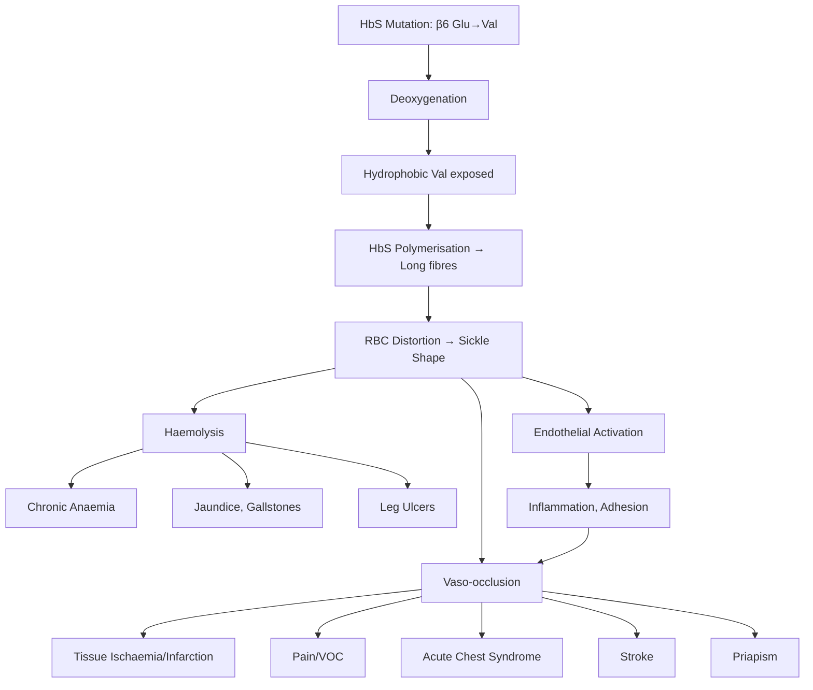
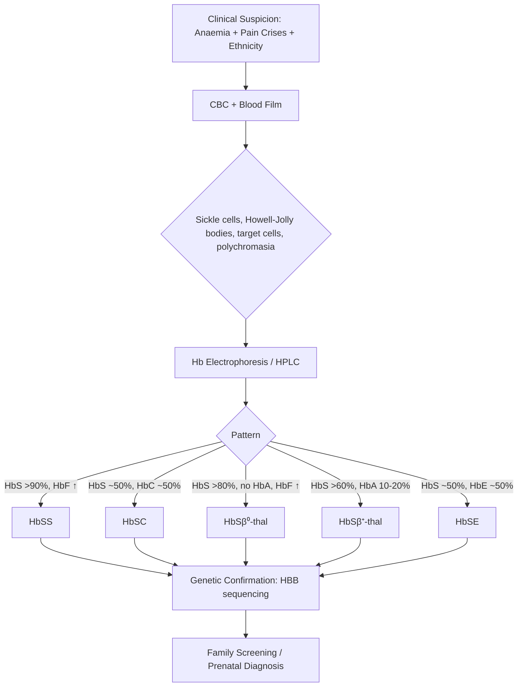
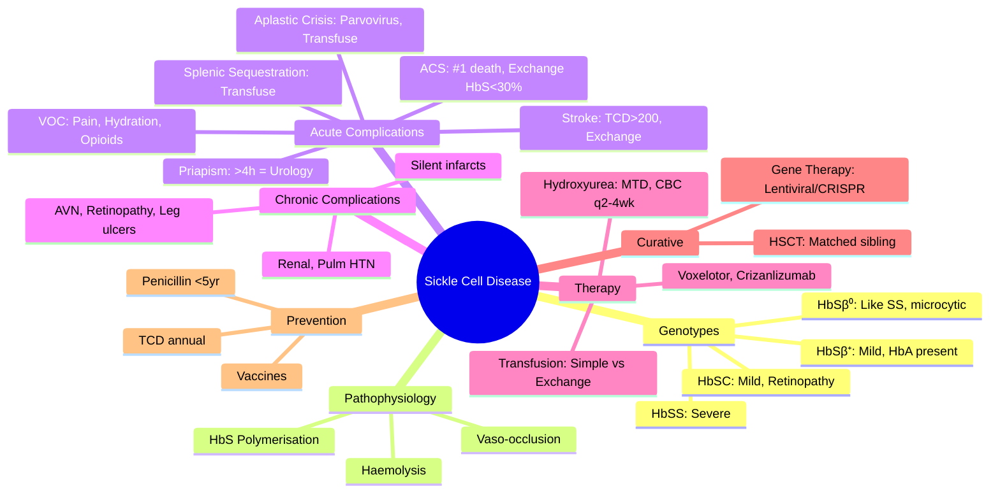

# Sickle Cell Disease (SCD)

> [!info] **Davidson Ch 25 Alignment**: Haemoglobinopathies → Sickle Cell Disease
> **FCPS/MRCP Focus**: Pathophysiology of sickling, vaso-occlusive crises, acute chest syndrome, stroke prevention, hydroxyurea, transplantation

---

## 🎯 Learning Objectives

- [ ] Define sickle cell disease: HbS mutation (Glu6Val), autosomal recessive inheritance
- [ ] Explain pathophysiology: polymerisation of deoxy-HbS → sickling → vaso-occlusion + haemolysis
- [ ] Classify SCD genotypes: HbSS, HbSC, HbSβ⁰-thal, HbSβ⁺-thal, HbSE
- [ ] Diagnose: CBC, blood film, Hb electrophoresis/HPLC, solubility test, genetic confirmation
- [ ] Manage acute complications: VOC, acute chest syndrome, stroke, priapism, splenic sequestration, aplastic crisis
- [ ] Manage chronic complications: avascular necrosis, leg ulcers, renal, pulmonary hypertension, retinopathy
- [ ] Disease-modifying therapy: Hydroxyurea (indications, dosing, monitoring), voxelotor, crizanlizumab
- [ ] Curative: Allogeneic HSCT, gene therapy (lentiviral/CRISPR)
- [ ] Preventive: Penicillin prophylaxis, vaccinations, TCD screening, hydroxyurea
- [ ] Pregnancy management in SCD

---

## 📖 Definition & Classification

| Genotype | Haemoglobin Composition | Severity | Prevalence |
|----------|------------------------|----------|------------|
| **HbSS** (Homozygous) | HbS >90%, HbF ↑ | **Most severe** | Most common |
| **HbSC** | HbS ~50%, HbC ~50% | Moderate | Common in West Africa |
| **HbSβ⁰-thalassaemia** | HbS >80%, HbF ↑, no HbA | Severe (like HbSS) | Mediterranean, Middle East |
| **HbSβ⁺-thalassaemia** | HbS >60%, HbA 10-20% | Mild-moderate | Mediterranean |
| **HbSE** | HbS ~50%, HbE ~50% | Mild | Southeast Asia |
| **HbSHPFH** | HbS ~30%, HbF ~70% | Very mild/asymptomatic | Rare |

> [!tip] **FCPS/MRCP Key**: **HbSS = most severe; HbSC = milder but more proliferative retinopathy/aseptic necrosis; HbSβ⁰ = clinically like HbSS**

---

## ⚙️ Pathophysiology

**Dual Pathophysiology:**
- **Vaso-occlusion**: Sickle cells + activated endothelium + leukocytes → microvascular obstruction
- **Haemolysis**: Intravascular → nitric oxide scavenging → endothelial dysfunction, pulmonary HTN

---

## 🔬 Diagnostic Workup

### Key Diagnostic Findings

| Test | HbSS | HbSC | HbSβ⁰-thal | HbSβ⁺-thal | Trait (HbAS) |
|------|------|------|------------|------------|--------------|
| **HbS** | >90% | ~50% | >80% | >60% | ~40% |
| **HbA** | 0% | 0% | 0% | 10-20% | ~60% |
| **HbF** | ↑↑ (5-20%) | ↑ | ↑↑ | ↑ | Normal |
| **HbA2** | Normal | Normal | **↑↑ (>3.5%)** | **↑↑** | Normal |
| **HbC** | 0% | ~50% | 0% | 0% | 0% |
| **MCV** | Normal/↑ | Normal | **↓↓** | **↓** | Normal |
| **Blood Film** | Sickle cells, target cells, Howell-Jolly | Target cells, few sickle cells, HbC crystals | Microcytic, target cells, sickle cells | Microcytic, target cells, sickle cells | Normal/occasional target cells |
| **Solubility Test** | +ve | +ve | +ve | +ve | +ve |

---

## 🩺 Clinical Features: Acute Complications

### 1. Vaso-occlusive Crisis (VOC) – Most Common
- **Pain**: Severe, acute, often back/chest/extremities; dactylitis in infants (hand-foot syndrome)
- **Trigger**: Cold, dehydration, infection, stress, hypoxia, alcohol
- **Management**: **Aggressive hydration**, **analgesia ladder** (NSAIDs → weak opioids → **IV morphine/PCA**), oxygen if hypoxic, treat trigger

### 2. Acute Chest Syndrome (ACS) – Leading Cause of Death
| Feature | Details |
|---------|---------|
| **Definition** | New pulmonary infiltrate + fever + respiratory symptoms |
| **Causes** | Infection (Strep pneumo, Chlamydia, Mycoplasma), fat embolism, vaso-occlusion |
| **Presentation** | Fever, cough, chest pain, tachypnoea, hypoxia, wheeze |
| **CXR** | New infiltrate (often multilobar, upper lobe) |
| **Management** | **Oxygen**, **broad-spectrum antibiotics** (ceftriaxone + macrolide), **bronchodilators**, **incentive spirometry**, **simple or exchange transfusion** (target HbS <30%) |

### 3. Stroke (Overt & Silent)
- **Overt**: Hemiparesis, aphasia, seizures – **emergency exchange transfusion** (target HbS <30%)
- **Silent**: MRI infarcts without clinical signs → neurocognitive impairment
- **Prevention**: **TCD screening annually age 2-16**; if TCD >200 cm/s → chronic transfusion programme

### 4. Priapism
- **Stuttering**: Recurrent, self-limiting (<3-4h)
- **Major**: >4h – **urological emergency** (aspiration/irrigation, phenylephrine injection)
- **Prevention**: Hydroxyurea, etilefrine, PDE5 inhibitors (controversial)

### 5. Splenic Sequestration Crisis
- **Definition**: Sudden spleen enlargement + Hb drop ≥2 g/dL + reticulocytosis
- **Age**: Mostly 6 months – 5 years (before autosplenectomy)
- **Management**: **Urgent transfusion** (small aliquots, avoid hyperviscosity), splenectomy if recurrent

### 6. Aplastic Crisis
- **Cause**: Parvovirus B19 infection → pure red cell aplasia
- **Features**: Sudden severe anaemia, reticulocytopenia
- **Management**: **Supportive transfusion**, IVIG if immunocompromised; self-limiting 7-10 days

---

## 🩺 Clinical Features: Chronic Complications

| System | Complication | Screening/Management |
|--------|--------------|----------------------|
| **Bone** | Avascular necrosis (femoral/humeral head) | MRI early; core decompression, joint replacement |
| **Bone** | Osteomyelitis (Salmonella, Staph) | Blood culture, MRI, prolonged antibiotics |
| **Eye** | Proliferative retinopathy (HbSC > HbSS) | Annual ophthalmology from age 10; laser/anti-VEGF |
| **Renal** | Papillary necrosis, proteinuria, CKD, renal medullary carcinoma | Annual UACR, eGFR; ACEi for proteinuria |
| **Lung** | Pulmonary hypertension (tricuspid regurgitant velocity >2.5 m/s) | Annual Echo; refer if TRV >2.5 |
| **Skin** | Leg ulcers (malollear) | Zinc, dressings, hydroxyurea, skin grafts |
| **CNS** | Silent infarcts, cognitive decline | MRI surveillance; school support |
| **Gallbladder** | Pigment gallstones | Cholecystectomy if symptomatic |

---

## 💊 Disease-Modifying Therapy

### Hydroxyurea (HU) – **First-line for HbSS & HbSβ⁰**
| Aspect | Details |
|--------|---------|
| **Mechanism** | ↑ HbF (γ-globin), ↓ neutrophil count, ↓ adhesion molecules |
| **Indications** | HbSS/HbSβ⁰: ≥3 VOC/yr, ACS, severe anaemia, symptomatic; **all adults with HbSS** |
| **Dosing** | Start 15 mg/kg/day → escalate q8wk by 5 mg/kg to **MTD** (max 35 mg/kg) |
| **Monitoring** | **CBC q2-4wk** (ANC >1.5, Plt >80), HbF%, MCV↑, renal/LFT |
| **Response** | ↑ HbF >20%, ↓ VOC/ACS/transfusion, ↑ Hb by 1-2 g/dL |
| **Contraindications** | Pregnancy, severe cytopenias, hypersensitivity |
| **Time to effect** | 3-6 months |

### Newer Agents (Adjunct/Refractory)
| Agent | Mechanism | Indication | Key Points |
|-------|-----------|------------|------------|
| **Voxelotor** | HbS polymerisation inhibitor (binds α-chain) | HbSS ≥12y, Hb ≤10.5 g/dL | ↑ Hb, ↓ haemolysis; monitor LFT |
| **Crizanlizumab** | Anti-P-selectin (blocks adhesion) | HbSS ≥16y, recurrent VOC | IV monthly; ↓ VOC rate; thrombocytopenia risk |
| **L-glutamine** | Reduces RBC oxidative stress | HbSS ≥5y | Oral; ↓ ACS/VOC |

> [!tip] **FCPS/MRCP**: **Hydroxyurea is first-line, dose to MTD, monitor CBC 2-4 weekly**. Voxelotor/crizanlizumab are add-ons for refractory cases.

---

## 🩸 Transfusion in SCD

| Type | Indication | Target |
|------|------------|--------|
| **Simple Top-up** | Acute severe anaemia (aplastic crisis, splenic sequestration), pre-op Hb <9 | Hb 10 g/dL (avoid >11 = hyperviscosity) |
| **Exchange Transfusion** | ACS, stroke, multi-organ failure, priapism >4h, pre-op major surgery | **HbS <30%**, Hb ~10 g/dL |
| **Chronic Transfusion** | Stroke prevention (TCD >200 or prior stroke), recurrent ACS/VOC on HU | HbS <30%, pre-tx Hb 9-10.5 |
| **Pre-op** | Elective surgery (moderate-high risk) | HbS <30% (exchange) or top-up to Hb 10 |

---

## 🏥 Preventive Care & Monitoring Schedule

| Intervention | Schedule |
|--------------|----------|
| **Penicillin V prophylaxis** | 125 mg BD <3yr, 250 mg BD 3-5yr (or lifelong if splenectomy/prev invasive pneumococcal) |
| **Vaccinations** | PCV13, PPSV23 (2mo post-PCV), MenACWY, Hib, Hep B, annual flu, COVID |
| **Folic acid** | 5 mg daily lifelong |
| **TCD Screening** | Annual age 2-16 yr (HbSS, HbSβ⁰) |
| **Ophthalmology** | Annual from age 10 (HbSC earlier) |
| **Echo (TRV)** | Annual from age 10 |
| **Renal (UACR, eGFR)** | Annual from age 10 |
| **Hydroxyurea monitoring** | CBC q2-4wk during escalation; q3mo at stable dose |
| **Iron overload (if chronic tx)** | Ferritin q3mo, MRI LIC/T2* annually |

---

## 🌱 Curative Therapy

| Option | Indication | Outcome |
|--------|------------|---------|
| **Allogeneic HSCT** | HLA-matched sibling, age <16, symptomatic (stroke, recurrent VOC/ACS) | 90% OS, 85% event-free survival; GVHD risk |
| **Gene Therapy (Lentiviral - lovotibeglogene autotemcel)** | HbSS ≥12y, recurrent VOC | ~90% VOC-free; inserting anti-sickling β-globin (β^A-T87Q) |
| **Gene Editing (CRISPR - exagamglogene autotemcel)** | HbSS ≥12y, recurrent VOC | ~90% VOC-free; BCL11A enhancer editing → ↑HbF |

---

## 🤰 Pregnancy in SCD
- **Pre-conception**: Partner screening, hydroxyurea **stop 3 months prior**, optimize vaccinations, folic acid 5mg
- **Antenatal**: Monthly visits, serial USS (growth), TCD not in pregnancy, **prophylactic transfusion debated** (some do chronic tx to keep HbS <30%)
- **Delivery**: Plan at 38-39 weeks; regional anaesthesia preferred; avoid dehydration/hypoxia/cold
- **Postpartum**: High risk VOC, ACS, thrombosis – **thromboprophylaxis**, close monitoring

---

## 🔄 Differential Diagnosis

| Condition | Distinguishing Feature |
|-----------|------------------------|
| **HbSC Disease** | Milder anaemia, target cells + HbC crystals, more retinopathy/AVN |
| **HbSβ-thalassaemia** | Microcytosis, ↑HbA2; β⁰ = no HbA (like SS), β⁺ = some HbA |
| **Other haemolytic anaemias** | No sickle cells on film, negative solubility test, different Hb pattern |
| **Vaso-occlusive pain vs other abdominal pain** | History of SCD, typical distribution, responds to analgesia/hydration |

---

## 💡 FCPS/MRCP High-Yield Summary

| Topic | Key Point |
|-------|-----------|
| **Mutation** | β6 Glu→Val (GAG→GTG); autosomal recessive |
| **Genotypes** | HbSS (severe), HbSC (mild-mod, retinopathy), HbSβ⁰ (like SS), HbSβ⁺ (mild) |
| **Diagnosis** | HPLC: HbS%, HbA2 (↑ in Sβ-thal), HbF; solubility test +ve |
| **VOC Management** | Hydration + **IV morphine/PCA** + NSAIDs + treat trigger + oxygen if hypoxic |
| **ACS** | **#1 cause of death**; CxR new infiltrate + fever + resp sx → **ceftriaxone + azithromycin + exchange tx (HbS<30%)** |
| **Stroke Prevention** | **TCD annually 2-16yr**; >200 cm/s → chronic transfusion (HbS<30%) |
| **Priapism** | >4h = **urological emergency** (aspirate/irrigate/phenylephrine) |
| **Hydroxyurea** | Start 15 mg/kg → **MTD (max 35 mg/kg)**, **CBC q2-4wk**, target HbF>20% |
| **Exchange Transfusion Target** | **HbS <30%**, Hb ~10 g/dL |
| **Penicillin Prophylaxis** | **<5 years** (or lifelong if splenectomy/invasive pneumococcal) |
| **Curative** | **HSCT** (matched sibling); **Gene therapy** (lentiviral anti-sickling β-globin / CRISPR BCL11A) |

---

## ❓ Viva Questions

1. **What is the molecular defect in sickle cell disease?**
   - Point mutation in β-globin gene (HBB): Glu6Val (GAG→GTG) on chromosome 11

2. **How do you differentiate HbSS from HbSβ⁰-thalassaemia on HPLC?**
   - Both have HbS >80%, no HbA, ↑HbF; **HbSβ⁰ has ↑HbA2 >3.5% and microcytosis**

3. **What is the management of acute chest syndrome?**
   - Oxygen, IV ceftriaxone + azithromycin, bronchodilators, incentive spirometry, **exchange transfusion to HbS<30%**

4. **When do you screen with TCD and what is the action threshold?**
   - Annual age 2-16 for HbSS/HbSβ⁰; **>200 cm/s = chronic transfusion programme**

5. **Describe hydroxyurea dosing and monitoring.**
   - Start 15 mg/kg/day, escalate 5 mg/kg q8wk to MTD (max 35 mg/kg); **CBC q2-4wk (ANC>1.5, Plt>80)**

6. **What is the transfusion target for stroke in SCD?**
   - **Emergency exchange transfusion**: HbS <30%, Hb ~10 g/dL

7. **How do you manage priapism >4 hours?**
   - **Urological emergency**: aspiration/irrigation ± intracavernosal phenylephrine

8. **What vaccinations are essential in SCD?**
   - PCV13, PPSV23 (2mo after PCV), MenACWY, Hib, annual flu, COVID; Hep B

9. **Why is hydroxyurea contraindicated in pregnancy?**
   - Teratogenic (animal data); stop **3 months pre-conception**

10. **Differentiate HbSC from HbSS clinically.**
    - HbSC: milder anaemia, less VOC, **more proliferative retinopathy & aseptic necrosis**, target cells + HbC crystals

---

## 🧠 Confusions & Mnemonics

| Confusion | Clarification |
|-----------|---------------|
| **HbSS vs HbSβ⁰-thal** | Both no HbA, ↑HbF; **Sβ⁰ has ↑HbA2 + microcytosis** |
| **HbSC vs HbSS** | HbSC: milder, **more retinopathy/AVN**, HbC crystals |
| **Simple vs Exchange Tx** | Simple: top-up (avoid Hb>11); **Exchange: HbS<30% (stroke, ACS, pre-op)** |
| **TCD threshold** | **>200 cm/s = action**; 170-199 = repeat in 3-6mo; <170 = annual |
| **HU in pregnancy** | **Contraindicated** – stop 3 months before conception |

| Mnemonic | Meaning |
|----------|---------|
| **"SS = Severe Sickness"** | HbSS = most severe phenotype |
| **"SC = See Retinopathy"** | HbSC → more proliferative retinopathy |
| **"ACS = Antibiotics + Exchange (HbS<30%)"** | Acute chest syndrome management |
| **"TCD >200 = Transfusion Chronic"** | TCD threshold for chronic transfusion |
| **"HU = HbF Up, Neutrophils Down"** | Hydroxyurea effect + monitoring |
| **"Priapism >4 = Floor (Urology)"** | >4h = urological emergency |

---

## 🗺️ Mind Map

---

## 📋 One-Page Revision Card

| **SICKLE CELL DISEASE – FCPS/MRCP REVISION CARD** |
|----------------------------------------------------|
| **Genotypes**: HbSS (severe), HbSC (retinopathy/AVN), HbSβ⁰ (microcytic, ↑HbA2), HbSβ⁺ (mild) |
| **Diagnosis**: HPLC – HbS%, **HbA2>3.5% = Sβ-thal**, Solubility +ve |
| **VOC**: Hydration + **IV Morphine/PCA** + NSAIDs + O2 if hypoxic |
| **ACS**: **#1 killer** → Ceftriaxone+Azithro + **Exchange HbS<30%** |
| **Stroke**: **TCD annual 2-16y**; **>200 cm/s = Chronic Tx (HbS<30%)** |
| **Priapism**: >4h = **Urology emergency** (aspirate/phenylephrine) |
| **Hydroxyurea**: 15→35 mg/kg MTD, **CBC q2-4wk**, Target HbF>20% |
| **Exchange Target**: **HbS <30%**, Hb ~10 |
| **Penicillin**: <5yr (lifelong if splenectomy) |
| **Vaccines**: PCV13, PPSV23, MenACWY, Flu, COVID |
| **Curative**: HSCT (matched sib), Gene Therapy (Lentiviral β^A-T87Q / CRISPR BCL11A) |
| **Pregnancy**: Stop HU 3mo pre-conception; consider prophylactic exchange |

---

## 📅 Spaced Repetition Tracker

| Review | Date | Score (1-5) | Next Review |
|--------|------|-------------|-------------|
| Day 1 | 2025-06-15 | | 2025-06-16 |
| Day 3 | | | |
| Day 7 | | | |
| Day 15 | | | |
| Day 30 | | | |

---

## 🎯 Must Know / Should Know / Nice to Know

| Level | Content |
|-------|---------|
| **Must Know** | HbS mutation, genotypes, HPLC patterns, VOC/ACS/stroke management, TCD screening, HU dosing/monitoring, exchange HbS<30%, penicillin <5y, curative options |
| **Should Know** | Chronic complications (AVN, retinopathy, renal, pulm HTN), newer agents (voxelotor, crizanlizumab), priapism management, pregnancy considerations, splenic sequestration |
| **Nice to Know** | Exact gene therapy constructs (β^A-T87Q, BCL11A enhancer), TCD velocity categories, detailed pre-op transfusion protocols, leg ulcer management algorithms |

---

## ✅ Self-Test Scorecard

| Section | Score (0-10) | Notes |
|---------|--------------|-------|
| Classification & Genetics | | |
| Pathophysiology | | |
| Diagnostic Workup | | |
| Acute Complications | | |
| Chronic Complications | | |
| Hydroxyurea & Newer Agents | | |
| Transfusion Protocols | | |
| Prevention & Curative | | |
| Viva Questions | | |

---

## 🔗 Local Navigation

- **Previous**: [[Thalassaemia]]
- **Next**: [[Aplastic Anaemia]]
- **Section Hub**: [[Anaemia and Red Cell Disorders]]
- **MOC**: [[Hematology MOC]]
- **Template**: [[../Templates/Hematology Topic Template]]

---

*Generated for FCPS/MRCP exam preparation. Based on Davidson Medicine 24th Ed Chapter 25.*
---

> Auto-generated study sections for "Hematology" — Ch 24: Haematology & Transfusion Medicine.

## Flashcards (25 generated)

- Q: What is the definition of Hematology?
  A: New pulmonary infiltrate + fever + respiratory symptoms
- Q: What causes Hematology?
  A: Infection (Strep pneumo, Chlamydia, Mycoplasma), fat embolism, vaso-occlusion
- Q: What are the clinical features of Hematology?
  A: Fever, cough, chest pain, tachypnoea, hypoxia, wheeze
- Q: What is CXR of Hematology?
  A: New infiltrate (often multilobar, upper lobe)
- Q: How is Hematology managed?
  A: Oxygen, broad-spectrum antibiotics (ceftriaxone + macrolide), bronchodilators, incentive spirometry, simple or exchange transfusion (target HbS <30%)
- Q: What is the definition of Hematology?
  A: New pulmonary infiltrate + fever + respiratory symptoms
- Q: What causes Hematology?
  A: Infection (Strep pneumo, Chlamydia, Mycoplasma), fat embolism, vaso-occlusion
- Q: What are the clinical features of Hematology?
  A: Fever, cough, chest pain, tachypnoea, hypoxia, wheeze
- Q: What is CXR of Hematology?
  A: New infiltrate (often multilobar, upper lobe)
- Q: What is the mechanism of Hematology?
  A: ↑ HbF (γ-globin), ↓ neutrophil count, ↓ adhesion molecules
- Q: What is Hematology indicated for?
  A: HbSS/HbSβ⁰: ≥3 VOC/yr, ACS, severe anaemia, symptomatic; all adults with HbSS
- Q: What is Dosing of Hematology?
  A: Start 15 mg/kg/day → escalate q8wk by 5 mg/kg to MTD (max 35 mg/kg)
- Q: How is Hematology monitored?
  A: CBC q2-4wk (ANC >1.5, Plt >80), HbF%, MCV↑, renal/LFT
- Q: What is Response of Hematology?
  A: ↑ HbF >20%, ↓ VOC/ACS/transfusion, ↑ Hb by 1-2 g/dL
- Q: What is Mutation of Hematology?
  A: β6 Glu→Val (GAG→GTG); autosomal recessive
- Q: How is Hematology classified?
  A: HbSS (severe), HbSC (mild-mod, retinopathy), HbSβ⁰ (like SS), HbSβ⁺ (mild)
- Q: What is the investigation of choice for Hematology?
  A: HPLC: HbS%, HbA2 (↑ in Sβ-thal), HbF; solubility test +ve
- Q: How is Hematology managed?
  A: Hydration + IV morphine/PCA + NSAIDs + treat trigger + oxygen if hypoxic
- Q: What is ACS of Hematology?
  A: #1 cause of death; CxR new infiltrate + fever + resp sx → ceftriaxone + azithromycin + exchange tx (HbS<30%)
- Q: What is Stroke Prevention of Hematology?
  A: TCD annually 2-16yr; >200 cm/s → chronic transfusion (HbS<30%)
- Q: What is Priapism of Hematology?
  A: >4h = urological emergency (aspirate/irrigate/phenylephrine)
- Q: What is Hydroxyurea of Hematology?
  A: Start 15 mg/kg → MTD (max 35 mg/kg), CBC q2-4wk, target HbF>20%
- Q: What is Exchange Transfusion Target of Hematology?
  A: HbS <30%, Hb ~10 g/dL
- Q: What is Penicillin Prophylaxis of Hematology?
  A: <5 years (or lifelong if splenectomy/invasive pneumococcal)
- Q: What is Curative of Hematology?
  A: HSCT (matched sibling); Gene therapy (lentiviral anti-sickling β-globin / CRISPR BCL11A)

## MCQs (1 generated)

1. **Which of the following best describes Hematology?**
   A. **[!info] Davidson Ch 25 Alignment: Haemoglobinopathies → Sickle Cell Disease**
   B. An unrelated condition not matching the clinical picture of Hematology
   C. A complication seen late in the disease course of Hematology
   D. A condition that mimics Hematology but has a different underlying cause

## SBA Questions (1 generated)

1. A patient with suspected Hematology presents with: Genotype — Haemoglobin Composition; HbSS (Homozygous) — HbS >90%, HbF ↑; HbSC — HbS ~50%, HbC ~50%. What is the most likely diagnosis?
   A. **Hematology**
   B. A condition that mimics Hematology but is not the same entity
   C. A complication of Hematology rather than the primary diagnosis
   D. An unrelated condition in the same clinical category as Hematology

## PasTest Scenario SBAs (Clinical Vignettes)

> **Auto-generated PasTest/Mediscope-style scenario SBAs** grounded in the authored source. Each scenario tests a real clinical fact (triad, specific sign, contraindication, trial, first-line Rx) extracted from the topic. *Source: Ch 24: Haematology — Sickle Cell Disease*

**Q1.** Which of the following features is most specific or characteristic of Sickle Cell Disease?

  - **A.** Vaso-occlusive pain vs other abdominal pain
  - **B.** A feature common to many acute inflammatory conditions
  - **C.** A non-specific sign that does not localise the diagnosis
  - **D.** An investigation finding rather than a clinical feature

  > **Answer: A** — Vaso-occlusive pain vs other abdominal pain
  >
  > *Source:* haemolytic anaemias** | No sickle cells on film, negative solubility test, different Hb pattern |
| **Vaso-occlusive pain vs other abdominal pain** | History of SCD, typical distribution, responds to 

**Q2.** What is the most appropriate first-line therapy for Sickle Cell Disease?

  - **A.** First-line for HbSS & HbSβ⁰
  - **B.** An advanced/surgical therapy reserved for refractory disease
  - **C.** Symptomatic treatment only, no disease-modifying therapy
  - **D.** Empiric broad-spectrum therapy without specific indication

  > **Answer: A** — First-line for HbSS & HbSβ⁰
  >
  > *Source:* ### Hydroxyurea (HU) – **First-line for HbSS & HbSβ⁰**

