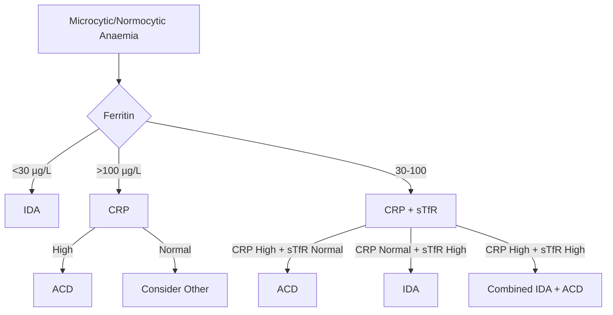
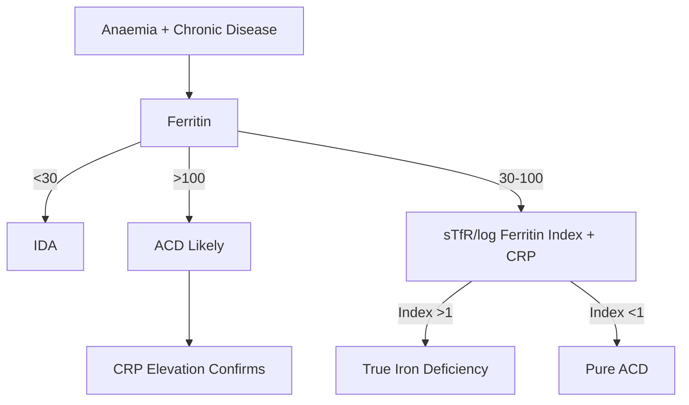
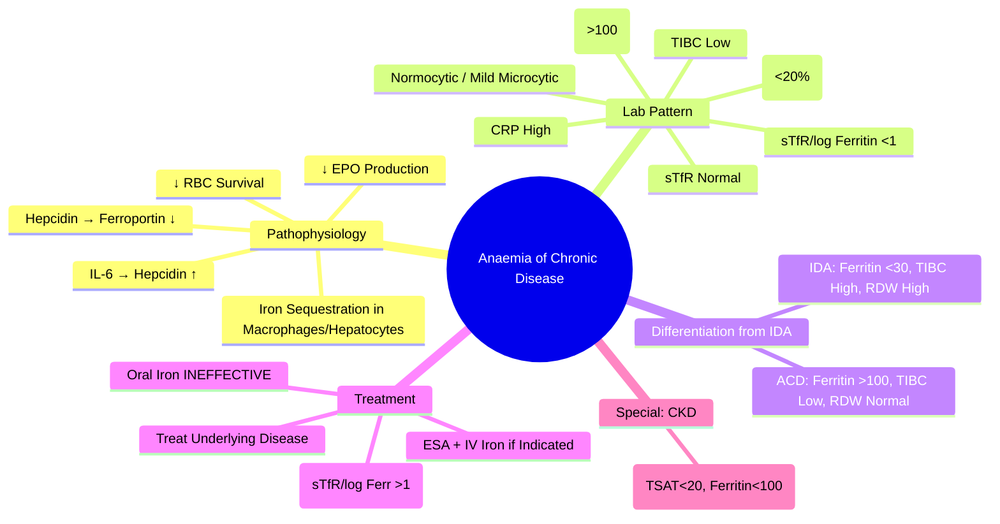

# Anaemia of Chronic Disease (ACD) / Anaemia of Inflammation

## Learning Objectives
- [ ] Understand pathophysiology: Hepcidin-mediated iron sequestration
- [ ] Differentiate ACD from iron deficiency anaemia (IDA)
- [ ] Apply diagnostic criteria (Ferritin, TSAT, CRP, sTfR)
- [ ] Manage underlying disease + consider ESA/iron
- [ ] Identify FCPS/MRCP high-yield diagnostic pearls

---

## Definition & Epidemiology

| Feature | Detail |
|---------|--------|
| **Definition** | Anaemia secondary to chronic inflammation/infection/malignancy — **Functional Iron Deficiency** |
| **Prevalence** | **2nd Most Common Anaemia** (After IDA) ~30% of Hospital Anaemias |
| **Associated Conditions** | **Infections** (TB, Endocarditis, Osteomyelitis), **Autoimmune** (RA, SLE, IBD), **Malignancy** (Lymphoma, Solid Tumours), **CKD**, **Heart Failure** |
| **Pathophysiology** | **Hepcidin-Mediated Iron Sequestration** — Inflammatory Cytokines (IL-6) → ↑ Hepcidin → ↓ Ferroportin → Iron Trapped in Macrophages/Hepatocytes |

> **FCPS/MRCP**: **ACD = 2nd Most Common Anaemia** — **Functional Iron Deficiency** (Iron present but unavailable).

---

## Pathophysiology: The Hepcidin-Hub

```mermaid
flowchart LR
    A[Chronic Inflammation/Infection/Malignancy] --> B[↑ IL-6, TNF-α, IL-1]
    B --> C[↑ Hepcidin Synthesis (Liver)]
    C --> D[Hepcidin Binds Ferroportin]
    D --> E[Ferroportin Internalisation & Degradation]
    E --> F[Iron Trapped in Macrophages / Hepatocytes / Enterocytes]
    F --> G[↓ Serum Iron, ↓ Transferrin Saturation]
    G --> H[↓ Erythropoiesis → Anaemia]
    A --> I[↓ EPO Production (Kidney)]
    A --> J[↓ Erythroid Progenitor Responsiveness to EPO]
    A --> K[↓ RBC Lifespan]
```

> **Key**: **Hepcidin = Master Regulator** — Binds Ferroportin → Internalisation → Iron Trapped in Stores.

---

## Clinical Features

| Feature | ACD |
|-------|-----|
| **Anaemia** | Usually **Mild-Moderate** (Hb 90-110 g/L), **Rarely <80** |
| **MCV** | **Normal (Normocytic)** or **Mildly Microcytic** (MCV 70-80) |
| **RDW** | **Normal** (vs High in IDA) |
| **Reticulocyte Count** | Low/Inappropriately Normal |
| **Underlying Disease** | Signs of Infection/Inflammation/Malignancy |

---

## Laboratory Findings

| Parameter | ACD | IDA | Combined IDA + ACD |
|------|-----|-----|-------------------|
| **Hb** | ↓ (Mild-Mod) | ↓↓ | ↓↓↓ |
| **MCV** | Normal (80-95) / Mildly Low | **Low (<80)** | Low |
| **RDW** | **Normal** | **High (>14.5%)** | Variable (Often High) |
| **Ferritin** | **Normal / High** (>100) | **Low (<30)** | Low/Normal |
| **Serum Iron** | **Low** | **Low** | Low |
| **TIBC** | **Low** | **High** | Low/Normal |
| **Transferrin Saturation (TSAT)** | **Low (<20%)** | **Low (<16%)** | Low |
| **Serum Ferritin** | **Normal/High (>100)** | **Low (<30)** | Normal (Confusing) |
| **CRP/ESR** | **High** | Normal | High |
| **sTfR (Soluble Transferrin Receptor)** | **Normal** | **High** | High |
| **sTfR/log Ferritin Index** | <1 | >1 | >1 |

---

## Differentiation: ACD vs IDA vs Combined



---

## Key Diagnostic Parameters

| Parameter | ACD | IDA | Combined |
|---------|-----|-----|--------|
| **Ferritin** | **Normal/High (>100)** | **Low (<30)** | Variable (may be "falsely normal") |
| **TSAT** | **Low (<20%)** | **Low (<16%)** | Low |
| **Serum Iron** | Low | Low | Low |
| **TIBC** | **Low** | **High** | Low/Normal |
| **CRP** | **Elevated** | Normal | Elevated |
| **RDW** | Normal | **High** | Often High |
| **sTfR** | Normal | **High** | High |
| **sTfR/log Ferritin** | **<1** | **>1** | >1 |

> **FCPS/MRCP**: **Ferritin is an Acute Phase Reactant** — Can be "Falsely Normal/High" in ACD despite Iron Deficiency. **sTfR/log Ferritin Index >1 = True Iron Deficiency**.

---

## Pathophysiology Summary

| Mechanism | Effect |
|--------|--------|
| **IL-6 → Hepcidin ↑** | ↓ Ferroportin → Iron Trapped in Macrophages/Enterocytes |
| **IL-1/TNF → Bone Marrow** | ↓ Erythroid Progenitor Proliferation |
| **IL-1/TNF → Kidney** | ↓ EPO Production |
| **Reduced RBC Survival** | ↓ RBC Lifespan (80-90 days vs 120) |
| **Iron-Restricted Erythropoiesis** | Functional Iron Deficiency (Stores Full, Serum Low) |

---

## Diagnostic Approach



> **FCPS/MRCP**: **Ferritin <30 = IDA**; **Ferritin >100 + CRP High = ACD**; **Ferritin 30-100 = Grey Zone → Use sTfR/CRP**.

---

## Investigations

| Test | ACD Pattern |
|------|-------------|
| **CBC** | Normocytic (MCV 80-95), Mild Anisocytosis |
| **Reticulocytes** | Low/Inappropriately Normal |
| **Ferritin** | **>100** (Acute Phase Reactant) |
| **Serum Iron** | Low |
| **TIBC** | **Low** |
| **TSAT** | **<20%** |
| **sTfR** | Normal |
| **CRP/ESR** | **Elevated** |
| **sTfR/log Ferritin Index** | **<1** |

> **sTfR/log Ferritin Index >1 = True Iron Deficiency** (Even with Normal/High Ferritin).

---

## Management

### Primary: Treat Underlying Disease
| Condition | Approach |
|---------|----------|
| **Infection** | Antibiotics, Source Control |
| **Autoimmune** | DMARDs (MTX, Biologics), Steroids |
| **Malignancy** | Oncology Referral, Chemotherapy |
| **CKD** | ESA + IV Iron (if TSAT <20%, Ferritin <100) |
| **Heart Failure** | IV Iron (Ferinject®) — Improves Exercise Capacity |

### Iron Therapy
| Scenario | Approach |
|--------|----------|
| **Pure ACD (Ferritin >100)** | **No Iron** — Stores Adequate, Hepcidin Blocks Utilisation |
| **ACD + True IDA (Ferritin 30-100 + sTfR/Log Ferritin >1)** | **IV Iron** (Oral Ineffective — Hepcidin Blocks Absorption) |
| **Pure IDA** | **Oral Iron** (Hepcidin Low → Absorption Intact) |

> **FCPS/MRCP**: **ACD = Hepcidin Blocks Oral Iron Absorption** → **IV Iron Required if True Iron Deficiency Coexists**.

### ESA (Erythropoiesis-Stimulating Agents)
| Indication | Agent | Target Hb |
|---------|-------|-----------|
| **CKD (Hb <100)** | EPO / Darbepoetin / Mircera | 100-120 g/L |
| **Chemo-induced Anaemia** | ESA + IV Iron | 100-120 g/L (Avoid >120) |
| **Refractory ACD** | ESA + IV Iron | 100-110 g/L |

> **Risks**: Thrombosis, Hypertension, Pure Red Cell Aplasia (Anti-EPO Ab).

---

## FCPS/MRCP High-Yield Summary

| Concept | Key Points |
|---------|------------|
| **Definition** | Anaemia 2° to Chronic Inflammation/Infection/Malignancy |
| **Pathophysiology** | **IL-6 → Hepcidin ↑ → Ferroportin Degradation → Iron Sequestration** |
| **Lab Pattern** | **Normocytic/Mild Microcytic**, **Ferritin Normal/High**, **TSAT Low**, **TIBC Low**, **CRP High** |
| **Key Differentiator** | **Ferritin >100 + CRP High = ACD** (vs IDA: Ferritin <30, High TIBC) |
| **sTfR/log Ferritin Index** | **<1 = ACD**; **>1 = True Iron Deficiency** |
| **Iron Therapy** | **Oral Ineffective** (Hepcidin Blocks); **IV Iron if True IDA** |
| **ESA Indication** | CKD (Hb<100), Chemo-induced, Refractory ACD + True IDA |
| **Pure IDA + ACD** | sTfR/Log Ferritin Index >1 = True Iron Deficiency → IV Iron |

---

## Viva Questions

1. **What is the pathophysiology of Anaemia of Chronic Disease?**
2. **How does Hepcidin mediate ACD?**
3. **Differentiate ACD from IDA using lab parameters.**
3. **What is the role of sTfR/log Ferritin Index?**
4. **When do you give IV Iron in ACD?**
4. **Why is Oral Iron Ineffective in ACD?**
5. **When is ESA Indicated in ACD?**
5. **Differentiate Pure IDA, Pure ACD, and Combined IDA+ACD.**
5. **What is the Role of CRP in Diagnosis?**
6. **How does Hepcidin Affect Iron Transport?**
6. **What is the Functional Iron Deficiency in ACD?**

---

## Confusions & Mnemonics

| Confusion | Clarification |
|-----------|---------------|
| **Ferritin in ACD** | **Ferritin is Acute Phase Reactant** — ↑ in Inflammation despite Low Iron Availability |
| **Functional vs Absolute ID** | **Functional = Iron Present but Unavailable (Hepcidin)**; Absolute = No Iron Stores |
| **Ferritin in ACD** | **Ferritin = Acute Phase Reactant** — Can be Normal/High despite Iron Restriction |
| **TSAT in ACD** | **Low (<20%)** — Same as IDA, but Ferritin Distinguishes |
| **Oral Iron in ACD** | **Ineffective** — Hepcidin Blocks DMT1/Ferroportin in Duodenum |
| **sTfR/log Ferritin** | **>1 = True Iron Deficiency**; **<1 = Pure ACD** |
| **ESA in ACD** | Only if **True Iron Deficiency Corrected** + Hb <100 (CKD) |
| **DIC vs ACD** | DIC = Consumption Coagulopathy; ACD = Chronic Inflammation |

---

## Mind Map



---

## One-Page Revision Card

| **ACD (Anaemia of Chronic Disease)** | **Details** |
|--------------------------------------|-------------|
| **Definition** | Anaemia 2° to Chronic Inflammation/Infection/Malignancy |
| **Pathophysiology** | **IL-6 → Hepcidin ↑ → Ferroportin Degradation → Iron Sequestration** |
| **Key Lab Pattern** | Normocytic, Low Fe, **Low TIBC, High Ferritin, Low TSAT, High CRP** |
| **Ferritin** | **>100** (Acute Phase Reactant) |
| **TIBC** | **Low** |
| **TSAT** | **<20%** |
| **CRP** | **High** |
| **sTfR/log Ferritin** | **<1** (vs >1 in IDA) |

| **ACD vs IDA** | **ACD** | **IDA** |
|----------------|---------|-------|
| **Ferritin** | **>100** | **<30** |
| **TIBC** | **Low** | **High** |
| **RDW** | **Normal** | **High** |
| **sTfR/log Ferr** | **<1** | **>1** |
| **CRP** | **High** | **Normal** |

| **Management** | |
|----------------|--|
| **Primary** | Treat Underlying Disease |
| **Iron** | **IV Only** if True IDA Coexists (sTfR/log Ferr >1) |
| **Oral Iron** | **Ineffective** (Hepcidin Blocks) |
| **ESA** | CKD Hb<100 / Chemo / Refractory ACD + True IDA |

---

## Spaced Repetition Tracker

| Day | 1 | 3 | 7 | 15 | 30 |
|-----|---|---|---|----|----|
| Hepcidin Pathophysiology | ☐ | ☐ | ☐ | ☐ | ☐ |
| Lab Pattern (Ferritin, TSAT, CRP) | ☐ | ☐ | ☐ | ☐ | ☐ |
| ACD vs IDA Lab Diff | ☐ | ☐ | ☐ | ☐ | ☐ |
| sTfR/log Ferritin Index | ☐ | ☐ | ☐ | ☐ | ☐ |
| IV Iron Indication | ☐ | ☐ | ☐ | ☐ | ☐ |

---

## Self-Test Scorecard

| Question | My Answer | Correct? |
|----------|-----------|----------|
| Hepcidin Mechanism |  |  |
| Ferritin in ACD vs IDA |  |  |
| sTfR/log Ferritin Index |  |  |
| Oral Iron Effectiveness |  |  |
| ESA Indication |  |  |

---

## Local Navigation

- [[Anaemia and Red Cell Disorders/Iron Deficiency Anaemia|Iron Deficiency Anaemia]]
- [[Anaemia and Red Cell Disorders/Microcytic Anaemia|Microcytic Anaemia Overview]]
- [[Portal Hypertension and Complications/Ascites|Ascites]]
- [[Chronic Liver Disease and Cirrhosis/Complications|Cirrhosis Complications]]
- [[Renal Medicine/Anaemia of CKD|Anaemia of CKD]]