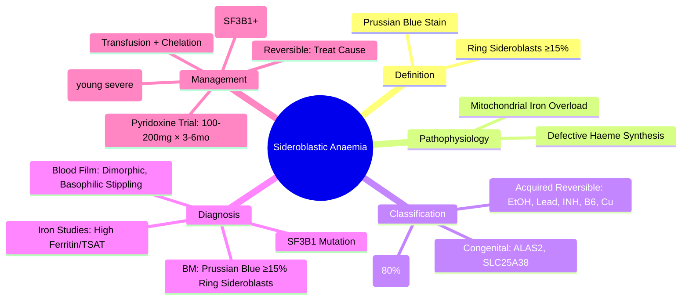

# Sideroblastic Anaemia

> [!info] **Davidson Ch 25 Alignment**: Anaemia and Red Cell Disorders → Sideroblastic Anaemia
> **FCPS/MRCP Focus**: Ring sideroblasts, congenital vs acquired, reversible causes (alcohol, drugs, B6), SF3B1 mutation, MDS overlap

---

## 🎯 Learning Objectives

- [ ] Define sideroblastic anaemia: **Ring sideroblasts ≥15% (WHO) or ≥5% (some guidelines)** of erythroblasts on Prussian blue stain
- [ ] Classify: **Congenital** (ALAS2, SLC25A38, ABCB7) vs **Acquired** (MDS, drugs, toxins, nutritional, idiopathic)
- [ ] Identify **reversible causes**: Alcohol,Lead, Isoniazid, Chloramphenicol, **B6 deficiency**, Copper deficiency
- [ ] Interpret **blood film**: Dimorphic population (microcytic + normocytic/macrocytic), basophilic stippling, Pappenheimer bodies
- [ ] Diagnose: **Prussian blue stain** (mitochondrial iron-loaded granules around nucleus = ring sideroblasts)
- [ ] Apply **SF3B1 mutation** → **MDS-RS** (good prognosis, luspatercept response)
- [ ] Manage: **Remove offending agent**, **Pyridoxine (B6) trial**, **Luspatercept** (MDS-RS), transfusions, iron chelation

---

## 📖 Definition & Classification

| Category | Aetiology | Key Features |
|----------|-----------|--------------|
| **Congenital** | X-linked ALAS2 (δ-ALA synthase), SLC25A38, ABCB7 (XLSA/A) | Presents in childhood, often microcytic, **Pyridoxine-responsive (ALAS2)** |
| **Acquired - MDS** | **SF3B1 mutation** (80% MDS-RS), MDS-RS, MDS/MPN-RS-T | **Ring sideroblasts ≥15%**, SF3B1 mut = good prognosis, luspatercept indication |
| **Acquired - Reversible** | **Alcohol** (commonest), Lead, Isoniazid, Chloramphenicol, Cycloserine, Linezolid, **B6 deficiency**, Copper deficiency (zinc excess) | **Remove cause → resolves**; Lead = basophilic stippling + abdominal pain + neuropathy |
| **Acquired - Idiopathic** | No identifiable cause | Diagnosis of exclusion |

> [!tip] **FCPS/MRCP**: **Ring sideroblasts = mitochondrial iron overload forming ring around nucleus on Prussian blue**. **SF3B1 mutation = MDS-RS = good prognosis + luspatercept responsive**.

---

## ⚙️ Pathophysiology

```mermaid
flowchart TD
    A[Defective Haeme Synthesis in Mitochondria] --> B[Iron Accumulates in Mitochondria]
    B --> C[Ferritin Forms Ring Around Nucleus]
    C --> D[Ring Sideroblasts on Prussian Blue]
    D --> E[Ineffective Erythropoiesis]
    E --> F[Anaemia + Dimorphic Blood Film]
    
    G[Causes] --> A
    G --> H1[ALAS2 mutation (X-linked)]
    G --> H2[SF3B1 mutation (MDS-RS)]
    G --> H3[Drugs/Toxins: EtOH, Lead, INH, B6 def]
    G --> H4[Copper deficiency]
```

**Core Defect**: Impaired haem synthesis → iron enters mitochondria but cannot be incorporated into protoporphyrin → **mitochondrial iron overload** → ring sideroblasts

---

## 🔬 Diagnostic Workup

```mermaid
flowchart TD
    A[Anaemia + Dimorphic Blood Film] --> B[CBC: Mixed Microcytic + Normo/Macrocytic]
    B --> C[Blood Film: Dimorphic, Basophilic Stippling, Pappenheimer Bodies]
    C --> D[Iron Studies: **High Ferritin, High TSAT** (paradoxical)]
    D --> E[**BM Aspirate + Prussian Blue Stain**]
    E --> F{Ring Sideroblasts ≥15%?}
    F -->|Yes| G[Sideroblastic Anaemia]
    G --> H[Categorise: Congenital vs Acquired]
    H --> I1[Genetic: ALAS2, SLC25A38, ABCB7]
    H --> I2[MDS Workup: SF3B1, Cytogenetics, NGS]
    H --> I3[Reversible Causes: Alcohol, Drugs, Lead, B6, Copper]
    F -->|No| J[Consider Other Dimorphic Anaemias]
```

### Key Diagnostic Findings

| Test | Finding |
|------|---------|
| **CBC** | Anaemia (variable severity), **Dimorphic RBC population** (low + normal/high MCV) |
| **Blood Film** | **Dimorphic** (microcytic hypochromic + normocytic), **Basophilic stippling**, **Pappenheimer bodies** (siderotic granules) |
| **Iron Studies** | **↑ Ferritin, ↑ TSAT** (iron overload pattern despite anaemia) |
| **Prussian Blue Stain** | **Ring sideroblasts ≥15%** (WHO); mitochondrial iron granules encircling ≥1/3 nucleus |
| **SF3B1 Mutation** | **Present in 80% MDS-RS** → defines MDS with ring sideroblasts |
| **Lead Level** | Elevated if lead poisoning |
| **Copper Level** | Low if copper deficiency (from zinc excess, malabsorption, post-bariatric) |
| **B6 Level** | Low if pyridoxine deficiency |

---

## 🩺 Clinical Features

| Type | Presentation |
|------|--------------|
| **Congenital (ALAS2)** | Childhood onset, microcytic anaemia, **pyridoxine-responsive**, iron overload |
| **MDS-RS (SF3B1)** | Elderly, macrocytic/normocytic anaemia, **good prognosis**, low AML transformation risk |
| **Alcohol-induced** | Heavy drinkers, reversible with abstinence ± B6 |
| **Lead Poisoning** | **Abdominal colic, neuropathy (wrist drop), basophilic stippling**, anaemia, Burton's line |
| **Drug-induced (INH, Linezolid)** | Reversible on stopping drug |
| **Copper Deficiency** | **Neutropenia + Anaemia + Neuropathy** (mimics B12), history of zinc supplements/bariatric surgery |

---

## 💊 Management

### Reversible Causes – **Treat the Cause**

| Cause | Treatment |
|-------|-----------|
| **Alcohol** | **Abstinence ± Pyridoxine 50-100 mg/day** |
| **Lead Poisoning** | **Chelation (DMSA, EDTA, D-penicillamine)** + remove source |
| **Isoniazid** | **Pyridoxine 10-50 mg/day** prophylaxis/treatment |
| **Linezolid** | Stop drug (usually reversible in 1-2 weeks) |
| **B6 Deficiency** | **Pyridoxine 50-100 mg/day** |
| **Copper Deficiency** | **Copper replacement** (IV/oral), stop zinc supplements |

### Congenital / Refractory / MDS-RS

| Therapy | Indication | Details |
|---------|------------|---------|
| **Pyridoxine (B6) Trial** | All congenital, some acquired | **100-200 mg/day × 3-6 months**; ALAS2 mutations often responsive |
| **Luspatercept** | **MDS-RS (SF3B1 mut)** with transfusion dependence | **ActRIIB-Fc fusion** → ↑ late erythropoiesis; **MEDALIST trial**; 1.0-1.75 mg/kg SC q3wk |
| **Transfusions** | Symptomatic anaemia | Leucodepleted, irradiated; monitor iron overload |
| **Iron Chelation** | Transfusion-dependent, ferritin >1000 | Deferasirox/Deferiprone/Deferoxamine |
| **Allogeneic HSCT** | Young, high-risk MDS, congenital severe | Curative but high transplant-related mortality |

> [!tip] **FCPS/MRCP**: **Luspatercept approved for MDS-RS with SF3B1 mutation** (transfusion-dependent). **Pyridoxine trial in ALL sideroblastic anaemias** (cheap, safe, diagnostic).

---

## 🔄 Differential Diagnosis

| Condition | Distinguishing Features |
|-----------|------------------------|
| **Iron Deficiency Anaemia** | **Low ferritin, low TSAT, high RDW**; no ring sideroblasts |
| **Anaemia of Chronic Disease** | **Normal/high ferritin, low TSAT**; no ring sideroblasts |
| **MDS (non-RS)** | Dysplasia in ≥1 lineage, <15% ring sideroblasts, other cytopenias |
| **Thalassaemia** | **Mentzer <13, HbA2>3.5%**, target cells, no ring sideroblasts |
| **Lead Poisoning** | **Basophilic stippling, abdominal pain, neuropathy**, elevated lead level |
| **Copper Deficiency** | **Neutropenia + Anaemia + Neuropathy**, low copper/ceruloplasmin, high zinc |

---

## 💡 FCPS/MRCP High-Yield Summary

| Topic | Key Point |
|-------|-----------|
| **Definition** | **Ring sideroblasts ≥15%** (Prussian blue) of erythroblasts |
| **Blood Film** | **Dimorphic** (two populations), basophilic stippling, Pappenheimer bodies |
| **Iron Studies** | **Paradoxical iron overload**: High ferritin, high TSAT despite anaemia |
| **SF3B1 Mutation** | **80% MDS-RS**; good prognosis, luspatercept indication |
| **Reversible Causes** | **Alcohol (commonest), Lead, INH, Linezolid, B6 deficiency, Copper deficiency** |
| **Lead Poisoning** | Basophilic stippling + abdominal colic + wrist drop + Burton's line |
| **Copper Deficiency** | **Neutropenia + Anaemia + Neuropathy** (B12 mimic); zinc excess history |
| **Pyridoxine Trial** | **100-200 mg/day × 3-6mo** – diagnostic & therapeutic |
| **Luspatercept** | **MDS-RS + SF3B1 mut + transfusion-dependent** |
| **Congenital ALAS2** | X-linked, **pyridoxine-responsive**, iron overload |

---

## ❓ Viva Questions

1. **What is the diagnostic criterion for sideroblastic anaemia on bone marrow?**
   - **Ring sideroblasts ≥15%** of erythroblasts on **Prussian blue stain** (mitochondrial iron ring around nucleus)

2. **Describe the characteristic blood film findings in sideroblastic anaemia.**
   - **Dimorphic population** (microcytic + normocytic/macrocytic), **basophilic stippling**, **Pappenheimer bodies**

3. **Why are iron studies paradoxical in sideroblastic anaemia?**
   - **High ferritin, high TSAT** despite anaemia – iron trapped in mitochondria, not available for haem synthesis

4. **What is the significance of SF3B1 mutation in sideroblastic anaemia?**
   - Defines **MDS-RS**; **good prognosis**, low AML risk; **predicts response to luspatercept**

5. **List 5 reversible causes of acquired sideroblastic anaemia.**
   - **Alcohol, Lead, Isoniazid, Pyridoxine deficiency, Copper deficiency** (also linezolid, chloramphenicol)

6. **How does lead poisoning present and what are the key haematological findings?**
   - Abdominal colic, **wrist drop (radial neuropathy)**, **Burton's line** on gums; **basophilic stippling**, sideroblastic anaemia

7. **What is the characteristic triad of copper deficiency?**
   - **Neutropenia + Anaemia + Neuropathy** (mimics B12 deficiency); low copper/ceruloplasmin; often from **zinc excess**

8. **When is luspatercept indicated in sideroblastic anaemia?**
   - **MDS-RS with SF3B1 mutation** and **transfusion dependence** (MEDALIST trial)

9. **What is the pyridoxine trial dose and duration for sideroblastic anaemia?**
   - **100-200 mg/day for 3-6 months** – diagnostic and therapeutic (especially ALAS2 mutations)

10. **Differentiate sideroblastic anaemia from iron deficiency and ACD.**
    - **Sideroblastic: Dimorphic film, ring sideroblasts, HIGH ferritin/TSAT**; **IDA: Low ferritin/TSAT, high RDW**; **ACD: Normal/high ferritin, LOW TSAT, no ring sideroblasts**

---

## 🧠 Confusions & Mnemonics

| Confusion | Clarification |
|-----------|---------------|
| **Sideroblastic vs Iron Deficiency** | Sideroblastic = **High ferritin/TSAT**, ring sideroblasts; IDA = **Low ferritin/TSAT** |
| **Sideroblastic vs ACD** | Sideroblastic = **Ring sideroblasts, dimorphic film**; ACD = **Low TSAT, normal ferritin, no ring sideroblasts** |
| **SF3B1 in MDS** | **MDS-RS = SF3B1 mut + ring sideroblasts ≥15%**; good prognosis, luspatercept eligible |
| **Lead vs Sideroblastic** | Lead **causes** sideroblastic anaemia; **basophilic stippling** is hallmark of lead |
| **Copper Deficiency vs B12** | Both cause neuropathy + anaemia; **Copper = neutropenia + low copper + high zinc history** |

| Mnemonic | Meaning |
|----------|---------|
| **"Sidero = Iron Ring"** | Ring sideroblasts = iron-laden mitochondria |
| **"Dimorphic = Two Populations"** | Blood film shows two RBC populations |
| **"ALAS = Alcohol, Lead, Adverse drugs, B6 (pyridoxine), SF3B1"** | Acquired causes |
| **"SF3B1 = Good Prognosis, Luspatercept"** | MDS-RS marker |
| **"Lead = Basophilic Stippling + Belly Pain + Wrist Drop"** | Lead poisoning triad |
| **"Copper = Neutropenia + Neuropathy (B12 mimic)"** | Copper deficiency triad |

---

## 🗺️ Mind Map



---

## 📋 One-Page Revision Card

| **SIDEROBLASTIC ANAEMIA – FCPS/MRCP REVISION CARD** |
|------------------------------------------------------|
| **Definition**: **Ring sideroblasts ≥15%** (Prussian blue) |
| **Blood Film**: **Dimorphic**, basophilic stippling, Pappenheimer bodies |
| **Iron Studies**: **High Ferritin, High TSAT** (paradoxical) |
| **SF3B1 Mutation**: 80% MDS-RS → **Good prognosis, Luspatercept** |
| **Reversible Causes**: **ALAS** = **Alcohol, Lead, Adverse drugs, B6 deficiency, SF3B1 (MDS)** |
| **Lead Poisoning**: Basophilic stippling + Abdominal colic + Wrist drop + Burton's line |
| **Copper Deficiency**: **Neutropenia + Anaemia + Neuropathy** (B12 mimic) + High zinc history |
| **Pyridoxine Trial**: **100-200 mg/day × 3-6mo** (diagnostic & therapeutic) |
| **Luspatercept**: **MDS-RS + SF3B1 + Transfusion-dependent** |
| **Congenital ALAS2**: X-linked, **Pyridoxine-responsive**, iron overload |

---

## 📅 Spaced Repetition Tracker

| Review | Date | Score (1-5) | Next Review |
|--------|------|-------------|-------------|
| Day 1 | 2025-06-16 | | 2025-06-17 |
| Day 3 | | | |
| Day 7 | | | |
| Day 15 | | | |
| Day 30 | | | |

---

## 🎯 Must Know / Should Know / Nice to Know

| Level | Content |
|-------|---------|
| **Must Know** | Ring sideroblast definition, dimorphic film, paradoxical iron studies, SF3B1 significance, reversible causes (ALAS), lead/copper poisoning features, pyridoxine trial, luspatercept indication |
| **Should Know** | Congenital types (ALAS2, SLC25A38, ABCB7), pyridoxine dose/duration, MEDALIST trial details, iron chelation thresholds, MDS-RS vs MDS/MPN-RS-T |
| **Nice to Know** | Detailed mitochondrial haem synthesis pathway, specific drug mechanisms (INH, linezolid, chloramphenicol), copper metabolism, ABCB7/ATP-binding cassette transporters, SF3B1 splicing mechanism |

---

## ✅ Self-Test Scorecard

| Section | Score (0-10) | Notes |
|---------|--------------|-------|
| Definition & Pathophysiology | | |
| Classification | | |
| Diagnostic Workup | | |
| Reversible Causes | | |
| Lead & Copper Poisoning | | |
| MDS-RS & SF3B1 | | |
| Management (Pyridoxine, Luspatercept) | | |
| Viva Questions | | |

---

## 🔗 Local Navigation

- **Previous**: [[Aplastic Anaemia]]
- **Next**: [[Pure Red Cell Aplasia]]
- **Section Hub**: [[Anaemia and Red Cell Disorders]]
- **MOC**: [[Hematology MOC]]
- **Template**: [[../Templates/Hematology Topic Template]]

---

*Generated for FCPS/MRCP exam preparation. Based on Davidson Medicine 24th Ed Chapter 25.*
---

> Auto-generated study sections for "Hematology" — Ch 24: Haematology & Transfusion Medicine.

## Flashcards (37 generated)

- Q: What is CBC of Hematology?
  A: Anaemia (variable severity), Dimorphic RBC population (low + normal/high MCV)
- Q: What is Blood Film of Hematology?
  A: Dimorphic (microcytic hypochromic + normocytic), Basophilic stippling, Pappenheimer bodies (siderotic granules)
- Q: What is Iron Studies of Hematology?
  A: ↑ Ferritin, ↑ TSAT (iron overload pattern despite anaemia)
- Q: What is Prussian Blue Stain of Hematology?
  A: Ring sideroblasts ≥15% (WHO); mitochondrial iron granules encircling ≥1/3 nucleus
- Q: What is SF3B1 Mutation of Hematology?
  A: Present in 80% MDS-RS → defines MDS with ring sideroblasts
- Q: What is Lead Level of Hematology?
  A: Elevated if lead poisoning
- Q: What is Copper Level of Hematology?
  A: Low if copper deficiency (from zinc excess, malabsorption, post-bariatric)
- Q: What is B6 Level of Hematology?
  A: Low if pyridoxine deficiency
- Q: What is Alcohol of Hematology?
  A: Abstinence ± Pyridoxine 50-100 mg/day
- Q: What is Lead Poisoning of Hematology?
  A: Chelation (DMSA, EDTA, D-penicillamine) + remove source
- Q: What is Isoniazid of Hematology?
  A: Pyridoxine 10-50 mg/day prophylaxis/treatment
- Q: What is Linezolid of Hematology?
  A: Stop drug (usually reversible in 1-2 weeks)
- Q: What is B6 Deficiency of Hematology?
  A: Pyridoxine 50-100 mg/day
- Q: What is Copper Deficiency of Hematology?
  A: Copper replacement (IV/oral), stop zinc supplements
- Q: What is CBC of Hematology?
  A: Anaemia (variable severity), Dimorphic RBC population (low + normal/high MCV)
- Q: What is Blood Film of Hematology?
  A: Dimorphic (microcytic hypochromic + normocytic), Basophilic stippling, Pappenheimer bodies (siderotic granules)
- Q: What is Iron Studies of Hematology?
  A: ↑ Ferritin, ↑ TSAT (iron overload pattern despite anaemia)
- Q: What is Prussian Blue Stain of Hematology?
  A: Ring sideroblasts ≥15% (WHO); mitochondrial iron granules encircling ≥1/3 nucleus
- Q: What is SF3B1 Mutation of Hematology?
  A: Present in 80% MDS-RS → defines MDS with ring sideroblasts
- Q: What is Lead Level of Hematology?
  A: Elevated if lead poisoning
- Q: What is Copper Level of Hematology?
  A: Low if copper deficiency (from zinc excess, malabsorption, post-bariatric)
- Q: What is B6 Level of Hematology?
  A: Low if pyridoxine deficiency
- Q: What is Alcohol of Hematology?
  A: Abstinence ± Pyridoxine 50-100 mg/day
- Q: What is Lead Poisoning of Hematology?
  A: Chelation (DMSA, EDTA, D-penicillamine) + remove source
- Q: What is Isoniazid of Hematology?
  A: Pyridoxine 10-50 mg/day prophylaxis/treatment
- Q: What is Linezolid of Hematology?
  A: Stop drug (usually reversible in 1-2 weeks)
- Q: What is B6 Deficiency of Hematology?
  A: Pyridoxine 50-100 mg/day
- Q: What is the definition of Hematology?
  A: Ring sideroblasts ≥15% (Prussian blue) of erythroblasts
- Q: What is Blood Film of Hematology?
  A: Dimorphic (two populations), basophilic stippling, Pappenheimer bodies
- Q: What is Iron Studies of Hematology?
  A: Paradoxical iron overload: High ferritin, high TSAT despite anaemia
- Q: What is SF3B1 Mutation of Hematology?
  A: 80% MDS-RS; good prognosis, luspatercept indication
- Q: What causes Hematology?
  A: Alcohol (commonest), Lead, INH, Linezolid, B6 deficiency, Copper deficiency
- Q: What is Lead Poisoning of Hematology?
  A: Basophilic stippling + abdominal colic + wrist drop + Burton's line
- Q: What is Copper Deficiency of Hematology?
  A: Neutropenia + Anaemia + Neuropathy (B12 mimic); zinc excess history
- Q: What is Pyridoxine Trial of Hematology?
  A: 100-200 mg/day × 3-6mo – diagnostic & therapeutic
- Q: What is Luspatercept of Hematology?
  A: MDS-RS + SF3B1 mut + transfusion-dependent
- Q: What is Congenital ALAS2 of Hematology?
  A: X-linked, pyridoxine-responsive, iron overload

## MCQs (1 generated)

1. **Which of the following best describes Hematology?**
   A. **[!info] Davidson Ch 25 Alignment: Anaemia and Red Cell Disorders → Sideroblastic Anaemia**
   B. An unrelated condition not matching the clinical picture of Hematology
   C. A complication seen late in the disease course of Hematology
   D. A condition that mimics Hematology but has a different underlying cause

## SBA Questions (1 generated)

1. A patient with suspected Hematology presents with: Congenital — X-linked ALAS2 (δ-ALA synthase), SLC25A38, ABCB7 (XLSA/A); Acquired - MDS — SF3B1 mutation (80% MDS-RS), MDS-RS, MDS/MPN-RS-T; Acquired - Reversible — Alcohol (commonest), Lead, Isoniazid, Chloramphenicol, Cycloserine, Linezolid, B6 deficiency, Copper deficiency (zinc excess). What is the most likely diagnosis?
   A. **Hematology**
   B. A condition that mimics Hematology but is not the same entity
   C. A complication of Hematology rather than the primary diagnosis
   D. An unrelated condition in the same clinical category as Hematology

## PasTest Scenario SBAs (Clinical Vignettes)

> **Auto-generated PasTest/Mediscope-style scenario SBAs** grounded in the authored source. Each scenario tests a real clinical fact (triad, specific sign, contraindication, trial, first-line Rx) extracted from the topic. *Source: Ch 24: Haematology — Sideroblastic Anaemia*

**Q1.** Which of the following features is most specific or characteristic of Sideroblastic Anaemia?

  - **A.** Lead vs Sideroblastic
  - **B.** A feature common to many acute inflammatory conditions
  - **C.** A non-specific sign that does not localise the diagnosis
  - **D.** An investigation finding rather than a clinical feature

  > **Answer: A** — Lead vs Sideroblastic
  >
  > *Source:* MDS** | **MDS-RS = SF3B1 mut + ring sideroblasts ≥15%**; good prognosis, luspatercept eligible |
| **Lead vs Sideroblastic** | Lead **causes** sideroblastic anaemia; **basophilic stippling** is hallma

**Q2.** What is the most appropriate first-line therapy for Sideroblastic Anaemia?

  - **A.** Treat the Cause
  - **B.** An advanced/surgical therapy reserved for refractory disease
  - **C.** Symptomatic treatment only, no disease-modifying therapy
  - **D.** Empiric broad-spectrum therapy without specific indication

  > **Answer: A** — Treat the Cause
  >
  > *Source:* ### Reversible Causes – **Treat the Cause**

