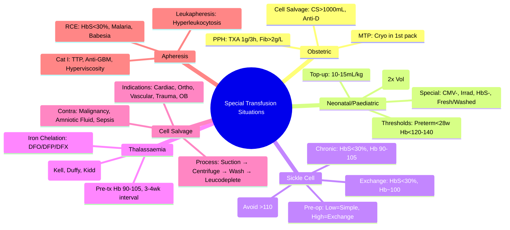

# Special Transfusion Situations

> [!info] **Davidson Ch 25 Alignment**: Transfusion Medicine → Special Transfusion Situations
> **FCPS/MRCP Focus**: Obstetric haemorrhage, neonatal/paediatric transfusion, sickle cell/thalassaemia exchange, intraoperative cell salvage, apheresis indications

---

## 🎯 Learning Objectives

- [ ] Manage **Obstetric Haemorrhage**: PPH algorithms, MTP activation, fibrinogen targets, cell salvage in obstetrics
- [ ] Apply **Neonatal/Paediatric Transfusion**: Top-up vs exchange, thresholds, CMV/irradiated requirements, NEC prevention
- [ ] Manage **Sickle Cell Transfusion**: Simple vs exchange, HbS targets, stroke prevention, preoperative
- [ ] Manage **Thalassaemia Transfusion**: Chronic transfusion, iron chelation, alloimmunisation prevention, phenotype matching
- [ ] Apply **Intraoperative Cell Salvage**: Indications, contraindications, processing, obstetric use
- [ ] Apply **Therapeutic Apheresis**: Plasma exchange, leukapheresis, plateletpheresis, red cell exchange, ASFA categories

---

## 🤰 Obstetric Haemorrhage

### definitions & Diagnosis

| Definition | Criteria |
|------------|----------|
| **Primary PPH** | **Blood loss >500 mL** within 24h of delivery |
| **Major PPH** | **>1000 mL** |
| **Massive PPH** | **>2000 mL** or **Continuous bleeding >150 mL/min** |

### MTP Activation in Obstetrics

| Trigger | Action |
|---------|--------|
| **Bleeding >1500 mL** | **Activate MTP** |
| **Ongoing bleeding >150 mL/min** | **Activate MTP** |
| **Systolic BP <90 + HR >110** | **Activate MTP** |
| **Clinician concern** | **Activate MTP** |

### MTP Pack Composition (Obstetric)

| Component | Standard Pack | Obstetric-Specific |
|-----------|---------------|-------------------|
| **RBC** | 4 units | **O-Neg initially**, then type-specific |
| **FFP** | 4 units | **4 units** (1:1 ratio) |
| **Platelets** | 1 apheresis unit | **1 apheresis unit** |
| **Cryoprecipitate** | 1 pool (10 units) | **INCLUDED in first pack** (target Fib >2g/L) |
| **Tranexamic Acid** | 1g IV bolus | **1g IV within 3h** (WOMAN trial) |

> [!warning] **Fibrinogen is the FIRST factor to fall in PPH**. **Target Fibrinogen >2.0 g/L**. **Cryoprecipitate EARLY** (1 pool = 10 units in first MTP pack).

### Obstetric Transfusion Targets

| Parameter | Target |
|-----------|--------|
| **Hb** | **>70-80 g/L** (stable); **>80-100** (ongoing bleed) |
| **Platelets** | **>50** (bleeding); **<100** (CS/neuraxial) |
| **Fibrinogen** | **>2.0 g/L** (critical threshold) |
| **INR** | **<1.5** (if bleeding) |
| **Ionised Ca²⁺** | **>1.0 mmol/L** (citrate toxicity) |

### Cell Salvage in Obstetrics

| Aspect | Details |
|--------|---------|
| **Indication** | **CS with anticipated blood loss >1000 mL**; Placenta praevia, Accreta, Multiple pregnancy |
| **Contraindication** | **Amniotic fluid contamination** (theoretical AFE risk); **Malignancy**; **Sepsis** |
| **Processing** | **Leucocyte depletion filter** mandatory; **Wash with saline** |
| **Reinfusion** | **Up to 4000 mL** (or 30 mL/kg); **Monitor for AFE signs** |
| **Rh-Negative Mothers** | **Anti-D Ig 250-500 IU** post-reinfusion (fetal cells in salvaged blood) |

---

## 👶 Neonatal & Paediatric Transfusion

### Neonatal Thresholds (Preterm/Term)

| Parameter | **Preterm (<28w / <1000g)** | **Preterm (28-34w)** | **Term** |
|-----------|-----------------------------|---------------------|----------|
| **Top-up Transfusion Hb** | **<120-140 g/L** | **<100-120 g/L** | **<80-100 g/L** |
| **Exchange Transfusion** | **Bilirubin >threshold** (phototherapy failure) | | |
| **Platelets** | **<30** (prophylactic); **<50** (bleeding/surgery) | | **<20** (prophylactic); **<50** (bleeding) |

> [!tip] **Neonatal Transfusion = "10-15 mL/kg" standard dose**. **Top-up: 10-15 mL/kg over 2-4h**. **Exchange: 2x blood volume (160 mL/kg)**.

### Special Requirements for Neonates/Paediatrics

| Requirement | Details |
|-------------|---------|
| **CMV** | **CMV-seronegative** (or leucodepleted) for **<20w preterm**, **<12 months** immunocompromised |
| **Irradiated** | **All** if **<1 year**; **<6 months** if **intrauterine transfusion**; **HSCT recipients** |
| **HbS Negative** | **Sickle Cell Disease** recipients |
| **Volume** | **Paedipacks (small volumes)**; **10-15 mL/kg** per transfusion |
| **Potassium** | **Fresh blood (<5-7 days)** or **Washed** (prevent hyperkalaemia) |

### Exchange Transfusion (Neonatal)

| Indication | Details |
|------------|---------|
| **Severe Hyperbilirubinaemia** | **Phototherapy failure**; **Bilirubin >exchange threshold** (gestation-specific) |
| **Haemolytic Disease** | **Anti-D/K**, **ABO incompatibility** |
| **Severe Anaemia** | **Hydrops fetalis**, **Parvovirus** |
| **Technique** | **Double volume exchange (160 mL/kg)**; **Isovolaemic**; **ABO-compatible, Rh-compatible, CMV-, Irradiated** |

---

## 🦠 Sickle Cell Disease Transfusion

### Indications for Transfusion

| Type | Indication | Target |
|--------|------------|--------|
| **Simple Top-up** | Acute severe anaemia (Hb <50-60), Aplastic crisis, Splenic sequestration, Pre-op (Hb <90) | **Hb 100 g/L** (avoid >110 = hyperviscosity) |
| **Exchange Transfusion** | **Acute Chest Syndrome**, **Stroke**, **Priapism >4h**, **Multi-organ failure**, **Pre-op major surgery** | **HbS <30%**, **Hb ~100 g/L** |
| **Chronic Transfusion Programme** | **Stroke prevention** (TCD >200 cm/s or prior stroke), Recurrent ACS/VOC on hydroxyurea | **HbS <30%**, **Pre-transfusion Hb 90-105 g/L** |

### Preoperative Transfusion

| Surgery Risk | HbS Target | Method |
|--------------|------------|--------|
| **Low** (minor) | **Hb 100** (simple top-up) | **Top-up to Hb 100** |
| **Moderate/High** | **HbS <30%** | **Exchange transfusion** (preferred) or aggressive top-up |

> [!warning] **Simple top-up: Target Hb 100 g/L (avoid >110 = hyperviscosity)**. **Exchange: HbS <30%, Hb ~100 g/L**. **Never transfuse to Hb >110 without exchange**.

### Alloimmunisation Prevention

| Strategy | Details |
|----------|---------|
| **Extended Phenotype Matching** | **Kell, Duffy, Kidd, S/s, C/c, E/e** (mandatory) |
| **Leucodepleted** | **All units** |
| **CMV-Negative** | All units |
| **Rh/Kell Matched** | Minimum for all; Extended for chronic programme |

---

## 🦠 Thalassaemia Transfusion

### Chronic Transfusion Programme

| Parameter | Target |
|-----------|--------|
| **Pre-transfusion Hb** | **90-105 g/L** (suppress erythropoiesis) |
| **Post-transfusion Hb** | **120-140 g/L** |
| **Interval** | **Every 3-4 weeks** |
| **Volume** | **10-15 mL/kg** per transfusion |

### Complications & Monitoring

| Complication | Monitoring | Management |
|--------------|------------|------------|
| **Iron Overload** | **Ferritin q3mo**, **MRI T2* (Cardiac) annual**, **LIC (Liver MRI) annual** | **Chelation: DFO/DFP/DFX** per protocol |
| **Alloimmunisation** | **Extended Phenotype Matching** | **Antibody screen q3mo** |
| **Transfusion Reactions** | **Acute/Delayed/Anaphylactic** | **Standard management** |
| **Infections** | **CMV/HTLV/HIV/HBV/HCV** screening | **Leucodepleted, CMV-, Irradiated if indicated** |

---

## 🔄 Intraoperative Cell Salvage (ICS)

### Indications

| Procedure | Indication |
|-----------|------------|
| **Cardiac Surgery** | Major (CABG, Valve, Aortic) |
| **Orthopaedic** | Major joint replacement, Spinal surgery |
| **Vascular** | Aortic aneurysm repair |
| **Trauma** | Major haemorrhage |
| **Obstetrics** | **CS with expected loss >1000 mL** (Placenta praevia, Accreta) |
| **Transplant** | Liver, Multivisceral |

### Contraindications

| Absolute | Relative |
|----------|----------|
| **Malignancy** (risk of dissemination) | **Sepsis** (bacterial contamination) |
| **Amniotic Fluid** (obstetrics - theoretical AFE) | **Sickle Cell** (risk of sickling in circuit) |
| **Bowel Contamination** | **Jehovah's Witness** (if acceptable) |

### Processing & Quality

| Step | Details |
|------|---------|
| **Collection** | **Suction + Anticoagulant (Citrate/Heparin)** into reservoir |
| **Processing** | **Centrifugation** → **Wash with Saline** → **Concentrate RBCs** |
| **Leucocyte Depletion** | **Mandatory filter** (removes WBCs, platelets, fat, debris) |
| **Final Product** | **RBCs in saline** (Hct 50-60%), **Low K⁺**, **Low cytokines** |
| **Reinfusion Limit** | **Up to 4000 mL** or **30 mL/kg** |

---

## 🔄 Therapeutic Apheresis (ASFA Categories)

### Indications by Category

| Category | Indication | Procedure | Frequency |
|----------|------------|-----------|-----------|
| **Category I (1st Line)** | **TTP/HUS** | **Plasma Exchange** | **Daily until platelets >150** |
| | **Anti-GBM Disease** | **Plasma Exchange** | Daily × 14d |
| | **Hyperviscosity (WM/Myeloma)** | **Plasma Exchange** | 1-2x until symptomatic relief |
| | **Acute Cholestasis (PBC/PSC)** | **Plasma Exchange** | Bridge to transplant |
| **Category II (2nd Line)** | **ANCA Vasculitis (Severe)** | **Plasma Exchange** | With cyclophosphamide |
| | **Guillain-Barré Syndrome** | **Plasma Exchange** | 5 exchanges |
| | **Myasthenia Gravis (Crisis)** | **Plasma Exchange** | 5 exchanges |
| | **Cryoglobulinaemic Vasculitis** | **Plasma Exchange** | With Rituximab |
| **Category III (Adjunct)** | **Dilutional Coagulopathy** | **Plasma Exchange** | Supportive |
| | **Acute Liver Failure** | **Plasma Exchange** | Bridge to transplant |

### Red Cell Exchange (RCE)

| Indication | Target |
|------------|--------|
| **Sickle Cell** (ACS, Stroke, Priapism) | **HbS <30%**, Hb ~100 |
| **Malaria** (Severe, >10% parasitaemia) | **Rapid parasite clearance** |
| **Babesiosis** (Severe) | **Parasitaemia <1-5%** |
| **Porphyria** (Acute) | **Porphyrin reduction** |

### Leukapheresis / Plateletpheresis

| Indication | Target |
|------------|--------|
| **Leukapheresis** (Hyperleukocytosis) | **WBC <50-100** (Leukaemia, Cytarabine bridge) |
| **Plateletpheresis** (Essential Thrombocythaemia) | **Platelets <400-600** (if symptomatic/refractory) |

---

## 💡 FCPS/MRCP High-Yield Summary

| Topic | Key Point |
|-------|-----------|
| **Obstetric MTP** | **TXA 1g within 3h**, **Fibrinogen >2.0 g/L**, **Cryo in 1st pack**, **Cell salvage in CS** |
| **Neonatal Top-up** | **Preterm <28w: Hb <120-140**; **10-15 mL/kg** dose; **CMV-, Irradiated** |
| **Exchange Transfusion (Neonate)** | **160 mL/kg (2x blood volume)**, **Phototherapy failure**, **HDN** |
| **Sickle Cell Simple** | **Hb 100** (avoid >110); **Pre-op Hb 100 (Low), HbS<30% (High)** |
| **Sickle Cell Exchange** | **HbS <30%, Hb ~100**; **ACS, Stroke, Priapism, Pre-op Major** |
| **Thalassaemia** | **Pre-tx Hb 90-105**, **Interval 3-4wk**, **Iron Chelation**, **Extended Matching** |
| **Cell Salvage** | **CS >1000 mL loss**, **Leucodepletion filter**, **Anti-D if Rh-neg mother** |
| **Apheresis Cat I** | **TTP (PEX daily), Anti-GBM (PEX), Hyperviscosity (PEX)** |
| **RCE** | **HbS<30% (Sickle), Parasitaemia (Malaria/Babesia)** |

---

## ❓ Viva Questions

1. **What is the fibrinogen target in obstetric haemorrhage and why?**
   - **Fibrinogen >2.0 g/L** - **First factor to fall** in PPH; Predicts severe bleeding

2. **When do you use exchange vs simple transfusion in sickle cell disease?**
   - **Simple**: Acute anaemia (Hb<50-60), Pre-op low risk; **Exchange**: ACS, Stroke, Priapism >4h, Pre-op high risk, Chronic programme

3. **What is the target HbS for exchange transfusion in sickle cell disease?**
   - **HbS <30%**, Haemoglobin ~100 g/L

4. **What are the special requirements for neonatal transfusion?**
   - **CMV-negative, Irradiated, HbS-negative, Fresh (<5-7 days) or Washed**, Paedipacks

4. **What is the volume for neonatal exchange transfusion?**
   - **160 mL/kg** (double blood volume), isovolaemic, ABO/Rh compatible

5. **When is intraoperative cell salvage contraindicated?**
   - **Malignancy**, **Amniotic fluid** (obstetrics), **Sepsis**, **Bowel contamination**

6. **What are the ASFA Category I indications for plasma exchange?**
   - **TTP/HUS, Anti-GBM disease, Hyperviscosity (WM/Myeloma), Acute cholestasis (bridge to transplant)**

7. **What is the target HbS for chronic sickle cell transfusion programme?**
   - **HbS <30%**, Pre-transfusion Hb 90-105 g/L

7. **What is the dose for neonatal top-up transfusion?**
   - **10-15 mL/kg** over 2-4 hours

8. **How does cell salvage work in obstetrics?**
   - **Suction + Citrate → Reservoir → Centrifuge + Wash → Leucodepletion → Reinfusion**; **Anti-D Ig post**

9. **What is the fibrinogen target in massive obstetric haemorrhage?**
   - **>2.0 g/L** (Include Cryo in 1st MTP pack)

10. **What are the contraindications to intraoperative cell salvage?**
    - **Malignancy**, **Amniotic fluid contamination**, **Sepsis**, **Bowel contamination**

---

## 🧠 Confusions & Mnemonics

| Confusion | Clarification |
|-----------|---------------|
| **Simple vs Exchange (Sickle)** | **Simple = Top-up to Hb 100**; **Exchange = HbS <30%** |
| **Neonatal Top-up vs Exchange** | **Top-up = Anaemia (10-15 mL/kg)**; **Exchange = Hyperbilirubinaemia/HDN (160 mL/kg)** |
| **Cell Salvage Obstetrics** | **Amniotic fluid = Theoretical AFE risk**; **Leucodepletion + Anti-D essential** |
| **TTP vs Cat I Apheresis** | **TTP = PEX Daily until Plts>150**; **Cat I = 1st Line Evidence** |
| **Exchange Neonate vs Sickle** | **Neonate = 160 mL/kg (2x volume)**; **Sickle = HbS<30%** |

| Mnemonic | Meaning |
|----------|---------|
| **"PPH = TXA 1g + Fib>2 + Cryo 1st Pack"** | Obstetric MTP |
| **"Sickle Simple = Hb 100; Exchange = HbS<30"** | Sickle transfusion |
| **"Neonate Exchange = 160 mL/kg = 2x Volume"** | Neonatal exchange |
| **"Cell Salvage = Rh Neg Mother → Anti-D"** | Obstetric salvage |
| **"TTP = PEX Daily till Plts>150"** | Apheresis Category I |
| **"Thal = Pre-tx Hb 90-105; Iron Chelation Essential"** | Thalassaemia |

---

## 🗺️ Mind Map

---

## 📋 One-Page Revision Card

| **SPECIAL TRANSFUSION SITUATIONS – FCPS/MRCP REVISION CARD** |
|---------------------------------------------------------------|
| **Obstetric MTP**: **TXA 1g/3h, Fib>2, Cryo 1st Pack, Cell Salvage (Anti-D)** |
| **Neonatal Top-up**: **10-15 mL/kg**; **Preterm<28w: Hb<120-140** |
| **Neonatal Exchange**: **160 mL/kg (2x volume)**; Phototherapy failure/HDN |
| **Sickle Simple**: **Hb 100 (Avoid >110)**; **Exchange: HbS<30%, Hb~100** |
| **Sickle Chronic**: **HbS<30%, Pre-tx Hb 90-105**; **Extended Matching** |
| **Thalassaemia**: **Pre-tx Hb 90-105, 3-4wk**; **Iron Chelation**; **Extended Matching** |
| **Cell Salvage**: **CS>1000mL/Trauma/Ortho**; **Contra: Malignancy, Amniotic, Sepsis** |
| **Apheresis Cat I**: **TTP (PEX daily), Anti-GBM, Hyperviscosity, Cholestasis** |
| **RCE**: **Sickle HbS<30%, Malaria/Babesia Parasitaemia** |
| **Special Requirements**: **CMV-, Irradiated, HbS-, Fresh/Washed, Extended Pheno** |

---

## 📅 Spaced Repetition Tracker

| Review | Date | Score (1-5) | Next Review |
|--------|------|-------------|-------------|
| Day 1 | 2025-06-17 | | 2025-06-18 |
| Day 3 | | | |
| Day 7 | | | |
| Day 15 | | | |
| Day 30 | | | |

---

## 🎯 Must Know / Should Know / Nice to Know

| Level | Content |
|-------|---------|
| **Must Know** | Obstetric MTP (TXA, Fib>2, Cryo), Neonatal top-up/exchange thresholds, Sickle simple vs exchange (Hb 100 vs HbS<30%), Thalassaemia chronic programme, Cell salvage obstetrics contraindications, ASFA Cat I apheresis, RCE indications, special requirements (CMV-, Irrad, HbS-) |
| **Should Know** | TXA timing (WOMAN trial), Obstetric cell salvage Anti-D, Neonatal phototherapy/exchange thresholds, Preoperative sickle cell transfusion algorithm, Iron chelation regimens for thalassaemia, Cell salvage processing steps, ASFA category definitions, Leukapheresis/plateletpheresis indications, Post-transfusion monitoring in special populations |
| **Nice to Know** | Intraoperative cell salvage in cancer surgery (research), Fetal RBC transfusion (IUT), Apheresis in novel indications (Long COVID, Autoimmune encephalitis), Massive haemorrhage in Jehovah's Witness, Point-of-care testing in obstetric haemorrhage, Automated cell salvage devices, Red cell exchange vs simple exchange economics, Cryopreserved red cells for rare phenotypes |

---

## ✅ Self-Test Scorecard

| Section | Score (0-10) | Notes |
|---------|--------------|-------|
| Obstetric Haemorrhage & MTP | | |
| Neonatal/Paediatric Transfusion | | |
| Sickle Cell Transfusion | | |
| Thalassaemia Transfusion | | |
| Intraoperative Cell Salvage | | |
| Therapeutic Apheresis | | |
| Viva Questions | | |

---

## 🔗 Local Navigation

- **Previous**: [[ABO Rh Compatibility & Crossmatch]]
- **Next**: [[Palliative Care in Haematology]]
- **Section Hub**: [[Transfusion Medicine]]
- **MOC**: [[Hematology MOC]]
- **Template**: [[../Templates/Hematology Topic Template]]

---

*Generated for FCPS/MRCP exam preparation. Based on Davidson Medicine 24th Ed Chapter 25.*
---

> Auto-generated study sections for "Hematology" — Ch 24: Haematology & Transfusion Medicine.

## Flashcards (39 generated)

- Q: What is the definition of Hematology?
  A: [!info] Davidson Ch 25 Alignment: Transfusion Medicine → Special Transfusion Situations
- Q: What is Hb of Hematology?
  A: >70-80 g/L (stable); >80-100 (ongoing bleed)
- Q: What is Platelets of Hematology?
  A: >50 (bleeding); <100 (CS/neuraxial)
- Q: What is Fibrinogen of Hematology?
  A: >2.0 g/L (critical threshold)
- Q: What is INR of Hematology?
  A: <1.5 (if bleeding)
- Q: What is Ionised Ca²⁺ of Hematology?
  A: >1.0 mmol/L (citrate toxicity)
- Q: What is Hematology indicated for?
  A: CS with anticipated blood loss >1000 mL; Placenta praevia, Accreta, Multiple pregnancy
- Q: What is Processing of Hematology?
  A: Leucocyte depletion filter mandatory; Wash with saline
- Q: What is Reinfusion of Hematology?
  A: Up to 4000 mL (or 30 mL/kg); Monitor for AFE signs
- Q: What is Rh-Negative Mothers of Hematology?
  A: Anti-D Ig 250-500 IU post-reinfusion (fetal cells in salvaged blood)
- Q: What is Severe Hyperbilirubinaemia of Hematology?
  A: Phototherapy failure; Bilirubin >exchange threshold (gestation-specific)
- Q: What is Haemolytic Disease of Hematology?
  A: Anti-D/K, ABO incompatibility
- Q: What is Severe Anaemia of Hematology?
  A: Hydrops fetalis, Parvovirus
- Q: What is Technique of Hematology?
  A: Double volume exchange (160 mL/kg); Isovolaemic; ABO-compatible, Rh-compatible, CMV-, Irradiated
- Q: What is Leukapheresis (Hyperleukocytosis) of Hematology?
  A: WBC <50-100 (Leukaemia, Cytarabine bridge)
- Q: What is Plateletpheresis (Essential Thrombocythaemia) of Hematology?
  A: Platelets <400-600 (if symptomatic/refractory)
- Q: What is Hb of Hematology?
  A: >70-80 g/L (stable); >80-100 (ongoing bleed)
- Q: What is Platelets of Hematology?
  A: >50 (bleeding); <100 (CS/neuraxial)
- Q: What is Fibrinogen of Hematology?
  A: >2.0 g/L (critical threshold)
- Q: What is INR of Hematology?
  A: <1.5 (if bleeding)
- Q: What is Hematology indicated for?
  A: CS with anticipated blood loss >1000 mL; Placenta praevia, Accreta, Multiple pregnancy
- Q: What is Processing of Hematology?
  A: Leucocyte depletion filter mandatory; Wash with saline
- Q: What is Reinfusion of Hematology?
  A: Up to 4000 mL (or 30 mL/kg); Monitor for AFE signs
- Q: What is Rh-Negative Mothers of Hematology?
  A: Anti-D Ig 250-500 IU post-reinfusion (fetal cells in salvaged blood)
- Q: What is Severe Hyperbilirubinaemia of Hematology?
  A: Phototherapy failure; Bilirubin >exchange threshold (gestation-specific)
- Q: What is Haemolytic Disease of Hematology?
  A: Anti-D/K, ABO incompatibility
- Q: What is Severe Anaemia of Hematology?
  A: Hydrops fetalis, Parvovirus
- Q: What is Technique of Hematology?
  A: Double volume exchange (160 mL/kg); Isovolaemic; ABO-compatible, Rh-compatible, CMV-, Irradiated
- Q: What is Leukapheresis (Hyperleukocytosis) of Hematology?
  A: WBC <50-100 (Leukaemia, Cytarabine bridge)
- Q: What is Plateletpheresis (Essential Thrombocythaemia) of Hematology?
  A: Platelets <400-600 (if symptomatic/refractory)
- Q: What is Obstetric MTP of Hematology?
  A: TXA 1g within 3h, Fibrinogen >2.0 g/L, Cryo in 1st pack, Cell salvage in CS
- Q: What is Neonatal Top-up of Hematology?
  A: Preterm <28w: Hb <120-140; 10-15 mL/kg dose; CMV-, Irradiated
- Q: What is Exchange Transfusion (Neonate) of Hematology?
  A: 160 mL/kg (2x blood volume), Phototherapy failure, HDN
- Q: What is Sickle Cell Simple of Hematology?
  A: Hb 100 (avoid >110); Pre-op Hb 100 (Low), HbS<30% (High)
- Q: What is Sickle Cell Exchange of Hematology?
  A: HbS <30%, Hb ~100; ACS, Stroke, Priapism, Pre-op Major
- Q: What is Thalassaemia of Hematology?
  A: Pre-tx Hb 90-105, Interval 3-4wk, Iron Chelation, Extended Matching
- Q: What is Cell Salvage of Hematology?
  A: CS >1000 mL loss, Leucodepletion filter, Anti-D if Rh-neg mother
- Q: What is Apheresis Cat I of Hematology?
  A: TTP (PEX daily), Anti-GBM (PEX), Hyperviscosity (PEX)
- Q: What is RCE of Hematology?
  A: HbS<30% (Sickle), Parasitaemia (Malaria/Babesia)

## MCQs (1 generated)

1. **Which of the following best describes Hematology?**
   A. **[!info] Davidson Ch 25 Alignment: Transfusion Medicine → Special Transfusion Situations**
   B. An unrelated condition not matching the clinical picture of Hematology
   C. A complication seen late in the disease course of Hematology
   D. A condition that mimics Hematology but has a different underlying cause

