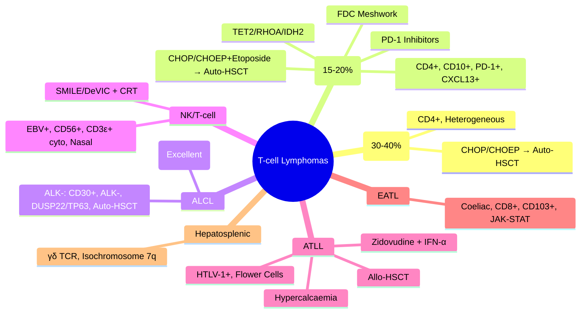

# T-cell Lymphomas

> [!info] **Davidson Ch 25 Alignment**: Haematological Malignancies → Lymphomas → T-cell Lymphomas
> **FCPS/MRCP Focus**: PTCL-NOS, AITL, ALK+ ALCL, ALK- ALCL, NK/T-cell lymphoma, ATLL, IPI, treatment algorithms

---

## 🎯 Learning Objectives

- [ ] Classify **T-cell Lymphomas** per WHO: PTCL-NOS, AITL, ALCL (ALK+/-), NK/T-cell, ATLL, EATL
- [ ] Identify **Immunophenotype**: CD3+, CD4+/CD8+, TCRαβ/γδ, CD30, ALK, EBV, HTLV-1
- [ ] Apply **Prognostic Indices**: IPI for PTCL, PIT for AITL
- [ ] Manage **PTCL-NOS**: CHOP/CHOEP → Auto-HSCT in CR1
- [ ] Manage **AITL**: CHOP/CHOEP + Etoposide → Auto-HSCT; Novel agents (PD-1 inhibitors)
- [ ] Manage **ALK+ ALCL**: CHOP → Excellent prognosis; ALK- ALCL: CHOP → Auto-HSCT in CR1
- [ ] Manage **NK/T-cell Lymphoma**: **Asparaginase-based** (SMILE/DeVIC) → CRT; PD-1 inhibitors
- [ ] Manage **ATLL**: **HTLV-1+**; Zidovudine + IFN-α (acute/lymphoma); Allo-HSCT if remission

---

## 📖 Classification (WHO 2022)

| Subtype | Frequency | Key Features |
|---------|-----------|--------------|
| **PTCL-NOS** | **~30-40%** of T-cell lymphomas | CD4+, Heterogeneous, **Worse prognosis** |
| **AITL** | **~15-20%** | **CD4+, CD10+, PD-1+, CXCL13+**, **TET2/RHOA/IDH2 mut**, EBV+ B-cells |
| **ALCL, ALK+** | **~10-15%** | **CD30+, ALK+**, Young, **Excellent prognosis** |
| **ALCL, ALK-** | **~5-10%** | **CD30+, ALK-, DUSP22/TP63 rearr**, Older, **Worse prognosis** |
| **NK/T-cell Lymphoma** | **~5-10%** | **EBV+**, Nasal/extranodal, **CD56+, CD3ε+**, **Asparaginase-sensitive** |
| **ATLL (Adult T-cell Leukaemia/Lymphoma)** | Rare outside endemic | **HTLV-1+**, **Flower cells**, Hypercalcaemia, Lytic lesions |
| **EATL (Enteropathy-associated T-cell Lymphoma)** | Rare | **Coeliac disease**, **CD3+, CD8+, CD56+**, **JAK-STAT mut** |
| **Hepatosplenic T-cell Lymphoma** | Very rare | **γδ TCR**, **Isochromosome 7q**, Splenic/hepatic, Young males |

> [!tip] **FCPS/MRCP**: **T-cell lymphomas = ~10-15% of NHL**. **PTCL-NOS most common**. **AITL = CD10+ PD-1+ TET2/RHOA/IDH2**. **ALK+ ALCL = CD30+ ALK+ = Good prognosis**. **NK/T = EBV+ CD56+ = Asparaginase-based Rx**. **ATLL = HTLV-1+ Flower cells**.

---

## 🔬 Diagnostic Workup

```mermaid
flowchart TD
    A[Lymphadenopathy/Extranodal Mass + B-symptoms] --> B[**Excisional Node Biopsy** (Gold Standard)]
    B --> C[Histology + **IHC Panel**]
    C --> D{**CD3+ (Pan-T)**}
    D -->|Yes| E[**Subtype IHC**]
    E --> F1[**CD30** → ALCL]
    E --> F2[**ALK** → ALK+ ALCL]
    E --> F3[**CD10, PD-1, CXCL13** → AITL]
    E --> F4[**CD56, CD3ε, EBV (EBER)** → NK/T-cell]
    E --> F5[**HTLV-1** → ATLL]
    E --> F6[**TCRαβ/γδ, CD4, CD8, CD7, CD2** → PTCL-NOS/T-PLL/Sézary]
    G[**Flow Cytometry**] → H[Clonality (TCRγ/TCRβ rearrangement)]
    I[**Genetics**] → J[**TET2/RHOA/IDH2 (AITL)**, **DUSP22/TP63 (ALK- ALCL)**, **JAK-STAT (EATL)**]
    K[**Staging**] → L[**PET-CT (Lugano)**, BM Biopsy, LDH, β2M, HIV, HTLV-1]
```

### Essential IHC Panel per Subtype

| Subtype | Positive Markers | Negative/Key |
|---------|------------------|--------------|
| **PTCL-NOS** | **CD3+, CD4+ (usually), CD2+, CD5+, CD7+**, Variable CD30 | CD56-, ALK-, CD10- |
| **AITL** | **CD3+, CD4+, CD10+, PD-1+, CXCL13+, BCL6+, CD21+ (FDC meshwork)** | **TET2/RHOA/IDH2 mut** |
| **ALCL ALK+** | **CD30+, ALK+, EMA+, CD4+**, CD3 weak/negative | ALK- |
| **ALCL ALK-** | **CD30+, ALK-, DUSP22/TP63 rearr**, CD3+ | |
| **NK/T-cell** | **CD2+, CD56+, CD3ε+ (cytoplasmic), EBV+ (EBER+)**, Granzyme B+ | **Surface CD3-, CD5-**, CD16 variable |
| **ATLL** | **CD3+, CD4+, CD25+, HTLV-1+**, Flower cells | CD7+ variable |
| **EATL** | **CD3+, CD8+, CD56+, CD103+**, **JAK-STAT mut** | CD4-, CD5- |
| **Hepatosplenic** | **γδ TCR+, CD3+, CD56+**, Isochromosome 7q | αβ TCR- |

---

## 🩺 Clinical Features by Subtype

### PTCL-NOS (Most Common T-NHL)
| Feature | Details |
|---------|---------|
| **Age** | Median 60-65 |
| **Presentation** | Generalised lymphadenopathy, B-symptoms, Hepatosplenomegaly |
| **Skin** | Rare |
| **Bone Marrow** | ~25% involvement |
| **Prognosis** | **Poor** (5-yr OS ~30-40%) |

### AITL
| Feature | Details |
|---------|---------|
| **Age** | Median 65-70 |
| **Presentation** | **Generalised lymphadenopathy, B-symptoms, Hepatosplenomegaly**, **Skin rash**, **Polyclonal hypergammaglobulinaemia**, **Autoimmune phenomena (AIHA, ITP)** |
| **EBV** | **EBV+ B-cells** (not neoplastic) |
| **Genetics** | **TET2, RHOA, IDH2 mutations** (diagnostic) |

### ALCL (ALK+)
| Feature | Details |
|---------|---------|
| **Age** | Children, Young Adults (median 30) |
| **Presentation** | **Lymphadenopathy, Skin involvement common**, B-symptoms |
| **Prognosis** | **Excellent** (5-yr OS >80-90% with CHOP) |

### ALCL (ALK-)
| Feature | Details |
|---------|---------|
| **Age** | Older (median 55-60) |
| **Prognosis** | **Intermediate/Poor** (5-yr OS ~50-60%) |

### NK/T-cell Lymphoma (Extranodal, Nasal Type)
| Feature | Details |
|---------|---------|
| **Site** | **Nasal cavity, Upper aerodigestive tract** (Extranodal) |
| **EBV** | **EBV+ (EBER+)** |
| **Genetics** | TP53 mut, JAK-STAT mutations |
| **Treatment** | **Asparaginase-based (SMILE/DeVIC)** + CRT |

### ATLL (Adult T-cell Leukaemia/Lymphoma)
| Feature | Details |
|---------|---------|
| **Geography** | **Endemic**: Japan, Caribbean, West Africa, South America |
| **Aetiology** | **HTLV-1** (Mother-to-child, Sexual, Blood) |
| **Morphology** | **Flower cells** (convoluted nuclei) |
| **Clinical** | **Hypercalcaemia**, Lytic bone lesions, Skin infiltrates, Lymphadenopathy, Pulmonary infiltrates |
| **Subtypes** | Acute, Lymphoma, Chronic, Smouldering |

---

## 📊 Prognostic Indices

### IPI for PTCL (Same as DLBCL)
| Factor | Points |
|--------|--------|
| Age >60 | 1 |
| Stage III/IV | 1 |
| LDH >ULN | 1 |
| ECOG ≥2 | 1 |
| Extranodal sites >1 | 1 |

| IPI Score | Risk Group | 5-yr OS |
|-----------|------------|---------|
| 0-1 | Low | ~55% |
| 2 | Low-Intermediate | ~40% |
| 3 | High-Intermediate | ~25% |
| 4-5 | High | ~10% |

### PIT (Prognostic Index for T-cell Lymphoma - AITL)
| Factor | Points |
|--------|--------|
| Age >60 | 1 |
| ECOG ≥2 | 1 |
| LDH >ULN | 1 |
| BM Involvement | 1 |
| CRP >30 mg/L | 1 |

---

## 💊 Management by Subtype

### PTCL-NOS
| Setting | Regimen |
|---------|---------|
| **Frontline** | **CHOP** or **CHOEP (Etoposide added)** × 6 cycles |
| **Consolidation** | **Auto-HSCT in CR1** (Standard for fit patients) |
| **Relapsed/Refractory** | **Pralatrexate**, **Belinostat**, **Brentuximab (if CD30+)**, **PD-1 inhibitors**, **Clinical trials** |

### AITL
| Setting | Regimen |
|---------|---------|
| **Frontline** | **CHOP/CHOEP** + **Etoposide** (or **GEMOX**) → **Auto-HSCT in CR1** |
| **Relapsed** | **PD-1 Inhibitors (Pembrolizumab/Nivolumab)** + **Chemo**, **Romidepsin**, **Brentuximab (if CD30+)**, **Lenalidomide** |

### ALCL (ALK+)
| Setting | Regimen |
|---------|---------|
| **Frontline** | **CHOP × 6-8 cycles** (Excellent outcomes) |
| **Relapsed** | **Brentuximab Vedotin** (CD30-targeted), **ALK Inhibitors (Crizotinib, Lorlatinib)**, **Auto-HSCT** |

### ALCL (ALK-)
| Setting | Regimen |
|---------|---------|
| **Frontline** | **CHOP/CHOEP** → **Auto-HSCT in CR1** |
| **Relapsed** | **Brentuximab Vedotin** (CD30+), **Auto/Allo-HSCT** |

### NK/T-cell Lymphoma
| Setting | Regimen |
|---------|---------|
| **Early Stage (I-IIE)** | **CRT (Radiotherapy + Concurrent Chemo)** |
| **Advanced Stage (III-IV)** | **SMILE / DeVIC / AspaMetDex** (Asparaginase-based) + **CRT** |
| **Relapsed** | **PD-1 Inhibitors**, **SMILE re-induction**, **Allo-HSCT** |

### ATLL
| Subtype | Treatment |
|---------|-----------|
| **Acute / Lymphoma** | **Zidovudine + IFN-α** (Antiviral) → **CHOP/BR** if response → **Allo-HSCT** |
| **Chronic / Smouldering** | **Observation** or **Zidovudine + IFN-α** |
| **All Subtypes** | **Allo-HSCT in CR1** if fit |

---

## 🔄 Differential Diagnosis

| Condition | Distinguishing Features |
|-----------|------------------------|
| **PTCL-NOS vs AITL** | **AITL: CD10+, PD-1+, CXCL13+, TET2/RHOA/IDH2 mut, FDC meshwork** |
| **ALCL (ALK+) vs DLBCL** | **ALCL: CD30+, ALK+, EMA+, CD3-, T-cell markers** |
| **NK/T vs PTCL** | **NK/T: EBV+, CD56+, CD3ε+, Nasal/Extranodal** |
| **ATLL vs Sézary** | **ATLL: HTLV-1+, Flower cells, Hypercalcaemia**; **Sézary: CD4+CD7-CD26-, Erythroderma** |
| **EATL vs NK/T** | **EATL: Coeliac, CD8+, CD103+, JAK-STAT**; **NK/T: EBV+, CD56+, Nasal** |
| **Hepatosplenic vs PTCL** | **Hepatosplenic: γδ TCR, Isochromosome 7q, No lymphadenopathy** |

---

## 💡 FCPS/MRCP High-Yield Summary

| Topic | Key Point |
|-------|-----------|
| **T-cell NHL** | **~10-15% of NHL**; **PTCL-NOS most common (30-40%)** |
| **AITL** | **CD4+, CD10+, PD-1+, CXCL13+, TET2/RHOA/IDH2 mut, FDC meshwork** |
| **ALK+ ALCL** | **CD30+, ALK+, Excellent prognosis (CHOP)** |
| **ALK- ALCL** | **CD30+, ALK-, DUSP22/TP63, Auto-HSCT in CR1** |
| **NK/T-cell** | **EBV+, CD56+, CD3ε+ (cyto), Asparaginase-based (SMILE), CRT** |
| **ATLL** | **HTLV-1+, Flower cells, Hypercalcaemia, Zidovudine+IFN-α** |
| **PTCL-NOS Rx** | **CHOP/CHOEP → Auto-HSCT in CR1** |
| **AITL Rx** | **CHOP/CHOEP+Etoposide → Auto-HSCT**; PD-1 inhibitors relapsed |
| **NK/T Rx** | **Asparaginase-based (SMILE/DeVIC) + CRT** |
| **ATLL Rx** | **Zidovudine + IFN-α → Allo-HSCT in CR1** |
| **Prognosis** | **ALK+ ALCL > ALK- ALCL > PTCL-NOS ≈ AITL > NK/T > ATLL** |

---

## ❓ Viva Questions

1. **What are the key immunophenotypic markers for AITL?**
   - **CD3+, CD4+, CD10+, PD-1+, CXCL13+, BCL6+, TET2/RHOA/IDH2 mutations**, FDC meshwork (CD21+)

2. **How does ALK+ ALCL differ from ALK- ALCL in prognosis and treatment?**
   - **ALK+: Younger, Excellent prognosis with CHOP alone**; **ALK-: Older, Poorer, Auto-HSCT in CR1**

3. **What is the treatment of choice for NK/T-cell lymphoma?**
   - **Asparaginase-based chemotherapy (SMILE/DeVIC) + Concurrent Radiotherapy**

4. **What is the characteristic immunophenotype of NK/T-cell lymphoma?**
   - **CD2+, CD56+, CD3ε+ (cytoplasmic), Surface CD3-, EBV+ (EBER+)**, Granzyme B+

5. **What is the viral aetiology of ATLL and its characteristic morphology?**
   - **HTLV-1**; **Flower cells** (convoluted nuclei); **Hypercalcaemia**, Lytic lesions

6. **How does AITL differ from PTCL-NOS immunophenotypically?**
   - **AITL: CD10+, PD-1+, CXCL13+, TET2/RHOA/IDH2 mut**; **PTCL-NOS: CD10-, No specific mutations**

7. **What is the role of Brentuximab Vedotin in T-cell lymphomas?**
   - **CD30-targeted ADC**: **ALCL (ALK+/-) 1st line relapsed**, **CD30+ PTCL**, **AITL (if CD30+)**

8. **What is the prognostic significance of ALK in ALCL?**
   - **ALK+ = Excellent prognosis, 5-yr OS >80% with CHOP**; **ALK- = Poorer, Auto-HSCT in CR1**

8. **What is the treatment for early-stage NK/T-cell lymphoma?**
   - **Concurrent Chemoradiotherapy (CRT)**

9. **What are the characteristic genetic mutations in AITL?**
   - **TET2, RHOA, IDH2** (Triad of mutations)

10. **Differentiate ALCL from DLBCL immunophenotypically.**
    - **ALCL: CD30+, ALK+/- (if ALK+), EMA+, T-cell markers (CD3, CD4)**; **DLBCL: CD20+, CD30 variable, ALK-, BCL6+, MUM1 variable, B-cell markers**

---

## 🧠 Confusions & Mnemonics

| Confusion | Clarification |
|-----------|---------------|
| **PTCL-NOS vs AITL** | **AITL = CD10+, PD-1+, TET2/RHOA/IDH2, FDC meshwork**; **PTCL-NOS = Diagnosis of exclusion** |
| **ALK+ vs ALK- ALCL** | **ALK+ = Young, Good prognosis, CHOP**; **ALK- = Older, Worse, Auto-HSCT** |
| **NK/T vs PTCL** | **NK/T = EBV+, CD56+, CD3ε+ cyto, Nasal**; **PTCL = Nodal, CD3+, CD4/8** |
| **ATLL vs Sézary** | **ATLL = HTLV-1, Flower cells, Hypercalcaemia**; **Sézary = CD4+CD7-CD26-, Erythroderma** |
| **ALCL vs DLBCL** | **ALCL = CD30+, ALK+, EMA+, T-cell**; **DLBCL = CD20+, B-cell, MUM1/BCL6** |

| Mnemonic | Meaning |
|----------|---------|
| **"AITL = Angioimmuno = CD10, PD-1, TET2/RHOA/IDH2"** | AITL hallmarks |
| **"ALK+ = Good Prognosis = CHOP"** | ALK+ ALCL |
| **"NK/T = EBV + CD56 + Asparaginase"** | NK/T-cell |
| **"ATLL = HTLV-1 = Flower Cells + HyperCa"** | ATLL features |
| **"PTCL-NOS = Diagnosis of Exclusion"** | PTCL-NOS |
| **"ALCL = CD30 + ALK = Anaplastic"** | ALCL hallmarks |

---

## 🗺️ Mind Map



---

## 📋 One-Page Revision Card

| **T-CELL LYMPHOMAS – FCPS/MRCP REVISION CARD** |
|-------------------------------------------------|
| **PTCL-NOS**: CD4+, Heterogeneous, **CHOP/CHOEP → Auto-HSCT** |
| **AITL**: **CD10+, PD-1+, CXCL13+, TET2/RHOA/IDH2**, FDC Meshwork |
| **ALK+ ALCL**: **CD30+, ALK+**, Young, **CHOP (Excellent)** |
| **ALK- ALCL**: **CD30+, ALK-, DUSP22/TP63**, Auto-HSCT |
| **NK/T-cell**: **EBV+, CD56+, CD3ε+ cyto**, Nasal, **SMILE/DeVIC + CRT** |
| **ATLL**: **HTLV-1+, Flower Cells, HyperCa**, Zidovudine+IFN-α, Allo-HSCT |
| **PTCL Rx**: CHOP/CHOEP → Auto-HSCT in CR1 |
| **AITL Rx**: CHOP/CHOEP+Etoposide → Auto-HSCT; Relapse: PD-1 inhibitors |
| **NK/T Rx**: **Asparaginase-based (SMILE/DeVIC) + CRT** |
| **ATLL Rx**: Zidovudine+IFN-α → Allo-HSCT |

---

## 📅 Spaced Repetition Tracker

| Review | Date | Score (1-5) | Next Review |
|--------|------|-------------|-------------|
| Day 1 | 2025-06-17 | | 2025-06-18 |
| Day 3 | | | |
| Day 7 | | | |
| Day 15 | | | |
| Day 30 | | | |

---

## 🎯 Must Know / Should Know / Nice to Know

| Level | Content |
|-------|---------|
| **Must Know** | AITL immunophenotype/mutations, ALK+ vs ALK- ALCL, NK/T lymphoma EBV/CD56/asparaginase, ATLL HTLV-1/flower cells, PTCL-NOS/AITL/ALCL management algorithms, brentuximab in CD30+ lymphomas, T-cell vs B-cell NHL differentiation |
| **Should Know** | PIT score for AITL, IPI for PTCL, specific chemo regimens (SMILE, DeVIC, AspaMetDex, CHOEP), ALK inhibitor therapy (crizotinib, lorlatinib), PD-1 inhibitors in T-cell lymphoma (pembrolizumab, nivolumab), auto-HSCT timing, TKI in ATLL, JAK-STAT in EATL, hepatosplenic T-cell lymphoma features |
| **Nice to Know** | T-follicular helper (TFH) origin of AITL, TCR repertoire analysis, TCRβ/γ rearrangement methodologies, brentuximab mechanism (MMAE payload), CAR-T in T-cell lymphoma, novel agents (duvelisib, alisertib), ATLL subtypes (acute, lymphoma, chronic, smouldering), primary cutaneous T-cell lymphomas (MF/SS), γδ vs αβ T-cell lymphomas |

---

## ✅ Self-Test Scorecard

| Section | Score (0-10) | Notes |
|---------|--------------|-------|
| Classification & Immunophenotype | | |
| AITL Specifics | | |
| ALCL (ALK+/-) | | |
| NK/T-cell Lymphoma | | |
| ATLL | | |
| Treatment Algorithms | | |
| Viva Questions | | |

---

## 🔗 Local Navigation

- **Previous**: [[Non-Hodgkin Lymphoma Subtypes]]
- **Next**: [[Prolymphocytic Leukaemia]]
- **Section Hub**: [[Haematological Malignancies]]
- **MOC**: [[Hematology MOC]]
- **Template**: [[../Templates/Hematology Topic Template]]

---

*Generated for FCPS/MRCP exam preparation. Based on Davidson Medicine 24th Ed Chapter 25.*
---

> Auto-generated study sections for "Hematology" — Ch 24: Haematology & Transfusion Medicine.

## Flashcards (29 generated)

- Q: What is the definition of Hematology?
  A: [!info] Davidson Ch 25 Alignment: Haematological Malignancies → Lymphomas → T-cell Lymphomas
- Q: What is Age of Hematology?
  A: Children, Young Adults (median 30)
- Q: What are the clinical features of Hematology?
  A: Lymphadenopathy, Skin involvement common, B-symptoms
- Q: What is the prognosis of Hematology?
  A: Excellent (5-yr OS >80-90% with CHOP)
- Q: What is Age of Hematology?
  A: Older (median 55-60)
- Q: What is the prognosis of Hematology?
  A: Intermediate/Poor (5-yr OS ~50-60%)
- Q: What is Geography of Hematology?
  A: Endemic: Japan, Caribbean, West Africa, South America
- Q: What causes Hematology?
  A: HTLV-1 (Mother-to-child, Sexual, Blood)
- Q: What is Morphology of Hematology?
  A: Flower cells (convoluted nuclei)
- Q: What is Clinical of Hematology?
  A: Hypercalcaemia, Lytic bone lesions, Skin infiltrates, Lymphadenopathy, Pulmonary infiltrates
- Q: How is Hematology classified?
  A: Acute, Lymphoma, Chronic, Smouldering
- Q: What is Age of Hematology?
  A: Children, Young Adults (median 30)
- Q: What are the clinical features of Hematology?
  A: Lymphadenopathy, Skin involvement common, B-symptoms
- Q: What is Geography of Hematology?
  A: Endemic: Japan, Caribbean, West Africa, South America
- Q: What causes Hematology?
  A: HTLV-1 (Mother-to-child, Sexual, Blood)
- Q: What is Morphology of Hematology?
  A: Flower cells (convoluted nuclei)
- Q: What is Clinical of Hematology?
  A: Hypercalcaemia, Lytic bone lesions, Skin infiltrates, Lymphadenopathy, Pulmonary infiltrates
- Q: How is Hematology classified?
  A: Acute, Lymphoma, Chronic, Smouldering
- Q: What is T-cell NHL of Hematology?
  A: ~10-15% of NHL; PTCL-NOS most common (30-40%)
- Q: What is AITL of Hematology?
  A: CD4+, CD10+, PD-1+, CXCL13+, TET2/RHOA/IDH2 mut, FDC meshwork
- Q: What is ALK+ ALCL of Hematology?
  A: CD30+, ALK+, Excellent prognosis (CHOP)
- Q: What is ALK- ALCL of Hematology?
  A: CD30+, ALK-, DUSP22/TP63, Auto-HSCT in CR1
- Q: What is NK/T-cell of Hematology?
  A: EBV+, CD56+, CD3ε+ (cyto), Asparaginase-based (SMILE), CRT
- Q: What is ATLL of Hematology?
  A: HTLV-1+, Flower cells, Hypercalcaemia, Zidovudine+IFN-α
- Q: What is PTCL-NOS Rx of Hematology?
  A: CHOP/CHOEP → Auto-HSCT in CR1
- Q: What is AITL Rx of Hematology?
  A: CHOP/CHOEP+Etoposide → Auto-HSCT; PD-1 inhibitors relapsed
- Q: What is NK/T Rx of Hematology?
  A: Asparaginase-based (SMILE/DeVIC) + CRT
- Q: What is ATLL Rx of Hematology?
  A: Zidovudine + IFN-α → Allo-HSCT in CR1
- Q: What is the prognosis of Hematology?
  A: ALK+ ALCL > ALK- ALCL > PTCL-NOS ≈ AITL > NK/T > ATLL

## MCQs (1 generated)

1. **Which of the following best describes Hematology?**
   A. **[!info] Davidson Ch 25 Alignment: Haematological Malignancies → Lymphomas → T-cell Lymphomas**
   B. An unrelated condition not matching the clinical picture of Hematology
   C. A complication seen late in the disease course of Hematology
   D. A condition that mimics Hematology but has a different underlying cause

## SBA Questions (1 generated)

1. A patient with suspected Hematology presents with: PTCL-NOS — ~30-40% of T-cell lymphomas; ALCL, ALK+ — ~10-15%; ALCL, ALK- — ~5-10%. What is the most likely diagnosis?
   A. **Hematology**
   B. A condition that mimics Hematology but is not the same entity
   C. A complication of Hematology rather than the primary diagnosis
   D. An unrelated condition in the same clinical category as Hematology

## PasTest Scenario SBAs (Clinical Vignettes)

> **Auto-generated PasTest/Mediscope-style scenario SBAs** grounded in the authored source. Each scenario tests a real clinical fact (triad, specific sign, contraindication, trial, first-line Rx) extracted from the topic. *Source: Ch 24: Haematology — T-cell Lymphomas*

**Q1.** Which of the following features is most specific or characteristic of T-cell Lymphomas?

  - **A.** Genetics
  - **B.** A feature common to many acute inflammatory conditions
  - **C.** A non-specific sign that does not localise the diagnosis
  - **D.** An investigation finding rather than a clinical feature

  > **Answer: A** — Genetics
  >
  > *Source:* inaemia**, **Autoimmune phenomena (AIHA, ITP)** |
| **EBV** | **EBV+ B-cells** (not neoplastic) |
| **Genetics** | **TET2, RHOA, IDH2 mutations** (diagnostic) |

### ALCL (ALK+)
| Feature | Details |


**Q2.** What is the most appropriate first-line therapy for T-cell Lymphomas?

  - **A.** Consolidation + Auto-HSCT in CR1
  - **B.** An advanced/surgical therapy reserved for refractory disease
  - **C.** Symptomatic treatment only, no disease-modifying therapy
  - **D.** Empiric broad-spectrum therapy without specific indication

  > **Answer: A** — Consolidation + Auto-HSCT in CR1
  >
  > *Source:* **Consolidation**   **Auto-HSCT in CR1** (Standard for fit patients)

