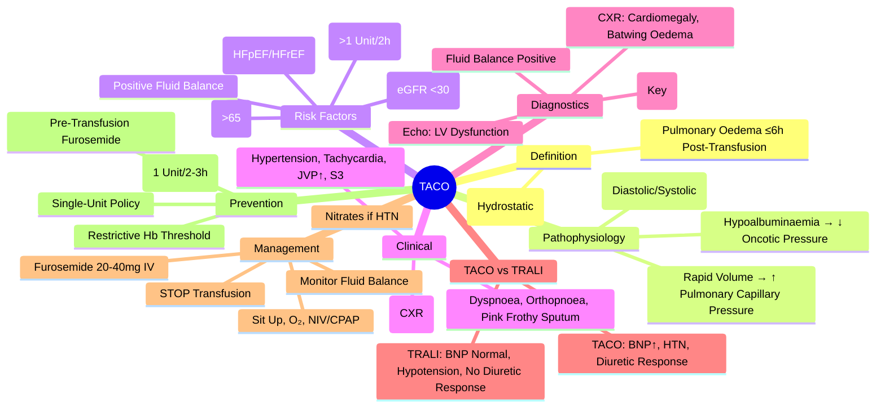

# Transfusion-Associated Circulatory Overload (TACO)

> [!info]
> **TACO = Acute Pulmonary Oedema** due to **Rapid Volume Overload** from Transfusion. **Most Common Transfusion Reaction Causing Major Morbidity.** **High-Risk Groups: Elderly, Cardiac Failure, Renal Failure, Paediatrics.** **BNP/NT-proBNP Elevation is Diagnostic.**

---

## 1. Learning Objectives
By the end of this note you should be able to:
- [ ] Define TACO and differentiate from TRALI and other causes of acute dyspnoea post-transfusion
- [ ] Identify high-risk patients and apply preventive strategies
- [ ] Apply immediate management (STOP transfusion, O₂, diuretics, NIV)
- [ ] Understand risk stratification and prevention strategies

---

## 2. Definition & Diagnostic Criteria

### NHLBI / CDC / NHSN Criteria
| Criterion | Requirement |
|-----------|-------------|
| **1. Acute Respiratory Distress** | Dyspnoea, Orthopnoea, Cough, Hypoxaemia (SpO₂ <90%) |
| **2. Radiological** | **Bilateral Pulmonary Oedema** (CXR: Batwing Infiltrates, Kerley B Lines, Cardiomegaly) |
| **3. Fluid Overload** | **Positive Fluid Balance** (Net Gain >1L or Weight Gain >2kg) |
| **4. Cardiovascular** | **Hypertension**, Tachycardia, **Elevated JVP**, Elevated BNP/NT-proBNP |
| **5. Temporal** | **Onset ≤6 Hours** Post-Transfusion (Can Occur During Transfusion) |
| **6. Exclusion** | No Alternative Explanation (TRALI, Sepsis, Anaphylaxis, Primary Cardiac Event) |

### Severity Grading (NHS / SHOT)
| Grade | Clinical Features |
|-------|-------------------|
| **Mild** | Dyspnoea, O₂ Requirement <4L, BNP Elevated, No NIV/Intubation |
| **Moderate** | O₂ Requirement ≥4L, NIV Required, BNP Markedly Elevated |
| **Severe** | **Intubation Required**, ICU Admission, Shock, Renal Failure |

---

## 2. Pathophysiology

| Mechanism | Details |
|-----------|---------|
| **Hydrostatic Pressure** | **Rapid Volume Infusion** → ↑ Pulmonary Capillary Pressure → Transudation into Alveoli |
| **Left Ventricular Dysfunction** | Pre-existing **Diastolic/Systolic Dysfunction** → Inability to Handle Volume Load |
| **Decreased Oncotic Pressure** | Hypoalbuminaemia (Common in Transfused Patients) → Favours Fluid Transudation |
| **Pulmonary Venous Constriction** | Neurohormonal Response → ↑ Pulmonary Venous Pressure |

---

## 2. Risk Factors (High-Yield)

| Patient Factors | Transfusion Factors |
|-----------------|---------------------|
| **Age >65** | **Rapid Transfusion Rate** (>1 Unit/2h) |
| **Pre-existing Heart Failure** (HFrEF/HFpEF) | **Large Volume** (>2 Units Rapidly) |
| **Chronic Kidney Disease** (eGFR <30) | **Large Volume Plasma/Platelets** |
| **Hypertension / LVH** | **Both RBCs + Plasma/Platelets** (Combined Volume) |
| **Anaemia (Severe)** → High Output State | **Failure to Diurese** Between Units |
| **Positive Fluid Balance Pre-Transfusion** | |
| **Paediatric / Neonatal** | |

---

## 3. Clinical Presentation

| System | Features |
|--------|----------|
| **Respiratory** | **Acute Dyspnoea**, Orthopnoea, **Tachypnoea**, **Hypoxaemia** (SpO₂ <90%), **Pink Frothy Sputum** |
| **Cardiovascular** | **Hypertension** (Early), Tachycardia, **Elevated JVP**, **S3/S4 Gallop**, Peripheral Oedema |
| **Radiological** | **Bilateral Pulmonary Oedema** (Batwing Pattern), **Cardiomegaly**, Pleural Effusions, Kerley B Lines |
| **Laboratory** | **↑ BNP / NT-proBNP** (Markedly Elevated), ↑ Troponin (Demand Ischaemia), Fluid Balance Positive |

---

## 3. TACO vs TRALI vs TRALI – Critical Differentiation

| Feature | **TACO** | **TRALI** | **Anaphylaxis** |
|---------|----------|-----------|-----------------|
| **Mechanism** | Volume Overload (Hydrostatic) | Immune/Non-Immune Lung Injury | IgE-Mediated Hypersensitivity |
| **BNP / NT-proBNP** | **Markedly Elevated** | **Normal / Low** | Normal |
| **JVP / CVP** | **Elevated** | Normal | Normal |
| **Blood Pressure** | **Hypertension** (Early) | **Hypotension** | **Hypotension + Shock** |
| **Fluid Balance** | **Positive** (Volume Overload) | Neutral / Negative | Neutral |
| **Response to Diuretics** | **Rapid Improvement** | No Response / Worsens | No Response |
| **Echocardiography** | **LV Dysfunction / Dilatation** | Normal LV Function | Normal (Unless Shock) |
| **Key Feature** | **Volume Overload Signs** | **No Cardiac Failure** | Urticaria, Angioedema, Wheeze |

---

## 4. Immediate Management

| Priority | Action |
|----------|--------|
| **1. STOP TRANSFUSION IMMEDIATELY** | **Do Not Flush Line** |
| **2. Airway / Breathing** | **Sit Upright** (90°); **O₂** (Target SpO₂ ≥94%); **NIV (CPAP/BiPAP)** if SpO₂ <90% on O₂; **Intubation** if Failing NIV |
| **3. Circulation** | **IV Furosemide 20-40mg IV** (Bolus); **Repeat if Needed**; **Nitrates** (If Hypertensive); **Avoid Excessive Fluids** |
| **4. Monitoring** | Continuous SpO₂, NIBP, ECG; **Strict Fluid Balance** (Input/Output); BNP/NT-proBNP Serial |
| **5. Investigations** | CXR, ABG, BNP/NT-proBNP, Echo (If Uncertain), ECG, U&Es, Troponin |
| **6. Reporting** | **Report to Blood Service / SHOT** (Serious Hazards of Transfusion) |

> **Key**: **Diuretics are First-Line** in TACO (Unlike TRALI where Contraindicated).

---

## 4. Prevention Strategies

| Strategy | Implementation |
|----------|---------------|
| **Slow Transfusion Rate** | **1 Unit RBC over 2-3 Hours** (Standard); **Slower (4h) in High-Risk** |
| **Diuretic Prophylaxis** | **IV Furosemide 20-40mg Pre-Transfusion** (If High-Risk: HF, CKD, Elderly) |
| **Volume Minimisation** | **Avoid Unnecessary Transfusion**; Use **Single-Unit Policy** (Restrictive Threshold Hb <70-80 g/L); **Avoid Concomitant Plasma/Platelets** Unless Indicated |
| **Pre-Transfusion Diuresis** | **Pre-Transfusion Furosemide** (If Fluid Overloaded) |
| **Monitoring** | **Strict Fluid Balance**; Weigh Pre/Post Transfusion; Monitor BNP in High-Risk |
| **Paediatric/Neonatal** | **Volume-Controlled Transfusion** (10-15 mL/kg over 3-4h); **Diuretic Prophylaxis** |

---

## 5. Prognosis & Outcomes

| Parameter | Value |
|-----------|-------|
| **Incidence** | **1-6%** of Transfused Patients (Under-Recognised) |
| **Mortality** | **5-15%** (If Severe, Delayed Recognition) |
| **Recurrence Risk** | **High** if Risk Factors Persist |
| **Long-Term** | Most Recover Fully if Treated Promptly |

---

## 5. Exam Pearls (FCPS/MRCP)

| Topic | Key Point |
|-------|-----------|
| **TACO Definition** | Acute Pulmonary Oedema ≤6h Post-Transfusion + **Volume Overload Signs** |
| **TACO vs TRALI** | **TACO = BNP High, Hypertension, JVP↑, Diuretic Response**; **TRALI = BNP Normal, Hypotension, No Diuretic Response** |
| **Most Common Severe Reaction** | **TACO** (Under-Recognised; 1-6% Incidence) |
| **High-Risk Groups** | **Elderly, HF, CKD, Rapid Transfusion, Paediatrics** |
| **BNP in TACO** | **Markedly Elevated** (Key Differentiator from TRALI) |
| **Management** | **STOP Transfusion; Sit Upright; O₂; Furosemide 20-40mg IV; NIV** |
| **Diuretics** | **First-Line** (Unlike TRALI where Contraindicated) |
| **Prevention** | **Slow Rate (1 Unit/2-3h); Diuretic Prophylaxis; Single-Unit Policy; Restrictive Hb Threshold** |
| **SHOT Reporting** | All Severe TACO → SHOT + Blood Service |
| **NIV/CPAP** | First-Line Ventilatory Support (Reduces Work of Breathing, Improves O₂) |
| **Risk Factors** | Age >65, HF, CKD, Rapid Transfusion, Volume Overload Pre-Transfusion |

---

## 8. Mind Map

---

## 9. Exam Pearls (FCPS/MRCP)

| Topic | Key Point |
|-------|-----------|
| **TACO vs TRALI** | **BNP High = TACO; BNP Normal = TRALI** |
| **TACO Management** | **STOP → Sit Up → O₂ → Furosemide → NIV** |
| **Most Common Severe Reaction** | **TACO** (Incidence 1-6%) |
| **BNP in TACO** | **Markedly Elevated** |
| **Diuretic** | **First-Line** (Contrast TRALI) |
| **Risk Factors** | Elderly, HF, CKD, Rapid Transfusion, Large Volume |
| **Prevention** | 1 Unit/2-3h, Pre-Transfusion Furosemide, Single-Unit Policy |
| **SHOT** | Report Severe TACO |
| **NIV/CPAP** | First-Line Ventilatory Support |
| **Echo in TACO** | LV Dysfunction/Dilatation (Unlike TRALI) |
| **CXR** | Cardiomegaly + Batwing Pulmonary Oedema |

---

## 9. Local Navigation (for Dashboard UI)

> **Parent**: [[Transfusion Reactions]]  
> **Hierarchy**: [[../../Davidson Chapter 25 - Haematology Hierarchy|Haematology Hierarchy]]  
> **Template**: [[../../../Templates/Hematology Topic Template|Hematology Topic Template]]  
> **See also**: [[TRALI]], [[Transfusion Reactions]], [[Massive Transfusion Protocol]], [[Heart Failure]], [[Transfusion Medicine]]
---

> Auto-generated study sections for "Hematology" — Ch 24: Haematology & Transfusion Medicine.

## Flashcards (49 generated)

- Q: What is 1. Acute Respiratory Distress of Hematology?
  A: Dyspnoea, Orthopnoea, Cough, Hypoxaemia (SpO₂ <90%)
- Q: What is 2. Radiological of Hematology?
  A: Bilateral Pulmonary Oedema (CXR: Batwing Infiltrates, Kerley B Lines, Cardiomegaly)
- Q: What is 3. Fluid Overload of Hematology?
  A: Positive Fluid Balance (Net Gain >1L or Weight Gain >2kg)
- Q: What is 4. Cardiovascular of Hematology?
  A: Hypertension, Tachycardia, Elevated JVP, Elevated BNP/NT-proBNP
- Q: What is 5. Temporal of Hematology?
  A: Onset ≤6 Hours Post-Transfusion (Can Occur During Transfusion)
- Q: What is 6. Exclusion of Hematology?
  A: No Alternative Explanation (TRALI, Sepsis, Anaphylaxis, Primary Cardiac Event)
- Q: What is Hydrostatic Pressure of Hematology?
  A: Rapid Volume Infusion → ↑ Pulmonary Capillary Pressure → Transudation into Alveoli
- Q: What is Left Ventricular Dysfunction of Hematology?
  A: Pre-existing Diastolic/Systolic Dysfunction → Inability to Handle Volume Load
- Q: What is Decreased Oncotic Pressure of Hematology?
  A: Hypoalbuminaemia (Common in Transfused Patients) → Favours Fluid Transudation
- Q: What is Pulmonary Venous Constriction of Hematology?
  A: Neurohormonal Response → ↑ Pulmonary Venous Pressure
- Q: What is the epidemiology of Hematology?
  A: 1-6% of Transfused Patients (Under-Recognised)
- Q: What is Mortality of Hematology?
  A: 5-15% (If Severe, Delayed Recognition)
- Q: What is Recurrence Risk of Hematology?
  A: High if Risk Factors Persist
- Q: What is Long-Term of Hematology?
  A: Most Recover Fully if Treated Promptly
- Q: What is the definition of Hematology?
  A: Acute Pulmonary Oedema ≤6h Post-Transfusion + Volume Overload Signs
- Q: What is TACO vs TRALI of Hematology?
  A: TACO = BNP High, Hypertension, JVP↑, Diuretic Response; TRALI = BNP Normal, Hypotension, No Diuretic Response
- Q: What is Most Common Severe Reaction of Hematology?
  A: TACO (Under-Recognised; 1-6% Incidence)
- Q: What is High-Risk Groups of Hematology?
  A: Elderly, HF, CKD, Rapid Transfusion, Paediatrics
- Q: What is BNP in TACO of Hematology?
  A: Markedly Elevated (Key Differentiator from TRALI)
- Q: How is Hematology managed?
  A: STOP Transfusion; Sit Upright; O₂; Furosemide 20-40mg IV; NIV
- Q: What is Diuretics of Hematology?
  A: First-Line (Unlike TRALI where Contraindicated)
- Q: What is Prevention of Hematology?
  A: Slow Rate (1 Unit/2-3h); Diuretic Prophylaxis; Single-Unit Policy; Restrictive Hb Threshold
- Q: What is SHOT Reporting of Hematology?
  A: All Severe TACO → SHOT + Blood Service
- Q: What is NIV/CPAP of Hematology?
  A: First-Line Ventilatory Support (Reduces Work of Breathing, Improves O₂)
- Q: What causes Hematology?
  A: Age >65, HF, CKD, Rapid Transfusion, Volume Overload Pre-Transfusion
- Q: What is 1. Acute Respiratory Distress of Hematology?
  A: Dyspnoea, Orthopnoea, Cough, Hypoxaemia (SpO₂ <90%)
- Q: What is 2. Radiological of Hematology?
  A: Bilateral Pulmonary Oedema (CXR: Batwing Infiltrates, Kerley B Lines, Cardiomegaly)
- Q: What is 3. Fluid Overload of Hematology?
  A: Positive Fluid Balance (Net Gain >1L or Weight Gain >2kg)
- Q: What is 4. Cardiovascular of Hematology?
  A: Hypertension, Tachycardia, Elevated JVP, Elevated BNP/NT-proBNP
- Q: What is 5. Temporal of Hematology?
  A: Onset ≤6 Hours Post-Transfusion (Can Occur During Transfusion)
- Q: What is Hydrostatic Pressure of Hematology?
  A: Rapid Volume Infusion → ↑ Pulmonary Capillary Pressure → Transudation into Alveoli
- Q: What is Left Ventricular Dysfunction of Hematology?
  A: Pre-existing Diastolic/Systolic Dysfunction → Inability to Handle Volume Load
- Q: What is Decreased Oncotic Pressure of Hematology?
  A: Hypoalbuminaemia (Common in Transfused Patients) → Favours Fluid Transudation
- Q: What is Pulmonary Venous Constriction of Hematology?
  A: Neurohormonal Response → ↑ Pulmonary Venous Pressure
- Q: What is the epidemiology of Hematology?
  A: 1-6% of Transfused Patients (Under-Recognised)
- Q: What is Mortality of Hematology?
  A: 5-15% (If Severe, Delayed Recognition)
- Q: What is Recurrence Risk of Hematology?
  A: High if Risk Factors Persist
- Q: What is Long-Term of Hematology?
  A: Most Recover Fully if Treated Promptly
- Q: What is the definition of Hematology?
  A: Acute Pulmonary Oedema ≤6h Post-Transfusion + Volume Overload Signs
- Q: What is TACO vs TRALI of Hematology?
  A: TACO = BNP High, Hypertension, JVP↑, Diuretic Response; TRALI = BNP Normal, Hypotension, No Diuretic Response
- Q: What is Most Common Severe Reaction of Hematology?
  A: TACO (Under-Recognised; 1-6% Incidence)
- Q: What is High-Risk Groups of Hematology?
  A: Elderly, HF, CKD, Rapid Transfusion, Paediatrics
- Q: What is BNP in TACO of Hematology?
  A: Markedly Elevated (Key Differentiator from TRALI)
- Q: How is Hematology managed?
  A: STOP Transfusion; Sit Upright; O₂; Furosemide 20-40mg IV; NIV
- Q: What is Diuretics of Hematology?
  A: First-Line (Unlike TRALI where Contraindicated)
- Q: What is Prevention of Hematology?
  A: Slow Rate (1 Unit/2-3h); Diuretic Prophylaxis; Single-Unit Policy; Restrictive Hb Threshold
- Q: What is SHOT Reporting of Hematology?
  A: All Severe TACO → SHOT + Blood Service
- Q: What is NIV/CPAP of Hematology?
  A: First-Line Ventilatory Support (Reduces Work of Breathing, Improves O₂)
- Q: What causes Hematology?
  A: Age >65, HF, CKD, Rapid Transfusion, Volume Overload Pre-Transfusion

## MCQs (1 generated)

1. **Which of the following best describes Hematology?**
   A. **TACO = Acute Pulmonary Oedema due to Rapid Volume Overload from Transfusion.**
   B. An unrelated condition not matching the clinical picture of Hematology
   C. A complication seen late in the disease course of Hematology
   D. A condition that mimics Hematology but has a different underlying cause

## SBA Questions (1 generated)

1. A patient with suspected Hematology presents with: 1. Acute Respiratory Distress — Dyspnoea, Orthopnoea, Cough, Hypoxaemia (SpO₂ <90%); 2. Radiological — Bilateral Pulmonary Oedema (CXR: Batwing Infiltrates, Kerley B Lines, Cardiomegaly); 3. Fluid Overload — Positive Fluid Balance (Net Gain >1L or Weight Gain >2kg). What is the most likely diagnosis?
   A. **Hematology**
   B. A condition that mimics Hematology but is not the same entity
   C. A complication of Hematology rather than the primary diagnosis
   D. An unrelated condition in the same clinical category as Hematology

## PasTest Scenario SBAs (Clinical Vignettes)

> **Auto-generated PasTest/Mediscope-style scenario SBAs** grounded in the authored source content. Each scenario is a clinical vignette with 4 options. **Source: Ch 24: Haematology / TACO**

**Q1.** A patient is diagnosed with TACO. What is the most appropriate first-line management approach?

  - **A.** Standard guideline-directed first-line therapy
  - **B.** Most aggressive advanced therapy as first-line
  - **C.** No treatment needed in most cases
  - **D.** Investigational/compassionate-use therapy only

  > **Answer: A** — Standard guideline-directed first-line therapy

