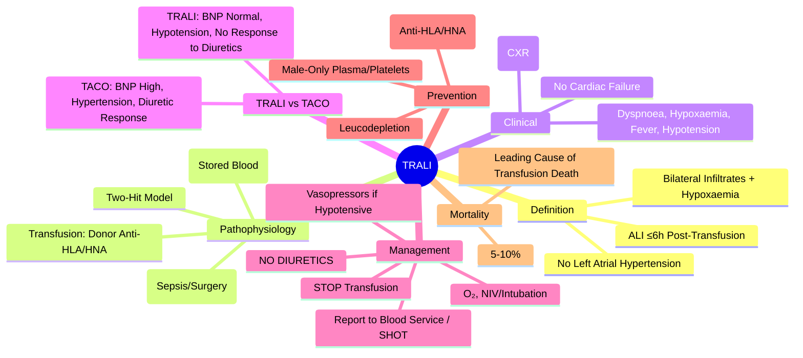

# Transfusion-Related Acute Lung Injury (TRALI)

> [!info]
> **TRALI = Acute Non-Cardiogenic Pulmonary Oedema** temporally related to Transfusion. **Leading Cause of Transfusion-Related Mortality (UK/US).** **Donor Anti-HLA/HNA Antibodies** → Recipient Neutrophil Activation → Pulmonary Capillary Leak. **Clinical Differentiation from TACO is Critical.**

---

## 1. Learning Objectives
By the end of this note you should be able to:
- [ ] Define TRALI and its pathophysiology
- [ ] Apply diagnostic criteria (Canadian Consensus / NHSN)
- [ ] Differentiate TRALI from TACO and other causes of acute hypoxaemia post-transfusion
- [ ] Apply immediate management and reporting requirements
- [ ] Understand prevention strategies (male-only plasma, leucodepletion)

---

## 2. Definition & Diagnostic Criteria

### Canadian Consensus Criteria (2004) / NHSN Definition
| Criterion | Requirement |
|-----------|-------------|
| **1. Acute Lung Injury** | Acute Onset + Bilateral Pulmonary Infiltrates (CXR/CT) |
| **2. Hypoxaemia** | **PaO₂/FiO₂ ≤300 mmHg** or SpO₂ <90% on Room Air |
| **3. No Left Atrial Hypertension** | **No Clinical Evidence of Fluid Overload** (Normal BNP/NT-proBNP, Normal CVP/PCWP) |
| **4. Temporal Association** | **Onset ≤6 Hours** Post-Transfusion Completion |
| **5. Exclusion** | No Other Risk Factor for ALI (Sepsis, Aspiration, Trauma, Pancreatitis, etc.) |

### Grading (Severity)
| Grade | PaO₂/FiO₂ | Oxygen Support |
|-------|-----------|----------------|
| **Mild** | >300 | None / Nasal Cannula |
| **Moderate** | 200-300 | High-Flow / NIV |
| **Severe** | <200 | Mechanical Ventilation |

---

## 2. Pathophysiology

### Two-Hit Model
| Hit | Mechanism |
|-----|-----------|
| **First Hit (Patient)** | **Primed Neutrophils** adherent to Pulmonary Endothelium (Sepsis, Surgery, Inflammation, Trauma) |
| **Second Hit (Transfusion)** | **Donor Antibodies** (Anti-HLA Class I/II, Anti-HNA) or **Bioactive Lipids** in Stored Blood → Neutrophil Activation → Endothelial Damage → Capillary Leak |

### Mediators
| Mediator | Source | Effect |
|----------|--------|--------|
| **Donor Anti-HLA Class I/II** | Multiparous Female Donors (Pregnancy Sensitisation) | Bind Recipient Neutrophil HLA → Activation |
| **Donor Anti-HNA (HNA-1a, 3a, 2a)** | Multiparous Donors | Bind Neutrophil Antigens → Activation |
| **Bioactive Lipids** (Lysophosphatidylcholines) | Accumulate during RBC/Platelet Storage | Neutrophil Priming/Activation |
| **Neutrophil Products** | Activated Neutrophils | ROS, Proteases, NETs → Endothelial Injury |

---

## 3. Clinical Presentation

| Feature | Details |
|---------|---------|
| **Onset** | **≤6 Hours** Post-Transfusion (Median 1-2 Hours) |
| **Respiratory** | Acute Dyspnoea, Hypoxaemia (SpO₂ <90%), Tachypnoea, Cyanosis |
| **Radiological** | **Bilateral Pulmonary Infiltrates** (Perihilar/Peripheral), "White-Out" in Severe Cases |
| **Haemodynamic** | **Hypotension** (Common), Fever, Tachycardia |
| **Laboratory** | **No Left Heart Failure** (Normal CVP, Normal BNP/NT-proBNP, Normal PCWP if Swan-Ganz) |
| **Exclusion** | No Sepsis, Aspiration, Trauma, Pancreatitis, Drowning, Drug Overdose in Same Timeframe |

---

## 3. TRALI vs TACO – Critical Differentiation

| Feature | **TRALI** | **TACO** |
|---------|-----------|----------|
| **Mechanism** | Immune/Non-Immune Lung Injury | Volume Overload (Hydrostatic) |
| **BNP / NT-proBNP** | **Normal / Low** | **Markedly Elevated** |
| **CVP / PCWP** | **Normal** | **Elevated** |
| **Fluid Balance** | **Neutral / Negative** | **Positive (Volume Overload)** |
| **Hypertension** | **Absent / Hypotension** | **Present (Hypertension)** |
| **Response to Diuretics** | **No Response** (May Worsen Hypotension) | **Rapid Improvement** |
| **Cardiac Function** | Normal (Echo) | **LV Dysfunction / Dilatation** |
| **Pulmonary Capillary Wedge Pressure** | **Normal (<18 mmHg)** | **Elevated (>18 mmHg)** |
| **Echocardiography** | Normal LV Systolic Function | LV Dysfunction / Diastolic Dysfunction |

> **Key**: **BNP Normal + Hypotension = TRALI**; **BNP High + Hypertension = TACO**

---

## 4. Immediate Management

| Step | Action |
|------|--------|
| **1. STOP TRANSFUSION IMMEDIATELY** | |
| **2. Airway / Breathing** | **O₂, High-Flow / NIV / Intubation** (If Severe Hypoxaemia) — **Protective Ventilation (Low Tidal Volume 6-8 mL/kg)** |
| **3. Circulation** | **IV Fluids / Vasopressors** (If Hypotensive) — **NO DIURETICS** (Unlike TACO) |
| **4. Investigations** | ABG, CXR, **BNP/NT-proBNP**, Echo, Blood Cultures (Exclude Sepsis), **Send Unit + Patient Sample for Donor Antibody Testing** |
| **5. Reporting** | **Report to Blood Service** (Donor Deferral/Quarantine); **SHOT** (UK) |
| **6. Supportive** | **Lung-Protective Ventilation**; Prone Positioning (If Severe ARDS); **NO Routine Corticosteroids** (No Benefit) |

---

## 4. Donor Investigation & Prevention

| Finding | Action |
|---------|--------|
| **Anti-HLA Class I/II Positive** | **Defer Donor** (If Implicated); Quarantine Remaining Components |
| **Anti-HNA Positive** | **Defer Donor** |
| **No Antibodies Found** | Consider **Bioactive Lipid** Mechanism; Quarantine Components Investigated |

### Prevention Strategies (Implemented)
| Strategy | Implementation | Effect |
|----------|----------------|--------|
| **Male-Only Plasma** | **All FFP/Platelets from Male Donors** (UK 2004) | **>80% Reduction in TRALI** (Females Higher Anti-HLA/HNA from Pregnancy) |
| **Leucodepletion** | **Universal Leucodepletion** (UK 1999) | Removes Leucocytes + Reduces Bioactive Lipids |
| **Donor Deferral** | **Implicated Donors Deferred** (Anti-HLA/HNA) | Prevents Recurrence |
| **Platelet Additive Solutions** | Reduce Plasma Volume in Platelets | Reduces Antibody/Lipid Load |

---

## 4. Prognosis & Outcomes

| Parameter | Value |
|-----------|-------|
| **Mortality** | **5-10%** (Respiratory Failure, Multi-Organ Failure) |
| **Recovery** | **Most Survivors Recover Fully** (Days-Weeks) |
| **Recurrent TRALI** | Rare (If Donor Deferred) |
| **Long-Term Sequelae** | Rare (Chronic Lung Disease Uncommon) |

---

## 5. Exam Pearls (FCPS/MRCP)

| Topic | Key Point |
|-------|-----------|
| **TRALI Definition** | ALI ≤6h Post-Transfusion + **No Left Atrial Hypertension** |
| **TRALI vs TACO** | **TRALI = BNP Normal, Hypotension**; **TACO = BNP High, Hypertension** |
| **Pathophysiology** | **Two-Hit**: Patient Primed Neutrophils + Donor Anti-HLA/HNA Antibodies |
| **Donor Source** | **Multiparous Females** (Anti-HLA/HNA from Pregnancy) |
| **Onset** | **≤6 Hours** Post-Transfusion |
| **Management** | **Supportive (O₂, Ventilation); NO Diuretics**; STOP Transfusion |
| **Prevention** | **Male-Only Plasma/Platelets** (UK 2004); **Leucodepletion** |
| **Mortality** | **5-10%** (Leading Cause of Transfusion Death) |
| **BNP in TRALI** | **Normal / Low** (Key Differentiator from TACO) |
| **Donor Testing** | Anti-HLA/HNA Antibodies on Implicated Donors |
| **Diuretic Contraindicated** | **Worsens Hypotension** (Unlike TACO) |
| **Reporting** | **SHOT + Blood Service** (Donor Deferral) |

---

## 8. Mind Map

---

## 9. Exam Pearls (FCPS/MRCP)

| Topic | Key Point |
|-------|-----------|
| **TRALI vs TACO** | **BNP Normal = TRALI; BNP High = TACO** |
| **TRALI Definition** | ALI ≤6h Post-Transfusion; No Cardiac Failure; Bilateral Infiltrates |
| **Pathophysiology** | Two-Hit: Primed Neutrophils + Donor Anti-HLA/HNA |
| **Donor Source** | Multiparous Females (Anti-HLA/HNA from Pregnancy) |
| **Onset** | ≤6 Hours Post-Transfusion |
| **Management** | Supportive; **NO Diuretics**; Stop Transfusion; Report to Blood Service |
| **Prevention** | **Male-Only Plasma/Platelets**; Leucodepletion; Donor Deferral |
| **Mortality** | **5-10%** (Leading Cause of Transfusion Death in UK/US) |
| **BNP** | **Normal in TRALI** (Key Differentiator) |
| **Reporting** | **SHOT + Blood Service** (Donor Deferral) |
| **Diuretic** | **Contraindicated** (Worsens Hypotension) |
| **CXR** | Bilateral Pulmonary Infiltrates ("White-Out") |
| **Donor Deferral** | Anti-HLA/HNA Positive Donors Deferred |

---

## 9. Local Navigation (for Dashboard UI)

> **Parent**: [[Transfusion Reactions]]  
> **Hierarchy**: [[../../Davidson Chapter 25 - Haematology Hierarchy|Haematology Hierarchy]]  
> **Template**: [[../../../Templates/Hematology Topic Template|Hematology Topic Template]]  
> **See also**: [[TACO]], [[Transfusion Reactions]], [[Acute Haemolytic Transfusion Reaction]], [[Transfusion Medicine]]
---

> Auto-generated study sections for "Hematology" — Ch 24: Haematology & Transfusion Medicine.

## Flashcards (79 generated)

- Q: What is 1. Acute Lung Injury of Hematology?
  A: Acute Onset + Bilateral Pulmonary Infiltrates (CXR/CT)
- Q: What is 2. Hypoxaemia of Hematology?
  A: PaO₂/FiO₂ ≤300 mmHg or SpO₂ <90% on Room Air
- Q: What is 3. No Left Atrial Hypertension of Hematology?
  A: No Clinical Evidence of Fluid Overload (Normal BNP/NT-proBNP, Normal CVP/PCWP)
- Q: What is 4. Temporal Association of Hematology?
  A: Onset ≤6 Hours Post-Transfusion Completion
- Q: What is 5. Exclusion of Hematology?
  A: No Other Risk Factor for ALI (Sepsis, Aspiration, Trauma, Pancreatitis, etc.)
- Q: What is Onset of Hematology?
  A: ≤6 Hours Post-Transfusion (Median 1-2 Hours)
- Q: What is Respiratory of Hematology?
  A: Acute Dyspnoea, Hypoxaemia (SpO₂ <90%), Tachypnoea, Cyanosis
- Q: What is Radiological of Hematology?
  A: Bilateral Pulmonary Infiltrates (Perihilar/Peripheral), "White-Out" in Severe Cases
- Q: What is Haemodynamic of Hematology?
  A: Hypotension (Common), Fever, Tachycardia
- Q: What is Laboratory of Hematology?
  A: No Left Heart Failure (Normal CVP, Normal BNP/NT-proBNP, Normal PCWP if Swan-Ganz)
- Q: What is Exclusion of Hematology?
  A: No Sepsis, Aspiration, Trauma, Pancreatitis, Drowning, Drug Overdose in Same Timeframe
- Q: What is Mortality of Hematology?
  A: 5-10% (Respiratory Failure, Multi-Organ Failure)
- Q: What is Recovery of Hematology?
  A: Most Survivors Recover Fully (Days-Weeks)
- Q: What is Recurrent TRALI of Hematology?
  A: Rare (If Donor Deferred)
- Q: What is Long-Term Sequelae of Hematology?
  A: Rare (Chronic Lung Disease Uncommon)
- Q: What is the definition of Hematology?
  A: ALI ≤6h Post-Transfusion + No Left Atrial Hypertension
- Q: What is TRALI vs TACO of Hematology?
  A: TRALI = BNP Normal, Hypotension; TACO = BNP High, Hypertension
- Q: What is the pathogenesis of Hematology?
  A: Two-Hit: Patient Primed Neutrophils + Donor Anti-HLA/HNA Antibodies
- Q: What is Donor Source of Hematology?
  A: Multiparous Females (Anti-HLA/HNA from Pregnancy)
- Q: What is Onset of Hematology?
  A: ≤6 Hours Post-Transfusion
- Q: How is Hematology managed?
  A: Supportive (O₂, Ventilation); NO Diuretics; STOP Transfusion
- Q: What is Prevention of Hematology?
  A: Male-Only Plasma/Platelets (UK 2004); Leucodepletion
- Q: What is Mortality of Hematology?
  A: 5-10% (Leading Cause of Transfusion Death)
- Q: What is BNP in TRALI of Hematology?
  A: Normal / Low (Key Differentiator from TACO)
- Q: What is the investigation of choice for Hematology?
  A: Anti-HLA/HNA Antibodies on Implicated Donors
- Q: What is Diuretic Contraindicated of Hematology?
  A: Worsens Hypotension (Unlike TACO)
- Q: What is Reporting of Hematology?
  A: SHOT + Blood Service (Donor Deferral)
- Q: What is TRALI vs TACO of Hematology?
  A: BNP Normal = TRALI; BNP High = TACO
- Q: What is the definition of Hematology?
  A: ALI ≤6h Post-Transfusion; No Cardiac Failure; Bilateral Infiltrates
- Q: What is the pathogenesis of Hematology?
  A: Two-Hit: Primed Neutrophils + Donor Anti-HLA/HNA
- Q: What is Donor Source of Hematology?
  A: Multiparous Females (Anti-HLA/HNA from Pregnancy)
- Q: What is Onset of Hematology?
  A: ≤6 Hours Post-Transfusion
- Q: How is Hematology managed?
  A: Supportive; NO Diuretics; Stop Transfusion; Report to Blood Service
- Q: What is Prevention of Hematology?
  A: Male-Only Plasma/Platelets; Leucodepletion; Donor Deferral
- Q: What is Mortality of Hematology?
  A: 5-10% (Leading Cause of Transfusion Death in UK/US)
- Q: What is BNP of Hematology?
  A: Normal in TRALI (Key Differentiator)
- Q: What is Reporting of Hematology?
  A: SHOT + Blood Service (Donor Deferral)
- Q: What is Diuretic of Hematology?
  A: Contraindicated (Worsens Hypotension)
- Q: What is CXR of Hematology?
  A: Bilateral Pulmonary Infiltrates ("White-Out")
- Q: What is Donor Deferral of Hematology?
  A: Anti-HLA/HNA Positive Donors Deferred
- Q: What is 1. Acute Lung Injury of Hematology?
  A: Acute Onset + Bilateral Pulmonary Infiltrates (CXR/CT)
- Q: What is 2. Hypoxaemia of Hematology?
  A: PaO₂/FiO₂ ≤300 mmHg or SpO₂ <90% on Room Air
- Q: What is 3. No Left Atrial Hypertension of Hematology?
  A: No Clinical Evidence of Fluid Overload (Normal BNP/NT-proBNP, Normal CVP/PCWP)
- Q: What is 4. Temporal Association of Hematology?
  A: Onset ≤6 Hours Post-Transfusion Completion
- Q: What is Onset of Hematology?
  A: ≤6 Hours Post-Transfusion (Median 1-2 Hours)
- Q: What is Respiratory of Hematology?
  A: Acute Dyspnoea, Hypoxaemia (SpO₂ <90%), Tachypnoea, Cyanosis
- Q: What is Radiological of Hematology?
  A: Bilateral Pulmonary Infiltrates (Perihilar/Peripheral), "White-Out" in Severe Cases
- Q: What is Haemodynamic of Hematology?
  A: Hypotension (Common), Fever, Tachycardia
- Q: What is Laboratory of Hematology?
  A: No Left Heart Failure (Normal CVP, Normal BNP/NT-proBNP, Normal PCWP if Swan-Ganz)
- Q: What is Exclusion of Hematology?
  A: No Sepsis, Aspiration, Trauma, Pancreatitis, Drowning, Drug Overdose in Same Timeframe
- Q: What is Mortality of Hematology?
  A: 5-10% (Respiratory Failure, Multi-Organ Failure)
- Q: What is Recovery of Hematology?
  A: Most Survivors Recover Fully (Days-Weeks)
- Q: What is Recurrent TRALI of Hematology?
  A: Rare (If Donor Deferred)
- Q: What is Long-Term Sequelae of Hematology?
  A: Rare (Chronic Lung Disease Uncommon)
- Q: What is the definition of Hematology?
  A: ALI ≤6h Post-Transfusion + No Left Atrial Hypertension
- Q: What is TRALI vs TACO of Hematology?
  A: TRALI = BNP Normal, Hypotension; TACO = BNP High, Hypertension
- Q: What is the pathogenesis of Hematology?
  A: Two-Hit: Patient Primed Neutrophils + Donor Anti-HLA/HNA Antibodies
- Q: What is Donor Source of Hematology?
  A: Multiparous Females (Anti-HLA/HNA from Pregnancy)
- Q: What is Onset of Hematology?
  A: ≤6 Hours Post-Transfusion
- Q: How is Hematology managed?
  A: Supportive (O₂, Ventilation); NO Diuretics; STOP Transfusion
- Q: What is Prevention of Hematology?
  A: Male-Only Plasma/Platelets (UK 2004); Leucodepletion
- Q: What is Mortality of Hematology?
  A: 5-10% (Leading Cause of Transfusion Death)
- Q: What is BNP in TRALI of Hematology?
  A: Normal / Low (Key Differentiator from TACO)
- Q: What is the investigation of choice for Hematology?
  A: Anti-HLA/HNA Antibodies on Implicated Donors
- Q: What is Diuretic Contraindicated of Hematology?
  A: Worsens Hypotension (Unlike TACO)
- Q: What is Reporting of Hematology?
  A: SHOT + Blood Service (Donor Deferral)
- Q: What is TRALI vs TACO of Hematology?
  A: BNP Normal = TRALI; BNP High = TACO
- Q: What is the definition of Hematology?
  A: ALI ≤6h Post-Transfusion; No Cardiac Failure; Bilateral Infiltrates
- Q: What is the pathogenesis of Hematology?
  A: Two-Hit: Primed Neutrophils + Donor Anti-HLA/HNA
- Q: What is Donor Source of Hematology?
  A: Multiparous Females (Anti-HLA/HNA from Pregnancy)
- Q: What is Onset of Hematology?
  A: ≤6 Hours Post-Transfusion
- Q: How is Hematology managed?
  A: Supportive; NO Diuretics; Stop Transfusion; Report to Blood Service
- Q: What is Prevention of Hematology?
  A: Male-Only Plasma/Platelets; Leucodepletion; Donor Deferral
- Q: What is Mortality of Hematology?
  A: 5-10% (Leading Cause of Transfusion Death in UK/US)
- Q: What is BNP of Hematology?
  A: Normal in TRALI (Key Differentiator)
- Q: What is Reporting of Hematology?
  A: SHOT + Blood Service (Donor Deferral)
- Q: What is Diuretic of Hematology?
  A: Contraindicated (Worsens Hypotension)
- Q: What is CXR of Hematology?
  A: Bilateral Pulmonary Infiltrates ("White-Out")
- Q: What is Donor Deferral of Hematology?
  A: Anti-HLA/HNA Positive Donors Deferred

## MCQs (1 generated)

1. **Which of the following best describes Hematology?**
   A. **TRALI = Acute Non-Cardiogenic Pulmonary Oedema temporally related to Transfusion.**
   B. An unrelated condition not matching the clinical picture of Hematology
   C. A complication seen late in the disease course of Hematology
   D. A condition that mimics Hematology but has a different underlying cause

## SBA Questions (1 generated)

1. A patient with suspected Hematology presents with: 1. Acute Lung Injury — Acute Onset + Bilateral Pulmonary Infiltrates (CXR/CT); 2. Hypoxaemia — PaO₂/FiO₂ ≤300 mmHg or SpO₂ <90% on Room Air; 3. No Left Atrial Hypertension — No Clinical Evidence of Fluid Overload (Normal BNP/NT-proBNP, Normal CVP/PCWP). What is the most likely diagnosis?
   A. **Hematology**
   B. A condition that mimics Hematology but is not the same entity
   C. A complication of Hematology rather than the primary diagnosis
   D. An unrelated condition in the same clinical category as Hematology

