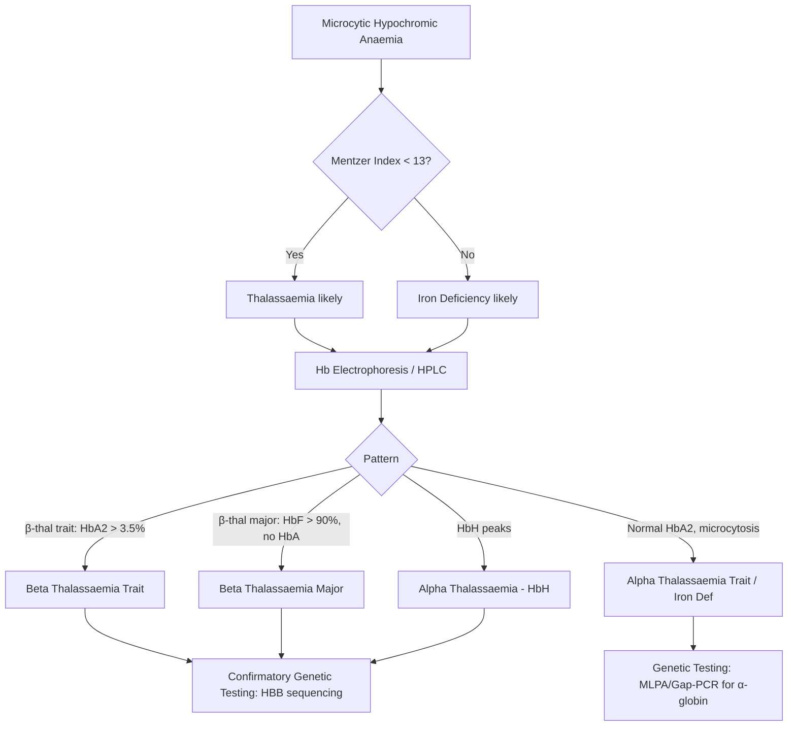

# Thalassaemia (Alpha & Beta)

> [!info] **Davidson Ch 25 Alignment**: Haemoglobinopathies → Thalassaemia syndromes
> **FCPS/MRCP Focus**: Classification, lab diagnosis, transfusion/chelation protocols, complications, prenatal diagnosis

---

## 🎯 Learning Objectives

- [ ] Define thalassaemia and classify alpha vs beta types by genetic defect and clinical severity
- [ ] Explain pathophysiology of ineffective erythropoiesis and haemolysis
- [ ] Interpret CBC, blood film, Hb electrophoresis/HPLC, and genetic studies
- [ ] Differentiate thalassaemia trait from iron deficiency using Mentzer index, RDW, HbA2
- [ ] Outline transfusion thresholds, chelation regimens (deferoxamine/deferiprone/deferasirox), and monitoring
- [ ] List major complications (iron overload, alloimmunization, extramedullary haematopoiesis, osteoporosis, endocrine)
- [ ] Describe curative options: HSCT, gene therapy (lentiviral, CRISPR)
- [ ] Apply prenatal diagnosis: CVS/amniocentesis, preimplantation genetic diagnosis

---

## 📖 Definition & Classification

| Feature | **Alpha Thalassaemia** | **Beta Thalassaemia** |
|---------|------------------------|----------------------|
| **Genetic Defect** | ↓/Absent α-globin chains (HBA1/HBA2 on chr 16) | ↓/Absent β-globin chains (HBB on chr 11) |
| **Gene Copies** | 4 α-globin genes (2 per allele) | 2 β-globin genes (1 per allele) |
| **Inheritance** | Autosomal recessive | Autosomal recessive |
| **Clinical Spectrum** | Silent carrier → HbH disease → Hb Bart's hydrops fetalis | Trait → Intermedia → Major |

### Beta Thalassaemia Clinical Classification

| Type | Genotype | HbA2 | HbF | Clinical Picture |
|------|----------|------|-----|------------------|
| **Trait (Minor)** | β⁺/β⁰ or β⁰/β⁰ | ↑↑ (3.5-7%) | Normal/slightly ↑ | Asymptomatic, microcytic hypochromic |
| **Intermedia** | β⁺/β⁺ or β⁺/β⁰ | ↑ | ↑↑ (10-50%) | Moderate anaemia (Hb 7-10 g/dL), no regular transfusions |
| **Major (Cooley's)** | β⁰/β⁰ | ↑ | ↑↑↑ (>90%) | Severe anaemia <6 months, transfusion-dependent |

### Alpha Thalassaemia Classification

| Genotype | α-genes lost | Syndrome | Clinical |
|----------|--------------|----------|----------|
| -α/αα | 1 | Silent carrier | Normal |
| -α/-α or --/αα | 2 | α-thal trait | Microcytosis, no anaemia |
| --/-α | 3 | **HbH disease** | Moderate haemolytic anaemia, splenomegaly |
| --/-- | 4 | **Hb Bart's hydrops fetalis** | Incompatible with life (fetal death) |

---

## ⚙️ Pathophysiology

```mermaid
flowchart TD
    A[Globin Chain Imbalance] --> B[Excess Unpaired Chains]
    B --> C{Beta Thal: Excess α-chains}
    B --> D{Alpha Thal: Excess β/γ-chains}
    C --> E[α-chain precipitation in erythroblasts]
    D --> F[β4 = HbH (unstable), γ4 = Hb Bart's]
    E --> G[Ineffective Erythropoiesis]
    F --> G
    G --> H[Marror Expansion]
    G --> I[Extramedullary Haematopoiesis]
    G --> J[Haemolysis]
    H --> K[Bone Deformities, Osteoporosis]
    I --> L[Hepatosplenomegaly, Masses]
    J --> M[Anaemia, Jaundice, Gallstones]
    K & L & M --> N[Transfusion Dependence]
    N --> O[Iron Overload]
    O --> P[Cardiac, Endocrine, Liver Toxicity]
```

**Key Mechanisms:**
- **Ineffective erythropoiesis**: Apoptosis of late erythroblasts → marrow expansion
- **Haemolysis**: Membrane damage from precipitated globin chains → shortened RBC survival
- **Anaemia drives**: EPO ↑ → marrow expansion → extramedullary haematopoiesis → bone deformities

---

## 🔬 Diagnostic Workup



### Key Diagnostic Values

| Parameter | β-Thal Trait | β-Thal Major | α-Thal Trait | HbH Disease | Iron Deficiency |
|-----------|--------------|--------------|--------------|-------------|-----------------|
| **Hb** | Normal/mild ↓ | <7 g/dL | Normal/mild ↓ | 7-10 g/dL | ↓↓ |
| **MCV** | ↓↓ (50-70 fL) | ↓↓↓ | ↓ (70-80 fL) | ↓↓ | ↓ |
| **MCH** | ↓↓ | ↓↓↓ | ↓ | ↓↓ | ↓ |
| **RDW** | Normal | ↑↑ | Normal | ↑ | ↑↑ |
| **Mentzer (MCV/RBC)** | **<13** | **<13** | <13 | <13 | >13 |
| **HbA2** | **>3.5%** | Variable | Normal | Normal | Normal |
| **HbF** | Normal/slight ↑ | **>90%** | Normal | Normal | Normal |
| **Iron Studies** | Normal/High | High (transfusions) | Normal | Normal | **Low Ferritin, Low TSAT** |
| **Blood Film** | Target cells, basophilic stippling | NRBCs, target cells, marked poikilocytosis | Target cells | HbH inclusions (brilliant cresyl blue) | Pencil cells, no target cells |

---

## 🩺 Clinical Features

### Beta Thalassaemia Major
- **Presentation**: 6-24 months: failure to thrive, pallor, hepatosplenomegaly
- **Facies**: "Chipmunk facies" (marrow expansion → maxillary hypertrophy)
- **Complications**: 
  - **Iron overload**: Cardiomyopathy (↑ LIC, ↑ T2* MRI), endocrine (DM, hypogonadism, hypothyroidism), liver fibrosis
  - **Alloimmunization**: ~10-30% develop RBC antibodies
  - **Extramedullary masses**: Paraspinal, pleura → cord compression
  - **Osteoporosis**: Vertebral fractures
  - **Infections**: Encapsulated organisms (post-splenectomy/functional hyposplenism)

### HbH Disease (α-Thalassaemia)
- Moderate haemolytic anaemia, splenomegaly, jaundice
- Precipitation of HbH (β4) with oxidant stress → acute haemolytic episodes
- Gallstones common

---

## 💊 Management

### Transfusion Protocol (β-Thal Major)

| Aspect | Recommendation |
|--------|----------------|
| **Goal Hb** | Pre-transfusion 9-10.5 g/dL (suppress ineffective erythropoiesis) |
| **Volume** | 10-15 mL/kg RBCs every 2-4 weeks |
| **Product** | Leukodepleted, irradiated, extended phenotype-matched (Kell, Duffy, Kidd) |
| **Monitor** | Pre-transfusion Hb, ferritin q3mo, LIC/MRI T2* annually after age 10 |

### Chelation Therapy

| Agent | Route | Dose | Monitoring | Key Side Effects |
|-------|-------|------|------------|------------------|
| **Deferoxamine (DFO)** | SC infusion 8-12h/night, 5-7d/wk | 20-40 mg/kg/day | Ferritin, LIC, audio/ophthalmology | Local reactions, growth retardation, OT toxicity |
| **Deferiprone (DFP)** | Oral TDS | 75-100 mg/kg/day | **Neutrophil count weekly** (agranulocytosis risk), ferritin, LIC | Agranulocytosis (1%), arthropathy, GI upset |
| **Deferasirox (DFX)** | Oral OD (dispersible/film-coated) | 20-40 mg/kg/day | **Renal function monthly**, LFT, ferritin, LIC | Renal tubular dysfunction, GI ulceration, rash |
| **Combination** | DFP + DFO / DFX + DFP | Tailored | As above | Synergistic efficacy, monitor both profiles |

> [!tip] **FCPS/MRCP Pearl**: **DFP requires weekly neutrophil counts** – agranulocytosis is the fatal risk. **DFX requires monthly renal function** – Fanconi-like syndrome.

### Curative Options

| Option | Indication | Success | Limitations |
|--------|------------|---------|-------------|
| **Allogeneic HSCT** | HLA-matched sibling, age <16, no severe iron overload | 80-90% OS, 70-80% thal-free survival | GVHD, rejection, infertility, cost |
| **Gene Therapy (Lentiviral - betibeglogene autotemcel)** | β-thal major, no matched donor | ~90% transfusion independence | Cost, availability, insertional oncogenesis theoretical |
| **Gene Editing (CRISPR/Cas9 - exagamglogene autotemcel)** | β-thal major, ↑HbF | ~90% transfusion independence | New, long-term safety unknown |

### Supportive Care
- **Folic acid** 5 mg daily (increased erythropoiesis)
- **Vitamin D + Calcium** + bisphosphonates for osteoporosis
- **Endocrine monitoring**: Annual OGTT, thyroid, gonadal axis, PTH
- **Cardiac MRI T2***: Gold standard for cardiac iron; <10 ms = high risk
- **Liver Iron Concentration (LIC)**: MRI R2/FerriScan; >15 mg/g dry wt = high risk
- **Vaccinations**: Pneumococcal, Hib, MenACWY (if splenectomized/hyposplenic)

---

## ⚠️ Complications & Monitoring Schedule

| System | Complication | Screening |
|--------|--------------|-----------|
| **Cardiac** | Cardiomyopathy, arrhythmia | Annual Echo + **Cardiac MRI T2*** |
| **Endocrine** | Diabetes, hypogonadism, hypothyroidism, hypoparathyroidism | Annual OGTT, LH/FSH/testosterone, TFT, Ca/PTH |
| **Liver** | Fibrosis, cirrhosis, HCC | Annual LFT, **Liver MRI (LIC)**, US ± Fibroscan |
| **Bone** | Osteoporosis, fractures | DEXA scan q1-2y, Vitamin D |
| **Infection** | Sepsis (Yersinia with DFO) | Vaccinate, penicillin prophylaxis if splenectomized |
| **Alloimmunization** | Delayed haemolytic reactions | Extended phenotyping, antibody screen pre-transfusion |

---

## 🔄 Differential Diagnosis

| Condition | Distinguishing Feature |
|-----------|------------------------|
| **Iron Deficiency** | Low ferritin, high RDW, Mentzer >13, no target cells |
| **Anaemia of Chronic Disease** | Normal/high ferritin, low TSAT, normal HbA2 |
| **Sickle Cell / HbC / HbE** | Hb electrophoresis shows HbS/C/E, not ↑HbA2/F |
| **Sideroblastic Anaemia** | Ring sideroblasts on marrow, high ferritin, dimorphic film |
| **Lead Poisoning** | Basophilic stippling + abdominal pain + neuropathy + high lead level |

---

## 💡 FCPS/MRCP High-Yield Summary

| Topic | Key Point |
|-------|-----------|
| **Mentzer Index** | MCV/RBC count: **<13 = Thalassaemia**, >13 = Iron Deficiency |
| **HbA2** | **>3.5% = β-thal trait** (diagnostic) |
| **HbF** | **>90% = β-thal major** |
| **HbH inclusions** | Brilliant cresyl blue stain → α-thal (3 gene deletion) |
| **Chelation monitoring** | DFP = **weekly ANC**; DFX = **monthly creatinine**; DFO = **annual audio/ophthal** |
| **Cardiac iron** | **MRI T2* <10 ms** = high risk; <6 ms = severe (start/intensify chelation) |
| **Transfusion goal** | Pre-transfusion Hb **9-10.5 g/dL** (suppress erythropoiesis) |
| **Curative** | **HSCT** (matched sibling best); **Gene therapy** (lentiviral/CRISPR) emerging |
| **Prenatal** | CVS 11-14 wks, amnio 15-18 wks, PGD with IVF |

---

## ❓ Viva Questions

1. **How do you differentiate β-thalassaemia trait from iron deficiency anaemia on CBC?**
   - Mentzer index <13, normal RDW, ↑HbA2 >3.5%, normal/high ferritin

2. **What is the transfusion target Hb in β-thal major and why?**
   - 9-10.5 g/dL pre-transfusion – suppresses ineffective erythropoiesis, reduces marrow expansion/complications

3. **Compare the three iron chelators: monitoring and major toxicity.**
   - DFO: SC, audio/ophthal, growth; DFP: oral, **weekly ANC** (agranulocytosis); DFX: oral, **monthly renal** (Fanconi)

4. **When do you suspect HbH disease?**
   - Moderate haemolytic anaemia + splenomegaly + HbH inclusions (brilliant cresyl blue) + normal HbA2/F

5. **What are the indications for splenectomy in thalassaemia?**
   - Hypersplenism (↑ transfusion req >200 mL/kg/yr), massive splenomegaly with symptoms, thrombocytopenia

6. **How is cardiac iron overload assessed?**
   - **Cardiac MRI T2***: gold standard; <20 ms abnormal, <10 ms high risk, <6 ms severe

7. **What is the genetic basis of α-thalassaemia vs β-thalassaemia?**
   - α: HBA1/HBA2 on chr 16 (4 genes); β: HBB on chr 11 (2 genes)

8. **Describe the blood film findings in β-thal major.**
   - Marked anisopoikilocytosis, target cells, nucleated RBCs, basophilic stippling, polychromasia

9. **What are the endocrine complications of iron overload?**
   - Diabetes mellitus, hypogonadotropic hypogonadism, hypothyroidism, hypoparathyroidism, growth failure

10. **Outline prenatal diagnosis options for thalassaemia.**
    - CVS (11-14 wks), amniocentesis (15-18 wks), preimplantation genetic diagnosis (PGD) with IVF

---

## 🧠 Confusions & Mnemonics

| Confusion | Clarification |
|-----------|---------------|
| **β-thal trait vs Iron Deficiency** | Mentzer <13, RDW normal, HbA2 >3.5%, ferritin normal/high |
| **α-thal trait vs Iron Deficiency** | Genetic testing needed (MLPA); HbA2 normal in both |
| **HbH vs Hb Bart's** | HbH = 3 gene deletion (β4), viable; Hb Bart's = 4 gene deletion (γ4), lethal in utero |
| **DFP vs DFX monitoring** | **DFP = ANC weekly**; **DFX = Creatinine monthly** |
| **Transfusion threshold** | Not symptomatic Hb, but **pre-transfusion 9-10.5 g/dL** to suppress erythropoiesis |

| Mnemonic | Meaning |
|----------|---------|
| **"Mentzer <13 = Thal"** | MCV/RBC <13 suggests thalassaemia over iron deficiency |
| **"HbA2 >3.5 = Beta Thal Trait"** | Diagnostic cutoff |
| **"DFP = Danger: Farmitopenia Prevention"** | Weekly neutrophil counts essential |
| **"DFX = Don't Forget Xenial (Renal)"** | Monthly renal function monitoring |
| **"T2* <10 = Trouble for Ticker"** | Cardiac MRI T2* <10 ms = high cardiac iron risk |

---

## 🗺️ Mind Map

```mermaid
mindmap
  root((Thalassaemia))
    Alpha
      Genes: HBA1/HBA2 chr16
      4 genes
      Silent (1 del)
      Trait (2 del)
      HbH (3 del) → β4
      Bart's (4 del) → γ4 lethal
    Beta
      Gene: HBB chr11
      2 genes
      Trait: HbA2>3.5%
      Intermedia: HbF 10-50%
      Major: HbF>90%, transf-dep
    Diagnosis
      CBC: Microcytic, Mentzer<13
      Hb Electrophoresis/HPLC
      Genetic confirmation
    Management
      Transfusion: Hb 9-10.5
      Chelation: DFO/DFP/DFX
      Curative: HSCT, Gene therapy
    Complications
      Iron overload: Heart, Endo, Liver
      Alloimmunization
      Extramedullary masses
      Osteoporosis
```

---

## 📋 One-Page Revision Card

| **THALASSAEMIA – FCPS/MRCP REVISION CARD** |
|--------------------------------------------|
| **β-Thal Trait**: MCV↓, MCH↓, **Mentzer<13**, **HbA2>3.5%**, normal HbF, normal iron |
| **β-Thal Major**: Presented <2yr, **HbF>90%**, transfusion-dep, chipmunk facies, iron overload |
| **α-Thal**: 4 genes. 3 del = **HbH (β4)** – haemolytic, splenomegaly. 4 del = **Bart's (γ4)** – hydrops fetalis |
| **HbH inclusions**: Brilliant cresyl blue stain |
| **Transfusion**: Pre-tx Hb **9-10.5 g/dL**, leukodepleted, phenotyped |
| **Chelation**: DFO (SC, audio/ophthal), **DFP (oral, weekly ANC)**, **DFX (oral, monthly Cr)** |
| **Cardiac iron**: **MRI T2* <10 ms = high risk** |
| **Curative**: HSCT (matched sib), Gene therapy (lentiviral/CRISPR) |
| **Prenatal**: CVS 11-14w, Amnio 15-18w, PGD |

---

## 📅 Spaced Repetition Tracker

| Review | Date | Score (1-5) | Next Review |
|--------|------|-------------|-------------|
| Day 1 | 2025-06-15 | | 2025-06-16 |
| Day 3 | | | |
| Day 7 | | | |
| Day 15 | | | |
| Day 30 | | | |

---

## 🎯 Must Know / Should Know / Nice to Know

| Level | Content |
|-------|---------|
| **Must Know** | Mentzer index, HbA2 >3.5% = β-thal trait, HbF >90% = β-thal major, HbH inclusions, transfusion target Hb 9-10.5, DFP weekly ANC, DFX monthly Cr, T2* <10 ms cardiac iron |
| **Should Know** | α vs β gene loci, intermedia vs major, chelator mechanisms/side effects, HSCT indications, endocrine complications, alloimmunization prevention |
| **Nice to Know** | Gene therapy details (lentiviral vs CRISPR), exact MLPA/Gap-PCR methodology, cardiac MRI T2* physics, bisphosphonate protocols for osteoporosis |

---

## ✅ Self-Test Scorecard

| Section | Score (0-10) | Notes |
|---------|--------------|-------|
| Classification & Genetics | | |
| Pathophysiology | | |
| Diagnostic Workup | | |
| Chelation Protocols | | |
| Complications & Monitoring | | |
| Curative Options | | |
| Viva Questions | | |

---

## 🔗 Local Navigation

- **Previous**: [[Anaemia of Chronic Disease]]
- **Next**: [[Sickle Cell Disease]]
- **Section Hub**: [[Anaemia and Red Cell Disorders]]
- **MOC**: [[Hematology MOC]]
- **Template**: [[../Templates/Hematology Topic Template]]

---

*Generated for FCPS/MRCP exam preparation. Based on Davidson Medicine 24th Ed Chapter 25.*
---

> Auto-generated study sections for "Hematology" — Ch 24: Haematology & Transfusion Medicine.

## Flashcards (17 generated)

- Q: What is the definition of Hematology?
  A: [!info] Davidson Ch 25 Alignment: Haemoglobinopathies → Thalassaemia syndromes
- Q: What is Goal Hb of Hematology?
  A: Pre-transfusion 9-10.5 g/dL (suppress ineffective erythropoiesis)
- Q: What is Volume of Hematology?
  A: 10-15 mL/kg RBCs every 2-4 weeks
- Q: What is Product of Hematology?
  A: Leukodepleted, irradiated, extended phenotype-matched (Kell, Duffy, Kidd)
- Q: How is Hematology monitored?
  A: Pre-transfusion Hb, ferritin q3mo, LIC/MRI T2 annually after age 10
- Q: What is Goal Hb of Hematology?
  A: Pre-transfusion 9-10.5 g/dL (suppress ineffective erythropoiesis)
- Q: What is Volume of Hematology?
  A: 10-15 mL/kg RBCs every 2-4 weeks
- Q: What is Product of Hematology?
  A: Leukodepleted, irradiated, extended phenotype-matched (Kell, Duffy, Kidd)
- Q: What is Mentzer Index of Hematology?
  A: MCV/RBC count: <13 = Thalassaemia, >13 = Iron Deficiency
- Q: What is HbA2 of Hematology?
  A: >3.5% = β-thal trait (diagnostic)
- Q: What is HbF of Hematology?
  A: >90% = β-thal major
- Q: What is HbH inclusions of Hematology?
  A: Brilliant cresyl blue stain → α-thal (3 gene deletion)
- Q: How is Hematology monitored?
  A: DFP = weekly ANC; DFX = monthly creatinine; DFO = annual audio/ophthal
- Q: What is Cardiac iron of Hematology?
  A: MRI T2 <10 ms = high risk; <6 ms = severe (start/intensify chelation)
- Q: What is Transfusion goal of Hematology?
  A: Pre-transfusion Hb 9-10.5 g/dL (suppress erythropoiesis)
- Q: What is Curative of Hematology?
  A: HSCT (matched sibling best); Gene therapy (lentiviral/CRISPR) emerging
- Q: What is Prenatal of Hematology?
  A: CVS 11-14 wks, amnio 15-18 wks, PGD with IVF

## MCQs (1 generated)

1. **Which of the following best describes Hematology?**
   A. **[!info] Davidson Ch 25 Alignment: Haemoglobinopathies → Thalassaemia syndromes**
   B. An unrelated condition not matching the clinical picture of Hematology
   C. A complication seen late in the disease course of Hematology
   D. A condition that mimics Hematology but has a different underlying cause

## SBA Questions (1 generated)

1. A patient with suspected Hematology presents with: Feature — Alpha Thalassaemia; Genetic Defect — ↓/Absent α-globin chains (HBA1/HBA2 on chr 16); Gene Copies — 4 α-globin genes (2 per allele). What is the most likely diagnosis?
   A. **Hematology**
   B. A condition that mimics Hematology but is not the same entity
   C. A complication of Hematology rather than the primary diagnosis
   D. An unrelated condition in the same clinical category as Hematology

## PasTest Scenario SBAs (Clinical Vignettes)

> **Auto-generated PasTest/Mediscope-style scenario SBAs** grounded in the authored source content. Each scenario is a clinical vignette with 4 options. **Source: Ch 24: Haematology / Thalassaemia**

**Q1.** A patient presents with features consistent with Thalassaemia. The clinical picture is most consistent with: Presentation: 6-24 months: failure to thrive, pallor, hepatosplenomegaly What is the most likely diagnosis?

  - **A.** Thalassaemia
  - **B.** A closely related condition in the same clinical area
  - **C.** A complication of Thalassaemia
  - **D.** An unrelated mimic with overlapping features

  > **Answer: A** — Thalassaemia

**Q2.** A patient is diagnosed with Thalassaemia. What is the most appropriate first-line management approach?

  - **A.** Standard guideline-directed first-line therapy
  - **B.** Most aggressive advanced therapy as first-line
  - **C.** No treatment needed in most cases
  - **D.** Investigational/compassionate-use therapy only

  > **Answer: A** — Standard guideline-directed first-line therapy

